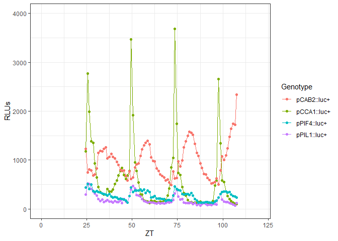
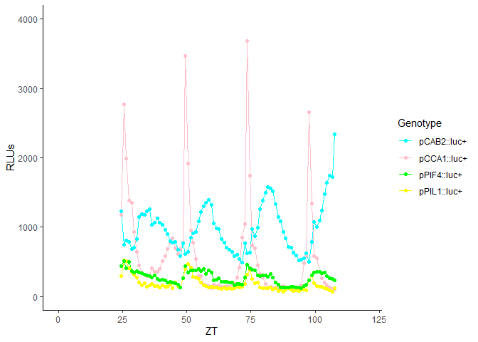

Challege_2
================

\#rebuilding figure

``` r
ggplot(lumi, aes(ZT, RLUs, line = Genotype, color = Genotype)) +
  geom_line() +
  geom_point() +
  theme_bw() +
  xlim(00.00, 120.00)+
  ylim(0, 4000)
```

<!-- -->
\#changing colors of figure

``` r
mycolors <- c("cyan", "pink", "green", "yellow")


ggplot(lumi, aes(ZT, RLUs, line = Genotype, color = Genotype)) +
  geom_line() +
  geom_point() +
  scale_color_manual(values = mycolors) +
  theme_classic() +
  xlim(00.00, 120.00)+
  ylim(0, 4000) 
```

<!-- -->
