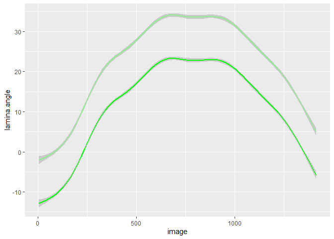

Untitled
================

``` r
#pet.angle over image
ggplot(df) +
  geom_line(aes(image,pet.angle,colour=plant))
```

<!-- -->

``` r
#leaf.angle over image
ggplot(df) +
  geom_line(aes(image,leaf.angle,colour=plant))
```

<!-- -->

``` r
#leaf.angle gives a smoother line
```

\#modifications

``` r
calc <- select(df, pixlen, pet.len, plant, image) %>%
  mutate(petinmm = 10*pet.len/pixlen)

#pet.angle over image
ggplot(calc) +
  geom_line(aes(image,petinmm,colour=plant))
```

<!-- -->

``` r
ggplot(calc) +
  geom_smooth(aes(image,petinmm,colour=plant))
```

    ## `geom_smooth()` using method = 'gam' and formula 'y ~ s(x, bs = "cs")'

<!-- -->

``` r
head(df)
```

    ##   image xpet ypet xleaf yleaf     m.int xmer ymer ld.thr light.thr dark.thr
    ## 1     5   88  311   256   343 0.4494187    5  334   0.35     0.225     0.06
    ## 2     6   88  311   256   343 0.4492669    5  334   0.35     0.225     0.06
    ## 3     7   88  311   256   343 0.4496357    5  334   0.35     0.225     0.06
    ## 4     8   88  311   256   343 0.4487699    5  334   0.35     0.225     0.06
    ## 5     9   88  311   254   338 0.4497911    5  334   0.35     0.225     0.06
    ## 6    10   88  311   256   343 0.4499110    5  334   0.35     0.225     0.06
    ##        xll      yll      xur      yur xpet.ldc ypet.ldc xleaf.ldc yleaf.ldc
    ## 1 328.7688 812.8752 813.0228 358.1189       88      311       256       343
    ## 2 328.7688 812.8752 813.0228 358.1189       88      311       256       343
    ## 3 328.7688 812.8752 813.0228 358.1189       88      311       256       343
    ## 4 328.7688 812.8752 813.0228 358.1189       88      311       256       343
    ## 5 328.7688 812.8752 813.0228 358.1189       88      311       254       338
    ## 6 328.7688 812.8752 813.0228 358.1189       88      311       256       343
    ##   xpet.ldc.1 ypet.ldc.1 xleaf.ldc.1 yleaf.ldc.1 win.size xpet.1 ypet.1 xleaf.1
    ## 1         88        311         256         343        9     88    311     256
    ## 2         88        311         256         343        9     88    311     256
    ## 3         88        311         256         343        9     88    311     256
    ## 4         88        311         256         343        9     88    311     256
    ## 5         88        311         256         343        9     88    311     256
    ## 6         88        311         256         343        9     88    311     256
    ##   yleaf.1   m.int.1 xpix ypix  pet.len pet.angle leaf.len leaf.angle lamina.len
    ## 1     343 0.4494187    5  334 86.12781  15.49636 251.1613  -2.054592   171.0205
    ## 2     343 0.4492669    5  334 86.12781  15.49636 251.1613  -2.054592   171.0205
    ## 3     343 0.4496357    5  334 86.12781  15.49636 251.1613  -2.054592   171.0205
    ## 4     343 0.4487699    5  334 86.12781  15.49636 251.1613  -2.054592   171.0205
    ## 5     343 0.4497911    5  334 86.12781  15.49636 251.1613  -2.054592   171.0205
    ## 6     343 0.4499110    5  334 86.12781  15.49636 251.1613  -2.054592   171.0205
    ##   lamina.angle   pixlen   plant
    ## 1    -10.78977 184.0872 Plant01
    ## 2    -10.78977 184.0872 Plant01
    ## 3    -10.78977 184.0872 Plant01
    ## 4    -10.78977 184.0872 Plant01
    ## 5    -10.78977 184.0872 Plant01
    ## 6    -10.78977 184.0872 Plant01

``` r
dfmm <- df %>%
  select(image, pet.len:plant) %>%
  mutate(petinmm = 10*pet.len/pixlen, leafleninmm = 10*leaf.len/pixlen, laminmm = 10*lamina.len/pixlen) 

#plots
ggplot(dfmm) +
  geom_line(aes(image,petinmm,colour=plant))
```

<!-- -->

``` r
ggplot(dfmm) +
  geom_line(aes(image,leafleninmm,colour=plant))
```

<!-- -->

``` r
ggplot(dfmm) +
  geom_line(aes(image,laminmm,colour=plant))
```

<!-- -->

``` r
ggplot(dfmm) +
  geom_line(aes(image,petinmm,colour=plant))+
  geom_smooth(aes(image,petinmm,colour=plant))
```

    ## `geom_smooth()` using method = 'gam' and formula 'y ~ s(x, bs = "cs")'

<!-- -->

``` r
ggplot(dfmm) +
  geom_line(aes(image,leafleninmm,colour=plant))+
   geom_smooth(aes(image,leafleninmm,colour=plant))
```

    ## `geom_smooth()` using method = 'gam' and formula 'y ~ s(x, bs = "cs")'

<!-- -->

``` r
ggplot(dfmm) +
  geom_line(aes(image,laminmm,colour=plant))+
  geom_smooth(aes(image,laminmm,colour=plant))
```

    ## `geom_smooth()` using method = 'gam' and formula 'y ~ s(x, bs = "cs")'

<!-- --> \#MEAN
pet.angle

``` r
by_image <- group_by(dfmm, image, plant, pet.angle)
summarise(by_image, mean.angle = mean(pet.angle, na.rm = TRUE))
```

    ## `summarise()` has grouped output by 'image', 'plant'. You can override using
    ## the `.groups` argument.

    ## # A tibble: 2,820 × 4
    ## # Groups:   image, plant [2,820]
    ##    image plant   pet.angle mean.angle
    ##    <int> <chr>       <dbl>      <dbl>
    ##  1     5 Plant01      15.5       15.5
    ##  2     5 Plant02      13.9       13.9
    ##  3     6 Plant01      15.5       15.5
    ##  4     6 Plant02      13.9       13.9
    ##  5     7 Plant01      15.5       15.5
    ##  6     7 Plant02      13.9       13.9
    ##  7     8 Plant01      15.5       15.5
    ##  8     8 Plant02      13.9       13.9
    ##  9     9 Plant01      15.5       15.5
    ## 10     9 Plant02      13.9       13.9
    ## # … with 2,810 more rows

``` r
by_plant <- group_by(dfmm, plant, pet.angle)
summarise(by_plant, mean.angle = mean(pet.angle, na.rm = TRUE))
```

    ## `summarise()` has grouped output by 'plant'. You can override using the
    ## `.groups` argument.

    ## # A tibble: 351 × 3
    ## # Groups:   plant [2]
    ##    plant   pet.angle mean.angle
    ##    <chr>       <dbl>      <dbl>
    ##  1 Plant01      7.13       7.13
    ##  2 Plant01      7.77       7.77
    ##  3 Plant01      8.31       8.31
    ##  4 Plant01      8.41       8.41
    ##  5 Plant01      8.94       8.94
    ##  6 Plant01      9.04       9.04
    ##  7 Plant01      9.57       9.57
    ##  8 Plant01      9.68       9.68
    ##  9 Plant01     10.1       10.1 
    ## 10 Plant01     10.2       10.2 
    ## # … with 341 more rows

\#baslines

``` r
head(dfmm)
```

    ##   image  pet.len pet.angle leaf.len leaf.angle lamina.len lamina.angle   pixlen
    ## 1     5 86.12781  15.49636 251.1613  -2.054592   171.0205    -10.78977 184.0872
    ## 2     6 86.12781  15.49636 251.1613  -2.054592   171.0205    -10.78977 184.0872
    ## 3     7 86.12781  15.49636 251.1613  -2.054592   171.0205    -10.78977 184.0872
    ## 4     8 86.12781  15.49636 251.1613  -2.054592   171.0205    -10.78977 184.0872
    ## 5     9 86.12781  15.49636 251.1613  -2.054592   171.0205    -10.78977 184.0872
    ## 6    10 86.12781  15.49636 251.1613  -2.054592   171.0205    -10.78977 184.0872
    ##     plant  petinmm leafleninmm  laminmm
    ## 1 Plant01 4.678642     13.6436 9.290187
    ## 2 Plant01 4.678642     13.6436 9.290187
    ## 3 Plant01 4.678642     13.6436 9.290187
    ## 4 Plant01 4.678642     13.6436 9.290187
    ## 5 Plant01 4.678642     13.6436 9.290187
    ## 6 Plant01 4.678642     13.6436 9.290187

``` r
means <- select(dfmm, -(image), -(pixlen:plant)) %>%
  summarise(mean.pet.len = mean(petinmm), mean.pet.angle = mean(pet.angle), mean.leaf.len = mean(leafleninmm), mean.leaf.angle = mean(leaf.angle), mean.lam.len = mean(laminmm), mean.lam.angle = mean(lamina.angle))  

dfmm
```

    ##      image   pet.len pet.angle leaf.len  leaf.angle lamina.len lamina.angle
    ## 1        5  86.12781 15.496357 251.1613 -2.05459215   171.0205  -10.7897678
    ## 2        6  86.12781 15.496357 251.1613 -2.05459215   171.0205  -10.7897678
    ## 3        7  86.12781 15.496357 251.1613 -2.05459215   171.0205  -10.7897678
    ## 4        8  86.12781 15.496357 251.1613 -2.05459215   171.0205  -10.7897678
    ## 5        9  86.12781 15.496357 251.1613 -2.05459215   171.0205  -10.7897678
    ## 6       10  86.12781 15.496357 251.1613 -2.05459215   171.0205  -10.7897678
    ## 7       11  86.12781 15.496357 251.1613 -2.05459215   171.0205  -10.7897678
    ## 8       12  86.12781 15.496357 251.1613 -2.05459215   171.0205  -10.7897678
    ## 9       13  86.12781 15.496357 251.1613 -2.05459215   171.0205  -10.7897678
    ## 10      14  86.12781 15.496357 251.1613 -2.05459215   171.0205  -10.7897678
    ## 11      15  86.12781 15.496357 251.1797 -2.16863015   171.1147  -10.9543138
    ## 12      16  86.12781 15.496357 251.1797 -2.16863015   171.1147  -10.9543138
    ## 13      17  86.12781 15.496357 251.1797 -2.16863015   171.1147  -10.9543138
    ## 14      18  86.12781 15.496357 251.1797 -2.16863015   171.1147  -10.9543138
    ## 15      19  86.12781 15.496357 251.2195 -2.39665373   171.3075  -11.2828557
    ## 16      20  86.12781 15.496357 251.1797 -2.16863015   171.1147  -10.9543138
    ## 17      21  86.12781 15.496357 251.1991 -2.28265098   171.2104  -11.1186772
    ## 18      22  86.12781 15.496357 252.2187 -2.38715422   172.2883  -11.2177895
    ## 19      23  86.12781 15.496357 251.1797 -2.16863015   171.1147  -10.9543138
    ## 20      24  86.12781 15.496357 251.1797 -2.16863015   171.1147  -10.9543138
    ## 21      25  86.12781 15.496357 251.1991 -2.28265098   171.2104  -11.1186772
    ## 22      26  86.12781 15.496357 251.1797 -2.16863015   171.1147  -10.9543138
    ## 23      27  86.12781 15.496357 251.1797 -2.16863015   171.1147  -10.9543138
    ## 24      28  86.12781 15.496357 251.1613 -2.05459215   171.0205  -10.7897678
    ## 25      29  86.12781 15.496357 251.1797 -2.16863015   171.1147  -10.9543138
    ## 26      30  86.12781 15.496357 251.1991 -2.28265098   171.2104  -11.1186772
    ## 27      31  86.12781 15.496357 251.1991 -2.28265098   171.2104  -11.1186772
    ## 28      32  86.12781 15.496357 251.1991 -2.28265098   171.2104  -11.1186772
    ## 29      33  86.12781 15.496357 250.1125 -1.71922958   169.7623  -10.3553774
    ## 30      34  86.12781 15.496357 251.1991 -2.28265098   171.2104  -11.1186772
    ## 31      35  86.12781 15.496357 250.1125 -1.71922958   169.7623  -10.3553774
    ## 32      36  86.12781 15.496357 251.1991 -2.28265098   171.2104  -11.1186772
    ## 33      37  86.12781 15.496357 249.0502 -1.15094654   168.3449   -9.5790841
    ## 34      38  86.12781 15.496357 249.0502 -1.15094654   168.3449   -9.5790841
    ## 35      39  86.12781 15.496357 250.0125 -0.57322930   168.9356   -8.6861016
    ## 36      40  86.40023 16.135756 252.2187 -2.38715422   172.4855  -11.5437940
    ## 37      41  86.40023 16.135756 251.1991 -2.28265098   171.4060  -11.4468469
    ## 38      42  86.40023 16.135756 251.1991 -2.28265098   171.4060  -11.4468469
    ## 39      43  86.40023 16.135756 250.1999 -2.29177187   170.4259  -11.5135676
    ## 40      44  86.12781 15.496357 251.1991 -2.28265098   171.2104  -11.1186772
    ## 41      45  86.12781 15.496357 251.1991 -2.28265098   171.2104  -11.1186772
    ## 42      46  86.12781 15.496357 251.1991 -2.28265098   171.2104  -11.1186772
    ## 43      47  86.12781 15.496357 251.1991 -2.28265098   171.2104  -11.1186772
    ## 44      48  86.12781 15.496357 251.1991 -2.28265098   171.2104  -11.1186772
    ## 45      49  86.12781 15.496357 251.1991 -2.28265098   171.2104  -11.1186772
    ## 46      50  86.12781 15.496357 251.1991 -2.28265098   171.2104  -11.1186772
    ## 47      51  86.12781 15.496357 251.1991 -2.28265098   171.2104  -11.1186772
    ## 48      52  86.40023 16.135756 251.1991 -2.28265098   171.4060  -11.4468469
    ## 49      53  86.40023 16.135756 251.1991 -2.28265098   171.4060  -11.4468469
    ## 50      54  86.40023 16.135756 251.1991 -2.28265098   171.4060  -11.4468469
    ## 51      55  86.40023 16.135756 251.1991 -2.28265098   171.4060  -11.4468469
    ## 52      56  86.40023 16.135756 251.1991 -2.28265098   171.4060  -11.4468469
    ## 53      57  86.40023 16.135756 251.1991 -2.28265098   171.4060  -11.4468469
    ## 54      58  86.40023 16.135756 251.1991 -2.28265098   171.4060  -11.4468469
    ## 55      59  86.40023 16.135756 251.1991 -2.28265098   171.4060  -11.4468469
    ## 56      60  86.40023 16.135756 251.1991 -2.28265098   171.4060  -11.4468469
    ## 57      61  86.40023 16.135756 251.1991 -2.28265098   171.4060  -11.4468469
    ## 58      62  86.40023 16.135756 251.1991 -2.28265098   171.4060  -11.4468469
    ## 59      63  85.44004 16.322127 251.1991 -2.28265098   172.3862  -11.3808850
    ## 60      64  85.44004 16.322127 251.1991 -2.28265098   172.3862  -11.3808850
    ## 61      65  85.44004 16.322127 251.1991 -2.28265098   172.3862  -11.3808850
    ## 62      66  85.44004 16.322127 251.1991 -2.28265098   172.3862  -11.3808850
    ## 63      67  85.44004 16.322127 251.1991 -2.28265098   172.3862  -11.3808850
    ## 64      68  85.44004 16.322127 251.1991 -2.28265098   172.3862  -11.3808850
    ## 65      69  84.48077 16.512733 250.2204 -2.40622911   172.4855  -11.5437940
    ## 66      70  84.48077 16.512733 250.2204 -2.40622911   172.4855  -11.5437940
    ## 67      71  84.48077 16.512733 249.2007 -2.30096591   171.4060  -11.4468469
    ## 68      72  84.48077 16.512733 250.2419 -2.52066716   172.5862  -11.7065142
    ## 69      73  84.48077 16.512733 250.2419 -2.52066716   172.5862  -11.7065142
    ## 70      74  84.48077 16.512733 250.2204 -2.40622911   172.4855  -11.5437940
    ## 71      75  84.48077 16.512733 249.0848 -1.49609182   170.7462  -10.2950589
    ## 72      76  84.48077 16.512733 248.0852 -1.50212169   169.7623  -10.3553774
    ## 73      77  84.48077 16.512733 249.0848 -1.49609182   170.7462  -10.2950589
    ## 74      78  84.77028 17.161122 249.0723 -1.38105421   170.8362  -10.4601379
    ## 75      79  85.72631 16.963913 249.0607 -1.26600548   169.7623  -10.3553774
    ## 76      80  85.72631 16.963913 249.0848 -1.49609182   169.9448  -10.6872049
    ## 77      81  85.44004 16.322127 248.0408 -1.04005435   168.4288   -9.7468893
    ## 78      82  85.44004 16.322127 247.0410 -1.04426416   167.4433   -9.8048193
    ## 79      83  85.44004 16.322127 248.0408 -1.04005435   168.4288   -9.7468893
    ## 80      84  85.44004 16.322127 248.0408 -1.04005435   168.4288   -9.7468893
    ## 81      85  85.44004 16.322127 247.0081 -0.46415861   167.0359   -8.9593361
    ## 82      86  86.40023 16.135756 248.0126 -0.57785181   167.1145   -9.1287596
    ## 83      87  86.40023 16.135756 247.0046 -0.34812228   165.9706   -8.8425072
    ## 84      88  86.40023 16.135756 248.0081 -0.46228708   167.0359   -8.9593361
    ## 85      89  86.40023 16.135756 248.0126 -0.57785181   167.1145   -9.1287596
    ## 86      90  86.40023 16.135756 248.0081 -0.46228708   167.0359   -8.9593361
    ## 87      91  86.40023 16.135756 248.0081 -0.46228708   167.0359   -8.9593361
    ## 88      92  86.40023 16.135756 248.0081 -0.46228708   167.0359   -8.9593361
    ## 89      93  86.40023 16.135756 249.0080 -0.46043059   168.0238   -8.9062311
    ## 90      94  87.36132 15.953484 249.0080 -0.46043059   167.0359   -8.9593361
    ## 91      95  87.09191 15.320585 249.0080 -0.46043059   166.8832   -8.6200182
    ## 92      96  87.09191 15.320585 249.0080 -0.46043059   166.8832   -8.6200182
    ## 93      97  87.09191 15.320585 249.0125 -0.57553127   166.9588   -8.7897547
    ## 94      98  87.09191 15.320585 250.0080 -0.45858894   167.8720   -8.5688627
    ## 95      99  87.09191 15.320585 250.0080 -0.45858894   167.8720   -8.5688627
    ## 96     100  87.09191 15.320585 250.0080 -0.45858894   167.8720   -8.5688627
    ## 97     101  87.09191 15.320585 250.0080 -0.45858894   167.8720   -8.5688627
    ## 98     102  88.05680 15.148664 250.0080 -0.45858894   166.8832   -8.6200182
    ## 99     103  88.05680 15.148664 250.0080 -0.45858894   166.8832   -8.6200182
    ## 100    104  88.05680 15.148664 250.0080 -0.45858894   166.8832   -8.6200182
    ## 101    105  88.05680 15.148664 251.0045 -0.34257465   167.7982   -8.3999525
    ## 102    106  88.05680 15.148664 251.0045 -0.34257465   167.7982   -8.3999525
    ## 103    107  88.05680 15.148664 251.0045 -0.34257465   167.7982   -8.3999525
    ## 104    108  88.05680 15.148664 251.0124 -0.57094567   167.9472   -8.7376232
    ## 105    109  88.05680 15.148664 251.0020 -0.22838461   167.7260   -8.2308952
    ## 106    110  88.05680 15.148664 251.0045 -0.34257465   167.7982   -8.3999525
    ## 107    111  88.05680 15.148664 252.0045 -0.34121526   168.7876   -8.3503639
    ## 108    112  88.76936 14.356610 252.0079 -0.45494950   167.7260   -8.2308952
    ## 109    113  88.76936 14.356610 252.0020 -0.22747833   167.5858   -7.8923505
    ## 110    114  88.76936 14.356610 252.0179 -0.68240634   167.8720   -8.5688627
    ## 111    115  88.76936 14.356610 252.0020 -0.22747833   167.5858   -7.8923505
    ## 112    116  88.76936 14.356610 252.0079 -0.45494950   167.7260   -8.2308952
    ## 113    117  88.76936 14.356610 252.0045 -0.34121526   167.6552   -8.0616936
    ## 114    118  88.76936 14.356610 252.0124 -0.56868016   167.7982   -8.3999525
    ## 115    119  88.76936 14.356610 252.0124 -0.56868016   167.7982   -8.3999525
    ## 116    120  88.76936 14.356610 253.0124 -0.56643256   168.7876   -8.3503639
    ## 117    121  88.76936 14.356610 253.0242 -0.79298081   168.9356   -8.6861016
    ## 118    122  88.76936 14.356610 254.0241 -0.78985923   169.9242   -8.6351795
    ## 119    123  88.76936 14.356610 254.0241 -0.78985923   169.9242   -8.6351795
    ## 120    124  88.76936 14.356610 254.0241 -0.78985923   169.9242   -8.6351795
    ## 121    125  88.76936 14.356610 254.0241 -0.78985923   169.9242   -8.6351795
    ## 122    126  88.76936 14.356610 254.0177 -0.67703357   169.8499   -8.4683388
    ## 123    127  88.76936 14.356610 254.0177 -0.67703357   169.8499   -8.4683388
    ## 124    128  89.49860 13.577318 254.0079 -0.45136737   168.5764   -7.8456806
    ## 125    129  89.49860 13.577318 254.0079 -0.45136737   168.5764   -7.8456806
    ## 126    130  89.49860 13.577318 254.0123 -0.56420266   168.6453   -8.0140484
    ## 127    131  89.49860 13.577318 255.0005 -0.11240150   169.3702   -7.2965532
    ## 128    132  89.26926 12.953076 256.0044 -0.33588390   170.3621   -7.2538390
    ## 129    133  89.26926 12.953076 256.0005 -0.11196244   170.2388   -6.9197975
    ## 130    134  89.05055 12.325694 256.0005  0.11196244   170.0096   -6.2503176
    ## 131    135  89.05055 12.325694 256.0020  0.22392402   169.9559   -6.0826726
    ## 132    136  89.05055 12.325694 256.0044  0.33588390   169.9036   -5.9149231
    ## 133    137  88.84256 11.695298 258.0005 -0.11109451   171.9978   -6.1777825
    ## 134    138  88.84256 11.695298 258.0005 -0.11109451   171.9978   -6.1777825
    ## 135    139  88.84256 11.695298 257.0005 -0.11152679   171.0037   -6.2138392
    ## 136    140  88.84256 11.695298 258.0005 -0.11109451   171.9978   -6.1777825
    ## 137    141  88.84256 11.695298 258.0005 -0.11109451   171.9978   -6.1777825
    ## 138    142  88.84256 11.695298 260.0005 -0.11023994   173.9864   -6.1069053
    ## 139    143  88.64536 11.062021 261.0019 -0.21963433   174.9286   -5.9091368
    ## 140    144  88.64536 11.062021 261.0019 -0.21963433   174.9286   -5.9091368
    ## 141    145  88.64536 11.062021 261.0043 -0.32944948   174.9807   -6.0720708
    ## 142    146  88.64536 11.062021 261.0043 -0.32944948   174.9807   -6.0720708
    ## 143    147  88.64536 11.062021 262.0005 -0.10939842   175.8728   -5.7134896
    ## 144    148  88.64536 11.062021 262.0005 -0.10939842   175.8728   -5.7134896
    ## 145    149  89.62700 10.939363 262.0005  0.10939842   174.7806   -5.4197697
    ## 146    150  89.62700 10.939363 262.0005  0.10939842   174.7806   -5.4197697
    ## 147    151  89.62700 10.939363 262.0005  0.10939842   174.7806   -5.4197697
    ## 148    152  89.62700 10.939363 262.0005  0.10939842   174.7806   -5.4197697
    ## 149    153  89.62700 10.939363 262.0043  0.32819207   174.6890   -5.0930798
    ## 150    154  89.62700 10.939363 262.0005  0.10939842   174.7806   -5.4197697
    ## 151    155  89.62700 10.939363 263.0005  0.10898246   175.7761   -5.3889823
    ## 152    156  89.62700 10.939363 263.0005  0.10898246   175.7761   -5.3889823
    ## 153    157  89.44272 10.310073 263.0019  0.21796412   175.6417   -4.9015773
    ## 154    158  89.44272 10.310073 263.0019  0.21796412   175.6417   -4.9015773
    ## 155    159  89.44272 10.310073 263.0019  0.21796412   175.6417   -4.9015773
    ## 156    160  89.44272 10.310073 263.0019  0.21796412   175.6417   -4.9015773
    ## 157    161  89.44272 10.310073 263.0043  0.32694422   175.5997   -4.7389475
    ## 158    162  89.44272 10.310073 264.0019  0.21713851   176.6380   -4.8738619
    ## 159    163  89.44272 10.310073 264.0019  0.21713851   176.6380   -4.8738619
    ## 160    164  89.44272 10.310073 264.0019  0.21713851   176.6380   -4.8738619
    ## 161    165  89.26926  9.678262 264.0043  0.32570582   176.5170   -4.3884826
    ## 162    166  89.26926  9.678262 264.0043  0.32570582   176.5170   -4.3884826
    ## 163    167  89.26926  9.678262 264.0043  0.32570582   176.5170   -4.3884826
    ## 164    168  89.26926  9.678262 264.0043  0.32570582   176.5170   -4.3884826
    ## 165    169  89.26926  9.678262 264.0076  0.43427079   176.4795   -4.2265459
    ## 166    170  89.26926  9.678262 264.0118  0.54283265   176.4433   -4.0645415
    ## 167    171  89.26926  9.678262 264.0118  0.54283265   176.4433   -4.0645415
    ## 168    172  90.25519  9.571538 264.0118  0.54283265   175.4459   -4.0876891
    ## 169    173  90.25519  9.571538 264.0118  0.54283265   175.4459   -4.0876891
    ## 170    174  90.25519  9.571538 265.0042  0.32447677   176.5170   -4.3884826
    ## 171    175  90.25519  9.571538 265.0118  0.54078434   176.4433   -4.0645415
    ## 172    176  90.25519  9.571538 265.0042  0.32447677   176.5170   -4.3884826
    ## 173    177  90.09439  8.944099 265.0118  0.54078434   176.3753   -3.7403402
    ## 174    178  90.09439  8.944099 265.0170  0.64893274   176.3434   -3.5781483
    ## 175    179  90.09439  8.944099 265.0170  0.64893274   176.3434   -3.5781483
    ## 176    180  90.09439  8.944099 265.0302  0.86521491   176.2839   -3.2535950
    ## 177    181  90.09439  8.944099 265.0231  0.75707652   176.3129   -3.4158991
    ## 178    182  89.94443  8.314492 266.0230  0.75423070   177.2548   -3.0738077
    ## 179    183  90.09439  8.944099 266.0569  1.18511919   177.2040   -2.7507745
    ## 180    184  89.44272 10.310073 265.0382  0.97334714   177.3732   -3.7192678
    ## 181    185  89.10668  9.044068 265.0302  0.86521491   177.2823   -3.2352523
    ## 182    186  88.95504  8.407633 265.0302  0.86521491   177.2287   -2.9123142
    ## 183    187  88.95504  8.407633 266.0301  0.86196271   178.2274   -2.8959808
    ## 184    188  88.81441  7.769105 266.0381  0.96968864   178.1579   -2.4139447
    ## 185    189  88.81441  7.769105 266.0569  1.18511919   178.1186   -2.0923931
    ## 186    190  88.81441  7.769105 266.0005  0.10775333   178.3711   -3.6984311
    ## 187    191  88.81441  7.769105 266.0042  0.32325695   178.3094   -3.3776075
    ## 188    192  88.68484  7.128630 266.0117  0.53875144   178.2028   -2.7353443
    ## 189    193  89.44272 10.310073 266.0042  0.32325695   178.5896   -4.6594319
    ## 190    194  89.62700 10.939363 267.0075  0.42939153   179.6274   -4.7925603
    ## 191    195  90.42677 10.196671 267.0117  0.53673376   178.5112   -4.3393631
    ## 192    196  90.60905 10.819362 267.0169  0.64407223   178.5497   -4.4994326
    ## 193    197  90.60905 10.819362 267.0117  0.53673376   178.5896   -4.6594319
    ## 194    198  90.60905 10.819362 267.0042  0.32204628   178.6736   -4.9792099
    ## 195    199  90.42677 10.196671 267.0169  0.64407223   178.4741   -4.1792257
    ## 196    200  90.60905 10.819362 267.0169  0.64407223   178.5497   -4.4994326
    ## 197    201  90.60905 10.819362 267.0117  0.53673376   178.5896   -4.6594319
    ## 198    202  90.25519  9.571538 267.0229  0.75140619   178.3711   -3.6984311
    ## 199    203  90.42677 10.196671 267.0117  0.53673376   178.5112   -4.3393631
    ## 200    204  90.60905 10.819362 268.0378  0.96245352   179.4359   -3.9966431
    ## 201    205  90.60905 10.819362 268.0378  0.96245352   179.4359   -3.9966431
    ## 202    206  90.60905 10.819362 267.1353  1.82433197   178.2028   -2.7353443
    ## 203    207  90.60905 10.819362 267.1053  1.60982502   178.2533   -3.0565719
    ## 204    208  90.60905 10.819362 267.1053  1.60982502   178.2533   -3.0565719
    ## 205    209  90.60905 10.819362 267.1053  1.60982502   178.2533   -3.0565719
    ## 206    210  90.60905 10.819362 267.1198  1.71708451   178.2274   -2.8959808
    ## 207    211  90.60905 10.819362 267.1198  1.71708451   178.2274   -2.8959808
    ## 208    212  90.60905 10.819362 268.0298  0.85553111   179.4714   -4.1559600
    ## 209    213  90.60905 10.819362 268.0229  0.74860275   179.5084   -4.3152125
    ## 210    214  90.60905 10.819362 268.0378  0.96245352   179.4359   -3.9966431
    ## 211    215  90.60905 10.819362 268.0378  0.96245352   179.4359   -3.9966431
    ## 212    216  90.42677 10.196671 268.0168  0.64166918   179.4714   -4.1559600
    ## 213    217  90.42677 10.196671 269.0376  0.95887630   180.3670   -3.6574495
    ## 214    218  90.42677 10.196671 269.0465  1.06539480   180.3358   -3.4988335
    ## 215    219  90.42677 10.196671 269.0669  1.27840901   180.2776   -3.1814430
    ## 216    220  90.42677 10.196671 269.0562  1.17190595   180.3060   -3.3401639
    ## 217    221  90.42677 10.196671 269.0465  1.06539480   180.3358   -3.4988335
    ## 218    222  90.42677 10.196671 268.0672  1.28317760   179.2791   -3.1991796
    ## 219    223  91.41116 10.085711 269.0669  1.27840901   179.2791   -3.1991796
    ## 220    224  91.41116 10.085711 269.1343  1.81077722   179.1571   -2.4004747
    ## 221    225  91.41116 10.085711 269.1189  1.70432563   179.1787   -2.5603003
    ## 222    226  91.41116 10.085711 269.1505  1.91721632   179.1368   -2.2406118
    ## 223    227  91.41116 10.085711 269.0785  1.38490324   179.2519   -3.0395281
    ## 224    228  91.41116 10.085711 269.1677  2.02364220   179.1180   -2.0807141
    ## 225    229  91.41116 10.085711 269.2048  2.23645136   179.0845   -1.7608238
    ## 226    230  91.41116 10.085711 270.0907  1.48586672   180.2249   -2.8638571
    ## 227    231  91.41116 10.085711 270.0782  1.37977595   180.2505   -3.0226732
    ## 228    232  91.41116 10.085711 269.2457  2.44919886   179.0566   -1.4408238
    ## 229    233  91.44397 13.283131 271.7370  4.22295981   182.0027   -0.3149685
    ## 230    234  91.67879 13.891710 273.0568  5.04500867   183.0109    0.6264761
    ## 231    235  91.92388 14.497112 273.3368  5.67175332   183.0437    1.2528025
    ## 232    236  91.92388 14.497112 272.7673  6.52907443   182.1757    2.5181523
    ## 233    237  92.44458 15.697951 274.0552  7.02485153   183.1973    2.6607169
    ## 234    238  92.44458 15.697951 274.4381  7.64680680   183.3610    3.5976499
    ## 235    239  91.76056 16.468364 274.7817  8.16372932   184.4587    4.0434057
    ## 236    240  91.76056 16.468364 275.2235  8.78226962   184.6943    4.9722615
    ## 237    241  92.04890 17.065617 275.5358  9.19349679   184.7837    5.2813235
    ## 238    242  92.04890 17.065617 275.9461  9.70618721   185.0304    6.0525947
    ## 239    243  92.04890 17.065617 275.3057 10.15176917   184.2586    6.7041525
    ## 240    244  92.65528 18.248652 275.5739 10.45892027   184.2010    6.5496112
    ## 241    245  92.65528 18.248652 275.9438 10.86750955   184.4397    7.1671809
    ## 242    246  92.65528 18.248652 276.2304 11.17322209   184.6327    7.6292712
    ## 243    247  92.97311 18.834258 276.5249 11.47829226   184.6998    7.7830829
    ## 244    248  92.02717 19.035256 276.8271 11.78270487   185.8985    8.1996405
    ## 245    249  92.35800 19.622041 276.1594 12.12988758   184.9811    8.3971822
    ## 246    250  92.69844 20.204577 276.4783 12.43396144   185.0547    8.5504098
    ## 247    251  92.35800 19.622041 276.8050 12.73732607   185.4427    9.3146623
    ## 248    252  92.69844 20.204577 277.1394 13.03996703   185.5243    9.4671216
    ## 249    253  93.04837 20.782791 277.4815 13.34187010   185.6071    9.6194459
    ## 250    254  93.04837 20.782791 277.9496 13.74323554   185.9516   10.2273535
    ## 251    255  93.04837 20.782791 277.2183 13.99320990   185.1486   10.5870027
    ## 252    256  93.04837 20.782791 277.4617 14.19368989   185.3348   10.8910484
    ## 253    257  93.04837 20.782791 277.7085 14.39381603   185.5263   11.1944751
    ## 254    258  93.40771 21.356614 277.8331 14.49374518   185.4299   11.0428400
    ## 255    259  93.40771 21.356614 278.2121 14.79299110   185.7229   11.4972677
    ## 256    260  93.40771 21.356614 277.5032 15.04544330   184.9459   11.8627612
    ## 257    261  93.40771 21.356614 277.8961 15.34427075   185.2600   12.3170070
    ## 258    262  93.77633 21.925982 278.0288 15.44369118   185.1540   12.1657633
    ## 259    263  92.84934 22.156412 278.5678 15.84041704   186.5610   12.7018040
    ## 260    264  93.23090 22.725933 278.5678 15.84041704   186.3438   12.4016940
    ## 261    265  93.23090 22.725933 278.9807 16.13694508   186.6715   12.8515951
    ## 262    266  93.23090 22.725933 279.1200 16.23559180   186.7833   13.0012079
    ## 263    267  93.23090 22.725933 278.1600 16.29318242   185.8090   13.0705804
    ## 264    268  93.23090 22.725933 278.4421 16.49079991   186.0376   13.3707424
    ## 265    269  93.23090 22.725933 278.4421 16.49079991   186.0376   13.3707424
    ## 266    270  93.23090 22.725933 278.5844 16.58945800   186.1538   13.5205449
    ## 267    271  93.23090 22.725933 278.7275 16.68801508   186.2713   13.6701595
    ## 268    272  93.23090 22.725933 278.7275 16.68801508   186.2713   13.6701595
    ## 269    273  93.23090 22.725933 278.7275 16.68801508   186.2713   13.6701595
    ## 270    274  93.23090 22.725933 278.7275 16.68801508   186.2713   13.6701595
    ## 271    275  93.23090 22.725933 278.4421 16.49079991   186.0376   13.3707424
    ## 272    276  93.23090 22.725933 278.3006 16.39204124   185.9227   13.2207536
    ## 273    277  93.23090 22.725933 278.4421 16.49079991   186.0376   13.3707424
    ## 274    278  94.15413 22.490836 279.2602 16.33413980   185.9227   13.2207536
    ## 275    279  94.15413 22.490836 279.1200 16.23559180   185.8090   13.0705804
    ## 276    280  94.15413 22.490836 278.9807 16.13694508   185.6967   12.9202243
    ## 277    281  94.15413 22.490836 278.8422 16.03820009   185.5856   12.7696871
    ## 278    282  93.77633 21.925982 278.8422 16.03820009   185.8090   13.0705804
    ## 279    283  93.77633 21.925982 278.5678 15.84041704   185.5856   12.7696871
    ## 280    284  93.77633 21.925982 278.5678 15.84041704   185.5856   12.7696871
    ## 281    285  93.77633 21.925982 279.3944 15.68574419   186.4517   12.5518364
    ## 282    286  93.77633 21.925982 279.2597 15.58692546   186.3438   12.4016940
    ## 283    287  93.77633 21.925982 278.9928 15.38900320   186.1317   12.1008917
    ## 284    288  93.77633 21.925982 278.9928 15.38900320   186.1317   12.1008917
    ## 285    289  93.77633 21.925982 278.9928 15.38900320   186.1317   12.1008917
    ## 286    290  93.40771 21.356614 278.7293 15.19070426   186.1317   12.1008917
    ## 287    291  93.40771 21.356614 278.7293 15.19070426   186.1317   12.1008917
    ## 288    292  93.40771 21.356614 278.7293 15.19070426   186.1317   12.1008917
    ## 289    293  93.40771 21.356614 278.7293 15.19070426   186.1317   12.1008917
    ## 290    294  93.40771 21.356614 278.4690 14.99203232   185.9247   11.7994115
    ## 291    295  93.40771 21.356614 278.3402 14.89255763   185.8232   11.6484216
    ## 292    296  93.40771 21.356614 278.2121 14.79299110   185.7229   11.4972677
    ## 293    297  93.40771 21.356614 278.2121 14.79299110   185.7229   11.4972677
    ## 294    298  93.40771 21.356614 277.9586 14.59358439   185.5263   11.1944751
    ## 295    299  92.47702 21.582248 276.9910 14.64570329   185.5263   11.1944751
    ## 296    300  92.47702 21.582248 276.8650 14.54553871   185.4299   11.0428400
    ## 297    301  92.47702 21.582248 276.9910 14.64570329   185.5263   11.1944751
    ## 298    302  92.47702 21.582248 276.9910 14.64570329   185.5263   11.1944751
    ## 299    303  92.47702 21.582248 276.9910 14.64570329   185.5263   11.1944751
    ## 300    304  92.47702 21.582248 276.9910 14.64570329   185.5263   11.1944751
    ## 301    305  92.47702 21.582248 276.9910 14.64570329   185.5263   11.1944751
    ## 302    306  92.47702 21.582248 276.9910 14.64570329   185.5263   11.1944751
    ## 303    307  92.47702 21.582248 276.9910 14.64570329   185.5263   11.1944751
    ## 304    308  92.47702 21.582248 276.9910 14.64570329   185.5263   11.1944751
    ## 305    309  92.84934 22.156412 276.9910 14.64570329   185.3348   10.8910484
    ## 306    310  92.84934 22.156412 277.2454 14.84575791   185.5263   11.1944751
    ## 307    311  92.84934 22.156412 277.3738 14.94564700   185.6239   11.3459516
    ## 308    312  92.84934 22.156412 277.6333 15.14514634   185.8232   11.6484216
    ## 309    313  92.84934 22.156412 278.0288 15.44369118   186.1317   12.1008917
    ## 310    314  93.23090 22.725933 278.1623 15.54301648   186.0276   11.9502354
    ## 311    315  92.30926 22.965729 278.5678 15.84041704   187.3206   12.3360035
    ## 312    316  92.30926 22.965729 278.5678 15.84041704   187.3206   12.3360035
    ## 313    317  92.70383 23.535140 278.0202 16.19422390   186.4517   12.5518364
    ## 314    318  92.70383 23.535140 278.3006 16.39204124   186.6715   12.8515951
    ## 315    319  92.70383 23.535140 278.5844 16.58945800   186.8964   13.1506406
    ## 316    320  92.70383 23.535140 279.0161 16.88482450   187.2432   13.5978420
    ## 317    321  93.10746 24.099670 278.2054 17.04323203   186.1538   13.5205449
    ## 318    322  93.10746 24.099670 278.5000 17.24003633   186.3900   13.8195845
    ## 319    323  93.10746 24.099670 278.7979 17.43642241   186.6313   14.1178590
    ## 320    324  92.61209 24.917401 279.0990 17.63238701   187.6013   14.0433629
    ## 321    325  92.61209 24.917401 279.4034 17.82792691   187.8463   14.3394214
    ## 322    326  92.61209 24.917401 279.5568 17.92553662   187.9707   14.4871592
    ## 323    327  92.61209 24.917401 278.9158 18.18432448   187.2565   14.8601123
    ## 324    328  93.03763 25.476260 279.2293 18.37937878   187.2565   14.8601123
    ## 325    329  93.03763 25.476260 278.4390 18.54195651   186.4196   15.0875515
    ## 326    330  93.03763 25.476260 278.7584 18.73693633   186.6822   15.3840503
    ## 327    331  93.47192 26.029979 279.4070 19.12554717   186.9499   15.6797080
    ## 328    332  93.47192 26.029979 279.5711 19.22241676   187.0855   15.8272177
    ## 329    333  93.47192 26.029979 279.9018 19.41581374   187.3606   16.1215912
    ## 330    334  93.47192 26.029979 279.2938 19.67759932   186.6815   16.5018282
    ## 331    335  93.02150 26.854123 279.6319 19.87064118   187.6406   16.4150939
    ## 332    336  93.02150 26.854123 279.0340 20.13365798   186.9679   16.7958160
    ## 333    337  93.02150 26.854123 279.2065 20.23004792   187.1129   16.9424705
    ## 334    338  93.02150 26.854123 279.5537 20.42246974   187.4066   17.2350938
    ## 335    339  93.47727 27.401313 279.7284 20.51850098   187.2592   17.0888969
    ## 336    340  93.47727 27.401313 279.7284 20.51850098   187.2592   17.0888969
    ## 337    341  93.47727 27.401313 279.9040 20.61441202   187.4066   17.2350938
    ## 338    342  93.47727 27.401313 279.9040 20.61441202   187.4066   17.2350938
    ## 339    343  93.47727 27.401313 279.9040 20.61441202   187.4066   17.2350938
    ## 340    344  93.47727 27.401313 279.9040 20.61441202   187.4066   17.2350938
    ## 341    345  93.47727 27.401313 279.9040 20.61441202   187.4066   17.2350938
    ## 342    346  93.47727 27.401313 279.9040 20.61441202   187.4066   17.2350938
    ## 343    347  93.47727 27.401313 279.9040 20.61441202   187.4066   17.2350938
    ## 344    348  93.02150 26.854123 279.5537 20.42246974   187.4066   17.2350938
    ## 345    349  93.02150 26.854123 279.7284 20.51850098   187.5553   17.3810599
    ## 346    350  93.02150 26.854123 279.5537 20.42246974   187.4066   17.2350938
    ## 347    351  93.02150 26.854123 279.5537 20.42246974   187.4066   17.2350938
    ## 348    352  93.02150 26.854123 279.3797 20.32631861   187.2592   17.0888969
    ## 349    353  93.02150 26.854123 279.2065 20.23004792   187.1129   16.9424705
    ## 350    354  93.02150 26.854123 279.0340 20.13365798   186.9679   16.7958160
    ## 351    355  93.02150 26.854123 278.8624 20.03714913   186.8241   16.6489347
    ## 352    356  93.02150 26.854123 278.6916 19.94052168   186.6815   16.5018282
    ## 353    357  92.57429 26.301596 279.4624 19.77417865   187.7825   16.5615151
    ## 354    358  92.57429 26.301596 279.2938 19.67759932   187.6406   16.4150939
    ## 355    359  92.57429 26.301596 279.2938 19.67759932   187.6406   16.4150939
    ## 356    360  93.47192 26.029979 279.9018 19.41581374   187.3606   16.1215912
    ## 357    361  93.47192 26.029979 279.5711 19.22241676   187.0855   15.8272177
    ## 358    362  93.47192 26.029979 279.7360 19.31917241   187.2225   15.9745126
    ## 359    363  93.47192 26.029979 279.4070 19.12554717   186.9499   15.6797080
    ## 360    364  93.47192 26.029979 279.4070 19.12554717   186.9499   15.6797080
    ## 361    365  93.03763 25.476260 279.0811 18.93146752   186.9499   15.6797080
    ## 362    366  93.03763 25.476260 278.7584 18.73693633   186.6822   15.3840503
    ## 363    367  93.03763 25.476260 278.7584 18.73693633   186.6822   15.3840503
    ## 364    368  93.03763 25.476260 278.5983 18.63950231   186.5503   15.2359053
    ## 365    369  93.03763 25.476260 279.3873 18.47674120   187.3853   15.0079617
    ## 366    370  92.61209 24.917401 279.2293 18.37937878   187.5153   15.1556070
    ## 367    371  92.61209 24.917401 279.8660 18.12043359   188.2233   14.7820441
    ## 368    372  92.61209 24.917401 279.7110 18.02303897   188.0964   14.6347006
    ## 369    373  92.61209 24.917401 279.5568 17.92553662   187.9707   14.4871592
    ## 370    374  92.19544 24.353436 279.4034 17.82792691   188.0964   14.6347006
    ## 371    375  92.19544 24.353436 279.4034 17.82792691   188.0964   14.6347006
    ## 372    376  93.10746 24.099670 279.2508 17.73021025   187.0027   14.5638075
    ## 373    377  93.10746 24.099670 279.0990 17.63238701   186.8776   14.4153553
    ## 374    378  93.10746 24.099670 278.7979 17.43642241   186.6313   14.1178590
    ## 375    379  92.70383 23.535140 278.6485 17.33828185   186.7538   14.2667053
    ## 376    380  92.70383 23.535140 279.4553 17.17927051   187.6013   14.0433629
    ## 377    381  92.70383 23.535140 279.3081 17.08122481   187.4807   13.8950454
    ## 378    382  92.70383 23.535140 279.1617 16.98307601   187.3613   13.7465379
    ## 379    383  92.70383 23.535140 279.0161 16.88482450   187.2432   13.5978420
    ## 380    384  92.70383 23.535140 279.9732 16.82538404   188.2153   13.5262714
    ## 381    385  92.70383 23.535140 279.8290 16.72733605   188.0990   13.3781141
    ## 382    386  92.70383 23.535140 279.8290 16.72733605   188.0990   13.3781141
    ## 383    387  92.70383 23.535140 279.5429 16.53093793   187.8703   13.0812545
    ## 384    388  92.70383 23.535140 279.6855 16.62918720   187.9840   13.2297746
    ## 385    389  92.70383 23.535140 279.5429 16.53093793   187.8703   13.0812545
    ## 386    390  92.70383 23.535140 278.5844 16.58945800   186.8964   13.1506406
    ## 387    391  92.70383 23.535140 278.5844 16.58945800   186.8964   13.1506406
    ## 388    392  92.70383 23.535140 279.5429 16.53093793   187.8703   13.0812545
    ## 389    393  92.70383 23.535140 279.4011 16.43258865   187.7578   12.9325554
    ## 390    394  92.70383 23.535140 279.5429 16.53093793   187.8703   13.0812545
    ## 391    395  92.70383 23.535140 279.5429 16.53093793   187.8703   13.0812545
    ## 392    396  92.70383 23.535140 279.8290 16.72733605   188.0990   13.3781141
    ## 393    397  93.10746 24.099670 279.8290 16.72733605   187.8703   13.0812545
    ## 394    398  93.10746 24.099670 280.2642 17.02117582   188.2153   13.5262714
    ## 395    399  93.10746 24.099670 280.2642 17.02117582   188.2153   13.5262714
    ## 396    400  93.10746 24.099670 280.5584 17.21655923   188.4516   13.8220325
    ## 397    401  93.52005 24.659272 280.0522 17.57041403   187.6013   14.0433629
    ## 398    402  93.52005 24.659272 280.2035 17.66793809   187.7232   14.1914887
    ## 399    403  93.03763 25.476260 280.6622 17.95987555   188.8154   14.2642667
    ## 400    404  93.03763 25.476260 280.0219 18.21772008   188.0964   14.6347006
    ## 401    405  93.03763 25.476260 280.4942 18.50892705   188.4808   15.0761311
    ## 402    406  93.47192 26.029979 280.8131 18.70251755   188.4808   15.0761311
    ## 403    407  93.47192 26.029979 281.1352 18.89566667   188.7432   15.3694079
    ## 404    408  93.91486 26.578525 280.6800 19.25163804   187.9129   15.5973032
    ## 405    409  93.91486 26.578525 280.0683 19.51234043   187.2225   15.9745126
    ## 406    410  93.91486 26.578525 280.4037 19.70504849   187.5000   16.2684521
    ## 407    411  93.91486 26.578525 280.5726 19.80122918   187.6406   16.4150939
    ## 408    412  93.47727 27.401313 280.9128 19.99324224   188.6001   16.3292420
    ## 409    413  93.47727 27.401313 280.9128 19.99324224   188.6001   16.3292420
    ## 410    414  93.47727 27.401313 281.0841 20.08907396   188.7412   16.4749834
    ## 411    415  92.59050 27.686114 280.4911 20.35119045   189.0271   16.7658089
    ## 412    416  92.59050 27.686114 280.4911 20.35119045   189.0271   16.7658089
    ## 413    417  92.59050 27.686114 280.4911 20.35119045   189.0271   16.7658089
    ## 414    418  91.70605 27.976415 280.6653 20.44694536   190.1289   16.8232302
    ## 415    419  91.70605 27.976415 279.7284 20.51850098   189.1719   16.9108901
    ## 416    420  91.70605 27.976415 279.7284 20.51850098   189.1719   16.9108901
    ## 417    421  90.82401 28.272362 280.0803 20.71020256   190.4206   17.1114037
    ## 418    422  90.82401 28.272362 280.0803 20.71020256   190.4206   17.1114037
    ## 419    423  91.70605 27.976415 280.2575 20.80587229   189.6134   17.3447917
    ## 420    424  92.17917 28.525708 280.6141 20.99684808   189.6134   17.3447917
    ## 421    425  92.17917 28.525708 280.6141 20.99684808   189.6134   17.3447917
    ## 422    426  92.17917 28.525708 280.6141 20.99684808   189.6134   17.3447917
    ## 423    427  92.17917 28.525708 280.7935 21.09215356   189.7630   17.4889737
    ## 424    428  93.05912 28.231668 280.7935 21.09215356   188.8094   17.5801712
    ## 425    429  92.17917 28.525708 280.7935 21.09215356   189.7630   17.4889737
    ## 426    430  92.17917 28.525708 280.9738 21.18733702   189.9138   17.6329278
    ## 427    431  91.30170 28.825407 280.9738 21.18733702   190.8671   17.5419944
    ## 428    432  92.17917 28.525708 280.9738 21.18733702   189.9138   17.6329278
    ## 429    433  92.17917 28.525708 280.6141 20.99684808   189.6134   17.3447917
    ## 430    434  92.59050 27.686114 280.7935 21.09215356   189.1137   17.8691530
    ## 431    435  92.17917 28.525708 280.6141 20.99684808   189.6134   17.3447917
    ## 432    436  93.05912 28.231668 280.6141 20.99684808   188.6591   17.4353325
    ## 433    437  92.17917 28.525708 280.6141 20.99684808   189.6134   17.3447917
    ## 434    438  91.70605 27.976415 280.6141 20.99684808   189.9138   17.6329278
    ## 435    439  91.70605 27.976415 280.6141 20.99684808   189.9138   17.6329278
    ## 436    440  91.70605 27.976415 280.6141 20.99684808   189.9138   17.6329278
    ## 437    441  91.70605 27.976415 281.5480 20.92392798   190.8671   17.5419944
    ## 438    442  91.70605 27.976415 281.5480 20.92392798   190.8671   17.5419944
    ## 439    443  90.82401 28.272362 281.3699 20.82877140   191.6716   17.3093023
    ## 440    444  91.70605 27.976415 281.5480 20.92392798   190.8671   17.5419944
    ## 441    445  89.47067 28.011348 281.3699 20.82877140   192.9249   17.5046320
    ## 442    446  91.24144 27.421477 281.1925 20.73349454   190.8671   17.5419944
    ## 443    447  91.24144 27.421477 281.7770 20.47122787   191.5235   17.1664179
    ## 444    448  91.24144 27.421477 281.6026 20.37586596   191.3766   17.0233134
    ## 445    449  90.35486 27.713522 281.2561 20.18478869   192.0443   16.6505325
    ## 446    450  91.24144 27.421477 281.0841 20.08907396   190.9431   16.5926910
    ## 447    451  91.24144 27.421477 280.7423 19.89729388   190.6600   16.3045319
    ## 448    452  90.78546 26.860911 281.3454 19.63638101   191.6201   16.2205867
    ## 449    453  90.78546 26.860911 281.0111 19.44423730   191.3433   15.9329076
    ## 450    454  90.78546 26.860911 280.8452 19.34799444   191.2067   15.7887575
    ## 451    455  91.67879 26.578525 281.6243 19.18455648   191.0713   15.6444023
    ## 452    456  89.89438 27.148903 281.4605 19.08837153   192.8652   15.3410621
    ## 453    457  91.23596 26.016535 281.2974 18.99207481   191.0713   15.6444023
    ## 454    458  91.23596 26.016535 281.2974 18.99207481   191.0713   15.6444023
    ## 455    459  91.23596 26.016535 281.2974 18.99207481   191.0713   15.6444023
    ## 456    460  91.23596 26.016535 281.2974 18.99207481   191.0713   15.6444023
    ## 457    461  91.23596 26.016535 281.2974 18.99207481   191.0713   15.6444023
    ## 458    462  91.23596 26.016535 281.2974 18.99207481   191.0713   15.6444023
    ## 459    463  91.23596 26.016535 281.1352 18.89566667   190.9372   15.4998433
    ## 460    464  90.33825 26.294741 281.1352 18.89566667   191.9010   15.4200538
    ## 461    465  90.33825 26.294741 281.1352 18.89566667   191.9010   15.4200538
    ## 462    466  90.33825 26.294741 281.1352 18.89566667   191.9010   15.4200538
    ## 463    467  90.33825 26.294741 281.1352 18.89566667   191.9010   15.4200538
    ## 464    468  90.33825 26.294741 281.1352 18.89566667   191.9010   15.4200538
    ## 465    469  90.33825 26.294741 281.1352 18.89566667   191.9010   15.4200538
    ## 466    470  90.33825 26.294741 281.2974 18.99207481   192.0345   15.5639431
    ## 467    471  90.33825 26.294741 281.4605 19.08837153   192.1692   15.7076316
    ## 468    472  90.33825 26.294741 281.1352 18.89566667   191.9010   15.4200538
    ## 469    473  90.33825 26.294741 281.2974 18.99207481   192.0345   15.5639431
    ## 470    474  91.67879 26.578525 281.6243 19.18455648   191.0713   15.6444023
    ## 471    475  91.67879 26.578525 282.4057 19.02202169   191.9010   15.4200538
    ## 472    476  90.78546 26.860911 282.4057 19.02202169   192.8652   15.3410621
    ## 473    477  90.78546 26.860911 282.7331 19.21371404   193.1321   15.6273145
    ## 474    478  90.78546 26.860911 282.7331 19.21371404   193.1321   15.6273145
    ## 475    479  92.57429 26.301596 282.5690 19.11792338   191.0713   15.6444023
    ## 476    480  91.67879 26.578525 282.7331 19.21371404   192.1692   15.7076316
    ## 477    481  90.78546 26.860911 283.0636 19.40496088   193.4037   15.9127700
    ## 478    482  90.78546 26.860911 282.1205 19.47243731   192.4422   15.9944007
    ## 479    483  92.57429 26.301596 282.1205 19.47243731   190.5203   16.1601332
    ## 480    484  92.57429 26.301596 282.2875 19.56817177   190.6600   16.3045319
    ## 481    485  91.67879 26.578525 282.1205 19.47243731   191.4811   16.0768511
    ## 482    486  91.67879 26.578525 282.2875 19.56817177   191.6201   16.2205867
    ## 483    487  91.67879 26.578525 282.6239 19.75929997   191.9017   16.5074287
    ## 484    488  91.67879 26.578525 282.6239 19.75929997   191.9017   16.5074287
    ## 485    489  91.67879 26.578525 283.1342 20.04513557   192.3330   16.9360989
    ## 486    490  91.67879 26.578525 283.1342 20.04513557   192.3330   16.9360989
    ## 487    491  93.02150 26.854123 282.3672 20.21005226   190.2741   16.9674274
    ## 488    492  93.02150 26.854123 282.7141 20.40034744   190.5682   17.2551578
    ## 489    493  93.02150 26.854123 283.0640 20.59017419   190.8671   17.5419944
    ## 490    494  93.02150 26.854123 283.4171 20.77953006   191.1707   17.8279269
    ## 491    495  93.02150 26.854123 283.5948 20.87403068   191.3243   17.9705511
    ## 492    496  93.02150 26.854123 282.8396 21.04090591   190.5289   18.2064383
    ## 493    497  93.47727 27.401313 283.0194 21.13543391   190.3733   18.0634090
    ## 494    498  92.59050 27.686114 282.2680 21.30334577   190.5289   18.2064383
    ## 495    499  92.59050 27.686114 283.9300 21.60626390   192.1100   18.6802027
    ## 496    500  92.17917 28.525708 283.3712 21.86881560   192.1100   18.6802027
    ## 497    501  93.05912 28.231668 283.7450 22.05632168   191.4869   19.0596538
    ## 498    502  93.05912 28.231668 283.3867 22.41349228   191.0393   19.5830536
    ## 499    503  93.53609 28.771707 284.1549 22.78652134   191.3766   19.8652852
    ## 500    504  94.02127 29.306219 283.6230 23.05112192   190.4363   19.9675245
    ## 501    505  93.53609 28.771707 284.0158 23.23685964   191.1282   20.5313675
    ## 502    506  94.02127 29.306219 282.5774 23.58328303   189.2564   20.7437278
    ## 503    507  94.89468 29.010667 283.1806 23.86159677   188.8604   21.2770003
    ## 504    508  94.02127 29.306219 283.5864 24.04647870   190.1559   21.4485940
    ## 505    509  94.02127 29.306219 283.4965 24.49818994   189.9691   22.1206626
    ## 506    510  94.51455 29.835198 284.1215 24.77361523   190.1578   22.2603087
    ## 507    511  95.01579 30.358639 283.6353 25.04179217   189.2327   22.3750092
    ## 508    512  95.01579 30.358639 284.0599 25.22464704   189.6154   22.6545936
    ## 509    513  94.66784 31.187160 282.8979 25.67227927   188.8869   22.9114817
    ## 510    514  95.52487 30.876545 283.3324 25.85465109   188.3594   23.3102609
    ## 511    515  95.52487 30.876545 283.9894 26.12715799   188.9577   23.7282186
    ## 512    516  95.52487 30.876545 284.4310 26.30812717   189.3621   24.0053803
    ## 513    517  96.04166 31.388918 283.7574 26.48817895   188.2452   23.9901029
    ## 514    518  96.04166 31.388918 284.2046 26.66872960   188.6538   24.2677439
    ## 515    519  95.18929 31.702439 283.5366 26.84977652   188.8597   24.4061122
    ## 516    520  95.18929 31.702439 283.3112 26.75950294   188.6538   24.2677439
    ## 517    521  95.18929 31.702439 283.9894 27.02989273   189.2749   24.6819416
    ## 518    522  95.71834 32.212064 284.4451 27.20943366   189.2749   24.6819416
    ## 519    523  95.71834 32.212064 284.4451 27.20943366   189.2749   24.6819416
    ## 520    524  95.71834 32.212064 283.7856 27.39158914   188.5769   24.9469421
    ## 521    525  95.71834 32.212064 283.7856 27.39158914   188.5769   24.9469421
    ## 522    526  96.25487 32.716047 283.7856 27.39158914   188.1575   24.6706741
    ## 523    527  95.71834 32.212064 283.7856 27.39158914   188.5769   24.9469421
    ## 524    528  96.25487 32.716047 284.2468 27.57067372   188.5769   24.9469421
    ## 525    529  96.25487 32.716047 284.2468 27.57067372   188.5769   24.9469421
    ## 526    530  95.41488 33.040618 282.9421 27.93775297   188.0964   25.3517838
    ## 527    531  95.41488 33.040618 282.9421 27.93775297   188.0964   25.3517838
    ## 528    532  95.41488 33.040618 282.7083 27.84817178   187.8829   25.2139060
    ## 529    533  95.41488 33.040618 282.9421 27.93775297   188.0964   25.3517838
    ## 530    534  95.41488 33.040618 282.9421 27.93775297   188.0964   25.3517838
    ## 531    535  95.41488 33.040618 282.9421 27.93775297   188.0964   25.3517838
    ## 532    536  95.41488 33.040618 282.9421 27.93775297   188.0964   25.3517838
    ## 533    537  95.41488 33.040618 283.1766 28.02718601   188.3109   25.4893483
    ## 534    538  95.41488 33.040618 283.4118 28.11647085   188.5265   25.6265989
    ## 535    539  95.41488 33.040618 283.1766 28.02718601   188.3109   25.4893483
    ## 536    540  96.25487 32.716047 283.1766 28.02718601   187.4086   25.6209202
    ## 537    541  95.41488 33.040618 283.1766 28.02718601   188.3109   25.4893483
    ## 538    542  95.41488 33.040618 283.1766 28.02718601   188.3109   25.4893483
    ## 539    543  95.41488 33.040618 282.9421 27.93775297   188.0964   25.3517838
    ## 540    544  95.41488 33.040618 282.9421 27.93775297   188.0964   25.3517838
    ## 541    545  95.41488 33.040618 282.9421 27.93775297   188.0964   25.3517838
    ## 542    546  95.41488 33.040618 282.9421 27.93775297   188.0964   25.3517838
    ## 543    547  95.41488 33.040618 282.7083 27.84817178   187.8829   25.2139060
    ## 544    548  95.41488 33.040618 282.7083 27.84817178   187.8829   25.2139060
    ## 545    549  94.87360 32.534004 282.7083 27.84817178   188.3109   25.4893483
    ## 546    550  94.87360 32.534004 282.7083 27.84817178   188.3109   25.4893483
    ## 547    551  94.87360 32.534004 282.7083 27.84817178   188.3109   25.4893483
    ## 548    552  94.87360 32.534004 282.7083 27.84817178   188.3109   25.4893483
    ## 549    553  94.87360 32.534004 282.7083 27.84817178   188.3109   25.4893483
    ## 550    554  94.87360 32.534004 283.1289 27.57459137   188.7882   25.0846142
    ## 551    555  94.87360 32.534004 283.1289 27.57459137   188.7882   25.0846142
    ## 552    556  94.87360 32.534004 283.1289 27.57459137   188.7882   25.0846142
    ## 553    557  94.87360 32.534004 282.8979 27.48477144   188.5769   24.9469421
    ## 554    558  94.03191 32.861718 282.8979 27.48477144   189.4842   24.8194014
    ## 555    559  95.71834 32.212064 283.5560 27.30182881   188.3667   24.8089619
    ## 556    560  95.71834 32.212064 283.7856 27.39158914   188.5769   24.9469421
    ## 557    561  95.71834 32.212064 283.3271 27.21192323   188.1575   24.6706741
    ## 558    562  94.87360 32.534004 283.5560 27.30182881   189.2749   24.6819416
    ## 559    563  96.25487 32.716047 283.0989 27.12187250   187.5367   24.2539715
    ## 560    564  95.18929 31.702439 283.0989 27.12187250   188.3667   24.8089619
    ## 561    565  93.81365 31.503440 283.3271 27.21192323   189.9059   25.0934084
    ## 562    566  94.33981 32.021617 283.0989 27.12187250   189.2749   24.6819416
    ## 563    567  94.33981 32.021617 283.9894 27.02989273   190.1841   24.5561352
    ## 564    568  94.33981 32.021617 283.9894 27.02989273   190.1841   24.5561352
    ## 565    569  94.33981 32.021617 283.5366 26.84977652   189.7709   24.2813541
    ## 566    570  94.33981 32.021617 283.5366 26.84977652   189.7709   24.2813541
    ## 567    571  94.33981 32.021617 283.5366 26.84977652   189.7709   24.2813541
    ## 568    572  94.33981 32.021617 283.5366 26.84977652   189.7709   24.2813541
    ## 569    573  94.33981 32.021617 283.3112 26.75950294   189.5660   24.1435160
    ## 570    574  94.33981 32.021617 283.0866 26.66908585   189.3621   24.0053803
    ## 571    575  94.33981 32.021617 283.0866 26.66908585   189.3621   24.0053803
    ## 572    576  94.33981 32.021617 283.9806 26.57852536   190.2761   23.8828745
    ## 573    577  94.33981 32.021617 283.5348 26.39769050   189.8736   23.6067882
    ## 574    578  94.33981 32.021617 283.3130 26.30706011   189.6741   23.4683073
    ## 575    579  94.33981 32.021617 283.7574 26.48817895   190.0743   23.7449775
    ## 576    580  93.81365 31.503440 283.5348 26.39769050   190.2761   23.8828745
    ## 577    581  93.81365 31.503440 283.5348 26.39769050   190.2761   23.8828745
    ## 578    582  93.81365 31.503440 283.5348 26.39769050   190.2761   23.8828745
    ## 579    583  93.81365 31.503440 283.5348 26.39769050   190.2761   23.8828745
    ## 580    584  93.81365 31.503440 283.3130 26.30706011   190.0743   23.7449775
    ## 581    585  93.81365 31.503440 283.0919 26.21628790   189.8736   23.6067882
    ## 582    586  93.81365 31.503440 283.9894 26.12715799   190.7905   23.4865243
    ## 583    587  93.81365 31.503440 283.9894 26.12715799   190.7905   23.4865243
    ## 584    588  93.29523 30.979462 283.9894 26.12715799   191.1910   23.7615406
    ## 585    589  93.81365 31.503440 283.9894 26.12715799   190.7905   23.4865243
    ## 586    590  93.81365 31.503440 283.5507 25.94562696   190.3943   23.2103572
    ## 587    591  93.81365 31.503440 283.3324 25.85465109   190.1979   23.0718438
    ## 588    592  93.29523 30.979462 283.5507 25.94562696   190.7905   23.4865243
    ## 589    593  93.81365 31.503440 283.5507 25.94562696   190.3943   23.2103572
    ## 590    594  92.96236 31.825523 283.5507 25.94562696   191.3139   23.0923240
    ## 591    595  94.66784 31.187160 283.5507 25.94562696   189.4756   23.3295355
    ## 592    596  92.96236 31.825523 283.3324 25.85465109   191.1184   22.9543565
    ## 593    597  93.81365 31.503440 284.0158 25.67584658   190.9241   22.8161073
    ## 594    598  94.66784 31.187160 284.2327 25.76674081   190.1979   23.0718438
    ## 595    599  94.66784 31.187160 283.7997 25.58481364   189.8085   22.7939613
    ## 596    600  94.66784 31.187160 284.0158 25.67584658   190.0026   22.9330450
    ## 597    601  94.66784 31.187160 283.5842 25.49364214   189.6154   22.6545936
    ## 598    602  94.66784 31.187160 283.7997 25.58481364   189.8085   22.7939613
    ## 599    603  94.66784 31.187160 283.5842 25.49364214   189.6154   22.6545936
    ## 600    604  93.81365 31.503440 283.7997 25.58481364   190.7308   22.6775771
    ## 601    605  93.81365 31.503440 283.5842 25.49364214   190.5387   22.5387668
    ## 602    606  93.81365 31.503440 283.5842 25.49364214   190.5387   22.5387668
    ## 603    607  93.81365 31.503440 283.5842 25.49364214   190.5387   22.5387668
    ## 604    608  93.81365 31.503440 284.4873 25.40695433   191.4628   22.4240575
    ## 605    609  93.81365 31.503440 284.4873 25.40695433   191.4628   22.4240575
    ## 606    610  93.81365 31.503440 284.4873 25.40695433   191.4628   22.4240575
    ## 607    611  93.81365 31.503440 284.4873 25.40695433   191.4628   22.4240575
    ## 608    612  94.66784 31.187160 284.4873 25.40695433   190.5387   22.5387668
    ## 609    613  94.66784 31.187160 284.7020 25.49790225   190.7308   22.6775771
    ## 610    614  94.66784 31.187160 283.7997 25.58481364   189.8085   22.7939613
    ## 611    615  94.66784 31.187160 284.0158 25.67584658   190.0026   22.9330450
    ## 612    616  94.66784 31.187160 284.0158 25.67584658   190.0026   22.9330450
    ## 613    617  93.81365 31.503440 283.7997 25.58481364   190.7308   22.6775771
    ## 614    618  93.81365 31.503440 283.7997 25.58481364   190.7308   22.6775771
    ## 615    619  93.81365 31.503440 284.4503 25.85749620   191.3139   23.0923240
    ## 616    620  93.81365 31.503440 284.4503 25.85749620   191.3139   23.0923240
    ## 617    621  94.33981 32.021617 284.2327 25.76674081   190.7308   22.6775771
    ## 618    622  94.33981 32.021617 283.7697 26.03646264   190.1979   23.0718438
    ## 619    623  94.33981 32.021617 283.9894 26.12715799   190.3943   23.2103572
    ## 620    624  94.33981 32.021617 283.7697 26.03646264   190.1979   23.0718438
    ## 621    625  94.33981 32.021617 284.2099 26.21771287   190.5918   23.3485842
    ## 622    626  94.33981 32.021617 284.2099 26.21771287   190.5918   23.3485842
    ## 623    627  94.33981 32.021617 284.6529 26.39840076   190.9902   23.6241766
    ## 624    628  94.33981 32.021617 284.6529 26.39840076   190.9902   23.6241766
    ## 625    629  93.49332 32.346584 284.6529 26.39840076   191.9069   23.5045293
    ## 626    630  93.49332 32.346584 284.8754 26.48853353   192.1067   23.6413629
    ## 627    631  93.49332 32.346584 284.8754 26.48853353   192.1067   23.6413629
    ## 628    632  93.49332 32.346584 284.8754 26.48853353   192.1067   23.6413629
    ## 629    633  94.03191 32.861718 285.3226 26.66837613   192.1067   23.6413629
    ## 630    634  94.03191 32.861718 284.6546 26.84871114   191.3929   23.8986155
    ## 631    635  93.19335 33.195340 284.2046 26.66872960   191.9069   23.5045293
    ## 632    636  94.03191 32.861718 284.8807 26.93848823   191.5959   24.0354007
    ## 633    637  93.19335 33.195340 285.1074 27.02812273   192.7129   24.0501500
    ## 634    638  93.74433 33.707156 284.8807 26.93848823   192.1067   23.6413629
    ## 635    639  93.74433 33.707156 285.3349 27.11761455   192.5097   23.9141739
    ## 636    640  93.74433 33.707156 285.1074 27.02812273   192.3077   23.7779113
    ## 637    641  94.57801 33.370943 285.3349 27.11761455   191.5959   24.0354007
    ## 638    642  94.57801 33.370943 285.3349 27.11761455   191.5959   24.0354007
    ## 639    643  94.57801 33.370943 284.4451 27.20943366   190.6830   24.1577889
    ## 640    644  94.57801 33.370943 284.9035 27.38839858   191.0942   24.4315264
    ## 641    645  93.74433 33.707156 284.0158 27.48120414   191.0942   24.4315264
    ## 642    646  93.74433 33.707156 284.2468 27.57067372   191.3015   24.5679523
    ## 643    647  93.74433 33.707156 284.2468 27.57067372   191.3015   24.5679523
    ## 644    648  93.74433 33.707156 284.4785 27.65999780   191.5098   24.7040821
    ## 645    649  94.57801 33.370943 284.4785 27.65999780   190.6017   24.8297185
    ## 646    650  93.74433 33.707156 284.9439 27.83820917   191.9297   24.9754513
    ## 647    651  93.74433 33.707156 285.1776 27.92709630   192.1412   25.1106897
    ## 648    652  93.74433 33.707156 284.2943 28.02148952   191.2361   25.2378379
    ## 649    653  93.74433 33.707156 284.2943 28.02148952   191.2361   25.2378379
    ## 650    654  93.74433 33.707156 284.5294 28.11042835   191.4497   25.3732741
    ## 651    655  94.30270 34.212950 284.5294 28.11042835   191.0236   25.1020996
    ## 652    656  94.30270 34.212950 284.5294 28.11042835   191.0236   25.1020996
    ## 653    657  94.30270 34.212950 284.2943 28.02148952   190.8121   24.9660596
    ## 654    658  93.47727 34.557610 285.0018 28.28786468   192.3538   25.2456298
    ## 655    659  94.30270 34.212950 285.0018 28.28786468   191.4497   25.3732741
    ## 656    660  94.30270 34.212950 285.0018 28.28786468   191.4497   25.3732741
    ## 657    661  93.47727 34.557610 285.0018 28.28786468   192.3538   25.2456298
    ## 658    662  93.47727 34.557610 285.0018 28.28786468   192.3538   25.2456298
    ## 659    663  94.30270 34.212950 284.7653 28.19922009   191.2361   25.2378379
    ## 660    664  94.30270 34.212950 285.4768 28.46471217   191.8802   25.6432380
    ## 661    665  94.30270 34.212950 285.4768 28.46471217   191.8802   25.6432380
    ## 662    666  94.30270 34.212950 284.5980 28.56066977   190.9791   25.7730771
    ## 663    667  94.30270 34.212950 284.5980 28.56066977   190.9791   25.7730771
    ## 664    668  94.30270 34.212950 284.8372 28.64906412   191.1969   25.9080900
    ## 665    669  94.30270 34.212950 284.8372 28.64906412   191.1969   25.9080900
    ## 666    670  94.30270 34.212950 284.8372 28.64906412   191.1969   25.9080900
    ## 667    671  94.30270 34.212950 284.8372 28.64906412   191.1969   25.9080900
    ## 668    672  94.30270 34.212950 285.0772 28.73730988   191.4158   26.0427948
    ## 669    673  94.30270 34.212950 285.0772 28.73730988   191.4158   26.0427948
    ## 670    674  94.86833 34.712751 285.0772 28.73730988   190.9791   25.7730771
    ## 671    675  94.86833 34.712751 285.0772 28.73730988   190.9791   25.7730771
    ## 672    676  94.86833 34.712751 285.0772 28.73730988   190.9791   25.7730771
    ## 673    677  94.86833 34.712751 285.0772 28.73730988   190.9791   25.7730771
    ## 674    678  94.86833 34.712751 285.0772 28.73730988   190.9791   25.7730771
    ## 675    679  94.86833 34.712751 285.3178 28.82540700   191.1969   25.9080900
    ## 676    680  94.86833 34.712751 285.3178 28.82540700   191.1969   25.9080900
    ## 677    681  94.04786 35.059703 285.3178 28.82540700   192.0970   25.7777648
    ## 678    682  94.04786 35.059703 285.3178 28.82540700   192.0970   25.7777648
    ## 679    683  94.04786 35.059703 285.3178 28.82540700   192.0970   25.7777648
    ## 680    684  94.04786 35.059703 285.3178 28.82540700   192.0970   25.7777648
    ## 681    685  94.04786 35.059703 285.3178 28.82540700   192.0970   25.7777648
    ## 682    686  94.86833 34.712751 285.3178 28.82540700   191.1969   25.9080900
    ## 683    687  94.04786 35.059703 285.5591 28.91335544   192.3148   25.9119875
    ## 684    688  94.86833 34.712751 285.3178 28.82540700   191.1969   25.9080900
    ## 685    689  94.04786 35.059703 285.8011 29.00115517   192.5338   26.0459057
    ## 686    690  94.86833 34.712751 285.8011 29.00115517   191.6357   26.1771911
    ## 687    691  94.86833 34.712751 286.0437 29.08880616   191.8567   26.3112786
    ## 688    692  94.86833 34.712751 285.8011 29.00115517   191.6357   26.1771911
    ## 689    693  94.86833 34.712751 286.0437 29.08880616   191.8567   26.3112786
    ## 690    694  94.86833 34.712751 286.0437 29.08880616   191.8567   26.3112786
    ## 691    695  94.86833 34.712751 286.0437 29.08880616   191.8567   26.3112786
    ## 692    696  94.86833 34.712751 286.0437 29.08880616   191.8567   26.3112786
    ## 693    697  94.86833 34.712751 286.5310 29.26366177   192.3018   26.5785254
    ## 694    698  94.86833 34.712751 286.5310 29.26366177   192.3018   26.5785254
    ## 695    699  94.86833 34.712751 286.2870 29.17630836   192.0788   26.4450568
    ## 696    700  94.86833 34.712751 286.5310 29.26366177   192.3018   26.5785254
    ## 697    701  94.86833 34.712751 286.5310 29.26366177   192.3018   26.5785254
    ## 698    702  94.86833 34.712751 286.5310 29.26366177   192.3018   26.5785254
    ## 699    703  94.30270 34.212950 286.7756 29.35086634   192.9773   26.9770694
    ## 700    704  94.30270 34.212950 286.7756 29.35086634   192.9773   26.9770694
    ## 701    705  94.86833 34.712751 286.7756 29.35086634   192.5260   26.7116839
    ## 702    706  94.86833 34.712751 286.7756 29.35086634   192.5260   26.7116839
    ## 703    707  94.86833 34.712751 287.0209 29.43792205   192.7511   26.8445320
    ## 704    708  94.86833 34.712751 287.0209 29.43792205   192.7511   26.8445320
    ## 705    709  94.86833 34.712751 287.2669 29.52482890   192.9773   26.9770694
    ## 706    710  94.86833 34.712751 287.2669 29.52482890   192.9773   26.9770694
    ## 707    711  94.86833 34.712751 287.2669 29.52482890   192.9773   26.9770694
    ## 708    712  94.86833 34.712751 286.6444 29.71035792   192.3148   27.2450632
    ## 709    713  94.86833 34.712751 286.8924 29.79714397   192.5442   27.3774261
    ## 710    714  95.69221 34.371762 286.8924 29.79714397   191.6566   27.5149039
    ## 711    715  95.69221 34.371762 287.3904 29.97026568   192.1204   27.7795686
    ## 712    716  94.86833 34.712751 287.6404 30.05660134   193.2382   27.7726201
    ## 713    717  94.86833 34.712751 287.6404 30.05660134   193.2382   27.7726201
    ## 714    718  94.86833 34.712751 287.6404 30.05660134   193.2382   27.7726201
    ## 715    719  94.86833 34.712751 287.6404 30.05660134   193.2382   27.7726201
    ## 716    720  95.44108 35.206591 287.2786 30.32923776   192.3538   27.9114209
    ## 717    721  96.26006 34.863408 287.0266 30.24303140   191.2361   27.9192128
    ## 718    722  95.44108 35.206591 287.5313 30.41529280   192.5883   28.0429529
    ## 719    723  95.44108 35.206591 287.5313 30.41529280   192.5883   28.0429529
    ## 720    724  95.44108 35.206591 287.5313 30.41529280   192.5883   28.0429529
    ## 721    725  95.44108 35.206591 287.7846 30.50119651   192.8238   28.1741644
    ## 722    726  95.44108 35.206591 288.0386 30.58694893   193.0602   28.3050551
    ## 723    727  95.44108 35.206591 288.2933 30.67255006   193.2977   28.4356249
    ## 724    728  95.44108 35.206591 287.4335 30.77424248   192.4188   28.5774186
    ## 725    729  95.44108 35.206591 287.4335 30.77424248   192.4188   28.5774186
    ## 726    730  95.44108 35.206591 287.4335 30.77424248   192.4188   28.5774186
    ## 727    731  95.44108 35.206591 287.6895 30.85985724   192.6584   28.7080851
    ## 728    732  96.02083 35.694504 287.6895 30.85985724   192.1803   28.4464269
    ## 729    733  96.02083 35.694504 287.9462 30.94531955   192.4188   28.5774186
    ## 730    734  96.02083 35.694504 288.2035 31.03062945   192.6584   28.7080851
    ## 731    735  96.02083 35.694504 287.0888 31.04795023   191.5411   28.7205126
    ## 732    736  96.02083 35.694504 287.3469 31.13342251   191.7818   28.8515977
    ## 733    737  96.02083 35.694504 287.3469 31.13342251   191.7818   28.8515977
    ## 734    738  96.02083 35.694504 287.3469 31.13342251   191.7818   28.8515977
    ## 735    739  96.02083 35.694504 287.6056 31.21874120   192.0234   28.9823535
    ## 736    740  95.80188 36.529575 287.8650 31.30390635   192.6584   28.7080851
    ## 737    741  95.21029 36.045647 287.8650 31.30390635   193.1405   28.9684425
    ## 738    742  95.21029 36.045647 287.6056 31.21874120   192.8989   28.8384265
    ## 739    743  95.21029 36.045647 288.1250 31.38891798   193.3830   29.0981330
    ## 740    744  95.80188 36.529575 288.1250 31.38891798   192.8989   28.8384265
    ## 741    745  95.80188 36.529575 288.1250 31.38891798   192.8989   28.8384265
    ## 742    746  95.80188 36.529575 287.8650 31.30390635   192.6584   28.7080851
    ## 743    747  95.80188 36.529575 288.1250 31.38891798   192.8989   28.8384265
    ## 744    748  95.80188 36.529575 287.8650 31.30390635   192.6584   28.7080851
    ## 745    749  96.40021 37.007530 288.3856 31.47377615   192.6584   28.7080851
    ## 746    750  96.40021 37.007530 287.8650 31.30390635   192.1803   28.4464269
    ## 747    751  96.40021 37.007530 287.8650 31.30390635   192.1803   28.4464269
    ## 748    752  95.80188 36.529575 287.8650 31.30390635   192.6584   28.7080851
    ## 749    753  95.80188 36.529575 288.1250 31.38891798   192.8989   28.8384265
    ## 750    754  95.80188 36.529575 287.8650 31.30390635   192.6584   28.7080851
    ## 751    755  95.80188 36.529575 287.8650 31.30390635   192.6584   28.7080851
    ## 752    756  95.80188 36.529575 287.8650 31.30390635   192.6584   28.7080851
    ## 753    757  95.80188 36.529575 288.9792 31.28564498   193.7756   28.6958010
    ## 754    758  95.80188 36.529575 288.7200 31.20079213   193.5362   28.5658736
    ## 755    759  96.40021 37.007530 288.7200 31.20079213   193.0602   28.3050551
    ## 756    760  96.40021 37.007530 288.2035 31.03062945   192.5883   28.0429529
    ## 757    761  95.60335 37.368293 287.3469 31.13342251   192.5883   28.0429529
    ## 758    762  95.60335 37.368293 287.3469 31.13342251   192.5883   28.0429529
    ## 759    763  95.60335 37.368293 287.3469 31.13342251   192.5883   28.0429529
    ## 760    764  95.60335 37.368293 287.0888 31.04795023   192.3538   27.9114209
    ## 761    765  95.60335 37.368293 287.6895 30.85985724   193.0058   27.6412048
    ## 762    766  95.60335 37.368293 288.2035 31.03062945   193.4716   27.9037191
    ## 763    767  95.60335 37.368293 287.9462 30.94531955   193.2382   27.7726201
    ## 764    768  95.60335 37.368293 288.5485 30.75799992   193.8924   27.5041056
    ## 765    769  95.00000 36.888599 288.8044 30.84329854   194.5893   27.8961057
    ## 766    770  95.00000 36.888599 288.8044 30.84329854   194.5893   27.8961057
    ## 767    771  95.00000 36.888599 288.2933 30.67255006   194.1237   27.6350848
    ## 768    772  95.00000 36.888599 288.2933 30.67255006   194.1237   27.6350848
    ## 769    773  95.00000 36.888599 288.2933 30.67255006   194.1237   27.6350848
    ## 770    774  95.00000 36.888599 288.2933 30.67255006   194.1237   27.6350848
    ## 771    775  95.00000 36.888599 287.7846 30.50119651   193.6621   27.3728141
    ## 772    776  95.80188 36.529575 288.0386 30.58694893   193.0058   27.6412048
    ## 773    777  95.80188 36.529575 288.6468 30.40044270   193.6621   27.3728141
    ## 774    778  95.00000 36.888599 288.1423 30.22882227   194.0953   26.9747737
    ## 775    779  95.80188 36.529575 288.1423 30.22882227   193.2046   27.1092958
    ## 776    780  95.80188 36.529575 288.1423 30.22882227   193.2046   27.1092958
    ## 777    781  95.80188 36.529575 288.1423 30.22882227   193.2046   27.1092958
    ## 778    782  95.80188 36.529575 289.0069 30.12900727   194.0953   26.9747737
    ## 779    783  95.80188 36.529575 289.0069 30.12900727   194.0953   26.9747737
    ## 780    784  95.80188 36.529575 289.0069 30.12900727   194.0953   26.9747737
    ## 781    785  95.21029 36.045647 289.0069 30.12900727   194.5508   27.2374026
    ## 782    786  95.80188 36.529575 288.7564 30.04314286   193.8692   26.8429979
    ## 783    787  95.21029 36.045647 288.1423 30.22882227   193.6621   27.3728141
    ## 784    788  95.21029 36.045647 288.3943 30.31470754   193.8924   27.5041056
    ## 785    789  95.21029 36.045647 288.6468 30.40044270   194.1237   27.6350848
    ## 786    790  95.21029 36.045647 288.9001 30.48602775   194.3560   27.7657516
    ## 787    791  95.21029 36.045647 288.6468 30.40044270   194.1237   27.6350848
    ## 788    792  95.21029 36.045647 288.9001 30.48602775   194.3560   27.7657516
    ## 789    793  95.21029 36.045647 288.9001 30.48602775   194.3560   27.7657516
    ## 790    794  95.80188 36.529575 289.6636 30.74188241   194.5893   27.8961057
    ## 791    795  95.80188 36.529575 289.6636 30.74188241   194.5893   27.8961057
    ## 792    796  95.80188 36.529575 289.6636 30.74188241   194.5893   27.8961057
    ## 793    797  95.80188 36.529575 289.6636 30.74188241   194.5893   27.8961057
    ## 794    798  95.80188 36.529575 289.3182 31.01344214   194.1778   28.2951156
    ## 795    799  95.80188 36.529575 289.0610 30.92844594   193.9414   28.1649670
    ## 796    800  95.21029 36.045647 289.3182 31.01344214   194.6535   28.5544611
    ## 797    801  95.21029 36.045647 289.3182 31.01344214   194.6535   28.5544611
    ## 798    802  95.21029 36.045647 289.5760 31.09828718   194.8929   28.6836577
    ## 799    803  95.21029 36.045647 290.0935 31.26752390   195.3746   28.9410977
    ## 800    804  95.21029 36.045647 290.0935 31.26752390   195.3746   28.9410977
    ## 801    805  95.21029 36.045647 290.3532 31.35191565   195.6170   29.0693410
    ## 802    806  95.21029 36.045647 290.6136 31.43615639   195.8603   29.1972663
    ## 803    807  95.21029 36.045647 290.3532 31.35191565   195.6170   29.0693410
    ## 804    808  96.60745 36.176525 290.6136 31.43615639   194.5000   29.0836543
    ## 805    809  96.60745 36.176525 289.7607 31.53929003   193.6266   29.2274979
    ## 806    810  96.60745 36.176525 290.0224 31.62353403   193.8711   29.3565372
    ## 807    811  96.60745 36.176525 290.0224 31.62353403   193.8711   29.3565372
    ## 808    812  96.60745 36.176525 290.0224 31.62353403   193.8711   29.3565372
    ## 809    813  96.60745 36.176525 290.0224 31.62353403   193.8711   29.3565372
    ## 810    814  96.60745 36.176525 290.0224 31.62353403   193.8711   29.3565372
    ## 811    815  96.60745 36.176525 289.7607 31.53929003   193.6266   29.2274979
    ## 812    816  96.60745 36.176525 290.0224 31.62353403   193.8711   29.3565372
    ## 813    817  96.60745 36.176525 290.2848 31.70762593   194.1166   29.4852508
    ## 814    818  96.60745 36.176525 290.2848 31.70762593   194.1166   29.4852508
    ## 815    819  96.60745 36.176525 290.0224 31.62353403   193.8711   29.3565372
    ## 816    820  96.60745 36.176525 290.2848 31.70762593   194.1166   29.4852508
    ## 817    821  96.60745 36.176525 290.2848 31.70762593   194.1166   29.4852508
    ## 818    822  96.60745 36.176525 290.2848 31.70762593   194.1166   29.4852508
    ## 819    823  96.60745 36.176525 290.2848 31.70762593   194.1166   29.4852508
    ## 820    824  96.60745 36.176525 290.2848 31.70762593   194.1166   29.4852508
    ## 821    825  96.60745 36.176525 290.5478 31.79156578   194.3631   29.6136385
    ## 822    826  96.60745 36.176525 290.2848 31.70762593   194.1166   29.4852508
    ## 823    827  96.60745 36.176525 290.2848 31.70762593   194.1166   29.4852508
    ## 824    828  96.60745 36.176525 290.5478 31.79156578   194.3631   29.6136385
    ## 825    829  96.60745 36.176525 290.5478 31.79156578   194.3631   29.6136385
    ## 826    830  96.60745 36.176525 290.8114 31.87535363   194.6105   29.7417004
    ## 827    831  96.60745 36.176525 290.5478 31.79156578   194.3631   29.6136385
    ## 828    832  95.21029 36.045647 290.5478 31.79156578   195.7269   29.7236408
    ## 829    833  96.60745 36.176525 290.5478 31.79156578   194.3631   29.6136385
    ## 830    834  97.20082 36.652695 290.5478 31.79156578   193.8711   29.3565372
    ## 831    835  96.60745 36.176525 290.5478 31.79156578   194.3631   29.6136385
    ## 832    836  96.60745 36.176525 291.1361 31.60418496   194.9878   29.3406147
    ## 833    837  96.60745 36.176525 291.3984 31.68797290   195.2332   29.4686121
    ## 834    838  97.20082 36.652695 291.1361 31.60418496   194.5000   29.0836543
    ## 835    839  96.60745 36.176525 290.8745 31.52024614   194.7434   29.2122954
    ## 836    840  96.02083 35.694504 291.1361 31.60418496   195.4795   29.5962874
    ## 837    841  96.60745 36.176525 290.6136 31.43615639   194.5000   29.0836543
    ## 838    842  96.60745 36.176525 290.8745 31.52024614   194.7434   29.2122954
    ## 839    843  96.60745 36.176525 290.6136 31.43615639   194.5000   29.0836543
    ## 840    844  96.60745 36.176525 290.0935 31.26752390   194.0161   28.8254070
    ## 841    845  96.60745 36.176525 290.3532 31.35191565   194.2576   28.9546915
    ## 842    846  96.60745 36.176525 290.3532 31.35191565   194.2576   28.9546915
    ## 843    847  96.60745 36.176525 290.9489 31.16530649   194.8929   28.6836577
    ## 844    848  96.02083 35.694504 291.2078 31.24954150   195.6170   29.0693410
    ## 845    849  96.02083 35.694504 291.2078 31.24954150   195.6170   29.0693410
    ## 846    850  96.02083 35.694504 291.2078 31.24954150   195.6170   29.0693410
    ## 847    851  96.02083 35.694504 291.2078 31.24954150   195.6170   29.0693410
    ## 848    852  96.02083 35.694504 290.9489 31.16530649   195.3746   28.9410977
    ## 849    853  96.02083 35.694504 292.0633 31.14776678   196.4917   28.9276586
    ## 850    854  96.02083 35.694504 291.5476 30.97946180   196.0102   28.6716528
    ## 851    855  96.02083 35.694504 291.5476 30.97946180   196.0102   28.6716528
    ## 852    856  96.02083 35.694504 291.0344 30.81056176   195.5326   28.4143912
    ## 853    857  96.02083 35.694504 291.5476 30.97946180   196.0102   28.6716528
    ## 854    858  96.02083 35.694504 291.2907 30.89508617   195.7709   28.5431789
    ## 855    859  96.02083 35.694504 291.2907 30.89508617   195.7709   28.5431789
    ## 856    860  96.02083 35.694504 291.2907 30.89508617   195.7709   28.5431789
    ## 857    861  96.02083 35.694504 291.5476 30.97946180   196.0102   28.6716528
    ## 858    862  96.02083 35.694504 291.2907 30.89508617   195.7709   28.5431789
    ## 859    863  96.02083 35.694504 291.8938 30.71001682   196.4128   28.2755760
    ## 860    864  96.02083 35.694504 291.8938 30.71001682   196.4128   28.2755760
    ## 861    865  96.02083 35.694504 291.6389 30.62550521   196.1766   28.1468867
    ## 862    866  96.02083 35.694504 291.9936 30.35657321   196.5916   27.7522488
    ## 863    867  96.02083 35.694504 291.7413 30.27178367   196.3594   27.6230538
    ## 864    868  96.02083 35.694504 291.4897 30.18684755   196.1281   27.4935534
    ## 865    869  96.02083 35.694504 291.4897 30.18684755   196.1281   27.4935534
    ## 866    870  96.02083 35.694504 291.4897 30.18684755   196.1281   27.4935534
    ## 867    871  96.02083 35.694504 291.4897 30.18684755   196.1281   27.4935534
    ## 868    872  96.02083 35.694504 291.4897 30.18684755   196.1281   27.4935534
    ## 869    873  96.02083 35.694504 291.4897 30.18684755   196.1281   27.4935534
    ## 870    874  96.02083 35.694504 291.4897 30.18684755   196.1281   27.4935534
    ## 871    875  96.02083 35.694504 292.3547 30.08829964   197.0159   27.3592922
    ## 872    876  95.21029 36.045647 291.7413 30.27178367   197.2460   27.4883671
    ## 873    877  95.21029 36.045647 291.4897 30.18684755   197.0159   27.3592922
    ## 874    878  95.21029 36.045647 291.2387 30.10176487   196.7867   27.2299160
    ## 875    879  95.21029 36.045647 291.2387 30.10176487   196.7867   27.2299160
    ## 876    880  95.21029 36.045647 290.9884 30.01653560   196.5585   27.1002387
    ## 877    881  95.21029 36.045647 290.9884 30.01653560   196.5585   27.1002387
    ## 878    882  95.21029 36.045647 290.9884 30.01653560   196.5585   27.1002387
    ## 879    883  95.21029 36.045647 290.9884 30.01653560   196.5585   27.1002387
    ## 880    884  95.21029 36.045647 290.7387 29.93115975   196.3314   26.9702608
    ## 881    885  95.21029 36.045647 290.7387 29.93115975   196.3314   26.9702608
    ## 882    886  95.21029 36.045647 291.3576 29.74776637   196.9981   26.7086610
    ## 883    887  95.21029 36.045647 291.1099 29.66226951   196.7740   26.5785254
    ## 884    888  94.40339 36.402806 291.3576 29.74776637   197.8920   26.5785254
    ## 885    889  94.40339 36.402806 291.1099 29.66226951   197.6689   26.4488314
    ## 886    890  94.40339 36.402806 290.3709 29.40490658   197.0057   26.0579963
    ## 887    891  94.40339 36.402806 291.4876 29.39407006   198.1237   26.0609336
    ## 888    892  94.40339 36.402806 291.2426 29.30831262   197.9046   25.9308146
    ## 889    893  95.21029 36.045647 290.9983 29.22241099   196.7867   25.9271347
    ## 890    894  95.21029 36.045647 290.9983 29.22241099   196.7867   25.9271347
    ## 891    895  94.40339 36.402806 290.7546 29.13636519   197.4696   25.6697139
    ## 892    896  96.02083 35.694504 291.1447 28.86853756   196.1358   25.5328062
    ## 893    897  95.21029 36.045647 291.1447 28.86853756   197.0387   25.4074657
    ## 894    898  95.21029 36.045647 292.0210 28.77380562   197.9425   25.2832692
    ## 895    899  95.21029 36.045647 291.1447 28.86853756   197.0387   25.4074657
    ## 896    900  95.21029 36.045647 292.0210 28.77380562   197.9425   25.2832692
    ## 897    901  95.21029 36.045647 291.7807 28.68768993   197.7296   25.1521835
    ## 898    902  94.62558 35.555703 291.3022 28.51503339   197.7296   25.1521835
    ## 899    903  94.62558 35.555703 291.3022 28.51503339   197.7296   25.1521835
    ## 900    904  95.44108 35.206591 292.1815 28.42141496   197.7296   25.1521835
    ## 901    905  94.62558 35.555703 291.9439 28.33505865   198.4244   24.8986841
    ## 902    906  94.62558 35.555703 291.9439 28.33505865   198.4244   24.8986841
    ## 903    907  94.62558 35.555703 291.7070 28.24856189   198.2145   24.7675079
    ## 904    908  95.44108 35.206591 291.7070 28.24856189   197.3069   24.8891667
    ## 905    909  93.81365 35.910871 291.7070 28.24856189   199.1231   24.6469587
    ## 906    910  94.62558 35.555703 291.7070 28.24856189   198.2145   24.7675079
    ## 907    911  94.62558 35.555703 291.7070 28.24856189   198.2145   24.7675079
    ## 908    912  95.21029 36.045647 291.7070 28.24856189   197.7979   24.5043237
    ## 909    913  94.62558 35.555703 291.7070 28.24856189   198.2145   24.7675079
    ## 910    914  94.62558 35.555703 292.5884 28.15587506   199.1231   24.6469587
    ## 911    915  95.21029 36.045647 292.3530 28.06942445   198.5025   24.2532015
    ## 912    916  95.44108 35.206591 292.5884 28.15587506   198.2145   24.7675079
    ## 913    917  93.00538 36.272226 292.8246 28.24218643   201.1498   24.5389027
    ## 914    918  93.81365 35.910871 292.5884 28.15587506   200.0325   24.5275051
    ## 915    919  95.44108 35.206591 291.7070 28.24856189   197.3069   24.8891667
    ## 916    920  94.62558 35.555703 291.7070 28.24856189   198.2145   24.7675079
    ## 917    921  94.62558 35.555703 292.5884 28.15587506   199.1231   24.6469587
    ## 918    922  94.62558 35.555703 292.5884 28.15587506   199.1231   24.6469587
    ## 919    923  94.62558 35.555703 291.7070 28.24856189   198.2145   24.7675079
    ## 920    924  94.62558 35.555703 291.7070 28.24856189   198.2145   24.7675079
    ## 921    925  95.21029 36.045647 291.7070 28.24856189   197.7979   24.5043237
    ## 922    926  95.21029 36.045647 291.7070 28.24856189   197.7979   24.5043237
    ## 923    927  95.21029 36.045647 291.7070 28.24856189   197.7979   24.5043237
    ## 924    928  95.21029 36.045647 291.7070 28.24856189   197.7979   24.5043237
    ## 925    929  95.21029 36.045647 291.7070 28.24856189   197.7979   24.5043237
    ## 926    930  95.44108 35.206591 291.7070 28.24856189   197.3069   24.8891667
    ## 927    931  94.62558 35.555703 291.9439 28.33505865   198.4244   24.8986841
    ## 928    932  95.44108 35.206591 292.1815 28.42141496   197.7296   25.1521835
    ## 929    933  94.62558 35.555703 291.9439 28.33505865   198.4244   24.8986841
    ## 930    934  94.62558 35.555703 291.9439 28.33505865   198.4244   24.8986841
    ## 931    935  95.21029 36.045647 292.1815 28.42141496   198.2145   24.7675079
    ## 932    936  95.21029 36.045647 292.1815 28.42141496   198.2145   24.7675079
    ## 933    937  95.21029 36.045647 292.1815 28.42141496   198.2145   24.7675079
    ## 934    938  95.21029 36.045647 292.1815 28.42141496   198.2145   24.7675079
    ## 935    939  95.21029 36.045647 292.1815 28.42141496   198.2145   24.7675079
    ## 936    940  95.21029 36.045647 292.1815 28.42141496   198.2145   24.7675079
    ## 937    941  95.21029 36.045647 292.1815 28.42141496   198.2145   24.7675079
    ## 938    942  95.21029 36.045647 292.4196 28.50763078   198.4244   24.8986841
    ## 939    943  95.21029 36.045647 292.4196 28.50763078   198.4244   24.8986841
    ## 940    944  95.21029 36.045647 292.6585 28.59370606   198.6353   25.0295824
    ## 941    945  95.21029 36.045647 292.6585 28.59370606   198.6353   25.0295824
    ## 942    946  95.21029 36.045647 292.6585 28.59370606   198.6353   25.0295824
    ## 943    947  95.21029 36.045647 292.6585 28.59370606   198.6353   25.0295824
    ## 944    948  94.40339 36.402806 293.1382 28.76543483   199.9650   25.1681316
    ## 945    949  95.21029 36.045647 292.8980 28.67964076   198.8473   25.1602024
    ## 946    950  95.21029 36.045647 293.1382 28.76543483   199.0603   25.2905435
    ## 947    951  95.21029 36.045647 293.1382 28.76543483   199.0603   25.2905435
    ## 948    952  95.21029 36.045647 292.2619 28.85977955   198.1565   25.4140725
    ## 949    953  94.40339 36.402806 292.5034 28.94561168   199.2743   25.4206053
    ## 950    954  95.21029 36.045647 292.5034 28.94561168   198.3715   25.5445930
    ## 951    955  94.40339 36.402806 292.5034 28.94561168   199.2743   25.4206053
    ## 952    956  95.21029 36.045647 292.5034 28.94561168   198.3715   25.5445930
    ## 953    957  95.21029 36.045647 292.7456 29.03130198   198.5875   25.6748302
    ## 954    958  95.21029 36.045647 292.7456 29.03130198   198.5875   25.6748302
    ## 955    959  94.40339 36.402806 292.7456 29.03130198   199.4893   25.5503873
    ## 956    960  95.21029 36.045647 292.7456 29.03130198   198.5875   25.6748302
    ## 957    961  95.21029 36.045647 292.7456 29.03130198   198.5875   25.6748302
    ## 958    962  95.21029 36.045647 292.7456 29.03130198   198.5875   25.6748302
    ## 959    963  95.21029 36.045647 292.7456 29.03130198   198.5875   25.6748302
    ## 960    964  95.21029 36.045647 292.7456 29.03130198   198.5875   25.6748302
    ## 961    965  95.21029 36.045647 292.7456 29.03130198   198.5875   25.6748302
    ## 962    966  95.21029 36.045647 292.7456 29.03130198   198.5875   25.6748302
    ## 963    967  95.21029 36.045647 292.5034 28.94561168   198.3715   25.5445930
    ## 964    968  95.21029 36.045647 293.2320 29.20225694   199.0226   25.9344531
    ## 965    969  95.21029 36.045647 293.2320 29.20225694   199.0226   25.9344531
    ## 966    970  95.21029 36.045647 293.2320 29.20225694   199.0226   25.9344531
    ## 967    971  95.21029 36.045647 293.2320 29.20225694   199.0226   25.9344531
    ## 968    972  95.21029 36.045647 293.2320 29.20225694   199.0226   25.9344531
    ## 969    973  95.21029 36.045647 293.2320 29.20225694   199.0226   25.9344531
    ## 970    974  95.21029 36.045647 293.2320 29.20225694   199.0226   25.9344531
    ## 971    975  95.21029 36.045647 293.2320 29.20225694   199.0226   25.9344531
    ## 972    976  95.21029 36.045647 293.2320 29.20225694   199.0226   25.9344531
    ## 973    977  95.21029 36.045647 293.2320 29.20225694   199.0226   25.9344531
    ## 974    978  95.21029 36.045647 293.4761 29.28752155   199.2417   26.0638380
    ## 975    979  94.40339 36.402806 293.2320 29.20225694   199.9225   25.8091106
    ## 976    980  94.40339 36.402806 293.7210 29.37264422   200.3597   26.0667100
    ## 977    981  94.40339 36.402806 293.7210 29.37264422   200.3597   26.0667100
    ## 978    982  94.40339 36.402806 293.7210 29.37264422   200.3597   26.0667100
    ## 979    983  94.40339 36.402806 293.7210 29.37264422   200.3597   26.0667100
    ## 980    984  94.40339 36.402806 293.7210 29.37264422   200.3597   26.0667100
    ## 981    985  94.40339 36.402806 293.4761 29.28752155   200.1406   25.9380510
    ## 982    986  94.40339 36.402806 293.4761 29.28752155   200.1406   25.9380510
    ## 983    987  94.40339 36.402806 293.4761 29.28752155   200.1406   25.9380510
    ## 984    988  94.40339 36.402806 293.4761 29.28752155   200.1406   25.9380510
    ## 985    989  94.40339 36.402806 293.4761 29.28752155   200.1406   25.9380510
    ## 986    990  94.40339 36.402806 293.4761 29.28752155   200.1406   25.9380510
    ## 987    991  93.60021 36.766110 292.6043 29.38331626   200.1406   25.9380510
    ## 988    992  93.60021 36.766110 292.6043 29.38331626   200.1406   25.9380510
    ## 989    993  93.60021 36.766110 292.3594 29.29787738   199.9225   25.8091106
    ## 990    994  93.60021 36.766110 292.3594 29.29787738   199.9225   25.8091106
    ## 991    995  93.60021 36.766110 292.3594 29.29787738   199.9225   25.8091106
    ## 992    996  93.60021 36.766110 292.3594 29.29787738   199.9225   25.8091106
    ## 993    997  93.60021 36.766110 292.3594 29.29787738   199.9225   25.8091106
    ## 994    998  93.60021 36.766110 292.1151 29.21229543   199.7054   25.6798893
    ## 995    999  93.60021 36.766110 292.1151 29.21229543   199.7054   25.6798893
    ## 996   1000  93.60021 36.766110 292.3594 29.29787738   199.9225   25.8091106
    ## 997   1001  93.60021 36.766110 292.3594 29.29787738   199.9225   25.8091106
    ## 998   1002  93.60021 36.766110 292.3594 29.29787738   199.9225   25.8091106
    ## 999   1003  93.60021 36.766110 293.2320 29.20225694   200.8233   25.6848920
    ## 1000  1004  93.60021 36.766110 293.2320 29.20225694   200.8233   25.6848920
    ## 1001  1005  93.60021 36.766110 293.2320 29.20225694   200.8233   25.6848920
    ## 1002  1006  93.60021 36.766110 293.2320 29.20225694   200.8233   25.6848920
    ## 1003  1007  93.60021 36.766110 293.2320 29.20225694   200.8233   25.6848920
    ## 1004  1008  93.60021 36.766110 293.2320 29.20225694   200.8233   25.6848920
    ## 1005  1009  93.60021 36.766110 293.2320 29.20225694   200.8233   25.6848920
    ## 1006  1010  93.60021 36.766110 292.7456 29.03130198   200.3921   25.4270651
    ## 1007  1011  92.80086 37.135687 292.9885 29.11685040   201.5099   25.4334533
    ## 1008  1012  92.80086 37.135687 292.7456 29.03130198   201.2958   25.3048496
    ## 1009  1013  92.80086 37.135687 292.5034 28.94561168   201.0827   25.1759727
    ## 1010  1014  92.80086 37.135687 292.7456 29.03130198   201.2958   25.3048496
    ## 1011  1015  94.20191 37.253720 292.7456 29.03130198   199.9650   25.1681316
    ## 1012  1016  94.20191 37.253720 292.5034 28.94561168   199.7530   25.0382509
    ## 1013  1017  94.20191 37.253720 293.6205 28.93660097   200.8706   25.0468230
    ## 1014  1018  94.20191 37.253720 293.1382 28.76543483   200.4495   24.7877069
    ## 1015  1019  94.20191 37.253720 293.1382 28.76543483   200.4495   24.7877069
    ## 1016  1020  94.20191 37.253720 292.8980 28.67964076   200.2405   24.6577415
    ## 1017  1021  93.60021 36.766110 292.8980 28.67964076   200.6595   24.9174009
    ## 1018  1022  93.60021 36.766110 292.8980 28.67964076   200.6595   24.9174009
    ## 1019  1023  93.60021 36.766110 292.8980 28.67964076   200.6595   24.9174009
    ## 1020  1024  93.60021 36.766110 292.8980 28.67964076   200.6595   24.9174009
    ## 1021  1025  93.60021 36.766110 292.8980 28.67964076   200.6595   24.9174009
    ## 1022  1026  93.60021 36.766110 292.8980 28.67964076   200.6595   24.9174009
    ## 1023  1027  93.60021 36.766110 292.8980 28.67964076   200.6595   24.9174009
    ## 1024  1028  93.60021 36.766110 292.4196 28.50763078   200.2405   24.6577415
    ## 1025  1029  93.60021 36.766110 293.2989 28.41439121   201.1498   24.5389027
    ## 1026  1030  93.60021 36.766110 293.2989 28.41439121   201.1498   24.5389027
    ## 1027  1031  93.60021 36.766110 293.0614 28.32835849   200.9428   24.4091333
    ## 1028  1032  93.60021 36.766110 293.2989 28.41439121   201.1498   24.5389027
    ## 1029  1033  93.60021 36.766110 293.0614 28.32835849   200.9428   24.4091333
    ## 1030  1034  93.60021 36.766110 292.8246 28.24218643   200.7368   24.2790969
    ## 1031  1035  93.60021 36.766110 292.8246 28.24218643   200.7368   24.2790969
    ## 1032  1036  93.60021 36.766110 292.5884 28.15587506   200.5318   24.1487940
    ## 1033  1037  93.60021 36.766110 293.4706 28.06374522   201.4448   24.0324302
    ## 1034  1038  93.60021 36.766110 293.4706 28.06374522   201.4448   24.0324302
    ## 1035  1039  93.60021 36.766110 293.4706 28.06374522   201.4448   24.0324302
    ## 1036  1040  93.60021 36.766110 293.4706 28.06374522   201.4448   24.0324302
    ## 1037  1041  93.60021 36.766110 293.0017 27.89107855   201.0398   23.7719804
    ## 1038  1042  93.60021 36.766110 293.0017 27.89107855   201.0398   23.7719804
    ## 1039  1043  93.60021 36.766110 293.0017 27.89107855   201.0398   23.7719804
    ## 1040  1044  93.60021 36.766110 293.0017 27.89107855   201.0398   23.7719804
    ## 1041  1045  93.60021 36.766110 294.1194 27.88608959   202.1565   23.7874959
    ## 1042  1046  93.60021 36.766110 293.6533 27.71352238   201.7554   23.5274780
    ## 1043  1047  93.60021 36.766110 293.6533 27.71352238   201.7554   23.5274780
    ## 1044  1048  93.60021 36.766110 293.6533 27.71352238   201.7554   23.5274780
    ## 1045  1049  93.60021 36.766110 293.4212 27.62703355   201.5564   23.3970824
    ## 1046  1050  93.60021 36.766110 293.4212 27.62703355   201.5564   23.3970824
    ## 1047  1051  93.60021 36.766110 293.4212 27.62703355   201.5564   23.3970824
    ## 1048  1052  93.60021 36.766110 293.4212 27.62703355   201.5564   23.3970824
    ## 1049  1053  93.60021 36.766110 294.3077 27.53675411   202.4747   23.2847084
    ## 1050  1054  93.60021 36.766110 294.0769 27.45031884   202.2777   23.1545394
    ## 1051  1055  93.60021 36.766110 294.0769 27.45031884   202.2777   23.1545394
    ## 1052  1056  93.60021 36.766110 294.3077 27.53675411   202.4747   23.2847084
    ## 1053  1057  93.60021 36.766110 293.8469 27.36374803   202.0817   23.0241173
    ## 1054  1058  93.60021 36.766110 293.8469 27.36374803   202.0817   23.0241173
    ## 1055  1059  93.60021 36.766110 293.6175 27.27704177   201.8867   22.8934426
    ## 1056  1060  93.60021 36.766110 293.6175 27.27704177   201.8867   22.8934426
    ## 1057  1061  93.60021 36.766110 293.3888 27.19020014   201.6928   22.7625160
    ## 1058  1062  93.60021 36.766110 293.3888 27.19020014   201.6928   22.7625160
    ## 1059  1063  93.60021 36.766110 294.2788 27.10122978   202.6154   22.6531015
    ## 1060  1064  93.60021 36.766110 294.2788 27.10122978   202.6154   22.6531015
    ## 1061  1065  93.60021 36.766110 294.2788 27.10122978   202.6154   22.6531015
    ## 1062  1066  93.60021 36.766110 294.0514 27.01444730   202.4234   22.5224177
    ## 1063  1067  93.60021 36.766110 294.2788 27.10122978   202.6154   22.6531015
    ## 1064  1068  93.60021 36.766110 293.8248 26.92753073   202.2325   22.3914866
    ## 1065  1069  93.60021 36.766110 293.8248 26.92753073   202.2325   22.3914866
    ## 1066  1070  93.60021 36.766110 293.8248 26.92753073   202.2325   22.3914866
    ## 1067  1071  93.60021 36.766110 293.8248 26.92753073   202.2325   22.3914866
    ## 1068  1072  93.60021 36.766110 293.3735 26.75329567   201.8539   22.1288847
    ## 1069  1073  93.60021 36.766110 293.3735 26.75329567   201.8539   22.1288847
    ## 1070  1074  94.40339 36.402806 293.3735 26.75329567   200.9278   22.2363033
    ## 1071  1075  93.60021 36.766110 294.2669 26.66564511   202.7807   22.0224476
    ## 1072  1076  93.60021 36.766110 294.2669 26.66564511   202.7807   22.0224476
    ## 1073  1077  93.60021 36.766110 294.2669 26.66564511   202.7807   22.0224476
    ## 1074  1078  93.60021 36.766110 294.2669 26.66564511   202.7807   22.0224476
    ## 1075  1079  93.60021 36.766110 294.0429 26.57852536   202.5938   21.8912825
    ## 1076  1080  93.00538 36.272226 293.8197 26.49127300   202.7807   22.0224476
    ## 1077  1081  93.00538 36.272226 294.9377 26.49160375   203.8952   22.0474040
    ## 1078  1082  93.81365 35.910871 294.2720 26.23005037   202.4080   21.7598759
    ## 1079  1083  93.00538 36.272226 294.0514 26.14260341   203.1533   21.5242737
    ## 1080  1084  93.81365 35.910871 294.2720 26.23005037   202.4080   21.7598759
    ## 1081  1085  93.81365 35.910871 294.0514 26.14260341   202.2233   21.6282285
    ## 1082  1086  93.81365 35.910871 293.8316 26.05502538   202.0396   21.4963410
    ## 1083  1087  93.81365 35.910871 294.7304 25.96963493   202.9704   21.3928970
    ## 1084  1088  93.81365 35.910871 294.7304 25.96963493   202.9704   21.3928970
    ## 1085  1089  93.81365 35.910871 294.5119 25.88213027   202.7887   21.2612841
    ## 1086  1090  93.81365 35.910871 294.2941 25.79449588   202.6080   21.1294357
    ## 1087  1091  93.81365 35.910871 294.5119 25.88213027   202.7887   21.2612841
    ## 1088  1092  93.81365 35.910871 294.2941 25.79449588   202.6080   21.1294357
    ## 1089  1093  93.81365 35.910871 294.2941 25.79449588   202.6080   21.1294357
    ## 1090  1094  93.00538 36.272226 293.6448 25.53081554   203.0080   20.6325711
    ## 1091  1095  93.81365 35.910871 294.0769 25.70673188   202.4284   20.9973527
    ## 1092  1096  93.81365 35.910871 293.8605 25.61883839   202.2498   20.8650357
    ## 1093  1097  93.81365 35.910871 294.3331 25.35903189   202.8324   20.5003148
    ## 1094  1098  93.81365 35.910871 294.3331 25.35903189   202.8324   20.5003148
    ## 1095  1099  94.62558 35.555703 294.1194 25.27096113   201.7207   20.4666895
    ## 1096  1100  93.00538 36.272226 294.1194 25.27096113   203.5958   20.2698812
    ## 1097  1101  92.41753 35.772022 294.3331 25.35903189   204.1201   20.6650807
    ## 1098  1102  91.02198 35.628915 293.9064 25.18276250   205.0561   20.5664715
    ## 1099  1103  92.41753 35.772022 293.6941 25.09443616   203.5958   20.2698812
    ## 1100  1104  92.41753 35.772022 293.9064 25.18276250   203.7695   20.4018401
    ## 1101  1105  91.60786 36.137661 293.4825 25.00598223   204.3624   20.0411727
    ## 1102  1106  91.02198 35.628915 293.4825 25.00598223   204.7071   20.3042671
    ## 1103  1107  91.60786 36.137661 293.0614 24.82869222   204.0221   19.7771949
    ## 1104  1108  91.02198 35.628915 292.8519 24.73985644   204.1917   19.9092938
    ## 1105  1109  91.02198 35.628915 293.5524 24.56948346   204.9634   19.6826063
    ## 1106  1110  91.02198 35.628915 293.1382 24.39161588   204.6289   19.4188163
    ## 1107  1111  91.02198 35.628915 292.9322 24.30249390   204.4633   19.2865991
    ## 1108  1112  91.02198 35.628915 292.9322 24.30249390   204.4633   19.2865991
    ## 1109  1113  91.02198 35.628915 292.7268 24.21324668   204.2988   19.1541682
    ## 1110  1114  91.02198 35.628915 292.5222 24.12387438   204.1354   19.0215245
    ## 1111  1115  91.02198 35.628915 293.6392 24.13321763   205.2438   19.0625710
    ## 1112  1116  91.02198 35.628915 293.2320 23.95479378   204.9195   18.7981518
    ## 1113  1117  91.02198 35.628915 293.2320 23.95479378   204.9195   18.7981518
    ## 1114  1118  91.83681 35.265453 293.2320 23.95479378   203.9730   18.8886690
    ## 1115  1119  91.83681 35.265453 293.0294 23.86539630   203.8118   18.7556026
    ## 1116  1120  91.83681 35.265453 293.2320 23.95479378   203.9730   18.8886690
    ## 1117  1121  91.83681 35.265453 294.1462 23.87570491   204.9195   18.7981518
    ## 1118  1122  91.83681 35.265453 294.1462 23.87570491   204.9195   18.7981518
    ## 1119  1123  91.83681 35.265453 294.1462 23.87570491   204.9195   18.7981518
    ## 1120  1124  91.83681 35.265453 294.1462 23.87570491   204.9195   18.7981518
    ## 1121  1125  91.83681 35.265453 294.1462 23.87570491   204.9195   18.7981518
    ## 1122  1126  91.83681 35.265453 294.1462 23.87570491   204.9195   18.7981518
    ## 1123  1127  91.26336 34.752478 294.1462 23.87570491   205.2438   19.0625710
    ## 1124  1128  91.83681 35.265453 294.1462 23.87570491   204.9195   18.7981518
    ## 1125  1129  91.83681 35.265453 294.1462 23.87570491   204.9195   18.7981518
    ## 1126  1130  91.83681 35.265453 294.1462 23.87570491   204.9195   18.7981518
    ## 1127  1131  91.26336 34.752478 294.1462 23.87570491   205.2438   19.0625710
    ## 1128  1132  91.83681 35.265453 294.1462 23.87570491   204.9195   18.7981518
    ## 1129  1133  91.83681 35.265453 294.3489 23.96475609   205.0811   18.9304659
    ## 1130  1134  91.83681 35.265453 294.1462 23.87570491   204.9195   18.7981518
    ## 1131  1135  91.83681 35.265453 294.5522 24.05368454   205.2438   19.0625710
    ## 1132  1136  91.83681 35.265453 294.1462 23.87570491   204.9195   18.7981518
    ## 1133  1137  91.83681 35.265453 294.7563 24.14249007   205.4075   19.1944661
    ## 1134  1138  91.83681 35.265453 294.7563 24.14249007   205.4075   19.1944661
    ## 1135  1139  91.83681 35.265453 294.9610 24.23117251   205.5724   19.3261504
    ## 1136  1140  92.41753 35.772022 294.7563 24.14249007   205.0811   18.9304659
    ## 1137  1141  92.41753 35.772022 294.7563 24.14249007   205.0811   18.9304659
    ## 1138  1142  92.41753 35.772022 294.9610 24.23117251   205.2438   19.0625710
    ## 1139  1143  92.41753 35.772022 295.1665 24.31973171   205.4075   19.1944661
    ## 1140  1144  92.41753 35.772022 295.3726 24.40816749   205.5724   19.3261504
    ## 1141  1145  93.00538 36.272226 295.3726 24.40816749   205.2438   19.0625710
    ## 1142  1146  93.00538 36.272226 294.4622 24.48857618   204.2988   19.1541682
    ## 1143  1147  93.81365 35.910871 294.6697 24.57710460   203.5197   19.3795867
    ## 1144  1148  93.00538 36.272226 294.6697 24.57710460   204.4633   19.2865991
    ## 1145  1149  93.00538 36.272226 294.8779 24.66550821   204.6289   19.4188163
    ## 1146  1150  93.81365 35.910871 294.8779 24.66550821   203.6860   19.5123404
    ## 1147  1151  93.00538 36.272226 295.0869 24.75378686   204.7956   19.5508190
    ## 1148  1152  92.20087 36.639902 295.0869 24.75378686   205.7383   19.4576229
    ## 1149  1153  93.60021 36.766110 295.2965 24.84194039   204.6289   19.4188163
    ## 1150  1154  93.60021 36.766110 295.2965 24.84194039   204.6289   19.4188163
    ## 1151  1155  93.60021 36.766110 295.5068 24.92996866   204.7956   19.5508190
    ## 1152  1156  92.80086 37.135687 296.2043 24.76067324   206.5163   19.2343313
    ## 1153  1157  92.80086 37.135687 296.2043 24.76067324   206.5163   19.2343313
    ## 1154  1158  92.80086 37.135687 295.7871 24.58466815   206.1892   18.9718136
    ## 1155  1159  93.60021 36.766110 295.7871 24.58466815   205.2438   19.0625710
    ## 1156  1160  93.60021 36.766110 295.7871 24.58466815   205.2438   19.0625710
    ## 1157  1161  93.60021 36.766110 295.5795 24.49647969   205.0811   18.9304659
    ## 1158  1162  93.60021 36.766110 295.3726 24.40816749   204.9195   18.7981518
    ## 1159  1163  93.60021 36.766110 295.3726 24.40816749   204.9195   18.7981518
    ## 1160  1164  93.60021 36.766110 295.3726 24.40816749   204.9195   18.7981518
    ## 1161  1165  93.60021 36.766110 296.2836 24.32825312   205.8665   18.7084672
    ## 1162  1166  93.60021 36.766110 295.8733 24.15169249   205.5480   18.4442993
    ## 1163  1167  93.60021 36.766110 295.8733 24.15169249   205.5480   18.4442993
    ## 1164  1168  93.60021 36.766110 295.8733 24.15169249   205.5480   18.4442993
    ## 1165  1169  93.60021 36.766110 295.4657 23.97464310   205.2340   18.1793173
    ## 1166  1170  93.60021 36.766110 295.6692 24.06322880   205.3905   18.3119096
    ## 1167  1171  93.60021 36.766110 296.1777 23.80760170   206.0297   17.9603712
    ## 1168  1172  93.60021 36.766110 295.2630 23.88593554   205.0786   18.0465234
    ## 1169  1173  93.60021 36.766110 295.9764 23.71899370   205.8762   17.8279269
    ## 1170  1174  93.00538 36.272226 295.7757 23.63026526   206.0297   17.9603712
    ## 1171  1175  93.00538 36.272226 295.7757 23.63026526   206.0297   17.9603712
    ## 1172  1176  93.00538 36.272226 295.5757 23.54141655   205.8762   17.8279269
    ## 1173  1177  92.20087 36.639902 296.0963 23.28662078   207.4801   17.3957911
    ## 1174  1178  92.20087 36.639902 295.7026 23.10853696   207.1835   17.1317461
    ## 1175  1179  92.20087 36.639902 295.7026 23.10853696   207.1835   17.1317461
    ## 1176  1180  91.60786 36.137661 296.2330 22.85462248   208.1394   17.0506568
    ## 1177  1181  91.60786 36.137661 295.8462 22.67605323   207.8485   16.7869652
    ## 1178  1182  91.60786 36.137661 296.3866 22.42304733   208.5210   16.4443958
    ## 1179  1183  91.60786 36.137661 296.3866 22.42304733   208.5210   16.4443958
    ## 1180  1184  92.41753 35.772022 296.0068 22.24401396   207.2800   16.2573898
    ## 1181  1185  92.41753 35.772022 295.6298 22.06452231   207.0024   15.9915227
    ## 1182  1186  91.60786 36.137661 295.4425 21.97460519   207.8275   15.7829873
    ## 1183  1187  91.83681 35.265453 296.1841 21.81246748   207.9639   15.9156205
    ## 1184  1188  92.65528 34.908399 295.9987 21.72256034   206.8653   15.8583230
    ## 1185  1189  92.65528 34.908399 295.6303 21.54240898   206.5944   15.5913967
    ## 1186  1190  93.47727 34.557610 295.4471 21.45216524   205.4970   15.5319851
    ## 1187  1191  92.65528 34.908399 296.0152 21.20112159   207.1618   15.1172389
    ## 1188  1192  92.08692 34.397783 296.0152 21.20112159   207.4247   15.3840503
    ## 1189  1193  92.08692 34.397783 295.4763 20.92978514   207.0320   14.9835806
    ## 1190  1194  92.08692 34.397783 295.1207 20.74834630   206.7758   14.7157642
    ## 1191  1195  91.26336 34.752478 294.9441 20.65746328   207.6174   14.5121303
    ## 1192  1196  92.08692 34.397783 295.7047 20.49840329   207.4928   14.3783961
    ## 1193  1197  91.26336 34.752478 295.3561 20.31659270   208.2168   14.0433629
    ## 1194  1198  92.08692 34.397783 295.0106 20.13435437   207.0054   13.8418704
    ## 1195  1199  92.08692 34.397783 295.6083 19.88555120   207.7408   13.5079450
    ## 1196  1200  92.08692 34.397783 295.4387 19.79431358   207.6247   13.3737106
    ## 1197  1201  92.08692 34.397783 296.2115 19.63775673   208.4832   13.1763866
    ## 1198  1202  92.08692 34.397783 295.7110 19.36387026   208.1466   12.7741391
    ## 1199  1203  92.08692 34.397783 296.0439 19.54656421   208.3699   13.0424487
    ## 1200  1204  92.08692 34.397783 295.5457 19.27236941   208.0367   12.6397698
    ## 1201  1205  91.52595 33.880867 295.5457 19.27236941   208.2577   12.9083658
    ## 1202  1206  92.35800 33.535009 295.3811 19.18076637   207.1714   12.8352898
    ## 1203  1207  92.91394 34.049389 296.1625 19.02579135   207.8202   12.3706083
    ## 1204  1208  92.35800 33.535009 295.8382 18.84259483   207.8202   12.3706083
    ## 1205  1209  92.35800 33.535009 295.8382 18.84259483   207.8202   12.3706083
    ## 1206  1210  91.80959 33.014442 295.8382 18.84259483   208.0367   12.6397698
    ## 1207  1211  91.80959 33.014442 295.3574 18.56705037   207.7137   12.2358188
    ## 1208  1212  90.97252 33.357618 296.3056 18.50547840   209.6688   12.1199873
    ## 1209  1213  90.97252 33.357618 295.9899 18.32181051   209.4612   11.8524028
    ## 1210  1214  90.97252 33.357618 295.8331 18.22983002   209.3591   11.7184130
    ## 1211  1215  90.97252 33.357618 295.8331 18.22983002   209.3591   11.7184130
    ## 1212  1216  90.13878 33.707156 295.6772 18.13775227   210.2380   11.5295667
    ## 1213  1217  90.97252 33.357618 295.5220 18.04557757   209.1584   11.4500449
    ## 1214  1218  90.97252 33.357618 295.3676 17.95330624   209.0598   11.3156690
    ## 1215  1219  90.97252 33.357618 296.3191 17.89370410   210.0405   11.2621445
    ## 1216  1220  90.13878 33.707156 296.1659 17.80160244   210.9247   11.0758175
    ## 1217  1221  90.97252 33.357618 296.1659 17.80160244   209.9434   11.1282461
    ## 1218  1222  90.13878 33.707156 295.2139 17.86093862   209.9434   11.1282461
    ## 1219  1223  90.13878 33.707156 295.2139 17.86093862   209.9434   11.1282461
    ## 1220  1224  90.13878 33.707156 295.2139 17.86093862   209.9434   11.1282461
    ## 1221  1225  90.13878 33.707156 295.2139 17.86093862   209.9434   11.1282461
    ## 1222  1226  90.13878 33.707156 295.2139 17.86093862   209.9434   11.1282461
    ## 1223  1227  90.13878 33.707156 295.2139 17.86093862   209.9434   11.1282461
    ## 1224  1228  90.13878 33.707156 295.2139 17.86093862   209.9434   11.1282461
    ## 1225  1229  90.13878 33.707156 295.0610 17.76847504   209.8476   10.9942247
    ## 1226  1230  90.13878 33.707156 295.3676 17.95330624   210.0405   11.2621445
    ## 1227  1231  90.97252 33.357618 295.3676 17.95330624   209.0598   11.3156690
    ## 1228  1232  90.97252 33.357618 295.3676 17.95330624   209.0598   11.3156690
    ## 1229  1233  91.52595 33.880867 295.6772 18.13775227   209.0598   11.3156690
    ## 1230  1234  91.52595 33.880867 295.9899 18.32181051   209.2582   11.5842933
    ## 1231  1235  91.52595 33.880867 295.3574 18.56705037   208.4826   11.9088494
    ## 1232  1236  91.52595 33.880867 295.5169 18.65899807   208.5863   12.0433078
    ## 1233  1237  91.52595 33.880867 295.6772 18.75084633   208.6912   12.1776317
    ## 1234  1238  91.52595 33.880867 295.8382 18.84259483   208.7972   12.3118201
    ## 1235  1239  91.52595 33.880867 296.3258 19.11723877   209.1220   12.7135587
    ## 1236  1240  92.35800 33.535009 296.3258 19.11723877   208.1466   12.7741391
    ## 1237  1241  92.35800 33.535009 296.4899 19.20858522   208.2577   12.9083658
    ## 1238  1242  92.35800 33.535009 296.4899 19.20858522   208.2577   12.9083658
    ## 1239  1243  92.35800 33.535009 296.6547 19.29983041   208.3699   13.0424487
    ## 1240  1244  92.35800 33.535009 296.8202 19.39097405   208.4832   13.1763866
    ## 1241  1245  92.35800 33.535009 296.9865 19.48201585   208.5977   13.3101781
    ## 1242  1246  92.35800 33.535009 297.1536 19.57295551   208.7133   13.4438222
    ## 1243  1247  91.52595 33.880867 297.3214 19.66379276   209.8023   13.5132060
    ## 1244  1248  91.52595 33.880867 297.3214 19.66379276   209.8023   13.5132060
    ## 1245  1249  92.35800 33.535009 297.4899 19.75452731   208.9480   13.7106629
    ## 1246  1250  91.52595 33.880867 297.6592 19.84515889   210.0381   13.7785849
    ## 1247  1251  91.52595 33.880867 297.6592 19.84515889   210.0381   13.7785849
    ## 1248  1252  91.52595 33.880867 297.4899 19.75452731   209.9196   13.6459700
    ## 1249  1253  91.52595 33.880867 297.8292 19.93568720   210.1577   13.9110496
    ## 1250  1254  91.52595 33.880867 298.0000 20.02611199   210.2784   14.0433629
    ## 1251  1255  91.52595 33.880867 297.6592 19.84515889   210.0381   13.7785849
    ## 1252  1256  91.52595 33.880867 297.8292 19.93568720   210.1577   13.9110496
    ## 1253  1257  91.52595 33.880867 298.0000 20.02611199   210.2784   14.0433629
    ## 1254  1258  91.52595 33.880867 297.8292 19.93568720   210.1577   13.9110496
    ## 1255  1259  92.35800 33.535009 298.0000 20.02611199   209.3084   14.1097879
    ## 1256  1260  92.35800 33.535009 297.8292 19.93568720   209.1871   13.9768993
    ## 1257  1261  92.35800 33.535009 297.4899 19.75452731   208.9480   13.7106629
    ## 1258  1262  91.52595 33.880867 297.4899 19.75452731   209.9196   13.6459700
    ## 1259  1263  93.19335 33.195340 297.4899 19.75452731   207.9766   13.7759603
    ## 1260  1264  92.35800 33.535009 297.1536 19.57295551   208.7133   13.4438222
    ## 1261  1265  92.35800 33.535009 298.2633 19.59915043   209.8023   13.5132060
    ## 1262  1266  91.80959 33.014442 298.2633 19.59915043   210.0381   13.7785849
    ## 1263  1267  91.80959 33.014442 298.2633 19.59915043   210.0381   13.7785849
    ## 1264  1268  91.80959 33.014442 297.9295 19.41787601   209.8023   13.5132060
    ## 1265  1269  91.80959 33.014442 297.9295 19.41787601   209.8023   13.5132060
    ## 1266  1270  91.80959 33.014442 297.5987 19.23619677   209.5710   13.2472357
    ## 1267  1271  91.80959 33.014442 297.2709 19.05411502   209.3442   12.9806834
    ## 1268  1272  91.80959 33.014442 297.2709 19.05411502   209.3442   12.9806834
    ## 1269  1273  91.80959 33.014442 298.2164 18.99139145   210.3188   12.9194904
    ## 1270  1274  91.80959 33.014442 298.0541 18.90045551   210.2076   12.7865856
    ## 1271  1275  91.80959 33.014442 297.7318 18.71828742   209.9887   12.5203575
    ## 1272  1276  92.11406 32.153549 297.5718 18.62705587   209.1220   12.7135587
    ## 1273  1277  90.42677 32.828009 298.5197 18.56575005   212.0495   12.5351625
    ## 1274  1278  91.26883 32.487662 298.2030 18.38350946   210.8578   12.3287468
    ## 1275  1279  90.73588 31.954649 297.7335 18.10942618   210.7516   12.1958789
    ## 1276  1280  90.73588 31.954649 297.7335 18.10942618   210.7516   12.1958789
    ## 1277  1281  91.58603 31.623534 298.3760 17.86712115   210.5428   11.9297449
    ## 1278  1282  89.88882 32.292015 298.0709 17.68406747   212.2976   11.5539695
    ## 1279  1283  90.73588 31.954649 297.7688 17.50064049   211.1190   11.3422946
    ## 1280  1284  91.58603 31.623534 297.7688 17.50064049   210.1386   11.3959184
    ## 1281  1285  89.88882 32.292015 298.7227 17.44296137   213.0804   11.2365276
    ## 1282  1286  90.73588 31.954649 298.4246 17.25969381   211.9062   11.0238746
    ## 1283  1287  90.73588 31.954649 298.2767 17.16792314   211.8112   10.8910484
    ## 1284  1288  90.73588 31.954649 297.9832 16.98410969   211.6247   10.6250417
    ## 1285  1289  90.73588 31.954649 299.2324 17.11140372   212.7933   10.8401743
    ## 1286  1290  90.21086 31.415384 298.9398 16.92812276   212.7933   10.8401743
    ## 1287  1291  90.73588 31.954649 298.7947 16.83634816   212.5165   10.4427694
    ## 1288  1292  90.73588 31.954649 298.7947 16.83634816   212.5165   10.4427694
    ## 1289  1293  90.21086 31.415384 298.6503 16.74448459   212.6076   10.5753525
    ## 1290  1294  90.21086 31.415384 298.2218 16.46836357   212.3376   10.1772653
    ## 1291  1295  90.21086 31.415384 299.0401 16.32212705   213.2346    9.9974828
    ## 1292  1296  90.21086 31.415384 298.9001 16.23009492   213.1484    9.8650509
    ## 1293  1297  90.21086 31.415384 298.7608 16.13797674   213.0634    9.7325125
    ## 1294  1298  90.21086 31.415384 298.9001 16.23009492   213.1484    9.8650509
    ## 1295  1299  90.21086 31.415384 298.9001 16.23009492   213.1484    9.8650509
    ## 1296  1300  90.21086 31.415384 298.9001 16.23009492   213.1484    9.8650509
    ## 1297  1301  90.21086 31.415384 298.7608 16.13797674   213.0634    9.7325125
    ## 1298  1302  90.21086 31.415384 298.6223 16.04577286   212.9795    9.5998690
    ## 1299  1303  90.21086 31.415384 299.5835 15.99290924   213.9655    9.5552120
    ## 1300  1304  90.21086 31.415384 299.3096 15.80879068   213.8019    9.2908059
    ## 1301  1305  91.06591 31.087418 299.3096 15.80879068   212.8151    9.3342717
    ## 1302  1306  91.06591 31.087418 299.1739 15.71660548   212.7346    9.2013206
    ## 1303  1307  91.06591 31.087418 298.9047 15.53198505   212.5770    8.9351198
    ## 1304  1308  91.06591 31.087418 298.6386 15.34703371   212.4241    8.6685300
    ## 1305  1309  91.92388 30.765564 298.7712 15.43955056   211.5118    8.8433237
    ## 1306  1310  90.21086 31.415384 298.9047 15.53198505   213.5650    8.8934511
    ## 1307  1311  91.06591 31.087418 298.5067 15.25443487   212.3494    8.5350925
    ## 1308  1312  89.69392 30.869854 298.5067 15.25443487   213.4883    8.7608059
    ## 1309  1313  89.69392 30.869854 298.1157 14.97615018   213.2651    8.3623078
    ## 1310  1314  89.69392 30.869854 299.2110 15.01920831   214.3274    8.4557411
    ## 1311  1315  89.69392 30.869854 299.3409 15.11169243   214.4015    8.5879752
    ## 1312  1316  89.69392 30.869854 299.2110 15.01920831   214.3274    8.4557411
    ## 1313  1317  89.69392 30.869854 299.2110 15.01920831   214.3274    8.4557411
    ## 1314  1318  89.69392 30.869854 299.2110 15.01920831   214.3274    8.4557411
    ## 1315  1319  89.69392 30.869854 299.2110 15.01920831   214.3274    8.4557411
    ## 1316  1320  89.69392 30.869854 300.1770 14.96974428   215.3166    8.4166122
    ## 1317  1321  89.18520 30.318051 299.9204 14.78509053   215.3166    8.4166122
    ## 1318  1322  88.68484 29.759968 299.1693 14.22925548   215.0331    7.8891690
    ## 1319  1323  88.19297 29.195607 298.2118 13.48388644   214.6421    7.0955041
    ## 1320  1324  87.70975 28.624971 298.1711 12.59772142   215.2324    6.1375214
    ## 1321  1325  88.11924 27.742322 297.3247 11.84503906   213.9369    5.3668785
    ## 1322  1326  87.65843 27.163452 297.4160 10.95656659   214.6352    4.4111785
    ## 1323  1327  87.65843 27.163452 296.7710 10.29279631   214.3945    3.4780760
    ## 1324  1328  87.20665 26.578525 297.2356  9.68906405   215.2812    2.9303438
    ## 1325  1329  87.20665 26.578525 296.9870  9.40365657   215.2098    2.5313116
    ## 1326  1330  87.66413 25.701173 296.8253  9.21312234   214.2108    2.5431246
    ## 1327  1331  87.66413 25.701173 296.6669  9.02238256   214.1687    2.2757250
    ## 1328  1332  87.66413 25.701173 296.6669  9.02238256   214.1687    2.2757250
    ## 1329  1333  87.66413 25.701173 296.5889  8.92693680   214.1495    2.1419873
    ## 1330  1334  87.66413 25.701173 297.6546  8.99219596   215.1680    2.2651513
    ## 1331  1335  87.66413 25.701173 297.5769  8.89705914   215.1488    2.1320337
    ## 1332  1336  87.66413 25.701173 297.4239  8.70663768   215.1139    1.8657311
    ## 1333  1337  86.76405 25.987569 296.4355  8.73589600   215.1139    1.8657311
    ## 1334  1338  87.66413 25.701173 296.2853  8.54465943   214.0841    1.6068176
    ## 1335  1339  87.23531 25.108980 297.1279  8.32521721   215.0837    1.5993479
    ## 1336  1340  87.23531 25.108980 296.9145  8.03866199   215.0471    1.1996471
    ## 1337  1341  86.81590 24.511000 296.7086  7.75170182   215.0372    1.0663856
    ## 1338  1342  86.40602 23.907281 296.5101  7.46435023   215.0285    0.9331127
    ## 1339  1343  87.32125 23.641363 296.2571  7.08062957   214.0053    0.4018031
    ## 1340  1344  87.32125 23.641363 297.0105  6.67377575   215.0006   -0.1333133
    ## 1341  1345  86.92526 23.037171 296.8400  6.38605999   215.0023   -0.2666252
    ## 1342  1346  87.46428 22.177589 296.7305  6.19406892   214.0023   -0.2678711
    ## 1343  1347  87.46428 22.177589 296.5725  5.90582188   214.0146   -0.6696523
    ## 1344  1348  87.46428 22.177589 296.5215  5.80967216   214.0210   -0.8035666
    ## 1345  1349  87.46428 22.177589 296.4220  5.61727482   214.0374   -1.0713676
    ## 1346  1350  87.09191 21.568013 297.2747  5.31054341   215.0471   -1.1996471
    ## 1347  1351  87.09191 21.568013 297.2289  5.21452471   215.0581   -1.3328956
    ## 1348  1352  88.02272 21.328725 297.2289  5.21452471   214.0584   -1.3391218
    ## 1349  1353  88.02272 21.328725 298.2247  5.19706360   215.0581   -1.3328956
    ## 1350  1354  87.66413 20.719542 298.1359  5.00557532   215.0581   -1.3328956
    ## 1351  1355  87.66413 20.719542 298.1799  5.10133373   215.0471   -1.1996471
    ## 1352  1356  87.66413 20.719542 298.2704  5.29276441   215.0285   -0.9331127
    ## 1353  1357  87.66413 20.719542 298.3643  5.48407679   215.0145   -0.6665379
    ## 1354  1358  87.66413 20.719542 298.5113  5.77081445   215.0023   -0.2666252
    ## 1355  1359  88.02272 21.328725 299.4566  5.65634577   216.0145   -0.6634523
    ## 1356  1360  88.02272 21.328725 299.6081  5.94195009   216.0023   -0.2653909
    ## 1357  1361  88.02272 21.328725 299.7132  6.13218952   216.0000    0.0000000
    ## 1358  1362  88.02272 21.328725 299.9333  6.51225788   216.0093    0.5307704
    ## 1359  1363  88.02272 21.328725 300.0483  6.70207876   216.0208    0.7961272
    ## 1360  1364  88.02272 21.328725 300.1666  6.89175210   216.0370    1.0614498
    ## 1361  1365  88.02272 21.328725 300.3502  7.17597680   216.0700    1.4593450
    ## 1362  1366  88.39118 21.932898 300.4767  7.36526397   216.0700    1.4593450
    ## 1363  1367  88.39118 21.932898 300.6726  7.64889093   216.1134    1.8570995
    ## 1364  1368  88.39118 21.932898 300.8072  7.83776737   216.1481    2.1221722
    ## 1365  1369  88.39118 21.932898 301.8663  7.90594844   217.1664    2.2442957
    ## 1366  1370  88.76936 22.531988 302.0761  8.18790099   217.1866    2.3761661
    ## 1367  1371  88.76936 22.531988 302.2201  8.37564886   217.2303    2.6398301
    ## 1368  1372  88.76936 22.531988 302.2201  8.37564886   217.2303    2.6398301
    ## 1369  1373  88.76936 22.531988 302.3673  8.56321592   217.2786    2.9033824
    ## 1370  1374  88.76936 22.531988 302.4421  8.65693049   217.3045    3.0351131
    ## 1371  1375  88.76936 22.531988 302.5178  8.75059844   217.3315    3.1668118
    ## 1372  1376  88.76936 22.531988 302.5942  8.84421933   217.3597    3.2984771
    ## 1373  1377  88.76936 22.531988 302.5942  8.84421933   217.3597    3.2984771
    ## 1374  1378  88.39118 21.932898 302.5942  8.84421933   217.4195    3.5617017
    ## 1375  1379  88.39118 21.932898 302.7495  9.03131805   217.4839    3.8247760
    ## 1376  1380  88.39118 21.932898 302.6714  8.93779269   217.4511    3.6932583
    ## 1377  1381  89.31965 21.693289 302.7495  9.03131805   216.4861    3.8424304
    ## 1378  1382  89.31965 21.693289 302.7495  9.03131805   216.4861    3.8424304
    ## 1379  1383  89.31965 21.693289 303.7371  9.00170690   217.4839    3.8247760
    ## 1380  1384  89.31965 21.693289 303.6593  8.90847818   217.4511    3.6932583
    ## 1381  1385  89.31965 21.693289 303.6593  8.90847818   217.4511    3.6932583
    ## 1382  1386  89.31965 21.693289 303.6593  8.90847818   217.4511    3.6932583
    ## 1383  1387  89.31965 21.693289 303.6593  8.90847818   217.4511    3.6932583
    ## 1384  1388  89.31965 21.693289 303.6593  8.90847818   217.4511    3.6932583
    ## 1385  1389  89.31965 21.693289 303.5824  8.81520192   217.4195    3.5617017
    ## 1386  1390  89.31965 21.693289 303.5062  8.72187859   217.3891    3.4301075
    ## 1387  1391  89.31965 21.693289 303.5062  8.72187859   217.3891    3.4301075
    ## 1388  1392  89.31965 21.693289 303.3562  8.53509254   217.3315    3.1668118
    ## 1389  1393  89.31965 21.693289 303.3562  8.53509254   217.3315    3.1668118
    ## 1390  1394  89.31965 21.693289 303.3562  8.53509254   217.3315    3.1668118
    ## 1391  1395  88.95504 21.094449 303.2825  8.44163075   217.3597    3.2984771
    ## 1392  1396  88.95504 21.094449 303.2095  8.34812373   217.3315    3.1668118
    ## 1393  1397  88.95504 21.094449 303.0660  8.16097587   217.2786    2.9033824
    ## 1394  1398  88.95504 21.094449 303.9161  7.94750085   218.2292    2.6277378
    ## 1395  1399  88.60023 20.490745 303.8474  7.85407431   218.2527    2.7589267
    ## 1396  1400  88.60023 20.490745 303.7124  7.66709567   218.2069    2.4965213
    ## 1397  1401  88.60023 20.490745 303.5161  7.38632090   218.1467    2.1027203
    ## 1398  1402  89.53770 20.266737 303.3892  7.19893870   217.1129    1.8485474
    ## 1399  1403  89.19641 19.663793 303.2050  6.91757637   217.0973    1.7165903
    ## 1400  1404  89.19641 19.663793 303.0862  6.72981439   217.0697    1.4526228
    ## 1401  1405  88.86507 19.056285 302.8585  6.35385878   217.0467    1.1885936
    ## 1402  1406  89.19641 19.663793 303.7437  6.14541310   218.0143    0.6573661
    ## 1403  1407  88.54377 18.444299 303.4864  5.67589958   218.0092    0.5259012
    ## 1404  1408  88.86507 19.056285 303.3418  5.39382022   218.0006   -0.1314788
    ## 1405  1409  88.54377 18.444299 303.2046  5.11147865   218.0023   -0.2629561
    ## 1406  1410  89.49302 18.241739 302.9922  4.64036294   217.0282   -0.9245140
    ## 1407  1411  89.18520 17.631236 302.8370  4.26301446   217.0467   -1.1885936
    ## 1408  1412  88.88757 17.016574 302.6950  3.88529550   217.0697   -1.4526228
    ## 1409  1413  88.88757 17.016574 302.6615  3.79081166   217.0829   -1.5846149
    ## 1410  1414  88.60023 16.397853 302.5359  3.41267504   217.1129   -1.8485474
    ## 1411     5  91.67879 13.891710 241.4979 -3.68179640   156.5575  -13.8657497
    ## 1412     6  91.67879 13.891710 241.4664 -3.56333955   156.4385  -13.6878645
    ## 1413     7  91.67879 13.891710 241.4979 -3.68179640   156.5575  -13.8657497
    ## 1414     8  91.67879 13.891710 241.4358 -3.44485222   156.3210  -13.5097102
    ## 1415     9  91.67879 13.891710 241.4979 -3.68179640   156.5575  -13.8657497
    ## 1416    10  91.67879 13.891710 241.4664 -3.56333955   156.4385  -13.6878645
    ## 1417    11  91.67879 13.891710 241.4664 -3.56333955   156.4385  -13.6878645
    ## 1418    12  91.67879 13.891710 241.4664 -3.56333955   156.4385  -13.6878645
    ## 1419    13  91.67879 13.891710 241.4979 -3.68179640   156.5575  -13.8657497
    ## 1420    14  91.67879 13.891710 241.4664 -3.56333955   156.4385  -13.6878645
    ## 1421    15  91.67879 13.891710 241.4664 -3.56333955   156.4385  -13.6878645
    ## 1422    16  91.67879 13.891710 241.4358 -3.44485222   156.3210  -13.5097102
    ## 1423    17  91.67879 13.891710 241.4979 -3.68179640   156.5575  -13.8657497
    ## 1424    18  91.67879 13.891710 242.4959 -3.66662391   157.5286  -13.7785849
    ## 1425    19  91.67879 13.891710 241.4358 -3.44485222   156.3210  -13.5097102
    ## 1426    20  91.67879 13.891710 241.4979 -3.68179640   156.5575  -13.8657497
    ## 1427    21  91.44397 13.283131 242.5618 -3.90247213   157.5286  -13.7785849
    ## 1428    22  91.44397 13.283131 242.5618 -3.90247213   157.5286  -13.7785849
    ## 1429    23  91.44397 13.283131 242.5618 -3.90247213   157.5286  -13.7785849
    ## 1430    24  91.44397 13.283131 244.7003 -4.33805073   159.9539  -14.3041261
    ## 1431    25  91.21952 12.671488 242.5618 -3.90247213   157.2935  -13.4246145
    ## 1432    26  91.21952 12.671488 243.6293 -4.12121726   158.5000  -13.6924883
    ## 1433    27  91.21952 12.671488 244.7003 -4.33805073   159.7099  -13.9563093
    ## 1434    28  91.21952 12.671488 245.7748 -4.55299137   160.9231  -14.2161576
    ## 1435    29  91.21952 12.671488 243.6293 -4.12121726   158.5000  -13.6924883
    ## 1436    30  91.21952 12.671488 245.7748 -4.55299137   160.9231  -14.2161576
    ## 1437    31  91.21952 12.671488 243.6293 -4.12121726   158.5000  -13.6924883
    ## 1438    32  91.21952 12.671488 244.7003 -4.33805073   159.7099  -13.9563093
    ## 1439    33  91.00549 12.056897 244.6268 -4.10438481   159.2396  -13.2575422
    ## 1440    34  91.00549 12.056897 243.5939 -4.00385636   158.1518  -13.1642164
    ## 1441    35  91.98369 11.926785 244.6268 -4.10438481   158.2664  -13.3405648
    ## 1442    36  91.98369 11.926785 244.6268 -4.10438481   158.2664  -13.3405648
    ## 1443    37  91.98369 11.926785 244.5915 -3.98750011   158.1518  -13.1642164
    ## 1444    38  91.98369 11.926785 244.6268 -4.10438481   158.2664  -13.3405648
    ## 1445    39  91.98369 11.926785 244.5573 -3.87058218   158.0388  -12.9876141
    ## 1446    40  91.98369 11.926785 244.4918 -3.63665052   157.8171  -12.6336587
    ## 1447    41  91.98369 11.926785 244.4918 -3.63665052   157.8171  -12.6336587
    ## 1448    42  91.98369 11.926785 244.5240 -3.75363200   157.9272  -12.8107606
    ## 1449    43  91.98369 11.926785 244.4606 -3.51963870   157.7086  -12.4563113
    ## 1450    44  91.98369 11.926785 245.4898 -3.62184660   158.7931  -12.5547407
    ## 1451    45  92.96236 11.799411 245.4588 -3.50530869   157.7086  -12.4563113
    ## 1452    46  92.96236 11.799411 245.4588 -3.50530869   157.7086  -12.4563113
    ## 1453    47  92.96236 11.799411 245.4898 -3.62184660   157.8171  -12.6336587
    ## 1454    48  92.96236 11.799411 245.4898 -3.62184660   157.8171  -12.6336587
    ## 1455    49  92.96236 11.799411 245.4588 -3.50530869   157.7086  -12.4563113
    ## 1456    50  92.96236 11.799411 245.4588 -3.50530869   157.7086  -12.4563113
    ## 1457    51  92.96236 11.799411 245.4588 -3.50530869   157.7086  -12.4563113
    ## 1458    52  92.96236 11.799411 245.4588 -3.50530869   157.7086  -12.4563113
    ## 1459    53  92.96236 11.799411 246.4878 -3.60716256   158.7931  -12.5547407
    ## 1460    54  92.96236 11.799411 246.4878 -3.60716256   158.7931  -12.5547407
    ## 1461    55  92.96236 11.799411 246.4878 -3.60716256   158.7931  -12.5547407
    ## 1462    56  92.76314 11.194475 246.4878 -3.60716256   158.5788  -12.2018823
    ## 1463    57  92.76314 11.194475 246.4878 -3.60716256   158.5788  -12.2018823
    ## 1464    58  93.74433 11.075818 246.4878 -3.60716256   157.6016  -12.2787214
    ## 1465    59  92.76314 11.194475 246.4878 -3.60716256   158.5788  -12.2018823
    ## 1466    60  92.76314 11.194475 246.4878 -3.60716256   158.5788  -12.2018823
    ## 1467    61  92.76314 11.194475 246.4878 -3.60716256   158.5788  -12.2018823
    ## 1468    62  93.74433 11.075818 246.4878 -3.60716256   157.6016  -12.2787214
    ## 1469    63  93.74433 11.075818 247.4859 -3.59259695   158.5788  -12.2018823
    ## 1470    64  93.55747 10.474484 247.4859 -3.59259695   158.3706  -11.8480826
    ## 1471    65  93.55747 10.474484 246.4878 -3.60716256   157.3920  -11.9228253
    ## 1472    66  93.55747 10.474484 246.4878 -3.60716256   157.3920  -11.9228253
    ## 1473    67  93.55747 10.474484 247.4859 -3.59259695   158.3706  -11.8480826
    ## 1474    68  93.55747 10.474484 247.4859 -3.59259695   158.3706  -11.8480826
    ## 1475    69  93.55747 10.474484 246.4878 -3.60716256   157.3920  -11.9228253
    ## 1476    70  93.55747 10.474484 247.4859 -3.59259695   158.3706  -11.8480826
    ## 1477    71  93.55747 10.474484 248.5156 -3.69325831   159.4522  -11.9502354
    ## 1478    72  93.38094  9.870811 247.4859 -3.59259695   158.1684  -11.4933648
    ## 1479    73  93.38094  9.870811 248.5156 -3.69325831   159.2482  -11.5980551
    ## 1480    74  93.38094  9.870811 248.5483 -3.80833846   159.3495  -11.7742580
    ## 1481    75  94.36631  9.766726 248.5483 -3.80833846   158.3706  -11.8480826
    ## 1482    76  94.20191  9.166994 248.5483 -3.80833846   158.1684  -11.4933648
    ## 1483    77  94.20191  9.166994 248.5483 -3.80833846   158.1684  -11.4933648
    ## 1484    78  94.20191  9.166994 249.5796 -3.90768016   159.2482  -11.5980551
    ## 1485    79  94.20191  9.166994 249.5796 -3.90768016   159.2482  -11.5980551
    ## 1486    80  94.04786  8.565232 249.5796 -3.90768016   159.0503  -11.2449849
    ## 1487    81  94.04786  8.565232 249.5796 -3.90768016   159.0503  -11.2449849
    ## 1488    82  93.90421  7.961561 249.5796 -3.90768016   158.8584  -10.8910484
    ## 1489    83  93.90421  7.961561 250.6118 -4.00620392   159.9351  -10.9993488
    ## 1490    84  93.90421  7.961561 250.6472 -4.12027851   160.0312  -11.1751673
    ## 1491    85  93.90421  7.961561 252.8325 -4.65308412   162.4908  -11.9037729
    ## 1492    86  93.90421  7.961561 251.7563 -4.44459587   161.3079  -11.6292973
    ## 1493    87  94.76286  7.278695 252.8325 -4.65308412   161.3079  -11.6292973
    ## 1494    88  94.76286  7.278695 252.8325 -4.65308412   161.3079  -11.6292973
    ## 1495    89  94.64143  6.677854 252.7924 -4.54007413   161.0124  -11.1062004
    ## 1496    90  94.64143  6.677854 252.7924 -4.54007413   161.0124  -11.1062004
    ## 1497    91  94.64143  6.677854 252.8325 -4.65308412   161.1094  -11.2807787
    ## 1498    92  94.64143  6.677854 253.9119 -4.85980242   162.2876  -11.5581292
    ## 1499    93  94.64143  6.677854 253.9119 -4.85980242   162.2876  -11.5581292
    ## 1500    94  94.64143  6.677854 254.9083 -4.84076035   163.2674  -11.4878152
    ## 1501    95  94.53042  6.075536 254.9083 -4.84076035   163.0713  -11.1433159
    ## 1502    96  94.53042  6.075536 254.9083 -4.84076035   163.0713  -11.1433159
    ## 1503    97  95.52487  6.012054 254.8666 -4.72870054   161.9938  -11.0380691
    ## 1504    98  95.52487  6.012054 254.8666 -4.72870054   161.9938  -11.0380691
    ## 1505    99  95.52487  6.012054 254.8666 -4.72870054   161.9938  -11.0380691
    ## 1506   100  95.52487  6.012054 254.8666 -4.72870054   161.9938  -11.0380691
    ## 1507   101  95.52487  6.012054 254.8666 -4.72870054   161.9938  -11.0380691
    ## 1508   102  95.52487  6.012054 254.8259 -4.61660450   161.8989  -10.8643017
    ## 1509   103  95.52487  6.012054 254.8259 -4.61660450   161.8989  -10.8643017
    ## 1510   104  95.52487  6.012054 254.8259 -4.61660450   161.8989  -10.8643017
    ## 1511   105  95.52487  6.012054 254.8259 -4.61660450   161.8989  -10.8643017
    ## 1512   106  94.53042  6.075536 253.8292 -4.63477269   161.8989  -10.8643017
    ## 1513   107  94.53042  6.075536 254.9083 -4.84076035   163.0713  -11.1433159
    ## 1514   108  94.53042  6.075536 253.9119 -4.85980242   162.0903  -11.2116313
    ## 1515   109  94.53042  6.075536 254.9083 -4.84076035   163.0713  -11.1433159
    ## 1516   110  95.52487  6.012054 254.9083 -4.84076035   162.0903  -11.2116313
    ## 1517   111  95.52487  6.012054 254.9083 -4.84076035   162.0903  -11.2116313
    ## 1518   112  95.52487  6.012054 254.9083 -4.84076035   162.0903  -11.2116313
    ## 1519   113  95.42536  5.414614 255.9048 -4.82186657   162.8811  -10.7979994
    ## 1520   114  95.42536  5.414614 255.8632 -4.71024014   162.7882  -10.6250417
    ## 1521   115  95.42536  5.414614 255.9048 -4.82186657   162.8811  -10.7979994
    ## 1522   116  95.42536  5.414614 255.9048 -4.82186657   162.8811  -10.7979994
    ## 1523   117  95.42536  5.414614 255.9048 -4.82186657   162.8811  -10.7979994
    ## 1524   118  95.42536  5.414614 255.9048 -4.82186657   162.8811  -10.7979994
    ## 1525   119  95.42536  5.414614 255.9048 -4.82186657   162.8811  -10.7979994
    ## 1526   120  95.42536  5.414614 255.9048 -4.82186657   162.8811  -10.7979994
    ## 1527   121  95.42536  5.414614 255.9048 -4.82186657   162.8811  -10.7979994
    ## 1528   122  95.42536  5.414614 255.8632 -4.71024014   162.7882  -10.6250417
    ## 1529   123  95.42536  5.414614 255.9048 -4.82186657   162.8811  -10.7979994
    ## 1530   124  95.42536  5.414614 255.9048 -4.82186657   162.8811  -10.7979994
    ## 1531   125  96.42095  5.358542 255.9048 -4.82186657   161.8989  -10.8643017
    ## 1532   126  96.42095  5.358542 255.9048 -4.82186657   161.8989  -10.8643017
    ## 1533   127  96.42095  5.358542 255.8632 -4.71024014   161.8054  -10.6903319
    ## 1534   128  96.42095  5.358542 256.8599 -4.69192298   162.7882  -10.6250417
    ## 1535   129  96.42095  5.358542 256.9012 -4.80311935   162.8811  -10.7979994
    ## 1536   130  96.42095  5.358542 256.9012 -4.80311935   162.8811  -10.7979994
    ## 1537   131  96.42095  5.358542 256.9012 -4.80311935   162.8811  -10.7979994
    ## 1538   132  96.42095  5.358542 256.9012 -4.80311935   162.8811  -10.7979994
    ## 1539   133  96.42095  5.358542 256.9012 -4.80311935   162.8811  -10.7979994
    ## 1540   134  96.42095  5.358542 257.8978 -4.78451701   163.8635  -10.7324921
    ## 1541   135  96.42095  5.358542 257.8978 -4.78451701   163.8635  -10.7324921
    ## 1542   136  96.42095  5.358542 257.8565 -4.67374743   163.7712  -10.5605352
    ## 1543   137  96.42095  5.358542 257.8978 -4.78451701   163.8635  -10.7324921
    ## 1544   138  97.32934  4.717146 257.8978 -4.78451701   162.6968  -10.4518881
    ## 1545   139  97.32934  4.717146 257.8978 -4.78451701   162.6968  -10.4518881
    ## 1546   140  97.32934  4.717146 257.8978 -4.78451701   162.6968  -10.4518881
    ## 1547   141  97.32934  4.717146 257.8978 -4.78451701   162.6968  -10.4518881
    ## 1548   142  97.32934  4.717146 257.8978 -4.78451701   162.6968  -10.4518881
    ## 1549   143  97.32934  4.717146 257.8978 -4.78451701   162.6968  -10.4518881
    ## 1550   144  97.32934  4.717146 257.8978 -4.78451701   162.6968  -10.4518881
    ## 1551   145  97.32934  4.717146 257.8978 -4.78451701   162.6968  -10.4518881
    ## 1552   146  97.32934  4.717146 257.8978 -4.78451701   162.6968  -10.4518881
    ## 1553   147  97.32934  4.717146 257.8978 -4.78451701   162.6968  -10.4518881
    ## 1554   148  97.32934  4.717146 257.8978 -4.78451701   162.6968  -10.4518881
    ## 1555   149  97.32934  4.717146 257.8978 -4.78451701   162.6968  -10.4518881
    ## 1556   150  97.32934  4.717146 257.8978 -4.78451701   162.6968  -10.4518881
    ## 1557   151  97.32934  4.717146 257.8978 -4.78451701   162.6968  -10.4518881
    ## 1558   152  97.32934  4.717146 257.8565 -4.67374743   162.6069  -10.2785414
    ## 1559   153  97.32934  4.717146 259.8908 -4.74774031   164.6641  -10.3256422
    ## 1560   154  97.32934  4.717146 257.8163 -4.56294285   162.5185  -10.1050045
    ## 1561   155  97.32934  4.717146 258.7740 -4.43491678   163.4166   -9.8708110
    ## 1562   156  98.32599  4.669225 259.7330 -4.30783550   163.3317   -9.6979199
    ## 1563   157  98.32599  4.669225 260.7302 -4.29132885   164.3175   -9.6391817
    ## 1564   158  98.32599  4.669225 261.7274 -4.27494798   165.3035   -9.5811440
    ## 1565   159  98.32599  4.669225 261.7274 -4.27494798   165.3035   -9.5811440
    ## 1566   160  98.32599  4.669225 261.7274 -4.27494798   165.3035   -9.5811440
    ## 1567   161  98.32599  4.669225 261.7274 -4.27494798   165.3035   -9.5811440
    ## 1568   162  98.24968  4.087689 261.7274 -4.27494798   165.1401   -9.2388507
    ## 1569   163  98.24968  4.087689 261.7274 -4.27494798   165.1401   -9.2388507
    ## 1570   164  98.32599  4.669225 261.7652 -4.38414042   165.3874   -9.7520340
    ## 1571   165  98.41240  5.249800 261.6200 -3.94718728   165.2211   -9.4100820
    ## 1572   166  98.41240  5.249800 260.6573 -4.07202012   164.3175   -9.6391817
    ## 1573   167  98.41240  5.249800 261.6548 -4.05647064   165.3035   -9.5811440
    ## 1574   168  98.41240  5.249800 262.4009 -3.16932484   165.6751   -8.1586925
    ## 1575   169  98.50888  5.829297 262.3476 -2.95115095   165.6751   -8.1586925
    ## 1576   170  98.41240  5.249800 263.2969 -2.72251589   166.3949   -7.4277508
    ## 1577   171  98.61541  6.407601 263.2299 -2.39622030   166.4602   -7.5984955
    ## 1578   172  98.73196  6.984598 263.2095 -2.28741952   166.5270   -7.7691046
    ## 1579   173  98.73196  6.984598 263.2513 -2.50500381   166.6651   -8.1099050
    ## 1580   174  98.61541  6.407601 264.1534 -1.95349939   167.2005   -6.8734769
    ## 1581   175  98.73196  6.984598 264.1368 -1.84504878   167.2610   -7.0436102
    ## 1582   176  98.73196  6.984598 264.1065 -1.62810870   167.1414   -6.7032218
    ## 1583   177  98.73196  6.984598 264.0928 -1.51962078   167.0838   -6.5328479
    ## 1584   178  98.73196  6.984598 264.0473 -1.08556796   166.8682   -5.8502213
    ## 1585   179  98.73196  6.984598 264.0573 -1.19409478   166.9199   -6.0210417
    ## 1586   180  98.99495  8.134226 264.0473 -1.08556796   167.0838   -6.5328479
    ## 1587   181  98.99495  8.134226 264.0383 -0.97703335   167.0277   -6.3623579
    ## 1588   182  99.14131  8.706638 264.0303 -0.86849174   167.0838   -6.5328479
    ## 1589   183  99.14131  8.706638 265.0231 -0.75707652   168.0216   -6.3245693
    ## 1590   184  99.14131  8.706638 265.0170 -0.64893274   167.9673   -6.1549637
    ## 1591   185  99.14131  8.706638 265.0118 -0.54078434   167.9144   -5.9852498
    ## 1592   186  99.14131  8.706638 265.0075 -0.43263209   167.8630   -5.8154306
    ## 1593   187  99.29753  9.277305 265.0019 -0.21631913   167.8630   -5.8154306
    ## 1594   188  99.29753  9.277305 265.0000  0.00000000   167.7647   -5.4754875
    ## 1595   189  99.29753  9.277305 265.0000  0.00000000   167.7647   -5.4754875
    ## 1596   190  99.29753  9.277305 265.0019  0.21631913   167.6723   -5.1351577
    ## 1597   191  99.29753  9.277305 265.0019  0.21631913   167.6723   -5.1351577
    ## 1598   192  99.46356  9.846123 265.0075  0.43263209   167.6723   -5.1351577
    ## 1599   193  99.46356  9.846123 265.0075  0.43263209   167.6723   -5.1351577
    ## 1600   194  99.29753  9.277305 266.0117  0.53875144   168.5415   -4.5965836
    ## 1601   195  99.14131  8.706638 266.0075  0.43100572   168.5022   -4.4270288
    ## 1602   196 100.44899  9.748583 266.0169  0.64649335   167.5858   -4.7944646
    ## 1603   197 100.44899  9.748583 266.0169  0.64649335   167.5858   -4.7944646
    ## 1604   198 100.28460  9.185198 266.0169  0.64649335   167.5052   -4.4534317
    ## 1605   199 100.28460  9.185198 266.0301  0.86196271   167.4306   -4.1120826
    ## 1606   200  99.46356  9.846123 266.0301  0.86196271   168.5022   -4.4270288
    ## 1607   201 100.44899  9.748583 266.0301  0.86196271   167.5052   -4.4534317
    ## 1608   202 100.62306 10.310073 266.0470  1.07740772   167.5052   -4.4534317
    ## 1609   203 100.62306 10.310073 266.0230  0.75423070   167.6283   -4.9648551
    ## 1610   204 100.62306 10.310073 266.0381  0.96968864   167.5448   -4.6239892
    ## 1611   205 100.62306 10.310073 266.0921  1.50820035   167.3619   -3.7704412
    ## 1612   206 100.62306 10.310073 267.1053  1.60982502   168.3278   -3.5781483
    ## 1613   207 100.62306 10.310073 267.1198  1.71708451   168.2974   -3.4081716
    ## 1614   208 100.44899  9.748583 267.0917  1.50255425   168.2974   -3.4081716
    ## 1615   209 100.80675 10.869570 267.1516  1.93156666   168.2974   -3.4081716
    ## 1616   210 101.00000 11.426979 267.1353  1.82433197   168.3931   -3.9179100
    ## 1617   211 101.00000 11.426979 267.1516  1.93156666   168.3597   -3.7480622
    ## 1618   212 100.80675 10.869570 267.2265  2.36036274   168.1904   -2.7276938
    ## 1619   213 101.00000 11.426979 267.2695  2.57466471   168.1904   -2.7276938
    ## 1620   214 101.00000 11.426979 267.2924  2.68178907   168.1673   -2.5574466
    ## 1621   215 101.00000 11.426979 267.3411  2.89598083   168.1257   -2.2168197
    ## 1622   216 100.02000 11.540471 267.3668  3.00304674   169.1065   -2.0343470
    ## 1623   217 100.02000 11.540471 267.2924  2.68178907   169.1663   -2.5423337
    ## 1624   218 100.02000 11.540471 268.3654  2.99186172   170.1058   -2.0223902
    ## 1625   219 100.22475 12.100892 268.3398  2.88519321   170.1654   -2.5273982
    ## 1626   220 100.22475 12.100892 268.3920  3.09850950   170.1242   -2.1907650
    ## 1627   221 100.22475 12.100892 268.4479  3.31173994   170.0889   -1.8539805
    ## 1628   222 100.43904 12.658974 268.4772  3.41832113   170.1058   -2.0223902
    ## 1629   223 100.43904 12.658974 268.5074  3.52487867   170.0889   -1.8539805
    ## 1630   224 100.43904 12.658974 268.5386  3.63141183   170.0735   -1.6855388
    ## 1631   225  99.46356 12.785215 267.5093  3.53804703   170.0889   -1.8539805
    ## 1632   226  99.46356 12.785215 267.7111  4.17922566   170.0184   -0.8429516
    ## 1633   227  99.46356 12.785215 267.6402  3.96560786   170.0360   -1.1800506
    ## 1634   228  99.68952 13.346015 267.6402  3.96560786   170.0595   -1.5170680
    ## 1635   229  99.68952 13.346015 267.6402  3.96560786   170.0595   -1.5170680
    ## 1636   230  99.68952 13.346015 267.7858  4.39272724   170.0184   -0.8429516
    ## 1637   231  99.68952 13.346015 267.8246  4.49943264   170.0118   -0.6743788
    ## 1638   232  99.68952 13.346015 267.8642  4.60610679   170.0066   -0.5057943
    ## 1639   233  99.68952 13.346015 267.9048  4.71274899   170.0029   -0.3372011
    ## 1640   234  99.68952 13.346015 267.9048  4.71274899   170.0029   -0.3372011
    ## 1641   235  99.68952 13.346015 267.9048  4.71274899   170.0029   -0.3372011
    ## 1642   236  99.92497 13.904225 267.9048  4.71274899   170.0118   -0.6743788
    ## 1643   237  99.92497 13.904225 267.9048  4.71274899   170.0118   -0.6743788
    ## 1644   238  99.92497 13.904225 267.9048  4.71274899   170.0118   -0.6743788
    ## 1645   239  99.92497 13.904225 268.9015  4.69524279   171.0117   -0.6704354
    ## 1646   240  99.92497 13.904225 268.9015  4.69524279   171.0117   -0.6704354
    ## 1647   241  99.92497 13.904225 268.8215  4.48271219   171.0263   -1.0055958
    ## 1648   242  99.92497 13.904225 268.8215  4.48271219   171.0263   -1.0055958
    ## 1649   243 100.89599 13.767765 268.8610  4.58899330   170.0184   -0.8429516
    ## 1650   244 100.89599 13.767765 268.7829  4.37640020   170.0360   -1.1800506
    ## 1651   245 100.89599 13.767765 268.7829  4.37640020   170.0360   -1.1800506
    ## 1652   246 100.89599 13.767765 268.7829  4.37640020   170.0360   -1.1800506
    ## 1653   247 100.89599 13.767765 268.7829  4.37640020   170.0360   -1.1800506
    ## 1654   248 100.89599 13.767765 268.7452  4.27005804   170.0471   -1.3485709
    ## 1655   249 100.89599 13.767765 268.7452  4.27005804   170.0471   -1.3485709
    ## 1656   250 100.89599 13.767765 268.7452  4.27005804   170.0471   -1.3485709
    ## 1657   251 100.66280 13.214628 268.7452  4.27005804   170.0265   -1.0115098
    ## 1658   252 100.66280 13.214628 268.7085  4.16368642   170.0360   -1.1800506
    ## 1659   253 100.66280 13.214628 268.7085  4.16368642   170.0360   -1.1800506
    ## 1660   254 100.66280 13.214628 269.6702  4.04225327   171.0468   -1.3406875
    ## 1661   255 100.66280 13.214628 269.6702  4.04225327   171.0468   -1.3406875
    ## 1662   256 100.66280 13.214628 269.6702  4.04225327   171.0468   -1.3406875
    ## 1663   257 100.66280 13.214628 269.6702  4.04225327   171.0468   -1.3406875
    ## 1664   258 100.66280 13.214628 269.6702  4.04225327   171.0468   -1.3406875
    ## 1665   259 100.66280 13.214628 269.6702  4.04225327   171.0468   -1.3406875
    ## 1666   260 100.66280 13.214628 269.6702  4.04225327   171.0468   -1.3406875
    ## 1667   261 100.66280 13.214628 269.6702  4.04225327   171.0468   -1.3406875
    ## 1668   262 100.43904 12.658974 269.6702  4.04225327   171.0263   -1.0055958
    ## 1669   263 100.43904 12.658974 269.6354  3.93621672   171.0358   -1.1731516
    ## 1670   264 100.43904 12.658974 269.6702  4.04225327   171.0263   -1.0055958
    ## 1671   265 100.43904 12.658974 269.6354  3.93621672   171.0358   -1.1731516
    ## 1672   266 100.43904 12.658974 269.6702  4.04225327   171.0263   -1.0055958
    ## 1673   267 100.43904 12.658974 269.6702  4.04225327   171.0263   -1.0055958
    ## 1674   268 100.43904 12.658974 269.6702  4.04225327   171.0263   -1.0055958
    ## 1675   269 100.66280 13.214628 269.6016  3.83015319   171.0731   -1.6756875
    ## 1676   270 100.66280 13.214628 270.7033  4.13295146   172.0356   -1.1663329
    ## 1677   271 100.66280 13.214628 270.7771  4.34410685   172.0182   -0.8331512
    ## 1678   272 100.66280 13.214628 270.7771  4.34410685   172.0182   -0.8331512
    ## 1679   273 100.89599 13.767765 270.8547  4.55514419   172.0182   -0.8331512
    ## 1680   274 100.66280 13.214628 270.9359  4.76605788   172.0007   -0.1666415
    ## 1681   275 100.89599 13.767765 270.9779  4.87146660   172.0029   -0.3332802
    ## 1682   276 101.13852 14.318300 270.9779  4.87146660   172.0116   -0.6665379
    ## 1683   277 101.13852 14.318300 271.0208  4.97684231   172.0065   -0.4999133
    ## 1684   278 100.42410 15.012531 271.0646  5.08218431   173.0116   -0.6626854
    ## 1685   279 100.42410 15.012531 271.1549  5.29276441   173.0029   -0.3313538
    ## 1686   280 100.42410 15.012531 271.2490  5.50320136   173.0000    0.0000000
    ## 1687   281 100.42410 15.012531 271.2015  5.39800112   173.0007   -0.1656783
    ## 1688   282 100.42410 15.012531 271.4480  5.92362374   173.0116    0.6626854
    ## 1689   283 100.42410 15.012531 271.5529  6.13359820   173.0260    0.9939728
    ## 1690   284 100.42410 15.012531 271.5000  6.02863127   173.0181    0.8283360
    ## 1691   285 100.42410 15.012531 271.5529  6.13359820   173.0260    0.9939728
    ## 1692   286 100.42410 15.012531 271.7738  6.55304646   173.0722    1.6563262
    ## 1693   287 100.42410 15.012531 271.7172  6.44824867   173.0585    1.4907724
    ## 1694   288 100.42410 15.012531 272.0703  7.07636236   173.1625    2.4836258
    ## 1695   289 100.68764 15.562461 272.2591  7.38978946   173.1849    2.6489726
    ## 1696   290 100.00000 16.268452 272.3238  7.49416745   174.1616    2.4693698
    ## 1697   291 100.96039 16.109469 272.3238  7.49416745   173.1625    2.4836258
    ## 1698   292 100.00000 16.268452 272.3238  7.49416745   174.1616    2.4693698
    ## 1699   293 100.00000 16.268452 272.8021  8.22337815   174.3474    3.6191679
    ## 1700   294 100.00000 16.268452 272.5234  7.80699908   174.2326    2.9624380
    ## 1701   295 100.00000 16.268452 272.7311  8.11936351   174.3165    3.4550678
    ## 1702   296 100.57833 17.362827 272.7311  8.11936351   174.2075    2.7981270
    ## 1703   297 100.57833 17.362827 273.3244  8.94991906   174.4484    4.1111013
    ## 1704   298 100.57833 17.362827 273.4817  9.15698125   174.5229    4.4387247
    ## 1705   299 100.88112 17.905210 273.4817  9.15698125   174.4484    4.1111013
    ## 1706   300 100.88112 17.905210 273.3244  8.94991906   174.3796    3.7832086
    ## 1707   301 100.88112 17.905210 273.4817  9.15698125   174.4484    4.1111013
    ## 1708   302 100.88112 17.905210 273.9749  9.77670372   174.6890    5.0930798
    ## 1709   303 101.19289 18.444299 273.9749  9.77670372   174.6031    4.7660579
    ## 1710   304 100.88112 17.905210 274.1464  9.98277346   174.7806    5.4197697
    ## 1711   305 100.24470 18.625134 274.5000 10.39412719   175.8728    5.7134896
    ## 1712   306 100.56838 19.165328 274.3214 10.18858289   175.6851    5.0641281
    ## 1713   307 100.56838 19.165328 274.5906 10.49679844   175.8238    5.5512806
    ## 1714   308 100.56838 19.165328 274.9618 10.90679693   176.0284    6.1995563
    ## 1715   309 100.56838 19.165328 275.2494 11.21355863   176.1966    6.6847298
    ## 1716   310 100.56838 19.165328 275.8482 11.82511919   176.5708    7.6521302
    ## 1717   311 100.90094 19.702009 274.5651 11.56134542   175.2627    6.8852141
    ## 1718   312 100.90094 19.702009 274.5651 11.56134542   175.2627    6.8852141
    ## 1719   313 100.90094 19.702009 274.8695 11.86783558   175.4487    7.3717883
    ## 1720   314 100.90094 19.702009 274.9727 11.96984709   175.5135    7.5337461
    ## 1721   315 100.90094 19.702009 274.9727 11.96984709   175.5135    7.5337461
    ## 1722   316 100.90094 19.702009 275.0768 12.07178173   175.5798    7.6955830
    ## 1723   317 101.24228 20.235118 275.0768 12.07178173   175.4487    7.3717883
    ## 1724   318 101.24228 20.235118 275.0768 12.07178173   175.4487    7.3717883
    ## 1725   319 101.24228 20.235118 275.0768 12.07178173   175.4487    7.3717883
    ## 1726   320 101.24228 20.235118 275.0768 12.07178173   175.4487    7.3717883
    ## 1727   321 101.24228 20.235118 275.0768 12.07178173   175.4487    7.3717883
    ## 1728   322 101.24228 20.235118 275.0768 12.07178173   175.4487    7.3717883
    ## 1729   323 101.24228 20.235118 275.0768 12.07178173   175.4487    7.3717883
    ## 1730   324 101.24228 20.235118 275.0768 12.07178173   175.4487    7.3717883
    ## 1731   325 101.24228 20.235118 275.0768 12.07178173   175.4487    7.3717883
    ## 1732   326 101.24228 20.235118 275.0768 12.07178173   175.4487    7.3717883
    ## 1733   327 100.90094 19.702009 274.9727 11.96984709   175.5135    7.5337461
    ## 1734   328 100.90094 19.702009 274.9727 11.96984709   175.5135    7.5337461
    ## 1735   329 100.90094 19.702009 274.8695 11.86783558   175.4487    7.3717883
    ## 1736   330 100.90094 19.702009 274.9727 11.96984709   175.5135    7.5337461
    ## 1737   331 100.90094 19.702009 274.8695 11.86783558   175.4487    7.3717883
    ## 1738   332 101.84302 19.512340 274.8695 11.86783558   174.4570    7.4139275
    ## 1739   333 101.84302 19.512340 275.8482 11.82511919   175.4487    7.3717883
    ## 1740   334 101.84302 19.512340 275.8482 11.82511919   175.4487    7.3717883
    ## 1741   335 101.84302 19.512340 275.8482 11.82511919   175.4487    7.3717883
    ## 1742   336 101.84302 19.512340 275.2494 11.21355863   175.0893    6.3976411
    ## 1743   337 101.84302 19.512340 275.6452 11.62156176   175.3233    7.0475198
    ## 1744   338 101.84302 19.512340 275.2494 11.21355863   175.0893    6.3976411
    ## 1745   339 101.84302 19.512340 274.7745 10.70193616   174.8285    5.5829837
    ## 1746   340 101.84302 19.512340 274.9618 10.90679693   174.9286    5.9091368
    ## 1747   341 101.84302 19.512340 275.9438 10.86750955   175.9233    5.8756070
    ## 1748   342 101.84302 19.512340 275.5739 10.45892027   175.7299    5.2265973
    ## 1749   343 102.78619 19.326150 275.5739 10.45892027   174.7341    5.2564676
    ## 1750   344 102.78619 19.326150 275.7571 10.66335192   174.8285    5.5829837
    ## 1751   345 101.84302 19.512340 274.5000 10.39412719   174.6890    5.0930798
    ## 1752   346 101.84302 19.512340 274.4103 10.29138848   174.6454    4.9296090
    ## 1753   347 101.84302 19.512340 274.5000 10.39412719   174.6890    5.0930798
    ## 1754   348 101.84302 19.512340 274.5000 10.39412719   174.6890    5.0930798
    ## 1755   349 101.84302 19.512340 274.4103 10.29138848   174.6454    4.9296090
    ## 1756   350 101.84302 19.512340 274.4103 10.29138848   174.6454    4.9296090
    ## 1757   351 101.84302 19.512340 274.4103 10.29138848   174.6454    4.9296090
    ## 1758   352 101.84302 19.512340 274.3214 10.18858289   174.6031    4.7660579
    ## 1759   353 101.84302 19.512340 274.3214 10.18858289   174.6031    4.7660579
    ## 1760   354 101.84302 19.512340 274.3214 10.18858289   174.6031    4.7660579
    ## 1761   355 101.84302 19.512340 274.1464  9.98277346   174.5229    4.4387247
    ## 1762   356 101.84302 19.512340 274.2335 10.08571101   174.5623    4.6024289
    ## 1763   357 101.84302 19.512340 274.3214 10.18858289   174.6031    4.7660579
    ## 1764   358 101.84302 19.512340 275.2181 10.04925353   175.5591    4.5762412
    ## 1765   359 101.84302 19.512340 275.2181 10.04925353   175.5591    4.5762412
    ## 1766   360 101.84302 19.512340 274.4103 10.29138848   174.6454    4.9296090
    ## 1767   361 101.84302 19.512340 274.0602  9.87977083   174.4850    4.2749480
    ## 1768   362 101.84302 19.512340 275.3057 10.15176917   175.5997    4.7389475
    ## 1769   363 101.84302 19.512340 275.5739 10.45892027   175.7299    5.2265973
    ## 1770   364 101.84302 19.512340 274.5906 10.49679844   174.7341    5.2564676
    ## 1771   365 101.84302 19.512340 274.7745 10.70193616   174.8285    5.5829837
    ## 1772   366 101.84302 19.512340 274.5000 10.39412719   174.6890    5.0930798
    ## 1773   367 101.84302 19.512340 274.8677 10.80440146   174.8778    5.7461069
    ## 1774   368 102.18121 20.041173 275.2494 11.21355863   174.9807    6.0720708
    ## 1775   369 102.18121 20.041173 275.3471 11.31566904   175.0343    6.2349064
    ## 1776   370 102.18121 20.041173 275.1527 11.11137610   174.9286    5.9091368
    ## 1777   371 102.18121 20.041173 275.6452 11.62156176   175.2035    6.7227975
    ## 1778   372 102.18121 20.041173 275.6452 11.62156176   175.2035    6.7227975
    ## 1779   373 102.52804 20.566472 275.6452 11.62156176   175.0893    6.3976411
    ## 1780   374 102.52804 20.566472 275.6452 11.62156176   175.0893    6.3976411
    ## 1781   375 102.88343 21.088185 275.9511 11.92678491   175.1457    6.5602723
    ## 1782   376 101.95097 21.290398 276.1594 12.12988758   176.2555    6.8462442
    ## 1783   377 101.95097 21.290398 276.5863 12.53516250   176.5050    7.4911859
    ## 1784   378 101.95097 21.290398 276.3711 12.33268157   176.3774    7.1689431
    ## 1785   379 101.95097 21.290398 275.6102 12.58028240   175.5135    7.5337461
    ## 1786   380 101.95097 21.290398 275.8297 12.78312527   175.6474    7.8572966
    ## 1787   381 101.95097 21.290398 276.0525 12.98564314   175.7868    8.1803442
    ## 1788   382 102.31813 21.812467 276.2788 13.18783174   175.7868    8.1803442
    ## 1789   383 102.31813 21.812467 276.2788 13.18783174   175.7868    8.1803442
    ## 1790   384 102.31813 21.812467 276.6247 13.49048807   176.0064    8.6639303
    ## 1791   385 102.31813 21.812467 276.7418 13.59120434   176.0824    8.8248534
    ## 1792   386 102.31813 21.812467 276.9783 13.79238004   176.2385    9.1462770
    ## 1793   387 102.31813 21.812467 277.3396 14.09349388   176.4830    9.6273211
    ## 1794   388 101.39033 22.022448 277.2183 13.99320990   177.3866    9.4139939
    ## 1795   389 102.69372 22.330761 277.3396 14.09349388   176.3186    9.3067728
    ## 1796   390 102.69372 22.330761 277.4617 14.19368989   176.4001    9.4671216
    ## 1797   391 102.69372 22.330761 277.4617 14.19368989   176.4001    9.4671216
    ## 1798   392 101.76935 22.544679 277.7085 14.39381603   177.5528    9.7325125
    ## 1799   393 102.69372 22.330761 277.8331 14.49374518   176.6529    9.9472626
    ## 1800   394 101.76935 22.544679 276.9910 14.64570329   176.7399   10.1070003
    ## 1801   395 101.76935 22.544679 277.3738 14.94564700   177.0092   10.5852535
    ## 1802   396 101.76935 22.544679 276.9910 14.64570329   176.7399   10.1070003
    ## 1803   397 101.76935 22.544679 277.1178 14.74577651   176.8283   10.2665794
    ## 1804   398 102.69372 22.330761 277.1178 14.74577651   175.8444   10.3246523
    ## 1805   399 102.69372 22.330761 277.2454 14.84575791   175.9346   10.4849324
    ## 1806   400 102.69372 22.330761 277.1178 14.74577651   175.8444   10.3246523
    ## 1807   401 102.69372 22.330761 277.2454 14.84575791   175.9346   10.4849324
    ## 1808   402 102.69372 22.330761 277.2454 14.84575791   175.9346   10.4849324
    ## 1809   403 102.69372 22.330761 277.3738 14.94564700   176.0263   10.6450469
    ## 1810   404 102.69372 22.330761 277.3738 14.94564700   176.0263   10.6450469
    ## 1811   405 102.69372 22.330761 277.3738 14.94564700   176.0263   10.6450469
    ## 1812   406 101.76935 22.544679 277.3738 14.94564700   177.0092   10.5852535
    ## 1813   407 102.69372 22.330761 277.3738 14.94564700   176.0263   10.6450469
    ## 1814   408 102.69372 22.330761 277.3738 14.94564700   176.0263   10.6450469
    ## 1815   409 102.69372 22.330761 278.3402 14.89255763   177.0092   10.5852535
    ## 1816   410 102.69372 22.330761 278.3402 14.89255763   177.0092   10.5852535
    ## 1817   411 102.69372 22.330761 277.9586 14.59358439   176.7399   10.1070003
    ## 1818   412 102.69372 22.330761 277.5847 14.29379744   176.4830    9.6273211
    ## 1819   413 102.31813 21.812467 277.7085 14.39381603   176.7399   10.1070003
    ## 1820   414 102.31813 21.812467 277.8331 14.49374518   176.8283   10.2665794
    ## 1821   415 102.31813 21.812467 277.8331 14.49374518   176.8283   10.2665794
    ## 1822   416 102.31813 21.812467 276.7400 14.44528329   175.7555   10.1642088
    ## 1823   417 102.31813 21.812467 276.8650 14.54553871   175.8444   10.3246523
    ## 1824   418 102.31813 21.812467 276.6157 14.34493749   175.6680   10.0036042
    ## 1825   419 102.31813 21.812467 276.4923 14.24450182   175.5819    9.8428409
    ## 1826   420 101.39033 22.022448 277.4617 14.19368989   177.5528    9.7325125
    ## 1827   421 103.24728 21.606264 276.3698 14.14397678   174.5115    9.7371377
    ## 1828   422 102.31813 21.812467 277.3396 14.09349388   176.4830    9.6273211
    ## 1829   423 102.31813 21.812467 277.3396 14.09349388   176.4830    9.6273211
    ## 1830   424 101.39033 22.022448 277.3396 14.09349388   177.4690    9.5733278
    ## 1831   425 102.31813 21.812467 277.3396 14.09349388   176.4830    9.6273211
    ## 1832   426 102.31813 21.812467 277.3396 14.09349388   176.4830    9.6273211
    ## 1833   427 102.31813 21.812467 277.3396 14.09349388   176.4830    9.6273211
    ## 1834   428 102.31813 21.812467 277.4617 14.19368989   176.5673    9.7873688
    ## 1835   429 102.31813 21.812467 278.3096 14.04336285   177.4690    9.5733278
    ## 1836   430 102.31813 21.812467 278.1888 13.94340683   177.3866    9.4139939
    ## 1837   431 102.31813 21.812467 278.1888 13.94340683   177.3866    9.4139939
    ## 1838   432 102.31813 21.812467 278.0688 13.84336422   177.3055    9.2545131
    ## 1839   433 102.31813 21.812467 278.0688 13.84336422   177.3055    9.2545131
    ## 1840   434 102.31813 21.812467 277.9496 13.74323554   177.2258    9.0948876
    ## 1841   435 101.39033 22.022448 278.0688 13.84336422   178.2926    9.2028319
    ## 1842   436 102.31813 21.812467 278.0688 13.84336422   177.3055    9.2545131
    ## 1843   437 101.95097 21.290398 277.9496 13.74323554   177.3866    9.4139939
    ## 1844   438 101.01980 21.496341 278.0688 13.84336422   178.4552    9.5199312
    ## 1845   439 101.01980 21.496341 277.8313 13.64302128   178.2926    9.2028319
    ## 1846   440 101.01980 21.496341 277.9496 13.74323554   178.3732    9.3614538
    ## 1847   441 101.95097 21.290398 277.8313 13.64302128   177.3055    9.2545131
    ## 1848   442 101.95097 21.290398 277.3666 13.24131860   176.9951    8.6151663
    ## 1849   443 101.95097 21.290398 277.3666 13.24131860   176.9951    8.6151663
    ## 1850   444 101.59232 20.764598 278.3402 13.19416808   178.1355    8.8851635
    ## 1851   445 101.59232 20.764598 278.0018 12.89301874   177.9101    8.4076334
    ## 1852   446 101.59232 20.764598 277.8907 12.79247368   177.8377    8.2481918
    ## 1853   447 100.65784 20.966406 277.8907 12.79247368   178.8274    8.2022270
    ## 1854   448 100.65784 20.966406 277.5626 12.49035998   178.6197    7.7257424
    ## 1855   449 100.65784 20.966406 278.2198 12.14406342   179.4164    7.2078903
    ## 1856   450 101.24228 20.235118 278.0112 11.94247653   178.4244    7.2481814
    ## 1857   451  99.95999 19.895251 277.8061 11.74058948   179.4164    7.2078903
    ## 1858   452  99.95999 19.895251 277.8061 11.74058948   179.4164    7.2078903
    ## 1859   453  99.02020 20.092163 277.5050 11.43720562   180.2276    6.6946583
    ## 1860   454  99.02020 20.092163 277.3085 11.23458728   180.1139    6.3785546
    ## 1861   455 100.56838 19.165328 277.2116 11.13317104   178.1832    6.6098676
    ## 1862   456  99.62429 19.354141 277.4063 11.33593232   179.2938    6.8906869
    ## 1863   457 101.51355 18.980030 277.3085 11.23458728   177.2484    6.8077108
    ## 1864   458 100.56838 19.165328 277.3085 11.23458728   178.2414    6.7696067
    ## 1865   459 100.56838 19.165328 277.2116 11.13317104   178.1832    6.6098676
    ## 1866   460 100.90094 19.702009 277.3085 11.23458728   178.1264    6.4500253
    ## 1867   461  99.95999 19.895251 277.3085 11.23458728   179.1201    6.4140917
    ## 1868   462 101.84302 19.512340 277.3085 11.23458728   177.1327    6.4863620
    ## 1869   463  99.95999 19.895251 277.3085 11.23458728   179.1201    6.4140917
    ## 1870   464 100.90094 19.702009 276.3277 11.27498427   177.1327    6.4863620
    ## 1871   465  99.95999 19.895251 277.2116 11.13317104   179.0649    6.2550252
    ## 1872   466  99.95999 19.895251 277.3085 11.23458728   179.1201    6.4140917
    ## 1873   467 100.90094 19.702009 277.3085 11.23458728   178.1264    6.4500253
    ## 1874   468 100.90094 19.702009 277.4063 11.33593232   178.1832    6.6098676
    ## 1875   469  99.95999 19.895251 277.4063 11.33593232   179.1766    6.5730590
    ## 1876   470  99.95999 19.895251 276.5249 11.47829226   178.2414    6.7696067
    ## 1877   471  99.02020 20.092163 276.7255 11.68130799   179.3544    7.0493428
    ## 1878   472 101.24228 20.235118 276.7255 11.68130799   177.2484    6.8077108
    ## 1879   473 100.30454 20.432692 277.2422 12.18753960   178.5532    7.5666719
    ## 1880   474 100.30454 20.432692 277.3482 12.28855736   178.6197    7.7257424
    ## 1881   475 101.24228 20.235118 277.5626 12.49035998   177.7667    8.0886216
    ## 1882   476 100.30454 20.432692 278.6472 12.54631954   179.8173    8.1567683
    ## 1883   477 100.30454 20.432692 278.9767 12.84719199   180.0361    8.6295580
    ## 1884   478  99.72462 21.171993 278.7562 12.64668929   180.7374    7.9548062
    ## 1885   479 101.59232 20.764598 278.9767 12.84719199   178.8994    8.3608053
    ## 1886   480 100.65784 20.966406 279.0882 12.94732390   179.9618    8.4720896
    ## 1887   481  99.72462 21.171993 279.4280 13.24723570   181.1767    8.8949326
    ## 1888   482 100.65784 20.966406 279.5429 13.34704329   180.2672    9.1011678
    ## 1889   483 100.65784 20.966406 279.7754 13.54641093   180.4280    9.4148894
    ## 1890   484 100.08996 21.706114 279.5233 14.19258119   180.7657   10.0406116
    ## 1891   485 100.08996 21.706114 279.5233 14.19258119   180.7657   10.0406116
    ## 1892   486 100.46392 22.236303 279.7700 14.39123365   180.7657   10.0406116
    ## 1893   487 101.01980 21.496341 279.0524 14.64125346   179.1598   10.7822842
    ## 1894   488 100.46392 22.236303 279.5644 15.03805418   180.3309   11.0351256
    ## 1895   489 102.69372 22.330761 280.2231 15.53198505   178.6645   11.6302918
    ## 1896   490 101.76935 22.544679 280.7650 15.92543822   180.0555   12.1898363
    ## 1897   491 102.15674 23.062993 280.0803 16.17839603   179.0782   12.2573944
    ## 1898   492 103.46980 23.355851 280.7868 16.66860478   178.4272   12.7965201
    ## 1899   493 103.87011 23.862571 281.6616 17.25355587   178.8805   13.4215585
    ## 1900   494 102.95630 24.087710 281.9597 17.44772553   180.0868   13.6573428
    ## 1901   495 103.87011 23.862571 282.5655 17.83482479   179.6003   14.3530146
    ## 1902   496 105.19030 24.140641 282.8732 18.02774826   178.6316   14.4325276
    ## 1903   497 104.27847 24.365361 282.5496 18.47637811   179.1403   15.0523621
    ## 1904   498 104.69479 24.864191 282.0815 18.82988658   178.3059   15.2910535
    ## 1905   499 104.69479 24.864191 282.2875 19.56817177   178.3010   16.4613561
    ## 1906   500 105.11898 25.359032 283.5652 19.69098993   179.2603   16.3707835
    ## 1907   501 105.55094 25.849859 283.3059 20.14018437   178.5868   16.7692052
    ## 1908   502 105.55094 25.849859 284.0004 20.51922256   179.1738   17.3819129
    ## 1909   503 105.55094 25.849859 284.3523 20.70804320   179.4749   17.6867464
    ## 1910   504 105.99057 26.336650 284.1325 21.15681979   178.8302   18.0895082
    ## 1911   505 105.99057 26.336650 284.4947 21.34474906   179.1431   18.3937037
    ## 1912   506 106.43778 26.819385 283.5578 21.96263044   177.7301   19.0562850
    ## 1913   507 106.43778 26.819385 283.7450 22.05632168   177.8939   19.2085852
    ## 1914   508 106.43778 26.819385 284.1219 22.24333235   178.2253   19.5123404
    ## 1915   509 106.89247 27.298046 284.5018 22.42984561   178.2253   19.5123404
    ## 1916   510 108.24047 27.525957 283.9617 22.69345355   176.3413   19.7293943
    ## 1917   511 107.78219 27.054239 284.1549 22.78652134   176.8530   20.1870936
    ## 1918   512 107.78219 27.054239 284.3488 22.87946244   177.0261   20.3390684
    ## 1919   513 107.35455 27.772620 284.9351 23.15752324   178.1376   20.3781515
    ## 1920   514 110.05908 28.209280 284.2134 23.32953547   174.8035   20.2594114
    ## 1921   515 108.70603 27.993666 284.6107 23.51449996   176.4405   20.7566030
    ## 1922   516 111.41364 28.419654 285.0110 23.69894684   174.2161   20.6820068
    ## 1923   517 110.53506 28.666361 284.5000 23.96441382   174.5716   20.9892418
    ## 1924   518 109.65856 28.917017 284.2974 23.87227742   175.3283   20.7195415
    ## 1925   519 110.53506 28.666361 284.7034 24.05641885   174.7513   21.1423883
    ## 1926   520 110.53506 28.666361 285.1123 24.24003398   175.1142   21.4477332
    ## 1927   521 109.65856 28.917017 285.1123 24.24003398   176.0454   21.3287250
    ## 1928   522 108.78419 29.171707 285.3178 24.33164372   177.1588   21.3618098
    ## 1929   523 108.78419 29.171707 285.5241 24.42312132   177.3415   21.5123402
    ## 1930   524 107.91200 29.430519 284.8214 24.59793677   177.5254   21.6625598
    ## 1931   525 109.65856 28.917017 284.8214 24.59793677   175.6680   21.9033630
    ## 1932   526 108.30051 28.709459 284.8214 24.59793677   176.9696   22.0831494
    ## 1933   527 109.65856 28.917017 285.0298 24.68937963   175.8551   22.0545984
    ## 1934   528 109.17875 28.457355 285.4488 24.87186367   176.6154   22.6563053
    ## 1935   529 109.65856 28.917017 285.2389 24.78068866   176.0433   22.2055114
    ## 1936   530 110.53506 28.666361 285.4488 24.87186367   175.3083   22.4804174
    ## 1937   531 110.14536 29.372644 285.2389 24.78068866   175.6680   21.9033630
    ## 1938   532 110.63905 29.824234 285.6593 24.96290450   175.6680   21.9033630
    ## 1939   533 110.14536 29.372644 285.6593 24.96290450   176.0433   22.2055114
    ## 1940   534 110.14536 29.372644 284.9649 25.13895764   175.3083   22.4804174
    ## 1941   535 110.14536 29.372644 284.9649 25.13895764   175.3083   22.4804174
    ## 1942   536 109.27488 29.629833 284.9649 25.13895764   176.2328   22.3561009
    ## 1943   537 109.27488 29.629833 284.9649 25.13895764   176.2328   22.3561009
    ## 1944   538 109.27488 29.629833 284.9649 25.13895764   176.2328   22.3561009
    ## 1945   539 109.27488 29.629833 284.9649 25.13895764   176.2328   22.3561009
    ## 1946   540 109.27488 29.629833 284.9649 25.13895764   176.2328   22.3561009
    ## 1947   541 108.78419 29.171707 284.9649 25.13895764   176.6154   22.6563053
    ## 1948   542 109.27488 29.629833 285.8706 25.05381100   177.1581   22.2330825
    ## 1949   543 109.77249 30.083834 285.8706 25.05381100   176.7824   21.9328976
    ## 1950   544 108.78419 29.171707 285.8706 25.05381100   177.5387   22.5319884
    ## 1951   545 107.91200 29.430519 285.8706 25.05381100   178.4629   22.4089583
    ## 1952   546 110.63905 29.824234 285.8706 25.05381100   175.8551   22.0545984
    ## 1953   547 109.27488 29.629833 285.8706 25.05381100   177.1581   22.2330825
    ## 1954   548 109.27488 29.629833 285.8706 25.05381100   177.1581   22.2330825
    ## 1955   549 110.14536 29.372644 285.8706 25.05381100   176.2328   22.3561009
    ## 1956   550 108.40664 29.891146 285.8706 25.05381100   178.0842   22.1113430
    ## 1957   551 109.27488 29.629833 285.8706 25.05381100   177.1581   22.2330825
    ## 1958   552 109.27488 29.629833 285.8706 25.05381100   177.1581   22.2330825
    ## 1959   553 109.27488 29.629833 285.6593 24.96290450   176.9696   22.0831494
    ## 1960   554 108.78419 29.171707 285.6593 24.96290450   177.3478   22.3826958
    ## 1961   555 109.27488 29.629833 285.6593 24.96290450   176.9696   22.0831494
    ## 1962   556 107.91200 29.430519 285.6593 24.96290450   178.2730   22.2603087
    ## 1963   557 109.27488 29.629833 285.4488 24.87186367   176.7824   21.9328976
    ## 1964   558 108.78419 29.171707 285.4488 24.87186367   177.1581   22.2330825
    ## 1965   559 109.65856 28.917017 285.4488 24.87186367   176.2328   22.3561009
    ## 1966   560 108.78419 29.171707 285.4488 24.87186367   177.1581   22.2330825
    ## 1967   561 107.91200 29.430519 285.2389 24.78068866   177.8967   21.9620622
    ## 1968   562 108.78419 29.171707 285.2389 24.78068866   176.9696   22.0831494
    ## 1969   563 108.78419 29.171707 286.1473 24.69675956   177.8967   21.9620622
    ## 1970   564 107.91200 29.430519 286.1473 24.69675956   178.8246   21.8422312
    ## 1971   565 108.78419 29.171707 286.1473 24.69675956   177.8967   21.9620622
    ## 1972   566 107.91200 29.430519 286.1473 24.69675956   178.8246   21.8422312
    ## 1973   567 107.91200 29.430519 286.1473 24.69675956   178.8246   21.8422312
    ## 1974   568 107.91200 29.430519 286.1473 24.69675956   178.8246   21.8422312
    ## 1975   569 108.78419 29.171707 285.7311 24.51446661   177.5254   21.6625598
    ## 1976   570 107.91200 29.430519 285.5241 24.42312132   178.2723   21.3944813
    ## 1977   571 107.91200 29.430519 285.7311 24.51446661   178.4552   21.5440389
    ## 1978   572 108.78419 29.171707 285.5241 24.42312132   177.3415   21.5123402
    ## 1979   573 108.78419 29.171707 285.5241 24.42312132   177.3415   21.5123402
    ## 1980   574 108.78419 29.171707 285.5241 24.42312132   177.3415   21.5123402
    ## 1981   575 108.78419 29.171707 286.4350 24.34041167   178.2723   21.3944813
    ## 1982   576 109.65856 28.917017 286.2294 24.24916578   177.1588   21.3618098
    ## 1983   577 108.78419 29.171707 286.2294 24.24916578   178.0906   21.2446175
    ## 1984   578 108.30051 28.709459 286.4350 24.34041167   178.6393   21.6932892
    ## 1985   579 106.55046 29.226109 286.2294 24.24916578   180.3171   21.3106666
    ## 1986   580 107.42439 28.965680 285.8203 24.06628131   179.0230   21.1286455
    ## 1987   581 107.42439 28.965680 285.8203 24.06628131   179.0230   21.1286455
    ## 1988   582 108.30051 28.709459 286.0245 24.15778893   178.2723   21.3944813
    ## 1989   583 107.42439 28.965680 285.8203 24.06628131   179.0230   21.1286455
    ## 1990   584 107.91200 29.430519 284.7034 24.05641885   177.5528   20.7932001
    ## 1991   585 107.42439 28.965680 285.1123 24.24003398   178.2723   21.3944813
    ## 1992   586 106.55046 29.226109 284.9074 24.14829230   179.0230   21.1286455
    ## 1993   587 105.19030 29.016410 285.6169 23.97464310   181.0690   21.0481816
    ## 1994   588 103.83159 28.801219 285.2122 23.79097567   182.0027   20.9351150
    ## 1995   589 105.19030 29.016410 285.2122 23.79097567   180.7125   20.7521083
    ## 1996   590 105.19030 29.016410 285.2122 23.79097567   180.7125   20.7521083
    ## 1997   591 103.83159 28.801219 285.0110 23.69894684   181.8248   20.7878731
    ## 1998   592 105.67876 29.490840 285.0110 23.69894684   180.1867   20.3058213
    ## 1999   593 103.83159 28.801219 285.2122 23.79097567   182.0027   20.9351150
    ## 2000   594 105.19030 29.016410 285.0110 23.69894684   180.5360   20.6036351
    ## 2001   595 104.70912 28.537586 284.6107 23.51449996   180.5360   20.6036351
    ## 2002   596 104.70912 28.537586 285.7271 23.52648361   181.6480   20.6403437
    ## 2003   597 105.19030 29.016410 285.1320 23.24995526   180.7823   19.8984234
    ## 2004   598 104.70912 28.537586 285.1320 23.24995526   181.1250   20.1960415
    ## 2005   599 104.23531 28.054375 285.1320 23.24995526   181.4724   20.4925279
    ## 2006   600 104.23531 28.054375 284.7389 23.06496361   181.1250   20.1960415
    ## 2007   601 104.23531 28.054375 284.7389 23.06496361   181.1250   20.1960415
    ## 2008   602 104.23531 28.054375 285.4645 22.89393992   181.8928   19.9393908
    ## 2009   603 104.23531 28.054375 285.2705 22.80137216   181.7230   19.7911104
    ## 2010   604 104.23531 28.054375 284.8846 22.61585951   181.3870   19.4937214
    ## 2011   605 103.35376 28.315110 284.8846 22.61585951   182.3301   19.3888556
    ## 2012   606 105.11898 27.798019 285.4264 22.35325182   181.0559   19.1952368
    ## 2013   607 105.11898 27.798019 285.2367 22.26030869   180.8922   19.0455868
    ## 2014   608 104.23531 28.054375 285.2367 22.26030869   181.8378   18.9427636
    ## 2015   609 103.76897 27.566787 285.0478 22.16724209   182.0007   19.0917287
    ## 2016   610 102.88343 27.824521 284.8596 22.07405229   182.7840   18.8410047
    ## 2017   611 104.65658 27.313419 285.0478 22.16724209   181.0559   19.1952368
    ## 2018   612 102.88343 27.824521 284.6722 21.98073952   182.6232   18.6924572
    ## 2019   613 103.76897 27.566787 285.4137 21.81246748   182.4637   18.5436490
    ## 2020   614 103.76897 27.566787 285.2284 21.71916541   182.3054   18.3945813
    ## 2021   615 103.31021 27.074832 285.0439 21.62574227   182.4637   18.5436490
    ## 2022   616 103.31021 27.074832 285.6081 21.36520862   183.0983   18.1472821
    ## 2023   617 103.31021 27.074832 285.4264 21.27168314   182.9433   17.9983934
    ## 2024   618 103.31021 27.074832 285.2455 21.17803876   182.7895   17.8492531
    ## 2025   619 103.31021 27.074832 285.2455 21.17803876   182.7895   17.8492531
    ## 2026   620 103.31021 27.074832 284.8859 20.99039444   182.4856   17.5502235
    ## 2027   621 103.31021 27.074832 285.0653 21.08427577   182.6369   17.6998627
    ## 2028   622 102.85913 26.578525 284.5294 20.80227787   182.4856   17.5502235
    ## 2029   623 102.85913 26.578525 285.2880 20.63702516   183.2901   17.3068547
    ## 2030   624 102.85913 26.578525 284.3523 20.70804320   182.3355   17.4003370
    ## 2031   625 102.85913 26.578525 285.8745 20.37871429   183.9518   16.9166558
    ## 2032   626 102.85913 26.578525 284.7631 20.35442008   182.8497   16.8578576
    ## 2033   627 102.85913 26.578525 285.5280 20.19049930   183.6634   16.6180276
    ## 2034   628 102.85913 26.578525 285.5280 20.19049930   183.6634   16.6180276
    ## 2035   629 102.41582 26.077884 285.0140 19.90732378   183.5211   16.4683636
    ## 2036   630 102.41582 26.077884 285.1846 20.00182895   183.6634   16.6180276
    ## 2037   631 102.41582 26.077884 284.5070 19.62313205   183.1017   16.0179902
    ## 2038   632 101.51847 26.325995 284.6753 19.71797502   184.2010   16.0817269
    ## 2039   633 103.31505 25.834089 284.5070 19.62313205   182.1407   16.1047932
    ## 2040   634 102.41582 26.077884 284.5070 19.62313205   183.1017   16.0179902
    ## 2041   635 101.51847 26.325995 284.5070 19.62313205   184.0632   15.9320938
    ## 2042   636 102.41582 26.077884 284.3396 19.52817712   182.9645   15.8674104
    ## 2043   637 101.51847 26.325995 285.4492 19.55572202   185.0250   15.8470902
    ## 2044   638 102.41582 26.077884 285.2823 19.46104128   183.9266   15.7822374
    ## 2045   639 101.51847 26.325995 285.1162 19.36624996   184.7546   15.5485937
    ## 2046   640 101.51847 26.325995 284.9509 19.27134838   184.6212   15.3990196
    ## 2047   641 102.41582 26.077884 284.9509 19.27134838   183.6573   15.4818613
    ## 2048   642 101.51847 26.325995 285.1162 19.36624996   184.7546   15.5485937
    ## 2049   643 102.41582 26.077884 285.2823 19.46104128   183.9266   15.7822374
    ## 2050   644 102.41582 26.077884 285.1162 19.36624996   183.7913   15.6321594
    ## 2051   645 102.41582 26.077884 285.2823 19.46104128   183.9266   15.7822374
    ## 2052   646 102.41582 26.077884 285.1162 19.36624996   183.7913   15.6321594
    ## 2053   647 103.75452 26.331437 285.2823 19.46104128   182.6937   15.5655771
    ## 2054   648 102.85913 26.578525 285.1162 19.36624996   183.5245   15.3313447
    ## 2055   649 102.85913 26.578525 285.4492 19.55572202   183.7913   15.6321594
    ## 2056   650 102.85913 26.578525 285.4492 19.55572202   183.7913   15.6321594
    ## 2057   651 102.85913 26.578525 285.4492 19.55572202   183.7913   15.6321594
    ## 2058   652 102.85913 26.578525 285.6169 19.65029186   183.9266   15.7822374
    ## 2059   653 102.85913 26.578525 285.9545 19.83909754   184.2010   16.0817269
    ## 2060   654 102.85913 26.578525 285.9545 19.83909754   184.2010   16.0817269
    ## 2061   655 102.85913 26.578525 285.9545 19.83909754   184.2010   16.0817269
    ## 2062   656 102.85913 26.578525 285.3559 20.09622089   183.5211   16.4683636
    ## 2063   657 103.31021 27.074832 285.1846 20.00182895   183.1017   16.0179902
    ## 2064   658 104.20173 26.824553 285.1846 20.00182895   182.1407   16.1047932
    ## 2065   659 104.20173 26.824553 285.3559 20.09622089   182.2800   16.2558726
    ## 2066   660 104.20173 26.824553 285.1846 20.00182895   182.1407   16.1047932
    ## 2067   661 104.20173 26.824553 285.5280 20.19049930   182.4205   16.4067203
    ## 2068   662 104.20173 26.824553 285.7009 20.28466386   182.5623   16.5573347
    ## 2069   663 104.20173 26.824553 285.8745 20.37871429   182.7054   16.7077143
    ## 2070   664 104.20173 26.824553 285.8745 20.37871429   182.7054   16.7077143
    ## 2071   665 104.20173 26.824553 285.8745 20.37871429   182.7054   16.7077143
    ## 2072   666 104.20173 26.824553 286.2241 20.56647154   182.9952   17.0077631
    ## 2073   667 103.31021 27.074832 286.5768 20.75376870   184.2451   17.2143413
    ## 2074   668 103.31021 27.074832 286.7543 20.84724403   184.3936   17.3628268
    ## 2075   669 103.31021 27.074832 286.7543 20.84724403   184.3936   17.3628268
    ## 2076   670 103.76897 27.566787 286.9325 20.94060348   184.2451   17.2143413
    ## 2077   671 103.76897 27.566787 286.7543 20.84724403   184.0978   17.0656171
    ## 2078   672 103.76897 27.566787 287.2912 21.12697362   184.5434   17.5110724
    ## 2079   673 102.88343 27.824521 287.2912 21.12697362   185.4973   17.4181330
    ## 2080   674 102.88343 27.824521 287.4717 21.21998376   185.6475   17.5654524
    ## 2081   675 103.76897 27.566787 287.8350 21.40565286   185.0000   17.9543553
    ## 2082   676 104.23531 28.054375 286.9042 21.47854014   183.7417   17.7536720
    ## 2083   677 104.23531 28.054375 287.0875 21.57145243   183.8947   17.9021201
    ## 2084   678 104.23531 28.054375 287.0875 21.57145243   183.8947   17.9021201
    ## 2085   679 103.35376 28.315110 287.2716 21.66424585   185.0000   17.9543553
    ## 2086   680 103.35376 28.315110 287.4565 21.75692017   185.1547   18.1016271
    ## 2087   681 103.35376 28.315110 287.8285 21.94191045   185.4677   18.3954290
    ## 2088   682 103.35376 28.315110 287.0888 22.10910049   184.6781   18.6406165
    ## 2089   683 103.35376 28.315110 287.4665 22.29386632   185.0000   18.9342433
    ## 2090   684 104.23531 28.054375 287.2773 22.20154413   183.8920   18.8879049
    ## 2091   685 103.83159 28.801219 287.6565 22.38606682   184.8384   18.7875577
    ## 2092   686 104.70912 28.537586 287.8472 22.47814538   184.0543   19.0352561
    ## 2093   687 105.58883 28.278340 287.8472 22.47814538   183.1093   19.1373120
    ## 2094   688 104.70912 28.537586 288.0386 22.57010179   184.2179   19.1823466
    ## 2095   689 103.83159 28.801219 288.0386 22.57010179   185.1628   19.0806719
    ## 2096   690 104.70912 28.537586 288.4237 22.75364719   184.5488   19.4757404
    ## 2097   691 104.70912 28.537586 288.2308 22.66193580   184.3828   19.3291751
    ## 2098   692 104.70912 28.537586 288.4237 22.75364719   184.5488   19.4757404
    ## 2099   693 105.58883 28.278340 288.4237 22.75364719   183.6062   19.5797850
    ## 2100   694 105.58883 28.278340 288.6174 22.84523574   183.7743   19.7267410
    ## 2101   695 105.58883 28.278340 288.8118 22.93670123   183.9436   19.8734274
    ## 2102   696 105.58883 28.278340 288.8118 22.93670123   183.9436   19.8734274
    ## 2103   697 105.58883 28.278340 289.0069 23.02804344   184.1141   20.0198431
    ## 2104   698 105.58883 28.278340 289.2028 23.11926216   184.2858   20.1659870
    ## 2105   699 105.58883 28.278340 289.3994 23.21035718   184.4587   20.3118578
    ## 2106   700 105.58883 28.278340 289.5967 23.30132828   184.6327   20.4574545
    ## 2107   701 105.58883 28.278340 289.2028 23.11926216   184.2858   20.1659870
    ## 2108   702 105.58883 28.278340 289.3994 23.21035718   184.4587   20.3118578
    ## 2109   703 104.70912 28.537586 288.4805 23.28863411   184.4587   20.3118578
    ## 2110   704 104.70912 28.537586 288.6785 23.37984109   184.6327   20.4574545
    ## 2111   705 104.70912 28.537586 288.8771 23.47092284   184.8080   20.6027761
    ## 2112   706 104.70912 28.537586 288.8771 23.47092284   184.8080   20.6027761
    ## 2113   707 104.70912 28.537586 288.8771 23.47092284   184.8080   20.6027761
    ## 2114   708 104.70912 28.537586 288.8771 23.47092284   184.8080   20.6027761
    ## 2115   709 104.70912 28.537586 288.8771 23.47092284   184.8080   20.6027761
    ## 2116   710 104.70912 28.537586 288.8771 23.47092284   184.8080   20.6027761
    ## 2117   711 104.70912 28.537586 288.8771 23.47092284   184.8080   20.6027761
    ## 2118   712 104.70912 28.537586 288.8771 23.47092284   184.8080   20.6027761
    ## 2119   713 104.70912 28.537586 288.8771 23.47092284   184.8080   20.6027761
    ## 2120   714 104.70912 28.537586 288.8771 23.47092284   184.8080   20.6027761
    ## 2121   715 105.58883 28.278340 288.6785 23.37984109   183.6961   20.5664715
    ## 2122   716 105.58883 28.278340 289.7948 23.39217527   184.8080   20.6027761
    ## 2123   717 105.58883 28.278340 289.5967 23.30132828   184.6327   20.4574545
    ## 2124   718 105.11898 27.798019 289.5967 23.30132828   184.9845   20.7478213
    ## 2125   719 105.11898 27.798019 289.3994 23.21035718   184.8080   20.6027761
    ## 2126   720 104.23531 28.054375 289.2028 23.11926216   185.5701   20.3495385
    ## 2127   721 105.11898 27.798019 289.2028 23.11926216   184.6327   20.4574545
    ## 2128   722 105.11898 27.798019 290.1228 23.04171704   185.5701   20.3495385
    ## 2129   723 104.23531 28.054375 289.7331 22.85963173   186.1646   19.9537805
    ## 2130   724 104.70912 28.537586 289.7331 22.85963173   185.8259   19.6637928
    ## 2131   725 104.23531 28.054375 289.5393 22.76840571   185.9946   19.8089186
    ## 2132   726 104.65658 27.313419 289.1539 22.58558801   185.0540   19.9138450
    ## 2133   727 102.88343 27.824521 288.9624 22.49399678   186.7679   19.5605607
    ## 2134   728 103.31021 27.074832 288.7715 22.40228425   185.9946   19.8089186
    ## 2135   729 102.42070 27.329463 289.5069 22.23531784   187.7105   19.4583651
    ## 2136   730 103.31021 27.074832 289.3182 22.14360857   186.6012   19.4158137
    ## 2137   731 102.42070 27.329463 289.3182 22.14360857   187.5447   19.3142554
    ## 2138   732 104.20173 26.824553 289.6847 21.79409413   186.1082   18.9800299
    ## 2139   733 105.09519 26.578525 289.6847 21.79409413   185.1628   19.0806719
    ## 2140   734 103.31021 27.074832 289.4996 21.70215682   186.8930   18.7352858
    ## 2141   735 103.31021 27.074832 289.4996 21.70215682   186.8930   18.7352858
    ## 2142   736 103.75452 26.331437 289.6847 21.79409413   186.4356   19.2708089
    ## 2143   737 103.75452 26.331437 290.2452 21.53739838   187.0541   18.8804055
    ## 2144   738 102.85913 26.578525 289.3151 21.61010206   187.0541   18.8804055
    ## 2145   739 103.75452 26.331437 289.8797 21.35343789   186.7331   18.5899167
    ## 2146   740 103.75452 26.331437 288.5849 21.24071357   185.4677   18.3954290
    ## 2147   741 104.65180 26.088581 289.1578 20.98413148   185.1547   18.1016271
    ## 2148   742 104.65180 26.088581 289.3372 21.07663061   185.3106   18.2486521
    ## 2149   743 103.75452 26.331437 289.1578 20.98413148   186.1055   18.0059701
    ## 2150   744 103.75452 26.331437 289.9138 20.82104123   186.9037   17.7653566
    ## 2151   745 103.75452 26.331437 289.7365 20.72856923   186.7518   17.6191892
    ## 2152   746 103.75452 26.331437 289.3843 20.54328657   186.4517   17.3261448
    ## 2153   747 103.75452 26.331437 289.3843 20.54328657   186.4517   17.3261448
    ## 2154   748 104.65180 26.088581 290.3209 20.47403084   186.4517   17.3261448
    ## 2155   749 102.85913 26.578525 289.9728 20.28881556   188.0698   16.8536902
    ## 2156   750 102.85913 26.578525 289.9728 20.28881556   188.0698   16.8536902
    ## 2157   751 103.31505 25.834089 290.1465 20.38147875   187.5553   17.3810599
    ## 2158   752 104.65180 26.088581 289.7999 20.19604154   186.0108   16.8848245
    ## 2159   753 103.31505 25.834089 289.7999 20.19604154   187.2592   17.0888969
    ## 2160   754 104.21612 25.594505 289.7999 20.19604154   186.3035   17.1792705
    ## 2161   755 103.31505 25.834089 289.6278 20.10315700   187.1129   16.9424705
    ## 2162   756 105.11898 25.359032 289.7999 20.19604154   185.3483   17.2705758
    ## 2163   757 103.31505 25.834089 289.2858 19.91705747   186.8241   16.6489347
    ## 2164   758 104.21612 25.594505 290.2262 19.84980388   186.8241   16.6489347
    ## 2165   759 105.11898 25.359032 290.5671 20.03538046   186.1565   17.0321633
    ## 2166   760 104.21612 25.594505 289.8883 19.66379276   186.5402   16.3544977
    ## 2167   761 105.11898 25.359032 289.8883 19.66379276   185.5808   16.4414331
    ## 2168   762 105.11898 25.359032 290.0569 19.75685249   185.7229   16.5894580
    ## 2169   763 105.11898 25.359032 289.7206 19.57062501   185.4400   16.2931824
    ## 2170   764 105.11898 25.359032 289.8883 19.66379276   185.5808   16.4414331
    ## 2171   765 105.11898 25.359032 289.8883 19.66379276   185.5808   16.4414331
    ## 2172   766 105.11898 25.359032 289.8883 19.66379276   185.5808   16.4414331
    ## 2173   767 104.21612 25.594505 289.8883 19.66379276   186.5402   16.3544977
    ## 2174   768 105.11898 25.359032 289.8883 19.66379276   185.5808   16.4414331
    ## 2175   769 105.11898 25.359032 289.8883 19.66379276   185.5808   16.4414331
    ## 2176   770 106.02358 25.127573 289.8883 19.66379276   184.6219   16.5292718
    ## 2177   771 105.11898 25.359032 290.0569 19.75685249   185.7229   16.5894580
    ## 2178   772 105.11898 25.359032 290.0569 19.75685249   185.7229   16.5894580
    ## 2179   773 105.11898 25.359032 290.0569 19.75685249   185.7229   16.5894580
    ## 2180   774 104.21612 25.594505 290.0569 19.75685249   186.6815   16.5018282
    ## 2181   775 104.21612 25.594505 290.2262 19.84980388   186.8241   16.6489347
    ## 2182   776 104.21612 25.594505 290.2262 19.84980388   186.8241   16.6489347
    ## 2183   777 104.21612 25.594505 290.2262 19.84980388   186.8241   16.6489347
    ## 2184   778 103.31505 25.834089 290.5671 20.03538046   188.0698   16.8536902
    ## 2185   779 103.31505 25.834089 290.7387 20.12800507   188.2153   16.9994413
    ## 2186   780 103.31505 25.834089 290.7387 20.12800507   188.2153   16.9994413
    ## 2187   781 103.31505 25.834089 290.5671 20.03538046   188.0698   16.8536902
    ## 2188   782 103.31505 25.834089 290.7387 20.12800507   188.2153   16.9994413
    ## 2189   783 103.31505 25.834089 291.2580 20.40522066   188.6591   17.4353325
    ## 2190   784 103.31505 25.834089 291.0842 20.31292545   188.5099   17.2902638
    ## 2191   785 103.75452 26.331437 291.6080 20.58947971   188.6591   17.4353325
    ## 2192   786 104.65180 26.088581 291.6080 20.58947971   187.7052   17.5267938
    ## 2193   787 103.75452 26.331437 291.6080 20.58947971   188.6591   17.4353325
    ## 2194   788 104.65180 26.088581 291.6080 20.58947971   187.7052   17.5267938
    ## 2195   789 104.65180 26.088581 291.6080 20.58947971   187.7052   17.5267938
    ## 2196   790 104.65180 26.088581 291.6080 20.58947971   187.7052   17.5267938
    ## 2197   791 104.65180 26.088581 291.9610 20.77329509   188.0086   17.8175598
    ## 2198   792 104.65180 26.088581 292.3170 20.95666463   188.3169   18.1073814
    ## 2199   793 105.09519 26.578525 291.3833 21.02699460   187.0568   17.9112857
    ## 2200   794 105.09519 26.578525 291.5630 21.11876123   187.2111   18.0569752
    ## 2201   795 105.09519 26.578525 291.5630 21.11876123   187.2111   18.0569752
    ## 2202   796 105.09519 26.578525 291.9246 21.30195440   187.5233   18.3476302
    ## 2203   797 105.09519 26.578525 291.7435 21.21041458   187.3666   18.2024238
    ## 2204   798 105.09519 26.578525 291.9246 21.30195440   187.5233   18.3476302
    ## 2205   799 105.99057 26.336650 291.9246 21.30195440   186.5744   18.4442993
    ## 2206   800 105.99057 26.336650 292.1066 21.39338043   186.7331   18.5899167
    ## 2207   801 105.09519 26.578525 292.4726 21.57589011   188.0007   18.7817839
    ## 2208   802 105.09519 26.578525 292.2892 21.48469242   187.8404   18.6373115
    ## 2209   803 106.43778 26.819385 292.2892 21.48469242   186.5744   18.4442993
    ## 2210   804 106.43778 26.819385 291.5429 21.64816106   185.7855   18.6882333
    ## 2211   805 106.89247 27.298046 292.4726 21.57589011   186.4169   18.2984349
    ## 2212   806 105.09519 26.578525 292.8417 21.75794165   188.3249   19.0699864
    ## 2213   807 106.43778 26.819385 292.8417 21.75794165   187.0541   18.8804055
    ## 2214   808 106.43778 26.819385 292.8417 21.75794165   187.0541   18.8804055
    ## 2215   809 105.54620 27.064317 291.7276 21.73948873   186.8930   18.7352858
    ## 2216   810 106.89247 27.298046 291.9131 21.83070057   185.7855   18.6882333
    ## 2217   811 105.09519 26.578525 292.8417 21.75794165   188.3249   19.0699864
    ## 2218   812 105.54620 27.064317 292.8417 21.75794165   188.0007   18.7817839
    ## 2219   813 105.54620 27.064317 293.0273 21.84879500   188.1622   18.9260093
    ## 2220   814 105.54620 27.064317 291.9131 21.83070057   187.0541   18.8804055
    ## 2221   815 105.54620 27.064317 291.9131 21.83070057   187.0541   18.8804055
    ## 2222   816 106.43778 26.819385 291.7276 21.73948873   185.9462   18.8342582
    ## 2223   817 106.43778 26.819385 291.9131 21.83070057   186.1082   18.9800299
    ## 2224   818 106.43778 26.819385 292.8417 21.75794165   187.0541   18.8804055
    ## 2225   819 106.43778 26.819385 292.8417 21.75794165   187.0541   18.8804055
    ## 2226   820 106.43778 26.819385 292.8417 21.75794165   187.0541   18.8804055
    ## 2227   821 106.43778 26.819385 292.6568 21.66697327   186.8930   18.7352858
    ## 2228   822 105.54620 27.064317 292.8417 21.75794165   188.0007   18.7817839
    ## 2229   823 104.65658 27.313419 291.7276 21.73948873   187.8404   18.6373115
    ## 2230   824 106.43778 26.819385 292.6568 21.66697327   186.8930   18.7352858
    ## 2231   825 105.54620 27.064317 292.6568 21.66697327   187.8404   18.6373115
    ## 2232   826 105.54620 27.064317 292.8417 21.75794165   188.0007   18.7817839
    ## 2233   827 105.54620 27.064317 292.8417 21.75794165   188.0007   18.7817839
    ## 2234   828 105.54620 27.064317 292.8417 21.75794165   188.0007   18.7817839
    ## 2235   829 106.00472 27.545941 292.8417 21.75794165   187.6812   18.4925932
    ## 2236   830 106.00472 27.545941 292.8417 21.75794165   187.6812   18.4925932
    ## 2237   831 105.09519 26.578525 292.8417 21.75794165   188.3249   19.0699864
    ## 2238   832 105.54620 27.064317 292.8417 21.75794165   188.0007   18.7817839
    ## 2239   833 106.00472 27.545941 292.8417 21.75794165   187.6812   18.4925932
    ## 2240   834 105.09519 26.578525 292.6568 21.66697327   188.1622   18.9260093
    ## 2241   835 104.20173 26.824553 292.6568 21.66697327   189.1084   18.8277373
    ## 2242   836 105.54620 27.064317 292.6568 21.66697327   187.8404   18.6373115
    ## 2243   837 106.43778 26.819385 292.6568 21.66697327   186.8930   18.7352858
    ## 2244   838 105.54620 27.064317 292.6568 21.66697327   187.8404   18.6373115
    ## 2245   839 104.65658 27.313419 292.6568 21.66697327   188.7882   18.5403207
    ## 2246   840 106.43778 26.819385 292.6568 21.66697327   186.8930   18.7352858
    ## 2247   841 107.33126 26.578525 293.5864 21.59491694   186.8930   18.7352858
    ## 2248   842 107.33126 26.578525 293.5864 21.59491694   186.8930   18.7352858
    ## 2249   843 107.33126 26.578525 293.5864 21.59491694   186.8930   18.7352858
    ## 2250   844 107.33126 26.578525 293.7707 21.68564282   187.0541   18.8804055
    ## 2251   845 107.33126 26.578525 293.7707 21.68564282   187.0541   18.8804055
    ## 2252   846 107.33126 26.578525 292.8417 21.75794165   186.1082   18.9800299
    ## 2253   847 106.88779 26.098831 292.8417 21.75794165   186.4356   19.2708089
    ## 2254   848 106.88779 26.098831 293.0273 21.84879500   186.6012   19.4158137
    ## 2255   849 106.88779 26.098831 293.0273 21.84879500   186.6012   19.4158137
    ## 2256   850 105.99057 26.336650 293.0273 21.84879500   187.5447   19.3142554
    ## 2257   851 105.09519 26.578525 293.0273 21.84879500   188.4887   19.2137140
    ## 2258   852 105.99057 26.336650 293.0273 21.84879500   187.5447   19.3142554
    ## 2259   853 105.99057 26.336650 293.0273 21.84879500   187.5447   19.3142554
    ## 2260   854 105.09519 26.578525 293.2137 21.93953310   188.6538   19.3571911
    ## 2261   855 105.09519 26.578525 294.1415 21.86675235   189.5976   19.2570241
    ## 2262   856 105.09519 26.578525 294.1415 21.86675235   189.5976   19.2570241
    ## 2263   857 105.09519 26.578525 294.1415 21.86675235   189.5976   19.2570241
    ## 2264   858 105.09519 26.578525 294.1415 21.86675235   189.5976   19.2570241
    ## 2265   859 105.99057 26.336650 294.1415 21.86675235   188.6538   19.3571911
    ## 2266   860 105.09519 26.578525 294.1415 21.86675235   189.5976   19.2570241
    ## 2267   861 105.55094 25.849859 294.1415 21.86675235   188.9874   19.6433888
    ## 2268   862 104.65180 26.088581 294.1415 21.86675235   189.9296   19.5419764
    ## 2269   863 105.55094 25.849859 294.1415 21.86675235   188.9874   19.6433888
    ## 2270   864 105.55094 25.849859 294.1415 21.86675235   188.9874   19.6433888
    ## 2271   865 105.55094 25.849859 293.7707 21.68564282   188.6538   19.3571911
    ## 2272   866 104.65180 26.088581 293.9558 21.77625470   189.7630   19.3996249
    ## 2273   867 105.55094 25.849859 293.7707 21.68564282   188.6538   19.3571911
    ## 2274   868 105.55094 25.849859 294.7003 21.61379995   189.5976   19.2570241
    ## 2275   869 106.45187 25.615173 294.5166 21.52331563   188.4887   19.2137140
    ## 2276   870 105.55094 25.849859 294.7003 21.61379995   189.5976   19.2570241
    ## 2277   871 106.45187 25.615173 294.3336 21.43271857   188.3249   19.0699864
    ## 2278   872 105.55094 25.849859 294.3336 21.43271857   189.2703   18.9710792
    ## 2279   873 105.55094 25.849859 294.5166 21.52331563   189.4334   19.1141751
    ## 2280   874 105.55094 25.849859 294.3336 21.43271857   189.2703   18.9710792
    ## 2281   875 106.45187 25.615173 294.1513 21.34200902   188.1622   18.9260093
    ## 2282   876 104.65180 26.088581 294.3336 21.43271857   190.2163   18.8731554
    ## 2283   877 104.65180 26.088581 293.9698 21.25118723   189.8954   18.5874918
    ## 2284   878 104.65180 26.088581 293.9698 21.25118723   189.8954   18.5874918
    ## 2285   879 105.55094 25.849859 293.9698 21.25118723   188.9477   18.6841508
    ## 2286   880 105.55094 25.849859 293.9698 21.25118723   188.9477   18.6841508
    ## 2287   881 105.55094 25.849859 294.9021 21.18076464   189.8954   18.5874918
    ## 2288   882 105.55094 25.849859 294.9021 21.18076464   189.8954   18.5874918
    ## 2289   883 105.11898 25.359032 294.5424 20.99927555   189.8954   18.5874918
    ## 2290   884 104.21612 25.594505 294.5424 20.99927555   190.8435   18.4917929
    ## 2291   885 104.21612 25.594505 294.0085 20.72621392   190.3733   18.0634090
    ## 2292   886 104.21612 25.594505 294.1857 20.81734452   190.5289   18.2064383
    ## 2293   887 103.31505 25.834089 294.7681 20.56647154   192.1230   17.7366212
    ## 2294   888 103.31505 25.834089 294.5929 20.47537136   191.9714   17.5944051
    ## 2295   889 104.21612 25.594505 294.7681 20.56647154   191.1707   17.8279269
    ## 2296   890 104.21612 25.594505 294.5929 20.47537136   191.0183   17.6850743
    ## 2297   891 105.11898 25.359032 294.5929 20.47537136   190.0658   17.7766525
    ## 2298   892 105.11898 25.359032 294.2448 20.29284670   189.7630   17.4889737
    ## 2299   893 106.02358 25.127573 294.2448 20.29284670   188.8094   17.5801712
    ## 2300   894 105.11898 25.359032 294.2448 20.29284670   189.7630   17.4889737
    ## 2301   895 106.02358 25.127573 294.0718 20.20142277   188.6591   17.4353325
    ## 2302   896 106.02358 25.127573 294.0718 20.20142277   188.6591   17.4353325
    ## 2303   897 106.92988 24.900035 294.0718 20.20142277   187.7052   17.5267938
    ## 2304   898 106.02358 25.127573 294.8389 20.04307547   189.4650   17.2003828
    ## 2305   899 106.92988 24.900035 295.0106 20.13435437   188.6591   17.4353325
    ## 2306   900 106.92988 24.900035 294.8389 20.04307547   188.5099   17.2902638
    ## 2307   901 105.11898 25.359032 294.8389 20.04307547   190.4206   17.1114037
    ## 2308   902 106.02358 25.127573 294.6680 19.95169047   189.3179   17.0557486
    ## 2309   903 106.92988 24.900035 294.6680 19.95169047   188.3620   17.1449663
    ## 2310   904 106.02358 25.127573 294.6680 19.95169047   189.3179   17.0557486
    ## 2311   905 106.02358 25.127573 294.6680 19.95169047   189.3179   17.0557486
    ## 2312   906 104.21612 25.594505 294.6680 19.95169047   191.2309   16.8799898
    ## 2313   907 106.02358 25.127573 294.6680 19.95169047   189.3179   17.0557486
    ## 2314   908 106.02358 25.127573 294.6680 19.95169047   189.3179   17.0557486
    ## 2315   909 106.02358 25.127573 294.6680 19.95169047   189.3179   17.0557486
    ## 2316   910 106.02358 25.127573 294.6680 19.95169047   189.3179   17.0557486
    ## 2317   911 106.02358 25.127573 294.6680 19.95169047   189.3179   17.0557486
    ## 2318   912 106.02358 25.127573 294.6680 19.95169047   189.3179   17.0557486
    ## 2319   913 106.92988 24.900035 294.6680 19.95169047   188.3620   17.1449663
    ## 2320   914 106.02358 25.127573 294.6680 19.95169047   189.3179   17.0557486
    ## 2321   915 107.35455 25.384431 294.6680 19.95169047   188.0698   16.8536902
    ## 2322   916 105.55094 25.849859 295.0106 20.13435437   190.2741   16.9674274
    ## 2323   917 106.45187 25.615173 294.6680 19.95169047   189.0271   16.7658089
    ## 2324   918 105.11898 25.359032 294.8389 20.04307547   190.4206   17.1114037
    ## 2325   919 106.02358 25.127573 295.1830 20.22552687   189.7630   17.4889737
    ## 2326   920 104.21612 25.594505 295.0106 20.13435437   191.5235   17.1664179
    ## 2327   921 104.21612 25.594505 295.0106 20.13435437   191.5235   17.1664179
    ## 2328   922 104.21612 25.594505 295.0106 20.13435437   191.5235   17.1664179
    ## 2329   923 104.21612 25.594505 295.0106 20.13435437   191.5235   17.1664179
    ## 2330   924 104.21612 25.594505 294.8389 20.04307547   191.3766   17.0233134
    ## 2331   925 103.31505 25.834089 295.3561 20.31659270   192.7751   17.3628268
    ## 2332   926 103.75452 26.331437 295.3561 20.31659270   192.4792   17.0785591
    ## 2333   927 106.45187 25.615173 295.1830 20.22552687   189.4650   17.2003828
    ## 2334   928 104.65180 26.088581 295.3561 20.31659270   191.5235   17.1664179
    ## 2335   929 106.45187 25.615173 295.3561 20.31659270   189.6134   17.3447917
    ## 2336   930 105.55094 25.849859 295.7047 20.49840329   190.8671   17.5419944
    ## 2337   931 105.55094 25.849859 295.8800 20.58914751   191.0183   17.6850743
    ## 2338   932 105.55094 25.849859 295.7047 20.49840329   190.8671   17.5419944
    ## 2339   933 105.55094 25.849859 295.8800 20.58914751   191.0183   17.6850743
    ## 2340   934 105.55094 25.849859 296.0562 20.67978399   191.1707   17.8279269
    ## 2341   935 105.55094 25.849859 296.2330 20.77031247   191.3243   17.9705511
    ## 2342   936 104.65180 26.088581 296.4106 20.86073270   192.4299   18.0203764
    ## 2343   937 104.65180 26.088581 296.5889 20.95104442   192.5850   18.1619132
    ## 2344   938 104.65180 26.088581 295.8348 21.11078602   191.7922   18.3970406
    ## 2345   939 104.65180 26.088581 295.8348 21.11078602   191.7922   18.3970406
    ## 2346   940 105.09519 26.578525 296.1963 21.29134692   191.7922   18.3970406
    ## 2347   941 105.09519 26.578525 296.0152 21.20112159   191.6351   18.2551091
    ## 2348   942 105.09519 26.578525 296.5607 21.47146587   192.1100   18.6802027
    ## 2349   943 104.20173 26.824553 295.6303 21.54240898   192.1100   18.6802027
    ## 2350   944 104.65658 27.313419 295.4471 21.45216524   191.6351   18.2551091
    ## 2351   945 104.20173 26.824553 295.9987 21.72256034   192.4325   18.9624226
    ## 2352   946 105.99057 26.336650 296.1841 21.81246748   190.7066   19.2998304
    ## 2353   947 107.78219 27.054239 295.4425 21.97460519   188.3249   19.0699864
    ## 2354   948 106.89247 27.298046 295.2558 21.88457416   189.1084   18.8277373
    ## 2355   949 106.43778 26.819385 295.8179 22.15432531   189.9296   19.5419764
    ## 2356   950 106.89247 27.298046 296.1963 22.33358804   189.9296   19.5419764
    ## 2357   951 106.89247 27.298046 296.5776 22.51239161   190.2663   19.8259273
    ## 2358   952 107.78219 27.054239 296.7693 22.60162069   189.4967   20.0707780
    ## 2359   953 107.35455 27.772620 295.6539 22.58659383   188.9874   19.6433888
    ## 2360   954 107.35455 27.772620 296.0393 22.76539618   189.3258   19.9285707
    ## 2361   955 108.24047 27.525957 296.2330 22.85462248   188.5577   20.1750603
    ## 2362   956 107.35455 27.772620 296.4275 22.94373193   189.6688   20.2127282
    ## 2363   957 108.24047 27.525957 296.0963 23.28662078   188.3215   20.8514902
    ## 2364   958 107.35455 27.772620 295.7026 23.10853696   188.9047   20.4599199
    ## 2365   959 107.35455 27.772620 295.8991 23.19763811   189.0800   20.6019558
    ## 2366   960 106.47065 28.023383 296.0963 23.28662078   190.1920   20.6370252
    ## 2367   961 108.24047 27.525957 295.8991 23.19763811   188.1442   20.7091147
    ## 2368   962 107.35455 27.772620 295.8991 23.19763811   189.0800   20.6019558
    ## 2369   963 107.35455 27.772620 296.8185 23.12159947   190.0164   20.4958527
    ## 2370   964 107.35455 27.772620 296.8185 23.12159947   190.0164   20.4958527
    ## 2371   965 107.35455 27.772620 296.8185 23.12159947   190.0164   20.4958527
    ## 2372   966 107.35455 27.772620 296.8185 23.12159947   190.0164   20.4958527
    ## 2373   967 107.35455 27.772620 296.6227 23.03272433   189.8420   20.3544201
    ## 2374   968 107.35455 27.772620 296.8185 23.12159947   190.0164   20.4958527
    ## 2375   969 107.35455 27.772620 296.4275 22.94373193   189.6688   20.2127282
    ## 2376   970 107.35455 27.772620 297.1548 22.77973236   190.4363   19.9675245
    ## 2377   971 107.35455 27.772620 297.3487 22.86861455   190.6076   20.1088682
    ## 2378   972 107.35455 27.772620 296.9617 22.69073434   190.2663   19.8259273
    ## 2379   973 107.35455 27.772620 296.7693 22.60162069   190.0973   19.6840776
    ## 2380   974 107.35455 27.772620 296.9617 22.69073434   190.2663   19.8259273
    ## 2381   975 108.24047 27.525957 296.7693 22.60162069   189.1560   19.7861073
    ## 2382   976 107.35455 27.772620 296.7693 22.60162069   190.0973   19.6840776
    ## 2383   977 107.35455 27.772620 296.5776 22.51239161   189.9296   19.5419764
    ## 2384   978 107.35455 27.772620 296.5776 22.51239161   189.9296   19.5419764
    ## 2385   979 108.24047 27.525957 296.3866 22.42304733   188.8200   19.5004164
    ## 2386   980 106.00472 27.545941 296.1963 22.33358804   190.8723   19.4415654
    ## 2387   981 106.89247 27.298046 296.1963 22.33358804   189.9296   19.5419764
    ## 2388   982 106.89247 27.298046 296.0068 22.24401396   189.7630   19.3996249
    ## 2389   983 106.89247 27.298046 296.7444 22.08151200   190.5420   19.1578497
    ## 2390   984 106.43778 26.819385 296.3701 21.90226195   190.5420   19.1578497
    ## 2391   985 108.24047 27.525957 296.1841 21.81246748   188.7882   18.5403207
    ## 2392   986 108.24047 27.525957 297.1128 21.74081146   189.7367   18.4442993
    ## 2393   987 107.78219 27.054239 296.9280 21.65114096   189.8954   18.5874918
    ## 2394   988 105.99057 26.336650 296.7440 21.56135902   191.3243   18.9180475
    ## 2395   989 106.89247 27.298046 296.3781 21.38146176   190.3733   18.0634090
    ## 2396   990 106.43778 26.819385 296.3781 21.38146176   190.6856   18.3492333
    ## 2397   991 106.43778 26.819385 297.1283 21.22132601   191.4791   18.1129455
    ## 2398   992 105.54620 27.064317 296.9478 21.13134133   192.2758   17.8786120
    ## 2399   993 106.43778 26.819385 296.9478 21.13134133   191.3243   17.9705511
    ## 2400   994 106.43778 26.819385 296.5889 20.95104442   191.0183   17.6850743
    ## 2401   995 105.54620 27.064317 296.7680 21.04124738   192.1230   17.7366212
    ## 2402   996 107.33126 26.578525 296.2330 20.77031247   189.7630   17.4889737
    ## 2403   997 107.33126 26.578525 296.4106 20.86073270   189.9138   17.6329278
    ## 2404   998 106.43778 26.819385 296.2330 20.77031247   190.7171   17.3986885
    ## 2405   999 105.54620 27.064317 296.8164 20.52126269   192.3330   16.9360989
    ## 2406  1000 106.43778 26.819385 296.8164 20.52126269   191.3766   17.0233134
    ## 2407  1001 104.65658 27.313419 296.9920 20.61165368   193.4354   16.9915686
    ## 2408  1002 105.54620 27.064317 296.8164 20.52126269   192.3330   16.9360989
    ## 2409  1003 105.54620 27.064317 296.6416 20.43076493   192.1881   16.7934230
    ## 2410  1004 105.54620 27.064317 296.6416 20.43076493   192.1881   16.7934230
    ## 2411  1005 105.54620 27.064317 296.6416 20.43076493   192.1881   16.7934230
    ## 2412  1006 105.54620 27.064317 296.2942 20.24945018   191.9017   16.5074287
    ## 2413  1007 106.43778 26.819385 296.4675 20.34016068   191.0864   16.7364486
    ## 2414  1008 105.54620 27.064317 296.4675 20.34016068   192.0443   16.6505325
    ## 2415  1009 106.43778 26.819385 296.4675 20.34016068   191.0864   16.7364486
    ## 2416  1010 106.43778 26.819385 296.1216 20.15863371   190.8009   16.4487183
    ## 2417  1011 107.33126 26.578525 295.9497 20.06771154   189.7004   16.3893267
    ## 2418  1012 105.09519 26.578525 296.8893 20.00149042   192.8607   16.4230142
    ## 2419  1013 104.20173 26.824553 296.8893 20.00149042   193.8201   16.3394353
    ## 2420  1014 104.20173 26.824553 296.8893 20.00149042   193.8201   16.3394353
    ## 2421  1015 105.99057 26.336650 296.8893 20.00149042   191.9017   16.5074287
    ## 2422  1016 104.20173 26.824553 296.3798 19.72884589   193.4037   15.9127700
    ## 2423  1017 104.20173 26.824553 296.3798 19.72884589   193.4037   15.9127700
    ## 2424  1018 105.55094 25.849859 296.2115 19.63775673   191.6201   16.2205867
    ## 2425  1019 104.65180 26.088581 296.2115 19.63775673   192.5805   16.1374786
    ## 2426  1020 103.75452 26.331437 295.8771 19.45526863   193.2673   15.7701426
    ## 2427  1021 105.09519 26.578525 295.8771 19.45526863   192.0345   15.5639431
    ## 2428  1022 105.09519 26.578525 295.8771 19.45526863   192.0345   15.5639431
    ## 2429  1023 105.09519 26.578525 295.5457 19.27236941   191.7687   15.2759651
    ## 2430  1024 105.99057 26.336650 295.5457 19.27236941   190.8042   15.3550819
    ## 2431  1025 105.99057 26.336650 295.7110 19.36387026   190.9372   15.4998433
    ## 2432  1026 105.99057 26.336650 297.1081 18.96292394   192.4740   14.9102131
    ## 2433  1027 105.99057 26.336650 297.1081 18.96292394   192.4740   14.9102131
    ## 2434  1028 106.88779 26.098831 297.1081 18.96292394   191.5078   14.9871951
    ## 2435  1029 106.88779 26.098831 297.1081 18.96292394   191.5078   14.9871951
    ## 2436  1030 107.78683 25.864975 296.7849 18.78024284   190.2847   14.7740415
    ## 2437  1031 107.78683 25.864975 296.6243 18.68875343   190.1578   14.6282899
    ## 2438  1032 106.45187 25.615173 296.4646 18.59716518   191.2518   14.6976446
    ## 2439  1033 107.35455 25.384431 296.3056 18.50547840   190.1578   14.6282899
    ## 2440  1034 107.35455 25.384431 296.3056 18.50547840   190.1578   14.6282899
    ## 2441  1035 106.45187 25.615173 296.1473 18.41369340   191.0007   14.4073252
    ## 2442  1036 106.45187 25.615173 295.9899 18.32181051   190.8769   14.2618809
    ## 2443  1037 107.35455 25.384431 295.8331 18.22983002   189.7847   14.1898797
    ## 2444  1038 107.35455 25.384431 296.4730 17.98571035   190.5131   13.8244275
    ## 2445  1039 105.55094 25.849859 296.4730 17.98571035   192.4558   13.6821525
    ## 2446  1040 104.65180 26.088581 296.1659 17.80160244   193.1948   13.3236914
    ## 2447  1041 105.55094 25.849859 296.1659 17.80160244   192.2219   13.3923832
    ## 2448  1042 105.11898 25.359032 295.5609 17.43224836   191.9928   13.1019151
    ## 2449  1043 105.11898 25.359032 296.3663 17.28205519   192.8549   12.8898111
    ## 2450  1044 105.55094 25.849859 296.5152 17.37435986   192.7440   12.7448473
    ## 2451  1045 103.31505 25.834089 296.5152 17.37435986   194.9160   12.9020110
    ## 2452  1046 102.88343 25.332529 296.2182 17.18965799   194.9160   12.9020110
    ## 2453  1047 103.78825 25.096317 295.9244 17.00458737   193.7195   12.6795977
    ## 2454  1048 104.21612 25.594505 295.9244 17.00458737   193.5026   12.3905654
    ## 2455  1049 102.88343 25.332529 295.6336 16.81915079   194.4794   12.3273489
    ## 2456  1050 102.88343 25.332529 295.3460 16.63335103   194.2685   12.0390638
    ## 2457  1051 103.78825 25.096317 295.2033 16.54031586   193.1864   11.9558183
    ## 2458  1052 105.11898 25.359032 296.0207 16.39238915   192.8814   11.5196712
    ## 2459  1053 104.69479 24.864191 296.0207 16.39238915   193.0835   11.8105893
    ## 2460  1054 104.69479 24.864191 296.0207 16.39238915   193.0835   11.8105893
    ## 2461  1055 103.78825 25.096317 295.7402 16.20642486   193.8614   11.4606481
    ## 2462  1056 104.69479 24.864191 295.8800 16.29945108   192.9819   11.6652064
    ## 2463  1057 105.60303 24.636054 295.6011 16.11331085   191.8020   11.4328976
    ## 2464  1058 103.78825 25.096317 295.4628 16.02010941   193.6653   11.1705432
    ## 2465  1059 105.60303 24.636054 295.3252 15.92682092   191.6064   11.1396465
    ## 2466  1060 104.27847 24.365361 294.9174 15.64643689   192.4922   10.9360399
    ## 2467  1061 103.36827 24.594043 295.1885 15.83344576   193.6653   11.1705432
    ## 2468  1062 101.55294 25.063684 294.6494 15.45908585   195.2543   10.4807605
    ## 2469  1063 102.45975 24.826783 294.6494 15.45908585   194.2711   10.5344096
    ## 2470  1064 102.45975 24.826783 294.3845 15.27139570   194.0908   10.2440308
    ## 2471  1065 101.55294 25.063684 294.5166 15.36528297   195.1640   10.3363449
    ## 2472  1066 102.04411 24.316877 294.1228 15.08336956   194.0908   10.2440308
    ## 2473  1067 102.45975 24.826783 293.9932 14.98923147   193.8298    9.8074687
    ## 2474  1068 103.36827 24.594043 294.1228 15.08336956   192.9307   10.0044500
    ## 2475  1069 102.04411 24.316877 294.1228 15.08336956   194.0908   10.2440308
    ## 2476  1070 103.36827 24.594043 293.9932 14.98923147   192.8445    9.8580778
    ## 2477  1071 102.45975 24.826783 293.8643 14.89501058   193.7453    9.6616897
    ## 2478  1072 103.36827 24.594043 293.7363 14.80070727   192.6759    9.5649455
    ## 2479  1073 104.27847 24.365361 293.4825 14.61185503   191.5255    9.3195043
    ## 2480  1074 102.95630 24.087710 294.5764 14.65694414   193.7453    9.6616897
    ## 2481  1075 102.95630 24.087710 294.5764 14.65694414   193.7453    9.6616897
    ## 2482  1076 103.87011 23.862571 294.3251 14.46850839   192.5935    9.4181888
    ## 2483  1077 103.87011 23.862571 294.3251 14.46850839   192.5935    9.4181888
    ## 2484  1078 102.95630 24.087710 295.2935 14.42002990   194.5668    9.3218118
    ## 2485  1079 102.95630 24.087710 295.2935 14.42002990   194.5668    9.3218118
    ## 2486  1080 102.55243 23.577349 295.0462 14.23185323   194.5668    9.3218118
    ## 2487  1081 102.55243 23.577349 295.0462 14.23185323   194.5668    9.3218118
    ## 2488  1082 102.55243 23.577349 294.9237 14.13764705   194.4865    9.1763811
    ## 2489  1083 102.55243 23.577349 294.8021 14.04336285   194.4074    9.0308311
    ## 2490  1084 103.46980 23.355851 294.9237 14.13764705   193.4994    9.2236021
    ## 2491  1085 103.46980 23.355851 294.9237 14.13764705   193.4994    9.2236021
    ## 2492  1086 103.46980 23.355851 294.8021 14.04336285   193.4199    9.0773285
    ## 2493  1087 102.55243 23.577349 295.0462 14.23185323   194.5668    9.3218118
    ## 2494  1088 102.55243 23.577349 294.8021 14.04336285   194.4074    9.0308311
    ## 2495  1089 103.46980 23.355851 294.9237 14.13764705   193.4994    9.2236021
    ## 2496  1090 102.55243 23.577349 295.2935 14.42002990   194.7312    9.6123088
    ## 2497  1091 102.55243 23.577349 295.2935 14.42002990   194.7312    9.6123088
    ## 2498  1092 102.55243 23.577349 295.2935 14.42002990   194.7312    9.6123088
    ## 2499  1093 102.95630 24.087710 295.2935 14.42002990   194.5668    9.3218118
    ## 2500  1094 102.95630 24.087710 295.5440 14.60788961   194.7312    9.6123088
    ## 2501  1095 103.36827 24.594043 295.7977 14.79542914   194.7312    9.6123088
    ## 2502  1096 103.87011 23.862571 296.1841 15.07613112   194.1803   10.3892876
    ## 2503  1097 104.27847 24.365361 296.3144 15.16953492   194.0908   10.2440308
    ## 2504  1098 104.27847 24.365361 296.3144 15.16953492   194.0908   10.2440308
    ## 2505  1099 104.27847 24.365361 296.1841 15.07613112   194.0026   10.0986409
    ## 2506  1100 104.27847 24.365361 296.8438 15.54232223   194.4563   10.8242427
    ## 2507  1101 103.36827 24.594043 296.8438 15.54232223   195.4386   10.7691869
    ## 2508  1102 104.69479 24.864191 296.8438 15.54232223   194.2711   10.5344096
    ## 2509  1103 104.69479 24.864191 297.3857 15.91376666   194.6465   11.1135168
    ## 2510  1104 106.02358 25.127573 297.3857 15.91376666   193.4742   10.8798576
    ## 2511  1105 105.11898 25.359032 297.6613 16.09897784   194.6465   11.1135168
    ## 2512  1106 106.02358 25.127573 297.9400 16.28384444   193.8614   11.4606481
    ## 2513  1107 106.92988 24.900035 297.1212 16.43051707   192.0026   11.7255434
    ## 2514  1108 106.45187 25.615173 297.2629 16.52300468   192.8814   11.5196712
    ## 2515  1109 105.55094 25.849859 297.2629 16.52300468   193.8614   11.4606481
    ## 2516  1110 105.55094 25.849859 297.1212 16.43051707   193.7627   11.3156690
    ## 2517  1111 106.45187 25.615173 297.6928 16.79993568   193.1864   11.9558183
    ## 2518  1112 105.99057 26.336650 297.9832 16.98410969   194.1649   11.8946881
    ## 2519  1113 104.21612 25.594505 298.1296 17.07606165   195.6713   12.5510508
    ## 2520  1114 104.65180 26.088581 297.0269 17.04045717   194.3734   12.1832845
    ## 2521  1115 105.09519 26.578525 297.0269 17.04045717   194.1649   11.8946881
    ## 2522  1116 104.20173 26.824553 297.3214 17.22480583   195.3510   12.1213868
    ## 2523  1117 102.85913 26.578525 297.4697 17.31684283   196.6475   12.4877343
    ## 2524  1118 104.20173 26.824553 297.3214 17.22480583   195.3510   12.1213868
    ## 2525  1119 104.20173 26.824553 297.4697 17.31684283   195.4565   12.2647643
    ## 2526  1120 102.85913 26.578525 297.4697 17.31684283   196.6475   12.4877343
    ## 2527  1121 103.31021 27.074832 297.4697 17.31684283   196.4338   12.2028024
    ## 2528  1122 103.31021 27.074832 297.4697 17.31684283   196.4338   12.2028024
    ## 2529  1123 103.76897 27.566787 297.6189 17.40878783   196.3288   12.0601056
    ## 2530  1124 105.54620 27.064317 298.4246 17.25969381   195.2466   11.9778552
    ## 2531  1125 106.43778 26.819385 298.2767 17.16792314   194.1649   11.8946881
    ## 2532  1126 103.76897 27.566787 298.1296 17.07606165   197.0006   11.5724735
    ## 2533  1127 108.67382 26.814429 298.2767 17.16792314   192.0026   11.7255434
    ## 2534  1128 105.09519 26.578525 298.1296 17.07606165   195.2466   11.9778552
    ## 2535  1129 105.99057 26.336650 297.8376 16.89206758   194.0625   11.7501593
    ## 2536  1130 105.09519 26.578525 297.9832 16.98410969   195.1435   11.8341710
    ## 2537  1131 105.99057 26.336650 297.9832 16.98410969   194.1649   11.8946881
    ## 2538  1132 102.85913 26.578525 297.8376 16.89206758   197.2036   11.8572601
    ## 2539  1133 105.99057 26.336650 298.5067 16.65253241   194.8416   11.4022188
    ## 2540  1134 102.85913 26.578525 298.5067 16.65253241   197.9804   11.5144171
    ## 2541  1135 104.65180 26.088581 298.2218 16.46836357   195.8220   11.3443745
    ## 2542  1136 103.75452 26.331437 298.0805 16.37614761   196.7054   11.1442094
    ## 2543  1137 105.55094 25.849859 297.6613 16.09897784   194.4563   10.8242427
    ## 2544  1138 102.85913 26.578525 297.6613 16.09897784   197.4038   10.6607192
    ## 2545  1139 106.45187 25.615173 297.2491 15.82103276   193.1968   10.4427694
    ## 2546  1140 102.88343 25.332529 296.9781 15.63531018   196.3288   10.5712324
    ## 2547  1141 104.21612 25.594505 296.8438 15.54232223   195.0750   10.1917966
    ## 2548  1142 104.21612 25.594505 297.4105 15.21214135   195.8009    9.7077787
    ## 2549  1143 103.78825 25.096317 297.6743 15.39797650   196.1479   10.2839333
    ## 2550  1144 102.88343 25.332529 297.2798 15.11910057   196.8712    9.8022108
    ## 2551  1145 104.21612 25.594505 296.8922 14.83949001   195.4738    9.1296370
    ## 2552  1146 103.78825 25.096317 297.1498 15.02597816   195.8009    9.7077787
    ## 2553  1147 103.78825 25.096317 297.7318 14.69714125   196.5407    9.2273705
    ## 2554  1148 102.88343 25.332529 297.4798 14.51073807   197.3708    8.8941311
    ## 2555  1149 104.69479 24.864191 297.4798 14.51073807   195.3951    8.9848037
    ## 2556  1150 104.69479 24.864191 297.3550 14.41741850   195.3177    8.8398546
    ## 2557  1151 105.19030 24.140641 297.1077 14.23054534   194.3296    8.8851635
    ## 2558  1152 104.27847 24.365361 296.9853 14.13699256   195.2415    8.6947916
    ## 2559  1153 104.27847 24.365361 298.0772 14.18329303   196.3059    8.7950019
    ## 2560  1154 105.19030 24.140641 297.7134 13.90326169   195.0929    8.4043302
    ## 2561  1155 104.27847 24.365361 297.4748 13.71619650   195.9394    8.0721638
    ## 2562  1156 105.19030 24.140641 297.2394 13.52883302   194.8108    7.8221157
    ## 2563  1157 103.36827 24.594043 297.2394 13.52883302   196.7924    7.7428660
    ## 2564  1158 104.27847 24.365361 296.8922 13.24723570   195.6042    7.3467326
    ## 2565  1159 102.95630 24.087710 296.8922 13.24723570   196.7257    7.5984955
    ## 2566  1160 102.95630 24.087710 296.6648 13.05914097   196.5960    7.3094651
    ## 2567  1161 102.95630 24.087710 296.5523 12.96498592   196.5331    7.1648088
    ## 2568  1162 102.95630 24.087710 296.3296 12.77646257   196.4109    6.8752224
    ## 2569  1163 102.55243 23.577349 296.3296 12.77646257   196.5331    7.1648088
    ## 2570  1164 102.95630 24.087710 296.1102 12.58765776   196.2938    6.5852831
    ## 2571  1165 102.55243 23.577349 296.1102 12.58765776   196.4109    6.8752224
    ## 2572  1166 102.55243 23.577349 296.0017 12.49315090   196.3517    6.7302960
    ## 2573  1167 103.46980 23.355851 295.8940 12.39857498   195.3004    6.6189277
    ## 2574  1168 102.55243 23.577349 296.0017 12.49315090   196.3517    6.7302960
    ## 2575  1169 102.55243 23.577349 295.7871 12.30393044   196.2371    6.4401855
    ## 2576  1170 103.46980 23.355851 295.7871 12.30393044   195.2434    6.4731016
    ## 2577  1171 101.63661 23.802841 295.4712 12.01958955   197.0692    5.9739895
    ## 2578  1172 101.63661 23.802841 296.4494 11.97934081   198.0638    5.9438821
    ## 2579  1173 103.46980 23.355851 296.3461 11.88472553   196.0230    5.8589838
    ## 2580  1174 101.63661 23.802841 296.4494 11.97934081   198.0638    5.9438821
    ## 2581  1175 101.63661 23.802841 296.3461 11.88472553   198.0126    5.7999089
    ## 2582  1176 102.55243 23.577349 296.1419 11.69529819   196.9188    5.5396907
    ## 2583  1177 104.38870 23.138250 296.2436 11.79004451   194.9776    5.7427445
    ## 2584  1178 103.46980 23.355851 296.2436 11.79004451   195.9726    5.7134896
    ## 2585  1179 102.55243 23.577349 296.2436 11.79004451   196.9676    5.6845304
    ## 2586  1180 104.38870 23.138250 296.2436 11.79004451   194.9776    5.7427445
    ## 2587  1181 103.46980 23.355851 296.3461 11.88472553   196.0230    5.8589838
    ## 2588  1182 102.55243 23.577349 295.2647 11.82969402   195.9726    5.7134896
    ## 2589  1183 102.95630 24.087710 296.2436 11.79004451   196.8712    5.3947801
    ## 2590  1184 102.95630 24.087710 296.2436 11.79004451   196.8712    5.3947801
    ## 2591  1185 102.04411 24.316877 296.2436 11.79004451   197.8667    5.3675556
    ## 2592  1186 103.87011 23.862571 296.2436 11.79004451   195.8756    5.4222814
    ## 2593  1187 102.95630 24.087710 296.2436 11.79004451   196.8712    5.3947801
    ## 2594  1188 102.04411 24.316877 296.3461 11.88472553   197.9141    5.5117439
    ## 2595  1189 102.95630 24.087710 296.3461 11.88472553   196.9188    5.5396907
    ## 2596  1190 102.95630 24.087710 296.3461 11.88472553   196.9188    5.5396907
    ## 2597  1191 102.95630 24.087710 295.4712 12.01958955   195.9726    5.7134896
    ## 2598  1192 102.95630 24.087710 295.6810 12.20921773   196.0746    6.0044023
    ## 2599  1193 102.95630 24.087710 295.6810 12.20921773   196.0746    6.0044023
    ## 2600  1194 103.87011 23.862571 295.4712 12.01958955   194.9776    5.7427445
    ## 2601  1195 102.04411 24.316877 296.0017 12.49315090   197.2308    6.4076011
    ## 2602  1196 102.95630 24.087710 295.7871 12.30393044   196.1275    6.1497433
    ## 2603  1197 102.95630 24.087710 295.7871 12.30393044   196.1275    6.1497433
    ## 2604  1198 102.95630 24.087710 296.0017 12.49315090   196.2371    6.4401855
    ## 2605  1199 103.36827 24.594043 295.8940 12.39857498   196.0746    6.0044023
    ## 2606  1200 104.27847 24.365361 295.8940 12.39857498   195.0801    6.0351253
    ## 2607  1201 103.36827 24.594043 295.8940 12.39857498   196.0746    6.0044023
    ## 2608  1202 105.19030 24.140641 297.0863 12.54562706   195.1877    6.3271912
    ## 2609  1203 104.27847 24.365361 297.1952 12.63976976   196.2371    6.4401855
    ## 2610  1204 104.27847 24.365361 297.0863 12.54562706   196.1817    6.2950050
    ## 2611  1205 104.27847 24.365361 297.3050 12.73384321   196.2938    6.5852831
    ## 2612  1206 104.27847 24.365361 297.0863 12.54562706   196.1817    6.2950050
    ## 2613  1207 104.27847 24.365361 297.1952 12.63976976   196.2371    6.4401855
    ## 2614  1208 105.19030 24.140641 297.3050 12.73384321   195.3004    6.6189277
    ## 2615  1209 104.27847 24.365361 297.1952 12.63976976   196.2371    6.4401855
    ## 2616  1210 105.19030 24.140641 297.0863 12.54562706   195.1877    6.3271912
    ## 2617  1211 103.78825 25.096317 297.1952 12.63976976   197.1218    6.1186054
    ## 2618  1212 102.95630 24.087710 297.3050 12.73384321   197.4038    6.8404777
    ## 2619  1213 103.36827 24.594043 297.1952 12.63976976   197.2308    6.4076011
    ## 2620  1214 102.04411 24.316877 298.1711 12.59772142   199.3314    6.6292354
    ## 2621  1215 102.95630 24.087710 298.1711 12.59772142   198.3381    6.6625849
    ## 2622  1216 102.95630 24.087710 298.2805 12.69150259   198.3967    6.8060806
    ## 2623  1217 102.45975 24.826783 298.0625 12.50387165   199.1639    6.2003739
    ## 2624  1218 102.95630 24.087710 298.2805 12.69150259   198.3967    6.8060806
    ## 2625  1219 103.87011 23.862571 298.1711 12.59772142   197.3449    6.6962701
    ## 2626  1220 103.87011 23.862571 297.9547 12.40995373   197.2308    6.4076011
    ## 2627  1221 103.87011 23.862571 298.0625 12.50387165   197.2872    6.5519773
    ## 2628  1222 103.87011 23.862571 298.0625 12.50387165   197.2872    6.5519773
    ## 2629  1223 103.87011 23.862571 297.9547 12.40995373   197.2308    6.4076011
    ## 2630  1224 103.87011 23.862571 298.0625 12.50387165   197.2872    6.5519773
    ## 2631  1225 103.87011 23.862571 298.0625 12.50387165   197.2872    6.5519773
    ## 2632  1226 102.55243 23.577349 297.9547 12.40995373   198.3381    6.6625849
    ## 2633  1227 102.55243 23.577349 298.0625 12.50387165   198.3967    6.8060806
    ## 2634  1228 102.55243 23.577349 297.7415 12.22191512   198.2246    6.3753434
    ## 2635  1229 102.55243 23.577349 297.8477 12.31596808   198.2807    6.5190053
    ## 2636  1230 103.46980 23.355851 298.4062 11.89963505   198.0638    5.9438821
    ## 2637  1231 103.46980 23.355851 298.5096 11.99359218   198.1161    6.0877801
    ## 2638  1232 103.46980 23.355851 298.3035 11.80561301   198.0126    5.7999089
    ## 2639  1233 103.46980 23.355851 298.2017 11.71152649   197.9627    5.6558623
    ## 2640  1234 103.46980 23.355851 298.3035 11.80561301   198.0126    5.7999089
    ## 2641  1235 103.07764 22.845236 298.2017 11.71152649   198.0638    5.9438821
    ## 2642  1236 103.07764 22.845236 298.2017 11.71152649   198.0638    5.9438821
    ## 2643  1237 102.15674 23.062993 297.8024 11.33454452   198.8624    5.3406038
    ## 2644  1238 101.76935 22.544679 297.5113 11.05115286   198.8165    5.1970636
    ## 2645  1239 103.61950 22.120663 298.6855 11.20275091   197.9141    5.5117439
    ## 2646  1240 102.69372 22.330761 298.4929 11.01435859   198.8165    5.1970636
    ## 2647  1241 102.69372 22.330761 298.3978 10.92007175   198.7719    5.0534581
    ## 2648  1242 102.69372 22.330761 298.3978 10.92007175   198.7719    5.0534581
    ## 2649  1243 102.69372 22.330761 298.3978 10.92007175   198.7719    5.0534581
    ## 2650  1244 102.69372 22.330761 298.2101 10.73131898   198.6863    4.7660579
    ## 2651  1245 101.39033 22.022448 298.3035 10.82572506   199.8124    5.1710895
    ## 2652  1246 102.31813 21.812467 297.8443 10.35310990   198.6058    4.4784174
    ## 2653  1247 101.95097 21.290398 297.9346 10.44774896   198.7285    4.9097889
    ## 2654  1248 103.24728 21.606264 297.8443 10.35310990   197.6088    4.5010574
    ## 2655  1249 101.95097 21.290398 297.3201  9.78409292   198.4597    3.9024721
    ## 2656  1250 101.95097 21.290398 298.2214  9.65672902   199.4242    3.7395253
    ## 2657  1251 101.95097 21.290398 298.2214  9.65672902   199.4242    3.7395253
    ## 2658  1252 102.88343 21.088185 298.2214  9.65672902   198.4263    3.7583579
    ## 2659  1253 101.95097 21.290398 297.9736  9.37223923   199.3320    3.3090617
    ## 2660  1254 101.95097 21.290398 297.9736  9.37223923   199.3320    3.3090617
    ## 2661  1255 101.59232 20.764598 297.8124  9.18231936   199.3320    3.3090617
    ## 2662  1256 101.59232 20.764598 297.8124  9.18231936   199.3320    3.3090617
    ## 2663  1257 101.59232 20.764598 297.8124  9.18231936   199.3320    3.3090617
    ## 2664  1258 101.59232 20.764598 297.6546  8.99219596   199.2768    3.0218753
    ## 2665  1259 100.65784 20.966406 297.5769  8.89705914   200.2498    2.8638571
    ## 2666  1260 101.59232 20.764598 297.5000  8.80187288   199.2266    2.7345369
    ## 2667  1261  99.36800 20.633992 297.3487  8.61135403   201.2244    2.7073683
    ## 2668  1262 100.30454 20.432692 297.0560  8.22974463   200.1406    2.1486747
    ## 2669  1263 100.30454 20.432692 298.0457  8.20222703   201.1399    2.1379947
    ## 2670  1264 100.30454 20.432692 297.9048  8.01176634   201.1051    1.8531426
    ## 2671  1265 100.30454 20.432692 297.9748  8.10701921   201.1219    1.9955810
    ## 2672  1266  99.36800 20.633992 297.9048  8.01176634   202.1046    1.8439749
    ## 2673  1267 101.24228 20.235118 297.9048  8.01176634   200.1056    1.8624018
    ## 2674  1268  99.36800 20.633992 297.7671  7.82112745   202.0749    1.5604393
    ## 2675  1269  99.36800 20.633992 297.9048  8.01176634   202.1046    1.8439749
    ## 2676  1270  99.36800 20.633992 297.9048  8.01176634   202.1046    1.8439749
    ## 2677  1271  99.02020 20.092163 297.7671  7.82112745   202.1046    1.8439749
    ## 2678  1272  99.02020 20.092163 297.7671  7.82112745   202.1046    1.8439749
    ## 2679  1273  99.95999 19.895251 297.6995  7.72574242   201.0895    1.7106813
    ## 2680  1274  99.95999 19.895251 297.6995  7.72574242   201.0895    1.7106813
    ## 2681  1275  99.95999 19.895251 297.6995  7.72574242   201.0895    1.7106813
    ## 2682  1276  99.95999 19.895251 297.5668  7.53484368   201.0622    1.4256970
    ## 2683  1277  99.95999 19.895251 297.5668  7.53484368   201.0622    1.4256970
    ## 2684  1278  99.02020 20.092163 297.5668  7.53484368   202.0619    1.4186420
    ## 2685  1279  99.95999 19.895251 297.5668  7.53484368   201.0622    1.4256970
    ## 2686  1280  99.95999 19.895251 298.5582  7.50967885   202.0619    1.4186420
    ## 2687  1281 100.90094 19.702009 298.5582  7.50967885   201.0622    1.4256970
    ## 2688  1282 100.90094 19.702009 298.5582  7.50967885   201.0622    1.4256970
    ## 2689  1283 102.78619 19.326150 298.6239  7.60483813   199.0760    1.5839517
    ## 2690  1284 100.30454 20.432692 298.6239  7.60483813   202.0501    1.2768273
    ## 2691  1285 101.24228 20.235118 298.6239  7.60483813   201.0504    1.2831776
    ## 2692  1286 103.12129 19.850762 298.6239  7.60483813   199.0509    1.2960695
    ## 2693  1287 103.12129 19.850762 298.6239  7.60483813   199.0509    1.2960695
    ## 2694  1288 101.84302 19.512340 298.4933  7.41447792   200.0506    1.2895913
    ## 2695  1289  99.95999 19.895251 298.4933  7.41447792   202.0501    1.2768273
    ## 2696  1290  99.95999 19.895251 298.4933  7.41447792   202.0501    1.2768273
    ## 2697  1291 100.90094 19.702009 298.4933  7.41447792   201.0504    1.2831776
    ## 2698  1292 100.90094 19.702009 298.4933  7.41447792   201.0504    1.2831776
    ## 2699  1293  99.95999 19.895251 298.4933  7.41447792   202.0501    1.2768273
    ## 2700  1294  99.95999 19.895251 298.3660  7.22395313   202.0303    0.9931528
    ## 2701  1295 101.84302 19.512340 298.4292  7.31923585   200.0400    1.1463440
    ## 2702  1296  99.95999 19.895251 298.4292  7.31923585   202.0396    1.1349970
    ## 2703  1297  99.95999 19.895251 298.3660  7.22395313   202.0303    0.9931528
    ## 2704  1298 100.90094 19.702009 298.4292  7.31923585   201.0398    1.1406423
    ## 2705  1299 100.90094 19.702009 298.3660  7.22395313   201.0305    0.9980929
    ## 2706  1300  99.95999 19.895251 298.3660  7.22395313   202.0303    0.9931528
    ## 2707  1301  98.08160 20.292847 298.3660  7.22395313   204.0300    0.9834179
    ## 2708  1302 101.84302 19.512340 297.4374  7.34377669   199.0402    1.1521030
    ## 2709  1303  99.95999 19.895251 298.3660  7.22395313   202.0303    0.9931528
    ## 2710  1304  96.20811 20.705948 298.3660  7.22395313   206.0297    0.9738720
    ## 2711  1305  99.95999 19.895251 298.3660  7.22395313   202.0303    0.9931528
    ## 2712  1306  98.08160 20.292847 298.4292  7.31923585   204.0392    1.1238725
    ## 2713  1307  98.08160 20.292847 298.4292  7.31923585   204.0392    1.1238725
    ## 2714  1308  98.08160 20.292847 298.3660  7.22395313   204.0300    0.9834179
    ## 2715  1309  97.73945 19.742698 298.3660  7.22395313   204.0496    1.2643135
    ## 2716  1310  97.73945 19.742698 298.4292  7.31923585   204.0613    1.4047394
    ## 2717  1311  97.73945 19.742698 298.3660  7.22395313   204.0496    1.2643135
    ## 2718  1312  99.02020 20.092163 298.3660  7.22395313   203.0302    0.9882614
    ## 2719  1313  99.62429 19.354141 298.4292  7.31923585   202.0619    1.4186420
    ## 2720  1314  99.62429 19.354141 297.5017  7.43933096   201.0752    1.5681989
    ## 2721  1315  99.95999 19.895251 297.5017  7.43933096   201.0504    1.2831776
    ## 2722  1316 102.78619 19.326150 297.5017  7.43933096   198.0511    1.3026130
    ## 2723  1317 102.78619 19.326150 297.5017  7.43933096   198.0511    1.3026130
    ## 2724  1318 102.78619 19.326150 297.5017  7.43933096   198.0511    1.3026130
    ## 2725  1319 102.78619 19.326150 297.5017  7.43933096   198.0511    1.3026130
    ## 2726  1320 102.78619 19.326150 297.5017  7.43933096   198.0511    1.3026130
    ## 2727  1321 102.45975 18.798152 297.3739  7.24818137   198.0511    1.3026130
    ## 2728  1322 102.45975 18.798152 297.7789  6.26900119   199.0006   -0.1440320
    ## 2729  1323 102.78619 17.562448 297.4664  5.69431424   198.0057   -0.4342708
    ## 2730  1324 102.48902 17.029159 296.9714  4.63781460   198.0909   -1.7365850
    ## 2731  1325 102.88343 15.800414 296.6092  3.67459383   197.2055   -2.6170816
    ## 2732  1326 102.61579 15.262856 296.2853  2.51602817   197.4968   -4.0670091
    ## 2733  1327 103.07764 14.043363 296.1220  1.64570026   196.6933   -4.8144639
    ## 2734  1328 103.07764 14.043363 296.0511  1.06503496   196.9676   -5.6845304
    ## 2735  1329 102.83968 13.502579 296.0152  0.58097512   197.1218   -6.1186054
    ## 2736  1330 103.07764 14.043363 296.0068  0.38732411   197.3449   -6.6962701
    ## 2737  1331 103.07764 14.043363 296.0106  0.48415099   197.2872   -6.5519773
    ## 2738  1332 103.07764 14.043363 297.0152  0.57901910   198.2246   -6.3753434
    ## 2739  1333 104.04807 13.909739 297.0341  0.86849174   197.0692   -5.9739895
    ## 2740  1334 104.04807 13.909739 298.0508  1.05788870   197.9627   -5.6558623
    ## 2741  1335 104.04807 13.909739 298.0604  1.15403550   197.9141   -5.5117439
    ## 2742  1336 104.04807 13.909739 298.0709  1.25017580   197.8667   -5.3675556
    ## 2743  1337 104.04807 13.909739 298.1074  1.53855237   197.7321   -4.9345891
    ## 2744  1338 104.04807 13.909739 299.1070  1.53340916   198.7285   -4.9097889
    ## 2745  1339 104.04807 13.909739 299.1208  1.62919715   198.6863   -4.7660579
    ## 2746  1340 103.81233 13.373711 299.1070  1.53340916   198.6454   -4.6222668
    ## 2747  1341 103.81233 13.373711 299.1070  1.53340916   198.6454   -4.6222668
    ## 2748  1342 103.81233 13.373711 299.0940  1.43761261   198.6863   -4.7660579
    ## 2749  1343 103.81233 13.373711 299.0506  1.05435141   198.8624   -5.3406038
    ## 2750  1344 103.81233 13.373711 299.0268  0.76684176   199.0075   -5.7708145
    ## 2751  1345 103.58571 12.835290 299.0105  0.47929352   199.0584   -5.9140756
    ## 2752  1346 103.36827 12.294556 299.0017  0.19172116   199.1105   -6.0572627
    ## 2753  1347 104.56099 12.713559 299.0004  0.09586085   198.2807   -6.5190053
    ## 2754  1348 104.56099 12.713559 299.0017 -0.19172116   198.4565   -6.9494907
    ## 2755  1349 104.13933 11.639535 299.0105 -0.47929352   198.3967   -6.8060806
    ## 2756  1350 104.34558 12.177632 299.0038 -0.28758040   198.3967   -6.8060806
    ## 2757  1351 104.13933 11.639535 299.0038 -0.28758040   198.2807   -6.5190053
    ## 2758  1352 104.13933 11.639535 299.0418 -0.95852004   198.7083   -7.5222403
    ## 2759  1353 104.13933 11.639535 299.0506 -1.05435141   198.7744   -7.6651966
    ## 2760  1354 103.75452 10.557162 299.0506 -1.05435141   198.5176   -7.0928134
    ## 2761  1355 104.73777 10.456934 299.0506 -1.05435141   197.5253   -7.1286303
    ## 2762  1356 104.73777 10.456934 299.0339 -0.86268331   197.4038   -6.8404777
    ## 2763  1357 104.73777 10.456934 299.0506 -1.05435141   197.5253   -7.1286303
    ## 2764  1358 104.73777 10.456934 299.0418 -0.95852004   197.4639   -6.9845983
    ## 2765  1359 104.73777 10.456934 300.0417 -0.95532556   198.4565   -6.9494907
    ## 2766  1360 104.73777 10.456934 300.0267 -0.76428592   198.3381   -6.6625849
    ## 2767  1361 104.73777 10.456934 300.0204 -0.66875947   198.2807   -6.5190053
    ## 2768  1362 104.73777 10.456934 300.0150 -0.57322930   198.2246   -6.3753434
    ## 2769  1363 104.73777 10.456934 300.0104 -0.47769595   198.1698   -6.2316011
    ## 2770  1364 104.73777 10.456934 300.0037 -0.28662182   198.0638   -5.9438821
    ## 2771  1365 104.73777 10.456934 300.0017 -0.19108209   198.0126   -5.7999089
    ## 2772  1366 104.73777 10.456934 301.0037 -0.28566960   199.0584   -5.9140756
    ## 2773  1367 104.73777 10.456934 301.0004 -0.09522390   198.9579   -5.6274809
    ## 2774  1368 104.73777 10.456934 301.0017 -0.19044728   199.0075   -5.7708145
    ## 2775  1369 104.73777 10.456934 301.0017 -0.19044728   199.0075   -5.7708145
    ## 2776  1370 104.92378 10.994225 301.0004 -0.09522390   199.0584   -5.9140756
    ## 2777  1371 104.92378 10.994225 301.0004 -0.09522390   199.0584   -5.9140756
    ## 2778  1372 104.92378 10.994225 301.0004 -0.09522390   199.0584   -5.9140756
    ## 2779  1373 104.73777 10.456934 301.0017 -0.19044728   199.0075   -5.7708145
    ## 2780  1374 104.73777 10.456934 301.0017 -0.19044728   199.0075   -5.7708145
    ## 2781  1375 104.73777 10.456934 301.0004 -0.09522390   198.9579   -5.6274809
    ## 2782  1376 104.73777 10.456934 301.0037 -0.28566960   199.0584   -5.9140756
    ## 2783  1377 104.73777 10.456934 301.0037 -0.28566960   199.0584   -5.9140756
    ## 2784  1378 104.73777 10.456934 301.0037 -0.28566960   199.0584   -5.9140756
    ## 2785  1379 104.73777 10.456934 301.0104 -0.47610899   199.1639   -6.2003739
    ## 2786  1380 104.73777 10.456934 301.0149 -0.57132501   199.2185   -6.3434076
    ## 2787  1381 104.73777 10.456934 301.0203 -0.66653788   199.2743   -6.4863620
    ## 2788  1382 104.73777 10.456934 301.0266 -0.76174706   199.3314   -6.6292354
    ## 2789  1383 104.73777 10.456934 301.0266 -0.76174706   199.3314   -6.6292354
    ## 2790  1384 104.73777 10.456934 301.0266 -0.76174706   199.3314   -6.6292354
    ## 2791  1385 104.73777 10.456934 301.0266 -0.76174706   199.3314   -6.6292354
    ## 2792  1386 104.73777 10.456934 301.0336 -0.85695205   199.3897   -6.7720262
    ## 2793  1387 104.73777 10.456934 301.0415 -0.95215231   199.4492   -6.9147326
    ## 2794  1388 104.73777 10.456934 301.0502 -1.04734731   199.5100   -7.0573529
    ## 2795  1389 104.73777 10.456934 301.0502 -1.04734731   199.5100   -7.0573529
    ## 2796  1390 104.73777 10.456934 301.0702 -1.23771947   199.6353   -7.3423286
    ## 2797  1391 104.73777 10.456934 301.0702 -1.23771947   199.6353   -7.3423286
    ## 2798  1392 104.73777 10.456934 301.0702 -1.23771947   199.6353   -7.3423286
    ## 2799  1393 104.73777 10.456934 300.0704 -1.24184392   198.6435   -7.3791899
    ## 2800  1394 104.73777 10.456934 299.0706 -1.24599593   197.6518   -7.4164212
    ## 2801  1395 104.73777 10.456934 301.1200 -1.61837769   199.9006   -7.9111733
    ## 2802  1396 104.73777 10.456934 299.0940 -1.43761261   197.7833   -7.7038367
    ## 2803  1397 104.73777 10.456934 299.0940 -1.43761261   197.7833   -7.7038367
    ## 2804  1398 104.39349  9.376846 298.1212 -1.63466130   196.6602   -7.4540279
    ## 2805  1399 105.38026  9.288262 299.1843 -2.01225279   196.9296   -8.0313090
    ## 2806  1400 105.38026  9.288262 298.1677 -1.92293080   195.8699   -7.9272781
    ## 2807  1401 105.38026  9.288262 298.2620 -2.40315668   196.2301   -8.6506521
    ## 2808  1402 105.54620  9.824281 297.2226 -2.21854042   195.2415   -8.6947916
    ## 2809  1403 105.38026  9.288262 299.3514 -2.77779099   197.5278   -9.1808576
    ## 2810  1404 105.22357  8.750598 297.2629 -2.41123860   195.0929   -8.4043302
    ## 2811  1405 105.22357  8.750598 298.2620 -2.40315668   196.0823   -8.3616224
    ## 2812  1406 105.22357  8.750598 298.5134 -3.36252986   196.8712   -9.8022108
    ## 2813  1407 105.22357  8.750598 298.5737 -3.55419563   197.0438  -10.0888936
    ## 2814  1408 105.07616  8.211379 298.7043 -3.93728434   197.2213  -10.3750674
    ## 2815  1409 105.07616  8.211379 298.7746 -4.12869884   197.4038  -10.6607192
    ## 2816  1410 105.07616  8.211379 297.7772 -4.14255192   196.4211  -10.7146817
    ## 2817  1411 104.80935  7.128630 295.7114 -3.97719680   193.9156   -9.9531197
    ## 2818  1412 104.93808  7.670693 297.0122 -4.73400149   195.8220  -11.3443745
    ## 2819  1413 105.92922  7.598495 295.9345 -4.55693213   193.6653  -11.1705432
    ## 2820  1414 105.80170  7.061426 296.0574 -4.84645732   193.7627  -11.3156690
    ##        pixlen   plant  petinmm leafleninmm   laminmm
    ## 1    184.0872 Plant01 4.678642    13.64360  9.290187
    ## 2    184.0872 Plant01 4.678642    13.64360  9.290187
    ## 3    184.0872 Plant01 4.678642    13.64360  9.290187
    ## 4    184.0872 Plant01 4.678642    13.64360  9.290187
    ## 5    184.0872 Plant01 4.678642    13.64360  9.290187
    ## 6    184.0872 Plant01 4.678642    13.64360  9.290187
    ## 7    184.0872 Plant01 4.678642    13.64360  9.290187
    ## 8    184.0872 Plant01 4.678642    13.64360  9.290187
    ## 9    184.0872 Plant01 4.678642    13.64360  9.290187
    ## 10   184.0872 Plant01 4.678642    13.64360  9.290187
    ## 11   184.0872 Plant01 4.678642    13.64460  9.295308
    ## 12   184.0872 Plant01 4.678642    13.64460  9.295308
    ## 13   184.0872 Plant01 4.678642    13.64460  9.295308
    ## 14   184.0872 Plant01 4.678642    13.64460  9.295308
    ## 15   184.0872 Plant01 4.678642    13.64677  9.305778
    ## 16   184.0872 Plant01 4.678642    13.64460  9.295308
    ## 17   184.0872 Plant01 4.678642    13.64566  9.300505
    ## 18   184.0872 Plant01 4.678642    13.70104  9.359057
    ## 19   184.0872 Plant01 4.678642    13.64460  9.295308
    ## 20   184.0872 Plant01 4.678642    13.64460  9.295308
    ## 21   184.0872 Plant01 4.678642    13.64566  9.300505
    ## 22   184.0872 Plant01 4.678642    13.64460  9.295308
    ## 23   184.0872 Plant01 4.678642    13.64460  9.295308
    ## 24   184.0872 Plant01 4.678642    13.64360  9.290187
    ## 25   184.0872 Plant01 4.678642    13.64460  9.295308
    ## 26   184.0872 Plant01 4.678642    13.64566  9.300505
    ## 27   184.0872 Plant01 4.678642    13.64566  9.300505
    ## 28   184.0872 Plant01 4.678642    13.64566  9.300505
    ## 29   184.0872 Plant01 4.678642    13.58663  9.221843
    ## 30   184.0872 Plant01 4.678642    13.64566  9.300505
    ## 31   184.0872 Plant01 4.678642    13.58663  9.221843
    ## 32   184.0872 Plant01 4.678642    13.64566  9.300505
    ## 33   184.0872 Plant01 4.678642    13.52892  9.144844
    ## 34   184.0872 Plant01 4.678642    13.52892  9.144844
    ## 35   184.0872 Plant01 4.678642    13.58120  9.176935
    ## 36   184.0872 Plant01 4.693440    13.70104  9.369771
    ## 37   184.0872 Plant01 4.693440    13.64566  9.311127
    ## 38   184.0872 Plant01 4.693440    13.64566  9.311127
    ## 39   184.0872 Plant01 4.693440    13.59138  9.257891
    ## 40   184.0872 Plant01 4.678642    13.64566  9.300505
    ## 41   184.0872 Plant01 4.678642    13.64566  9.300505
    ## 42   184.0872 Plant01 4.678642    13.64566  9.300505
    ## 43   184.0872 Plant01 4.678642    13.64566  9.300505
    ## 44   184.0872 Plant01 4.678642    13.64566  9.300505
    ## 45   184.0872 Plant01 4.678642    13.64566  9.300505
    ## 46   184.0872 Plant01 4.678642    13.64566  9.300505
    ## 47   184.0872 Plant01 4.678642    13.64566  9.300505
    ## 48   184.0872 Plant01 4.693440    13.64566  9.311127
    ## 49   184.0872 Plant01 4.693440    13.64566  9.311127
    ## 50   184.0872 Plant01 4.693440    13.64566  9.311127
    ## 51   184.0872 Plant01 4.693440    13.64566  9.311127
    ## 52   184.0872 Plant01 4.693440    13.64566  9.311127
    ## 53   184.0872 Plant01 4.693440    13.64566  9.311127
    ## 54   184.0872 Plant01 4.693440    13.64566  9.311127
    ## 55   184.0872 Plant01 4.693440    13.64566  9.311127
    ## 56   184.0872 Plant01 4.693440    13.64566  9.311127
    ## 57   184.0872 Plant01 4.693440    13.64566  9.311127
    ## 58   184.0872 Plant01 4.693440    13.64566  9.311127
    ## 59   184.0872 Plant01 4.641280    13.64566  9.364376
    ## 60   184.0872 Plant01 4.641280    13.64566  9.364376
    ## 61   184.0872 Plant01 4.641280    13.64566  9.364376
    ## 62   184.0872 Plant01 4.641280    13.64566  9.364376
    ## 63   184.0872 Plant01 4.641280    13.64566  9.364376
    ## 64   184.0872 Plant01 4.641280    13.64566  9.364376
    ## 65   184.0872 Plant01 4.589171    13.59249  9.369771
    ## 66   184.0872 Plant01 4.589171    13.59249  9.369771
    ## 67   184.0872 Plant01 4.589171    13.53710  9.311127
    ## 68   184.0872 Plant01 4.589171    13.59366  9.375242
    ## 69   184.0872 Plant01 4.589171    13.59366  9.375242
    ## 70   184.0872 Plant01 4.589171    13.59249  9.369771
    ## 71   184.0872 Plant01 4.589171    13.53081  9.275286
    ## 72   184.0872 Plant01 4.589171    13.47650  9.221843
    ## 73   184.0872 Plant01 4.589171    13.53081  9.275286
    ## 74   184.0872 Plant01 4.604898    13.53012  9.280176
    ## 75   184.0872 Plant01 4.656831    13.52950  9.221843
    ## 76   184.0872 Plant01 4.656831    13.53081  9.231757
    ## 77   184.0872 Plant01 4.641280    13.47409  9.149401
    ## 78   184.0872 Plant01 4.641280    13.41978  9.095867
    ## 79   184.0872 Plant01 4.641280    13.47409  9.149401
    ## 80   184.0872 Plant01 4.641280    13.47409  9.149401
    ## 81   184.0872 Plant01 4.641280    13.41799  9.073739
    ## 82   184.0872 Plant01 4.693440    13.47256  9.078006
    ## 83   184.0872 Plant01 4.693440    13.41780  9.015870
    ## 84   184.0872 Plant01 4.693440    13.47231  9.073739
    ## 85   184.0872 Plant01 4.693440    13.47256  9.078006
    ## 86   184.0872 Plant01 4.693440    13.47231  9.073739
    ## 87   184.0872 Plant01 4.693440    13.47231  9.073739
    ## 88   184.0872 Plant01 4.693440    13.47231  9.073739
    ## 89   184.0872 Plant01 4.693440    13.52663  9.127402
    ## 90   184.0872 Plant01 4.745648    13.52663  9.073739
    ## 91   184.0872 Plant01 4.731013    13.52663  9.065442
    ## 92   184.0872 Plant01 4.731013    13.52663  9.065442
    ## 93   184.0872 Plant01 4.731013    13.52688  9.069550
    ## 94   184.0872 Plant01 4.731013    13.58095  9.119155
    ## 95   184.0872 Plant01 4.731013    13.58095  9.119155
    ## 96   184.0872 Plant01 4.731013    13.58095  9.119155
    ## 97   184.0872 Plant01 4.731013    13.58095  9.119155
    ## 98   184.0872 Plant01 4.783428    13.58095  9.065442
    ## 99   184.0872 Plant01 4.783428    13.58095  9.065442
    ## 100  184.0872 Plant01 4.783428    13.58095  9.065442
    ## 101  184.0872 Plant01 4.783428    13.63509  9.115149
    ## 102  184.0872 Plant01 4.783428    13.63509  9.115149
    ## 103  184.0872 Plant01 4.783428    13.63509  9.115149
    ## 104  184.0872 Plant01 4.783428    13.63552  9.123239
    ## 105  184.0872 Plant01 4.783428    13.63495  9.111223
    ## 106  184.0872 Plant01 4.783428    13.63509  9.115149
    ## 107  184.0872 Plant01 4.783428    13.68941  9.168893
    ## 108  184.0872 Plant01 4.822136    13.68959  9.111223
    ## 109  184.0872 Plant01 4.822136    13.68927  9.103609
    ## 110  184.0872 Plant01 4.822136    13.69013  9.119155
    ## 111  184.0872 Plant01 4.822136    13.68927  9.103609
    ## 112  184.0872 Plant01 4.822136    13.68959  9.111223
    ## 113  184.0872 Plant01 4.822136    13.68941  9.107376
    ## 114  184.0872 Plant01 4.822136    13.68984  9.115149
    ## 115  184.0872 Plant01 4.822136    13.68984  9.115149
    ## 116  184.0872 Plant01 4.822136    13.74416  9.168893
    ## 117  184.0872 Plant01 4.822136    13.74480  9.176935
    ## 118  184.0872 Plant01 4.822136    13.79912  9.230638
    ## 119  184.0872 Plant01 4.822136    13.79912  9.230638
    ## 120  184.0872 Plant01 4.822136    13.79912  9.230638
    ## 121  184.0872 Plant01 4.822136    13.79912  9.230638
    ## 122  184.0872 Plant01 4.822136    13.79877  9.226601
    ## 123  184.0872 Plant01 4.822136    13.79877  9.226601
    ## 124  184.0872 Plant01 4.861750    13.79824  9.157420
    ## 125  184.0872 Plant01 4.861750    13.79824  9.157420
    ## 126  184.0872 Plant01 4.861750    13.79848  9.161165
    ## 127  184.0872 Plant01 4.861750    13.85216  9.200539
    ## 128  184.0872 Plant01 4.849291    13.90669  9.254424
    ## 129  184.0872 Plant01 4.849291    13.90648  9.247726
    ## 130  184.0872 Plant01 4.837411    13.90648  9.235272
    ## 131  184.0872 Plant01 4.837411    13.90656  9.232356
    ## 132  184.0872 Plant01 4.837411    13.90669  9.229519
    ## 133  184.0872 Plant01 4.826112    14.01512  9.343279
    ## 134  184.0872 Plant01 4.826112    14.01512  9.343279
    ## 135  184.0872 Plant01 4.826112    13.96080  9.289274
    ## 136  184.0872 Plant01 4.826112    14.01512  9.343279
    ## 137  184.0872 Plant01 4.826112    14.01512  9.343279
    ## 138  184.0872 Plant01 4.826112    14.12377  9.451300
    ## 139  184.0872 Plant01 4.815400    14.17817  9.502483
    ## 140  184.0872 Plant01 4.815400    14.17817  9.502483
    ## 141  184.0872 Plant01 4.815400    14.17830  9.505316
    ## 142  184.0872 Plant01 4.815400    14.17830  9.505316
    ## 143  184.0872 Plant01 4.815400    14.23241  9.553777
    ## 144  184.0872 Plant01 4.815400    14.23241  9.553777
    ## 145  184.0872 Plant01 4.868725    14.23241  9.494444
    ## 146  184.0872 Plant01 4.868725    14.23241  9.494444
    ## 147  184.0872 Plant01 4.868725    14.23241  9.494444
    ## 148  184.0872 Plant01 4.868725    14.23241  9.494444
    ## 149  184.0872 Plant01 4.868725    14.23262  9.489470
    ## 150  184.0872 Plant01 4.868725    14.23241  9.494444
    ## 151  184.0872 Plant01 4.868725    14.28673  9.548525
    ## 152  184.0872 Plant01 4.868725    14.28673  9.548525
    ## 153  184.0872 Plant01 4.858714    14.28681  9.541221
    ## 154  184.0872 Plant01 4.858714    14.28681  9.541221
    ## 155  184.0872 Plant01 4.858714    14.28681  9.541221
    ## 156  184.0872 Plant01 4.858714    14.28681  9.541221
    ## 157  184.0872 Plant01 4.858714    14.28694  9.538940
    ## 158  184.0872 Plant01 4.858714    14.34113  9.595346
    ## 159  184.0872 Plant01 4.858714    14.34113  9.595346
    ## 160  184.0872 Plant01 4.858714    14.34113  9.595346
    ## 161  184.0872 Plant01 4.849291    14.34126  9.588770
    ## 162  184.0872 Plant01 4.849291    14.34126  9.588770
    ## 163  184.0872 Plant01 4.849291    14.34126  9.588770
    ## 164  184.0872 Plant01 4.849291    14.34126  9.588770
    ## 165  184.0872 Plant01 4.849291    14.34144  9.586731
    ## 166  184.0872 Plant01 4.849291    14.34167  9.584769
    ## 167  184.0872 Plant01 4.849291    14.34167  9.584769
    ## 168  184.0872 Plant01 4.902850    14.34167  9.530584
    ## 169  184.0872 Plant01 4.902850    14.34167  9.530584
    ## 170  184.0872 Plant01 4.902850    14.39558  9.588770
    ## 171  184.0872 Plant01 4.902850    14.39599  9.584769
    ## 172  184.0872 Plant01 4.902850    14.39558  9.588770
    ## 173  184.0872 Plant01 4.894115    14.39599  9.581073
    ## 174  184.0872 Plant01 4.894115    14.39627  9.579341
    ## 175  184.0872 Plant01 4.894115    14.39627  9.579341
    ## 176  184.0872 Plant01 4.894115    14.39699  9.576106
    ## 177  184.0872 Plant01 4.894115    14.39661  9.577685
    ## 178  184.0872 Plant01 4.885968    14.45092  9.628847
    ## 179  184.0872 Plant01 4.894115    14.45276  9.626088
    ## 180  184.0872 Plant01 4.858714    14.39743  9.635280
    ## 181  184.0872 Plant01 4.840460    14.39699  9.630341
    ## 182  184.0872 Plant01 4.832223    14.39699  9.627429
    ## 183  184.0872 Plant01 4.832223    14.45131  9.681682
    ## 184  184.0872 Plant01 4.824583    14.45174  9.677909
    ## 185  184.0872 Plant01 4.824583    14.45276  9.675775
    ## 186  184.0872 Plant01 4.824583    14.44970  9.689489
    ## 187  184.0872 Plant01 4.824583    14.44990  9.686138
    ## 188  184.0872 Plant01 4.817545    14.45031  9.680348
    ## 189  184.0872 Plant01 4.858714    14.44990  9.701359
    ## 190  184.0872 Plant01 4.868725    14.50440  9.757733
    ## 191  184.0872 Plant01 4.912170    14.50463  9.697100
    ## 192  184.0872 Plant01 4.922072    14.50491  9.699191
    ## 193  184.0872 Plant01 4.922072    14.50463  9.701359
    ## 194  184.0872 Plant01 4.922072    14.50422  9.705920
    ## 195  184.0872 Plant01 4.912170    14.50491  9.695083
    ## 196  184.0872 Plant01 4.922072    14.50491  9.699191
    ## 197  184.0872 Plant01 4.922072    14.50463  9.701359
    ## 198  184.0872 Plant01 4.902850    14.50524  9.689489
    ## 199  184.0872 Plant01 4.912170    14.50463  9.697100
    ## 200  184.0872 Plant01 4.922072    14.56037  9.747332
    ## 201  184.0872 Plant01 4.922072    14.56037  9.747332
    ## 202  184.0872 Plant01 4.922072    14.51134  9.680348
    ## 203  184.0872 Plant01 4.922072    14.50972  9.683091
    ## 204  184.0872 Plant01 4.922072    14.50972  9.683091
    ## 205  184.0872 Plant01 4.922072    14.50972  9.683091
    ## 206  184.0872 Plant01 4.922072    14.51050  9.681682
    ## 207  184.0872 Plant01 4.922072    14.51050  9.681682
    ## 208  184.0872 Plant01 4.922072    14.55994  9.749262
    ## 209  184.0872 Plant01 4.922072    14.55956  9.751267
    ## 210  184.0872 Plant01 4.922072    14.56037  9.747332
    ## 211  184.0872 Plant01 4.922072    14.56037  9.747332
    ## 212  184.0872 Plant01 4.912170    14.55923  9.749262
    ## 213  184.0872 Plant01 4.912170    14.61468  9.797910
    ## 214  184.0872 Plant01 4.912170    14.61516  9.796215
    ## 215  184.0872 Plant01 4.912170    14.61627  9.793052
    ## 216  184.0872 Plant01 4.912170    14.61569  9.794596
    ## 217  184.0872 Plant01 4.912170    14.61516  9.796215
    ## 218  184.0872 Plant01 4.912170    14.56196  9.738814
    ## 219  184.0872 Plant01 4.965644    14.61627  9.738814
    ## 220  184.0872 Plant01 4.965644    14.61993  9.732183
    ## 221  184.0872 Plant01 4.965644    14.61910  9.733358
    ## 222  184.0872 Plant01 4.965644    14.62082  9.731084
    ## 223  184.0872 Plant01 4.965644    14.61690  9.737337
    ## 224  184.0872 Plant01 4.965644    14.62175  9.730061
    ## 225  184.0872 Plant01 4.965644    14.62377  9.728241
    ## 226  184.0872 Plant01 4.965644    14.67189  9.790189
    ## 227  184.0872 Plant01 4.965644    14.67121  9.791583
    ## 228  184.0872 Plant01 4.965644    14.62599  9.726724
    ## 229  184.0872 Plant01 4.967427    14.76132  9.886767
    ## 230  184.0872 Plant01 4.980182    14.83301  9.941534
    ## 231  184.0872 Plant01 4.993496    14.84822  9.943315
    ## 232  184.0872 Plant01 4.993496    14.81729  9.896165
    ## 233  184.0872 Plant01 5.021782    14.88725  9.951658
    ## 234  184.0872 Plant01 5.021782    14.90805  9.960550
    ## 235  184.0872 Plant01 4.984624    14.92671 10.020178
    ## 236  184.0872 Plant01 4.984624    14.95071 10.032980
    ## 237  184.0872 Plant01 5.000288    14.96768 10.037832
    ## 238  184.0872 Plant01 5.000288    14.98997 10.051236
    ## 239  184.0872 Plant01 5.000288    14.95518 10.009313
    ## 240  184.0872 Plant01 5.033227    14.96975 10.006180
    ## 241  184.0872 Plant01 5.033227    14.98984 10.019147
    ## 242  184.0872 Plant01 5.033227    15.00541 10.029634
    ## 243  184.0872 Plant01 5.050493    15.02141 10.033275
    ## 244  184.0872 Plant01 4.999107    15.03782 10.098392
    ## 245  184.0872 Plant01 5.017078    15.00155 10.048557
    ## 246  184.0872 Plant01 5.035572    15.01888 10.052557
    ## 247  184.0872 Plant01 5.017078    15.03662 10.073634
    ## 248  184.0872 Plant01 5.035572    15.05479 10.078063
    ## 249  184.0872 Plant01 5.054581    15.07337 10.082564
    ## 250  184.0872 Plant01 5.054581    15.09880 10.101278
    ## 251  184.0872 Plant01 5.054581    15.05908 10.057656
    ## 252  184.0872 Plant01 5.054581    15.07230 10.067773
    ## 253  184.0872 Plant01 5.054581    15.08570 10.078173
    ## 254  184.0872 Plant01 5.074101    15.09247 10.072938
    ## 255  184.0872 Plant01 5.074101    15.11306 10.088855
    ## 256  184.0872 Plant01 5.074101    15.07455 10.046648
    ## 257  184.0872 Plant01 5.074101    15.09589 10.063706
    ## 258  184.0872 Plant01 5.094125    15.10310 10.057949
    ## 259  184.0872 Plant01 5.043769    15.13238 10.134380
    ## 260  184.0872 Plant01 5.064496    15.13238 10.122581
    ## 261  184.0872 Plant01 5.064496    15.15481 10.140384
    ## 262  184.0872 Plant01 5.064496    15.16238 10.146457
    ## 263  184.0872 Plant01 5.064496    15.11023 10.093533
    ## 264  184.0872 Plant01 5.064496    15.12555 10.105951
    ## 265  184.0872 Plant01 5.064496    15.12555 10.105951
    ## 266  184.0872 Plant01 5.064496    15.13328 10.112263
    ## 267  184.0872 Plant01 5.064496    15.14106 10.118644
    ## 268  184.0872 Plant01 5.064496    15.14106 10.118644
    ## 269  184.0872 Plant01 5.064496    15.14106 10.118644
    ## 270  184.0872 Plant01 5.064496    15.14106 10.118644
    ## 271  184.0872 Plant01 5.064496    15.12555 10.105951
    ## 272  184.0872 Plant01 5.064496    15.11787 10.099707
    ## 273  184.0872 Plant01 5.064496    15.12555 10.105951
    ## 274  184.0872 Plant01 5.114648    15.16999 10.099707
    ## 275  184.0872 Plant01 5.114648    15.16238 10.093533
    ## 276  184.0872 Plant01 5.114648    15.15481 10.087429
    ## 277  184.0872 Plant01 5.114648    15.14729 10.081393
    ## 278  184.0872 Plant01 5.094125    15.14729 10.093533
    ## 279  184.0872 Plant01 5.094125    15.13238 10.081393
    ## 280  184.0872 Plant01 5.094125    15.13238 10.081393
    ## 281  184.0872 Plant01 5.094125    15.17729 10.128446
    ## 282  184.0872 Plant01 5.094125    15.16997 10.122581
    ## 283  184.0872 Plant01 5.094125    15.15547 10.111059
    ## 284  184.0872 Plant01 5.094125    15.15547 10.111059
    ## 285  184.0872 Plant01 5.094125    15.15547 10.111059
    ## 286  184.0872 Plant01 5.074101    15.14115 10.111059
    ## 287  184.0872 Plant01 5.074101    15.14115 10.111059
    ## 288  184.0872 Plant01 5.074101    15.14115 10.111059
    ## 289  184.0872 Plant01 5.074101    15.14115 10.111059
    ## 290  184.0872 Plant01 5.074101    15.12702 10.099817
    ## 291  184.0872 Plant01 5.074101    15.12002 10.094301
    ## 292  184.0872 Plant01 5.074101    15.11306 10.088855
    ## 293  184.0872 Plant01 5.074101    15.11306 10.088855
    ## 294  184.0872 Plant01 5.074101    15.09929 10.078173
    ## 295  184.0872 Plant01 5.023544    15.04673 10.078173
    ## 296  184.0872 Plant01 5.023544    15.03988 10.072938
    ## 297  184.0872 Plant01 5.023544    15.04673 10.078173
    ## 298  184.0872 Plant01 5.023544    15.04673 10.078173
    ## 299  184.0872 Plant01 5.023544    15.04673 10.078173
    ## 300  184.0872 Plant01 5.023544    15.04673 10.078173
    ## 301  184.0872 Plant01 5.023544    15.04673 10.078173
    ## 302  184.0872 Plant01 5.023544    15.04673 10.078173
    ## 303  184.0872 Plant01 5.023544    15.04673 10.078173
    ## 304  184.0872 Plant01 5.023544    15.04673 10.078173
    ## 305  184.0872 Plant01 5.043769    15.04673 10.067773
    ## 306  184.0872 Plant01 5.043769    15.06055 10.078173
    ## 307  184.0872 Plant01 5.043769    15.06752 10.083479
    ## 308  184.0872 Plant01 5.043769    15.08162 10.094301
    ## 309  184.0872 Plant01 5.043769    15.10310 10.111059
    ## 310  184.0872 Plant01 5.064496    15.11035 10.105403
    ## 311  184.0872 Plant01 5.014431    15.13238 10.175643
    ## 312  184.0872 Plant01 5.014431    15.13238 10.175643
    ## 313  184.0872 Plant01 5.035865    15.10264 10.128446
    ## 314  184.0872 Plant01 5.035865    15.11787 10.140384
    ## 315  184.0872 Plant01 5.035865    15.13328 10.152599
    ## 316  184.0872 Plant01 5.035865    15.15674 10.171437
    ## 317  184.0872 Plant01 5.057791    15.11270 10.112263
    ## 318  184.0872 Plant01 5.057791    15.12870 10.125095
    ## 319  184.0872 Plant01 5.057791    15.14488 10.138201
    ## 320  184.0872 Plant01 5.030881    15.16124 10.190893
    ## 321  184.0872 Plant01 5.030881    15.17777 10.204204
    ## 322  184.0872 Plant01 5.030881    15.18611 10.210961
    ## 323  184.0872 Plant01 5.030881    15.15128 10.172163
    ## 324  184.0872 Plant01 5.053997    15.16832 10.172163
    ## 325  184.0872 Plant01 5.053997    15.12538 10.126698
    ## 326  184.0872 Plant01 5.053997    15.14274 10.140966
    ## 327  184.0872 Plant01 5.077589    15.17797 10.155505
    ## 328  184.0872 Plant01 5.077589    15.18688 10.162875
    ## 329  184.0872 Plant01 5.077589    15.20485 10.177818
    ## 330  184.0872 Plant01 5.077589    15.17182 10.140930
    ## 331  184.0872 Plant01 5.053121    15.19019 10.193028
    ## 332  184.0872 Plant01 5.053121    15.15771 10.156485
    ## 333  184.0872 Plant01 5.053121    15.16708 10.164363
    ## 334  184.0872 Plant01 5.053121    15.18594 10.180318
    ## 335  184.0872 Plant01 5.077880    15.19543 10.172308
    ## 336  184.0872 Plant01 5.077880    15.19543 10.172308
    ## 337  184.0872 Plant01 5.077880    15.20497 10.180318
    ## 338  184.0872 Plant01 5.077880    15.20497 10.180318
    ## 339  184.0872 Plant01 5.077880    15.20497 10.180318
    ## 340  184.0872 Plant01 5.077880    15.20497 10.180318
    ## 341  184.0872 Plant01 5.077880    15.20497 10.180318
    ## 342  184.0872 Plant01 5.077880    15.20497 10.180318
    ## 343  184.0872 Plant01 5.077880    15.20497 10.180318
    ## 344  184.0872 Plant01 5.053121    15.18594 10.180318
    ## 345  184.0872 Plant01 5.053121    15.19543 10.188395
    ## 346  184.0872 Plant01 5.053121    15.18594 10.180318
    ## 347  184.0872 Plant01 5.053121    15.18594 10.180318
    ## 348  184.0872 Plant01 5.053121    15.17648 10.172308
    ## 349  184.0872 Plant01 5.053121    15.16708 10.164363
    ## 350  184.0872 Plant01 5.053121    15.15771 10.156485
    ## 351  184.0872 Plant01 5.053121    15.14839 10.148674
    ## 352  184.0872 Plant01 5.053121    15.13911 10.140930
    ## 353  184.0872 Plant01 5.028828    15.18098 10.200733
    ## 354  184.0872 Plant01 5.028828    15.17182 10.193028
    ## 355  184.0872 Plant01 5.028828    15.17182 10.193028
    ## 356  184.0872 Plant01 5.077589    15.20485 10.177818
    ## 357  184.0872 Plant01 5.077589    15.18688 10.162875
    ## 358  184.0872 Plant01 5.077589    15.19584 10.170313
    ## 359  184.0872 Plant01 5.077589    15.17797 10.155505
    ## 360  184.0872 Plant01 5.077589    15.17797 10.155505
    ## 361  184.0872 Plant01 5.053997    15.16026 10.155505
    ## 362  184.0872 Plant01 5.053997    15.14274 10.140966
    ## 363  184.0872 Plant01 5.053997    15.14274 10.140966
    ## 364  184.0872 Plant01 5.053997    15.13404 10.133798
    ## 365  184.0872 Plant01 5.053997    15.17690 10.179159
    ## 366  184.0872 Plant01 5.030881    15.16832 10.186223
    ## 367  184.0872 Plant01 5.030881    15.20290 10.224679
    ## 368  184.0872 Plant01 5.030881    15.19448 10.217786
    ## 369  184.0872 Plant01 5.030881    15.18611 10.210961
    ## 370  184.0872 Plant01 5.008248    15.17777 10.217786
    ## 371  184.0872 Plant01 5.008248    15.17777 10.217786
    ## 372  184.0872 Plant01 5.057791    15.16948 10.158374
    ## 373  184.0872 Plant01 5.057791    15.16124 10.151581
    ## 374  184.0872 Plant01 5.057791    15.14488 10.138201
    ## 375  184.0872 Plant01 5.035865    15.13677 10.144857
    ## 376  184.0872 Plant01 5.035865    15.18059 10.190893
    ## 377  184.0872 Plant01 5.035865    15.17259 10.184339
    ## 378  184.0872 Plant01 5.035865    15.16464 10.177854
    ## 379  184.0872 Plant01 5.035865    15.15674 10.171437
    ## 380  184.0872 Plant01 5.035865    15.20873 10.224246
    ## 381  184.0872 Plant01 5.035865    15.20089 10.217931
    ## 382  184.0872 Plant01 5.035865    15.20089 10.217931
    ## 383  184.0872 Plant01 5.035865    15.18535 10.205505
    ## 384  184.0872 Plant01 5.035865    15.19310 10.211684
    ## 385  184.0872 Plant01 5.035865    15.18535 10.205505
    ## 386  184.0872 Plant01 5.035865    15.13328 10.152599
    ## 387  184.0872 Plant01 5.035865    15.13328 10.152599
    ## 388  184.0872 Plant01 5.035865    15.18535 10.205505
    ## 389  184.0872 Plant01 5.035865    15.17765 10.199395
    ## 390  184.0872 Plant01 5.035865    15.18535 10.205505
    ## 391  184.0872 Plant01 5.035865    15.18535 10.205505
    ## 392  184.0872 Plant01 5.035865    15.20089 10.217931
    ## 393  184.0872 Plant01 5.057791    15.20089 10.205505
    ## 394  184.0872 Plant01 5.057791    15.22453 10.224246
    ## 395  184.0872 Plant01 5.057791    15.22453 10.224246
    ## 396  184.0872 Plant01 5.057791    15.24051 10.237082
    ## 397  184.0872 Plant01 5.080204    15.21302 10.190893
    ## 398  184.0872 Plant01 5.080204    15.22124 10.197514
    ## 399  184.0872 Plant01 5.053997    15.24615 10.256844
    ## 400  184.0872 Plant01 5.053997    15.21137 10.217786
    ## 401  184.0872 Plant01 5.053997    15.23703 10.238667
    ## 402  184.0872 Plant01 5.077589    15.25435 10.238667
    ## 403  184.0872 Plant01 5.077589    15.27185 10.252923
    ## 404  184.0872 Plant01 5.101650    15.24712 10.207818
    ## 405  184.0872 Plant01 5.101650    15.21389 10.170313
    ## 406  184.0872 Plant01 5.101650    15.23211 10.185390
    ## 407  184.0872 Plant01 5.101650    15.24129 10.193028
    ## 408  184.0872 Plant01 5.077880    15.25977 10.245150
    ## 409  184.0872 Plant01 5.077880    15.25977 10.245150
    ## 410  184.0872 Plant01 5.077880    15.26907 10.252816
    ## 411  184.0872 Plant01 5.029708    15.23686 10.268346
    ## 412  184.0872 Plant01 5.029708    15.23686 10.268346
    ## 413  184.0872 Plant01 5.029708    15.23686 10.268346
    ## 414  184.0872 Plant01 4.981663    15.24632 10.328197
    ## 415  184.0872 Plant01 4.981663    15.19543 10.276210
    ## 416  184.0872 Plant01 4.981663    15.19543 10.276210
    ## 417  184.0872 Plant01 4.933749    15.21455 10.344042
    ## 418  184.0872 Plant01 4.933749    15.21455 10.344042
    ## 419  184.0872 Plant01 4.981663    15.22417 10.300195
    ## 420  184.0872 Plant01 5.007364    15.24354 10.300195
    ## 421  184.0872 Plant01 5.007364    15.24354 10.300195
    ## 422  184.0872 Plant01 5.007364    15.24354 10.300195
    ## 423  184.0872 Plant01 5.007364    15.25329 10.308321
    ## 424  184.0872 Plant01 5.055165    15.25329 10.256520
    ## 425  184.0872 Plant01 5.007364    15.25329 10.308321
    ## 426  184.0872 Plant01 5.007364    15.26308 10.316512
    ## 427  184.0872 Plant01 4.959698    15.26308 10.368298
    ## 428  184.0872 Plant01 5.007364    15.26308 10.316512
    ## 429  184.0872 Plant01 5.007364    15.24354 10.300195
    ## 430  184.0872 Plant01 5.029708    15.25329 10.273050
    ## 431  184.0872 Plant01 5.007364    15.24354 10.300195
    ## 432  184.0872 Plant01 5.055165    15.24354 10.248353
    ## 433  184.0872 Plant01 5.007364    15.24354 10.300195
    ## 434  184.0872 Plant01 4.981663    15.24354 10.316512
    ## 435  184.0872 Plant01 4.981663    15.24354 10.316512
    ## 436  184.0872 Plant01 4.981663    15.24354 10.316512
    ## 437  184.0872 Plant01 4.981663    15.29427 10.368298
    ## 438  184.0872 Plant01 4.981663    15.29427 10.368298
    ## 439  184.0872 Plant01 4.933749    15.28460 10.411999
    ## 440  184.0872 Plant01 4.981663    15.29427 10.368298
    ## 441  184.0872 Plant01 4.860232    15.28460 10.480079
    ## 442  184.0872 Plant01 4.956425    15.27496 10.368298
    ## 443  184.0872 Plant01 4.956425    15.30671 10.403954
    ## 444  184.0872 Plant01 4.956425    15.29724 10.395974
    ## 445  184.0872 Plant01 4.908264    15.27842 10.432244
    ## 446  184.0872 Plant01 4.956425    15.26907 10.372423
    ## 447  184.0872 Plant01 4.956425    15.25051 10.357049
    ## 448  184.0872 Plant01 4.931655    15.28327 10.409200
    ## 449  184.0872 Plant01 4.931655    15.26511 10.394164
    ## 450  184.0872 Plant01 4.931655    15.25609 10.386745
    ## 451  184.0872 Plant01 4.980182    15.29842 10.379391
    ## 452  184.0872 Plant01 4.883250    15.28952 10.476840
    ## 453  184.0872 Plant01 4.956127    15.28066 10.379391
    ## 454  184.0872 Plant01 4.956127    15.28066 10.379391
    ## 455  184.0872 Plant01 4.956127    15.28066 10.379391
    ## 456  184.0872 Plant01 4.956127    15.28066 10.379391
    ## 457  184.0872 Plant01 4.956127    15.28066 10.379391
    ## 458  184.0872 Plant01 4.956127    15.28066 10.379391
    ## 459  184.0872 Plant01 4.956127    15.27185 10.372103
    ## 460  184.0872 Plant01 4.907362    15.27185 10.424462
    ## 461  184.0872 Plant01 4.907362    15.27185 10.424462
    ## 462  184.0872 Plant01 4.907362    15.27185 10.424462
    ## 463  184.0872 Plant01 4.907362    15.27185 10.424462
    ## 464  184.0872 Plant01 4.907362    15.27185 10.424462
    ## 465  184.0872 Plant01 4.907362    15.27185 10.424462
    ## 466  184.0872 Plant01 4.907362    15.28066 10.431713
    ## 467  184.0872 Plant01 4.907362    15.28952 10.439030
    ## 468  184.0872 Plant01 4.907362    15.27185 10.424462
    ## 469  184.0872 Plant01 4.907362    15.28066 10.431713
    ## 470  184.0872 Plant01 4.980182    15.29842 10.379391
    ## 471  184.0872 Plant01 4.980182    15.34087 10.424462
    ## 472  184.0872 Plant01 4.931655    15.34087 10.476840
    ## 473  184.0872 Plant01 4.931655    15.35865 10.491336
    ## 474  184.0872 Plant01 4.931655    15.35865 10.491336
    ## 475  184.0872 Plant01 5.028828    15.34974 10.379391
    ## 476  184.0872 Plant01 4.980182    15.35865 10.439030
    ## 477  184.0872 Plant01 4.931655    15.37660 10.506092
    ## 478  184.0872 Plant01 4.931655    15.32537 10.453860
    ## 479  184.0872 Plant01 5.028828    15.32537 10.349461
    ## 480  184.0872 Plant01 5.028828    15.33445 10.357049
    ## 481  184.0872 Plant01 4.980182    15.32537 10.401650
    ## 482  184.0872 Plant01 4.980182    15.33445 10.409200
    ## 483  184.0872 Plant01 4.980182    15.35272 10.424497
    ## 484  184.0872 Plant01 4.980182    15.35272 10.424497
    ## 485  184.0872 Plant01 4.980182    15.38044 10.447931
    ## 486  184.0872 Plant01 4.980182    15.38044 10.447931
    ## 487  184.0872 Plant01 5.053121    15.33877 10.336087
    ## 488  184.0872 Plant01 5.053121    15.35762 10.352062
    ## 489  184.0872 Plant01 5.053121    15.37663 10.368298
    ## 490  184.0872 Plant01 5.053121    15.39581 10.384792
    ## 491  184.0872 Plant01 5.053121    15.40546 10.393135
    ## 492  184.0872 Plant01 5.053121    15.36444 10.349924
    ## 493  184.0872 Plant01 5.077880    15.37420 10.341474
    ## 494  184.0872 Plant01 5.029708    15.33339 10.349924
    ## 495  184.0872 Plant01 5.029708    15.42367 10.435814
    ## 496  184.0872 Plant01 5.007364    15.39331 10.435814
    ## 497  184.0872 Plant01 5.055165    15.41362 10.401969
    ## 498  184.0872 Plant01 5.055165    15.39415 10.377650
    ## 499  184.0872 Plant01 5.081075    15.43588 10.395974
    ## 500  184.0872 Plant01 5.107431    15.40699 10.344898
    ## 501  184.0872 Plant01 5.081075    15.42833 10.382483
    ## 502  184.0872 Plant01 5.107431    15.35019 10.280803
    ## 503  184.0872 Plant01 5.154876    15.38296 10.259289
    ## 504  184.0872 Plant01 5.107431    15.40500 10.329661
    ## 505  184.0872 Plant01 5.107431    15.40012 10.319515
    ## 506  184.0872 Plant01 5.134227    15.43407 10.329768
    ## 507  184.0872 Plant01 5.161455    15.40766 10.279511
    ## 508  184.0872 Plant01 5.161455    15.43072 10.300303
    ## 509  184.0872 Plant01 5.142554    15.36760 10.260727
    ## 510  184.0872 Plant01 5.189109    15.39120 10.232072
    ## 511  184.0872 Plant01 5.189109    15.42690 10.264573
    ## 512  184.0872 Plant01 5.189109    15.45088 10.286542
    ## 513  184.0872 Plant01 5.217182    15.41429 10.225870
    ## 514  184.0872 Plant01 5.217182    15.43858 10.248066
    ## 515  184.0872 Plant01 5.170880    15.40230 10.259253
    ## 516  184.0872 Plant01 5.170880    15.39005 10.248066
    ## 517  184.0872 Plant01 5.170880    15.42690 10.281808
    ## 518  184.0872 Plant01 5.199619    15.45165 10.281808
    ## 519  184.0872 Plant01 5.199619    15.45165 10.281808
    ## 520  184.0872 Plant01 5.199619    15.41582 10.243889
    ## 521  184.0872 Plant01 5.199619    15.41582 10.243889
    ## 522  184.0872 Plant01 5.228765    15.41582 10.221107
    ## 523  184.0872 Plant01 5.199619    15.41582 10.243889
    ## 524  184.0872 Plant01 5.228765    15.44088 10.243889
    ## 525  184.0872 Plant01 5.228765    15.44088 10.243889
    ## 526  184.0872 Plant01 5.183135    15.37000 10.217786
    ## 527  184.0872 Plant01 5.183135    15.37000 10.217786
    ## 528  184.0872 Plant01 5.183135    15.35730 10.206192
    ## 529  184.0872 Plant01 5.183135    15.37000 10.217786
    ## 530  184.0872 Plant01 5.183135    15.37000 10.217786
    ## 531  184.0872 Plant01 5.183135    15.37000 10.217786
    ## 532  184.0872 Plant01 5.183135    15.37000 10.217786
    ## 533  184.0872 Plant01 5.183135    15.38274 10.229440
    ## 534  184.0872 Plant01 5.183135    15.39552 10.241153
    ## 535  184.0872 Plant01 5.183135    15.38274 10.229440
    ## 536  184.0872 Plant01 5.228765    15.38274 10.180427
    ## 537  184.0872 Plant01 5.183135    15.38274 10.229440
    ## 538  184.0872 Plant01 5.183135    15.38274 10.229440
    ## 539  184.0872 Plant01 5.183135    15.37000 10.217786
    ## 540  184.0872 Plant01 5.183135    15.37000 10.217786
    ## 541  184.0872 Plant01 5.183135    15.37000 10.217786
    ## 542  184.0872 Plant01 5.183135    15.37000 10.217786
    ## 543  184.0872 Plant01 5.183135    15.35730 10.206192
    ## 544  184.0872 Plant01 5.183135    15.35730 10.206192
    ## 545  184.0872 Plant01 5.153731    15.35730 10.229440
    ## 546  184.0872 Plant01 5.153731    15.35730 10.229440
    ## 547  184.0872 Plant01 5.153731    15.35730 10.229440
    ## 548  184.0872 Plant01 5.153731    15.35730 10.229440
    ## 549  184.0872 Plant01 5.153731    15.35730 10.229440
    ## 550  184.0872 Plant01 5.153731    15.38015 10.255370
    ## 551  184.0872 Plant01 5.153731    15.38015 10.255370
    ## 552  184.0872 Plant01 5.153731    15.38015 10.255370
    ## 553  184.0872 Plant01 5.153731    15.36760 10.243889
    ## 554  184.0872 Plant01 5.108009    15.36760 10.293174
    ## 555  184.0872 Plant01 5.199619    15.40335 10.232469
    ## 556  184.0872 Plant01 5.199619    15.41582 10.243889
    ## 557  184.0872 Plant01 5.199619    15.39092 10.221107
    ## 558  184.0872 Plant01 5.153731    15.40335 10.281808
    ## 559  184.0872 Plant01 5.228765    15.37852 10.187381
    ## 560  184.0872 Plant01 5.170880    15.37852 10.232469
    ## 561  184.0872 Plant01 5.096152    15.39092 10.316083
    ## 562  184.0872 Plant01 5.124735    15.37852 10.281808
    ## 563  184.0872 Plant01 5.124735    15.42690 10.331197
    ## 564  184.0872 Plant01 5.124735    15.42690 10.331197
    ## 565  184.0872 Plant01 5.124735    15.40230 10.308750
    ## 566  184.0872 Plant01 5.124735    15.40230 10.308750
    ## 567  184.0872 Plant01 5.124735    15.40230 10.308750
    ## 568  184.0872 Plant01 5.124735    15.40230 10.308750
    ## 569  184.0872 Plant01 5.124735    15.39005 10.297616
    ## 570  184.0872 Plant01 5.124735    15.37785 10.286542
    ## 571  184.0872 Plant01 5.124735    15.37785 10.286542
    ## 572  184.0872 Plant01 5.124735    15.42642 10.336194
    ## 573  184.0872 Plant01 5.124735    15.40220 10.314331
    ## 574  184.0872 Plant01 5.124735    15.39015 10.303489
    ## 575  184.0872 Plant01 5.124735    15.41429 10.325232
    ## 576  184.0872 Plant01 5.096152    15.40220 10.336194
    ## 577  184.0872 Plant01 5.096152    15.40220 10.336194
    ## 578  184.0872 Plant01 5.096152    15.40220 10.336194
    ## 579  184.0872 Plant01 5.096152    15.40220 10.336194
    ## 580  184.0872 Plant01 5.096152    15.39015 10.325232
    ## 581  184.0872 Plant01 5.096152    15.37814 10.314331
    ## 582  184.0872 Plant01 5.096152    15.42690 10.364134
    ## 583  184.0872 Plant01 5.096152    15.42690 10.364134
    ## 584  184.0872 Plant01 5.067991    15.42690 10.385893
    ## 585  184.0872 Plant01 5.096152    15.42690 10.364134
    ## 586  184.0872 Plant01 5.096152    15.40306 10.342616
    ## 587  184.0872 Plant01 5.096152    15.39120 10.331946
    ## 588  184.0872 Plant01 5.067991    15.40306 10.364134
    ## 589  184.0872 Plant01 5.096152    15.40306 10.342616
    ## 590  184.0872 Plant01 5.049908    15.40306 10.392567
    ## 591  184.0872 Plant01 5.142554    15.40306 10.292708
    ## 592  184.0872 Plant01 5.049908    15.39120 10.381950
    ## 593  184.0872 Plant01 5.096152    15.42833 10.371392
    ## 594  184.0872 Plant01 5.142554    15.44011 10.331946
    ## 595  184.0872 Plant01 5.142554    15.41659 10.310790
    ## 596  184.0872 Plant01 5.142554    15.42833 10.321338
    ## 597  184.0872 Plant01 5.142554    15.40488 10.300303
    ## 598  184.0872 Plant01 5.142554    15.41659 10.310790
    ## 599  184.0872 Plant01 5.142554    15.40488 10.300303
    ## 600  184.0872 Plant01 5.096152    15.41659 10.360895
    ## 601  184.0872 Plant01 5.096152    15.40488 10.350459
    ## 602  184.0872 Plant01 5.096152    15.40488 10.350459
    ## 603  184.0872 Plant01 5.096152    15.40488 10.350459
    ## 604  184.0872 Plant01 5.096152    15.45394 10.400657
    ## 605  184.0872 Plant01 5.096152    15.45394 10.400657
    ## 606  184.0872 Plant01 5.096152    15.45394 10.400657
    ## 607  184.0872 Plant01 5.096152    15.45394 10.400657
    ## 608  184.0872 Plant01 5.142554    15.45394 10.350459
    ## 609  184.0872 Plant01 5.142554    15.46561 10.360895
    ## 610  184.0872 Plant01 5.142554    15.41659 10.310790
    ## 611  184.0872 Plant01 5.142554    15.42833 10.321338
    ## 612  184.0872 Plant01 5.142554    15.42833 10.321338
    ## 613  184.0872 Plant01 5.096152    15.41659 10.360895
    ## 614  184.0872 Plant01 5.096152    15.41659 10.360895
    ## 615  184.0872 Plant01 5.096152    15.45193 10.392567
    ## 616  184.0872 Plant01 5.096152    15.45193 10.392567
    ## 617  184.0872 Plant01 5.124735    15.44011 10.360895
    ## 618  184.0872 Plant01 5.124735    15.41496 10.331946
    ## 619  184.0872 Plant01 5.124735    15.42690 10.342616
    ## 620  184.0872 Plant01 5.124735    15.41496 10.331946
    ## 621  184.0872 Plant01 5.124735    15.43887 10.353345
    ## 622  184.0872 Plant01 5.124735    15.43887 10.353345
    ## 623  184.0872 Plant01 5.124735    15.46293 10.374984
    ## 624  184.0872 Plant01 5.124735    15.46293 10.374984
    ## 625  184.0872 Plant01 5.078751    15.46293 10.424780
    ## 626  184.0872 Plant01 5.078751    15.47502 10.435637
    ## 627  184.0872 Plant01 5.078751    15.47502 10.435637
    ## 628  184.0872 Plant01 5.078751    15.47502 10.435637
    ## 629  184.0872 Plant01 5.108009    15.49932 10.435637
    ## 630  184.0872 Plant01 5.108009    15.46303 10.396861
    ## 631  184.0872 Plant01 5.062456    15.43858 10.424780
    ## 632  184.0872 Plant01 5.108009    15.47531 10.407889
    ## 633  184.0872 Plant01 5.062456    15.48763 10.468564
    ## 634  184.0872 Plant01 5.092387    15.47531 10.435637
    ## 635  184.0872 Plant01 5.092387    15.49998 10.457529
    ## 636  184.0872 Plant01 5.092387    15.48763 10.446554
    ## 637  184.0872 Plant01 5.137674    15.49998 10.407889
    ## 638  184.0872 Plant01 5.137674    15.49998 10.407889
    ## 639  184.0872 Plant01 5.137674    15.45165 10.358296
    ## 640  184.0872 Plant01 5.137674    15.47655 10.380635
    ## 641  184.0872 Plant01 5.092387    15.42833 10.380635
    ## 642  184.0872 Plant01 5.092387    15.44088 10.391893
    ## 643  184.0872 Plant01 5.092387    15.44088 10.391893
    ## 644  184.0872 Plant01 5.092387    15.45346 10.403210
    ## 645  184.0872 Plant01 5.137674    15.45346 10.353879
    ## 646  184.0872 Plant01 5.092387    15.47874 10.426019
    ## 647  184.0872 Plant01 5.092387    15.49144 10.437511
    ## 648  184.0872 Plant01 5.092387    15.44346 10.388343
    ## 649  184.0872 Plant01 5.092387    15.44346 10.388343
    ## 650  184.0872 Plant01 5.092387    15.45623 10.399947
    ## 651  184.0872 Plant01 5.122719    15.45623 10.376797
    ## 652  184.0872 Plant01 5.122719    15.45623 10.376797
    ## 653  184.0872 Plant01 5.122719    15.44346 10.365309
    ## 654  184.0872 Plant01 5.077880    15.48189 10.449060
    ## 655  184.0872 Plant01 5.122719    15.48189 10.399947
    ## 656  184.0872 Plant01 5.122719    15.48189 10.399947
    ## 657  184.0872 Plant01 5.077880    15.48189 10.449060
    ## 658  184.0872 Plant01 5.077880    15.48189 10.449060
    ## 659  184.0872 Plant01 5.122719    15.46904 10.388343
    ## 660  184.0872 Plant01 5.122719    15.50769 10.423330
    ## 661  184.0872 Plant01 5.122719    15.50769 10.423330
    ## 662  184.0872 Plant01 5.122719    15.45995 10.374379
    ## 663  184.0872 Plant01 5.122719    15.45995 10.374379
    ## 664  184.0872 Plant01 5.122719    15.47295 10.386212
    ## 665  184.0872 Plant01 5.122719    15.47295 10.386212
    ## 666  184.0872 Plant01 5.122719    15.47295 10.386212
    ## 667  184.0872 Plant01 5.122719    15.47295 10.386212
    ## 668  184.0872 Plant01 5.122719    15.48598 10.398103
    ## 669  184.0872 Plant01 5.122719    15.48598 10.398103
    ## 670  184.0872 Plant01 5.153445    15.48598 10.374379
    ## 671  184.0872 Plant01 5.153445    15.48598 10.374379
    ## 672  184.0872 Plant01 5.153445    15.48598 10.374379
    ## 673  184.0872 Plant01 5.153445    15.48598 10.374379
    ## 674  184.0872 Plant01 5.153445    15.48598 10.374379
    ## 675  184.0872 Plant01 5.153445    15.49906 10.386212
    ## 676  184.0872 Plant01 5.153445    15.49906 10.386212
    ## 677  184.0872 Plant01 5.108875    15.49906 10.435107
    ## 678  184.0872 Plant01 5.108875    15.49906 10.435107
    ## 679  184.0872 Plant01 5.108875    15.49906 10.435107
    ## 680  184.0872 Plant01 5.108875    15.49906 10.435107
    ## 681  184.0872 Plant01 5.108875    15.49906 10.435107
    ## 682  184.0872 Plant01 5.153445    15.49906 10.386212
    ## 683  184.0872 Plant01 5.108875    15.51216 10.446942
    ## 684  184.0872 Plant01 5.153445    15.49906 10.386212
    ## 685  184.0872 Plant01 5.108875    15.52531 10.458834
    ## 686  184.0872 Plant01 5.153445    15.52531 10.410051
    ## 687  184.0872 Plant01 5.153445    15.53849 10.422056
    ## 688  184.0872 Plant01 5.153445    15.52531 10.410051
    ## 689  184.0872 Plant01 5.153445    15.53849 10.422056
    ## 690  184.0872 Plant01 5.153445    15.53849 10.422056
    ## 691  184.0872 Plant01 5.153445    15.53849 10.422056
    ## 692  184.0872 Plant01 5.153445    15.53849 10.422056
    ## 693  184.0872 Plant01 5.153445    15.56496 10.446236
    ## 694  184.0872 Plant01 5.153445    15.56496 10.446236
    ## 695  184.0872 Plant01 5.153445    15.55171 10.434117
    ## 696  184.0872 Plant01 5.153445    15.56496 10.446236
    ## 697  184.0872 Plant01 5.153445    15.56496 10.446236
    ## 698  184.0872 Plant01 5.153445    15.56496 10.446236
    ## 699  184.0872 Plant01 5.122719    15.57825 10.482930
    ## 700  184.0872 Plant01 5.122719    15.57825 10.482930
    ## 701  184.0872 Plant01 5.153445    15.57825 10.458411
    ## 702  184.0872 Plant01 5.153445    15.57825 10.458411
    ## 703  184.0872 Plant01 5.153445    15.59157 10.470642
    ## 704  184.0872 Plant01 5.153445    15.59157 10.470642
    ## 705  184.0872 Plant01 5.153445    15.60493 10.482930
    ## 706  184.0872 Plant01 5.153445    15.60493 10.482930
    ## 707  184.0872 Plant01 5.153445    15.60493 10.482930
    ## 708  184.0872 Plant01 5.153445    15.57112 10.446942
    ## 709  184.0872 Plant01 5.153445    15.58459 10.459398
    ## 710  184.0872 Plant01 5.198200    15.58459 10.411184
    ## 711  184.0872 Plant01 5.198200    15.61164 10.436380
    ## 712  184.0872 Plant01 5.153445    15.62522 10.497100
    ## 713  184.0872 Plant01 5.153445    15.62522 10.497100
    ## 714  184.0872 Plant01 5.153445    15.62522 10.497100
    ## 715  184.0872 Plant01 5.153445    15.62522 10.497100
    ## 716  184.0872 Plant01 5.184558    15.60557 10.449060
    ## 717  184.0872 Plant01 5.229047    15.59188 10.388343
    ## 718  184.0872 Plant01 5.184558    15.61930 10.461796
    ## 719  184.0872 Plant01 5.184558    15.61930 10.461796
    ## 720  184.0872 Plant01 5.184558    15.61930 10.461796
    ## 721  184.0872 Plant01 5.184558    15.63306 10.474587
    ## 722  184.0872 Plant01 5.184558    15.64686 10.487433
    ## 723  184.0872 Plant01 5.184558    15.66069 10.500333
    ## 724  184.0872 Plant01 5.184558    15.61398 10.452590
    ## 725  184.0872 Plant01 5.184558    15.61398 10.452590
    ## 726  184.0872 Plant01 5.184558    15.61398 10.452590
    ## 727  184.0872 Plant01 5.184558    15.62789 10.465603
    ## 728  184.0872 Plant01 5.216051    15.62789 10.439631
    ## 729  184.0872 Plant01 5.216051    15.64183 10.452590
    ## 730  184.0872 Plant01 5.216051    15.65581 10.465603
    ## 731  184.0872 Plant01 5.216051    15.59526 10.404912
    ## 732  184.0872 Plant01 5.216051    15.60928 10.417985
    ## 733  184.0872 Plant01 5.216051    15.60928 10.417985
    ## 734  184.0872 Plant01 5.216051    15.60928 10.417985
    ## 735  184.0872 Plant01 5.216051    15.62334 10.431112
    ## 736  184.0872 Plant01 5.204157    15.63742 10.465603
    ## 737  184.0872 Plant01 5.172021    15.63742 10.491793
    ## 738  184.0872 Plant01 5.172021    15.62334 10.478671
    ## 739  184.0872 Plant01 5.172021    15.65155 10.504969
    ## 740  184.0872 Plant01 5.204157    15.65155 10.478671
    ## 741  184.0872 Plant01 5.204157    15.65155 10.478671
    ## 742  184.0872 Plant01 5.204157    15.63742 10.465603
    ## 743  184.0872 Plant01 5.204157    15.65155 10.478671
    ## 744  184.0872 Plant01 5.204157    15.63742 10.465603
    ## 745  184.0872 Plant01 5.236660    15.66570 10.465603
    ## 746  184.0872 Plant01 5.236660    15.63742 10.439631
    ## 747  184.0872 Plant01 5.236660    15.63742 10.439631
    ## 748  184.0872 Plant01 5.204157    15.63742 10.465603
    ## 749  184.0872 Plant01 5.204157    15.65155 10.478671
    ## 750  184.0872 Plant01 5.204157    15.63742 10.465603
    ## 751  184.0872 Plant01 5.204157    15.63742 10.465603
    ## 752  184.0872 Plant01 5.204157    15.63742 10.465603
    ## 753  184.0872 Plant01 5.204157    15.69795 10.526296
    ## 754  184.0872 Plant01 5.204157    15.68387 10.513287
    ## 755  184.0872 Plant01 5.236660    15.68387 10.487433
    ## 756  184.0872 Plant01 5.236660    15.65581 10.461796
    ## 757  184.0872 Plant01 5.193372    15.60928 10.461796
    ## 758  184.0872 Plant01 5.193372    15.60928 10.461796
    ## 759  184.0872 Plant01 5.193372    15.60928 10.461796
    ## 760  184.0872 Plant01 5.193372    15.59526 10.449060
    ## 761  184.0872 Plant01 5.193372    15.62789 10.484478
    ## 762  184.0872 Plant01 5.193372    15.65581 10.509778
    ## 763  184.0872 Plant01 5.193372    15.64183 10.497100
    ## 764  184.0872 Plant01 5.193372    15.67456 10.532636
    ## 765  184.0872 Plant01 5.160597    15.68846 10.570496
    ## 766  184.0872 Plant01 5.160597    15.68846 10.570496
    ## 767  184.0872 Plant01 5.160597    15.66069 10.545201
    ## 768  184.0872 Plant01 5.160597    15.66069 10.545201
    ## 769  184.0872 Plant01 5.160597    15.66069 10.545201
    ## 770  184.0872 Plant01 5.160597    15.66069 10.545201
    ## 771  184.0872 Plant01 5.160597    15.63306 10.520126
    ## 772  184.0872 Plant01 5.204157    15.64686 10.484478
    ## 773  184.0872 Plant01 5.204157    15.67990 10.520126
    ## 774  184.0872 Plant01 5.160597    15.65249 10.543662
    ## 775  184.0872 Plant01 5.204157    15.65249 10.495273
    ## 776  184.0872 Plant01 5.204157    15.65249 10.495273
    ## 777  184.0872 Plant01 5.204157    15.65249 10.495273
    ## 778  184.0872 Plant01 5.204157    15.69946 10.543662
    ## 779  184.0872 Plant01 5.204157    15.69946 10.543662
    ## 780  184.0872 Plant01 5.204157    15.69946 10.543662
    ## 781  184.0872 Plant01 5.172021    15.69946 10.568402
    ## 782  184.0872 Plant01 5.204157    15.68585 10.531375
    ## 783  184.0872 Plant01 5.172021    15.65249 10.520126
    ## 784  184.0872 Plant01 5.172021    15.66618 10.532636
    ## 785  184.0872 Plant01 5.172021    15.67990 10.545201
    ## 786  184.0872 Plant01 5.172021    15.69365 10.557821
    ## 787  184.0872 Plant01 5.172021    15.67990 10.545201
    ## 788  184.0872 Plant01 5.172021    15.69365 10.557821
    ## 789  184.0872 Plant01 5.172021    15.69365 10.557821
    ## 790  184.0872 Plant01 5.204157    15.73513 10.570496
    ## 791  184.0872 Plant01 5.204157    15.73513 10.570496
    ## 792  184.0872 Plant01 5.204157    15.73513 10.570496
    ## 793  184.0872 Plant01 5.204157    15.73513 10.570496
    ## 794  184.0872 Plant01 5.204157    15.71636 10.548139
    ## 795  184.0872 Plant01 5.204157    15.70239 10.535298
    ## 796  184.0872 Plant01 5.172021    15.71636 10.573985
    ## 797  184.0872 Plant01 5.172021    15.71636 10.573985
    ## 798  184.0872 Plant01 5.172021    15.73037 10.586988
    ## 799  184.0872 Plant01 5.172021    15.75848 10.613156
    ## 800  184.0872 Plant01 5.172021    15.75848 10.613156
    ## 801  184.0872 Plant01 5.172021    15.77259 10.626320
    ## 802  184.0872 Plant01 5.172021    15.78673 10.639538
    ## 803  184.0872 Plant01 5.172021    15.77259 10.626320
    ## 804  184.0872 Plant01 5.247918    15.78673 10.565644
    ## 805  184.0872 Plant01 5.247918    15.74040 10.518198
    ## 806  184.0872 Plant01 5.247918    15.75462 10.531481
    ## 807  184.0872 Plant01 5.247918    15.75462 10.531481
    ## 808  184.0872 Plant01 5.247918    15.75462 10.531481
    ## 809  184.0872 Plant01 5.247918    15.75462 10.531481
    ## 810  184.0872 Plant01 5.247918    15.75462 10.531481
    ## 811  184.0872 Plant01 5.247918    15.74040 10.518198
    ## 812  184.0872 Plant01 5.247918    15.75462 10.531481
    ## 813  184.0872 Plant01 5.247918    15.76887 10.544816
    ## 814  184.0872 Plant01 5.247918    15.76887 10.544816
    ## 815  184.0872 Plant01 5.247918    15.75462 10.531481
    ## 816  184.0872 Plant01 5.247918    15.76887 10.544816
    ## 817  184.0872 Plant01 5.247918    15.76887 10.544816
    ## 818  184.0872 Plant01 5.247918    15.76887 10.544816
    ## 819  184.0872 Plant01 5.247918    15.76887 10.544816
    ## 820  184.0872 Plant01 5.247918    15.76887 10.544816
    ## 821  184.0872 Plant01 5.247918    15.78316 10.558205
    ## 822  184.0872 Plant01 5.247918    15.76887 10.544816
    ## 823  184.0872 Plant01 5.247918    15.76887 10.544816
    ## 824  184.0872 Plant01 5.247918    15.78316 10.558205
    ## 825  184.0872 Plant01 5.247918    15.78316 10.558205
    ## 826  184.0872 Plant01 5.247918    15.79748 10.571647
    ## 827  184.0872 Plant01 5.247918    15.78316 10.558205
    ## 828  184.0872 Plant01 5.172021    15.78316 10.632289
    ## 829  184.0872 Plant01 5.247918    15.78316 10.558205
    ## 830  184.0872 Plant01 5.280151    15.78316 10.531481
    ## 831  184.0872 Plant01 5.247918    15.78316 10.558205
    ## 832  184.0872 Plant01 5.247918    15.81512 10.592144
    ## 833  184.0872 Plant01 5.247918    15.82936 10.605473
    ## 834  184.0872 Plant01 5.280151    15.81512 10.565644
    ## 835  184.0872 Plant01 5.247918    15.80091 10.578867
    ## 836  184.0872 Plant01 5.216051    15.81512 10.618855
    ## 837  184.0872 Plant01 5.247918    15.78673 10.565644
    ## 838  184.0872 Plant01 5.247918    15.80091 10.578867
    ## 839  184.0872 Plant01 5.247918    15.78673 10.565644
    ## 840  184.0872 Plant01 5.247918    15.75848 10.539358
    ## 841  184.0872 Plant01 5.247918    15.77259 10.552474
    ## 842  184.0872 Plant01 5.247918    15.77259 10.552474
    ## 843  184.0872 Plant01 5.247918    15.80495 10.586988
    ## 844  184.0872 Plant01 5.216051    15.81901 10.626320
    ## 845  184.0872 Plant01 5.216051    15.81901 10.626320
    ## 846  184.0872 Plant01 5.216051    15.81901 10.626320
    ## 847  184.0872 Plant01 5.216051    15.81901 10.626320
    ## 848  184.0872 Plant01 5.216051    15.80495 10.613156
    ## 849  184.0872 Plant01 5.216051    15.86549 10.673839
    ## 850  184.0872 Plant01 5.216051    15.83747 10.647682
    ## 851  184.0872 Plant01 5.216051    15.83747 10.647682
    ## 852  184.0872 Plant01 5.216051    15.80959 10.621737
    ## 853  184.0872 Plant01 5.216051    15.83747 10.647682
    ## 854  184.0872 Plant01 5.216051    15.82351 10.634683
    ## 855  184.0872 Plant01 5.216051    15.82351 10.634683
    ## 856  184.0872 Plant01 5.216051    15.82351 10.634683
    ## 857  184.0872 Plant01 5.216051    15.83747 10.647682
    ## 858  184.0872 Plant01 5.216051    15.82351 10.634683
    ## 859  184.0872 Plant01 5.216051    15.85628 10.669553
    ## 860  184.0872 Plant01 5.216051    15.85628 10.669553
    ## 861  184.0872 Plant01 5.216051    15.84243 10.656719
    ## 862  184.0872 Plant01 5.216051    15.86170 10.679263
    ## 863  184.0872 Plant01 5.216051    15.84799 10.666649
    ## 864  184.0872 Plant01 5.216051    15.83433 10.654088
    ## 865  184.0872 Plant01 5.216051    15.83433 10.654088
    ## 866  184.0872 Plant01 5.216051    15.83433 10.654088
    ## 867  184.0872 Plant01 5.216051    15.83433 10.654088
    ## 868  184.0872 Plant01 5.216051    15.83433 10.654088
    ## 869  184.0872 Plant01 5.216051    15.83433 10.654088
    ## 870  184.0872 Plant01 5.216051    15.83433 10.654088
    ## 871  184.0872 Plant01 5.216051    15.88131 10.702311
    ## 872  184.0872 Plant01 5.172021    15.84799 10.714815
    ## 873  184.0872 Plant01 5.172021    15.83433 10.702311
    ## 874  184.0872 Plant01 5.172021    15.82069 10.689862
    ## 875  184.0872 Plant01 5.172021    15.82069 10.689862
    ## 876  184.0872 Plant01 5.172021    15.80709 10.677467
    ## 877  184.0872 Plant01 5.172021    15.80709 10.677467
    ## 878  184.0872 Plant01 5.172021    15.80709 10.677467
    ## 879  184.0872 Plant01 5.172021    15.80709 10.677467
    ## 880  184.0872 Plant01 5.172021    15.79353 10.665127
    ## 881  184.0872 Plant01 5.172021    15.79353 10.665127
    ## 882  184.0872 Plant01 5.172021    15.82715 10.701346
    ## 883  184.0872 Plant01 5.172021    15.81370 10.689172
    ## 884  184.0872 Plant01 5.128188    15.82715 10.749906
    ## 885  184.0872 Plant01 5.128188    15.81370 10.737786
    ## 886  184.0872 Plant01 5.128188    15.77355 10.701760
    ## 887  184.0872 Plant01 5.128188    15.83421 10.762491
    ## 888  184.0872 Plant01 5.128188    15.82090 10.750592
    ## 889  184.0872 Plant01 5.172021    15.80763 10.689862
    ## 890  184.0872 Plant01 5.172021    15.80763 10.689862
    ## 891  184.0872 Plant01 5.128188    15.79440 10.726960
    ## 892  184.0872 Plant01 5.216051    15.81559 10.654504
    ## 893  184.0872 Plant01 5.172021    15.81559 10.703552
    ## 894  184.0872 Plant01 5.172021    15.86319 10.752650
    ## 895  184.0872 Plant01 5.172021    15.81559 10.703552
    ## 896  184.0872 Plant01 5.172021    15.86319 10.752650
    ## 897  184.0872 Plant01 5.172021    15.85014 10.741083
    ## 898  184.0872 Plant01 5.140258    15.82414 10.741083
    ## 899  184.0872 Plant01 5.140258    15.82414 10.741083
    ## 900  184.0872 Plant01 5.184558    15.87190 10.741083
    ## 901  184.0872 Plant01 5.140258    15.85900 10.778827
    ## 902  184.0872 Plant01 5.140258    15.85900 10.778827
    ## 903  184.0872 Plant01 5.140258    15.84613 10.767425
    ## 904  184.0872 Plant01 5.184558    15.84613 10.718119
    ## 905  184.0872 Plant01 5.096152    15.84613 10.816779
    ## 906  184.0872 Plant01 5.140258    15.84613 10.767425
    ## 907  184.0872 Plant01 5.140258    15.84613 10.767425
    ## 908  184.0872 Plant01 5.172021    15.84613 10.744792
    ## 909  184.0872 Plant01 5.140258    15.84613 10.767425
    ## 910  184.0872 Plant01 5.140258    15.89401 10.816779
    ## 911  184.0872 Plant01 5.172021    15.88122 10.783069
    ## 912  184.0872 Plant01 5.184558    15.89401 10.767425
    ## 913  184.0872 Plant01 5.052245    15.90684 10.926876
    ## 914  184.0872 Plant01 5.096152    15.89401 10.866181
    ## 915  184.0872 Plant01 5.184558    15.84613 10.718119
    ## 916  184.0872 Plant01 5.140258    15.84613 10.767425
    ## 917  184.0872 Plant01 5.140258    15.89401 10.816779
    ## 918  184.0872 Plant01 5.140258    15.89401 10.816779
    ## 919  184.0872 Plant01 5.140258    15.84613 10.767425
    ## 920  184.0872 Plant01 5.140258    15.84613 10.767425
    ## 921  184.0872 Plant01 5.172021    15.84613 10.744792
    ## 922  184.0872 Plant01 5.172021    15.84613 10.744792
    ## 923  184.0872 Plant01 5.172021    15.84613 10.744792
    ## 924  184.0872 Plant01 5.172021    15.84613 10.744792
    ## 925  184.0872 Plant01 5.172021    15.84613 10.744792
    ## 926  184.0872 Plant01 5.184558    15.84613 10.718119
    ## 927  184.0872 Plant01 5.140258    15.85900 10.778827
    ## 928  184.0872 Plant01 5.184558    15.87190 10.741083
    ## 929  184.0872 Plant01 5.140258    15.85900 10.778827
    ## 930  184.0872 Plant01 5.140258    15.85900 10.778827
    ## 931  184.0872 Plant01 5.172021    15.87190 10.767425
    ## 932  184.0872 Plant01 5.172021    15.87190 10.767425
    ## 933  184.0872 Plant01 5.172021    15.87190 10.767425
    ## 934  184.0872 Plant01 5.172021    15.87190 10.767425
    ## 935  184.0872 Plant01 5.172021    15.87190 10.767425
    ## 936  184.0872 Plant01 5.172021    15.87190 10.767425
    ## 937  184.0872 Plant01 5.172021    15.87190 10.767425
    ## 938  184.0872 Plant01 5.172021    15.88484 10.778827
    ## 939  184.0872 Plant01 5.172021    15.88484 10.778827
    ## 940  184.0872 Plant01 5.172021    15.89782 10.790285
    ## 941  184.0872 Plant01 5.172021    15.89782 10.790285
    ## 942  184.0872 Plant01 5.172021    15.89782 10.790285
    ## 943  184.0872 Plant01 5.172021    15.89782 10.790285
    ## 944  184.0872 Plant01 5.128188    15.92388 10.862514
    ## 945  184.0872 Plant01 5.172021    15.91083 10.801799
    ## 946  184.0872 Plant01 5.172021    15.92388 10.813369
    ## 947  184.0872 Plant01 5.172021    15.92388 10.813369
    ## 948  184.0872 Plant01 5.172021    15.87627 10.764273
    ## 949  184.0872 Plant01 5.128188    15.88939 10.824995
    ## 950  184.0872 Plant01 5.172021    15.88939 10.775952
    ## 951  184.0872 Plant01 5.128188    15.88939 10.824995
    ## 952  184.0872 Plant01 5.172021    15.88939 10.775952
    ## 953  184.0872 Plant01 5.172021    15.90255 10.787686
    ## 954  184.0872 Plant01 5.172021    15.90255 10.787686
    ## 955  184.0872 Plant01 5.128188    15.90255 10.836676
    ## 956  184.0872 Plant01 5.172021    15.90255 10.787686
    ## 957  184.0872 Plant01 5.172021    15.90255 10.787686
    ## 958  184.0872 Plant01 5.172021    15.90255 10.787686
    ## 959  184.0872 Plant01 5.172021    15.90255 10.787686
    ## 960  184.0872 Plant01 5.172021    15.90255 10.787686
    ## 961  184.0872 Plant01 5.172021    15.90255 10.787686
    ## 962  184.0872 Plant01 5.172021    15.90255 10.787686
    ## 963  184.0872 Plant01 5.172021    15.88939 10.775952
    ## 964  184.0872 Plant01 5.172021    15.92897 10.811322
    ## 965  184.0872 Plant01 5.172021    15.92897 10.811322
    ## 966  184.0872 Plant01 5.172021    15.92897 10.811322
    ## 967  184.0872 Plant01 5.172021    15.92897 10.811322
    ## 968  184.0872 Plant01 5.172021    15.92897 10.811322
    ## 969  184.0872 Plant01 5.172021    15.92897 10.811322
    ## 970  184.0872 Plant01 5.172021    15.92897 10.811322
    ## 971  184.0872 Plant01 5.172021    15.92897 10.811322
    ## 972  184.0872 Plant01 5.172021    15.92897 10.811322
    ## 973  184.0872 Plant01 5.172021    15.92897 10.811322
    ## 974  184.0872 Plant01 5.172021    15.94223 10.823222
    ## 975  184.0872 Plant01 5.128188    15.92897 10.860205
    ## 976  184.0872 Plant01 5.128188    15.95553 10.883954
    ## 977  184.0872 Plant01 5.128188    15.95553 10.883954
    ## 978  184.0872 Plant01 5.128188    15.95553 10.883954
    ## 979  184.0872 Plant01 5.128188    15.95553 10.883954
    ## 980  184.0872 Plant01 5.128188    15.95553 10.883954
    ## 981  184.0872 Plant01 5.128188    15.94223 10.872052
    ## 982  184.0872 Plant01 5.128188    15.94223 10.872052
    ## 983  184.0872 Plant01 5.128188    15.94223 10.872052
    ## 984  184.0872 Plant01 5.128188    15.94223 10.872052
    ## 985  184.0872 Plant01 5.128188    15.94223 10.872052
    ## 986  184.0872 Plant01 5.128188    15.94223 10.872052
    ## 987  184.0872 Plant01 5.084558    15.89487 10.872052
    ## 988  184.0872 Plant01 5.084558    15.89487 10.872052
    ## 989  184.0872 Plant01 5.084558    15.88157 10.860205
    ## 990  184.0872 Plant01 5.084558    15.88157 10.860205
    ## 991  184.0872 Plant01 5.084558    15.88157 10.860205
    ## 992  184.0872 Plant01 5.084558    15.88157 10.860205
    ## 993  184.0872 Plant01 5.084558    15.88157 10.860205
    ## 994  184.0872 Plant01 5.084558    15.86830 10.848413
    ## 995  184.0872 Plant01 5.084558    15.86830 10.848413
    ## 996  184.0872 Plant01 5.084558    15.88157 10.860205
    ## 997  184.0872 Plant01 5.084558    15.88157 10.860205
    ## 998  184.0872 Plant01 5.084558    15.88157 10.860205
    ## 999  184.0872 Plant01 5.084558    15.92897 10.909139
    ## 1000 184.0872 Plant01 5.084558    15.92897 10.909139
    ## 1001 184.0872 Plant01 5.084558    15.92897 10.909139
    ## 1002 184.0872 Plant01 5.084558    15.92897 10.909139
    ## 1003 184.0872 Plant01 5.084558    15.92897 10.909139
    ## 1004 184.0872 Plant01 5.084558    15.92897 10.909139
    ## 1005 184.0872 Plant01 5.084558    15.92897 10.909139
    ## 1006 184.0872 Plant01 5.084558    15.90255 10.885716
    ## 1007 184.0872 Plant01 5.041136    15.91574 10.946438
    ## 1008 184.0872 Plant01 5.041136    15.90255 10.934806
    ## 1009 184.0872 Plant01 5.041136    15.88939 10.923230
    ## 1010 184.0872 Plant01 5.041136    15.90255 10.934806
    ## 1011 184.0872 Plant01 5.117244    15.90255 10.862514
    ## 1012 184.0872 Plant01 5.117244    15.88939 10.850997
    ## 1013 184.0872 Plant01 5.117244    15.95008 10.911709
    ## 1014 184.0872 Plant01 5.117244    15.92388 10.888833
    ## 1015 184.0872 Plant01 5.117244    15.92388 10.888833
    ## 1016 184.0872 Plant01 5.117244    15.91083 10.877479
    ## 1017 184.0872 Plant01 5.084558    15.91083 10.900243
    ## 1018 184.0872 Plant01 5.084558    15.91083 10.900243
    ## 1019 184.0872 Plant01 5.084558    15.91083 10.900243
    ## 1020 184.0872 Plant01 5.084558    15.91083 10.900243
    ## 1021 184.0872 Plant01 5.084558    15.91083 10.900243
    ## 1022 184.0872 Plant01 5.084558    15.91083 10.900243
    ## 1023 184.0872 Plant01 5.084558    15.91083 10.900243
    ## 1024 184.0872 Plant01 5.084558    15.88484 10.877479
    ## 1025 184.0872 Plant01 5.084558    15.93261 10.926876
    ## 1026 184.0872 Plant01 5.084558    15.93261 10.926876
    ## 1027 184.0872 Plant01 5.084558    15.91971 10.915629
    ## 1028 184.0872 Plant01 5.084558    15.93261 10.926876
    ## 1029 184.0872 Plant01 5.084558    15.91971 10.915629
    ## 1030 184.0872 Plant01 5.084558    15.90684 10.904438
    ## 1031 184.0872 Plant01 5.084558    15.90684 10.904438
    ## 1032 184.0872 Plant01 5.084558    15.89401 10.893304
    ## 1033 184.0872 Plant01 5.084558    15.94193 10.942899
    ## 1034 184.0872 Plant01 5.084558    15.94193 10.942899
    ## 1035 184.0872 Plant01 5.084558    15.94193 10.942899
    ## 1036 184.0872 Plant01 5.084558    15.94193 10.942899
    ## 1037 184.0872 Plant01 5.084558    15.91646 10.920900
    ## 1038 184.0872 Plant01 5.084558    15.91646 10.920900
    ## 1039 184.0872 Plant01 5.084558    15.91646 10.920900
    ## 1040 184.0872 Plant01 5.084558    15.91646 10.920900
    ## 1041 184.0872 Plant01 5.084558    15.97718 10.981561
    ## 1042 184.0872 Plant01 5.084558    15.95186 10.959774
    ## 1043 184.0872 Plant01 5.084558    15.95186 10.959774
    ## 1044 184.0872 Plant01 5.084558    15.95186 10.959774
    ## 1045 184.0872 Plant01 5.084558    15.93925 10.948965
    ## 1046 184.0872 Plant01 5.084558    15.93925 10.948965
    ## 1047 184.0872 Plant01 5.084558    15.93925 10.948965
    ## 1048 184.0872 Plant01 5.084558    15.93925 10.948965
    ## 1049 184.0872 Plant01 5.084558    15.98740 10.998846
    ## 1050 184.0872 Plant01 5.084558    15.97487 10.988143
    ## 1051 184.0872 Plant01 5.084558    15.97487 10.988143
    ## 1052 184.0872 Plant01 5.084558    15.98740 10.998846
    ## 1053 184.0872 Plant01 5.084558    15.96237 10.977496
    ## 1054 184.0872 Plant01 5.084558    15.96237 10.977496
    ## 1055 184.0872 Plant01 5.084558    15.94991 10.966906
    ## 1056 184.0872 Plant01 5.084558    15.94991 10.966906
    ## 1057 184.0872 Plant01 5.084558    15.93749 10.956374
    ## 1058 184.0872 Plant01 5.084558    15.93749 10.956374
    ## 1059 184.0872 Plant01 5.084558    15.98583 11.006490
    ## 1060 184.0872 Plant01 5.084558    15.98583 11.006490
    ## 1061 184.0872 Plant01 5.084558    15.98583 11.006490
    ## 1062 184.0872 Plant01 5.084558    15.97349 10.996062
    ## 1063 184.0872 Plant01 5.084558    15.98583 11.006490
    ## 1064 184.0872 Plant01 5.084558    15.96117 10.985692
    ## 1065 184.0872 Plant01 5.084558    15.96117 10.985692
    ## 1066 184.0872 Plant01 5.084558    15.96117 10.985692
    ## 1067 184.0872 Plant01 5.084558    15.96117 10.985692
    ## 1068 184.0872 Plant01 5.084558    15.93666 10.965124
    ## 1069 184.0872 Plant01 5.084558    15.93666 10.965124
    ## 1070 184.0872 Plant01 5.128188    15.93666 10.914818
    ## 1071 184.0872 Plant01 5.084558    15.98519 11.015467
    ## 1072 184.0872 Plant01 5.084558    15.98519 11.015467
    ## 1073 184.0872 Plant01 5.084558    15.98519 11.015467
    ## 1074 184.0872 Plant01 5.084558    15.98519 11.015467
    ## 1075 184.0872 Plant01 5.084558    15.97302 11.005317
    ## 1076 184.0872 Plant01 5.052245    15.96090 11.015467
    ## 1077 184.0872 Plant01 5.052245    16.02163 11.076011
    ## 1078 184.0872 Plant01 5.096152    15.98547 10.995223
    ## 1079 184.0872 Plant01 5.052245    15.97349 11.035708
    ## 1080 184.0872 Plant01 5.096152    15.98547 10.995223
    ## 1081 184.0872 Plant01 5.096152    15.97349 10.985188
    ## 1082 184.0872 Plant01 5.096152    15.96154 10.975211
    ## 1083 184.0872 Plant01 5.096152    16.01037 11.025776
    ## 1084 184.0872 Plant01 5.096152    16.01037 11.025776
    ## 1085 184.0872 Plant01 5.096152    15.99850 11.015903
    ## 1086 184.0872 Plant01 5.096152    15.98667 11.006087
    ## 1087 184.0872 Plant01 5.096152    15.99850 11.015903
    ## 1088 184.0872 Plant01 5.096152    15.98667 11.006087
    ## 1089 184.0872 Plant01 5.096152    15.98667 11.006087
    ## 1090 184.0872 Plant01 5.052245    15.95139 11.027817
    ## 1091 184.0872 Plant01 5.096152    15.97487 10.996330
    ## 1092 184.0872 Plant01 5.096152    15.96311 10.986632
    ## 1093 184.0872 Plant01 5.096152    15.98879 11.018280
    ## 1094 184.0872 Plant01 5.096152    15.98879 11.018280
    ## 1095 184.0872 Plant01 5.140258    15.97718 10.957889
    ## 1096 184.0872 Plant01 5.052245    15.97718 11.059747
    ## 1097 184.0872 Plant01 5.020312    15.98879 11.088226
    ## 1098 184.0872 Plant01 4.944503    15.96561 11.139073
    ## 1099 184.0872 Plant01 5.020312    15.95408 11.059747
    ## 1100 184.0872 Plant01 5.020312    15.96561 11.069181
    ## 1101 184.0872 Plant01 4.976329    15.94258 11.101391
    ## 1102 184.0872 Plant01 4.944503    15.94258 11.120115
    ## 1103 184.0872 Plant01 4.976329    15.91971 11.082902
    ## 1104 184.0872 Plant01 4.944503    15.90833 11.092117
    ## 1105 184.0872 Plant01 4.944503    15.94638 11.134038
    ## 1106 184.0872 Plant01 4.944503    15.92388 11.115869
    ## 1107 184.0872 Plant01 4.944503    15.91268 11.106873
    ## 1108 184.0872 Plant01 4.944503    15.91268 11.106873
    ## 1109 184.0872 Plant01 4.944503    15.90153 11.097935
    ## 1110 184.0872 Plant01 4.944503    15.89041 11.089058
    ## 1111 184.0872 Plant01 4.944503    15.95109 11.149267
    ## 1112 184.0872 Plant01 4.944503    15.92897 11.131653
    ## 1113 184.0872 Plant01 4.944503    15.92897 11.131653
    ## 1114 184.0872 Plant01 4.988766    15.92897 11.080239
    ## 1115 184.0872 Plant01 4.988766    15.91797 11.071481
    ## 1116 184.0872 Plant01 4.988766    15.92897 11.080239
    ## 1117 184.0872 Plant01 4.988766    15.97863 11.131653
    ## 1118 184.0872 Plant01 4.988766    15.97863 11.131653
    ## 1119 184.0872 Plant01 4.988766    15.97863 11.131653
    ## 1120 184.0872 Plant01 4.988766    15.97863 11.131653
    ## 1121 184.0872 Plant01 4.988766    15.97863 11.131653
    ## 1122 184.0872 Plant01 4.988766    15.97863 11.131653
    ## 1123 184.0872 Plant01 4.957615    15.97863 11.149267
    ## 1124 184.0872 Plant01 4.988766    15.97863 11.131653
    ## 1125 184.0872 Plant01 4.988766    15.97863 11.131653
    ## 1126 184.0872 Plant01 4.988766    15.97863 11.131653
    ## 1127 184.0872 Plant01 4.957615    15.97863 11.149267
    ## 1128 184.0872 Plant01 4.988766    15.97863 11.131653
    ## 1129 184.0872 Plant01 4.988766    15.98964 11.140431
    ## 1130 184.0872 Plant01 4.988766    15.97863 11.131653
    ## 1131 184.0872 Plant01 4.988766    16.00069 11.149267
    ## 1132 184.0872 Plant01 4.988766    15.97863 11.131653
    ## 1133 184.0872 Plant01 4.988766    16.01177 11.158163
    ## 1134 184.0872 Plant01 4.988766    16.01177 11.158163
    ## 1135 184.0872 Plant01 4.988766    16.02290 11.167118
    ## 1136 184.0872 Plant01 5.020312    16.01177 11.140431
    ## 1137 184.0872 Plant01 5.020312    16.01177 11.140431
    ## 1138 184.0872 Plant01 5.020312    16.02290 11.149267
    ## 1139 184.0872 Plant01 5.020312    16.03406 11.158163
    ## 1140 184.0872 Plant01 5.020312    16.04526 11.167118
    ## 1141 184.0872 Plant01 5.052245    16.04526 11.149267
    ## 1142 184.0872 Plant01 5.052245    15.99580 11.097935
    ## 1143 184.0872 Plant01 5.096152    16.00707 11.055611
    ## 1144 184.0872 Plant01 5.052245    16.00707 11.106873
    ## 1145 184.0872 Plant01 5.052245    16.01838 11.115869
    ## 1146 184.0872 Plant01 5.096152    16.01838 11.064649
    ## 1147 184.0872 Plant01 5.052245    16.02973 11.124924
    ## 1148 184.0872 Plant01 5.008543    16.02973 11.176132
    ## 1149 184.0872 Plant01 5.084558    16.04112 11.115869
    ## 1150 184.0872 Plant01 5.084558    16.04112 11.115869
    ## 1151 184.0872 Plant01 5.084558    16.05254 11.124924
    ## 1152 184.0872 Plant01 5.041136    16.09043 11.218397
    ## 1153 184.0872 Plant01 5.041136    16.09043 11.218397
    ## 1154 184.0872 Plant01 5.041136    16.06777 11.200628
    ## 1155 184.0872 Plant01 5.084558    16.06777 11.149267
    ## 1156 184.0872 Plant01 5.084558    16.06777 11.149267
    ## 1157 184.0872 Plant01 5.084558    16.05649 11.140431
    ## 1158 184.0872 Plant01 5.084558    16.04526 11.131653
    ## 1159 184.0872 Plant01 5.084558    16.04526 11.131653
    ## 1160 184.0872 Plant01 5.084558    16.04526 11.131653
    ## 1161 184.0872 Plant01 5.084558    16.09474 11.183094
    ## 1162 184.0872 Plant01 5.084558    16.07245 11.165797
    ## 1163 184.0872 Plant01 5.084558    16.07245 11.165797
    ## 1164 184.0872 Plant01 5.084558    16.07245 11.165797
    ## 1165 184.0872 Plant01 5.084558    16.05031 11.148738
    ## 1166 184.0872 Plant01 5.084558    16.06136 11.157238
    ## 1167 184.0872 Plant01 5.084558    16.08899 11.191963
    ## 1168 184.0872 Plant01 5.084558    16.03930 11.140298
    ## 1169 184.0872 Plant01 5.084558    16.07805 11.183622
    ## 1170 184.0872 Plant01 5.052245    16.06715 11.191963
    ## 1171 184.0872 Plant01 5.052245    16.06715 11.191963
    ## 1172 184.0872 Plant01 5.052245    16.05629 11.183622
    ## 1173 184.0872 Plant01 5.008543    16.08456 11.270751
    ## 1174 184.0872 Plant01 5.008543    16.06318 11.254638
    ## 1175 184.0872 Plant01 5.008543    16.06318 11.254638
    ## 1176 184.0872 Plant01 4.976329    16.09199 11.306563
    ## 1177 184.0872 Plant01 4.976329    16.07098 11.290763
    ## 1178 184.0872 Plant01 4.976329    16.10033 11.327293
    ## 1179 184.0872 Plant01 4.976329    16.10033 11.327293
    ## 1180 184.0872 Plant01 5.020312    16.07970 11.259881
    ## 1181 184.0872 Plant01 5.020312    16.05923 11.244801
    ## 1182 184.0872 Plant01 4.976329    16.04905 11.289619
    ## 1183 184.0872 Plant01 4.988766    16.08933 11.297033
    ## 1184 184.0872 Plant01 5.033227    16.07927 11.237353
    ## 1185 184.0872 Plant01 5.033227    16.05925 11.222638
    ## 1186 184.0872 Plant01 5.077880    16.04930 11.163022
    ## 1187 184.0872 Plant01 5.033227    16.08016 11.253458
    ## 1188 184.0872 Plant01 5.002353    16.08016 11.267740
    ## 1189 184.0872 Plant01 5.002353    16.05089 11.246409
    ## 1190 184.0872 Plant01 5.002353    16.03157 11.232494
    ## 1191 184.0872 Plant01 4.957615    16.02197 11.278211
    ## 1192 184.0872 Plant01 5.002353    16.06329 11.271438
    ## 1193 184.0872 Plant01 4.957615    16.04436 11.310771
    ## 1194 184.0872 Plant01 5.002353    16.02559 11.244965
    ## 1195 184.0872 Plant01 5.002353    16.05806 11.284913
    ## 1196 184.0872 Plant01 5.002353    16.04884 11.278603
    ## 1197 184.0872 Plant01 5.002353    16.09082 11.325241
    ## 1198 184.0872 Plant01 5.002353    16.06364 11.306955
    ## 1199 184.0872 Plant01 5.002353    16.08172 11.319084
    ## 1200 184.0872 Plant01 5.002353    16.05466 11.300983
    ## 1201 184.0872 Plant01 4.971880    16.05466 11.312988
    ## 1202 184.0872 Plant01 5.017078    16.04572 11.253982
    ## 1203 184.0872 Plant01 5.047278    16.08816 11.289227
    ## 1204 184.0872 Plant01 5.017078    16.07055 11.289227
    ## 1205 184.0872 Plant01 5.017078    16.07055 11.289227
    ## 1206 184.0872 Plant01 4.987287    16.07055 11.300983
    ## 1207 184.0872 Plant01 4.987287    16.04443 11.283442
    ## 1208 184.0872 Plant01 4.941817    16.09594 11.389644
    ## 1209 184.0872 Plant01 4.941817    16.07878 11.378368
    ## 1210 184.0872 Plant01 4.941817    16.07027 11.372824
    ## 1211 184.0872 Plant01 4.941817    16.07027 11.372824
    ## 1212 184.0872 Plant01 4.896526    16.06180 11.420563
    ## 1213 184.0872 Plant01 4.941817    16.05337 11.361921
    ## 1214 184.0872 Plant01 4.941817    16.04498 11.356563
    ## 1215 184.0872 Plant01 4.941817    16.09667 11.409835
    ## 1216 184.0872 Plant01 4.896526    16.08835 11.457871
    ## 1217 184.0872 Plant01 4.941817    16.08835 11.404564
    ## 1218 184.0872 Plant01 4.896526    16.03663 11.404564
    ## 1219 184.0872 Plant01 4.896526    16.03663 11.404564
    ## 1220 184.0872 Plant01 4.896526    16.03663 11.404564
    ## 1221 184.0872 Plant01 4.896526    16.03663 11.404564
    ## 1222 184.0872 Plant01 4.896526    16.03663 11.404564
    ## 1223 184.0872 Plant01 4.896526    16.03663 11.404564
    ## 1224 184.0872 Plant01 4.896526    16.03663 11.404564
    ## 1225 184.0872 Plant01 4.896526    16.02833 11.399356
    ## 1226 184.0872 Plant01 4.896526    16.04498 11.409835
    ## 1227 184.0872 Plant01 4.941817    16.04498 11.356563
    ## 1228 184.0872 Plant01 4.941817    16.04498 11.356563
    ## 1229 184.0872 Plant01 4.971880    16.06180 11.356563
    ## 1230 184.0872 Plant01 4.971880    16.07878 11.367341
    ## 1231 184.0872 Plant01 4.971880    16.04443 11.325209
    ## 1232 184.0872 Plant01 4.971880    16.05309 11.330842
    ## 1233 184.0872 Plant01 4.971880    16.06180 11.336537
    ## 1234 184.0872 Plant01 4.971880    16.07055 11.342295
    ## 1235 184.0872 Plant01 4.971880    16.09704 11.359940
    ## 1236 184.0872 Plant01 5.017078    16.09704 11.306955
    ## 1237 184.0872 Plant01 5.017078    16.10595 11.312988
    ## 1238 184.0872 Plant01 5.017078    16.10595 11.312988
    ## 1239 184.0872 Plant01 5.017078    16.11490 11.319084
    ## 1240 184.0872 Plant01 5.017078    16.12389 11.325241
    ## 1241 184.0872 Plant01 5.017078    16.13293 11.331460
    ## 1242 184.0872 Plant01 5.017078    16.14200 11.337741
    ## 1243 184.0872 Plant01 4.971880    16.15111 11.396896
    ## 1244 184.0872 Plant01 4.971880    16.15111 11.396896
    ## 1245 184.0872 Plant01 5.017078    16.16027 11.350487
    ## 1246 184.0872 Plant01 4.971880    16.16947 11.409706
    ## 1247 184.0872 Plant01 4.971880    16.16947 11.409706
    ## 1248 184.0872 Plant01 4.971880    16.16027 11.403270
    ## 1249 184.0872 Plant01 4.971880    16.17870 11.416202
    ## 1250 184.0872 Plant01 4.971880    16.18798 11.422759
    ## 1251 184.0872 Plant01 4.971880    16.16947 11.409706
    ## 1252 184.0872 Plant01 4.971880    16.17870 11.416202
    ## 1253 184.0872 Plant01 4.971880    16.18798 11.422759
    ## 1254 184.0872 Plant01 4.971880    16.17870 11.416202
    ## 1255 184.0872 Plant01 5.017078    16.18798 11.370066
    ## 1256 184.0872 Plant01 5.017078    16.17870 11.363479
    ## 1257 184.0872 Plant01 5.017078    16.16027 11.350487
    ## 1258 184.0872 Plant01 4.971880    16.16027 11.403270
    ## 1259 184.0872 Plant01 5.062456    16.16027 11.297719
    ## 1260 184.0872 Plant01 5.017078    16.14200 11.337741
    ## 1261 184.0872 Plant01 5.017078    16.20228 11.396896
    ## 1262 184.0872 Plant01 4.987287    16.20228 11.409706
    ## 1263 184.0872 Plant01 4.987287    16.20228 11.409706
    ## 1264 184.0872 Plant01 4.987287    16.18415 11.396896
    ## 1265 184.0872 Plant01 4.987287    16.18415 11.396896
    ## 1266 184.0872 Plant01 4.987287    16.16618 11.384332
    ## 1267 184.0872 Plant01 4.987287    16.14837 11.372013
    ## 1268 184.0872 Plant01 4.987287    16.14837 11.372013
    ## 1269 184.0872 Plant01 4.987287    16.19973 11.424955
    ## 1270 184.0872 Plant01 4.987287    16.19092 11.418916
    ## 1271 184.0872 Plant01 4.987287    16.17341 11.407022
    ## 1272 184.0872 Plant01 5.003827    16.16472 11.359940
    ## 1273 184.0872 Plant01 4.912170    16.21621 11.518971
    ## 1274 184.0872 Plant01 4.957913    16.19900 11.454232
    ## 1275 184.0872 Plant01 4.928962    16.17350 11.448467
    ## 1276 184.0872 Plant01 4.928962    16.17350 11.448467
    ## 1277 184.0872 Plant01 4.975143    16.20841 11.437120
    ## 1278 184.0872 Plant01 4.882948    16.19183 11.532444
    ## 1279 184.0872 Plant01 4.928962    16.17542 11.468425
    ## 1280 184.0872 Plant01 4.975143    16.17542 11.415168
    ## 1281 184.0872 Plant01 4.882948    16.22724 11.574969
    ## 1282 184.0872 Plant01 4.928962    16.21105 11.511187
    ## 1283 184.0872 Plant01 4.928962    16.20301 11.506027
    ## 1284 184.0872 Plant01 4.928962    16.18707 11.495892
    ## 1285 184.0872 Plant01 4.928962    16.25492 11.559376
    ## 1286 184.0872 Plant01 4.900442    16.23903 11.559376
    ## 1287 184.0872 Plant01 4.928962    16.23115 11.544336
    ## 1288 184.0872 Plant01 4.928962    16.23115 11.544336
    ## 1289 184.0872 Plant01 4.900442    16.22330 11.549288
    ## 1290 184.0872 Plant01 4.900442    16.20003 11.534619
    ## 1291 184.0872 Plant01 4.900442    16.24448 11.583347
    ## 1292 184.0872 Plant01 4.900442    16.23687 11.578665
    ## 1293 184.0872 Plant01 4.900442    16.22931 11.574045
    ## 1294 184.0872 Plant01 4.900442    16.23687 11.578665
    ## 1295 184.0872 Plant01 4.900442    16.23687 11.578665
    ## 1296 184.0872 Plant01 4.900442    16.23687 11.578665
    ## 1297 184.0872 Plant01 4.900442    16.22931 11.574045
    ## 1298 184.0872 Plant01 4.900442    16.22178 11.569487
    ## 1299 184.0872 Plant01 4.900442    16.27400 11.623052
    ## 1300 184.0872 Plant01 4.900442    16.25912 11.614163
    ## 1301 184.0872 Plant01 4.946889    16.25912 11.560556
    ## 1302 184.0872 Plant01 4.946889    16.25175 11.556184
    ## 1303 184.0872 Plant01 4.946889    16.23712 11.547627
    ## 1304 184.0872 Plant01 4.946889    16.22267 11.539319
    ## 1305 184.0872 Plant01 4.993496    16.22987 11.489762
    ## 1306 184.0872 Plant01 4.900442    16.23712 11.601293
    ## 1307 184.0872 Plant01 4.946889    16.21550 11.535258
    ## 1308 184.0872 Plant01 4.872360    16.21550 11.597128
    ## 1309 184.0872 Plant01 4.872360    16.19427 11.585003
    ## 1310 184.0872 Plant01 4.872360    16.25377 11.642712
    ## 1311 184.0872 Plant01 4.872360    16.26082 11.646735
    ## 1312 184.0872 Plant01 4.872360    16.25377 11.642712
    ## 1313 184.0872 Plant01 4.872360    16.25377 11.642712
    ## 1314 184.0872 Plant01 4.872360    16.25377 11.642712
    ## 1315 184.0872 Plant01 4.872360    16.25377 11.642712
    ## 1316 184.0872 Plant01 4.872360    16.30624 11.696447
    ## 1317 184.0872 Plant01 4.844725    16.29230 11.696447
    ## 1318 184.0872 Plant01 4.817545    16.25150 11.681047
    ## 1319 184.0872 Plant01 4.790825    16.19948 11.659807
    ## 1320 184.0872 Plant01 4.764576    16.19727 11.691873
    ## 1321 184.0872 Plant01 4.786820    16.15130 11.621497
    ## 1322 184.0872 Plant01 4.761788    16.15625 11.659428
    ## 1323 184.0872 Plant01 4.761788    16.12121 11.646355
    ## 1324 184.0872 Plant01 4.737247    16.14646 11.694523
    ## 1325 184.0872 Plant01 4.737247    16.13295 11.690643
    ## 1326 184.0872 Plant01 4.762098    16.12417 11.636374
    ## 1327 184.0872 Plant01 4.762098    16.11556 11.634091
    ## 1328 184.0872 Plant01 4.762098    16.11556 11.634091
    ## 1329 184.0872 Plant01 4.762098    16.11133 11.633045
    ## 1330 184.0872 Plant01 4.762098    16.16922 11.688371
    ## 1331 184.0872 Plant01 4.762098    16.16499 11.687329
    ## 1332 184.0872 Plant01 4.762098    16.15669 11.685435
    ## 1333 184.0872 Plant01 4.713203    16.10299 11.685435
    ## 1334 184.0872 Plant01 4.762098    16.09484 11.629493
    ## 1335 184.0872 Plant01 4.738804    16.14061 11.683794
    ## 1336 184.0872 Plant01 4.738804    16.12902 11.681805
    ## 1337 184.0872 Plant01 4.716020    16.11783 11.681268
    ## 1338 184.0872 Plant01 4.693754    16.10705 11.680794
    ## 1339 184.0872 Plant01 4.743472    16.09330 11.625210
    ## 1340 184.0872 Plant01 4.743472    16.13423 11.679278
    ## 1341 184.0872 Plant01 4.721960    16.12497 11.679373
    ## 1342 184.0872 Plant01 4.751241    16.11902 11.625052
    ## 1343 184.0872 Plant01 4.751241    16.11043 11.625718
    ## 1344 184.0872 Plant01 4.751241    16.10766 11.626067
    ## 1345 184.0872 Plant01 4.751241    16.10226 11.626955
    ## 1346 184.0872 Plant01 4.731013    16.14858 11.681805
    ## 1347 184.0872 Plant01 4.731013    16.14609 11.682405
    ## 1348 184.0872 Plant01 4.781577    16.14609 11.628097
    ## 1349 184.0872 Plant01 4.781577    16.20019 11.682405
    ## 1350 184.0872 Plant01 4.762098    16.19536 11.682405
    ## 1351 184.0872 Plant01 4.762098    16.19775 11.681805
    ## 1352 184.0872 Plant01 4.762098    16.20267 11.680794
    ## 1353 184.0872 Plant01 4.762098    16.20777 11.680036
    ## 1354 184.0872 Plant01 4.762098    16.21575 11.679373
    ## 1355 184.0872 Plant01 4.781577    16.26710 11.734355
    ## 1356 184.0872 Plant01 4.781577    16.27533 11.733695
    ## 1357 184.0872 Plant01 4.781577    16.28104 11.733569
    ## 1358 184.0872 Plant01 4.781577    16.29300 11.734072
    ## 1359 184.0872 Plant01 4.781577    16.29925 11.734701
    ## 1360 184.0872 Plant01 4.781577    16.30567 11.735581
    ## 1361 184.0872 Plant01 4.781577    16.31565 11.737372
    ## 1362 184.0872 Plant01 4.801592    16.32252 11.737372
    ## 1363 184.0872 Plant01 4.801592    16.33316 11.739729
    ## 1364 184.0872 Plant01 4.801592    16.34047 11.741614
    ## 1365 184.0872 Plant01 4.801592    16.39800 11.796931
    ## 1366 184.0872 Plant01 4.822136    16.40940 11.798025
    ## 1367 184.0872 Plant01 4.822136    16.41722 11.800401
    ## 1368 184.0872 Plant01 4.822136    16.41722 11.800401
    ## 1369 184.0872 Plant01 4.822136    16.42522 11.803026
    ## 1370 184.0872 Plant01 4.822136    16.42929 11.804433
    ## 1371 184.0872 Plant01 4.822136    16.43339 11.805901
    ## 1372 184.0872 Plant01 4.822136    16.43755 11.807432
    ## 1373 184.0872 Plant01 4.822136    16.43755 11.807432
    ## 1374 184.0872 Plant01 4.801592    16.43755 11.810680
    ## 1375 184.0872 Plant01 4.801592    16.44598 11.814178
    ## 1376 184.0872 Plant01 4.801592    16.44174 11.812398
    ## 1377 184.0872 Plant01 4.852029    16.44598 11.759977
    ## 1378 184.0872 Plant01 4.852029    16.44598 11.759977
    ## 1379 184.0872 Plant01 4.852029    16.49963 11.814178
    ## 1380 184.0872 Plant01 4.852029    16.49541 11.812398
    ## 1381 184.0872 Plant01 4.852029    16.49541 11.812398
    ## 1382 184.0872 Plant01 4.852029    16.49541 11.812398
    ## 1383 184.0872 Plant01 4.852029    16.49541 11.812398
    ## 1384 184.0872 Plant01 4.852029    16.49541 11.812398
    ## 1385 184.0872 Plant01 4.852029    16.49122 11.810680
    ## 1386 184.0872 Plant01 4.852029    16.48709 11.809025
    ## 1387 184.0872 Plant01 4.852029    16.48709 11.809025
    ## 1388 184.0872 Plant01 4.852029    16.47894 11.805901
    ## 1389 184.0872 Plant01 4.852029    16.47894 11.805901
    ## 1390 184.0872 Plant01 4.852029    16.47894 11.805901
    ## 1391 184.0872 Plant01 4.832223    16.47493 11.807432
    ## 1392 184.0872 Plant01 4.832223    16.47097 11.805901
    ## 1393 184.0872 Plant01 4.832223    16.46317 11.803026
    ## 1394 184.0872 Plant01 4.832223    16.50935 11.854666
    ## 1395 184.0872 Plant01 4.812948    16.50562 11.855941
    ## 1396 184.0872 Plant01 4.812948    16.49829 11.853452
    ## 1397 184.0872 Plant01 4.812948    16.48762 11.850184
    ## 1398 184.0872 Plant01 4.863874    16.48073 11.794022
    ## 1399 184.0872 Plant01 4.845334    16.47072 11.793178
    ## 1400 184.0872 Plant01 4.845334    16.46427 11.791677
    ## 1401 184.0872 Plant01 4.827335    16.45190 11.790425
    ## 1402 184.0872 Plant01 4.845334    16.49999 11.842992
    ## 1403 184.0872 Plant01 4.809882    16.48601 11.842711
    ## 1404 184.0872 Plant01 4.827335    16.47816 11.842244
    ## 1405 184.0872 Plant01 4.809882    16.47070 11.842338
    ## 1406 184.0872 Plant01 4.861447    16.45916 11.789424
    ## 1407 184.0872 Plant01 4.844725    16.45074 11.790425
    ## 1408 184.0872 Plant01 4.828557    16.44302 11.791677
    ## 1409 184.0872 Plant01 4.828557    16.44120 11.792396
    ## 1410 184.0872 Plant01 4.812948    16.43438 11.794022
    ## 1411 183.4209 Plant02 4.998275    13.16633  8.535424
    ## 1412 183.4209 Plant02 4.998275    13.16461  8.528936
    ## 1413 183.4209 Plant02 4.998275    13.16633  8.535424
    ## 1414 183.4209 Plant02 4.998275    13.16294  8.522530
    ## 1415 183.4209 Plant02 4.998275    13.16633  8.535424
    ## 1416 183.4209 Plant02 4.998275    13.16461  8.528936
    ## 1417 183.4209 Plant02 4.998275    13.16461  8.528936
    ## 1418 183.4209 Plant02 4.998275    13.16461  8.528936
    ## 1419 183.4209 Plant02 4.998275    13.16633  8.535424
    ## 1420 183.4209 Plant02 4.998275    13.16461  8.528936
    ## 1421 183.4209 Plant02 4.998275    13.16461  8.528936
    ## 1422 183.4209 Plant02 4.998275    13.16294  8.522530
    ## 1423 183.4209 Plant02 4.998275    13.16633  8.535424
    ## 1424 183.4209 Plant02 4.998275    13.22074  8.588367
    ## 1425 183.4209 Plant02 4.998275    13.16294  8.522530
    ## 1426 183.4209 Plant02 4.998275    13.16633  8.535424
    ## 1427 183.4209 Plant02 4.985473    13.22433  8.588367
    ## 1428 183.4209 Plant02 4.985473    13.22433  8.588367
    ## 1429 183.4209 Plant02 4.985473    13.22433  8.588367
    ## 1430 183.4209 Plant02 4.985473    13.34092  8.720594
    ## 1431 183.4209 Plant02 4.973235    13.22433  8.575552
    ## 1432 183.4209 Plant02 4.973235    13.28253  8.641328
    ## 1433 183.4209 Plant02 4.973235    13.34092  8.707291
    ## 1434 183.4209 Plant02 4.973235    13.39950  8.773436
    ## 1435 183.4209 Plant02 4.973235    13.28253  8.641328
    ## 1436 183.4209 Plant02 4.973235    13.39950  8.773436
    ## 1437 183.4209 Plant02 4.973235    13.28253  8.641328
    ## 1438 183.4209 Plant02 4.973235    13.34092  8.707291
    ## 1439 183.4209 Plant02 4.961567    13.33691  8.681651
    ## 1440 183.4209 Plant02 4.961567    13.28060  8.622346
    ## 1441 183.4209 Plant02 5.014898    13.33691  8.628592
    ## 1442 183.4209 Plant02 5.014898    13.33691  8.628592
    ## 1443 183.4209 Plant02 5.014898    13.33499  8.622346
    ## 1444 183.4209 Plant02 5.014898    13.33691  8.628592
    ## 1445 183.4209 Plant02 5.014898    13.33312  8.616182
    ## 1446 183.4209 Plant02 5.014898    13.32955  8.604099
    ## 1447 183.4209 Plant02 5.014898    13.32955  8.604099
    ## 1448 183.4209 Plant02 5.014898    13.33131  8.610100
    ## 1449 183.4209 Plant02 5.014898    13.32785  8.598181
    ## 1450 183.4209 Plant02 5.014898    13.38396  8.657308
    ## 1451 183.4209 Plant02 5.068254    13.38227  8.598181
    ## 1452 183.4209 Plant02 5.068254    13.38227  8.598181
    ## 1453 183.4209 Plant02 5.068254    13.38396  8.604099
    ## 1454 183.4209 Plant02 5.068254    13.38396  8.604099
    ## 1455 183.4209 Plant02 5.068254    13.38227  8.598181
    ## 1456 183.4209 Plant02 5.068254    13.38227  8.598181
    ## 1457 183.4209 Plant02 5.068254    13.38227  8.598181
    ## 1458 183.4209 Plant02 5.068254    13.38227  8.598181
    ## 1459 183.4209 Plant02 5.068254    13.43837  8.657308
    ## 1460 183.4209 Plant02 5.068254    13.43837  8.657308
    ## 1461 183.4209 Plant02 5.068254    13.43837  8.657308
    ## 1462 183.4209 Plant02 5.057393    13.43837  8.645627
    ## 1463 183.4209 Plant02 5.057393    13.43837  8.645627
    ## 1464 183.4209 Plant02 5.110887    13.43837  8.592346
    ## 1465 183.4209 Plant02 5.057393    13.43837  8.645627
    ## 1466 183.4209 Plant02 5.057393    13.43837  8.645627
    ## 1467 183.4209 Plant02 5.057393    13.43837  8.645627
    ## 1468 183.4209 Plant02 5.110887    13.43837  8.592346
    ## 1469 183.4209 Plant02 5.110887    13.49279  8.645627
    ## 1470 183.4209 Plant02 5.100699    13.49279  8.634274
    ## 1471 183.4209 Plant02 5.100699    13.43837  8.580922
    ## 1472 183.4209 Plant02 5.100699    13.43837  8.580922
    ## 1473 183.4209 Plant02 5.100699    13.49279  8.634274
    ## 1474 183.4209 Plant02 5.100699    13.49279  8.634274
    ## 1475 183.4209 Plant02 5.100699    13.43837  8.580922
    ## 1476 183.4209 Plant02 5.100699    13.49279  8.634274
    ## 1477 183.4209 Plant02 5.100699    13.54893  8.693241
    ## 1478 183.4209 Plant02 5.091075    13.49279  8.623251
    ## 1479 183.4209 Plant02 5.091075    13.54893  8.682122
    ## 1480 183.4209 Plant02 5.091075    13.55071  8.687640
    ## 1481 183.4209 Plant02 5.144797    13.55071  8.634274
    ## 1482 183.4209 Plant02 5.135834    13.55071  8.623251
    ## 1483 183.4209 Plant02 5.135834    13.55071  8.623251
    ## 1484 183.4209 Plant02 5.135834    13.60694  8.682122
    ## 1485 183.4209 Plant02 5.135834    13.60694  8.682122
    ## 1486 183.4209 Plant02 5.127435    13.60694  8.671331
    ## 1487 183.4209 Plant02 5.127435    13.60694  8.671331
    ## 1488 183.4209 Plant02 5.119603    13.60694  8.660870
    ## 1489 183.4209 Plant02 5.119603    13.66321  8.719572
    ## 1490 183.4209 Plant02 5.119603    13.66514  8.724811
    ## 1491 183.4209 Plant02 5.119603    13.78428  8.858903
    ## 1492 183.4209 Plant02 5.119603    13.72561  8.794416
    ## 1493 183.4209 Plant02 5.166417    13.78428  8.794416
    ## 1494 183.4209 Plant02 5.166417    13.78428  8.794416
    ## 1495 183.4209 Plant02 5.159796    13.78210  8.778304
    ## 1496 183.4209 Plant02 5.159796    13.78210  8.778304
    ## 1497 183.4209 Plant02 5.159796    13.78428  8.783593
    ## 1498 183.4209 Plant02 5.159796    13.84313  8.847824
    ## 1499 183.4209 Plant02 5.159796    13.84313  8.847824
    ## 1500 183.4209 Plant02 5.159796    13.89745  8.901245
    ## 1501 183.4209 Plant02 5.153744    13.89745  8.890553
    ## 1502 183.4209 Plant02 5.153744    13.89745  8.890553
    ## 1503 183.4209 Plant02 5.207961    13.89518  8.831810
    ## 1504 183.4209 Plant02 5.207961    13.89518  8.831810
    ## 1505 183.4209 Plant02 5.207961    13.89518  8.831810
    ## 1506 183.4209 Plant02 5.207961    13.89518  8.831810
    ## 1507 183.4209 Plant02 5.207961    13.89518  8.831810
    ## 1508 183.4209 Plant02 5.207961    13.89296  8.826634
    ## 1509 183.4209 Plant02 5.207961    13.89296  8.826634
    ## 1510 183.4209 Plant02 5.207961    13.89296  8.826634
    ## 1511 183.4209 Plant02 5.207961    13.89296  8.826634
    ## 1512 183.4209 Plant02 5.153744    13.83862  8.826634
    ## 1513 183.4209 Plant02 5.153744    13.89745  8.890553
    ## 1514 183.4209 Plant02 5.153744    13.84313  8.837067
    ## 1515 183.4209 Plant02 5.153744    13.89745  8.890553
    ## 1516 183.4209 Plant02 5.207961    13.89745  8.837067
    ## 1517 183.4209 Plant02 5.207961    13.89745  8.837067
    ## 1518 183.4209 Plant02 5.207961    13.89745  8.837067
    ## 1519 183.4209 Plant02 5.202536    13.95178  8.880183
    ## 1520 183.4209 Plant02 5.202536    13.94952  8.875119
    ## 1521 183.4209 Plant02 5.202536    13.95178  8.880183
    ## 1522 183.4209 Plant02 5.202536    13.95178  8.880183
    ## 1523 183.4209 Plant02 5.202536    13.95178  8.880183
    ## 1524 183.4209 Plant02 5.202536    13.95178  8.880183
    ## 1525 183.4209 Plant02 5.202536    13.95178  8.880183
    ## 1526 183.4209 Plant02 5.202536    13.95178  8.880183
    ## 1527 183.4209 Plant02 5.202536    13.95178  8.880183
    ## 1528 183.4209 Plant02 5.202536    13.94952  8.875119
    ## 1529 183.4209 Plant02 5.202536    13.95178  8.880183
    ## 1530 183.4209 Plant02 5.202536    13.95178  8.880183
    ## 1531 183.4209 Plant02 5.256815    13.95178  8.826634
    ## 1532 183.4209 Plant02 5.256815    13.95178  8.826634
    ## 1533 183.4209 Plant02 5.256815    13.94952  8.821539
    ## 1534 183.4209 Plant02 5.256815    14.00385  8.875119
    ## 1535 183.4209 Plant02 5.256815    14.00611  8.880183
    ## 1536 183.4209 Plant02 5.256815    14.00611  8.880183
    ## 1537 183.4209 Plant02 5.256815    14.00611  8.880183
    ## 1538 183.4209 Plant02 5.256815    14.00611  8.880183
    ## 1539 183.4209 Plant02 5.256815    14.00611  8.880183
    ## 1540 183.4209 Plant02 5.256815    14.06044  8.933744
    ## 1541 183.4209 Plant02 5.256815    14.06044  8.933744
    ## 1542 183.4209 Plant02 5.256815    14.05819  8.928710
    ## 1543 183.4209 Plant02 5.256815    14.06044  8.933744
    ## 1544 183.4209 Plant02 5.306339    14.06044  8.870136
    ## 1545 183.4209 Plant02 5.306339    14.06044  8.870136
    ## 1546 183.4209 Plant02 5.306339    14.06044  8.870136
    ## 1547 183.4209 Plant02 5.306339    14.06044  8.870136
    ## 1548 183.4209 Plant02 5.306339    14.06044  8.870136
    ## 1549 183.4209 Plant02 5.306339    14.06044  8.870136
    ## 1550 183.4209 Plant02 5.306339    14.06044  8.870136
    ## 1551 183.4209 Plant02 5.306339    14.06044  8.870136
    ## 1552 183.4209 Plant02 5.306339    14.06044  8.870136
    ## 1553 183.4209 Plant02 5.306339    14.06044  8.870136
    ## 1554 183.4209 Plant02 5.306339    14.06044  8.870136
    ## 1555 183.4209 Plant02 5.306339    14.06044  8.870136
    ## 1556 183.4209 Plant02 5.306339    14.06044  8.870136
    ## 1557 183.4209 Plant02 5.306339    14.06044  8.870136
    ## 1558 183.4209 Plant02 5.306339    14.05819  8.865234
    ## 1559 183.4209 Plant02 5.306339    14.16910  8.977389
    ## 1560 183.4209 Plant02 5.306339    14.05600  8.860413
    ## 1561 183.4209 Plant02 5.306339    14.10821  8.909381
    ## 1562 183.4209 Plant02 5.360676    14.16050  8.904751
    ## 1563 183.4209 Plant02 5.360676    14.21486  8.958497
    ## 1564 183.4209 Plant02 5.360676    14.26923  9.012252
    ## 1565 183.4209 Plant02 5.360676    14.26923  9.012252
    ## 1566 183.4209 Plant02 5.360676    14.26923  9.012252
    ## 1567 183.4209 Plant02 5.360676    14.26923  9.012252
    ## 1568 183.4209 Plant02 5.356516    14.26923  9.003342
    ## 1569 183.4209 Plant02 5.356516    14.26923  9.003342
    ## 1570 183.4209 Plant02 5.360676    14.27129  9.016827
    ## 1571 183.4209 Plant02 5.365387    14.26337  9.007757
    ## 1572 183.4209 Plant02 5.365387    14.21089  8.958497
    ## 1573 183.4209 Plant02 5.365387    14.26527  9.012252
    ## 1574 183.4209 Plant02 5.365387    14.30595  9.032513
    ## 1575 183.4209 Plant02 5.370647    14.30304  9.032513
    ## 1576 183.4209 Plant02 5.365387    14.35479  9.071752
    ## 1577 183.4209 Plant02 5.376455    14.35114  9.075314
    ## 1578 183.4209 Plant02 5.382809    14.35003  9.078957
    ## 1579 183.4209 Plant02 5.382809    14.35231  9.086484
    ## 1580 183.4209 Plant02 5.376455    14.40149  9.115674
    ## 1581 183.4209 Plant02 5.382809    14.40059  9.118974
    ## 1582 183.4209 Plant02 5.382809    14.39893  9.112453
    ## 1583 183.4209 Plant02 5.382809    14.39819  9.109313
    ## 1584 183.4209 Plant02 5.382809    14.39571  9.097559
    ## 1585 183.4209 Plant02 5.382809    14.39625  9.100376
    ## 1586 183.4209 Plant02 5.397147    14.39571  9.109313
    ## 1587 183.4209 Plant02 5.397147    14.39522  9.106253
    ## 1588 183.4209 Plant02 5.405127    14.39478  9.109313
    ## 1589 183.4209 Plant02 5.405127    14.44891  9.160439
    ## 1590 183.4209 Plant02 5.405127    14.44857  9.157478
    ## 1591 183.4209 Plant02 5.405127    14.44829  9.154597
    ## 1592 183.4209 Plant02 5.405127    14.44806  9.151796
    ## 1593 183.4209 Plant02 5.413644    14.44775  9.151796
    ## 1594 183.4209 Plant02 5.413644    14.44765  9.146435
    ## 1595 183.4209 Plant02 5.413644    14.44765  9.146435
    ## 1596 183.4209 Plant02 5.413644    14.44775  9.141397
    ## 1597 183.4209 Plant02 5.413644    14.44775  9.141397
    ## 1598 183.4209 Plant02 5.422696    14.44806  9.141397
    ## 1599 183.4209 Plant02 5.422696    14.44806  9.141397
    ## 1600 183.4209 Plant02 5.413644    14.50281  9.188787
    ## 1601 183.4209 Plant02 5.405127    14.50258  9.186644
    ## 1602 183.4209 Plant02 5.476421    14.50309  9.136681
    ## 1603 183.4209 Plant02 5.476421    14.50309  9.136681
    ## 1604 183.4209 Plant02 5.467458    14.50309  9.132288
    ## 1605 183.4209 Plant02 5.467458    14.50381  9.128219
    ## 1606 183.4209 Plant02 5.422696    14.50381  9.186644
    ## 1607 183.4209 Plant02 5.476421    14.50381  9.132288
    ## 1608 183.4209 Plant02 5.485911    14.50473  9.132288
    ## 1609 183.4209 Plant02 5.485911    14.50342  9.138999
    ## 1610 183.4209 Plant02 5.485911    14.50424  9.134444
    ## 1611 183.4209 Plant02 5.485911    14.50719  9.124473
    ## 1612 183.4209 Plant02 5.485911    14.56243  9.177135
    ## 1613 183.4209 Plant02 5.485911    14.56322  9.175475
    ## 1614 183.4209 Plant02 5.476421    14.56169  9.175475
    ## 1615 183.4209 Plant02 5.495926    14.56495  9.175475
    ## 1616 183.4209 Plant02 5.506462    14.56406  9.180697
    ## 1617 183.4209 Plant02 5.506462    14.56495  9.178875
    ## 1618 183.4209 Plant02 5.495926    14.56903  9.169642
    ## 1619 183.4209 Plant02 5.506462    14.57138  9.169642
    ## 1620 183.4209 Plant02 5.506462    14.57263  9.168386
    ## 1621 183.4209 Plant02 5.506462    14.57528  9.166116
    ## 1622 183.4209 Plant02 5.453033    14.57668  9.219587
    ## 1623 183.4209 Plant02 5.453033    14.57263  9.222851
    ## 1624 183.4209 Plant02 5.453033    14.63113  9.274073
    ## 1625 183.4209 Plant02 5.464195    14.62973  9.277317
    ## 1626 183.4209 Plant02 5.464195    14.63258  9.275074
    ## 1627 183.4209 Plant02 5.464195    14.63562  9.273151
    ## 1628 183.4209 Plant02 5.475878    14.63722  9.274073
    ## 1629 183.4209 Plant02 5.475878    14.63887  9.273151
    ## 1630 183.4209 Plant02 5.475878    14.64057  9.272310
    ## 1631 183.4209 Plant02 5.422696    14.58446  9.273151
    ## 1632 183.4209 Plant02 5.422696    14.59546  9.269304
    ## 1633 183.4209 Plant02 5.422696    14.59159  9.270266
    ## 1634 183.4209 Plant02 5.435015    14.59159  9.271548
    ## 1635 183.4209 Plant02 5.435015    14.59159  9.271548
    ## 1636 183.4209 Plant02 5.435015    14.59953  9.269304
    ## 1637 183.4209 Plant02 5.435015    14.60164  9.268943
    ## 1638 183.4209 Plant02 5.435015    14.60380  9.268663
    ## 1639 183.4209 Plant02 5.435015    14.60602  9.268462
    ## 1640 183.4209 Plant02 5.435015    14.60602  9.268462
    ## 1641 183.4209 Plant02 5.435015    14.60602  9.268462
    ## 1642 183.4209 Plant02 5.447852    14.60602  9.268943
    ## 1643 183.4209 Plant02 5.447852    14.60602  9.268943
    ## 1644 183.4209 Plant02 5.447852    14.60602  9.268943
    ## 1645 183.4209 Plant02 5.447852    14.66035  9.323459
    ## 1646 183.4209 Plant02 5.447852    14.66035  9.323459
    ## 1647 183.4209 Plant02 5.447852    14.65599  9.324256
    ## 1648 183.4209 Plant02 5.447852    14.65599  9.324256
    ## 1649 183.4209 Plant02 5.500791    14.65815  9.269304
    ## 1650 183.4209 Plant02 5.500791    14.65389  9.270266
    ## 1651 183.4209 Plant02 5.500791    14.65389  9.270266
    ## 1652 183.4209 Plant02 5.500791    14.65389  9.270266
    ## 1653 183.4209 Plant02 5.500791    14.65389  9.270266
    ## 1654 183.4209 Plant02 5.500791    14.65183  9.270867
    ## 1655 183.4209 Plant02 5.500791    14.65183  9.270867
    ## 1656 183.4209 Plant02 5.500791    14.65183  9.270867
    ## 1657 183.4209 Plant02 5.488078    14.65183  9.269745
    ## 1658 183.4209 Plant02 5.488078    14.64983  9.270266
    ## 1659 183.4209 Plant02 5.488078    14.64983  9.270266
    ## 1660 183.4209 Plant02 5.488078    14.70226  9.325372
    ## 1661 183.4209 Plant02 5.488078    14.70226  9.325372
    ## 1662 183.4209 Plant02 5.488078    14.70226  9.325372
    ## 1663 183.4209 Plant02 5.488078    14.70226  9.325372
    ## 1664 183.4209 Plant02 5.488078    14.70226  9.325372
    ## 1665 183.4209 Plant02 5.488078    14.70226  9.325372
    ## 1666 183.4209 Plant02 5.488078    14.70226  9.325372
    ## 1667 183.4209 Plant02 5.488078    14.70226  9.325372
    ## 1668 183.4209 Plant02 5.475878    14.70226  9.324256
    ## 1669 183.4209 Plant02 5.475878    14.70037  9.324774
    ## 1670 183.4209 Plant02 5.475878    14.70226  9.324256
    ## 1671 183.4209 Plant02 5.475878    14.70037  9.324774
    ## 1672 183.4209 Plant02 5.475878    14.70226  9.324256
    ## 1673 183.4209 Plant02 5.475878    14.70226  9.324256
    ## 1674 183.4209 Plant02 5.475878    14.70226  9.324256
    ## 1675 183.4209 Plant02 5.488078    14.69852  9.326806
    ## 1676 183.4209 Plant02 5.488078    14.75858  9.379282
    ## 1677 183.4209 Plant02 5.488078    14.76261  9.378331
    ## 1678 183.4209 Plant02 5.488078    14.76261  9.378331
    ## 1679 183.4209 Plant02 5.500791    14.76684  9.378331
    ## 1680 183.4209 Plant02 5.488078    14.77127  9.377380
    ## 1681 183.4209 Plant02 5.500791    14.77356  9.377499
    ## 1682 183.4209 Plant02 5.514014    14.77356  9.377975
    ## 1683 183.4209 Plant02 5.514014    14.77590  9.377697
    ## 1684 183.4209 Plant02 5.475064    14.77828  9.432490
    ## 1685 183.4209 Plant02 5.475064    14.78321  9.432018
    ## 1686 183.4209 Plant02 5.475064    14.78834  9.431860
    ## 1687 183.4209 Plant02 5.475064    14.78575  9.431900
    ## 1688 183.4209 Plant02 5.475064    14.79919  9.432490
    ## 1689 183.4209 Plant02 5.475064    14.80491  9.433278
    ## 1690 183.4209 Plant02 5.475064    14.80202  9.432845
    ## 1691 183.4209 Plant02 5.475064    14.80491  9.433278
    ## 1692 183.4209 Plant02 5.475064    14.81695  9.435799
    ## 1693 183.4209 Plant02 5.475064    14.81387  9.435050
    ## 1694 183.4209 Plant02 5.475064    14.83312  9.440719
    ## 1695 183.4209 Plant02 5.489432    14.84341  9.441939
    ## 1696 183.4209 Plant02 5.451942    14.84694  9.495188
    ## 1697 183.4209 Plant02 5.504302    14.84694  9.440719
    ## 1698 183.4209 Plant02 5.451942    14.84694  9.495188
    ## 1699 183.4209 Plant02 5.451942    14.87301  9.505317
    ## 1700 183.4209 Plant02 5.451942    14.85782  9.499061
    ## 1701 183.4209 Plant02 5.451942    14.86914  9.503636
    ## 1702 183.4209 Plant02 5.483472    14.86914  9.497692
    ## 1703 183.4209 Plant02 5.483472    14.90149  9.510827
    ## 1704 183.4209 Plant02 5.483472    14.91007  9.514889
    ## 1705 183.4209 Plant02 5.499980    14.91007  9.510827
    ## 1706 183.4209 Plant02 5.499980    14.90149  9.507076
    ## 1707 183.4209 Plant02 5.499980    14.91007  9.510827
    ## 1708 183.4209 Plant02 5.499980    14.93695  9.523944
    ## 1709 183.4209 Plant02 5.516978    14.93695  9.519261
    ## 1710 183.4209 Plant02 5.499980    14.94630  9.528936
    ## 1711 183.4209 Plant02 5.465283    14.96558  9.588485
    ## 1712 183.4209 Plant02 5.482930    14.95585  9.578250
    ## 1713 183.4209 Plant02 5.482930    14.97052  9.585811
    ## 1714 183.4209 Plant02 5.482930    14.99076  9.596967
    ## 1715 183.4209 Plant02 5.482930    15.00644  9.606138
    ## 1716 183.4209 Plant02 5.482930    15.03909  9.626538
    ## 1717 183.4209 Plant02 5.501061    14.96913  9.555219
    ## 1718 183.4209 Plant02 5.501061    14.96913  9.555219
    ## 1719 183.4209 Plant02 5.501061    14.98573  9.565362
    ## 1720 183.4209 Plant02 5.501061    14.99135  9.568896
    ## 1721 183.4209 Plant02 5.501061    14.99135  9.568896
    ## 1722 183.4209 Plant02 5.501061    14.99703  9.572507
    ## 1723 183.4209 Plant02 5.519671    14.99703  9.565362
    ## 1724 183.4209 Plant02 5.519671    14.99703  9.565362
    ## 1725 183.4209 Plant02 5.519671    14.99703  9.565362
    ## 1726 183.4209 Plant02 5.519671    14.99703  9.565362
    ## 1727 183.4209 Plant02 5.519671    14.99703  9.565362
    ## 1728 183.4209 Plant02 5.519671    14.99703  9.565362
    ## 1729 183.4209 Plant02 5.519671    14.99703  9.565362
    ## 1730 183.4209 Plant02 5.519671    14.99703  9.565362
    ## 1731 183.4209 Plant02 5.519671    14.99703  9.565362
    ## 1732 183.4209 Plant02 5.519671    14.99703  9.565362
    ## 1733 183.4209 Plant02 5.501061    14.99135  9.568896
    ## 1734 183.4209 Plant02 5.501061    14.99135  9.568896
    ## 1735 183.4209 Plant02 5.501061    14.98573  9.565362
    ## 1736 183.4209 Plant02 5.501061    14.99135  9.568896
    ## 1737 183.4209 Plant02 5.501061    14.98573  9.565362
    ## 1738 183.4209 Plant02 5.552422    14.98573  9.511296
    ## 1739 183.4209 Plant02 5.552422    15.03909  9.565362
    ## 1740 183.4209 Plant02 5.552422    15.03909  9.565362
    ## 1741 183.4209 Plant02 5.552422    15.03909  9.565362
    ## 1742 183.4209 Plant02 5.552422    15.00644  9.545766
    ## 1743 183.4209 Plant02 5.552422    15.02801  9.558524
    ## 1744 183.4209 Plant02 5.552422    15.00644  9.545766
    ## 1745 183.4209 Plant02 5.552422    14.98054  9.531548
    ## 1746 183.4209 Plant02 5.552422    14.99076  9.537004
    ## 1747 183.4209 Plant02 5.552422    15.04430  9.591236
    ## 1748 183.4209 Plant02 5.552422    15.02413  9.580693
    ## 1749 183.4209 Plant02 5.603844    15.02413  9.526401
    ## 1750 183.4209 Plant02 5.603844    15.03412  9.531548
    ## 1751 183.4209 Plant02 5.552422    14.96558  9.523944
    ## 1752 183.4209 Plant02 5.552422    14.96069  9.521564
    ## 1753 183.4209 Plant02 5.552422    14.96558  9.523944
    ## 1754 183.4209 Plant02 5.552422    14.96558  9.523944
    ## 1755 183.4209 Plant02 5.552422    14.96069  9.521564
    ## 1756 183.4209 Plant02 5.552422    14.96069  9.521564
    ## 1757 183.4209 Plant02 5.552422    14.96069  9.521564
    ## 1758 183.4209 Plant02 5.552422    14.95585  9.519261
    ## 1759 183.4209 Plant02 5.552422    14.95585  9.519261
    ## 1760 183.4209 Plant02 5.552422    14.95585  9.519261
    ## 1761 183.4209 Plant02 5.552422    14.94630  9.514889
    ## 1762 183.4209 Plant02 5.552422    14.95105  9.517036
    ## 1763 183.4209 Plant02 5.552422    14.95585  9.519261
    ## 1764 183.4209 Plant02 5.552422    15.00473  9.571381
    ## 1765 183.4209 Plant02 5.552422    15.00473  9.571381
    ## 1766 183.4209 Plant02 5.552422    14.96069  9.521564
    ## 1767 183.4209 Plant02 5.552422    14.94160  9.512819
    ## 1768 183.4209 Plant02 5.552422    15.00951  9.573594
    ## 1769 183.4209 Plant02 5.552422    15.02413  9.580693
    ## 1770 183.4209 Plant02 5.552422    14.97052  9.526401
    ## 1771 183.4209 Plant02 5.552422    14.98054  9.531548
    ## 1772 183.4209 Plant02 5.552422    14.96558  9.523944
    ## 1773 183.4209 Plant02 5.552422    14.98563  9.534237
    ## 1774 183.4209 Plant02 5.570861    15.00644  9.539847
    ## 1775 183.4209 Plant02 5.570861    15.01176  9.542768
    ## 1776 183.4209 Plant02 5.570861    15.00117  9.537004
    ## 1777 183.4209 Plant02 5.570861    15.02801  9.551991
    ## 1778 183.4209 Plant02 5.570861    15.02801  9.551991
    ## 1779 183.4209 Plant02 5.589770    15.02801  9.545766
    ## 1780 183.4209 Plant02 5.589770    15.02801  9.545766
    ## 1781 183.4209 Plant02 5.609145    15.04469  9.548840
    ## 1782 183.4209 Plant02 5.558308    15.05605  9.609348
    ## 1783 183.4209 Plant02 5.558308    15.07933  9.622948
    ## 1784 183.4209 Plant02 5.558308    15.06759  9.615996
    ## 1785 183.4209 Plant02 5.558308    15.02611  9.568896
    ## 1786 183.4209 Plant02 5.558308    15.03807  9.576193
    ## 1787 183.4209 Plant02 5.558308    15.05022  9.583795
    ## 1788 183.4209 Plant02 5.578325    15.06256  9.583795
    ## 1789 183.4209 Plant02 5.578325    15.06256  9.583795
    ## 1790 183.4209 Plant02 5.578325    15.08142  9.595767
    ## 1791 183.4209 Plant02 5.578325    15.08780  9.599909
    ## 1792 183.4209 Plant02 5.578325    15.10070  9.608420
    ## 1793 183.4209 Plant02 5.578325    15.12039  9.621751
    ## 1794 183.4209 Plant02 5.527743    15.11378  9.671014
    ## 1795 183.4209 Plant02 5.598802    15.12039  9.612788
    ## 1796 183.4209 Plant02 5.598802    15.12705  9.617232
    ## 1797 183.4209 Plant02 5.598802    15.12705  9.617232
    ## 1798 183.4209 Plant02 5.548406    15.14051  9.680077
    ## 1799 183.4209 Plant02 5.598802    15.14730  9.631015
    ## 1800 183.4209 Plant02 5.548406    15.10139  9.635759
    ## 1801 183.4209 Plant02 5.548406    15.12226  9.650438
    ## 1802 183.4209 Plant02 5.548406    15.10139  9.635759
    ## 1803 183.4209 Plant02 5.548406    15.10830  9.640577
    ## 1804 183.4209 Plant02 5.598802    15.10830  9.586935
    ## 1805 183.4209 Plant02 5.598802    15.11526  9.591855
    ## 1806 183.4209 Plant02 5.598802    15.10830  9.586935
    ## 1807 183.4209 Plant02 5.598802    15.11526  9.591855
    ## 1808 183.4209 Plant02 5.598802    15.11526  9.591855
    ## 1809 183.4209 Plant02 5.598802    15.12226  9.596851
    ## 1810 183.4209 Plant02 5.598802    15.12226  9.596851
    ## 1811 183.4209 Plant02 5.598802    15.12226  9.596851
    ## 1812 183.4209 Plant02 5.548406    15.12226  9.650438
    ## 1813 183.4209 Plant02 5.598802    15.12226  9.596851
    ## 1814 183.4209 Plant02 5.598802    15.12226  9.596851
    ## 1815 183.4209 Plant02 5.598802    15.17495  9.650438
    ## 1816 183.4209 Plant02 5.598802    15.17495  9.650438
    ## 1817 183.4209 Plant02 5.598802    15.15414  9.635759
    ## 1818 183.4209 Plant02 5.598802    15.13376  9.621751
    ## 1819 183.4209 Plant02 5.578325    15.14051  9.635759
    ## 1820 183.4209 Plant02 5.578325    15.14730  9.640577
    ## 1821 183.4209 Plant02 5.578325    15.14730  9.640577
    ## 1822 183.4209 Plant02 5.578325    15.08770  9.582089
    ## 1823 183.4209 Plant02 5.578325    15.09452  9.586935
    ## 1824 183.4209 Plant02 5.578325    15.08093  9.577319
    ## 1825 183.4209 Plant02 5.578325    15.07420  9.572623
    ## 1826 183.4209 Plant02 5.527743    15.12705  9.680077
    ## 1827 183.4209 Plant02 5.628982    15.06752  9.514264
    ## 1828 183.4209 Plant02 5.578325    15.12039  9.621751
    ## 1829 183.4209 Plant02 5.578325    15.12039  9.621751
    ## 1830 183.4209 Plant02 5.527743    15.12039  9.675508
    ## 1831 183.4209 Plant02 5.578325    15.12039  9.621751
    ## 1832 183.4209 Plant02 5.578325    15.12039  9.621751
    ## 1833 183.4209 Plant02 5.578325    15.12039  9.621751
    ## 1834 183.4209 Plant02 5.578325    15.12705  9.626345
    ## 1835 183.4209 Plant02 5.578325    15.17328  9.675508
    ## 1836 183.4209 Plant02 5.578325    15.16669  9.671014
    ## 1837 183.4209 Plant02 5.578325    15.16669  9.671014
    ## 1838 183.4209 Plant02 5.578325    15.16015  9.666595
    ## 1839 183.4209 Plant02 5.578325    15.16015  9.666595
    ## 1840 183.4209 Plant02 5.578325    15.15365  9.662251
    ## 1841 183.4209 Plant02 5.527743    15.16015  9.720409
    ## 1842 183.4209 Plant02 5.578325    15.16015  9.666595
    ## 1843 183.4209 Plant02 5.558308    15.15365  9.671014
    ## 1844 183.4209 Plant02 5.507541    15.16015  9.729273
    ## 1845 183.4209 Plant02 5.507541    15.14720  9.720409
    ## 1846 183.4209 Plant02 5.507541    15.15365  9.724804
    ## 1847 183.4209 Plant02 5.558308    15.14720  9.666595
    ## 1848 183.4209 Plant02 5.558308    15.12187  9.649668
    ## 1849 183.4209 Plant02 5.558308    15.12187  9.649668
    ## 1850 183.4209 Plant02 5.538755    15.17495  9.711844
    ## 1851 183.4209 Plant02 5.538755    15.15650  9.699555
    ## 1852 183.4209 Plant02 5.538755    15.15044  9.695609
    ## 1853 183.4209 Plant02 5.487807    15.15044  9.749568
    ## 1854 183.4209 Plant02 5.487807    15.13255  9.738243
    ## 1855 183.4209 Plant02 5.487807    15.16838  9.781679
    ## 1856 183.4209 Plant02 5.519671    15.15701  9.727593
    ## 1857 183.4209 Plant02 5.449761    15.14583  9.781679
    ## 1858 183.4209 Plant02 5.449761    15.14583  9.781679
    ## 1859 183.4209 Plant02 5.398524    15.12941  9.825907
    ## 1860 183.4209 Plant02 5.398524    15.11870  9.819703
    ## 1861 183.4209 Plant02 5.482930    15.11341  9.714445
    ## 1862 183.4209 Plant02 5.431459    15.12403  9.774992
    ## 1863 183.4209 Plant02 5.534460    15.11870  9.663481
    ## 1864 183.4209 Plant02 5.482930    15.11870  9.717619
    ## 1865 183.4209 Plant02 5.482930    15.11341  9.714445
    ## 1866 183.4209 Plant02 5.501061    15.11870  9.711346
    ## 1867 183.4209 Plant02 5.449761    15.11870  9.765523
    ## 1868 183.4209 Plant02 5.552422    15.11870  9.657174
    ## 1869 183.4209 Plant02 5.449761    15.11870  9.765523
    ## 1870 183.4209 Plant02 5.501061    15.06523  9.657174
    ## 1871 183.4209 Plant02 5.449761    15.11341  9.762517
    ## 1872 183.4209 Plant02 5.449761    15.11870  9.765523
    ## 1873 183.4209 Plant02 5.501061    15.11870  9.711346
    ## 1874 183.4209 Plant02 5.501061    15.12403  9.714445
    ## 1875 183.4209 Plant02 5.449761    15.12403  9.768604
    ## 1876 183.4209 Plant02 5.449761    15.07598  9.717619
    ## 1877 183.4209 Plant02 5.398524    15.08691  9.778298
    ## 1878 183.4209 Plant02 5.519671    15.08691  9.663481
    ## 1879 183.4209 Plant02 5.468545    15.11509  9.734618
    ## 1880 183.4209 Plant02 5.468545    15.12086  9.738243
    ## 1881 183.4209 Plant02 5.519671    15.13255  9.691738
    ## 1882 183.4209 Plant02 5.468545    15.19168  9.803534
    ## 1883 183.4209 Plant02 5.468545    15.20965  9.815465
    ## 1884 183.4209 Plant02 5.436929    15.19763  9.853698
    ## 1885 183.4209 Plant02 5.538755    15.20965  9.753493
    ## 1886 183.4209 Plant02 5.487807    15.21573  9.811414
    ## 1887 183.4209 Plant02 5.436929    15.23425  9.877650
    ## 1888 183.4209 Plant02 5.487807    15.24052  9.828062
    ## 1889 183.4209 Plant02 5.487807    15.25319  9.836828
    ## 1890 183.4209 Plant02 5.456847    15.23945  9.855243
    ## 1891 183.4209 Plant02 5.456847    15.23945  9.855243
    ## 1892 183.4209 Plant02 5.477235    15.25290  9.855243
    ## 1893 183.4209 Plant02 5.507541    15.21378  9.767691
    ## 1894 183.4209 Plant02 5.477235    15.24169  9.831539
    ## 1895 183.4209 Plant02 5.598802    15.27760  9.740685
    ## 1896 183.4209 Plant02 5.548406    15.30715  9.816524
    ## 1897 183.4209 Plant02 5.569527    15.26982  9.763240
    ## 1898 183.4209 Plant02 5.641114    15.30834  9.727746
    ## 1899 183.4209 Plant02 5.662938    15.35603  9.752464
    ## 1900 183.4209 Plant02 5.613118    15.37228  9.818228
    ## 1901 183.4209 Plant02 5.662938    15.40531  9.791702
    ## 1902 183.4209 Plant02 5.734915    15.42208  9.738892
    ## 1903 183.4209 Plant02 5.685202    15.40444  9.766626
    ## 1904 183.4209 Plant02 5.707900    15.37892  9.721136
    ## 1905 183.4209 Plant02 5.707900    15.39015  9.720868
    ## 1906 183.4209 Plant02 5.731026    15.45981  9.773167
    ## 1907 183.4209 Plant02 5.754576    15.44568  9.736450
    ## 1908 183.4209 Plant02 5.754576    15.48354  9.768452
    ## 1909 183.4209 Plant02 5.754576    15.50273  9.784869
    ## 1910 183.4209 Plant02 5.778544    15.49074  9.749721
    ## 1911 183.4209 Plant02 5.778544    15.51049  9.766778
    ## 1912 183.4209 Plant02 5.802926    15.45941  9.689744
    ## 1913 183.4209 Plant02 5.802926    15.46962  9.698674
    ## 1914 183.4209 Plant02 5.802926    15.49016  9.716739
    ## 1915 183.4209 Plant02 5.827716    15.51087  9.716739
    ## 1916 183.4209 Plant02 5.901208    15.48143  9.614025
    ## 1917 183.4209 Plant02 5.876223    15.49196  9.641926
    ## 1918 183.4209 Plant02 5.876223    15.50253  9.651362
    ## 1919 183.4209 Plant02 5.852908    15.53450  9.711958
    ## 1920 183.4209 Plant02 6.000357    15.49515  9.530184
    ## 1921 183.4209 Plant02 5.926590    15.51681  9.619434
    ## 1922 183.4209 Plant02 6.074208    15.53863  9.498161
    ## 1923 183.4209 Plant02 6.026308    15.51078  9.517544
    ## 1924 183.4209 Plant02 5.978521    15.49973  9.558796
    ## 1925 183.4209 Plant02 6.026308    15.52186  9.527337
    ## 1926 183.4209 Plant02 6.026308    15.54416  9.547128
    ## 1927 183.4209 Plant02 5.978521    15.54416  9.597896
    ## 1928 183.4209 Plant02 5.930851    15.55536  9.658597
    ## 1929 183.4209 Plant02 5.930851    15.56661  9.668555
    ## 1930 183.4209 Plant02 5.883300    15.52830  9.678580
    ## 1931 183.4209 Plant02 5.978521    15.52830  9.577319
    ## 1932 183.4209 Plant02 5.904481    15.52830  9.648282
    ## 1933 183.4209 Plant02 5.978521    15.53966  9.587516
    ## 1934 183.4209 Plant02 5.952363    15.56250  9.628970
    ## 1935 183.4209 Plant02 5.978521    15.55106  9.597780
    ## 1936 183.4209 Plant02 6.026308    15.56250  9.557707
    ## 1937 183.4209 Plant02 6.005061    15.55106  9.577319
    ## 1938 183.4209 Plant02 6.031977    15.57398  9.577319
    ## 1939 183.4209 Plant02 6.005061    15.57398  9.597780
    ## 1940 183.4209 Plant02 6.005061    15.53612  9.557707
    ## 1941 183.4209 Plant02 6.005061    15.53612  9.557707
    ## 1942 183.4209 Plant02 5.957604    15.53612  9.608111
    ## 1943 183.4209 Plant02 5.957604    15.53612  9.608111
    ## 1944 183.4209 Plant02 5.957604    15.53612  9.608111
    ## 1945 183.4209 Plant02 5.957604    15.53612  9.608111
    ## 1946 183.4209 Plant02 5.957604    15.53612  9.608111
    ## 1947 183.4209 Plant02 5.930851    15.53612  9.628970
    ## 1948 183.4209 Plant02 5.957604    15.58550  9.658559
    ## 1949 183.4209 Plant02 5.984733    15.58550  9.638072
    ## 1950 183.4209 Plant02 5.930851    15.58550  9.679309
    ## 1951 183.4209 Plant02 5.883300    15.58550  9.729693
    ## 1952 183.4209 Plant02 6.031977    15.58550  9.587516
    ## 1953 183.4209 Plant02 5.957604    15.58550  9.658559
    ## 1954 183.4209 Plant02 5.957604    15.58550  9.658559
    ## 1955 183.4209 Plant02 6.005061    15.58550  9.608111
    ## 1956 183.4209 Plant02 5.910268    15.58550  9.709050
    ## 1957 183.4209 Plant02 5.957604    15.58550  9.658559
    ## 1958 183.4209 Plant02 5.957604    15.58550  9.658559
    ## 1959 183.4209 Plant02 5.957604    15.57398  9.648282
    ## 1960 183.4209 Plant02 5.930851    15.57398  9.668901
    ## 1961 183.4209 Plant02 5.957604    15.57398  9.648282
    ## 1962 183.4209 Plant02 5.883300    15.57398  9.719339
    ## 1963 183.4209 Plant02 5.957604    15.56250  9.638072
    ## 1964 183.4209 Plant02 5.930851    15.56250  9.658559
    ## 1965 183.4209 Plant02 5.978521    15.56250  9.608111
    ## 1966 183.4209 Plant02 5.930851    15.56250  9.658559
    ## 1967 183.4209 Plant02 5.883300    15.55106  9.698828
    ## 1968 183.4209 Plant02 5.930851    15.55106  9.648282
    ## 1969 183.4209 Plant02 5.930851    15.60058  9.698828
    ## 1970 183.4209 Plant02 5.883300    15.60058  9.749416
    ## 1971 183.4209 Plant02 5.930851    15.60058  9.698828
    ## 1972 183.4209 Plant02 5.883300    15.60058  9.749416
    ## 1973 183.4209 Plant02 5.883300    15.60058  9.749416
    ## 1974 183.4209 Plant02 5.883300    15.60058  9.749416
    ## 1975 183.4209 Plant02 5.930851    15.57789  9.678580
    ## 1976 183.4209 Plant02 5.883300    15.56661  9.719301
    ## 1977 183.4209 Plant02 5.883300    15.57789  9.729273
    ## 1978 183.4209 Plant02 5.930851    15.56661  9.668555
    ## 1979 183.4209 Plant02 5.930851    15.56661  9.668555
    ## 1980 183.4209 Plant02 5.930851    15.56661  9.668555
    ## 1981 183.4209 Plant02 5.930851    15.61627  9.719301
    ## 1982 183.4209 Plant02 5.978521    15.60506  9.658597
    ## 1983 183.4209 Plant02 5.930851    15.60506  9.709395
    ## 1984 183.4209 Plant02 5.904481    15.61627  9.739312
    ## 1985 183.4209 Plant02 5.809069    15.60506  9.830783
    ## 1986 183.4209 Plant02 5.856716    15.58276  9.760233
    ## 1987 183.4209 Plant02 5.856716    15.58276  9.760233
    ## 1988 183.4209 Plant02 5.904481    15.59389  9.719301
    ## 1989 183.4209 Plant02 5.856716    15.58276  9.760233
    ## 1990 183.4209 Plant02 5.883300    15.52186  9.680077
    ## 1991 183.4209 Plant02 5.856716    15.54416  9.719301
    ## 1992 183.4209 Plant02 5.809069    15.53299  9.760233
    ## 1993 183.4209 Plant02 5.734915    15.57167  9.871780
    ## 1994 183.4209 Plant02 5.660839    15.54960  9.922685
    ## 1995 183.4209 Plant02 5.734915    15.54960  9.852340
    ## 1996 183.4209 Plant02 5.734915    15.54960  9.852340
    ## 1997 183.4209 Plant02 5.660839    15.53863  9.912982
    ## 1998 183.4209 Plant02 5.761545    15.53863  9.823675
    ## 1999 183.4209 Plant02 5.660839    15.54960  9.922685
    ## 2000 183.4209 Plant02 5.734915    15.53863  9.842719
    ## 2001 183.4209 Plant02 5.708681    15.51681  9.842719
    ## 2002 183.4209 Plant02 5.708681    15.57768  9.903345
    ## 2003 183.4209 Plant02 5.734915    15.54523  9.856148
    ## 2004 183.4209 Plant02 5.708681    15.54523  9.874828
    ## 2005 183.4209 Plant02 5.682849    15.54523  9.893773
    ## 2006 183.4209 Plant02 5.682849    15.52380  9.874828
    ## 2007 183.4209 Plant02 5.682849    15.52380  9.874828
    ## 2008 183.4209 Plant02 5.682849    15.56336  9.916692
    ## 2009 183.4209 Plant02 5.682849    15.55278  9.907433
    ## 2010 183.4209 Plant02 5.682849    15.53175  9.889115
    ## 2011 183.4209 Plant02 5.634787    15.53175  9.940529
    ## 2012 183.4209 Plant02 5.731026    15.56128  9.871065
    ## 2013 183.4209 Plant02 5.731026    15.55094  9.862140
    ## 2014 183.4209 Plant02 5.682849    15.55094  9.913694
    ## 2015 183.4209 Plant02 5.657425    15.54064  9.922572
    ## 2016 183.4209 Plant02 5.609145    15.53038  9.965280
    ## 2017 183.4209 Plant02 5.705816    15.54064  9.871065
    ## 2018 183.4209 Plant02 5.609145    15.52016  9.956514
    ## 2019 183.4209 Plant02 5.657425    15.56059  9.947815
    ## 2020 183.4209 Plant02 5.657425    15.55049  9.939184
    ## 2021 183.4209 Plant02 5.632413    15.54043  9.947815
    ## 2022 183.4209 Plant02 5.632413    15.57119  9.982415
    ## 2023 183.4209 Plant02 5.632413    15.56128  9.973963
    ## 2024 183.4209 Plant02 5.632413    15.55142  9.965578
    ## 2025 183.4209 Plant02 5.632413    15.55142  9.965578
    ## 2026 183.4209 Plant02 5.632413    15.53182  9.949010
    ## 2027 183.4209 Plant02 5.632413    15.54160  9.957260
    ## 2028 183.4209 Plant02 5.607820    15.51238  9.949010
    ## 2029 183.4209 Plant02 5.607820    15.55374  9.992869
    ## 2030 183.4209 Plant02 5.607820    15.50273  9.940828
    ## 2031 183.4209 Plant02 5.607820    15.58571 10.028944
    ## 2032 183.4209 Plant02 5.607820    15.52512  9.968858
    ## 2033 183.4209 Plant02 5.607820    15.56682 10.013223
    ## 2034 183.4209 Plant02 5.607820    15.56682 10.013223
    ## 2035 183.4209 Plant02 5.583651    15.53880 10.005465
    ## 2036 183.4209 Plant02 5.583651    15.54810 10.013223
    ## 2037 183.4209 Plant02 5.583651    15.51116  9.982602
    ## 2038 183.4209 Plant02 5.534728    15.52033 10.042531
    ## 2039 183.4209 Plant02 5.632677    15.51116  9.930208
    ## 2040 183.4209 Plant02 5.583651    15.51116  9.982602
    ## 2041 183.4209 Plant02 5.534728    15.51116 10.035018
    ## 2042 183.4209 Plant02 5.583651    15.50203  9.975118
    ## 2043 183.4209 Plant02 5.534728    15.56253 10.087456
    ## 2044 183.4209 Plant02 5.583651    15.55343 10.027573
    ## 2045 183.4209 Plant02 5.534728    15.54437 10.072712
    ## 2046 183.4209 Plant02 5.534728    15.53536 10.065443
    ## 2047 183.4209 Plant02 5.583651    15.53536 10.012889
    ## 2048 183.4209 Plant02 5.534728    15.54437 10.072712
    ## 2049 183.4209 Plant02 5.583651    15.55343 10.027573
    ## 2050 183.4209 Plant02 5.583651    15.54437 10.020197
    ## 2051 183.4209 Plant02 5.583651    15.55343 10.027573
    ## 2052 183.4209 Plant02 5.583651    15.54437 10.020197
    ## 2053 183.4209 Plant02 5.656636    15.55343  9.960357
    ## 2054 183.4209 Plant02 5.607820    15.54437 10.005651
    ## 2055 183.4209 Plant02 5.607820    15.56253 10.020197
    ## 2056 183.4209 Plant02 5.607820    15.56253 10.020197
    ## 2057 183.4209 Plant02 5.607820    15.56253 10.020197
    ## 2058 183.4209 Plant02 5.607820    15.57167 10.027573
    ## 2059 183.4209 Plant02 5.607820    15.59008 10.042531
    ## 2060 183.4209 Plant02 5.607820    15.59008 10.042531
    ## 2061 183.4209 Plant02 5.607820    15.59008 10.042531
    ## 2062 183.4209 Plant02 5.607820    15.55744 10.005465
    ## 2063 183.4209 Plant02 5.632413    15.54810  9.982602
    ## 2064 183.4209 Plant02 5.681018    15.54810  9.930208
    ## 2065 183.4209 Plant02 5.681018    15.55744  9.937801
    ## 2066 183.4209 Plant02 5.681018    15.54810  9.930208
    ## 2067 183.4209 Plant02 5.681018    15.56682  9.945462
    ## 2068 183.4209 Plant02 5.681018    15.57625  9.953192
    ## 2069 183.4209 Plant02 5.681018    15.58571  9.960991
    ## 2070 183.4209 Plant02 5.681018    15.58571  9.960991
    ## 2071 183.4209 Plant02 5.681018    15.58571  9.960991
    ## 2072 183.4209 Plant02 5.681018    15.60477  9.976794
    ## 2073 183.4209 Plant02 5.632413    15.62400 10.044935
    ## 2074 183.4209 Plant02 5.632413    15.63368 10.053033
    ## 2075 183.4209 Plant02 5.632413    15.63368 10.053033
    ## 2076 183.4209 Plant02 5.657425    15.64339 10.044935
    ## 2077 183.4209 Plant02 5.657425    15.63368 10.036906
    ## 2078 183.4209 Plant02 5.657425    15.66295 10.061197
    ## 2079 183.4209 Plant02 5.609145    15.66295 10.113206
    ## 2080 183.4209 Plant02 5.609145    15.67279 10.121395
    ## 2081 183.4209 Plant02 5.657425    15.69260 10.086093
    ## 2082 183.4209 Plant02 5.682849    15.64185 10.017490
    ## 2083 183.4209 Plant02 5.682849    15.65185 10.025831
    ## 2084 183.4209 Plant02 5.682849    15.65185 10.025831
    ## 2085 183.4209 Plant02 5.634787    15.66188 10.086093
    ## 2086 183.4209 Plant02 5.634787    15.67196 10.094525
    ## 2087 183.4209 Plant02 5.634787    15.69224 10.111589
    ## 2088 183.4209 Plant02 5.634787    15.65192 10.068543
    ## 2089 183.4209 Plant02 5.634787    15.67251 10.086093
    ## 2090 183.4209 Plant02 5.682849    15.66219 10.025683
    ## 2091 183.4209 Plant02 5.660839    15.68287 10.077285
    ## 2092 183.4209 Plant02 5.708681    15.69326 10.034536
    ## 2093 183.4209 Plant02 5.756642    15.69326  9.983011
    ## 2094 183.4209 Plant02 5.708681    15.70370 10.043456
    ## 2095 183.4209 Plant02 5.660839    15.70370 10.094967
    ## 2096 183.4209 Plant02 5.708681    15.72470 10.061493
    ## 2097 183.4209 Plant02 5.708681    15.71418 10.052441
    ## 2098 183.4209 Plant02 5.708681    15.72470 10.061493
    ## 2099 183.4209 Plant02 5.756642    15.72470 10.010106
    ## 2100 183.4209 Plant02 5.756642    15.73525 10.019270
    ## 2101 183.4209 Plant02 5.756642    15.74585 10.028499
    ## 2102 183.4209 Plant02 5.756642    15.74585 10.028499
    ## 2103 183.4209 Plant02 5.756642    15.75649 10.037794
    ## 2104 183.4209 Plant02 5.756642    15.76717 10.047155
    ## 2105 183.4209 Plant02 5.756642    15.77789 10.056580
    ## 2106 183.4209 Plant02 5.756642    15.78865 10.066071
    ## 2107 183.4209 Plant02 5.756642    15.76717 10.047155
    ## 2108 183.4209 Plant02 5.756642    15.77789 10.056580
    ## 2109 183.4209 Plant02 5.708681    15.72779 10.056580
    ## 2110 183.4209 Plant02 5.708681    15.73858 10.066071
    ## 2111 183.4209 Plant02 5.708681    15.74941 10.075626
    ## 2112 183.4209 Plant02 5.708681    15.74941 10.075626
    ## 2113 183.4209 Plant02 5.708681    15.74941 10.075626
    ## 2114 183.4209 Plant02 5.708681    15.74941 10.075626
    ## 2115 183.4209 Plant02 5.708681    15.74941 10.075626
    ## 2116 183.4209 Plant02 5.708681    15.74941 10.075626
    ## 2117 183.4209 Plant02 5.708681    15.74941 10.075626
    ## 2118 183.4209 Plant02 5.708681    15.74941 10.075626
    ## 2119 183.4209 Plant02 5.708681    15.74941 10.075626
    ## 2120 183.4209 Plant02 5.708681    15.74941 10.075626
    ## 2121 183.4209 Plant02 5.756642    15.73858 10.015004
    ## 2122 183.4209 Plant02 5.756642    15.79944 10.075626
    ## 2123 183.4209 Plant02 5.756642    15.78865 10.066071
    ## 2124 183.4209 Plant02 5.731026    15.78865 10.085246
    ## 2125 183.4209 Plant02 5.731026    15.77789 10.075626
    ## 2126 183.4209 Plant02 5.682849    15.76717 10.117173
    ## 2127 183.4209 Plant02 5.731026    15.76717 10.066071
    ## 2128 183.4209 Plant02 5.731026    15.81733 10.117173
    ## 2129 183.4209 Plant02 5.682849    15.79608 10.149585
    ## 2130 183.4209 Plant02 5.708681    15.79608 10.131119
    ## 2131 183.4209 Plant02 5.682849    15.78551 10.140319
    ## 2132 183.4209 Plant02 5.705816    15.76451 10.089040
    ## 2133 183.4209 Plant02 5.609145    15.75406 10.182478
    ## 2134 183.4209 Plant02 5.632413    15.74366 10.140319
    ## 2135 183.4209 Plant02 5.583917    15.78375 10.233871
    ## 2136 183.4209 Plant02 5.632413    15.77346 10.173389
    ## 2137 183.4209 Plant02 5.583917    15.77346 10.224827
    ## 2138 183.4209 Plant02 5.681018    15.79344 10.146510
    ## 2139 183.4209 Plant02 5.729729    15.79344 10.094967
    ## 2140 183.4209 Plant02 5.632413    15.78335 10.189299
    ## 2141 183.4209 Plant02 5.632413    15.78335 10.189299
    ## 2142 183.4209 Plant02 5.656636    15.79344 10.164364
    ## 2143 183.4209 Plant02 5.656636    15.82400 10.198084
    ## 2144 183.4209 Plant02 5.607820    15.77329 10.198084
    ## 2145 183.4209 Plant02 5.656636    15.80407 10.180581
    ## 2146 183.4209 Plant02 5.656636    15.73348 10.111589
    ## 2147 183.4209 Plant02 5.705556    15.76472 10.094525
    ## 2148 183.4209 Plant02 5.705556    15.77450 10.103024
    ## 2149 183.4209 Plant02 5.656636    15.76472 10.146363
    ## 2150 183.4209 Plant02 5.656636    15.80593 10.189883
    ## 2151 183.4209 Plant02 5.656636    15.79627 10.181603
    ## 2152 183.4209 Plant02 5.656636    15.77706 10.165241
    ## 2153 183.4209 Plant02 5.656636    15.77706 10.165241
    ## 2154 183.4209 Plant02 5.705556    15.82813 10.165241
    ## 2155 183.4209 Plant02 5.607820    15.80915 10.253457
    ## 2156 183.4209 Plant02 5.607820    15.80915 10.253457
    ## 2157 183.4209 Plant02 5.632677    15.81862 10.225408
    ## 2158 183.4209 Plant02 5.705556    15.79972 10.141199
    ## 2159 183.4209 Plant02 5.632677    15.79972 10.209262
    ## 2160 183.4209 Plant02 5.681803    15.79972 10.157160
    ## 2161 183.4209 Plant02 5.632677    15.79034 10.201289
    ## 2162 183.4209 Plant02 5.731026    15.79972 10.105083
    ## 2163 183.4209 Plant02 5.632677    15.77169 10.185543
    ## 2164 183.4209 Plant02 5.681803    15.82297 10.185543
    ## 2165 183.4209 Plant02 5.731026    15.84155 10.149146
    ## 2166 183.4209 Plant02 5.681803    15.80454 10.170065
    ## 2167 183.4209 Plant02 5.731026    15.80454 10.117761
    ## 2168 183.4209 Plant02 5.731026    15.81373 10.125506
    ## 2169 183.4209 Plant02 5.731026    15.79540 10.110083
    ## 2170 183.4209 Plant02 5.731026    15.80454 10.117761
    ## 2171 183.4209 Plant02 5.731026    15.80454 10.117761
    ## 2172 183.4209 Plant02 5.731026    15.80454 10.117761
    ## 2173 183.4209 Plant02 5.681803    15.80454 10.170065
    ## 2174 183.4209 Plant02 5.731026    15.80454 10.117761
    ## 2175 183.4209 Plant02 5.731026    15.80454 10.117761
    ## 2176 183.4209 Plant02 5.780344    15.80454 10.065480
    ## 2177 183.4209 Plant02 5.731026    15.81373 10.125506
    ## 2178 183.4209 Plant02 5.731026    15.81373 10.125506
    ## 2179 183.4209 Plant02 5.731026    15.81373 10.125506
    ## 2180 183.4209 Plant02 5.681803    15.81373 10.177770
    ## 2181 183.4209 Plant02 5.681803    15.82297 10.185543
    ## 2182 183.4209 Plant02 5.681803    15.82297 10.185543
    ## 2183 183.4209 Plant02 5.681803    15.82297 10.185543
    ## 2184 183.4209 Plant02 5.632677    15.84155 10.253457
    ## 2185 183.4209 Plant02 5.632677    15.85091 10.261390
    ## 2186 183.4209 Plant02 5.632677    15.85091 10.261390
    ## 2187 183.4209 Plant02 5.632677    15.84155 10.253457
    ## 2188 183.4209 Plant02 5.632677    15.85091 10.261390
    ## 2189 183.4209 Plant02 5.632677    15.87922 10.285584
    ## 2190 183.4209 Plant02 5.632677    15.86974 10.277453
    ## 2191 183.4209 Plant02 5.656636    15.89830 10.285584
    ## 2192 183.4209 Plant02 5.705556    15.89830 10.233580
    ## 2193 183.4209 Plant02 5.656636    15.89830 10.285584
    ## 2194 183.4209 Plant02 5.705556    15.89830 10.233580
    ## 2195 183.4209 Plant02 5.705556    15.89830 10.233580
    ## 2196 183.4209 Plant02 5.705556    15.89830 10.233580
    ## 2197 183.4209 Plant02 5.705556    15.91755 10.250123
    ## 2198 183.4209 Plant02 5.705556    15.93696 10.266928
    ## 2199 183.4209 Plant02 5.729729    15.88605 10.198229
    ## 2200 183.4209 Plant02 5.729729    15.89585 10.206642
    ## 2201 183.4209 Plant02 5.729729    15.89585 10.206642
    ## 2202 183.4209 Plant02 5.729729    15.91556 10.223664
    ## 2203 183.4209 Plant02 5.729729    15.90569 10.215120
    ## 2204 183.4209 Plant02 5.729729    15.91556 10.223664
    ## 2205 183.4209 Plant02 5.778544    15.91556 10.171928
    ## 2206 183.4209 Plant02 5.778544    15.92548 10.180581
    ## 2207 183.4209 Plant02 5.729729    15.94544 10.249688
    ## 2208 183.4209 Plant02 5.729729    15.93544 10.240948
    ## 2209 183.4209 Plant02 5.802926    15.93544 10.171928
    ## 2210 183.4209 Plant02 5.802926    15.89475 10.128918
    ## 2211 183.4209 Plant02 5.827716    15.94544 10.163340
    ## 2212 183.4209 Plant02 5.729729    15.96556 10.267362
    ## 2213 183.4209 Plant02 5.802926    15.96556 10.198084
    ## 2214 183.4209 Plant02 5.802926    15.96556 10.198084
    ## 2215 183.4209 Plant02 5.754318    15.90482 10.189299
    ## 2216 183.4209 Plant02 5.827716    15.91493 10.128918
    ## 2217 183.4209 Plant02 5.729729    15.96556 10.267362
    ## 2218 183.4209 Plant02 5.754318    15.96556 10.249688
    ## 2219 183.4209 Plant02 5.754318    15.97568 10.258493
    ## 2220 183.4209 Plant02 5.754318    15.91493 10.198084
    ## 2221 183.4209 Plant02 5.754318    15.91493 10.198084
    ## 2222 183.4209 Plant02 5.802926    15.90482 10.137681
    ## 2223 183.4209 Plant02 5.802926    15.91493 10.146510
    ## 2224 183.4209 Plant02 5.802926    15.96556 10.198084
    ## 2225 183.4209 Plant02 5.802926    15.96556 10.198084
    ## 2226 183.4209 Plant02 5.802926    15.96556 10.198084
    ## 2227 183.4209 Plant02 5.802926    15.95548 10.189299
    ## 2228 183.4209 Plant02 5.754318    15.96556 10.249688
    ## 2229 183.4209 Plant02 5.705816    15.90482 10.240948
    ## 2230 183.4209 Plant02 5.802926    15.95548 10.189299
    ## 2231 183.4209 Plant02 5.754318    15.95548 10.240948
    ## 2232 183.4209 Plant02 5.754318    15.96556 10.249688
    ## 2233 183.4209 Plant02 5.754318    15.96556 10.249688
    ## 2234 183.4209 Plant02 5.754318    15.96556 10.249688
    ## 2235 183.4209 Plant02 5.779316    15.96556 10.232273
    ## 2236 183.4209 Plant02 5.779316    15.96556 10.232273
    ## 2237 183.4209 Plant02 5.729729    15.96556 10.267362
    ## 2238 183.4209 Plant02 5.754318    15.96556 10.249688
    ## 2239 183.4209 Plant02 5.779316    15.96556 10.232273
    ## 2240 183.4209 Plant02 5.729729    15.95548 10.258493
    ## 2241 183.4209 Plant02 5.681018    15.95548 10.310083
    ## 2242 183.4209 Plant02 5.754318    15.95548 10.240948
    ## 2243 183.4209 Plant02 5.802926    15.95548 10.189299
    ## 2244 183.4209 Plant02 5.754318    15.95548 10.240948
    ## 2245 183.4209 Plant02 5.705816    15.95548 10.292626
    ## 2246 183.4209 Plant02 5.802926    15.95548 10.189299
    ## 2247 183.4209 Plant02 5.851638    16.00616 10.189299
    ## 2248 183.4209 Plant02 5.851638    16.00616 10.189299
    ## 2249 183.4209 Plant02 5.851638    16.00616 10.189299
    ## 2250 183.4209 Plant02 5.851638    16.01621 10.198084
    ## 2251 183.4209 Plant02 5.851638    16.01621 10.198084
    ## 2252 183.4209 Plant02 5.851638    15.96556 10.146510
    ## 2253 183.4209 Plant02 5.827461    15.96556 10.164364
    ## 2254 183.4209 Plant02 5.827461    15.97568 10.173389
    ## 2255 183.4209 Plant02 5.827461    15.97568 10.173389
    ## 2256 183.4209 Plant02 5.778544    15.97568 10.224827
    ## 2257 183.4209 Plant02 5.729729    15.97568 10.276297
    ## 2258 183.4209 Plant02 5.778544    15.97568 10.224827
    ## 2259 183.4209 Plant02 5.778544    15.97568 10.224827
    ## 2260 183.4209 Plant02 5.729729    15.98584 10.285295
    ## 2261 183.4209 Plant02 5.729729    16.03643 10.336752
    ## 2262 183.4209 Plant02 5.729729    16.03643 10.336752
    ## 2263 183.4209 Plant02 5.729729    16.03643 10.336752
    ## 2264 183.4209 Plant02 5.729729    16.03643 10.336752
    ## 2265 183.4209 Plant02 5.778544    16.03643 10.285295
    ## 2266 183.4209 Plant02 5.729729    16.03643 10.336752
    ## 2267 183.4209 Plant02 5.754576    16.03643 10.303486
    ## 2268 183.4209 Plant02 5.705556    16.03643 10.354852
    ## 2269 183.4209 Plant02 5.754576    16.03643 10.303486
    ## 2270 183.4209 Plant02 5.754576    16.03643 10.303486
    ## 2271 183.4209 Plant02 5.754576    16.01621 10.285295
    ## 2272 183.4209 Plant02 5.705556    16.02630 10.345770
    ## 2273 183.4209 Plant02 5.754576    16.01621 10.285295
    ## 2274 183.4209 Plant02 5.754576    16.06689 10.336752
    ## 2275 183.4209 Plant02 5.803694    16.05687 10.276297
    ## 2276 183.4209 Plant02 5.754576    16.06689 10.336752
    ## 2277 183.4209 Plant02 5.803694    16.04690 10.267362
    ## 2278 183.4209 Plant02 5.754576    16.04690 10.318908
    ## 2279 183.4209 Plant02 5.754576    16.05687 10.327798
    ## 2280 183.4209 Plant02 5.754576    16.04690 10.318908
    ## 2281 183.4209 Plant02 5.803694    16.03696 10.258493
    ## 2282 183.4209 Plant02 5.705556    16.04690 10.370484
    ## 2283 183.4209 Plant02 5.705556    16.02706 10.352986
    ## 2284 183.4209 Plant02 5.705556    16.02706 10.352986
    ## 2285 183.4209 Plant02 5.754576    16.02706 10.301322
    ## 2286 183.4209 Plant02 5.754576    16.02706 10.301322
    ## 2287 183.4209 Plant02 5.754576    16.07789 10.352986
    ## 2288 183.4209 Plant02 5.754576    16.07789 10.352986
    ## 2289 183.4209 Plant02 5.731026    16.05828 10.352986
    ## 2290 183.4209 Plant02 5.681803    16.05828 10.404679
    ## 2291 183.4209 Plant02 5.681803    16.02917 10.379043
    ## 2292 183.4209 Plant02 5.681803    16.03884 10.387524
    ## 2293 183.4209 Plant02 5.632677    16.07059 10.474435
    ## 2294 183.4209 Plant02 5.632677    16.06104 10.466167
    ## 2295 183.4209 Plant02 5.681803    16.07059 10.422518
    ## 2296 183.4209 Plant02 5.681803    16.06104 10.414209
    ## 2297 183.4209 Plant02 5.731026    16.06104 10.362276
    ## 2298 183.4209 Plant02 5.731026    16.04206 10.345770
    ## 2299 183.4209 Plant02 5.780344    16.04206 10.293781
    ## 2300 183.4209 Plant02 5.731026    16.04206 10.345770
    ## 2301 183.4209 Plant02 5.780344    16.03263 10.285584
    ## 2302 183.4209 Plant02 5.780344    16.03263 10.285584
    ## 2303 183.4209 Plant02 5.829756    16.03263 10.233580
    ## 2304 183.4209 Plant02 5.780344    16.07445 10.329524
    ## 2305 183.4209 Plant02 5.829756    16.08381 10.285584
    ## 2306 183.4209 Plant02 5.829756    16.07445 10.277453
    ## 2307 183.4209 Plant02 5.731026    16.07445 10.381620
    ## 2308 183.4209 Plant02 5.780344    16.06513 10.321500
    ## 2309 183.4209 Plant02 5.829756    16.06513 10.269388
    ## 2310 183.4209 Plant02 5.780344    16.06513 10.321500
    ## 2311 183.4209 Plant02 5.780344    16.06513 10.321500
    ## 2312 183.4209 Plant02 5.681803    16.06513 10.425797
    ## 2313 183.4209 Plant02 5.780344    16.06513 10.321500
    ## 2314 183.4209 Plant02 5.780344    16.06513 10.321500
    ## 2315 183.4209 Plant02 5.780344    16.06513 10.321500
    ## 2316 183.4209 Plant02 5.780344    16.06513 10.321500
    ## 2317 183.4209 Plant02 5.780344    16.06513 10.321500
    ## 2318 183.4209 Plant02 5.780344    16.06513 10.321500
    ## 2319 183.4209 Plant02 5.829756    16.06513 10.269388
    ## 2320 183.4209 Plant02 5.780344    16.06513 10.321500
    ## 2321 183.4209 Plant02 5.852908    16.06513 10.253457
    ## 2322 183.4209 Plant02 5.754576    16.08381 10.373636
    ## 2323 183.4209 Plant02 5.803694    16.06513 10.305649
    ## 2324 183.4209 Plant02 5.731026    16.07445 10.381620
    ## 2325 183.4209 Plant02 5.780344    16.09321 10.345770
    ## 2326 183.4209 Plant02 5.681803    16.08381 10.441750
    ## 2327 183.4209 Plant02 5.681803    16.08381 10.441750
    ## 2328 183.4209 Plant02 5.681803    16.08381 10.441750
    ## 2329 183.4209 Plant02 5.681803    16.08381 10.441750
    ## 2330 183.4209 Plant02 5.681803    16.07445 10.433741
    ## 2331 183.4209 Plant02 5.632677    16.10265 10.509989
    ## 2332 183.4209 Plant02 5.656636    16.10265 10.493856
    ## 2333 183.4209 Plant02 5.803694    16.09321 10.329524
    ## 2334 183.4209 Plant02 5.705556    16.10265 10.441750
    ## 2335 183.4209 Plant02 5.803694    16.10265 10.337614
    ## 2336 183.4209 Plant02 5.754576    16.12165 10.405964
    ## 2337 183.4209 Plant02 5.754576    16.13121 10.414209
    ## 2338 183.4209 Plant02 5.754576    16.12165 10.405964
    ## 2339 183.4209 Plant02 5.754576    16.13121 10.414209
    ## 2340 183.4209 Plant02 5.754576    16.14081 10.422518
    ## 2341 183.4209 Plant02 5.754576    16.15045 10.430892
    ## 2342 183.4209 Plant02 5.705556    16.16014 10.491165
    ## 2343 183.4209 Plant02 5.705556    16.16986 10.499626
    ## 2344 183.4209 Plant02 5.705556    16.12874 10.456400
    ## 2345 183.4209 Plant02 5.705556    16.12874 10.456400
    ## 2346 183.4209 Plant02 5.729729    16.14845 10.456400
    ## 2347 183.4209 Plant02 5.729729    16.13858 10.447833
    ## 2348 183.4209 Plant02 5.729729    16.16832 10.473726
    ## 2349 183.4209 Plant02 5.681018    16.11759 10.473726
    ## 2350 183.4209 Plant02 5.705816    16.10761 10.447833
    ## 2351 183.4209 Plant02 5.681018    16.13768 10.491306
    ## 2352 183.4209 Plant02 5.778544    16.14778 10.397213
    ## 2353 183.4209 Plant02 5.876223    16.10735 10.267362
    ## 2354 183.4209 Plant02 5.827716    16.09718 10.310083
    ## 2355 183.4209 Plant02 5.802926    16.12782 10.354852
    ## 2356 183.4209 Plant02 5.827716    16.14845 10.354852
    ## 2357 183.4209 Plant02 5.827716    16.16924 10.373207
    ## 2358 183.4209 Plant02 5.876223    16.17969 10.331251
    ## 2359 183.4209 Plant02 5.852908    16.11888 10.303486
    ## 2360 183.4209 Plant02 5.852908    16.13989 10.321932
    ## 2361 183.4209 Plant02 5.901208    16.15045 10.280056
    ## 2362 183.4209 Plant02 5.852908    16.16105 10.340633
    ## 2363 183.4209 Plant02 5.901208    16.14300 10.267181
    ## 2364 183.4209 Plant02 5.852908    16.12153 10.298977
    ## 2365 183.4209 Plant02 5.852908    16.13225 10.308533
    ## 2366 183.4209 Plant02 5.804719    16.14300 10.369158
    ## 2367 183.4209 Plant02 5.901208    16.13225 10.257515
    ## 2368 183.4209 Plant02 5.852908    16.13225 10.308533
    ## 2369 183.4209 Plant02 5.852908    16.18238 10.359587
    ## 2370 183.4209 Plant02 5.852908    16.18238 10.359587
    ## 2371 183.4209 Plant02 5.852908    16.18238 10.359587
    ## 2372 183.4209 Plant02 5.852908    16.18238 10.359587
    ## 2373 183.4209 Plant02 5.852908    16.17170 10.350078
    ## 2374 183.4209 Plant02 5.852908    16.18238 10.359587
    ## 2375 183.4209 Plant02 5.852908    16.16105 10.340633
    ## 2376 183.4209 Plant02 5.852908    16.20071 10.382479
    ## 2377 183.4209 Plant02 5.852908    16.21128 10.391815
    ## 2378 183.4209 Plant02 5.852908    16.19018 10.373207
    ## 2379 183.4209 Plant02 5.852908    16.17969 10.363997
    ## 2380 183.4209 Plant02 5.852908    16.19018 10.373207
    ## 2381 183.4209 Plant02 5.901208    16.17969 10.312677
    ## 2382 183.4209 Plant02 5.852908    16.17969 10.363997
    ## 2383 183.4209 Plant02 5.852908    16.16924 10.354852
    ## 2384 183.4209 Plant02 5.852908    16.16924 10.354852
    ## 2385 183.4209 Plant02 5.901208    16.15882 10.294358
    ## 2386 183.4209 Plant02 5.779316    16.14845 10.406250
    ## 2387 183.4209 Plant02 5.827716    16.14845 10.354852
    ## 2388 183.4209 Plant02 5.827716    16.13812 10.345770
    ## 2389 183.4209 Plant02 5.827716    16.17833 10.388239
    ## 2390 183.4209 Plant02 5.802926    16.15793 10.388239
    ## 2391 183.4209 Plant02 5.901208    16.14778 10.292626
    ## 2392 183.4209 Plant02 5.901208    16.19842 10.344333
    ## 2393 183.4209 Plant02 5.876223    16.18834 10.352986
    ## 2394 183.4209 Plant02 5.778544    16.17831 10.430892
    ## 2395 183.4209 Plant02 5.827716    16.15836 10.379043
    ## 2396 183.4209 Plant02 5.802926    16.15836 10.396069
    ## 2397 183.4209 Plant02 5.802926    16.19927 10.439331
    ## 2398 183.4209 Plant02 5.754318    16.18942 10.482768
    ## 2399 183.4209 Plant02 5.802926    16.18942 10.430892
    ## 2400 183.4209 Plant02 5.802926    16.16986 10.414209
    ## 2401 183.4209 Plant02 5.754318    16.17962 10.474435
    ## 2402 183.4209 Plant02 5.851638    16.15045 10.345770
    ## 2403 183.4209 Plant02 5.851638    16.16014 10.353991
    ## 2404 183.4209 Plant02 5.802926    16.15045 10.397784
    ## 2405 183.4209 Plant02 5.754318    16.18226 10.485887
    ## 2406 183.4209 Plant02 5.802926    16.18226 10.433741
    ## 2407 183.4209 Plant02 5.705816    16.19183 10.545986
    ## 2408 183.4209 Plant02 5.754318    16.18226 10.485887
    ## 2409 183.4209 Plant02 5.754318    16.17273 10.477982
    ## 2410 183.4209 Plant02 5.754318    16.17273 10.477982
    ## 2411 183.4209 Plant02 5.754318    16.17273 10.477982
    ## 2412 183.4209 Plant02 5.754318    16.15379 10.462368
    ## 2413 183.4209 Plant02 5.802926    16.16324 10.417918
    ## 2414 183.4209 Plant02 5.754318    16.16324 10.470142
    ## 2415 183.4209 Plant02 5.802926    16.16324 10.417918
    ## 2416 183.4209 Plant02 5.802926    16.14438 10.402357
    ## 2417 183.4209 Plant02 5.851638    16.13501 10.342357
    ## 2418 183.4209 Plant02 5.729729    16.18623 10.514654
    ## 2419 183.4209 Plant02 5.681018    16.18623 10.566963
    ## 2420 183.4209 Plant02 5.681018    16.18623 10.566963
    ## 2421 183.4209 Plant02 5.778544    16.18623 10.462368
    ## 2422 183.4209 Plant02 5.681018    16.15846 10.544259
    ## 2423 183.4209 Plant02 5.681018    16.15846 10.544259
    ## 2424 183.4209 Plant02 5.754576    16.14928 10.447015
    ## 2425 183.4209 Plant02 5.705556    16.14928 10.499378
    ## 2426 183.4209 Plant02 5.656636    16.13105 10.536822
    ## 2427 183.4209 Plant02 5.729729    16.13105 10.469610
    ## 2428 183.4209 Plant02 5.729729    16.13105 10.469610
    ## 2429 183.4209 Plant02 5.729729    16.11298 10.455121
    ## 2430 183.4209 Plant02 5.778544    16.11298 10.402536
    ## 2431 183.4209 Plant02 5.778544    16.12199 10.409784
    ## 2432 183.4209 Plant02 5.778544    16.19816 10.493573
    ## 2433 183.4209 Plant02 5.778544    16.19816 10.493573
    ## 2434 183.4209 Plant02 5.827461    16.19816 10.440896
    ## 2435 183.4209 Plant02 5.827461    16.19816 10.440896
    ## 2436 183.4209 Plant02 5.876476    16.18054 10.374210
    ## 2437 183.4209 Plant02 5.876476    16.17179 10.367295
    ## 2438 183.4209 Plant02 5.803694    16.16308 10.426938
    ## 2439 183.4209 Plant02 5.852908    16.15441 10.367295
    ## 2440 183.4209 Plant02 5.852908    16.15441 10.367295
    ## 2441 183.4209 Plant02 5.803694    16.14578 10.413245
    ## 2442 183.4209 Plant02 5.803694    16.13720 10.406500
    ## 2443 183.4209 Plant02 5.852908    16.12865 10.346955
    ## 2444 183.4209 Plant02 5.852908    16.16354 10.386665
    ## 2445 183.4209 Plant02 5.754576    16.16354 10.492581
    ## 2446 183.4209 Plant02 5.705556    16.14679 10.532872
    ## 2447 183.4209 Plant02 5.754576    16.14679 10.479826
    ## 2448 183.4209 Plant02 5.731026    16.11381 10.467339
    ## 2449 183.4209 Plant02 5.731026    16.15772 10.514336
    ## 2450 183.4209 Plant02 5.754576    16.16584 10.508292
    ## 2451 183.4209 Plant02 5.632677    16.16584 10.626708
    ## 2452 183.4209 Plant02 5.609145    16.14965 10.626708
    ## 2453 183.4209 Plant02 5.658475    16.13363 10.561476
    ## 2454 183.4209 Plant02 5.681803    16.13363 10.549649
    ## 2455 183.4209 Plant02 5.609145    16.11778 10.602906
    ## 2456 183.4209 Plant02 5.609145    16.10209 10.591406
    ## 2457 183.4209 Plant02 5.658475    16.09431 10.532413
    ## 2458 183.4209 Plant02 5.731026    16.13888 10.515785
    ## 2459 183.4209 Plant02 5.707900    16.13888 10.526803
    ## 2460 183.4209 Plant02 5.707900    16.13888 10.526803
    ## 2461 183.4209 Plant02 5.658475    16.12358 10.569213
    ## 2462 183.4209 Plant02 5.707900    16.13121 10.521260
    ## 2463 183.4209 Plant02 5.757416    16.11600 10.456933
    ## 2464 183.4209 Plant02 5.658475    16.10846 10.558521
    ## 2465 183.4209 Plant02 5.757416    16.10096 10.446269
    ## 2466 183.4209 Plant02 5.685202    16.07872 10.494564
    ## 2467 183.4209 Plant02 5.635579    16.09351 10.558521
    ## 2468 183.4209 Plant02 5.536608    16.06411 10.645153
    ## 2469 183.4209 Plant02 5.586046    16.06411 10.591547
    ## 2470 183.4209 Plant02 5.586046    16.04967 10.581720
    ## 2471 183.4209 Plant02 5.536608    16.05687 10.640230
    ## 2472 183.4209 Plant02 5.563386    16.03541 10.581720
    ## 2473 183.4209 Plant02 5.586046    16.02834 10.567490
    ## 2474 183.4209 Plant02 5.635579    16.03541 10.518470
    ## 2475 183.4209 Plant02 5.563386    16.03541 10.581720
    ## 2476 183.4209 Plant02 5.635579    16.02834 10.513771
    ## 2477 183.4209 Plant02 5.586046    16.02131 10.562883
    ## 2478 183.4209 Plant02 5.635579    16.01433 10.504578
    ## 2479 183.4209 Plant02 5.685202    16.00050 10.441857
    ## 2480 183.4209 Plant02 5.613118    16.06013 10.562883
    ## 2481 183.4209 Plant02 5.613118    16.06013 10.562883
    ## 2482 183.4209 Plant02 5.662938    16.04643 10.500086
    ## 2483 183.4209 Plant02 5.662938    16.04643 10.500086
    ## 2484 183.4209 Plant02 5.613118    16.09923 10.607671
    ## 2485 183.4209 Plant02 5.613118    16.09923 10.607671
    ## 2486 183.4209 Plant02 5.591099    16.08575 10.607671
    ## 2487 183.4209 Plant02 5.591099    16.08575 10.607671
    ## 2488 183.4209 Plant02 5.591099    16.07907 10.603292
    ## 2489 183.4209 Plant02 5.591099    16.07244 10.598981
    ## 2490 183.4209 Plant02 5.641114    16.07907 10.549473
    ## 2491 183.4209 Plant02 5.641114    16.07907 10.549473
    ## 2492 183.4209 Plant02 5.641114    16.07244 10.545140
    ## 2493 183.4209 Plant02 5.591099    16.08575 10.607671
    ## 2494 183.4209 Plant02 5.591099    16.07244 10.598981
    ## 2495 183.4209 Plant02 5.641114    16.07907 10.549473
    ## 2496 183.4209 Plant02 5.591099    16.09923 10.616634
    ## 2497 183.4209 Plant02 5.591099    16.09923 10.616634
    ## 2498 183.4209 Plant02 5.591099    16.09923 10.616634
    ## 2499 183.4209 Plant02 5.613118    16.09923 10.607671
    ## 2500 183.4209 Plant02 5.613118    16.11289 10.616634
    ## 2501 183.4209 Plant02 5.635579    16.12672 10.616634
    ## 2502 183.4209 Plant02 5.662938    16.14778 10.586599
    ## 2503 183.4209 Plant02 5.685202    16.15489 10.581720
    ## 2504 183.4209 Plant02 5.685202    16.15489 10.581720
    ## 2505 183.4209 Plant02 5.685202    16.14778 10.576909
    ## 2506 183.4209 Plant02 5.685202    16.18375 10.601645
    ## 2507 183.4209 Plant02 5.635579    16.18375 10.655200
    ## 2508 183.4209 Plant02 5.707900    16.18375 10.591547
    ## 2509 183.4209 Plant02 5.707900    16.21330 10.612013
    ## 2510 183.4209 Plant02 5.780344    16.21330 10.548099
    ## 2511 183.4209 Plant02 5.731026    16.22832 10.612013
    ## 2512 183.4209 Plant02 5.780344    16.24352 10.569213
    ## 2513 183.4209 Plant02 5.829756    16.19888 10.467871
    ## 2514 183.4209 Plant02 5.803694    16.20660 10.515785
    ## 2515 183.4209 Plant02 5.754576    16.20660 10.569213
    ## 2516 183.4209 Plant02 5.754576    16.19888 10.563833
    ## 2517 183.4209 Plant02 5.803694    16.23004 10.532413
    ## 2518 183.4209 Plant02 5.778544    16.24587 10.585757
    ## 2519 183.4209 Plant02 5.681803    16.25385 10.667885
    ## 2520 183.4209 Plant02 5.705556    16.19374 10.597123
    ## 2521 183.4209 Plant02 5.729729    16.19374 10.585757
    ## 2522 183.4209 Plant02 5.681018    16.20979 10.650422
    ## 2523 183.4209 Plant02 5.607820    16.21788 10.721110
    ## 2524 183.4209 Plant02 5.681018    16.20979 10.650422
    ## 2525 183.4209 Plant02 5.681018    16.21788 10.656176
    ## 2526 183.4209 Plant02 5.607820    16.21788 10.721110
    ## 2527 183.4209 Plant02 5.632413    16.21788 10.709459
    ## 2528 183.4209 Plant02 5.632413    16.21788 10.709459
    ## 2529 183.4209 Plant02 5.657425    16.22601 10.703733
    ## 2530 183.4209 Plant02 5.754318    16.26994 10.644734
    ## 2531 183.4209 Plant02 5.802926    16.26187 10.585757
    ## 2532 183.4209 Plant02 5.657425    16.25385 10.740361
    ## 2533 183.4209 Plant02 5.924834    16.26187 10.467871
    ## 2534 183.4209 Plant02 5.729729    16.25385 10.644734
    ## 2535 183.4209 Plant02 5.778544    16.23794 10.580175
    ## 2536 183.4209 Plant02 5.729729    16.24587 10.639113
    ## 2537 183.4209 Plant02 5.778544    16.24587 10.585757
    ## 2538 183.4209 Plant02 5.607820    16.23794 10.751425
    ## 2539 183.4209 Plant02 5.778544    16.27441 10.622652
    ## 2540 183.4209 Plant02 5.607820    16.27441 10.793779
    ## 2541 183.4209 Plant02 5.705556    16.25888 10.676102
    ## 2542 183.4209 Plant02 5.656636    16.25118 10.724263
    ## 2543 183.4209 Plant02 5.754576    16.22832 10.601645
    ## 2544 183.4209 Plant02 5.607820    16.22832 10.762340
    ## 2545 183.4209 Plant02 5.803694    16.20585 10.532977
    ## 2546 183.4209 Plant02 5.609145    16.19108 10.703733
    ## 2547 183.4209 Plant02 5.681803    16.18375 10.635376
    ## 2548 183.4209 Plant02 5.681803    16.21465 10.674953
    ## 2549 183.4209 Plant02 5.658475    16.22903 10.693870
    ## 2550 183.4209 Plant02 5.609145    16.20752 10.733301
    ## 2551 183.4209 Plant02 5.681803    16.18639 10.657118
    ## 2552 183.4209 Plant02 5.658475    16.20044 10.674953
    ## 2553 183.4209 Plant02 5.658475    16.23217 10.715286
    ## 2554 183.4209 Plant02 5.609145    16.21843 10.760544
    ## 2555 183.4209 Plant02 5.707900    16.21843 10.652829
    ## 2556 183.4209 Plant02 5.707900    16.21162 10.648608
    ## 2557 183.4209 Plant02 5.734915    16.19814 10.594739
    ## 2558 183.4209 Plant02 5.685202    16.19147 10.644455
    ## 2559 183.4209 Plant02 5.685202    16.25100 10.702483
    ## 2560 183.4209 Plant02 5.734915    16.23116 10.636354
    ## 2561 183.4209 Plant02 5.685202    16.21815 10.682503
    ## 2562 183.4209 Plant02 5.734915    16.20532 10.620973
    ## 2563 183.4209 Plant02 5.635579    16.20532 10.729008
    ## 2564 183.4209 Plant02 5.685202    16.18639 10.664228
    ## 2565 183.4209 Plant02 5.613118    16.18639 10.725371
    ## 2566 183.4209 Plant02 5.613118    16.17399 10.718302
    ## 2567 183.4209 Plant02 5.613118    16.16786 10.714870
    ## 2568 183.4209 Plant02 5.613118    16.15572 10.708210
    ## 2569 183.4209 Plant02 5.591099    16.15572 10.714870
    ## 2570 183.4209 Plant02 5.613118    16.14376 10.701824
    ## 2571 183.4209 Plant02 5.591099    16.14376 10.708210
    ## 2572 183.4209 Plant02 5.591099    16.13784 10.704983
    ## 2573 183.4209 Plant02 5.641114    16.13197 10.647666
    ## 2574 183.4209 Plant02 5.591099    16.13784 10.704983
    ## 2575 183.4209 Plant02 5.591099    16.12614 10.698733
    ## 2576 183.4209 Plant02 5.641114    16.12614 10.644560
    ## 2577 183.4209 Plant02 5.541169    16.10892 10.744096
    ## 2578 183.4209 Plant02 5.541169    16.16225 10.798321
    ## 2579 183.4209 Plant02 5.641114    16.15662 10.687058
    ## 2580 183.4209 Plant02 5.541169    16.16225 10.798321
    ## 2581 183.4209 Plant02 5.541169    16.15662 10.795534
    ## 2582 183.4209 Plant02 5.591099    16.14548 10.735897
    ## 2583 183.4209 Plant02 5.691211    16.15103 10.630064
    ## 2584 183.4209 Plant02 5.641114    16.15103 10.684312
    ## 2585 183.4209 Plant02 5.591099    16.15103 10.738562
    ## 2586 183.4209 Plant02 5.691211    16.15103 10.630064
    ## 2587 183.4209 Plant02 5.641114    16.15662 10.687058
    ## 2588 183.4209 Plant02 5.591099    16.09766 10.684312
    ## 2589 183.4209 Plant02 5.613118    16.15103 10.733301
    ## 2590 183.4209 Plant02 5.613118    16.15103 10.733301
    ## 2591 183.4209 Plant02 5.563386    16.15103 10.787581
    ## 2592 183.4209 Plant02 5.662938    16.15103 10.679025
    ## 2593 183.4209 Plant02 5.613118    16.15103 10.733301
    ## 2594 183.4209 Plant02 5.563386    16.15662 10.790164
    ## 2595 183.4209 Plant02 5.613118    16.15662 10.735897
    ## 2596 183.4209 Plant02 5.613118    16.15662 10.735897
    ## 2597 183.4209 Plant02 5.613118    16.10892 10.684312
    ## 2598 183.4209 Plant02 5.613118    16.12036 10.689874
    ## 2599 183.4209 Plant02 5.613118    16.12036 10.689874
    ## 2600 183.4209 Plant02 5.662938    16.10892 10.630064
    ## 2601 183.4209 Plant02 5.563386    16.13784 10.752911
    ## 2602 183.4209 Plant02 5.613118    16.12614 10.692759
    ## 2603 183.4209 Plant02 5.613118    16.12614 10.692759
    ## 2604 183.4209 Plant02 5.613118    16.13784 10.698733
    ## 2605 183.4209 Plant02 5.635579    16.13197 10.689874
    ## 2606 183.4209 Plant02 5.685202    16.13197 10.635655
    ## 2607 183.4209 Plant02 5.635579    16.13197 10.689874
    ## 2608 183.4209 Plant02 5.734915    16.19697 10.641522
    ## 2609 183.4209 Plant02 5.685202    16.20291 10.698733
    ## 2610 183.4209 Plant02 5.685202    16.19697 10.695712
    ## 2611 183.4209 Plant02 5.685202    16.20890 10.701824
    ## 2612 183.4209 Plant02 5.685202    16.19697 10.695712
    ## 2613 183.4209 Plant02 5.685202    16.20291 10.698733
    ## 2614 183.4209 Plant02 5.734915    16.20890 10.647666
    ## 2615 183.4209 Plant02 5.685202    16.20291 10.698733
    ## 2616 183.4209 Plant02 5.734915    16.19697 10.641522
    ## 2617 183.4209 Plant02 5.658475    16.20291 10.746966
    ## 2618 183.4209 Plant02 5.613118    16.20890 10.762340
    ## 2619 183.4209 Plant02 5.635579    16.20291 10.752911
    ## 2620 183.4209 Plant02 5.563386    16.25612 10.867432
    ## 2621 183.4209 Plant02 5.613118    16.25612 10.813278
    ## 2622 183.4209 Plant02 5.613118    16.26208 10.816473
    ## 2623 183.4209 Plant02 5.586046    16.25020 10.858300
    ## 2624 183.4209 Plant02 5.613118    16.26208 10.816473
    ## 2625 183.4209 Plant02 5.662938    16.25612 10.759129
    ## 2626 183.4209 Plant02 5.662938    16.24432 10.752911
    ## 2627 183.4209 Plant02 5.662938    16.25020 10.755986
    ## 2628 183.4209 Plant02 5.662938    16.25020 10.755986
    ## 2629 183.4209 Plant02 5.662938    16.24432 10.752911
    ## 2630 183.4209 Plant02 5.662938    16.25020 10.755986
    ## 2631 183.4209 Plant02 5.662938    16.25020 10.755986
    ## 2632 183.4209 Plant02 5.591099    16.24432 10.813278
    ## 2633 183.4209 Plant02 5.591099    16.25020 10.816473
    ## 2634 183.4209 Plant02 5.591099    16.23269 10.807092
    ## 2635 183.4209 Plant02 5.591099    16.23848 10.810151
    ## 2636 183.4209 Plant02 5.641114    16.26893 10.798321
    ## 2637 183.4209 Plant02 5.641114    16.27457 10.801177
    ## 2638 183.4209 Plant02 5.641114    16.26334 10.795534
    ## 2639 183.4209 Plant02 5.641114    16.25778 10.792815
    ## 2640 183.4209 Plant02 5.641114    16.26334 10.795534
    ## 2641 183.4209 Plant02 5.619733    16.25778 10.798321
    ## 2642 183.4209 Plant02 5.619733    16.25778 10.798321
    ## 2643 183.4209 Plant02 5.569527    16.23601 10.841863
    ## 2644 183.4209 Plant02 5.548406    16.22015 10.839361
    ## 2645 183.4209 Plant02 5.649275    16.28416 10.790164
    ## 2646 183.4209 Plant02 5.598802    16.27366 10.839361
    ## 2647 183.4209 Plant02 5.598802    16.26848 10.836927
    ## 2648 183.4209 Plant02 5.598802    16.26848 10.836927
    ## 2649 183.4209 Plant02 5.598802    16.26848 10.836927
    ## 2650 183.4209 Plant02 5.598802    16.25824 10.832263
    ## 2651 183.4209 Plant02 5.527743    16.26334 10.893657
    ## 2652 183.4209 Plant02 5.578325    16.23830 10.827872
    ## 2653 183.4209 Plant02 5.558308    16.24322 10.834561
    ## 2654 183.4209 Plant02 5.628982    16.23830 10.773519
    ## 2655 183.4209 Plant02 5.558308    16.20972 10.819908
    ## 2656 183.4209 Plant02 5.558308    16.25886 10.872491
    ## 2657 183.4209 Plant02 5.558308    16.25886 10.872491
    ## 2658 183.4209 Plant02 5.609145    16.25886 10.818088
    ## 2659 183.4209 Plant02 5.558308    16.24535 10.867466
    ## 2660 183.4209 Plant02 5.558308    16.24535 10.867466
    ## 2661 183.4209 Plant02 5.538755    16.23656 10.867466
    ## 2662 183.4209 Plant02 5.538755    16.23656 10.867466
    ## 2663 183.4209 Plant02 5.538755    16.23656 10.867466
    ## 2664 183.4209 Plant02 5.538755    16.22796 10.864457
    ## 2665 183.4209 Plant02 5.487807    16.22372 10.917506
    ## 2666 183.4209 Plant02 5.538755    16.21953 10.861721
    ## 2667 183.4209 Plant02 5.417486    16.21128 10.970637
    ## 2668 183.4209 Plant02 5.468545    16.19532 10.911549
    ## 2669 183.4209 Plant02 5.468545    16.24928 10.966030
    ## 2670 183.4209 Plant02 5.468545    16.24160 10.964132
    ## 2671 183.4209 Plant02 5.468545    16.24542 10.965047
    ## 2672 183.4209 Plant02 5.417486    16.24160 11.018624
    ## 2673 183.4209 Plant02 5.519671    16.24160 10.909642
    ## 2674 183.4209 Plant02 5.417486    16.23409 11.017005
    ## 2675 183.4209 Plant02 5.417486    16.24160 11.018624
    ## 2676 183.4209 Plant02 5.417486    16.24160 11.018624
    ## 2677 183.4209 Plant02 5.398524    16.23409 11.018624
    ## 2678 183.4209 Plant02 5.398524    16.23409 11.018624
    ## 2679 183.4209 Plant02 5.449761    16.23041 10.963285
    ## 2680 183.4209 Plant02 5.449761    16.23041 10.963285
    ## 2681 183.4209 Plant02 5.449761    16.23041 10.963285
    ## 2682 183.4209 Plant02 5.449761    16.22317 10.961794
    ## 2683 183.4209 Plant02 5.449761    16.22317 10.961794
    ## 2684 183.4209 Plant02 5.398524    16.22317 11.016297
    ## 2685 183.4209 Plant02 5.449761    16.22317 10.961794
    ## 2686 183.4209 Plant02 5.449761    16.27722 11.016297
    ## 2687 183.4209 Plant02 5.501061    16.27722 10.961794
    ## 2688 183.4209 Plant02 5.501061    16.27722 10.961794
    ## 2689 183.4209 Plant02 5.603844    16.28080 10.853508
    ## 2690 183.4209 Plant02 5.468545    16.28080 11.015656
    ## 2691 183.4209 Plant02 5.519671    16.28080 10.961150
    ## 2692 183.4209 Plant02 5.622113    16.28080 10.852139
    ## 2693 183.4209 Plant02 5.622113    16.28080 10.852139
    ## 2694 183.4209 Plant02 5.552422    16.27368 10.906644
    ## 2695 183.4209 Plant02 5.449761    16.27368 11.015656
    ## 2696 183.4209 Plant02 5.449761    16.27368 11.015656
    ## 2697 183.4209 Plant02 5.501061    16.27368 10.961150
    ## 2698 183.4209 Plant02 5.501061    16.27368 10.961150
    ## 2699 183.4209 Plant02 5.449761    16.27368 11.015656
    ## 2700 183.4209 Plant02 5.449761    16.26674 11.014576
    ## 2701 183.4209 Plant02 5.552422    16.27019 10.906065
    ## 2702 183.4209 Plant02 5.449761    16.27019 11.015082
    ## 2703 183.4209 Plant02 5.449761    16.26674 11.014576
    ## 2704 183.4209 Plant02 5.501061    16.27019 10.960574
    ## 2705 183.4209 Plant02 5.501061    16.26674 10.960065
    ## 2706 183.4209 Plant02 5.449761    16.26674 11.014576
    ## 2707 183.4209 Plant02 5.347352    16.26674 11.123599
    ## 2708 183.4209 Plant02 5.552422    16.21611 10.851557
    ## 2709 183.4209 Plant02 5.449761    16.26674 11.014576
    ## 2710 183.4209 Plant02 5.245210    16.26674 11.232622
    ## 2711 183.4209 Plant02 5.449761    16.26674 11.014576
    ## 2712 183.4209 Plant02 5.347352    16.27019 11.124100
    ## 2713 183.4209 Plant02 5.347352    16.27019 11.124100
    ## 2714 183.4209 Plant02 5.347352    16.26674 11.123599
    ## 2715 183.4209 Plant02 5.328698    16.26674 11.124668
    ## 2716 183.4209 Plant02 5.328698    16.27019 11.125302
    ## 2717 183.4209 Plant02 5.328698    16.26674 11.124668
    ## 2718 183.4209 Plant02 5.398524    16.26674 11.069088
    ## 2719 183.4209 Plant02 5.431459    16.27019 11.016297
    ## 2720 183.4209 Plant02 5.431459    16.21962 10.962506
    ## 2721 183.4209 Plant02 5.449761    16.21962 10.961150
    ## 2722 183.4209 Plant02 5.603844    16.21962 10.797633
    ## 2723 183.4209 Plant02 5.603844    16.21962 10.797633
    ## 2724 183.4209 Plant02 5.603844    16.21962 10.797633
    ## 2725 183.4209 Plant02 5.603844    16.21962 10.797633
    ## 2726 183.4209 Plant02 5.603844    16.21962 10.797633
    ## 2727 183.4209 Plant02 5.586046    16.21265 10.797633
    ## 2728 183.4209 Plant02 5.586046    16.23473 10.849399
    ## 2729 183.4209 Plant02 5.603844    16.21770 10.795155
    ## 2730 183.4209 Plant02 5.587642    16.19071 10.799801
    ## 2731 183.4209 Plant02 5.609145    16.17096 10.751529
    ## 2732 183.4209 Plant02 5.594554    16.15331 10.767413
    ## 2733 183.4209 Plant02 5.619733    16.14440 10.723605
    ## 2734 183.4209 Plant02 5.619733    16.14053 10.738562
    ## 2735 183.4209 Plant02 5.606760    16.13858 10.746966
    ## 2736 183.4209 Plant02 5.619733    16.13812 10.759129
    ## 2737 183.4209 Plant02 5.619733    16.13832 10.755986
    ## 2738 183.4209 Plant02 5.619733    16.19309 10.807092
    ## 2739 183.4209 Plant02 5.672640    16.19413 10.744096
    ## 2740 183.4209 Plant02 5.672640    16.24955 10.792815
    ## 2741 183.4209 Plant02 5.672640    16.25008 10.790164
    ## 2742 183.4209 Plant02 5.672640    16.25065 10.787581
    ## 2743 183.4209 Plant02 5.672640    16.25264 10.780242
    ## 2744 183.4209 Plant02 5.672640    16.30714 10.834561
    ## 2745 183.4209 Plant02 5.672640    16.30789 10.832263
    ## 2746 183.4209 Plant02 5.659788    16.30714 10.830033
    ## 2747 183.4209 Plant02 5.659788    16.30714 10.830033
    ## 2748 183.4209 Plant02 5.659788    16.30643 10.832263
    ## 2749 183.4209 Plant02 5.659788    16.30407 10.841863
    ## 2750 183.4209 Plant02 5.659788    16.30277 10.849776
    ## 2751 183.4209 Plant02 5.647433    16.30188 10.852550
    ## 2752 183.4209 Plant02 5.635579    16.30140 10.855391
    ## 2753 183.4209 Plant02 5.700605    16.30133 10.810151
    ## 2754 183.4209 Plant02 5.700605    16.30140 10.819736
    ## 2755 183.4209 Plant02 5.677616    16.30188 10.816473
    ## 2756 183.4209 Plant02 5.688861    16.30151 10.816473
    ## 2757 183.4209 Plant02 5.677616    16.30151 10.810151
    ## 2758 183.4209 Plant02 5.677616    16.30359 10.833463
    ## 2759 183.4209 Plant02 5.677616    16.30407 10.837064
    ## 2760 183.4209 Plant02 5.656636    16.30407 10.823067
    ## 2761 183.4209 Plant02 5.710243    16.30407 10.768966
    ## 2762 183.4209 Plant02 5.710243    16.30315 10.762340
    ## 2763 183.4209 Plant02 5.710243    16.30407 10.768966
    ## 2764 183.4209 Plant02 5.710243    16.30359 10.765619
    ## 2765 183.4209 Plant02 5.710243    16.35810 10.819736
    ## 2766 183.4209 Plant02 5.710243    16.35728 10.813278
    ## 2767 183.4209 Plant02 5.710243    16.35694 10.810151
    ## 2768 183.4209 Plant02 5.710243    16.35664 10.807092
    ## 2769 183.4209 Plant02 5.710243    16.35639 10.804100
    ## 2770 183.4209 Plant02 5.710243    16.35603 10.798321
    ## 2771 183.4209 Plant02 5.710243    16.35592 10.795534
    ## 2772 183.4209 Plant02 5.710243    16.41055 10.852550
    ## 2773 183.4209 Plant02 5.710243    16.41037 10.847070
    ## 2774 183.4209 Plant02 5.710243    16.41044 10.849776
    ## 2775 183.4209 Plant02 5.710243    16.41044 10.849776
    ## 2776 183.4209 Plant02 5.720384    16.41037 10.852550
    ## 2777 183.4209 Plant02 5.720384    16.41037 10.852550
    ## 2778 183.4209 Plant02 5.720384    16.41037 10.852550
    ## 2779 183.4209 Plant02 5.710243    16.41044 10.849776
    ## 2780 183.4209 Plant02 5.710243    16.41044 10.849776
    ## 2781 183.4209 Plant02 5.710243    16.41037 10.847070
    ## 2782 183.4209 Plant02 5.710243    16.41055 10.852550
    ## 2783 183.4209 Plant02 5.710243    16.41055 10.852550
    ## 2784 183.4209 Plant02 5.710243    16.41055 10.852550
    ## 2785 183.4209 Plant02 5.710243    16.41091 10.858300
    ## 2786 183.4209 Plant02 5.710243    16.41116 10.861276
    ## 2787 183.4209 Plant02 5.710243    16.41146 10.864320
    ## 2788 183.4209 Plant02 5.710243    16.41180 10.867432
    ## 2789 183.4209 Plant02 5.710243    16.41180 10.867432
    ## 2790 183.4209 Plant02 5.710243    16.41180 10.867432
    ## 2791 183.4209 Plant02 5.710243    16.41180 10.867432
    ## 2792 183.4209 Plant02 5.710243    16.41218 10.870611
    ## 2793 183.4209 Plant02 5.710243    16.41261 10.873858
    ## 2794 183.4209 Plant02 5.710243    16.41309 10.877171
    ## 2795 183.4209 Plant02 5.710243    16.41309 10.877171
    ## 2796 183.4209 Plant02 5.710243    16.41417 10.884001
    ## 2797 183.4209 Plant02 5.710243    16.41417 10.884001
    ## 2798 183.4209 Plant02 5.710243    16.41417 10.884001
    ## 2799 183.4209 Plant02 5.710243    16.35967 10.829930
    ## 2800 183.4209 Plant02 5.710243    16.30516 10.775864
    ## 2801 183.4209 Plant02 5.710243    16.41689 10.898465
    ## 2802 183.4209 Plant02 5.710243    16.30643 10.783034
    ## 2803 183.4209 Plant02 5.710243    16.30643 10.783034
    ## 2804 183.4209 Plant02 5.691473    16.25340 10.721803
    ## 2805 183.4209 Plant02 5.745271    16.31136 10.736486
    ## 2806 183.4209 Plant02 5.745271    16.25593 10.678711
    ## 2807 183.4209 Plant02 5.745271    16.26107 10.698351
    ## 2808 183.4209 Plant02 5.754318    16.20440 10.644455
    ## 2809 183.4209 Plant02 5.745271    16.32046 10.769104
    ## 2810 183.4209 Plant02 5.736728    16.20660 10.636354
    ## 2811 183.4209 Plant02 5.736728    16.26107 10.690291
    ## 2812 183.4209 Plant02 5.736728    16.27478 10.733301
    ## 2813 183.4209 Plant02 5.736728    16.27807 10.742713
    ## 2814 183.4209 Plant02 5.728692    16.28519 10.752393
    ## 2815 183.4209 Plant02 5.728692    16.28902 10.762340
    ## 2816 183.4209 Plant02 5.728692    16.23464 10.708765
    ## 2817 183.4209 Plant02 5.714145    16.12202 10.572165
    ## 2818 183.4209 Plant02 5.721163    16.19293 10.676102
    ## 2819 183.4209 Plant02 5.775200    16.13418 10.558521
    ## 2820 183.4209 Plant02 5.768248    16.14088 10.563833

``` r
means
```

    ##   mean.pet.len mean.pet.angle mean.leaf.len mean.leaf.angle mean.lam.len
    ## 1     5.305968       24.68386      15.44661         15.7769     10.24967
    ##   mean.lam.angle
    ## 1       11.22256

``` r
baseline <- select(dfmm, -(image), -(pixlen:plant)) %>%
  slice(1:5) %>%
  summarise(bl.pet.len = mean(petinmm), bl.pet.angle = mean(pet.angle), bl.leaf.len = mean(leafleninmm), bl.leaf.angle = mean(leaf.angle), bl.lam.len = mean(laminmm), bl.lam.angle = mean(lamina.angle)) 

baseline
```

    ##   bl.pet.len bl.pet.angle bl.leaf.len bl.leaf.angle bl.lam.len bl.lam.angle
    ## 1   4.678642     15.49636     13.6436     -2.054592   9.290187    -10.78977

``` r
cor_bl <- dfmm %>%
  mutate(cor.pet.len = petinmm - baseline[1,"bl.pet.len"],
         cor.pet.angle = pet.angle - baseline[1,"bl.pet.angle"],
         cor.leaf.len = leafleninmm - baseline[1,"bl.leaf.len"],
         cor.leaf.angle = leaf.angle - baseline[1,"bl.leaf.angle"],
         cor.lamina.len = laminmm - baseline[1,"bl.lam.len"],
         cor.lamina.angle = lamina.angle - baseline[1,"bl.lam.angle"])
cor_bl
```

    ##      image   pet.len pet.angle leaf.len  leaf.angle lamina.len lamina.angle
    ## 1        5  86.12781 15.496357 251.1613 -2.05459215   171.0205  -10.7897678
    ## 2        6  86.12781 15.496357 251.1613 -2.05459215   171.0205  -10.7897678
    ## 3        7  86.12781 15.496357 251.1613 -2.05459215   171.0205  -10.7897678
    ## 4        8  86.12781 15.496357 251.1613 -2.05459215   171.0205  -10.7897678
    ## 5        9  86.12781 15.496357 251.1613 -2.05459215   171.0205  -10.7897678
    ## 6       10  86.12781 15.496357 251.1613 -2.05459215   171.0205  -10.7897678
    ## 7       11  86.12781 15.496357 251.1613 -2.05459215   171.0205  -10.7897678
    ## 8       12  86.12781 15.496357 251.1613 -2.05459215   171.0205  -10.7897678
    ## 9       13  86.12781 15.496357 251.1613 -2.05459215   171.0205  -10.7897678
    ## 10      14  86.12781 15.496357 251.1613 -2.05459215   171.0205  -10.7897678
    ## 11      15  86.12781 15.496357 251.1797 -2.16863015   171.1147  -10.9543138
    ## 12      16  86.12781 15.496357 251.1797 -2.16863015   171.1147  -10.9543138
    ## 13      17  86.12781 15.496357 251.1797 -2.16863015   171.1147  -10.9543138
    ## 14      18  86.12781 15.496357 251.1797 -2.16863015   171.1147  -10.9543138
    ## 15      19  86.12781 15.496357 251.2195 -2.39665373   171.3075  -11.2828557
    ## 16      20  86.12781 15.496357 251.1797 -2.16863015   171.1147  -10.9543138
    ## 17      21  86.12781 15.496357 251.1991 -2.28265098   171.2104  -11.1186772
    ## 18      22  86.12781 15.496357 252.2187 -2.38715422   172.2883  -11.2177895
    ## 19      23  86.12781 15.496357 251.1797 -2.16863015   171.1147  -10.9543138
    ## 20      24  86.12781 15.496357 251.1797 -2.16863015   171.1147  -10.9543138
    ## 21      25  86.12781 15.496357 251.1991 -2.28265098   171.2104  -11.1186772
    ## 22      26  86.12781 15.496357 251.1797 -2.16863015   171.1147  -10.9543138
    ## 23      27  86.12781 15.496357 251.1797 -2.16863015   171.1147  -10.9543138
    ## 24      28  86.12781 15.496357 251.1613 -2.05459215   171.0205  -10.7897678
    ## 25      29  86.12781 15.496357 251.1797 -2.16863015   171.1147  -10.9543138
    ## 26      30  86.12781 15.496357 251.1991 -2.28265098   171.2104  -11.1186772
    ## 27      31  86.12781 15.496357 251.1991 -2.28265098   171.2104  -11.1186772
    ## 28      32  86.12781 15.496357 251.1991 -2.28265098   171.2104  -11.1186772
    ## 29      33  86.12781 15.496357 250.1125 -1.71922958   169.7623  -10.3553774
    ## 30      34  86.12781 15.496357 251.1991 -2.28265098   171.2104  -11.1186772
    ## 31      35  86.12781 15.496357 250.1125 -1.71922958   169.7623  -10.3553774
    ## 32      36  86.12781 15.496357 251.1991 -2.28265098   171.2104  -11.1186772
    ## 33      37  86.12781 15.496357 249.0502 -1.15094654   168.3449   -9.5790841
    ## 34      38  86.12781 15.496357 249.0502 -1.15094654   168.3449   -9.5790841
    ## 35      39  86.12781 15.496357 250.0125 -0.57322930   168.9356   -8.6861016
    ## 36      40  86.40023 16.135756 252.2187 -2.38715422   172.4855  -11.5437940
    ## 37      41  86.40023 16.135756 251.1991 -2.28265098   171.4060  -11.4468469
    ## 38      42  86.40023 16.135756 251.1991 -2.28265098   171.4060  -11.4468469
    ## 39      43  86.40023 16.135756 250.1999 -2.29177187   170.4259  -11.5135676
    ## 40      44  86.12781 15.496357 251.1991 -2.28265098   171.2104  -11.1186772
    ## 41      45  86.12781 15.496357 251.1991 -2.28265098   171.2104  -11.1186772
    ## 42      46  86.12781 15.496357 251.1991 -2.28265098   171.2104  -11.1186772
    ## 43      47  86.12781 15.496357 251.1991 -2.28265098   171.2104  -11.1186772
    ## 44      48  86.12781 15.496357 251.1991 -2.28265098   171.2104  -11.1186772
    ## 45      49  86.12781 15.496357 251.1991 -2.28265098   171.2104  -11.1186772
    ## 46      50  86.12781 15.496357 251.1991 -2.28265098   171.2104  -11.1186772
    ## 47      51  86.12781 15.496357 251.1991 -2.28265098   171.2104  -11.1186772
    ## 48      52  86.40023 16.135756 251.1991 -2.28265098   171.4060  -11.4468469
    ## 49      53  86.40023 16.135756 251.1991 -2.28265098   171.4060  -11.4468469
    ## 50      54  86.40023 16.135756 251.1991 -2.28265098   171.4060  -11.4468469
    ## 51      55  86.40023 16.135756 251.1991 -2.28265098   171.4060  -11.4468469
    ## 52      56  86.40023 16.135756 251.1991 -2.28265098   171.4060  -11.4468469
    ## 53      57  86.40023 16.135756 251.1991 -2.28265098   171.4060  -11.4468469
    ## 54      58  86.40023 16.135756 251.1991 -2.28265098   171.4060  -11.4468469
    ## 55      59  86.40023 16.135756 251.1991 -2.28265098   171.4060  -11.4468469
    ## 56      60  86.40023 16.135756 251.1991 -2.28265098   171.4060  -11.4468469
    ## 57      61  86.40023 16.135756 251.1991 -2.28265098   171.4060  -11.4468469
    ## 58      62  86.40023 16.135756 251.1991 -2.28265098   171.4060  -11.4468469
    ## 59      63  85.44004 16.322127 251.1991 -2.28265098   172.3862  -11.3808850
    ## 60      64  85.44004 16.322127 251.1991 -2.28265098   172.3862  -11.3808850
    ## 61      65  85.44004 16.322127 251.1991 -2.28265098   172.3862  -11.3808850
    ## 62      66  85.44004 16.322127 251.1991 -2.28265098   172.3862  -11.3808850
    ## 63      67  85.44004 16.322127 251.1991 -2.28265098   172.3862  -11.3808850
    ## 64      68  85.44004 16.322127 251.1991 -2.28265098   172.3862  -11.3808850
    ## 65      69  84.48077 16.512733 250.2204 -2.40622911   172.4855  -11.5437940
    ## 66      70  84.48077 16.512733 250.2204 -2.40622911   172.4855  -11.5437940
    ## 67      71  84.48077 16.512733 249.2007 -2.30096591   171.4060  -11.4468469
    ## 68      72  84.48077 16.512733 250.2419 -2.52066716   172.5862  -11.7065142
    ## 69      73  84.48077 16.512733 250.2419 -2.52066716   172.5862  -11.7065142
    ## 70      74  84.48077 16.512733 250.2204 -2.40622911   172.4855  -11.5437940
    ## 71      75  84.48077 16.512733 249.0848 -1.49609182   170.7462  -10.2950589
    ## 72      76  84.48077 16.512733 248.0852 -1.50212169   169.7623  -10.3553774
    ## 73      77  84.48077 16.512733 249.0848 -1.49609182   170.7462  -10.2950589
    ## 74      78  84.77028 17.161122 249.0723 -1.38105421   170.8362  -10.4601379
    ## 75      79  85.72631 16.963913 249.0607 -1.26600548   169.7623  -10.3553774
    ## 76      80  85.72631 16.963913 249.0848 -1.49609182   169.9448  -10.6872049
    ## 77      81  85.44004 16.322127 248.0408 -1.04005435   168.4288   -9.7468893
    ## 78      82  85.44004 16.322127 247.0410 -1.04426416   167.4433   -9.8048193
    ## 79      83  85.44004 16.322127 248.0408 -1.04005435   168.4288   -9.7468893
    ## 80      84  85.44004 16.322127 248.0408 -1.04005435   168.4288   -9.7468893
    ## 81      85  85.44004 16.322127 247.0081 -0.46415861   167.0359   -8.9593361
    ## 82      86  86.40023 16.135756 248.0126 -0.57785181   167.1145   -9.1287596
    ## 83      87  86.40023 16.135756 247.0046 -0.34812228   165.9706   -8.8425072
    ## 84      88  86.40023 16.135756 248.0081 -0.46228708   167.0359   -8.9593361
    ## 85      89  86.40023 16.135756 248.0126 -0.57785181   167.1145   -9.1287596
    ## 86      90  86.40023 16.135756 248.0081 -0.46228708   167.0359   -8.9593361
    ## 87      91  86.40023 16.135756 248.0081 -0.46228708   167.0359   -8.9593361
    ## 88      92  86.40023 16.135756 248.0081 -0.46228708   167.0359   -8.9593361
    ## 89      93  86.40023 16.135756 249.0080 -0.46043059   168.0238   -8.9062311
    ## 90      94  87.36132 15.953484 249.0080 -0.46043059   167.0359   -8.9593361
    ## 91      95  87.09191 15.320585 249.0080 -0.46043059   166.8832   -8.6200182
    ## 92      96  87.09191 15.320585 249.0080 -0.46043059   166.8832   -8.6200182
    ## 93      97  87.09191 15.320585 249.0125 -0.57553127   166.9588   -8.7897547
    ## 94      98  87.09191 15.320585 250.0080 -0.45858894   167.8720   -8.5688627
    ## 95      99  87.09191 15.320585 250.0080 -0.45858894   167.8720   -8.5688627
    ## 96     100  87.09191 15.320585 250.0080 -0.45858894   167.8720   -8.5688627
    ## 97     101  87.09191 15.320585 250.0080 -0.45858894   167.8720   -8.5688627
    ## 98     102  88.05680 15.148664 250.0080 -0.45858894   166.8832   -8.6200182
    ## 99     103  88.05680 15.148664 250.0080 -0.45858894   166.8832   -8.6200182
    ## 100    104  88.05680 15.148664 250.0080 -0.45858894   166.8832   -8.6200182
    ## 101    105  88.05680 15.148664 251.0045 -0.34257465   167.7982   -8.3999525
    ## 102    106  88.05680 15.148664 251.0045 -0.34257465   167.7982   -8.3999525
    ## 103    107  88.05680 15.148664 251.0045 -0.34257465   167.7982   -8.3999525
    ## 104    108  88.05680 15.148664 251.0124 -0.57094567   167.9472   -8.7376232
    ## 105    109  88.05680 15.148664 251.0020 -0.22838461   167.7260   -8.2308952
    ## 106    110  88.05680 15.148664 251.0045 -0.34257465   167.7982   -8.3999525
    ## 107    111  88.05680 15.148664 252.0045 -0.34121526   168.7876   -8.3503639
    ## 108    112  88.76936 14.356610 252.0079 -0.45494950   167.7260   -8.2308952
    ## 109    113  88.76936 14.356610 252.0020 -0.22747833   167.5858   -7.8923505
    ## 110    114  88.76936 14.356610 252.0179 -0.68240634   167.8720   -8.5688627
    ## 111    115  88.76936 14.356610 252.0020 -0.22747833   167.5858   -7.8923505
    ## 112    116  88.76936 14.356610 252.0079 -0.45494950   167.7260   -8.2308952
    ## 113    117  88.76936 14.356610 252.0045 -0.34121526   167.6552   -8.0616936
    ## 114    118  88.76936 14.356610 252.0124 -0.56868016   167.7982   -8.3999525
    ## 115    119  88.76936 14.356610 252.0124 -0.56868016   167.7982   -8.3999525
    ## 116    120  88.76936 14.356610 253.0124 -0.56643256   168.7876   -8.3503639
    ## 117    121  88.76936 14.356610 253.0242 -0.79298081   168.9356   -8.6861016
    ## 118    122  88.76936 14.356610 254.0241 -0.78985923   169.9242   -8.6351795
    ## 119    123  88.76936 14.356610 254.0241 -0.78985923   169.9242   -8.6351795
    ## 120    124  88.76936 14.356610 254.0241 -0.78985923   169.9242   -8.6351795
    ## 121    125  88.76936 14.356610 254.0241 -0.78985923   169.9242   -8.6351795
    ## 122    126  88.76936 14.356610 254.0177 -0.67703357   169.8499   -8.4683388
    ## 123    127  88.76936 14.356610 254.0177 -0.67703357   169.8499   -8.4683388
    ## 124    128  89.49860 13.577318 254.0079 -0.45136737   168.5764   -7.8456806
    ## 125    129  89.49860 13.577318 254.0079 -0.45136737   168.5764   -7.8456806
    ## 126    130  89.49860 13.577318 254.0123 -0.56420266   168.6453   -8.0140484
    ## 127    131  89.49860 13.577318 255.0005 -0.11240150   169.3702   -7.2965532
    ## 128    132  89.26926 12.953076 256.0044 -0.33588390   170.3621   -7.2538390
    ## 129    133  89.26926 12.953076 256.0005 -0.11196244   170.2388   -6.9197975
    ## 130    134  89.05055 12.325694 256.0005  0.11196244   170.0096   -6.2503176
    ## 131    135  89.05055 12.325694 256.0020  0.22392402   169.9559   -6.0826726
    ## 132    136  89.05055 12.325694 256.0044  0.33588390   169.9036   -5.9149231
    ## 133    137  88.84256 11.695298 258.0005 -0.11109451   171.9978   -6.1777825
    ## 134    138  88.84256 11.695298 258.0005 -0.11109451   171.9978   -6.1777825
    ## 135    139  88.84256 11.695298 257.0005 -0.11152679   171.0037   -6.2138392
    ## 136    140  88.84256 11.695298 258.0005 -0.11109451   171.9978   -6.1777825
    ## 137    141  88.84256 11.695298 258.0005 -0.11109451   171.9978   -6.1777825
    ## 138    142  88.84256 11.695298 260.0005 -0.11023994   173.9864   -6.1069053
    ## 139    143  88.64536 11.062021 261.0019 -0.21963433   174.9286   -5.9091368
    ## 140    144  88.64536 11.062021 261.0019 -0.21963433   174.9286   -5.9091368
    ## 141    145  88.64536 11.062021 261.0043 -0.32944948   174.9807   -6.0720708
    ## 142    146  88.64536 11.062021 261.0043 -0.32944948   174.9807   -6.0720708
    ## 143    147  88.64536 11.062021 262.0005 -0.10939842   175.8728   -5.7134896
    ## 144    148  88.64536 11.062021 262.0005 -0.10939842   175.8728   -5.7134896
    ## 145    149  89.62700 10.939363 262.0005  0.10939842   174.7806   -5.4197697
    ## 146    150  89.62700 10.939363 262.0005  0.10939842   174.7806   -5.4197697
    ## 147    151  89.62700 10.939363 262.0005  0.10939842   174.7806   -5.4197697
    ## 148    152  89.62700 10.939363 262.0005  0.10939842   174.7806   -5.4197697
    ## 149    153  89.62700 10.939363 262.0043  0.32819207   174.6890   -5.0930798
    ## 150    154  89.62700 10.939363 262.0005  0.10939842   174.7806   -5.4197697
    ## 151    155  89.62700 10.939363 263.0005  0.10898246   175.7761   -5.3889823
    ## 152    156  89.62700 10.939363 263.0005  0.10898246   175.7761   -5.3889823
    ## 153    157  89.44272 10.310073 263.0019  0.21796412   175.6417   -4.9015773
    ## 154    158  89.44272 10.310073 263.0019  0.21796412   175.6417   -4.9015773
    ## 155    159  89.44272 10.310073 263.0019  0.21796412   175.6417   -4.9015773
    ## 156    160  89.44272 10.310073 263.0019  0.21796412   175.6417   -4.9015773
    ## 157    161  89.44272 10.310073 263.0043  0.32694422   175.5997   -4.7389475
    ## 158    162  89.44272 10.310073 264.0019  0.21713851   176.6380   -4.8738619
    ## 159    163  89.44272 10.310073 264.0019  0.21713851   176.6380   -4.8738619
    ## 160    164  89.44272 10.310073 264.0019  0.21713851   176.6380   -4.8738619
    ## 161    165  89.26926  9.678262 264.0043  0.32570582   176.5170   -4.3884826
    ## 162    166  89.26926  9.678262 264.0043  0.32570582   176.5170   -4.3884826
    ## 163    167  89.26926  9.678262 264.0043  0.32570582   176.5170   -4.3884826
    ## 164    168  89.26926  9.678262 264.0043  0.32570582   176.5170   -4.3884826
    ## 165    169  89.26926  9.678262 264.0076  0.43427079   176.4795   -4.2265459
    ## 166    170  89.26926  9.678262 264.0118  0.54283265   176.4433   -4.0645415
    ## 167    171  89.26926  9.678262 264.0118  0.54283265   176.4433   -4.0645415
    ## 168    172  90.25519  9.571538 264.0118  0.54283265   175.4459   -4.0876891
    ## 169    173  90.25519  9.571538 264.0118  0.54283265   175.4459   -4.0876891
    ## 170    174  90.25519  9.571538 265.0042  0.32447677   176.5170   -4.3884826
    ## 171    175  90.25519  9.571538 265.0118  0.54078434   176.4433   -4.0645415
    ## 172    176  90.25519  9.571538 265.0042  0.32447677   176.5170   -4.3884826
    ## 173    177  90.09439  8.944099 265.0118  0.54078434   176.3753   -3.7403402
    ## 174    178  90.09439  8.944099 265.0170  0.64893274   176.3434   -3.5781483
    ## 175    179  90.09439  8.944099 265.0170  0.64893274   176.3434   -3.5781483
    ## 176    180  90.09439  8.944099 265.0302  0.86521491   176.2839   -3.2535950
    ## 177    181  90.09439  8.944099 265.0231  0.75707652   176.3129   -3.4158991
    ## 178    182  89.94443  8.314492 266.0230  0.75423070   177.2548   -3.0738077
    ## 179    183  90.09439  8.944099 266.0569  1.18511919   177.2040   -2.7507745
    ## 180    184  89.44272 10.310073 265.0382  0.97334714   177.3732   -3.7192678
    ## 181    185  89.10668  9.044068 265.0302  0.86521491   177.2823   -3.2352523
    ## 182    186  88.95504  8.407633 265.0302  0.86521491   177.2287   -2.9123142
    ## 183    187  88.95504  8.407633 266.0301  0.86196271   178.2274   -2.8959808
    ## 184    188  88.81441  7.769105 266.0381  0.96968864   178.1579   -2.4139447
    ## 185    189  88.81441  7.769105 266.0569  1.18511919   178.1186   -2.0923931
    ## 186    190  88.81441  7.769105 266.0005  0.10775333   178.3711   -3.6984311
    ## 187    191  88.81441  7.769105 266.0042  0.32325695   178.3094   -3.3776075
    ## 188    192  88.68484  7.128630 266.0117  0.53875144   178.2028   -2.7353443
    ## 189    193  89.44272 10.310073 266.0042  0.32325695   178.5896   -4.6594319
    ## 190    194  89.62700 10.939363 267.0075  0.42939153   179.6274   -4.7925603
    ## 191    195  90.42677 10.196671 267.0117  0.53673376   178.5112   -4.3393631
    ## 192    196  90.60905 10.819362 267.0169  0.64407223   178.5497   -4.4994326
    ## 193    197  90.60905 10.819362 267.0117  0.53673376   178.5896   -4.6594319
    ## 194    198  90.60905 10.819362 267.0042  0.32204628   178.6736   -4.9792099
    ## 195    199  90.42677 10.196671 267.0169  0.64407223   178.4741   -4.1792257
    ## 196    200  90.60905 10.819362 267.0169  0.64407223   178.5497   -4.4994326
    ## 197    201  90.60905 10.819362 267.0117  0.53673376   178.5896   -4.6594319
    ## 198    202  90.25519  9.571538 267.0229  0.75140619   178.3711   -3.6984311
    ## 199    203  90.42677 10.196671 267.0117  0.53673376   178.5112   -4.3393631
    ## 200    204  90.60905 10.819362 268.0378  0.96245352   179.4359   -3.9966431
    ## 201    205  90.60905 10.819362 268.0378  0.96245352   179.4359   -3.9966431
    ## 202    206  90.60905 10.819362 267.1353  1.82433197   178.2028   -2.7353443
    ## 203    207  90.60905 10.819362 267.1053  1.60982502   178.2533   -3.0565719
    ## 204    208  90.60905 10.819362 267.1053  1.60982502   178.2533   -3.0565719
    ## 205    209  90.60905 10.819362 267.1053  1.60982502   178.2533   -3.0565719
    ## 206    210  90.60905 10.819362 267.1198  1.71708451   178.2274   -2.8959808
    ## 207    211  90.60905 10.819362 267.1198  1.71708451   178.2274   -2.8959808
    ## 208    212  90.60905 10.819362 268.0298  0.85553111   179.4714   -4.1559600
    ## 209    213  90.60905 10.819362 268.0229  0.74860275   179.5084   -4.3152125
    ## 210    214  90.60905 10.819362 268.0378  0.96245352   179.4359   -3.9966431
    ## 211    215  90.60905 10.819362 268.0378  0.96245352   179.4359   -3.9966431
    ## 212    216  90.42677 10.196671 268.0168  0.64166918   179.4714   -4.1559600
    ## 213    217  90.42677 10.196671 269.0376  0.95887630   180.3670   -3.6574495
    ## 214    218  90.42677 10.196671 269.0465  1.06539480   180.3358   -3.4988335
    ## 215    219  90.42677 10.196671 269.0669  1.27840901   180.2776   -3.1814430
    ## 216    220  90.42677 10.196671 269.0562  1.17190595   180.3060   -3.3401639
    ## 217    221  90.42677 10.196671 269.0465  1.06539480   180.3358   -3.4988335
    ## 218    222  90.42677 10.196671 268.0672  1.28317760   179.2791   -3.1991796
    ## 219    223  91.41116 10.085711 269.0669  1.27840901   179.2791   -3.1991796
    ## 220    224  91.41116 10.085711 269.1343  1.81077722   179.1571   -2.4004747
    ## 221    225  91.41116 10.085711 269.1189  1.70432563   179.1787   -2.5603003
    ## 222    226  91.41116 10.085711 269.1505  1.91721632   179.1368   -2.2406118
    ## 223    227  91.41116 10.085711 269.0785  1.38490324   179.2519   -3.0395281
    ## 224    228  91.41116 10.085711 269.1677  2.02364220   179.1180   -2.0807141
    ## 225    229  91.41116 10.085711 269.2048  2.23645136   179.0845   -1.7608238
    ## 226    230  91.41116 10.085711 270.0907  1.48586672   180.2249   -2.8638571
    ## 227    231  91.41116 10.085711 270.0782  1.37977595   180.2505   -3.0226732
    ## 228    232  91.41116 10.085711 269.2457  2.44919886   179.0566   -1.4408238
    ## 229    233  91.44397 13.283131 271.7370  4.22295981   182.0027   -0.3149685
    ## 230    234  91.67879 13.891710 273.0568  5.04500867   183.0109    0.6264761
    ## 231    235  91.92388 14.497112 273.3368  5.67175332   183.0437    1.2528025
    ## 232    236  91.92388 14.497112 272.7673  6.52907443   182.1757    2.5181523
    ## 233    237  92.44458 15.697951 274.0552  7.02485153   183.1973    2.6607169
    ## 234    238  92.44458 15.697951 274.4381  7.64680680   183.3610    3.5976499
    ## 235    239  91.76056 16.468364 274.7817  8.16372932   184.4587    4.0434057
    ## 236    240  91.76056 16.468364 275.2235  8.78226962   184.6943    4.9722615
    ## 237    241  92.04890 17.065617 275.5358  9.19349679   184.7837    5.2813235
    ## 238    242  92.04890 17.065617 275.9461  9.70618721   185.0304    6.0525947
    ## 239    243  92.04890 17.065617 275.3057 10.15176917   184.2586    6.7041525
    ## 240    244  92.65528 18.248652 275.5739 10.45892027   184.2010    6.5496112
    ## 241    245  92.65528 18.248652 275.9438 10.86750955   184.4397    7.1671809
    ## 242    246  92.65528 18.248652 276.2304 11.17322209   184.6327    7.6292712
    ## 243    247  92.97311 18.834258 276.5249 11.47829226   184.6998    7.7830829
    ## 244    248  92.02717 19.035256 276.8271 11.78270487   185.8985    8.1996405
    ## 245    249  92.35800 19.622041 276.1594 12.12988758   184.9811    8.3971822
    ## 246    250  92.69844 20.204577 276.4783 12.43396144   185.0547    8.5504098
    ## 247    251  92.35800 19.622041 276.8050 12.73732607   185.4427    9.3146623
    ## 248    252  92.69844 20.204577 277.1394 13.03996703   185.5243    9.4671216
    ## 249    253  93.04837 20.782791 277.4815 13.34187010   185.6071    9.6194459
    ## 250    254  93.04837 20.782791 277.9496 13.74323554   185.9516   10.2273535
    ## 251    255  93.04837 20.782791 277.2183 13.99320990   185.1486   10.5870027
    ## 252    256  93.04837 20.782791 277.4617 14.19368989   185.3348   10.8910484
    ## 253    257  93.04837 20.782791 277.7085 14.39381603   185.5263   11.1944751
    ## 254    258  93.40771 21.356614 277.8331 14.49374518   185.4299   11.0428400
    ## 255    259  93.40771 21.356614 278.2121 14.79299110   185.7229   11.4972677
    ## 256    260  93.40771 21.356614 277.5032 15.04544330   184.9459   11.8627612
    ## 257    261  93.40771 21.356614 277.8961 15.34427075   185.2600   12.3170070
    ## 258    262  93.77633 21.925982 278.0288 15.44369118   185.1540   12.1657633
    ## 259    263  92.84934 22.156412 278.5678 15.84041704   186.5610   12.7018040
    ## 260    264  93.23090 22.725933 278.5678 15.84041704   186.3438   12.4016940
    ## 261    265  93.23090 22.725933 278.9807 16.13694508   186.6715   12.8515951
    ## 262    266  93.23090 22.725933 279.1200 16.23559180   186.7833   13.0012079
    ## 263    267  93.23090 22.725933 278.1600 16.29318242   185.8090   13.0705804
    ## 264    268  93.23090 22.725933 278.4421 16.49079991   186.0376   13.3707424
    ## 265    269  93.23090 22.725933 278.4421 16.49079991   186.0376   13.3707424
    ## 266    270  93.23090 22.725933 278.5844 16.58945800   186.1538   13.5205449
    ## 267    271  93.23090 22.725933 278.7275 16.68801508   186.2713   13.6701595
    ## 268    272  93.23090 22.725933 278.7275 16.68801508   186.2713   13.6701595
    ## 269    273  93.23090 22.725933 278.7275 16.68801508   186.2713   13.6701595
    ## 270    274  93.23090 22.725933 278.7275 16.68801508   186.2713   13.6701595
    ## 271    275  93.23090 22.725933 278.4421 16.49079991   186.0376   13.3707424
    ## 272    276  93.23090 22.725933 278.3006 16.39204124   185.9227   13.2207536
    ## 273    277  93.23090 22.725933 278.4421 16.49079991   186.0376   13.3707424
    ## 274    278  94.15413 22.490836 279.2602 16.33413980   185.9227   13.2207536
    ## 275    279  94.15413 22.490836 279.1200 16.23559180   185.8090   13.0705804
    ## 276    280  94.15413 22.490836 278.9807 16.13694508   185.6967   12.9202243
    ## 277    281  94.15413 22.490836 278.8422 16.03820009   185.5856   12.7696871
    ## 278    282  93.77633 21.925982 278.8422 16.03820009   185.8090   13.0705804
    ## 279    283  93.77633 21.925982 278.5678 15.84041704   185.5856   12.7696871
    ## 280    284  93.77633 21.925982 278.5678 15.84041704   185.5856   12.7696871
    ## 281    285  93.77633 21.925982 279.3944 15.68574419   186.4517   12.5518364
    ## 282    286  93.77633 21.925982 279.2597 15.58692546   186.3438   12.4016940
    ## 283    287  93.77633 21.925982 278.9928 15.38900320   186.1317   12.1008917
    ## 284    288  93.77633 21.925982 278.9928 15.38900320   186.1317   12.1008917
    ## 285    289  93.77633 21.925982 278.9928 15.38900320   186.1317   12.1008917
    ## 286    290  93.40771 21.356614 278.7293 15.19070426   186.1317   12.1008917
    ## 287    291  93.40771 21.356614 278.7293 15.19070426   186.1317   12.1008917
    ## 288    292  93.40771 21.356614 278.7293 15.19070426   186.1317   12.1008917
    ## 289    293  93.40771 21.356614 278.7293 15.19070426   186.1317   12.1008917
    ## 290    294  93.40771 21.356614 278.4690 14.99203232   185.9247   11.7994115
    ## 291    295  93.40771 21.356614 278.3402 14.89255763   185.8232   11.6484216
    ## 292    296  93.40771 21.356614 278.2121 14.79299110   185.7229   11.4972677
    ## 293    297  93.40771 21.356614 278.2121 14.79299110   185.7229   11.4972677
    ## 294    298  93.40771 21.356614 277.9586 14.59358439   185.5263   11.1944751
    ## 295    299  92.47702 21.582248 276.9910 14.64570329   185.5263   11.1944751
    ## 296    300  92.47702 21.582248 276.8650 14.54553871   185.4299   11.0428400
    ## 297    301  92.47702 21.582248 276.9910 14.64570329   185.5263   11.1944751
    ## 298    302  92.47702 21.582248 276.9910 14.64570329   185.5263   11.1944751
    ## 299    303  92.47702 21.582248 276.9910 14.64570329   185.5263   11.1944751
    ## 300    304  92.47702 21.582248 276.9910 14.64570329   185.5263   11.1944751
    ## 301    305  92.47702 21.582248 276.9910 14.64570329   185.5263   11.1944751
    ## 302    306  92.47702 21.582248 276.9910 14.64570329   185.5263   11.1944751
    ## 303    307  92.47702 21.582248 276.9910 14.64570329   185.5263   11.1944751
    ## 304    308  92.47702 21.582248 276.9910 14.64570329   185.5263   11.1944751
    ## 305    309  92.84934 22.156412 276.9910 14.64570329   185.3348   10.8910484
    ## 306    310  92.84934 22.156412 277.2454 14.84575791   185.5263   11.1944751
    ## 307    311  92.84934 22.156412 277.3738 14.94564700   185.6239   11.3459516
    ## 308    312  92.84934 22.156412 277.6333 15.14514634   185.8232   11.6484216
    ## 309    313  92.84934 22.156412 278.0288 15.44369118   186.1317   12.1008917
    ## 310    314  93.23090 22.725933 278.1623 15.54301648   186.0276   11.9502354
    ## 311    315  92.30926 22.965729 278.5678 15.84041704   187.3206   12.3360035
    ## 312    316  92.30926 22.965729 278.5678 15.84041704   187.3206   12.3360035
    ## 313    317  92.70383 23.535140 278.0202 16.19422390   186.4517   12.5518364
    ## 314    318  92.70383 23.535140 278.3006 16.39204124   186.6715   12.8515951
    ## 315    319  92.70383 23.535140 278.5844 16.58945800   186.8964   13.1506406
    ## 316    320  92.70383 23.535140 279.0161 16.88482450   187.2432   13.5978420
    ## 317    321  93.10746 24.099670 278.2054 17.04323203   186.1538   13.5205449
    ## 318    322  93.10746 24.099670 278.5000 17.24003633   186.3900   13.8195845
    ## 319    323  93.10746 24.099670 278.7979 17.43642241   186.6313   14.1178590
    ## 320    324  92.61209 24.917401 279.0990 17.63238701   187.6013   14.0433629
    ## 321    325  92.61209 24.917401 279.4034 17.82792691   187.8463   14.3394214
    ## 322    326  92.61209 24.917401 279.5568 17.92553662   187.9707   14.4871592
    ## 323    327  92.61209 24.917401 278.9158 18.18432448   187.2565   14.8601123
    ## 324    328  93.03763 25.476260 279.2293 18.37937878   187.2565   14.8601123
    ## 325    329  93.03763 25.476260 278.4390 18.54195651   186.4196   15.0875515
    ## 326    330  93.03763 25.476260 278.7584 18.73693633   186.6822   15.3840503
    ## 327    331  93.47192 26.029979 279.4070 19.12554717   186.9499   15.6797080
    ## 328    332  93.47192 26.029979 279.5711 19.22241676   187.0855   15.8272177
    ## 329    333  93.47192 26.029979 279.9018 19.41581374   187.3606   16.1215912
    ## 330    334  93.47192 26.029979 279.2938 19.67759932   186.6815   16.5018282
    ## 331    335  93.02150 26.854123 279.6319 19.87064118   187.6406   16.4150939
    ## 332    336  93.02150 26.854123 279.0340 20.13365798   186.9679   16.7958160
    ## 333    337  93.02150 26.854123 279.2065 20.23004792   187.1129   16.9424705
    ## 334    338  93.02150 26.854123 279.5537 20.42246974   187.4066   17.2350938
    ## 335    339  93.47727 27.401313 279.7284 20.51850098   187.2592   17.0888969
    ## 336    340  93.47727 27.401313 279.7284 20.51850098   187.2592   17.0888969
    ## 337    341  93.47727 27.401313 279.9040 20.61441202   187.4066   17.2350938
    ## 338    342  93.47727 27.401313 279.9040 20.61441202   187.4066   17.2350938
    ## 339    343  93.47727 27.401313 279.9040 20.61441202   187.4066   17.2350938
    ## 340    344  93.47727 27.401313 279.9040 20.61441202   187.4066   17.2350938
    ## 341    345  93.47727 27.401313 279.9040 20.61441202   187.4066   17.2350938
    ## 342    346  93.47727 27.401313 279.9040 20.61441202   187.4066   17.2350938
    ## 343    347  93.47727 27.401313 279.9040 20.61441202   187.4066   17.2350938
    ## 344    348  93.02150 26.854123 279.5537 20.42246974   187.4066   17.2350938
    ## 345    349  93.02150 26.854123 279.7284 20.51850098   187.5553   17.3810599
    ## 346    350  93.02150 26.854123 279.5537 20.42246974   187.4066   17.2350938
    ## 347    351  93.02150 26.854123 279.5537 20.42246974   187.4066   17.2350938
    ## 348    352  93.02150 26.854123 279.3797 20.32631861   187.2592   17.0888969
    ## 349    353  93.02150 26.854123 279.2065 20.23004792   187.1129   16.9424705
    ## 350    354  93.02150 26.854123 279.0340 20.13365798   186.9679   16.7958160
    ## 351    355  93.02150 26.854123 278.8624 20.03714913   186.8241   16.6489347
    ## 352    356  93.02150 26.854123 278.6916 19.94052168   186.6815   16.5018282
    ## 353    357  92.57429 26.301596 279.4624 19.77417865   187.7825   16.5615151
    ## 354    358  92.57429 26.301596 279.2938 19.67759932   187.6406   16.4150939
    ## 355    359  92.57429 26.301596 279.2938 19.67759932   187.6406   16.4150939
    ## 356    360  93.47192 26.029979 279.9018 19.41581374   187.3606   16.1215912
    ## 357    361  93.47192 26.029979 279.5711 19.22241676   187.0855   15.8272177
    ## 358    362  93.47192 26.029979 279.7360 19.31917241   187.2225   15.9745126
    ## 359    363  93.47192 26.029979 279.4070 19.12554717   186.9499   15.6797080
    ## 360    364  93.47192 26.029979 279.4070 19.12554717   186.9499   15.6797080
    ## 361    365  93.03763 25.476260 279.0811 18.93146752   186.9499   15.6797080
    ## 362    366  93.03763 25.476260 278.7584 18.73693633   186.6822   15.3840503
    ## 363    367  93.03763 25.476260 278.7584 18.73693633   186.6822   15.3840503
    ## 364    368  93.03763 25.476260 278.5983 18.63950231   186.5503   15.2359053
    ## 365    369  93.03763 25.476260 279.3873 18.47674120   187.3853   15.0079617
    ## 366    370  92.61209 24.917401 279.2293 18.37937878   187.5153   15.1556070
    ## 367    371  92.61209 24.917401 279.8660 18.12043359   188.2233   14.7820441
    ## 368    372  92.61209 24.917401 279.7110 18.02303897   188.0964   14.6347006
    ## 369    373  92.61209 24.917401 279.5568 17.92553662   187.9707   14.4871592
    ## 370    374  92.19544 24.353436 279.4034 17.82792691   188.0964   14.6347006
    ## 371    375  92.19544 24.353436 279.4034 17.82792691   188.0964   14.6347006
    ## 372    376  93.10746 24.099670 279.2508 17.73021025   187.0027   14.5638075
    ## 373    377  93.10746 24.099670 279.0990 17.63238701   186.8776   14.4153553
    ## 374    378  93.10746 24.099670 278.7979 17.43642241   186.6313   14.1178590
    ## 375    379  92.70383 23.535140 278.6485 17.33828185   186.7538   14.2667053
    ## 376    380  92.70383 23.535140 279.4553 17.17927051   187.6013   14.0433629
    ## 377    381  92.70383 23.535140 279.3081 17.08122481   187.4807   13.8950454
    ## 378    382  92.70383 23.535140 279.1617 16.98307601   187.3613   13.7465379
    ## 379    383  92.70383 23.535140 279.0161 16.88482450   187.2432   13.5978420
    ## 380    384  92.70383 23.535140 279.9732 16.82538404   188.2153   13.5262714
    ## 381    385  92.70383 23.535140 279.8290 16.72733605   188.0990   13.3781141
    ## 382    386  92.70383 23.535140 279.8290 16.72733605   188.0990   13.3781141
    ## 383    387  92.70383 23.535140 279.5429 16.53093793   187.8703   13.0812545
    ## 384    388  92.70383 23.535140 279.6855 16.62918720   187.9840   13.2297746
    ## 385    389  92.70383 23.535140 279.5429 16.53093793   187.8703   13.0812545
    ## 386    390  92.70383 23.535140 278.5844 16.58945800   186.8964   13.1506406
    ## 387    391  92.70383 23.535140 278.5844 16.58945800   186.8964   13.1506406
    ## 388    392  92.70383 23.535140 279.5429 16.53093793   187.8703   13.0812545
    ## 389    393  92.70383 23.535140 279.4011 16.43258865   187.7578   12.9325554
    ## 390    394  92.70383 23.535140 279.5429 16.53093793   187.8703   13.0812545
    ## 391    395  92.70383 23.535140 279.5429 16.53093793   187.8703   13.0812545
    ## 392    396  92.70383 23.535140 279.8290 16.72733605   188.0990   13.3781141
    ## 393    397  93.10746 24.099670 279.8290 16.72733605   187.8703   13.0812545
    ## 394    398  93.10746 24.099670 280.2642 17.02117582   188.2153   13.5262714
    ## 395    399  93.10746 24.099670 280.2642 17.02117582   188.2153   13.5262714
    ## 396    400  93.10746 24.099670 280.5584 17.21655923   188.4516   13.8220325
    ## 397    401  93.52005 24.659272 280.0522 17.57041403   187.6013   14.0433629
    ## 398    402  93.52005 24.659272 280.2035 17.66793809   187.7232   14.1914887
    ## 399    403  93.03763 25.476260 280.6622 17.95987555   188.8154   14.2642667
    ## 400    404  93.03763 25.476260 280.0219 18.21772008   188.0964   14.6347006
    ## 401    405  93.03763 25.476260 280.4942 18.50892705   188.4808   15.0761311
    ## 402    406  93.47192 26.029979 280.8131 18.70251755   188.4808   15.0761311
    ## 403    407  93.47192 26.029979 281.1352 18.89566667   188.7432   15.3694079
    ## 404    408  93.91486 26.578525 280.6800 19.25163804   187.9129   15.5973032
    ## 405    409  93.91486 26.578525 280.0683 19.51234043   187.2225   15.9745126
    ## 406    410  93.91486 26.578525 280.4037 19.70504849   187.5000   16.2684521
    ## 407    411  93.91486 26.578525 280.5726 19.80122918   187.6406   16.4150939
    ## 408    412  93.47727 27.401313 280.9128 19.99324224   188.6001   16.3292420
    ## 409    413  93.47727 27.401313 280.9128 19.99324224   188.6001   16.3292420
    ## 410    414  93.47727 27.401313 281.0841 20.08907396   188.7412   16.4749834
    ## 411    415  92.59050 27.686114 280.4911 20.35119045   189.0271   16.7658089
    ## 412    416  92.59050 27.686114 280.4911 20.35119045   189.0271   16.7658089
    ## 413    417  92.59050 27.686114 280.4911 20.35119045   189.0271   16.7658089
    ## 414    418  91.70605 27.976415 280.6653 20.44694536   190.1289   16.8232302
    ## 415    419  91.70605 27.976415 279.7284 20.51850098   189.1719   16.9108901
    ## 416    420  91.70605 27.976415 279.7284 20.51850098   189.1719   16.9108901
    ## 417    421  90.82401 28.272362 280.0803 20.71020256   190.4206   17.1114037
    ## 418    422  90.82401 28.272362 280.0803 20.71020256   190.4206   17.1114037
    ## 419    423  91.70605 27.976415 280.2575 20.80587229   189.6134   17.3447917
    ## 420    424  92.17917 28.525708 280.6141 20.99684808   189.6134   17.3447917
    ## 421    425  92.17917 28.525708 280.6141 20.99684808   189.6134   17.3447917
    ## 422    426  92.17917 28.525708 280.6141 20.99684808   189.6134   17.3447917
    ## 423    427  92.17917 28.525708 280.7935 21.09215356   189.7630   17.4889737
    ## 424    428  93.05912 28.231668 280.7935 21.09215356   188.8094   17.5801712
    ## 425    429  92.17917 28.525708 280.7935 21.09215356   189.7630   17.4889737
    ## 426    430  92.17917 28.525708 280.9738 21.18733702   189.9138   17.6329278
    ## 427    431  91.30170 28.825407 280.9738 21.18733702   190.8671   17.5419944
    ## 428    432  92.17917 28.525708 280.9738 21.18733702   189.9138   17.6329278
    ## 429    433  92.17917 28.525708 280.6141 20.99684808   189.6134   17.3447917
    ## 430    434  92.59050 27.686114 280.7935 21.09215356   189.1137   17.8691530
    ## 431    435  92.17917 28.525708 280.6141 20.99684808   189.6134   17.3447917
    ## 432    436  93.05912 28.231668 280.6141 20.99684808   188.6591   17.4353325
    ## 433    437  92.17917 28.525708 280.6141 20.99684808   189.6134   17.3447917
    ## 434    438  91.70605 27.976415 280.6141 20.99684808   189.9138   17.6329278
    ## 435    439  91.70605 27.976415 280.6141 20.99684808   189.9138   17.6329278
    ## 436    440  91.70605 27.976415 280.6141 20.99684808   189.9138   17.6329278
    ## 437    441  91.70605 27.976415 281.5480 20.92392798   190.8671   17.5419944
    ## 438    442  91.70605 27.976415 281.5480 20.92392798   190.8671   17.5419944
    ## 439    443  90.82401 28.272362 281.3699 20.82877140   191.6716   17.3093023
    ## 440    444  91.70605 27.976415 281.5480 20.92392798   190.8671   17.5419944
    ## 441    445  89.47067 28.011348 281.3699 20.82877140   192.9249   17.5046320
    ## 442    446  91.24144 27.421477 281.1925 20.73349454   190.8671   17.5419944
    ## 443    447  91.24144 27.421477 281.7770 20.47122787   191.5235   17.1664179
    ## 444    448  91.24144 27.421477 281.6026 20.37586596   191.3766   17.0233134
    ## 445    449  90.35486 27.713522 281.2561 20.18478869   192.0443   16.6505325
    ## 446    450  91.24144 27.421477 281.0841 20.08907396   190.9431   16.5926910
    ## 447    451  91.24144 27.421477 280.7423 19.89729388   190.6600   16.3045319
    ## 448    452  90.78546 26.860911 281.3454 19.63638101   191.6201   16.2205867
    ## 449    453  90.78546 26.860911 281.0111 19.44423730   191.3433   15.9329076
    ## 450    454  90.78546 26.860911 280.8452 19.34799444   191.2067   15.7887575
    ## 451    455  91.67879 26.578525 281.6243 19.18455648   191.0713   15.6444023
    ## 452    456  89.89438 27.148903 281.4605 19.08837153   192.8652   15.3410621
    ## 453    457  91.23596 26.016535 281.2974 18.99207481   191.0713   15.6444023
    ## 454    458  91.23596 26.016535 281.2974 18.99207481   191.0713   15.6444023
    ## 455    459  91.23596 26.016535 281.2974 18.99207481   191.0713   15.6444023
    ## 456    460  91.23596 26.016535 281.2974 18.99207481   191.0713   15.6444023
    ## 457    461  91.23596 26.016535 281.2974 18.99207481   191.0713   15.6444023
    ## 458    462  91.23596 26.016535 281.2974 18.99207481   191.0713   15.6444023
    ## 459    463  91.23596 26.016535 281.1352 18.89566667   190.9372   15.4998433
    ## 460    464  90.33825 26.294741 281.1352 18.89566667   191.9010   15.4200538
    ## 461    465  90.33825 26.294741 281.1352 18.89566667   191.9010   15.4200538
    ## 462    466  90.33825 26.294741 281.1352 18.89566667   191.9010   15.4200538
    ## 463    467  90.33825 26.294741 281.1352 18.89566667   191.9010   15.4200538
    ## 464    468  90.33825 26.294741 281.1352 18.89566667   191.9010   15.4200538
    ## 465    469  90.33825 26.294741 281.1352 18.89566667   191.9010   15.4200538
    ## 466    470  90.33825 26.294741 281.2974 18.99207481   192.0345   15.5639431
    ## 467    471  90.33825 26.294741 281.4605 19.08837153   192.1692   15.7076316
    ## 468    472  90.33825 26.294741 281.1352 18.89566667   191.9010   15.4200538
    ## 469    473  90.33825 26.294741 281.2974 18.99207481   192.0345   15.5639431
    ## 470    474  91.67879 26.578525 281.6243 19.18455648   191.0713   15.6444023
    ## 471    475  91.67879 26.578525 282.4057 19.02202169   191.9010   15.4200538
    ## 472    476  90.78546 26.860911 282.4057 19.02202169   192.8652   15.3410621
    ## 473    477  90.78546 26.860911 282.7331 19.21371404   193.1321   15.6273145
    ## 474    478  90.78546 26.860911 282.7331 19.21371404   193.1321   15.6273145
    ## 475    479  92.57429 26.301596 282.5690 19.11792338   191.0713   15.6444023
    ## 476    480  91.67879 26.578525 282.7331 19.21371404   192.1692   15.7076316
    ## 477    481  90.78546 26.860911 283.0636 19.40496088   193.4037   15.9127700
    ## 478    482  90.78546 26.860911 282.1205 19.47243731   192.4422   15.9944007
    ## 479    483  92.57429 26.301596 282.1205 19.47243731   190.5203   16.1601332
    ## 480    484  92.57429 26.301596 282.2875 19.56817177   190.6600   16.3045319
    ## 481    485  91.67879 26.578525 282.1205 19.47243731   191.4811   16.0768511
    ## 482    486  91.67879 26.578525 282.2875 19.56817177   191.6201   16.2205867
    ## 483    487  91.67879 26.578525 282.6239 19.75929997   191.9017   16.5074287
    ## 484    488  91.67879 26.578525 282.6239 19.75929997   191.9017   16.5074287
    ## 485    489  91.67879 26.578525 283.1342 20.04513557   192.3330   16.9360989
    ## 486    490  91.67879 26.578525 283.1342 20.04513557   192.3330   16.9360989
    ## 487    491  93.02150 26.854123 282.3672 20.21005226   190.2741   16.9674274
    ## 488    492  93.02150 26.854123 282.7141 20.40034744   190.5682   17.2551578
    ## 489    493  93.02150 26.854123 283.0640 20.59017419   190.8671   17.5419944
    ## 490    494  93.02150 26.854123 283.4171 20.77953006   191.1707   17.8279269
    ## 491    495  93.02150 26.854123 283.5948 20.87403068   191.3243   17.9705511
    ## 492    496  93.02150 26.854123 282.8396 21.04090591   190.5289   18.2064383
    ## 493    497  93.47727 27.401313 283.0194 21.13543391   190.3733   18.0634090
    ## 494    498  92.59050 27.686114 282.2680 21.30334577   190.5289   18.2064383
    ## 495    499  92.59050 27.686114 283.9300 21.60626390   192.1100   18.6802027
    ## 496    500  92.17917 28.525708 283.3712 21.86881560   192.1100   18.6802027
    ## 497    501  93.05912 28.231668 283.7450 22.05632168   191.4869   19.0596538
    ## 498    502  93.05912 28.231668 283.3867 22.41349228   191.0393   19.5830536
    ## 499    503  93.53609 28.771707 284.1549 22.78652134   191.3766   19.8652852
    ## 500    504  94.02127 29.306219 283.6230 23.05112192   190.4363   19.9675245
    ## 501    505  93.53609 28.771707 284.0158 23.23685964   191.1282   20.5313675
    ## 502    506  94.02127 29.306219 282.5774 23.58328303   189.2564   20.7437278
    ## 503    507  94.89468 29.010667 283.1806 23.86159677   188.8604   21.2770003
    ## 504    508  94.02127 29.306219 283.5864 24.04647870   190.1559   21.4485940
    ## 505    509  94.02127 29.306219 283.4965 24.49818994   189.9691   22.1206626
    ## 506    510  94.51455 29.835198 284.1215 24.77361523   190.1578   22.2603087
    ## 507    511  95.01579 30.358639 283.6353 25.04179217   189.2327   22.3750092
    ## 508    512  95.01579 30.358639 284.0599 25.22464704   189.6154   22.6545936
    ## 509    513  94.66784 31.187160 282.8979 25.67227927   188.8869   22.9114817
    ## 510    514  95.52487 30.876545 283.3324 25.85465109   188.3594   23.3102609
    ## 511    515  95.52487 30.876545 283.9894 26.12715799   188.9577   23.7282186
    ## 512    516  95.52487 30.876545 284.4310 26.30812717   189.3621   24.0053803
    ## 513    517  96.04166 31.388918 283.7574 26.48817895   188.2452   23.9901029
    ## 514    518  96.04166 31.388918 284.2046 26.66872960   188.6538   24.2677439
    ## 515    519  95.18929 31.702439 283.5366 26.84977652   188.8597   24.4061122
    ## 516    520  95.18929 31.702439 283.3112 26.75950294   188.6538   24.2677439
    ## 517    521  95.18929 31.702439 283.9894 27.02989273   189.2749   24.6819416
    ## 518    522  95.71834 32.212064 284.4451 27.20943366   189.2749   24.6819416
    ## 519    523  95.71834 32.212064 284.4451 27.20943366   189.2749   24.6819416
    ## 520    524  95.71834 32.212064 283.7856 27.39158914   188.5769   24.9469421
    ## 521    525  95.71834 32.212064 283.7856 27.39158914   188.5769   24.9469421
    ## 522    526  96.25487 32.716047 283.7856 27.39158914   188.1575   24.6706741
    ## 523    527  95.71834 32.212064 283.7856 27.39158914   188.5769   24.9469421
    ## 524    528  96.25487 32.716047 284.2468 27.57067372   188.5769   24.9469421
    ## 525    529  96.25487 32.716047 284.2468 27.57067372   188.5769   24.9469421
    ## 526    530  95.41488 33.040618 282.9421 27.93775297   188.0964   25.3517838
    ## 527    531  95.41488 33.040618 282.9421 27.93775297   188.0964   25.3517838
    ## 528    532  95.41488 33.040618 282.7083 27.84817178   187.8829   25.2139060
    ## 529    533  95.41488 33.040618 282.9421 27.93775297   188.0964   25.3517838
    ## 530    534  95.41488 33.040618 282.9421 27.93775297   188.0964   25.3517838
    ## 531    535  95.41488 33.040618 282.9421 27.93775297   188.0964   25.3517838
    ## 532    536  95.41488 33.040618 282.9421 27.93775297   188.0964   25.3517838
    ## 533    537  95.41488 33.040618 283.1766 28.02718601   188.3109   25.4893483
    ## 534    538  95.41488 33.040618 283.4118 28.11647085   188.5265   25.6265989
    ## 535    539  95.41488 33.040618 283.1766 28.02718601   188.3109   25.4893483
    ## 536    540  96.25487 32.716047 283.1766 28.02718601   187.4086   25.6209202
    ## 537    541  95.41488 33.040618 283.1766 28.02718601   188.3109   25.4893483
    ## 538    542  95.41488 33.040618 283.1766 28.02718601   188.3109   25.4893483
    ## 539    543  95.41488 33.040618 282.9421 27.93775297   188.0964   25.3517838
    ## 540    544  95.41488 33.040618 282.9421 27.93775297   188.0964   25.3517838
    ## 541    545  95.41488 33.040618 282.9421 27.93775297   188.0964   25.3517838
    ## 542    546  95.41488 33.040618 282.9421 27.93775297   188.0964   25.3517838
    ## 543    547  95.41488 33.040618 282.7083 27.84817178   187.8829   25.2139060
    ## 544    548  95.41488 33.040618 282.7083 27.84817178   187.8829   25.2139060
    ## 545    549  94.87360 32.534004 282.7083 27.84817178   188.3109   25.4893483
    ## 546    550  94.87360 32.534004 282.7083 27.84817178   188.3109   25.4893483
    ## 547    551  94.87360 32.534004 282.7083 27.84817178   188.3109   25.4893483
    ## 548    552  94.87360 32.534004 282.7083 27.84817178   188.3109   25.4893483
    ## 549    553  94.87360 32.534004 282.7083 27.84817178   188.3109   25.4893483
    ## 550    554  94.87360 32.534004 283.1289 27.57459137   188.7882   25.0846142
    ## 551    555  94.87360 32.534004 283.1289 27.57459137   188.7882   25.0846142
    ## 552    556  94.87360 32.534004 283.1289 27.57459137   188.7882   25.0846142
    ## 553    557  94.87360 32.534004 282.8979 27.48477144   188.5769   24.9469421
    ## 554    558  94.03191 32.861718 282.8979 27.48477144   189.4842   24.8194014
    ## 555    559  95.71834 32.212064 283.5560 27.30182881   188.3667   24.8089619
    ## 556    560  95.71834 32.212064 283.7856 27.39158914   188.5769   24.9469421
    ## 557    561  95.71834 32.212064 283.3271 27.21192323   188.1575   24.6706741
    ## 558    562  94.87360 32.534004 283.5560 27.30182881   189.2749   24.6819416
    ## 559    563  96.25487 32.716047 283.0989 27.12187250   187.5367   24.2539715
    ## 560    564  95.18929 31.702439 283.0989 27.12187250   188.3667   24.8089619
    ## 561    565  93.81365 31.503440 283.3271 27.21192323   189.9059   25.0934084
    ## 562    566  94.33981 32.021617 283.0989 27.12187250   189.2749   24.6819416
    ## 563    567  94.33981 32.021617 283.9894 27.02989273   190.1841   24.5561352
    ## 564    568  94.33981 32.021617 283.9894 27.02989273   190.1841   24.5561352
    ## 565    569  94.33981 32.021617 283.5366 26.84977652   189.7709   24.2813541
    ## 566    570  94.33981 32.021617 283.5366 26.84977652   189.7709   24.2813541
    ## 567    571  94.33981 32.021617 283.5366 26.84977652   189.7709   24.2813541
    ## 568    572  94.33981 32.021617 283.5366 26.84977652   189.7709   24.2813541
    ## 569    573  94.33981 32.021617 283.3112 26.75950294   189.5660   24.1435160
    ## 570    574  94.33981 32.021617 283.0866 26.66908585   189.3621   24.0053803
    ## 571    575  94.33981 32.021617 283.0866 26.66908585   189.3621   24.0053803
    ## 572    576  94.33981 32.021617 283.9806 26.57852536   190.2761   23.8828745
    ## 573    577  94.33981 32.021617 283.5348 26.39769050   189.8736   23.6067882
    ## 574    578  94.33981 32.021617 283.3130 26.30706011   189.6741   23.4683073
    ## 575    579  94.33981 32.021617 283.7574 26.48817895   190.0743   23.7449775
    ## 576    580  93.81365 31.503440 283.5348 26.39769050   190.2761   23.8828745
    ## 577    581  93.81365 31.503440 283.5348 26.39769050   190.2761   23.8828745
    ## 578    582  93.81365 31.503440 283.5348 26.39769050   190.2761   23.8828745
    ## 579    583  93.81365 31.503440 283.5348 26.39769050   190.2761   23.8828745
    ## 580    584  93.81365 31.503440 283.3130 26.30706011   190.0743   23.7449775
    ## 581    585  93.81365 31.503440 283.0919 26.21628790   189.8736   23.6067882
    ## 582    586  93.81365 31.503440 283.9894 26.12715799   190.7905   23.4865243
    ## 583    587  93.81365 31.503440 283.9894 26.12715799   190.7905   23.4865243
    ## 584    588  93.29523 30.979462 283.9894 26.12715799   191.1910   23.7615406
    ## 585    589  93.81365 31.503440 283.9894 26.12715799   190.7905   23.4865243
    ## 586    590  93.81365 31.503440 283.5507 25.94562696   190.3943   23.2103572
    ## 587    591  93.81365 31.503440 283.3324 25.85465109   190.1979   23.0718438
    ## 588    592  93.29523 30.979462 283.5507 25.94562696   190.7905   23.4865243
    ## 589    593  93.81365 31.503440 283.5507 25.94562696   190.3943   23.2103572
    ## 590    594  92.96236 31.825523 283.5507 25.94562696   191.3139   23.0923240
    ## 591    595  94.66784 31.187160 283.5507 25.94562696   189.4756   23.3295355
    ## 592    596  92.96236 31.825523 283.3324 25.85465109   191.1184   22.9543565
    ## 593    597  93.81365 31.503440 284.0158 25.67584658   190.9241   22.8161073
    ## 594    598  94.66784 31.187160 284.2327 25.76674081   190.1979   23.0718438
    ## 595    599  94.66784 31.187160 283.7997 25.58481364   189.8085   22.7939613
    ## 596    600  94.66784 31.187160 284.0158 25.67584658   190.0026   22.9330450
    ## 597    601  94.66784 31.187160 283.5842 25.49364214   189.6154   22.6545936
    ## 598    602  94.66784 31.187160 283.7997 25.58481364   189.8085   22.7939613
    ## 599    603  94.66784 31.187160 283.5842 25.49364214   189.6154   22.6545936
    ## 600    604  93.81365 31.503440 283.7997 25.58481364   190.7308   22.6775771
    ## 601    605  93.81365 31.503440 283.5842 25.49364214   190.5387   22.5387668
    ## 602    606  93.81365 31.503440 283.5842 25.49364214   190.5387   22.5387668
    ## 603    607  93.81365 31.503440 283.5842 25.49364214   190.5387   22.5387668
    ## 604    608  93.81365 31.503440 284.4873 25.40695433   191.4628   22.4240575
    ## 605    609  93.81365 31.503440 284.4873 25.40695433   191.4628   22.4240575
    ## 606    610  93.81365 31.503440 284.4873 25.40695433   191.4628   22.4240575
    ## 607    611  93.81365 31.503440 284.4873 25.40695433   191.4628   22.4240575
    ## 608    612  94.66784 31.187160 284.4873 25.40695433   190.5387   22.5387668
    ## 609    613  94.66784 31.187160 284.7020 25.49790225   190.7308   22.6775771
    ## 610    614  94.66784 31.187160 283.7997 25.58481364   189.8085   22.7939613
    ## 611    615  94.66784 31.187160 284.0158 25.67584658   190.0026   22.9330450
    ## 612    616  94.66784 31.187160 284.0158 25.67584658   190.0026   22.9330450
    ## 613    617  93.81365 31.503440 283.7997 25.58481364   190.7308   22.6775771
    ## 614    618  93.81365 31.503440 283.7997 25.58481364   190.7308   22.6775771
    ## 615    619  93.81365 31.503440 284.4503 25.85749620   191.3139   23.0923240
    ## 616    620  93.81365 31.503440 284.4503 25.85749620   191.3139   23.0923240
    ## 617    621  94.33981 32.021617 284.2327 25.76674081   190.7308   22.6775771
    ## 618    622  94.33981 32.021617 283.7697 26.03646264   190.1979   23.0718438
    ## 619    623  94.33981 32.021617 283.9894 26.12715799   190.3943   23.2103572
    ## 620    624  94.33981 32.021617 283.7697 26.03646264   190.1979   23.0718438
    ## 621    625  94.33981 32.021617 284.2099 26.21771287   190.5918   23.3485842
    ## 622    626  94.33981 32.021617 284.2099 26.21771287   190.5918   23.3485842
    ## 623    627  94.33981 32.021617 284.6529 26.39840076   190.9902   23.6241766
    ## 624    628  94.33981 32.021617 284.6529 26.39840076   190.9902   23.6241766
    ## 625    629  93.49332 32.346584 284.6529 26.39840076   191.9069   23.5045293
    ## 626    630  93.49332 32.346584 284.8754 26.48853353   192.1067   23.6413629
    ## 627    631  93.49332 32.346584 284.8754 26.48853353   192.1067   23.6413629
    ## 628    632  93.49332 32.346584 284.8754 26.48853353   192.1067   23.6413629
    ## 629    633  94.03191 32.861718 285.3226 26.66837613   192.1067   23.6413629
    ## 630    634  94.03191 32.861718 284.6546 26.84871114   191.3929   23.8986155
    ## 631    635  93.19335 33.195340 284.2046 26.66872960   191.9069   23.5045293
    ## 632    636  94.03191 32.861718 284.8807 26.93848823   191.5959   24.0354007
    ## 633    637  93.19335 33.195340 285.1074 27.02812273   192.7129   24.0501500
    ## 634    638  93.74433 33.707156 284.8807 26.93848823   192.1067   23.6413629
    ## 635    639  93.74433 33.707156 285.3349 27.11761455   192.5097   23.9141739
    ## 636    640  93.74433 33.707156 285.1074 27.02812273   192.3077   23.7779113
    ## 637    641  94.57801 33.370943 285.3349 27.11761455   191.5959   24.0354007
    ## 638    642  94.57801 33.370943 285.3349 27.11761455   191.5959   24.0354007
    ## 639    643  94.57801 33.370943 284.4451 27.20943366   190.6830   24.1577889
    ## 640    644  94.57801 33.370943 284.9035 27.38839858   191.0942   24.4315264
    ## 641    645  93.74433 33.707156 284.0158 27.48120414   191.0942   24.4315264
    ## 642    646  93.74433 33.707156 284.2468 27.57067372   191.3015   24.5679523
    ## 643    647  93.74433 33.707156 284.2468 27.57067372   191.3015   24.5679523
    ## 644    648  93.74433 33.707156 284.4785 27.65999780   191.5098   24.7040821
    ## 645    649  94.57801 33.370943 284.4785 27.65999780   190.6017   24.8297185
    ## 646    650  93.74433 33.707156 284.9439 27.83820917   191.9297   24.9754513
    ## 647    651  93.74433 33.707156 285.1776 27.92709630   192.1412   25.1106897
    ## 648    652  93.74433 33.707156 284.2943 28.02148952   191.2361   25.2378379
    ## 649    653  93.74433 33.707156 284.2943 28.02148952   191.2361   25.2378379
    ## 650    654  93.74433 33.707156 284.5294 28.11042835   191.4497   25.3732741
    ## 651    655  94.30270 34.212950 284.5294 28.11042835   191.0236   25.1020996
    ## 652    656  94.30270 34.212950 284.5294 28.11042835   191.0236   25.1020996
    ## 653    657  94.30270 34.212950 284.2943 28.02148952   190.8121   24.9660596
    ## 654    658  93.47727 34.557610 285.0018 28.28786468   192.3538   25.2456298
    ## 655    659  94.30270 34.212950 285.0018 28.28786468   191.4497   25.3732741
    ## 656    660  94.30270 34.212950 285.0018 28.28786468   191.4497   25.3732741
    ## 657    661  93.47727 34.557610 285.0018 28.28786468   192.3538   25.2456298
    ## 658    662  93.47727 34.557610 285.0018 28.28786468   192.3538   25.2456298
    ## 659    663  94.30270 34.212950 284.7653 28.19922009   191.2361   25.2378379
    ## 660    664  94.30270 34.212950 285.4768 28.46471217   191.8802   25.6432380
    ## 661    665  94.30270 34.212950 285.4768 28.46471217   191.8802   25.6432380
    ## 662    666  94.30270 34.212950 284.5980 28.56066977   190.9791   25.7730771
    ## 663    667  94.30270 34.212950 284.5980 28.56066977   190.9791   25.7730771
    ## 664    668  94.30270 34.212950 284.8372 28.64906412   191.1969   25.9080900
    ## 665    669  94.30270 34.212950 284.8372 28.64906412   191.1969   25.9080900
    ## 666    670  94.30270 34.212950 284.8372 28.64906412   191.1969   25.9080900
    ## 667    671  94.30270 34.212950 284.8372 28.64906412   191.1969   25.9080900
    ## 668    672  94.30270 34.212950 285.0772 28.73730988   191.4158   26.0427948
    ## 669    673  94.30270 34.212950 285.0772 28.73730988   191.4158   26.0427948
    ## 670    674  94.86833 34.712751 285.0772 28.73730988   190.9791   25.7730771
    ## 671    675  94.86833 34.712751 285.0772 28.73730988   190.9791   25.7730771
    ## 672    676  94.86833 34.712751 285.0772 28.73730988   190.9791   25.7730771
    ## 673    677  94.86833 34.712751 285.0772 28.73730988   190.9791   25.7730771
    ## 674    678  94.86833 34.712751 285.0772 28.73730988   190.9791   25.7730771
    ## 675    679  94.86833 34.712751 285.3178 28.82540700   191.1969   25.9080900
    ## 676    680  94.86833 34.712751 285.3178 28.82540700   191.1969   25.9080900
    ## 677    681  94.04786 35.059703 285.3178 28.82540700   192.0970   25.7777648
    ## 678    682  94.04786 35.059703 285.3178 28.82540700   192.0970   25.7777648
    ## 679    683  94.04786 35.059703 285.3178 28.82540700   192.0970   25.7777648
    ## 680    684  94.04786 35.059703 285.3178 28.82540700   192.0970   25.7777648
    ## 681    685  94.04786 35.059703 285.3178 28.82540700   192.0970   25.7777648
    ## 682    686  94.86833 34.712751 285.3178 28.82540700   191.1969   25.9080900
    ## 683    687  94.04786 35.059703 285.5591 28.91335544   192.3148   25.9119875
    ## 684    688  94.86833 34.712751 285.3178 28.82540700   191.1969   25.9080900
    ## 685    689  94.04786 35.059703 285.8011 29.00115517   192.5338   26.0459057
    ## 686    690  94.86833 34.712751 285.8011 29.00115517   191.6357   26.1771911
    ## 687    691  94.86833 34.712751 286.0437 29.08880616   191.8567   26.3112786
    ## 688    692  94.86833 34.712751 285.8011 29.00115517   191.6357   26.1771911
    ## 689    693  94.86833 34.712751 286.0437 29.08880616   191.8567   26.3112786
    ## 690    694  94.86833 34.712751 286.0437 29.08880616   191.8567   26.3112786
    ## 691    695  94.86833 34.712751 286.0437 29.08880616   191.8567   26.3112786
    ## 692    696  94.86833 34.712751 286.0437 29.08880616   191.8567   26.3112786
    ## 693    697  94.86833 34.712751 286.5310 29.26366177   192.3018   26.5785254
    ## 694    698  94.86833 34.712751 286.5310 29.26366177   192.3018   26.5785254
    ## 695    699  94.86833 34.712751 286.2870 29.17630836   192.0788   26.4450568
    ## 696    700  94.86833 34.712751 286.5310 29.26366177   192.3018   26.5785254
    ## 697    701  94.86833 34.712751 286.5310 29.26366177   192.3018   26.5785254
    ## 698    702  94.86833 34.712751 286.5310 29.26366177   192.3018   26.5785254
    ## 699    703  94.30270 34.212950 286.7756 29.35086634   192.9773   26.9770694
    ## 700    704  94.30270 34.212950 286.7756 29.35086634   192.9773   26.9770694
    ## 701    705  94.86833 34.712751 286.7756 29.35086634   192.5260   26.7116839
    ## 702    706  94.86833 34.712751 286.7756 29.35086634   192.5260   26.7116839
    ## 703    707  94.86833 34.712751 287.0209 29.43792205   192.7511   26.8445320
    ## 704    708  94.86833 34.712751 287.0209 29.43792205   192.7511   26.8445320
    ## 705    709  94.86833 34.712751 287.2669 29.52482890   192.9773   26.9770694
    ## 706    710  94.86833 34.712751 287.2669 29.52482890   192.9773   26.9770694
    ## 707    711  94.86833 34.712751 287.2669 29.52482890   192.9773   26.9770694
    ## 708    712  94.86833 34.712751 286.6444 29.71035792   192.3148   27.2450632
    ## 709    713  94.86833 34.712751 286.8924 29.79714397   192.5442   27.3774261
    ## 710    714  95.69221 34.371762 286.8924 29.79714397   191.6566   27.5149039
    ## 711    715  95.69221 34.371762 287.3904 29.97026568   192.1204   27.7795686
    ## 712    716  94.86833 34.712751 287.6404 30.05660134   193.2382   27.7726201
    ## 713    717  94.86833 34.712751 287.6404 30.05660134   193.2382   27.7726201
    ## 714    718  94.86833 34.712751 287.6404 30.05660134   193.2382   27.7726201
    ## 715    719  94.86833 34.712751 287.6404 30.05660134   193.2382   27.7726201
    ## 716    720  95.44108 35.206591 287.2786 30.32923776   192.3538   27.9114209
    ## 717    721  96.26006 34.863408 287.0266 30.24303140   191.2361   27.9192128
    ## 718    722  95.44108 35.206591 287.5313 30.41529280   192.5883   28.0429529
    ## 719    723  95.44108 35.206591 287.5313 30.41529280   192.5883   28.0429529
    ## 720    724  95.44108 35.206591 287.5313 30.41529280   192.5883   28.0429529
    ## 721    725  95.44108 35.206591 287.7846 30.50119651   192.8238   28.1741644
    ## 722    726  95.44108 35.206591 288.0386 30.58694893   193.0602   28.3050551
    ## 723    727  95.44108 35.206591 288.2933 30.67255006   193.2977   28.4356249
    ## 724    728  95.44108 35.206591 287.4335 30.77424248   192.4188   28.5774186
    ## 725    729  95.44108 35.206591 287.4335 30.77424248   192.4188   28.5774186
    ## 726    730  95.44108 35.206591 287.4335 30.77424248   192.4188   28.5774186
    ## 727    731  95.44108 35.206591 287.6895 30.85985724   192.6584   28.7080851
    ## 728    732  96.02083 35.694504 287.6895 30.85985724   192.1803   28.4464269
    ## 729    733  96.02083 35.694504 287.9462 30.94531955   192.4188   28.5774186
    ## 730    734  96.02083 35.694504 288.2035 31.03062945   192.6584   28.7080851
    ## 731    735  96.02083 35.694504 287.0888 31.04795023   191.5411   28.7205126
    ## 732    736  96.02083 35.694504 287.3469 31.13342251   191.7818   28.8515977
    ## 733    737  96.02083 35.694504 287.3469 31.13342251   191.7818   28.8515977
    ## 734    738  96.02083 35.694504 287.3469 31.13342251   191.7818   28.8515977
    ## 735    739  96.02083 35.694504 287.6056 31.21874120   192.0234   28.9823535
    ## 736    740  95.80188 36.529575 287.8650 31.30390635   192.6584   28.7080851
    ## 737    741  95.21029 36.045647 287.8650 31.30390635   193.1405   28.9684425
    ## 738    742  95.21029 36.045647 287.6056 31.21874120   192.8989   28.8384265
    ## 739    743  95.21029 36.045647 288.1250 31.38891798   193.3830   29.0981330
    ## 740    744  95.80188 36.529575 288.1250 31.38891798   192.8989   28.8384265
    ## 741    745  95.80188 36.529575 288.1250 31.38891798   192.8989   28.8384265
    ## 742    746  95.80188 36.529575 287.8650 31.30390635   192.6584   28.7080851
    ## 743    747  95.80188 36.529575 288.1250 31.38891798   192.8989   28.8384265
    ## 744    748  95.80188 36.529575 287.8650 31.30390635   192.6584   28.7080851
    ## 745    749  96.40021 37.007530 288.3856 31.47377615   192.6584   28.7080851
    ## 746    750  96.40021 37.007530 287.8650 31.30390635   192.1803   28.4464269
    ## 747    751  96.40021 37.007530 287.8650 31.30390635   192.1803   28.4464269
    ## 748    752  95.80188 36.529575 287.8650 31.30390635   192.6584   28.7080851
    ## 749    753  95.80188 36.529575 288.1250 31.38891798   192.8989   28.8384265
    ## 750    754  95.80188 36.529575 287.8650 31.30390635   192.6584   28.7080851
    ## 751    755  95.80188 36.529575 287.8650 31.30390635   192.6584   28.7080851
    ## 752    756  95.80188 36.529575 287.8650 31.30390635   192.6584   28.7080851
    ## 753    757  95.80188 36.529575 288.9792 31.28564498   193.7756   28.6958010
    ## 754    758  95.80188 36.529575 288.7200 31.20079213   193.5362   28.5658736
    ## 755    759  96.40021 37.007530 288.7200 31.20079213   193.0602   28.3050551
    ## 756    760  96.40021 37.007530 288.2035 31.03062945   192.5883   28.0429529
    ## 757    761  95.60335 37.368293 287.3469 31.13342251   192.5883   28.0429529
    ## 758    762  95.60335 37.368293 287.3469 31.13342251   192.5883   28.0429529
    ## 759    763  95.60335 37.368293 287.3469 31.13342251   192.5883   28.0429529
    ## 760    764  95.60335 37.368293 287.0888 31.04795023   192.3538   27.9114209
    ## 761    765  95.60335 37.368293 287.6895 30.85985724   193.0058   27.6412048
    ## 762    766  95.60335 37.368293 288.2035 31.03062945   193.4716   27.9037191
    ## 763    767  95.60335 37.368293 287.9462 30.94531955   193.2382   27.7726201
    ## 764    768  95.60335 37.368293 288.5485 30.75799992   193.8924   27.5041056
    ## 765    769  95.00000 36.888599 288.8044 30.84329854   194.5893   27.8961057
    ## 766    770  95.00000 36.888599 288.8044 30.84329854   194.5893   27.8961057
    ## 767    771  95.00000 36.888599 288.2933 30.67255006   194.1237   27.6350848
    ## 768    772  95.00000 36.888599 288.2933 30.67255006   194.1237   27.6350848
    ## 769    773  95.00000 36.888599 288.2933 30.67255006   194.1237   27.6350848
    ## 770    774  95.00000 36.888599 288.2933 30.67255006   194.1237   27.6350848
    ## 771    775  95.00000 36.888599 287.7846 30.50119651   193.6621   27.3728141
    ## 772    776  95.80188 36.529575 288.0386 30.58694893   193.0058   27.6412048
    ## 773    777  95.80188 36.529575 288.6468 30.40044270   193.6621   27.3728141
    ## 774    778  95.00000 36.888599 288.1423 30.22882227   194.0953   26.9747737
    ## 775    779  95.80188 36.529575 288.1423 30.22882227   193.2046   27.1092958
    ## 776    780  95.80188 36.529575 288.1423 30.22882227   193.2046   27.1092958
    ## 777    781  95.80188 36.529575 288.1423 30.22882227   193.2046   27.1092958
    ## 778    782  95.80188 36.529575 289.0069 30.12900727   194.0953   26.9747737
    ## 779    783  95.80188 36.529575 289.0069 30.12900727   194.0953   26.9747737
    ## 780    784  95.80188 36.529575 289.0069 30.12900727   194.0953   26.9747737
    ## 781    785  95.21029 36.045647 289.0069 30.12900727   194.5508   27.2374026
    ## 782    786  95.80188 36.529575 288.7564 30.04314286   193.8692   26.8429979
    ## 783    787  95.21029 36.045647 288.1423 30.22882227   193.6621   27.3728141
    ## 784    788  95.21029 36.045647 288.3943 30.31470754   193.8924   27.5041056
    ## 785    789  95.21029 36.045647 288.6468 30.40044270   194.1237   27.6350848
    ## 786    790  95.21029 36.045647 288.9001 30.48602775   194.3560   27.7657516
    ## 787    791  95.21029 36.045647 288.6468 30.40044270   194.1237   27.6350848
    ## 788    792  95.21029 36.045647 288.9001 30.48602775   194.3560   27.7657516
    ## 789    793  95.21029 36.045647 288.9001 30.48602775   194.3560   27.7657516
    ## 790    794  95.80188 36.529575 289.6636 30.74188241   194.5893   27.8961057
    ## 791    795  95.80188 36.529575 289.6636 30.74188241   194.5893   27.8961057
    ## 792    796  95.80188 36.529575 289.6636 30.74188241   194.5893   27.8961057
    ## 793    797  95.80188 36.529575 289.6636 30.74188241   194.5893   27.8961057
    ## 794    798  95.80188 36.529575 289.3182 31.01344214   194.1778   28.2951156
    ## 795    799  95.80188 36.529575 289.0610 30.92844594   193.9414   28.1649670
    ## 796    800  95.21029 36.045647 289.3182 31.01344214   194.6535   28.5544611
    ## 797    801  95.21029 36.045647 289.3182 31.01344214   194.6535   28.5544611
    ## 798    802  95.21029 36.045647 289.5760 31.09828718   194.8929   28.6836577
    ## 799    803  95.21029 36.045647 290.0935 31.26752390   195.3746   28.9410977
    ## 800    804  95.21029 36.045647 290.0935 31.26752390   195.3746   28.9410977
    ## 801    805  95.21029 36.045647 290.3532 31.35191565   195.6170   29.0693410
    ## 802    806  95.21029 36.045647 290.6136 31.43615639   195.8603   29.1972663
    ## 803    807  95.21029 36.045647 290.3532 31.35191565   195.6170   29.0693410
    ## 804    808  96.60745 36.176525 290.6136 31.43615639   194.5000   29.0836543
    ## 805    809  96.60745 36.176525 289.7607 31.53929003   193.6266   29.2274979
    ## 806    810  96.60745 36.176525 290.0224 31.62353403   193.8711   29.3565372
    ## 807    811  96.60745 36.176525 290.0224 31.62353403   193.8711   29.3565372
    ## 808    812  96.60745 36.176525 290.0224 31.62353403   193.8711   29.3565372
    ## 809    813  96.60745 36.176525 290.0224 31.62353403   193.8711   29.3565372
    ## 810    814  96.60745 36.176525 290.0224 31.62353403   193.8711   29.3565372
    ## 811    815  96.60745 36.176525 289.7607 31.53929003   193.6266   29.2274979
    ## 812    816  96.60745 36.176525 290.0224 31.62353403   193.8711   29.3565372
    ## 813    817  96.60745 36.176525 290.2848 31.70762593   194.1166   29.4852508
    ## 814    818  96.60745 36.176525 290.2848 31.70762593   194.1166   29.4852508
    ## 815    819  96.60745 36.176525 290.0224 31.62353403   193.8711   29.3565372
    ## 816    820  96.60745 36.176525 290.2848 31.70762593   194.1166   29.4852508
    ## 817    821  96.60745 36.176525 290.2848 31.70762593   194.1166   29.4852508
    ## 818    822  96.60745 36.176525 290.2848 31.70762593   194.1166   29.4852508
    ## 819    823  96.60745 36.176525 290.2848 31.70762593   194.1166   29.4852508
    ## 820    824  96.60745 36.176525 290.2848 31.70762593   194.1166   29.4852508
    ## 821    825  96.60745 36.176525 290.5478 31.79156578   194.3631   29.6136385
    ## 822    826  96.60745 36.176525 290.2848 31.70762593   194.1166   29.4852508
    ## 823    827  96.60745 36.176525 290.2848 31.70762593   194.1166   29.4852508
    ## 824    828  96.60745 36.176525 290.5478 31.79156578   194.3631   29.6136385
    ## 825    829  96.60745 36.176525 290.5478 31.79156578   194.3631   29.6136385
    ## 826    830  96.60745 36.176525 290.8114 31.87535363   194.6105   29.7417004
    ## 827    831  96.60745 36.176525 290.5478 31.79156578   194.3631   29.6136385
    ## 828    832  95.21029 36.045647 290.5478 31.79156578   195.7269   29.7236408
    ## 829    833  96.60745 36.176525 290.5478 31.79156578   194.3631   29.6136385
    ## 830    834  97.20082 36.652695 290.5478 31.79156578   193.8711   29.3565372
    ## 831    835  96.60745 36.176525 290.5478 31.79156578   194.3631   29.6136385
    ## 832    836  96.60745 36.176525 291.1361 31.60418496   194.9878   29.3406147
    ## 833    837  96.60745 36.176525 291.3984 31.68797290   195.2332   29.4686121
    ## 834    838  97.20082 36.652695 291.1361 31.60418496   194.5000   29.0836543
    ## 835    839  96.60745 36.176525 290.8745 31.52024614   194.7434   29.2122954
    ## 836    840  96.02083 35.694504 291.1361 31.60418496   195.4795   29.5962874
    ## 837    841  96.60745 36.176525 290.6136 31.43615639   194.5000   29.0836543
    ## 838    842  96.60745 36.176525 290.8745 31.52024614   194.7434   29.2122954
    ## 839    843  96.60745 36.176525 290.6136 31.43615639   194.5000   29.0836543
    ## 840    844  96.60745 36.176525 290.0935 31.26752390   194.0161   28.8254070
    ## 841    845  96.60745 36.176525 290.3532 31.35191565   194.2576   28.9546915
    ## 842    846  96.60745 36.176525 290.3532 31.35191565   194.2576   28.9546915
    ## 843    847  96.60745 36.176525 290.9489 31.16530649   194.8929   28.6836577
    ## 844    848  96.02083 35.694504 291.2078 31.24954150   195.6170   29.0693410
    ## 845    849  96.02083 35.694504 291.2078 31.24954150   195.6170   29.0693410
    ## 846    850  96.02083 35.694504 291.2078 31.24954150   195.6170   29.0693410
    ## 847    851  96.02083 35.694504 291.2078 31.24954150   195.6170   29.0693410
    ## 848    852  96.02083 35.694504 290.9489 31.16530649   195.3746   28.9410977
    ## 849    853  96.02083 35.694504 292.0633 31.14776678   196.4917   28.9276586
    ## 850    854  96.02083 35.694504 291.5476 30.97946180   196.0102   28.6716528
    ## 851    855  96.02083 35.694504 291.5476 30.97946180   196.0102   28.6716528
    ## 852    856  96.02083 35.694504 291.0344 30.81056176   195.5326   28.4143912
    ## 853    857  96.02083 35.694504 291.5476 30.97946180   196.0102   28.6716528
    ## 854    858  96.02083 35.694504 291.2907 30.89508617   195.7709   28.5431789
    ## 855    859  96.02083 35.694504 291.2907 30.89508617   195.7709   28.5431789
    ## 856    860  96.02083 35.694504 291.2907 30.89508617   195.7709   28.5431789
    ## 857    861  96.02083 35.694504 291.5476 30.97946180   196.0102   28.6716528
    ## 858    862  96.02083 35.694504 291.2907 30.89508617   195.7709   28.5431789
    ## 859    863  96.02083 35.694504 291.8938 30.71001682   196.4128   28.2755760
    ## 860    864  96.02083 35.694504 291.8938 30.71001682   196.4128   28.2755760
    ## 861    865  96.02083 35.694504 291.6389 30.62550521   196.1766   28.1468867
    ## 862    866  96.02083 35.694504 291.9936 30.35657321   196.5916   27.7522488
    ## 863    867  96.02083 35.694504 291.7413 30.27178367   196.3594   27.6230538
    ## 864    868  96.02083 35.694504 291.4897 30.18684755   196.1281   27.4935534
    ## 865    869  96.02083 35.694504 291.4897 30.18684755   196.1281   27.4935534
    ## 866    870  96.02083 35.694504 291.4897 30.18684755   196.1281   27.4935534
    ## 867    871  96.02083 35.694504 291.4897 30.18684755   196.1281   27.4935534
    ## 868    872  96.02083 35.694504 291.4897 30.18684755   196.1281   27.4935534
    ## 869    873  96.02083 35.694504 291.4897 30.18684755   196.1281   27.4935534
    ## 870    874  96.02083 35.694504 291.4897 30.18684755   196.1281   27.4935534
    ## 871    875  96.02083 35.694504 292.3547 30.08829964   197.0159   27.3592922
    ## 872    876  95.21029 36.045647 291.7413 30.27178367   197.2460   27.4883671
    ## 873    877  95.21029 36.045647 291.4897 30.18684755   197.0159   27.3592922
    ## 874    878  95.21029 36.045647 291.2387 30.10176487   196.7867   27.2299160
    ## 875    879  95.21029 36.045647 291.2387 30.10176487   196.7867   27.2299160
    ## 876    880  95.21029 36.045647 290.9884 30.01653560   196.5585   27.1002387
    ## 877    881  95.21029 36.045647 290.9884 30.01653560   196.5585   27.1002387
    ## 878    882  95.21029 36.045647 290.9884 30.01653560   196.5585   27.1002387
    ## 879    883  95.21029 36.045647 290.9884 30.01653560   196.5585   27.1002387
    ## 880    884  95.21029 36.045647 290.7387 29.93115975   196.3314   26.9702608
    ## 881    885  95.21029 36.045647 290.7387 29.93115975   196.3314   26.9702608
    ## 882    886  95.21029 36.045647 291.3576 29.74776637   196.9981   26.7086610
    ## 883    887  95.21029 36.045647 291.1099 29.66226951   196.7740   26.5785254
    ## 884    888  94.40339 36.402806 291.3576 29.74776637   197.8920   26.5785254
    ## 885    889  94.40339 36.402806 291.1099 29.66226951   197.6689   26.4488314
    ## 886    890  94.40339 36.402806 290.3709 29.40490658   197.0057   26.0579963
    ## 887    891  94.40339 36.402806 291.4876 29.39407006   198.1237   26.0609336
    ## 888    892  94.40339 36.402806 291.2426 29.30831262   197.9046   25.9308146
    ## 889    893  95.21029 36.045647 290.9983 29.22241099   196.7867   25.9271347
    ## 890    894  95.21029 36.045647 290.9983 29.22241099   196.7867   25.9271347
    ## 891    895  94.40339 36.402806 290.7546 29.13636519   197.4696   25.6697139
    ## 892    896  96.02083 35.694504 291.1447 28.86853756   196.1358   25.5328062
    ## 893    897  95.21029 36.045647 291.1447 28.86853756   197.0387   25.4074657
    ## 894    898  95.21029 36.045647 292.0210 28.77380562   197.9425   25.2832692
    ## 895    899  95.21029 36.045647 291.1447 28.86853756   197.0387   25.4074657
    ## 896    900  95.21029 36.045647 292.0210 28.77380562   197.9425   25.2832692
    ## 897    901  95.21029 36.045647 291.7807 28.68768993   197.7296   25.1521835
    ## 898    902  94.62558 35.555703 291.3022 28.51503339   197.7296   25.1521835
    ## 899    903  94.62558 35.555703 291.3022 28.51503339   197.7296   25.1521835
    ## 900    904  95.44108 35.206591 292.1815 28.42141496   197.7296   25.1521835
    ## 901    905  94.62558 35.555703 291.9439 28.33505865   198.4244   24.8986841
    ## 902    906  94.62558 35.555703 291.9439 28.33505865   198.4244   24.8986841
    ## 903    907  94.62558 35.555703 291.7070 28.24856189   198.2145   24.7675079
    ## 904    908  95.44108 35.206591 291.7070 28.24856189   197.3069   24.8891667
    ## 905    909  93.81365 35.910871 291.7070 28.24856189   199.1231   24.6469587
    ## 906    910  94.62558 35.555703 291.7070 28.24856189   198.2145   24.7675079
    ## 907    911  94.62558 35.555703 291.7070 28.24856189   198.2145   24.7675079
    ## 908    912  95.21029 36.045647 291.7070 28.24856189   197.7979   24.5043237
    ## 909    913  94.62558 35.555703 291.7070 28.24856189   198.2145   24.7675079
    ## 910    914  94.62558 35.555703 292.5884 28.15587506   199.1231   24.6469587
    ## 911    915  95.21029 36.045647 292.3530 28.06942445   198.5025   24.2532015
    ## 912    916  95.44108 35.206591 292.5884 28.15587506   198.2145   24.7675079
    ## 913    917  93.00538 36.272226 292.8246 28.24218643   201.1498   24.5389027
    ## 914    918  93.81365 35.910871 292.5884 28.15587506   200.0325   24.5275051
    ## 915    919  95.44108 35.206591 291.7070 28.24856189   197.3069   24.8891667
    ## 916    920  94.62558 35.555703 291.7070 28.24856189   198.2145   24.7675079
    ## 917    921  94.62558 35.555703 292.5884 28.15587506   199.1231   24.6469587
    ## 918    922  94.62558 35.555703 292.5884 28.15587506   199.1231   24.6469587
    ## 919    923  94.62558 35.555703 291.7070 28.24856189   198.2145   24.7675079
    ## 920    924  94.62558 35.555703 291.7070 28.24856189   198.2145   24.7675079
    ## 921    925  95.21029 36.045647 291.7070 28.24856189   197.7979   24.5043237
    ## 922    926  95.21029 36.045647 291.7070 28.24856189   197.7979   24.5043237
    ## 923    927  95.21029 36.045647 291.7070 28.24856189   197.7979   24.5043237
    ## 924    928  95.21029 36.045647 291.7070 28.24856189   197.7979   24.5043237
    ## 925    929  95.21029 36.045647 291.7070 28.24856189   197.7979   24.5043237
    ## 926    930  95.44108 35.206591 291.7070 28.24856189   197.3069   24.8891667
    ## 927    931  94.62558 35.555703 291.9439 28.33505865   198.4244   24.8986841
    ## 928    932  95.44108 35.206591 292.1815 28.42141496   197.7296   25.1521835
    ## 929    933  94.62558 35.555703 291.9439 28.33505865   198.4244   24.8986841
    ## 930    934  94.62558 35.555703 291.9439 28.33505865   198.4244   24.8986841
    ## 931    935  95.21029 36.045647 292.1815 28.42141496   198.2145   24.7675079
    ## 932    936  95.21029 36.045647 292.1815 28.42141496   198.2145   24.7675079
    ## 933    937  95.21029 36.045647 292.1815 28.42141496   198.2145   24.7675079
    ## 934    938  95.21029 36.045647 292.1815 28.42141496   198.2145   24.7675079
    ## 935    939  95.21029 36.045647 292.1815 28.42141496   198.2145   24.7675079
    ## 936    940  95.21029 36.045647 292.1815 28.42141496   198.2145   24.7675079
    ## 937    941  95.21029 36.045647 292.1815 28.42141496   198.2145   24.7675079
    ## 938    942  95.21029 36.045647 292.4196 28.50763078   198.4244   24.8986841
    ## 939    943  95.21029 36.045647 292.4196 28.50763078   198.4244   24.8986841
    ## 940    944  95.21029 36.045647 292.6585 28.59370606   198.6353   25.0295824
    ## 941    945  95.21029 36.045647 292.6585 28.59370606   198.6353   25.0295824
    ## 942    946  95.21029 36.045647 292.6585 28.59370606   198.6353   25.0295824
    ## 943    947  95.21029 36.045647 292.6585 28.59370606   198.6353   25.0295824
    ## 944    948  94.40339 36.402806 293.1382 28.76543483   199.9650   25.1681316
    ## 945    949  95.21029 36.045647 292.8980 28.67964076   198.8473   25.1602024
    ## 946    950  95.21029 36.045647 293.1382 28.76543483   199.0603   25.2905435
    ## 947    951  95.21029 36.045647 293.1382 28.76543483   199.0603   25.2905435
    ## 948    952  95.21029 36.045647 292.2619 28.85977955   198.1565   25.4140725
    ## 949    953  94.40339 36.402806 292.5034 28.94561168   199.2743   25.4206053
    ## 950    954  95.21029 36.045647 292.5034 28.94561168   198.3715   25.5445930
    ## 951    955  94.40339 36.402806 292.5034 28.94561168   199.2743   25.4206053
    ## 952    956  95.21029 36.045647 292.5034 28.94561168   198.3715   25.5445930
    ## 953    957  95.21029 36.045647 292.7456 29.03130198   198.5875   25.6748302
    ## 954    958  95.21029 36.045647 292.7456 29.03130198   198.5875   25.6748302
    ## 955    959  94.40339 36.402806 292.7456 29.03130198   199.4893   25.5503873
    ## 956    960  95.21029 36.045647 292.7456 29.03130198   198.5875   25.6748302
    ## 957    961  95.21029 36.045647 292.7456 29.03130198   198.5875   25.6748302
    ## 958    962  95.21029 36.045647 292.7456 29.03130198   198.5875   25.6748302
    ## 959    963  95.21029 36.045647 292.7456 29.03130198   198.5875   25.6748302
    ## 960    964  95.21029 36.045647 292.7456 29.03130198   198.5875   25.6748302
    ## 961    965  95.21029 36.045647 292.7456 29.03130198   198.5875   25.6748302
    ## 962    966  95.21029 36.045647 292.7456 29.03130198   198.5875   25.6748302
    ## 963    967  95.21029 36.045647 292.5034 28.94561168   198.3715   25.5445930
    ## 964    968  95.21029 36.045647 293.2320 29.20225694   199.0226   25.9344531
    ## 965    969  95.21029 36.045647 293.2320 29.20225694   199.0226   25.9344531
    ## 966    970  95.21029 36.045647 293.2320 29.20225694   199.0226   25.9344531
    ## 967    971  95.21029 36.045647 293.2320 29.20225694   199.0226   25.9344531
    ## 968    972  95.21029 36.045647 293.2320 29.20225694   199.0226   25.9344531
    ## 969    973  95.21029 36.045647 293.2320 29.20225694   199.0226   25.9344531
    ## 970    974  95.21029 36.045647 293.2320 29.20225694   199.0226   25.9344531
    ## 971    975  95.21029 36.045647 293.2320 29.20225694   199.0226   25.9344531
    ## 972    976  95.21029 36.045647 293.2320 29.20225694   199.0226   25.9344531
    ## 973    977  95.21029 36.045647 293.2320 29.20225694   199.0226   25.9344531
    ## 974    978  95.21029 36.045647 293.4761 29.28752155   199.2417   26.0638380
    ## 975    979  94.40339 36.402806 293.2320 29.20225694   199.9225   25.8091106
    ## 976    980  94.40339 36.402806 293.7210 29.37264422   200.3597   26.0667100
    ## 977    981  94.40339 36.402806 293.7210 29.37264422   200.3597   26.0667100
    ## 978    982  94.40339 36.402806 293.7210 29.37264422   200.3597   26.0667100
    ## 979    983  94.40339 36.402806 293.7210 29.37264422   200.3597   26.0667100
    ## 980    984  94.40339 36.402806 293.7210 29.37264422   200.3597   26.0667100
    ## 981    985  94.40339 36.402806 293.4761 29.28752155   200.1406   25.9380510
    ## 982    986  94.40339 36.402806 293.4761 29.28752155   200.1406   25.9380510
    ## 983    987  94.40339 36.402806 293.4761 29.28752155   200.1406   25.9380510
    ## 984    988  94.40339 36.402806 293.4761 29.28752155   200.1406   25.9380510
    ## 985    989  94.40339 36.402806 293.4761 29.28752155   200.1406   25.9380510
    ## 986    990  94.40339 36.402806 293.4761 29.28752155   200.1406   25.9380510
    ## 987    991  93.60021 36.766110 292.6043 29.38331626   200.1406   25.9380510
    ## 988    992  93.60021 36.766110 292.6043 29.38331626   200.1406   25.9380510
    ## 989    993  93.60021 36.766110 292.3594 29.29787738   199.9225   25.8091106
    ## 990    994  93.60021 36.766110 292.3594 29.29787738   199.9225   25.8091106
    ## 991    995  93.60021 36.766110 292.3594 29.29787738   199.9225   25.8091106
    ## 992    996  93.60021 36.766110 292.3594 29.29787738   199.9225   25.8091106
    ## 993    997  93.60021 36.766110 292.3594 29.29787738   199.9225   25.8091106
    ## 994    998  93.60021 36.766110 292.1151 29.21229543   199.7054   25.6798893
    ## 995    999  93.60021 36.766110 292.1151 29.21229543   199.7054   25.6798893
    ## 996   1000  93.60021 36.766110 292.3594 29.29787738   199.9225   25.8091106
    ## 997   1001  93.60021 36.766110 292.3594 29.29787738   199.9225   25.8091106
    ## 998   1002  93.60021 36.766110 292.3594 29.29787738   199.9225   25.8091106
    ## 999   1003  93.60021 36.766110 293.2320 29.20225694   200.8233   25.6848920
    ## 1000  1004  93.60021 36.766110 293.2320 29.20225694   200.8233   25.6848920
    ## 1001  1005  93.60021 36.766110 293.2320 29.20225694   200.8233   25.6848920
    ## 1002  1006  93.60021 36.766110 293.2320 29.20225694   200.8233   25.6848920
    ## 1003  1007  93.60021 36.766110 293.2320 29.20225694   200.8233   25.6848920
    ## 1004  1008  93.60021 36.766110 293.2320 29.20225694   200.8233   25.6848920
    ## 1005  1009  93.60021 36.766110 293.2320 29.20225694   200.8233   25.6848920
    ## 1006  1010  93.60021 36.766110 292.7456 29.03130198   200.3921   25.4270651
    ## 1007  1011  92.80086 37.135687 292.9885 29.11685040   201.5099   25.4334533
    ## 1008  1012  92.80086 37.135687 292.7456 29.03130198   201.2958   25.3048496
    ## 1009  1013  92.80086 37.135687 292.5034 28.94561168   201.0827   25.1759727
    ## 1010  1014  92.80086 37.135687 292.7456 29.03130198   201.2958   25.3048496
    ## 1011  1015  94.20191 37.253720 292.7456 29.03130198   199.9650   25.1681316
    ## 1012  1016  94.20191 37.253720 292.5034 28.94561168   199.7530   25.0382509
    ## 1013  1017  94.20191 37.253720 293.6205 28.93660097   200.8706   25.0468230
    ## 1014  1018  94.20191 37.253720 293.1382 28.76543483   200.4495   24.7877069
    ## 1015  1019  94.20191 37.253720 293.1382 28.76543483   200.4495   24.7877069
    ## 1016  1020  94.20191 37.253720 292.8980 28.67964076   200.2405   24.6577415
    ## 1017  1021  93.60021 36.766110 292.8980 28.67964076   200.6595   24.9174009
    ## 1018  1022  93.60021 36.766110 292.8980 28.67964076   200.6595   24.9174009
    ## 1019  1023  93.60021 36.766110 292.8980 28.67964076   200.6595   24.9174009
    ## 1020  1024  93.60021 36.766110 292.8980 28.67964076   200.6595   24.9174009
    ## 1021  1025  93.60021 36.766110 292.8980 28.67964076   200.6595   24.9174009
    ## 1022  1026  93.60021 36.766110 292.8980 28.67964076   200.6595   24.9174009
    ## 1023  1027  93.60021 36.766110 292.8980 28.67964076   200.6595   24.9174009
    ## 1024  1028  93.60021 36.766110 292.4196 28.50763078   200.2405   24.6577415
    ## 1025  1029  93.60021 36.766110 293.2989 28.41439121   201.1498   24.5389027
    ## 1026  1030  93.60021 36.766110 293.2989 28.41439121   201.1498   24.5389027
    ## 1027  1031  93.60021 36.766110 293.0614 28.32835849   200.9428   24.4091333
    ## 1028  1032  93.60021 36.766110 293.2989 28.41439121   201.1498   24.5389027
    ## 1029  1033  93.60021 36.766110 293.0614 28.32835849   200.9428   24.4091333
    ## 1030  1034  93.60021 36.766110 292.8246 28.24218643   200.7368   24.2790969
    ## 1031  1035  93.60021 36.766110 292.8246 28.24218643   200.7368   24.2790969
    ## 1032  1036  93.60021 36.766110 292.5884 28.15587506   200.5318   24.1487940
    ## 1033  1037  93.60021 36.766110 293.4706 28.06374522   201.4448   24.0324302
    ## 1034  1038  93.60021 36.766110 293.4706 28.06374522   201.4448   24.0324302
    ## 1035  1039  93.60021 36.766110 293.4706 28.06374522   201.4448   24.0324302
    ## 1036  1040  93.60021 36.766110 293.4706 28.06374522   201.4448   24.0324302
    ## 1037  1041  93.60021 36.766110 293.0017 27.89107855   201.0398   23.7719804
    ## 1038  1042  93.60021 36.766110 293.0017 27.89107855   201.0398   23.7719804
    ## 1039  1043  93.60021 36.766110 293.0017 27.89107855   201.0398   23.7719804
    ## 1040  1044  93.60021 36.766110 293.0017 27.89107855   201.0398   23.7719804
    ## 1041  1045  93.60021 36.766110 294.1194 27.88608959   202.1565   23.7874959
    ## 1042  1046  93.60021 36.766110 293.6533 27.71352238   201.7554   23.5274780
    ## 1043  1047  93.60021 36.766110 293.6533 27.71352238   201.7554   23.5274780
    ## 1044  1048  93.60021 36.766110 293.6533 27.71352238   201.7554   23.5274780
    ## 1045  1049  93.60021 36.766110 293.4212 27.62703355   201.5564   23.3970824
    ## 1046  1050  93.60021 36.766110 293.4212 27.62703355   201.5564   23.3970824
    ## 1047  1051  93.60021 36.766110 293.4212 27.62703355   201.5564   23.3970824
    ## 1048  1052  93.60021 36.766110 293.4212 27.62703355   201.5564   23.3970824
    ## 1049  1053  93.60021 36.766110 294.3077 27.53675411   202.4747   23.2847084
    ## 1050  1054  93.60021 36.766110 294.0769 27.45031884   202.2777   23.1545394
    ## 1051  1055  93.60021 36.766110 294.0769 27.45031884   202.2777   23.1545394
    ## 1052  1056  93.60021 36.766110 294.3077 27.53675411   202.4747   23.2847084
    ## 1053  1057  93.60021 36.766110 293.8469 27.36374803   202.0817   23.0241173
    ## 1054  1058  93.60021 36.766110 293.8469 27.36374803   202.0817   23.0241173
    ## 1055  1059  93.60021 36.766110 293.6175 27.27704177   201.8867   22.8934426
    ## 1056  1060  93.60021 36.766110 293.6175 27.27704177   201.8867   22.8934426
    ## 1057  1061  93.60021 36.766110 293.3888 27.19020014   201.6928   22.7625160
    ## 1058  1062  93.60021 36.766110 293.3888 27.19020014   201.6928   22.7625160
    ## 1059  1063  93.60021 36.766110 294.2788 27.10122978   202.6154   22.6531015
    ## 1060  1064  93.60021 36.766110 294.2788 27.10122978   202.6154   22.6531015
    ## 1061  1065  93.60021 36.766110 294.2788 27.10122978   202.6154   22.6531015
    ## 1062  1066  93.60021 36.766110 294.0514 27.01444730   202.4234   22.5224177
    ## 1063  1067  93.60021 36.766110 294.2788 27.10122978   202.6154   22.6531015
    ## 1064  1068  93.60021 36.766110 293.8248 26.92753073   202.2325   22.3914866
    ## 1065  1069  93.60021 36.766110 293.8248 26.92753073   202.2325   22.3914866
    ## 1066  1070  93.60021 36.766110 293.8248 26.92753073   202.2325   22.3914866
    ## 1067  1071  93.60021 36.766110 293.8248 26.92753073   202.2325   22.3914866
    ## 1068  1072  93.60021 36.766110 293.3735 26.75329567   201.8539   22.1288847
    ## 1069  1073  93.60021 36.766110 293.3735 26.75329567   201.8539   22.1288847
    ## 1070  1074  94.40339 36.402806 293.3735 26.75329567   200.9278   22.2363033
    ## 1071  1075  93.60021 36.766110 294.2669 26.66564511   202.7807   22.0224476
    ## 1072  1076  93.60021 36.766110 294.2669 26.66564511   202.7807   22.0224476
    ## 1073  1077  93.60021 36.766110 294.2669 26.66564511   202.7807   22.0224476
    ## 1074  1078  93.60021 36.766110 294.2669 26.66564511   202.7807   22.0224476
    ## 1075  1079  93.60021 36.766110 294.0429 26.57852536   202.5938   21.8912825
    ## 1076  1080  93.00538 36.272226 293.8197 26.49127300   202.7807   22.0224476
    ## 1077  1081  93.00538 36.272226 294.9377 26.49160375   203.8952   22.0474040
    ## 1078  1082  93.81365 35.910871 294.2720 26.23005037   202.4080   21.7598759
    ## 1079  1083  93.00538 36.272226 294.0514 26.14260341   203.1533   21.5242737
    ## 1080  1084  93.81365 35.910871 294.2720 26.23005037   202.4080   21.7598759
    ## 1081  1085  93.81365 35.910871 294.0514 26.14260341   202.2233   21.6282285
    ## 1082  1086  93.81365 35.910871 293.8316 26.05502538   202.0396   21.4963410
    ## 1083  1087  93.81365 35.910871 294.7304 25.96963493   202.9704   21.3928970
    ## 1084  1088  93.81365 35.910871 294.7304 25.96963493   202.9704   21.3928970
    ## 1085  1089  93.81365 35.910871 294.5119 25.88213027   202.7887   21.2612841
    ## 1086  1090  93.81365 35.910871 294.2941 25.79449588   202.6080   21.1294357
    ## 1087  1091  93.81365 35.910871 294.5119 25.88213027   202.7887   21.2612841
    ## 1088  1092  93.81365 35.910871 294.2941 25.79449588   202.6080   21.1294357
    ## 1089  1093  93.81365 35.910871 294.2941 25.79449588   202.6080   21.1294357
    ## 1090  1094  93.00538 36.272226 293.6448 25.53081554   203.0080   20.6325711
    ## 1091  1095  93.81365 35.910871 294.0769 25.70673188   202.4284   20.9973527
    ## 1092  1096  93.81365 35.910871 293.8605 25.61883839   202.2498   20.8650357
    ## 1093  1097  93.81365 35.910871 294.3331 25.35903189   202.8324   20.5003148
    ## 1094  1098  93.81365 35.910871 294.3331 25.35903189   202.8324   20.5003148
    ## 1095  1099  94.62558 35.555703 294.1194 25.27096113   201.7207   20.4666895
    ## 1096  1100  93.00538 36.272226 294.1194 25.27096113   203.5958   20.2698812
    ## 1097  1101  92.41753 35.772022 294.3331 25.35903189   204.1201   20.6650807
    ## 1098  1102  91.02198 35.628915 293.9064 25.18276250   205.0561   20.5664715
    ## 1099  1103  92.41753 35.772022 293.6941 25.09443616   203.5958   20.2698812
    ## 1100  1104  92.41753 35.772022 293.9064 25.18276250   203.7695   20.4018401
    ## 1101  1105  91.60786 36.137661 293.4825 25.00598223   204.3624   20.0411727
    ## 1102  1106  91.02198 35.628915 293.4825 25.00598223   204.7071   20.3042671
    ## 1103  1107  91.60786 36.137661 293.0614 24.82869222   204.0221   19.7771949
    ## 1104  1108  91.02198 35.628915 292.8519 24.73985644   204.1917   19.9092938
    ## 1105  1109  91.02198 35.628915 293.5524 24.56948346   204.9634   19.6826063
    ## 1106  1110  91.02198 35.628915 293.1382 24.39161588   204.6289   19.4188163
    ## 1107  1111  91.02198 35.628915 292.9322 24.30249390   204.4633   19.2865991
    ## 1108  1112  91.02198 35.628915 292.9322 24.30249390   204.4633   19.2865991
    ## 1109  1113  91.02198 35.628915 292.7268 24.21324668   204.2988   19.1541682
    ## 1110  1114  91.02198 35.628915 292.5222 24.12387438   204.1354   19.0215245
    ## 1111  1115  91.02198 35.628915 293.6392 24.13321763   205.2438   19.0625710
    ## 1112  1116  91.02198 35.628915 293.2320 23.95479378   204.9195   18.7981518
    ## 1113  1117  91.02198 35.628915 293.2320 23.95479378   204.9195   18.7981518
    ## 1114  1118  91.83681 35.265453 293.2320 23.95479378   203.9730   18.8886690
    ## 1115  1119  91.83681 35.265453 293.0294 23.86539630   203.8118   18.7556026
    ## 1116  1120  91.83681 35.265453 293.2320 23.95479378   203.9730   18.8886690
    ## 1117  1121  91.83681 35.265453 294.1462 23.87570491   204.9195   18.7981518
    ## 1118  1122  91.83681 35.265453 294.1462 23.87570491   204.9195   18.7981518
    ## 1119  1123  91.83681 35.265453 294.1462 23.87570491   204.9195   18.7981518
    ## 1120  1124  91.83681 35.265453 294.1462 23.87570491   204.9195   18.7981518
    ## 1121  1125  91.83681 35.265453 294.1462 23.87570491   204.9195   18.7981518
    ## 1122  1126  91.83681 35.265453 294.1462 23.87570491   204.9195   18.7981518
    ## 1123  1127  91.26336 34.752478 294.1462 23.87570491   205.2438   19.0625710
    ## 1124  1128  91.83681 35.265453 294.1462 23.87570491   204.9195   18.7981518
    ## 1125  1129  91.83681 35.265453 294.1462 23.87570491   204.9195   18.7981518
    ## 1126  1130  91.83681 35.265453 294.1462 23.87570491   204.9195   18.7981518
    ## 1127  1131  91.26336 34.752478 294.1462 23.87570491   205.2438   19.0625710
    ## 1128  1132  91.83681 35.265453 294.1462 23.87570491   204.9195   18.7981518
    ## 1129  1133  91.83681 35.265453 294.3489 23.96475609   205.0811   18.9304659
    ## 1130  1134  91.83681 35.265453 294.1462 23.87570491   204.9195   18.7981518
    ## 1131  1135  91.83681 35.265453 294.5522 24.05368454   205.2438   19.0625710
    ## 1132  1136  91.83681 35.265453 294.1462 23.87570491   204.9195   18.7981518
    ## 1133  1137  91.83681 35.265453 294.7563 24.14249007   205.4075   19.1944661
    ## 1134  1138  91.83681 35.265453 294.7563 24.14249007   205.4075   19.1944661
    ## 1135  1139  91.83681 35.265453 294.9610 24.23117251   205.5724   19.3261504
    ## 1136  1140  92.41753 35.772022 294.7563 24.14249007   205.0811   18.9304659
    ## 1137  1141  92.41753 35.772022 294.7563 24.14249007   205.0811   18.9304659
    ## 1138  1142  92.41753 35.772022 294.9610 24.23117251   205.2438   19.0625710
    ## 1139  1143  92.41753 35.772022 295.1665 24.31973171   205.4075   19.1944661
    ## 1140  1144  92.41753 35.772022 295.3726 24.40816749   205.5724   19.3261504
    ## 1141  1145  93.00538 36.272226 295.3726 24.40816749   205.2438   19.0625710
    ## 1142  1146  93.00538 36.272226 294.4622 24.48857618   204.2988   19.1541682
    ## 1143  1147  93.81365 35.910871 294.6697 24.57710460   203.5197   19.3795867
    ## 1144  1148  93.00538 36.272226 294.6697 24.57710460   204.4633   19.2865991
    ## 1145  1149  93.00538 36.272226 294.8779 24.66550821   204.6289   19.4188163
    ## 1146  1150  93.81365 35.910871 294.8779 24.66550821   203.6860   19.5123404
    ## 1147  1151  93.00538 36.272226 295.0869 24.75378686   204.7956   19.5508190
    ## 1148  1152  92.20087 36.639902 295.0869 24.75378686   205.7383   19.4576229
    ## 1149  1153  93.60021 36.766110 295.2965 24.84194039   204.6289   19.4188163
    ## 1150  1154  93.60021 36.766110 295.2965 24.84194039   204.6289   19.4188163
    ## 1151  1155  93.60021 36.766110 295.5068 24.92996866   204.7956   19.5508190
    ## 1152  1156  92.80086 37.135687 296.2043 24.76067324   206.5163   19.2343313
    ## 1153  1157  92.80086 37.135687 296.2043 24.76067324   206.5163   19.2343313
    ## 1154  1158  92.80086 37.135687 295.7871 24.58466815   206.1892   18.9718136
    ## 1155  1159  93.60021 36.766110 295.7871 24.58466815   205.2438   19.0625710
    ## 1156  1160  93.60021 36.766110 295.7871 24.58466815   205.2438   19.0625710
    ## 1157  1161  93.60021 36.766110 295.5795 24.49647969   205.0811   18.9304659
    ## 1158  1162  93.60021 36.766110 295.3726 24.40816749   204.9195   18.7981518
    ## 1159  1163  93.60021 36.766110 295.3726 24.40816749   204.9195   18.7981518
    ## 1160  1164  93.60021 36.766110 295.3726 24.40816749   204.9195   18.7981518
    ## 1161  1165  93.60021 36.766110 296.2836 24.32825312   205.8665   18.7084672
    ## 1162  1166  93.60021 36.766110 295.8733 24.15169249   205.5480   18.4442993
    ## 1163  1167  93.60021 36.766110 295.8733 24.15169249   205.5480   18.4442993
    ## 1164  1168  93.60021 36.766110 295.8733 24.15169249   205.5480   18.4442993
    ## 1165  1169  93.60021 36.766110 295.4657 23.97464310   205.2340   18.1793173
    ## 1166  1170  93.60021 36.766110 295.6692 24.06322880   205.3905   18.3119096
    ## 1167  1171  93.60021 36.766110 296.1777 23.80760170   206.0297   17.9603712
    ## 1168  1172  93.60021 36.766110 295.2630 23.88593554   205.0786   18.0465234
    ## 1169  1173  93.60021 36.766110 295.9764 23.71899370   205.8762   17.8279269
    ## 1170  1174  93.00538 36.272226 295.7757 23.63026526   206.0297   17.9603712
    ## 1171  1175  93.00538 36.272226 295.7757 23.63026526   206.0297   17.9603712
    ## 1172  1176  93.00538 36.272226 295.5757 23.54141655   205.8762   17.8279269
    ## 1173  1177  92.20087 36.639902 296.0963 23.28662078   207.4801   17.3957911
    ## 1174  1178  92.20087 36.639902 295.7026 23.10853696   207.1835   17.1317461
    ## 1175  1179  92.20087 36.639902 295.7026 23.10853696   207.1835   17.1317461
    ## 1176  1180  91.60786 36.137661 296.2330 22.85462248   208.1394   17.0506568
    ## 1177  1181  91.60786 36.137661 295.8462 22.67605323   207.8485   16.7869652
    ## 1178  1182  91.60786 36.137661 296.3866 22.42304733   208.5210   16.4443958
    ## 1179  1183  91.60786 36.137661 296.3866 22.42304733   208.5210   16.4443958
    ## 1180  1184  92.41753 35.772022 296.0068 22.24401396   207.2800   16.2573898
    ## 1181  1185  92.41753 35.772022 295.6298 22.06452231   207.0024   15.9915227
    ## 1182  1186  91.60786 36.137661 295.4425 21.97460519   207.8275   15.7829873
    ## 1183  1187  91.83681 35.265453 296.1841 21.81246748   207.9639   15.9156205
    ## 1184  1188  92.65528 34.908399 295.9987 21.72256034   206.8653   15.8583230
    ## 1185  1189  92.65528 34.908399 295.6303 21.54240898   206.5944   15.5913967
    ## 1186  1190  93.47727 34.557610 295.4471 21.45216524   205.4970   15.5319851
    ## 1187  1191  92.65528 34.908399 296.0152 21.20112159   207.1618   15.1172389
    ## 1188  1192  92.08692 34.397783 296.0152 21.20112159   207.4247   15.3840503
    ## 1189  1193  92.08692 34.397783 295.4763 20.92978514   207.0320   14.9835806
    ## 1190  1194  92.08692 34.397783 295.1207 20.74834630   206.7758   14.7157642
    ## 1191  1195  91.26336 34.752478 294.9441 20.65746328   207.6174   14.5121303
    ## 1192  1196  92.08692 34.397783 295.7047 20.49840329   207.4928   14.3783961
    ## 1193  1197  91.26336 34.752478 295.3561 20.31659270   208.2168   14.0433629
    ## 1194  1198  92.08692 34.397783 295.0106 20.13435437   207.0054   13.8418704
    ## 1195  1199  92.08692 34.397783 295.6083 19.88555120   207.7408   13.5079450
    ## 1196  1200  92.08692 34.397783 295.4387 19.79431358   207.6247   13.3737106
    ## 1197  1201  92.08692 34.397783 296.2115 19.63775673   208.4832   13.1763866
    ## 1198  1202  92.08692 34.397783 295.7110 19.36387026   208.1466   12.7741391
    ## 1199  1203  92.08692 34.397783 296.0439 19.54656421   208.3699   13.0424487
    ## 1200  1204  92.08692 34.397783 295.5457 19.27236941   208.0367   12.6397698
    ## 1201  1205  91.52595 33.880867 295.5457 19.27236941   208.2577   12.9083658
    ## 1202  1206  92.35800 33.535009 295.3811 19.18076637   207.1714   12.8352898
    ## 1203  1207  92.91394 34.049389 296.1625 19.02579135   207.8202   12.3706083
    ## 1204  1208  92.35800 33.535009 295.8382 18.84259483   207.8202   12.3706083
    ## 1205  1209  92.35800 33.535009 295.8382 18.84259483   207.8202   12.3706083
    ## 1206  1210  91.80959 33.014442 295.8382 18.84259483   208.0367   12.6397698
    ## 1207  1211  91.80959 33.014442 295.3574 18.56705037   207.7137   12.2358188
    ## 1208  1212  90.97252 33.357618 296.3056 18.50547840   209.6688   12.1199873
    ## 1209  1213  90.97252 33.357618 295.9899 18.32181051   209.4612   11.8524028
    ## 1210  1214  90.97252 33.357618 295.8331 18.22983002   209.3591   11.7184130
    ## 1211  1215  90.97252 33.357618 295.8331 18.22983002   209.3591   11.7184130
    ## 1212  1216  90.13878 33.707156 295.6772 18.13775227   210.2380   11.5295667
    ## 1213  1217  90.97252 33.357618 295.5220 18.04557757   209.1584   11.4500449
    ## 1214  1218  90.97252 33.357618 295.3676 17.95330624   209.0598   11.3156690
    ## 1215  1219  90.97252 33.357618 296.3191 17.89370410   210.0405   11.2621445
    ## 1216  1220  90.13878 33.707156 296.1659 17.80160244   210.9247   11.0758175
    ## 1217  1221  90.97252 33.357618 296.1659 17.80160244   209.9434   11.1282461
    ## 1218  1222  90.13878 33.707156 295.2139 17.86093862   209.9434   11.1282461
    ## 1219  1223  90.13878 33.707156 295.2139 17.86093862   209.9434   11.1282461
    ## 1220  1224  90.13878 33.707156 295.2139 17.86093862   209.9434   11.1282461
    ## 1221  1225  90.13878 33.707156 295.2139 17.86093862   209.9434   11.1282461
    ## 1222  1226  90.13878 33.707156 295.2139 17.86093862   209.9434   11.1282461
    ## 1223  1227  90.13878 33.707156 295.2139 17.86093862   209.9434   11.1282461
    ## 1224  1228  90.13878 33.707156 295.2139 17.86093862   209.9434   11.1282461
    ## 1225  1229  90.13878 33.707156 295.0610 17.76847504   209.8476   10.9942247
    ## 1226  1230  90.13878 33.707156 295.3676 17.95330624   210.0405   11.2621445
    ## 1227  1231  90.97252 33.357618 295.3676 17.95330624   209.0598   11.3156690
    ## 1228  1232  90.97252 33.357618 295.3676 17.95330624   209.0598   11.3156690
    ## 1229  1233  91.52595 33.880867 295.6772 18.13775227   209.0598   11.3156690
    ## 1230  1234  91.52595 33.880867 295.9899 18.32181051   209.2582   11.5842933
    ## 1231  1235  91.52595 33.880867 295.3574 18.56705037   208.4826   11.9088494
    ## 1232  1236  91.52595 33.880867 295.5169 18.65899807   208.5863   12.0433078
    ## 1233  1237  91.52595 33.880867 295.6772 18.75084633   208.6912   12.1776317
    ## 1234  1238  91.52595 33.880867 295.8382 18.84259483   208.7972   12.3118201
    ## 1235  1239  91.52595 33.880867 296.3258 19.11723877   209.1220   12.7135587
    ## 1236  1240  92.35800 33.535009 296.3258 19.11723877   208.1466   12.7741391
    ## 1237  1241  92.35800 33.535009 296.4899 19.20858522   208.2577   12.9083658
    ## 1238  1242  92.35800 33.535009 296.4899 19.20858522   208.2577   12.9083658
    ## 1239  1243  92.35800 33.535009 296.6547 19.29983041   208.3699   13.0424487
    ## 1240  1244  92.35800 33.535009 296.8202 19.39097405   208.4832   13.1763866
    ## 1241  1245  92.35800 33.535009 296.9865 19.48201585   208.5977   13.3101781
    ## 1242  1246  92.35800 33.535009 297.1536 19.57295551   208.7133   13.4438222
    ## 1243  1247  91.52595 33.880867 297.3214 19.66379276   209.8023   13.5132060
    ## 1244  1248  91.52595 33.880867 297.3214 19.66379276   209.8023   13.5132060
    ## 1245  1249  92.35800 33.535009 297.4899 19.75452731   208.9480   13.7106629
    ## 1246  1250  91.52595 33.880867 297.6592 19.84515889   210.0381   13.7785849
    ## 1247  1251  91.52595 33.880867 297.6592 19.84515889   210.0381   13.7785849
    ## 1248  1252  91.52595 33.880867 297.4899 19.75452731   209.9196   13.6459700
    ## 1249  1253  91.52595 33.880867 297.8292 19.93568720   210.1577   13.9110496
    ## 1250  1254  91.52595 33.880867 298.0000 20.02611199   210.2784   14.0433629
    ## 1251  1255  91.52595 33.880867 297.6592 19.84515889   210.0381   13.7785849
    ## 1252  1256  91.52595 33.880867 297.8292 19.93568720   210.1577   13.9110496
    ## 1253  1257  91.52595 33.880867 298.0000 20.02611199   210.2784   14.0433629
    ## 1254  1258  91.52595 33.880867 297.8292 19.93568720   210.1577   13.9110496
    ## 1255  1259  92.35800 33.535009 298.0000 20.02611199   209.3084   14.1097879
    ## 1256  1260  92.35800 33.535009 297.8292 19.93568720   209.1871   13.9768993
    ## 1257  1261  92.35800 33.535009 297.4899 19.75452731   208.9480   13.7106629
    ## 1258  1262  91.52595 33.880867 297.4899 19.75452731   209.9196   13.6459700
    ## 1259  1263  93.19335 33.195340 297.4899 19.75452731   207.9766   13.7759603
    ## 1260  1264  92.35800 33.535009 297.1536 19.57295551   208.7133   13.4438222
    ## 1261  1265  92.35800 33.535009 298.2633 19.59915043   209.8023   13.5132060
    ## 1262  1266  91.80959 33.014442 298.2633 19.59915043   210.0381   13.7785849
    ## 1263  1267  91.80959 33.014442 298.2633 19.59915043   210.0381   13.7785849
    ## 1264  1268  91.80959 33.014442 297.9295 19.41787601   209.8023   13.5132060
    ## 1265  1269  91.80959 33.014442 297.9295 19.41787601   209.8023   13.5132060
    ## 1266  1270  91.80959 33.014442 297.5987 19.23619677   209.5710   13.2472357
    ## 1267  1271  91.80959 33.014442 297.2709 19.05411502   209.3442   12.9806834
    ## 1268  1272  91.80959 33.014442 297.2709 19.05411502   209.3442   12.9806834
    ## 1269  1273  91.80959 33.014442 298.2164 18.99139145   210.3188   12.9194904
    ## 1270  1274  91.80959 33.014442 298.0541 18.90045551   210.2076   12.7865856
    ## 1271  1275  91.80959 33.014442 297.7318 18.71828742   209.9887   12.5203575
    ## 1272  1276  92.11406 32.153549 297.5718 18.62705587   209.1220   12.7135587
    ## 1273  1277  90.42677 32.828009 298.5197 18.56575005   212.0495   12.5351625
    ## 1274  1278  91.26883 32.487662 298.2030 18.38350946   210.8578   12.3287468
    ## 1275  1279  90.73588 31.954649 297.7335 18.10942618   210.7516   12.1958789
    ## 1276  1280  90.73588 31.954649 297.7335 18.10942618   210.7516   12.1958789
    ## 1277  1281  91.58603 31.623534 298.3760 17.86712115   210.5428   11.9297449
    ## 1278  1282  89.88882 32.292015 298.0709 17.68406747   212.2976   11.5539695
    ## 1279  1283  90.73588 31.954649 297.7688 17.50064049   211.1190   11.3422946
    ## 1280  1284  91.58603 31.623534 297.7688 17.50064049   210.1386   11.3959184
    ## 1281  1285  89.88882 32.292015 298.7227 17.44296137   213.0804   11.2365276
    ## 1282  1286  90.73588 31.954649 298.4246 17.25969381   211.9062   11.0238746
    ## 1283  1287  90.73588 31.954649 298.2767 17.16792314   211.8112   10.8910484
    ## 1284  1288  90.73588 31.954649 297.9832 16.98410969   211.6247   10.6250417
    ## 1285  1289  90.73588 31.954649 299.2324 17.11140372   212.7933   10.8401743
    ## 1286  1290  90.21086 31.415384 298.9398 16.92812276   212.7933   10.8401743
    ## 1287  1291  90.73588 31.954649 298.7947 16.83634816   212.5165   10.4427694
    ## 1288  1292  90.73588 31.954649 298.7947 16.83634816   212.5165   10.4427694
    ## 1289  1293  90.21086 31.415384 298.6503 16.74448459   212.6076   10.5753525
    ## 1290  1294  90.21086 31.415384 298.2218 16.46836357   212.3376   10.1772653
    ## 1291  1295  90.21086 31.415384 299.0401 16.32212705   213.2346    9.9974828
    ## 1292  1296  90.21086 31.415384 298.9001 16.23009492   213.1484    9.8650509
    ## 1293  1297  90.21086 31.415384 298.7608 16.13797674   213.0634    9.7325125
    ## 1294  1298  90.21086 31.415384 298.9001 16.23009492   213.1484    9.8650509
    ## 1295  1299  90.21086 31.415384 298.9001 16.23009492   213.1484    9.8650509
    ## 1296  1300  90.21086 31.415384 298.9001 16.23009492   213.1484    9.8650509
    ## 1297  1301  90.21086 31.415384 298.7608 16.13797674   213.0634    9.7325125
    ## 1298  1302  90.21086 31.415384 298.6223 16.04577286   212.9795    9.5998690
    ## 1299  1303  90.21086 31.415384 299.5835 15.99290924   213.9655    9.5552120
    ## 1300  1304  90.21086 31.415384 299.3096 15.80879068   213.8019    9.2908059
    ## 1301  1305  91.06591 31.087418 299.3096 15.80879068   212.8151    9.3342717
    ## 1302  1306  91.06591 31.087418 299.1739 15.71660548   212.7346    9.2013206
    ## 1303  1307  91.06591 31.087418 298.9047 15.53198505   212.5770    8.9351198
    ## 1304  1308  91.06591 31.087418 298.6386 15.34703371   212.4241    8.6685300
    ## 1305  1309  91.92388 30.765564 298.7712 15.43955056   211.5118    8.8433237
    ## 1306  1310  90.21086 31.415384 298.9047 15.53198505   213.5650    8.8934511
    ## 1307  1311  91.06591 31.087418 298.5067 15.25443487   212.3494    8.5350925
    ## 1308  1312  89.69392 30.869854 298.5067 15.25443487   213.4883    8.7608059
    ## 1309  1313  89.69392 30.869854 298.1157 14.97615018   213.2651    8.3623078
    ## 1310  1314  89.69392 30.869854 299.2110 15.01920831   214.3274    8.4557411
    ## 1311  1315  89.69392 30.869854 299.3409 15.11169243   214.4015    8.5879752
    ## 1312  1316  89.69392 30.869854 299.2110 15.01920831   214.3274    8.4557411
    ## 1313  1317  89.69392 30.869854 299.2110 15.01920831   214.3274    8.4557411
    ## 1314  1318  89.69392 30.869854 299.2110 15.01920831   214.3274    8.4557411
    ## 1315  1319  89.69392 30.869854 299.2110 15.01920831   214.3274    8.4557411
    ## 1316  1320  89.69392 30.869854 300.1770 14.96974428   215.3166    8.4166122
    ## 1317  1321  89.18520 30.318051 299.9204 14.78509053   215.3166    8.4166122
    ## 1318  1322  88.68484 29.759968 299.1693 14.22925548   215.0331    7.8891690
    ## 1319  1323  88.19297 29.195607 298.2118 13.48388644   214.6421    7.0955041
    ## 1320  1324  87.70975 28.624971 298.1711 12.59772142   215.2324    6.1375214
    ## 1321  1325  88.11924 27.742322 297.3247 11.84503906   213.9369    5.3668785
    ## 1322  1326  87.65843 27.163452 297.4160 10.95656659   214.6352    4.4111785
    ## 1323  1327  87.65843 27.163452 296.7710 10.29279631   214.3945    3.4780760
    ## 1324  1328  87.20665 26.578525 297.2356  9.68906405   215.2812    2.9303438
    ## 1325  1329  87.20665 26.578525 296.9870  9.40365657   215.2098    2.5313116
    ## 1326  1330  87.66413 25.701173 296.8253  9.21312234   214.2108    2.5431246
    ## 1327  1331  87.66413 25.701173 296.6669  9.02238256   214.1687    2.2757250
    ## 1328  1332  87.66413 25.701173 296.6669  9.02238256   214.1687    2.2757250
    ## 1329  1333  87.66413 25.701173 296.5889  8.92693680   214.1495    2.1419873
    ## 1330  1334  87.66413 25.701173 297.6546  8.99219596   215.1680    2.2651513
    ## 1331  1335  87.66413 25.701173 297.5769  8.89705914   215.1488    2.1320337
    ## 1332  1336  87.66413 25.701173 297.4239  8.70663768   215.1139    1.8657311
    ## 1333  1337  86.76405 25.987569 296.4355  8.73589600   215.1139    1.8657311
    ## 1334  1338  87.66413 25.701173 296.2853  8.54465943   214.0841    1.6068176
    ## 1335  1339  87.23531 25.108980 297.1279  8.32521721   215.0837    1.5993479
    ## 1336  1340  87.23531 25.108980 296.9145  8.03866199   215.0471    1.1996471
    ## 1337  1341  86.81590 24.511000 296.7086  7.75170182   215.0372    1.0663856
    ## 1338  1342  86.40602 23.907281 296.5101  7.46435023   215.0285    0.9331127
    ## 1339  1343  87.32125 23.641363 296.2571  7.08062957   214.0053    0.4018031
    ## 1340  1344  87.32125 23.641363 297.0105  6.67377575   215.0006   -0.1333133
    ## 1341  1345  86.92526 23.037171 296.8400  6.38605999   215.0023   -0.2666252
    ## 1342  1346  87.46428 22.177589 296.7305  6.19406892   214.0023   -0.2678711
    ## 1343  1347  87.46428 22.177589 296.5725  5.90582188   214.0146   -0.6696523
    ## 1344  1348  87.46428 22.177589 296.5215  5.80967216   214.0210   -0.8035666
    ## 1345  1349  87.46428 22.177589 296.4220  5.61727482   214.0374   -1.0713676
    ## 1346  1350  87.09191 21.568013 297.2747  5.31054341   215.0471   -1.1996471
    ## 1347  1351  87.09191 21.568013 297.2289  5.21452471   215.0581   -1.3328956
    ## 1348  1352  88.02272 21.328725 297.2289  5.21452471   214.0584   -1.3391218
    ## 1349  1353  88.02272 21.328725 298.2247  5.19706360   215.0581   -1.3328956
    ## 1350  1354  87.66413 20.719542 298.1359  5.00557532   215.0581   -1.3328956
    ## 1351  1355  87.66413 20.719542 298.1799  5.10133373   215.0471   -1.1996471
    ## 1352  1356  87.66413 20.719542 298.2704  5.29276441   215.0285   -0.9331127
    ## 1353  1357  87.66413 20.719542 298.3643  5.48407679   215.0145   -0.6665379
    ## 1354  1358  87.66413 20.719542 298.5113  5.77081445   215.0023   -0.2666252
    ## 1355  1359  88.02272 21.328725 299.4566  5.65634577   216.0145   -0.6634523
    ## 1356  1360  88.02272 21.328725 299.6081  5.94195009   216.0023   -0.2653909
    ## 1357  1361  88.02272 21.328725 299.7132  6.13218952   216.0000    0.0000000
    ## 1358  1362  88.02272 21.328725 299.9333  6.51225788   216.0093    0.5307704
    ## 1359  1363  88.02272 21.328725 300.0483  6.70207876   216.0208    0.7961272
    ## 1360  1364  88.02272 21.328725 300.1666  6.89175210   216.0370    1.0614498
    ## 1361  1365  88.02272 21.328725 300.3502  7.17597680   216.0700    1.4593450
    ## 1362  1366  88.39118 21.932898 300.4767  7.36526397   216.0700    1.4593450
    ## 1363  1367  88.39118 21.932898 300.6726  7.64889093   216.1134    1.8570995
    ## 1364  1368  88.39118 21.932898 300.8072  7.83776737   216.1481    2.1221722
    ## 1365  1369  88.39118 21.932898 301.8663  7.90594844   217.1664    2.2442957
    ## 1366  1370  88.76936 22.531988 302.0761  8.18790099   217.1866    2.3761661
    ## 1367  1371  88.76936 22.531988 302.2201  8.37564886   217.2303    2.6398301
    ## 1368  1372  88.76936 22.531988 302.2201  8.37564886   217.2303    2.6398301
    ## 1369  1373  88.76936 22.531988 302.3673  8.56321592   217.2786    2.9033824
    ## 1370  1374  88.76936 22.531988 302.4421  8.65693049   217.3045    3.0351131
    ## 1371  1375  88.76936 22.531988 302.5178  8.75059844   217.3315    3.1668118
    ## 1372  1376  88.76936 22.531988 302.5942  8.84421933   217.3597    3.2984771
    ## 1373  1377  88.76936 22.531988 302.5942  8.84421933   217.3597    3.2984771
    ## 1374  1378  88.39118 21.932898 302.5942  8.84421933   217.4195    3.5617017
    ## 1375  1379  88.39118 21.932898 302.7495  9.03131805   217.4839    3.8247760
    ## 1376  1380  88.39118 21.932898 302.6714  8.93779269   217.4511    3.6932583
    ## 1377  1381  89.31965 21.693289 302.7495  9.03131805   216.4861    3.8424304
    ## 1378  1382  89.31965 21.693289 302.7495  9.03131805   216.4861    3.8424304
    ## 1379  1383  89.31965 21.693289 303.7371  9.00170690   217.4839    3.8247760
    ## 1380  1384  89.31965 21.693289 303.6593  8.90847818   217.4511    3.6932583
    ## 1381  1385  89.31965 21.693289 303.6593  8.90847818   217.4511    3.6932583
    ## 1382  1386  89.31965 21.693289 303.6593  8.90847818   217.4511    3.6932583
    ## 1383  1387  89.31965 21.693289 303.6593  8.90847818   217.4511    3.6932583
    ## 1384  1388  89.31965 21.693289 303.6593  8.90847818   217.4511    3.6932583
    ## 1385  1389  89.31965 21.693289 303.5824  8.81520192   217.4195    3.5617017
    ## 1386  1390  89.31965 21.693289 303.5062  8.72187859   217.3891    3.4301075
    ## 1387  1391  89.31965 21.693289 303.5062  8.72187859   217.3891    3.4301075
    ## 1388  1392  89.31965 21.693289 303.3562  8.53509254   217.3315    3.1668118
    ## 1389  1393  89.31965 21.693289 303.3562  8.53509254   217.3315    3.1668118
    ## 1390  1394  89.31965 21.693289 303.3562  8.53509254   217.3315    3.1668118
    ## 1391  1395  88.95504 21.094449 303.2825  8.44163075   217.3597    3.2984771
    ## 1392  1396  88.95504 21.094449 303.2095  8.34812373   217.3315    3.1668118
    ## 1393  1397  88.95504 21.094449 303.0660  8.16097587   217.2786    2.9033824
    ## 1394  1398  88.95504 21.094449 303.9161  7.94750085   218.2292    2.6277378
    ## 1395  1399  88.60023 20.490745 303.8474  7.85407431   218.2527    2.7589267
    ## 1396  1400  88.60023 20.490745 303.7124  7.66709567   218.2069    2.4965213
    ## 1397  1401  88.60023 20.490745 303.5161  7.38632090   218.1467    2.1027203
    ## 1398  1402  89.53770 20.266737 303.3892  7.19893870   217.1129    1.8485474
    ## 1399  1403  89.19641 19.663793 303.2050  6.91757637   217.0973    1.7165903
    ## 1400  1404  89.19641 19.663793 303.0862  6.72981439   217.0697    1.4526228
    ## 1401  1405  88.86507 19.056285 302.8585  6.35385878   217.0467    1.1885936
    ## 1402  1406  89.19641 19.663793 303.7437  6.14541310   218.0143    0.6573661
    ## 1403  1407  88.54377 18.444299 303.4864  5.67589958   218.0092    0.5259012
    ## 1404  1408  88.86507 19.056285 303.3418  5.39382022   218.0006   -0.1314788
    ## 1405  1409  88.54377 18.444299 303.2046  5.11147865   218.0023   -0.2629561
    ## 1406  1410  89.49302 18.241739 302.9922  4.64036294   217.0282   -0.9245140
    ## 1407  1411  89.18520 17.631236 302.8370  4.26301446   217.0467   -1.1885936
    ## 1408  1412  88.88757 17.016574 302.6950  3.88529550   217.0697   -1.4526228
    ## 1409  1413  88.88757 17.016574 302.6615  3.79081166   217.0829   -1.5846149
    ## 1410  1414  88.60023 16.397853 302.5359  3.41267504   217.1129   -1.8485474
    ## 1411     5  91.67879 13.891710 241.4979 -3.68179640   156.5575  -13.8657497
    ## 1412     6  91.67879 13.891710 241.4664 -3.56333955   156.4385  -13.6878645
    ## 1413     7  91.67879 13.891710 241.4979 -3.68179640   156.5575  -13.8657497
    ## 1414     8  91.67879 13.891710 241.4358 -3.44485222   156.3210  -13.5097102
    ## 1415     9  91.67879 13.891710 241.4979 -3.68179640   156.5575  -13.8657497
    ## 1416    10  91.67879 13.891710 241.4664 -3.56333955   156.4385  -13.6878645
    ## 1417    11  91.67879 13.891710 241.4664 -3.56333955   156.4385  -13.6878645
    ## 1418    12  91.67879 13.891710 241.4664 -3.56333955   156.4385  -13.6878645
    ## 1419    13  91.67879 13.891710 241.4979 -3.68179640   156.5575  -13.8657497
    ## 1420    14  91.67879 13.891710 241.4664 -3.56333955   156.4385  -13.6878645
    ## 1421    15  91.67879 13.891710 241.4664 -3.56333955   156.4385  -13.6878645
    ## 1422    16  91.67879 13.891710 241.4358 -3.44485222   156.3210  -13.5097102
    ## 1423    17  91.67879 13.891710 241.4979 -3.68179640   156.5575  -13.8657497
    ## 1424    18  91.67879 13.891710 242.4959 -3.66662391   157.5286  -13.7785849
    ## 1425    19  91.67879 13.891710 241.4358 -3.44485222   156.3210  -13.5097102
    ## 1426    20  91.67879 13.891710 241.4979 -3.68179640   156.5575  -13.8657497
    ## 1427    21  91.44397 13.283131 242.5618 -3.90247213   157.5286  -13.7785849
    ## 1428    22  91.44397 13.283131 242.5618 -3.90247213   157.5286  -13.7785849
    ## 1429    23  91.44397 13.283131 242.5618 -3.90247213   157.5286  -13.7785849
    ## 1430    24  91.44397 13.283131 244.7003 -4.33805073   159.9539  -14.3041261
    ## 1431    25  91.21952 12.671488 242.5618 -3.90247213   157.2935  -13.4246145
    ## 1432    26  91.21952 12.671488 243.6293 -4.12121726   158.5000  -13.6924883
    ## 1433    27  91.21952 12.671488 244.7003 -4.33805073   159.7099  -13.9563093
    ## 1434    28  91.21952 12.671488 245.7748 -4.55299137   160.9231  -14.2161576
    ## 1435    29  91.21952 12.671488 243.6293 -4.12121726   158.5000  -13.6924883
    ## 1436    30  91.21952 12.671488 245.7748 -4.55299137   160.9231  -14.2161576
    ## 1437    31  91.21952 12.671488 243.6293 -4.12121726   158.5000  -13.6924883
    ## 1438    32  91.21952 12.671488 244.7003 -4.33805073   159.7099  -13.9563093
    ## 1439    33  91.00549 12.056897 244.6268 -4.10438481   159.2396  -13.2575422
    ## 1440    34  91.00549 12.056897 243.5939 -4.00385636   158.1518  -13.1642164
    ## 1441    35  91.98369 11.926785 244.6268 -4.10438481   158.2664  -13.3405648
    ## 1442    36  91.98369 11.926785 244.6268 -4.10438481   158.2664  -13.3405648
    ## 1443    37  91.98369 11.926785 244.5915 -3.98750011   158.1518  -13.1642164
    ## 1444    38  91.98369 11.926785 244.6268 -4.10438481   158.2664  -13.3405648
    ## 1445    39  91.98369 11.926785 244.5573 -3.87058218   158.0388  -12.9876141
    ## 1446    40  91.98369 11.926785 244.4918 -3.63665052   157.8171  -12.6336587
    ## 1447    41  91.98369 11.926785 244.4918 -3.63665052   157.8171  -12.6336587
    ## 1448    42  91.98369 11.926785 244.5240 -3.75363200   157.9272  -12.8107606
    ## 1449    43  91.98369 11.926785 244.4606 -3.51963870   157.7086  -12.4563113
    ## 1450    44  91.98369 11.926785 245.4898 -3.62184660   158.7931  -12.5547407
    ## 1451    45  92.96236 11.799411 245.4588 -3.50530869   157.7086  -12.4563113
    ## 1452    46  92.96236 11.799411 245.4588 -3.50530869   157.7086  -12.4563113
    ## 1453    47  92.96236 11.799411 245.4898 -3.62184660   157.8171  -12.6336587
    ## 1454    48  92.96236 11.799411 245.4898 -3.62184660   157.8171  -12.6336587
    ## 1455    49  92.96236 11.799411 245.4588 -3.50530869   157.7086  -12.4563113
    ## 1456    50  92.96236 11.799411 245.4588 -3.50530869   157.7086  -12.4563113
    ## 1457    51  92.96236 11.799411 245.4588 -3.50530869   157.7086  -12.4563113
    ## 1458    52  92.96236 11.799411 245.4588 -3.50530869   157.7086  -12.4563113
    ## 1459    53  92.96236 11.799411 246.4878 -3.60716256   158.7931  -12.5547407
    ## 1460    54  92.96236 11.799411 246.4878 -3.60716256   158.7931  -12.5547407
    ## 1461    55  92.96236 11.799411 246.4878 -3.60716256   158.7931  -12.5547407
    ## 1462    56  92.76314 11.194475 246.4878 -3.60716256   158.5788  -12.2018823
    ## 1463    57  92.76314 11.194475 246.4878 -3.60716256   158.5788  -12.2018823
    ## 1464    58  93.74433 11.075818 246.4878 -3.60716256   157.6016  -12.2787214
    ## 1465    59  92.76314 11.194475 246.4878 -3.60716256   158.5788  -12.2018823
    ## 1466    60  92.76314 11.194475 246.4878 -3.60716256   158.5788  -12.2018823
    ## 1467    61  92.76314 11.194475 246.4878 -3.60716256   158.5788  -12.2018823
    ## 1468    62  93.74433 11.075818 246.4878 -3.60716256   157.6016  -12.2787214
    ## 1469    63  93.74433 11.075818 247.4859 -3.59259695   158.5788  -12.2018823
    ## 1470    64  93.55747 10.474484 247.4859 -3.59259695   158.3706  -11.8480826
    ## 1471    65  93.55747 10.474484 246.4878 -3.60716256   157.3920  -11.9228253
    ## 1472    66  93.55747 10.474484 246.4878 -3.60716256   157.3920  -11.9228253
    ## 1473    67  93.55747 10.474484 247.4859 -3.59259695   158.3706  -11.8480826
    ## 1474    68  93.55747 10.474484 247.4859 -3.59259695   158.3706  -11.8480826
    ## 1475    69  93.55747 10.474484 246.4878 -3.60716256   157.3920  -11.9228253
    ## 1476    70  93.55747 10.474484 247.4859 -3.59259695   158.3706  -11.8480826
    ## 1477    71  93.55747 10.474484 248.5156 -3.69325831   159.4522  -11.9502354
    ## 1478    72  93.38094  9.870811 247.4859 -3.59259695   158.1684  -11.4933648
    ## 1479    73  93.38094  9.870811 248.5156 -3.69325831   159.2482  -11.5980551
    ## 1480    74  93.38094  9.870811 248.5483 -3.80833846   159.3495  -11.7742580
    ## 1481    75  94.36631  9.766726 248.5483 -3.80833846   158.3706  -11.8480826
    ## 1482    76  94.20191  9.166994 248.5483 -3.80833846   158.1684  -11.4933648
    ## 1483    77  94.20191  9.166994 248.5483 -3.80833846   158.1684  -11.4933648
    ## 1484    78  94.20191  9.166994 249.5796 -3.90768016   159.2482  -11.5980551
    ## 1485    79  94.20191  9.166994 249.5796 -3.90768016   159.2482  -11.5980551
    ## 1486    80  94.04786  8.565232 249.5796 -3.90768016   159.0503  -11.2449849
    ## 1487    81  94.04786  8.565232 249.5796 -3.90768016   159.0503  -11.2449849
    ## 1488    82  93.90421  7.961561 249.5796 -3.90768016   158.8584  -10.8910484
    ## 1489    83  93.90421  7.961561 250.6118 -4.00620392   159.9351  -10.9993488
    ## 1490    84  93.90421  7.961561 250.6472 -4.12027851   160.0312  -11.1751673
    ## 1491    85  93.90421  7.961561 252.8325 -4.65308412   162.4908  -11.9037729
    ## 1492    86  93.90421  7.961561 251.7563 -4.44459587   161.3079  -11.6292973
    ## 1493    87  94.76286  7.278695 252.8325 -4.65308412   161.3079  -11.6292973
    ## 1494    88  94.76286  7.278695 252.8325 -4.65308412   161.3079  -11.6292973
    ## 1495    89  94.64143  6.677854 252.7924 -4.54007413   161.0124  -11.1062004
    ## 1496    90  94.64143  6.677854 252.7924 -4.54007413   161.0124  -11.1062004
    ## 1497    91  94.64143  6.677854 252.8325 -4.65308412   161.1094  -11.2807787
    ## 1498    92  94.64143  6.677854 253.9119 -4.85980242   162.2876  -11.5581292
    ## 1499    93  94.64143  6.677854 253.9119 -4.85980242   162.2876  -11.5581292
    ## 1500    94  94.64143  6.677854 254.9083 -4.84076035   163.2674  -11.4878152
    ## 1501    95  94.53042  6.075536 254.9083 -4.84076035   163.0713  -11.1433159
    ## 1502    96  94.53042  6.075536 254.9083 -4.84076035   163.0713  -11.1433159
    ## 1503    97  95.52487  6.012054 254.8666 -4.72870054   161.9938  -11.0380691
    ## 1504    98  95.52487  6.012054 254.8666 -4.72870054   161.9938  -11.0380691
    ## 1505    99  95.52487  6.012054 254.8666 -4.72870054   161.9938  -11.0380691
    ## 1506   100  95.52487  6.012054 254.8666 -4.72870054   161.9938  -11.0380691
    ## 1507   101  95.52487  6.012054 254.8666 -4.72870054   161.9938  -11.0380691
    ## 1508   102  95.52487  6.012054 254.8259 -4.61660450   161.8989  -10.8643017
    ## 1509   103  95.52487  6.012054 254.8259 -4.61660450   161.8989  -10.8643017
    ## 1510   104  95.52487  6.012054 254.8259 -4.61660450   161.8989  -10.8643017
    ## 1511   105  95.52487  6.012054 254.8259 -4.61660450   161.8989  -10.8643017
    ## 1512   106  94.53042  6.075536 253.8292 -4.63477269   161.8989  -10.8643017
    ## 1513   107  94.53042  6.075536 254.9083 -4.84076035   163.0713  -11.1433159
    ## 1514   108  94.53042  6.075536 253.9119 -4.85980242   162.0903  -11.2116313
    ## 1515   109  94.53042  6.075536 254.9083 -4.84076035   163.0713  -11.1433159
    ## 1516   110  95.52487  6.012054 254.9083 -4.84076035   162.0903  -11.2116313
    ## 1517   111  95.52487  6.012054 254.9083 -4.84076035   162.0903  -11.2116313
    ## 1518   112  95.52487  6.012054 254.9083 -4.84076035   162.0903  -11.2116313
    ## 1519   113  95.42536  5.414614 255.9048 -4.82186657   162.8811  -10.7979994
    ## 1520   114  95.42536  5.414614 255.8632 -4.71024014   162.7882  -10.6250417
    ## 1521   115  95.42536  5.414614 255.9048 -4.82186657   162.8811  -10.7979994
    ## 1522   116  95.42536  5.414614 255.9048 -4.82186657   162.8811  -10.7979994
    ## 1523   117  95.42536  5.414614 255.9048 -4.82186657   162.8811  -10.7979994
    ## 1524   118  95.42536  5.414614 255.9048 -4.82186657   162.8811  -10.7979994
    ## 1525   119  95.42536  5.414614 255.9048 -4.82186657   162.8811  -10.7979994
    ## 1526   120  95.42536  5.414614 255.9048 -4.82186657   162.8811  -10.7979994
    ## 1527   121  95.42536  5.414614 255.9048 -4.82186657   162.8811  -10.7979994
    ## 1528   122  95.42536  5.414614 255.8632 -4.71024014   162.7882  -10.6250417
    ## 1529   123  95.42536  5.414614 255.9048 -4.82186657   162.8811  -10.7979994
    ## 1530   124  95.42536  5.414614 255.9048 -4.82186657   162.8811  -10.7979994
    ## 1531   125  96.42095  5.358542 255.9048 -4.82186657   161.8989  -10.8643017
    ## 1532   126  96.42095  5.358542 255.9048 -4.82186657   161.8989  -10.8643017
    ## 1533   127  96.42095  5.358542 255.8632 -4.71024014   161.8054  -10.6903319
    ## 1534   128  96.42095  5.358542 256.8599 -4.69192298   162.7882  -10.6250417
    ## 1535   129  96.42095  5.358542 256.9012 -4.80311935   162.8811  -10.7979994
    ## 1536   130  96.42095  5.358542 256.9012 -4.80311935   162.8811  -10.7979994
    ## 1537   131  96.42095  5.358542 256.9012 -4.80311935   162.8811  -10.7979994
    ## 1538   132  96.42095  5.358542 256.9012 -4.80311935   162.8811  -10.7979994
    ## 1539   133  96.42095  5.358542 256.9012 -4.80311935   162.8811  -10.7979994
    ## 1540   134  96.42095  5.358542 257.8978 -4.78451701   163.8635  -10.7324921
    ## 1541   135  96.42095  5.358542 257.8978 -4.78451701   163.8635  -10.7324921
    ## 1542   136  96.42095  5.358542 257.8565 -4.67374743   163.7712  -10.5605352
    ## 1543   137  96.42095  5.358542 257.8978 -4.78451701   163.8635  -10.7324921
    ## 1544   138  97.32934  4.717146 257.8978 -4.78451701   162.6968  -10.4518881
    ## 1545   139  97.32934  4.717146 257.8978 -4.78451701   162.6968  -10.4518881
    ## 1546   140  97.32934  4.717146 257.8978 -4.78451701   162.6968  -10.4518881
    ## 1547   141  97.32934  4.717146 257.8978 -4.78451701   162.6968  -10.4518881
    ## 1548   142  97.32934  4.717146 257.8978 -4.78451701   162.6968  -10.4518881
    ## 1549   143  97.32934  4.717146 257.8978 -4.78451701   162.6968  -10.4518881
    ## 1550   144  97.32934  4.717146 257.8978 -4.78451701   162.6968  -10.4518881
    ## 1551   145  97.32934  4.717146 257.8978 -4.78451701   162.6968  -10.4518881
    ## 1552   146  97.32934  4.717146 257.8978 -4.78451701   162.6968  -10.4518881
    ## 1553   147  97.32934  4.717146 257.8978 -4.78451701   162.6968  -10.4518881
    ## 1554   148  97.32934  4.717146 257.8978 -4.78451701   162.6968  -10.4518881
    ## 1555   149  97.32934  4.717146 257.8978 -4.78451701   162.6968  -10.4518881
    ## 1556   150  97.32934  4.717146 257.8978 -4.78451701   162.6968  -10.4518881
    ## 1557   151  97.32934  4.717146 257.8978 -4.78451701   162.6968  -10.4518881
    ## 1558   152  97.32934  4.717146 257.8565 -4.67374743   162.6069  -10.2785414
    ## 1559   153  97.32934  4.717146 259.8908 -4.74774031   164.6641  -10.3256422
    ## 1560   154  97.32934  4.717146 257.8163 -4.56294285   162.5185  -10.1050045
    ## 1561   155  97.32934  4.717146 258.7740 -4.43491678   163.4166   -9.8708110
    ## 1562   156  98.32599  4.669225 259.7330 -4.30783550   163.3317   -9.6979199
    ## 1563   157  98.32599  4.669225 260.7302 -4.29132885   164.3175   -9.6391817
    ## 1564   158  98.32599  4.669225 261.7274 -4.27494798   165.3035   -9.5811440
    ## 1565   159  98.32599  4.669225 261.7274 -4.27494798   165.3035   -9.5811440
    ## 1566   160  98.32599  4.669225 261.7274 -4.27494798   165.3035   -9.5811440
    ## 1567   161  98.32599  4.669225 261.7274 -4.27494798   165.3035   -9.5811440
    ## 1568   162  98.24968  4.087689 261.7274 -4.27494798   165.1401   -9.2388507
    ## 1569   163  98.24968  4.087689 261.7274 -4.27494798   165.1401   -9.2388507
    ## 1570   164  98.32599  4.669225 261.7652 -4.38414042   165.3874   -9.7520340
    ## 1571   165  98.41240  5.249800 261.6200 -3.94718728   165.2211   -9.4100820
    ## 1572   166  98.41240  5.249800 260.6573 -4.07202012   164.3175   -9.6391817
    ## 1573   167  98.41240  5.249800 261.6548 -4.05647064   165.3035   -9.5811440
    ## 1574   168  98.41240  5.249800 262.4009 -3.16932484   165.6751   -8.1586925
    ## 1575   169  98.50888  5.829297 262.3476 -2.95115095   165.6751   -8.1586925
    ## 1576   170  98.41240  5.249800 263.2969 -2.72251589   166.3949   -7.4277508
    ## 1577   171  98.61541  6.407601 263.2299 -2.39622030   166.4602   -7.5984955
    ## 1578   172  98.73196  6.984598 263.2095 -2.28741952   166.5270   -7.7691046
    ## 1579   173  98.73196  6.984598 263.2513 -2.50500381   166.6651   -8.1099050
    ## 1580   174  98.61541  6.407601 264.1534 -1.95349939   167.2005   -6.8734769
    ## 1581   175  98.73196  6.984598 264.1368 -1.84504878   167.2610   -7.0436102
    ## 1582   176  98.73196  6.984598 264.1065 -1.62810870   167.1414   -6.7032218
    ## 1583   177  98.73196  6.984598 264.0928 -1.51962078   167.0838   -6.5328479
    ## 1584   178  98.73196  6.984598 264.0473 -1.08556796   166.8682   -5.8502213
    ## 1585   179  98.73196  6.984598 264.0573 -1.19409478   166.9199   -6.0210417
    ## 1586   180  98.99495  8.134226 264.0473 -1.08556796   167.0838   -6.5328479
    ## 1587   181  98.99495  8.134226 264.0383 -0.97703335   167.0277   -6.3623579
    ## 1588   182  99.14131  8.706638 264.0303 -0.86849174   167.0838   -6.5328479
    ## 1589   183  99.14131  8.706638 265.0231 -0.75707652   168.0216   -6.3245693
    ## 1590   184  99.14131  8.706638 265.0170 -0.64893274   167.9673   -6.1549637
    ## 1591   185  99.14131  8.706638 265.0118 -0.54078434   167.9144   -5.9852498
    ## 1592   186  99.14131  8.706638 265.0075 -0.43263209   167.8630   -5.8154306
    ## 1593   187  99.29753  9.277305 265.0019 -0.21631913   167.8630   -5.8154306
    ## 1594   188  99.29753  9.277305 265.0000  0.00000000   167.7647   -5.4754875
    ## 1595   189  99.29753  9.277305 265.0000  0.00000000   167.7647   -5.4754875
    ## 1596   190  99.29753  9.277305 265.0019  0.21631913   167.6723   -5.1351577
    ## 1597   191  99.29753  9.277305 265.0019  0.21631913   167.6723   -5.1351577
    ## 1598   192  99.46356  9.846123 265.0075  0.43263209   167.6723   -5.1351577
    ## 1599   193  99.46356  9.846123 265.0075  0.43263209   167.6723   -5.1351577
    ## 1600   194  99.29753  9.277305 266.0117  0.53875144   168.5415   -4.5965836
    ## 1601   195  99.14131  8.706638 266.0075  0.43100572   168.5022   -4.4270288
    ## 1602   196 100.44899  9.748583 266.0169  0.64649335   167.5858   -4.7944646
    ## 1603   197 100.44899  9.748583 266.0169  0.64649335   167.5858   -4.7944646
    ## 1604   198 100.28460  9.185198 266.0169  0.64649335   167.5052   -4.4534317
    ## 1605   199 100.28460  9.185198 266.0301  0.86196271   167.4306   -4.1120826
    ## 1606   200  99.46356  9.846123 266.0301  0.86196271   168.5022   -4.4270288
    ## 1607   201 100.44899  9.748583 266.0301  0.86196271   167.5052   -4.4534317
    ## 1608   202 100.62306 10.310073 266.0470  1.07740772   167.5052   -4.4534317
    ## 1609   203 100.62306 10.310073 266.0230  0.75423070   167.6283   -4.9648551
    ## 1610   204 100.62306 10.310073 266.0381  0.96968864   167.5448   -4.6239892
    ## 1611   205 100.62306 10.310073 266.0921  1.50820035   167.3619   -3.7704412
    ## 1612   206 100.62306 10.310073 267.1053  1.60982502   168.3278   -3.5781483
    ## 1613   207 100.62306 10.310073 267.1198  1.71708451   168.2974   -3.4081716
    ## 1614   208 100.44899  9.748583 267.0917  1.50255425   168.2974   -3.4081716
    ## 1615   209 100.80675 10.869570 267.1516  1.93156666   168.2974   -3.4081716
    ## 1616   210 101.00000 11.426979 267.1353  1.82433197   168.3931   -3.9179100
    ## 1617   211 101.00000 11.426979 267.1516  1.93156666   168.3597   -3.7480622
    ## 1618   212 100.80675 10.869570 267.2265  2.36036274   168.1904   -2.7276938
    ## 1619   213 101.00000 11.426979 267.2695  2.57466471   168.1904   -2.7276938
    ## 1620   214 101.00000 11.426979 267.2924  2.68178907   168.1673   -2.5574466
    ## 1621   215 101.00000 11.426979 267.3411  2.89598083   168.1257   -2.2168197
    ## 1622   216 100.02000 11.540471 267.3668  3.00304674   169.1065   -2.0343470
    ## 1623   217 100.02000 11.540471 267.2924  2.68178907   169.1663   -2.5423337
    ## 1624   218 100.02000 11.540471 268.3654  2.99186172   170.1058   -2.0223902
    ## 1625   219 100.22475 12.100892 268.3398  2.88519321   170.1654   -2.5273982
    ## 1626   220 100.22475 12.100892 268.3920  3.09850950   170.1242   -2.1907650
    ## 1627   221 100.22475 12.100892 268.4479  3.31173994   170.0889   -1.8539805
    ## 1628   222 100.43904 12.658974 268.4772  3.41832113   170.1058   -2.0223902
    ## 1629   223 100.43904 12.658974 268.5074  3.52487867   170.0889   -1.8539805
    ## 1630   224 100.43904 12.658974 268.5386  3.63141183   170.0735   -1.6855388
    ## 1631   225  99.46356 12.785215 267.5093  3.53804703   170.0889   -1.8539805
    ## 1632   226  99.46356 12.785215 267.7111  4.17922566   170.0184   -0.8429516
    ## 1633   227  99.46356 12.785215 267.6402  3.96560786   170.0360   -1.1800506
    ## 1634   228  99.68952 13.346015 267.6402  3.96560786   170.0595   -1.5170680
    ## 1635   229  99.68952 13.346015 267.6402  3.96560786   170.0595   -1.5170680
    ## 1636   230  99.68952 13.346015 267.7858  4.39272724   170.0184   -0.8429516
    ## 1637   231  99.68952 13.346015 267.8246  4.49943264   170.0118   -0.6743788
    ## 1638   232  99.68952 13.346015 267.8642  4.60610679   170.0066   -0.5057943
    ## 1639   233  99.68952 13.346015 267.9048  4.71274899   170.0029   -0.3372011
    ## 1640   234  99.68952 13.346015 267.9048  4.71274899   170.0029   -0.3372011
    ## 1641   235  99.68952 13.346015 267.9048  4.71274899   170.0029   -0.3372011
    ## 1642   236  99.92497 13.904225 267.9048  4.71274899   170.0118   -0.6743788
    ## 1643   237  99.92497 13.904225 267.9048  4.71274899   170.0118   -0.6743788
    ## 1644   238  99.92497 13.904225 267.9048  4.71274899   170.0118   -0.6743788
    ## 1645   239  99.92497 13.904225 268.9015  4.69524279   171.0117   -0.6704354
    ## 1646   240  99.92497 13.904225 268.9015  4.69524279   171.0117   -0.6704354
    ## 1647   241  99.92497 13.904225 268.8215  4.48271219   171.0263   -1.0055958
    ## 1648   242  99.92497 13.904225 268.8215  4.48271219   171.0263   -1.0055958
    ## 1649   243 100.89599 13.767765 268.8610  4.58899330   170.0184   -0.8429516
    ## 1650   244 100.89599 13.767765 268.7829  4.37640020   170.0360   -1.1800506
    ## 1651   245 100.89599 13.767765 268.7829  4.37640020   170.0360   -1.1800506
    ## 1652   246 100.89599 13.767765 268.7829  4.37640020   170.0360   -1.1800506
    ## 1653   247 100.89599 13.767765 268.7829  4.37640020   170.0360   -1.1800506
    ## 1654   248 100.89599 13.767765 268.7452  4.27005804   170.0471   -1.3485709
    ## 1655   249 100.89599 13.767765 268.7452  4.27005804   170.0471   -1.3485709
    ## 1656   250 100.89599 13.767765 268.7452  4.27005804   170.0471   -1.3485709
    ## 1657   251 100.66280 13.214628 268.7452  4.27005804   170.0265   -1.0115098
    ## 1658   252 100.66280 13.214628 268.7085  4.16368642   170.0360   -1.1800506
    ## 1659   253 100.66280 13.214628 268.7085  4.16368642   170.0360   -1.1800506
    ## 1660   254 100.66280 13.214628 269.6702  4.04225327   171.0468   -1.3406875
    ## 1661   255 100.66280 13.214628 269.6702  4.04225327   171.0468   -1.3406875
    ## 1662   256 100.66280 13.214628 269.6702  4.04225327   171.0468   -1.3406875
    ## 1663   257 100.66280 13.214628 269.6702  4.04225327   171.0468   -1.3406875
    ## 1664   258 100.66280 13.214628 269.6702  4.04225327   171.0468   -1.3406875
    ## 1665   259 100.66280 13.214628 269.6702  4.04225327   171.0468   -1.3406875
    ## 1666   260 100.66280 13.214628 269.6702  4.04225327   171.0468   -1.3406875
    ## 1667   261 100.66280 13.214628 269.6702  4.04225327   171.0468   -1.3406875
    ## 1668   262 100.43904 12.658974 269.6702  4.04225327   171.0263   -1.0055958
    ## 1669   263 100.43904 12.658974 269.6354  3.93621672   171.0358   -1.1731516
    ## 1670   264 100.43904 12.658974 269.6702  4.04225327   171.0263   -1.0055958
    ## 1671   265 100.43904 12.658974 269.6354  3.93621672   171.0358   -1.1731516
    ## 1672   266 100.43904 12.658974 269.6702  4.04225327   171.0263   -1.0055958
    ## 1673   267 100.43904 12.658974 269.6702  4.04225327   171.0263   -1.0055958
    ## 1674   268 100.43904 12.658974 269.6702  4.04225327   171.0263   -1.0055958
    ## 1675   269 100.66280 13.214628 269.6016  3.83015319   171.0731   -1.6756875
    ## 1676   270 100.66280 13.214628 270.7033  4.13295146   172.0356   -1.1663329
    ## 1677   271 100.66280 13.214628 270.7771  4.34410685   172.0182   -0.8331512
    ## 1678   272 100.66280 13.214628 270.7771  4.34410685   172.0182   -0.8331512
    ## 1679   273 100.89599 13.767765 270.8547  4.55514419   172.0182   -0.8331512
    ## 1680   274 100.66280 13.214628 270.9359  4.76605788   172.0007   -0.1666415
    ## 1681   275 100.89599 13.767765 270.9779  4.87146660   172.0029   -0.3332802
    ## 1682   276 101.13852 14.318300 270.9779  4.87146660   172.0116   -0.6665379
    ## 1683   277 101.13852 14.318300 271.0208  4.97684231   172.0065   -0.4999133
    ## 1684   278 100.42410 15.012531 271.0646  5.08218431   173.0116   -0.6626854
    ## 1685   279 100.42410 15.012531 271.1549  5.29276441   173.0029   -0.3313538
    ## 1686   280 100.42410 15.012531 271.2490  5.50320136   173.0000    0.0000000
    ## 1687   281 100.42410 15.012531 271.2015  5.39800112   173.0007   -0.1656783
    ## 1688   282 100.42410 15.012531 271.4480  5.92362374   173.0116    0.6626854
    ## 1689   283 100.42410 15.012531 271.5529  6.13359820   173.0260    0.9939728
    ## 1690   284 100.42410 15.012531 271.5000  6.02863127   173.0181    0.8283360
    ## 1691   285 100.42410 15.012531 271.5529  6.13359820   173.0260    0.9939728
    ## 1692   286 100.42410 15.012531 271.7738  6.55304646   173.0722    1.6563262
    ## 1693   287 100.42410 15.012531 271.7172  6.44824867   173.0585    1.4907724
    ## 1694   288 100.42410 15.012531 272.0703  7.07636236   173.1625    2.4836258
    ## 1695   289 100.68764 15.562461 272.2591  7.38978946   173.1849    2.6489726
    ## 1696   290 100.00000 16.268452 272.3238  7.49416745   174.1616    2.4693698
    ## 1697   291 100.96039 16.109469 272.3238  7.49416745   173.1625    2.4836258
    ## 1698   292 100.00000 16.268452 272.3238  7.49416745   174.1616    2.4693698
    ## 1699   293 100.00000 16.268452 272.8021  8.22337815   174.3474    3.6191679
    ## 1700   294 100.00000 16.268452 272.5234  7.80699908   174.2326    2.9624380
    ## 1701   295 100.00000 16.268452 272.7311  8.11936351   174.3165    3.4550678
    ## 1702   296 100.57833 17.362827 272.7311  8.11936351   174.2075    2.7981270
    ## 1703   297 100.57833 17.362827 273.3244  8.94991906   174.4484    4.1111013
    ## 1704   298 100.57833 17.362827 273.4817  9.15698125   174.5229    4.4387247
    ## 1705   299 100.88112 17.905210 273.4817  9.15698125   174.4484    4.1111013
    ## 1706   300 100.88112 17.905210 273.3244  8.94991906   174.3796    3.7832086
    ## 1707   301 100.88112 17.905210 273.4817  9.15698125   174.4484    4.1111013
    ## 1708   302 100.88112 17.905210 273.9749  9.77670372   174.6890    5.0930798
    ## 1709   303 101.19289 18.444299 273.9749  9.77670372   174.6031    4.7660579
    ## 1710   304 100.88112 17.905210 274.1464  9.98277346   174.7806    5.4197697
    ## 1711   305 100.24470 18.625134 274.5000 10.39412719   175.8728    5.7134896
    ## 1712   306 100.56838 19.165328 274.3214 10.18858289   175.6851    5.0641281
    ## 1713   307 100.56838 19.165328 274.5906 10.49679844   175.8238    5.5512806
    ## 1714   308 100.56838 19.165328 274.9618 10.90679693   176.0284    6.1995563
    ## 1715   309 100.56838 19.165328 275.2494 11.21355863   176.1966    6.6847298
    ## 1716   310 100.56838 19.165328 275.8482 11.82511919   176.5708    7.6521302
    ## 1717   311 100.90094 19.702009 274.5651 11.56134542   175.2627    6.8852141
    ## 1718   312 100.90094 19.702009 274.5651 11.56134542   175.2627    6.8852141
    ## 1719   313 100.90094 19.702009 274.8695 11.86783558   175.4487    7.3717883
    ## 1720   314 100.90094 19.702009 274.9727 11.96984709   175.5135    7.5337461
    ## 1721   315 100.90094 19.702009 274.9727 11.96984709   175.5135    7.5337461
    ## 1722   316 100.90094 19.702009 275.0768 12.07178173   175.5798    7.6955830
    ## 1723   317 101.24228 20.235118 275.0768 12.07178173   175.4487    7.3717883
    ## 1724   318 101.24228 20.235118 275.0768 12.07178173   175.4487    7.3717883
    ## 1725   319 101.24228 20.235118 275.0768 12.07178173   175.4487    7.3717883
    ## 1726   320 101.24228 20.235118 275.0768 12.07178173   175.4487    7.3717883
    ## 1727   321 101.24228 20.235118 275.0768 12.07178173   175.4487    7.3717883
    ## 1728   322 101.24228 20.235118 275.0768 12.07178173   175.4487    7.3717883
    ## 1729   323 101.24228 20.235118 275.0768 12.07178173   175.4487    7.3717883
    ## 1730   324 101.24228 20.235118 275.0768 12.07178173   175.4487    7.3717883
    ## 1731   325 101.24228 20.235118 275.0768 12.07178173   175.4487    7.3717883
    ## 1732   326 101.24228 20.235118 275.0768 12.07178173   175.4487    7.3717883
    ## 1733   327 100.90094 19.702009 274.9727 11.96984709   175.5135    7.5337461
    ## 1734   328 100.90094 19.702009 274.9727 11.96984709   175.5135    7.5337461
    ## 1735   329 100.90094 19.702009 274.8695 11.86783558   175.4487    7.3717883
    ## 1736   330 100.90094 19.702009 274.9727 11.96984709   175.5135    7.5337461
    ## 1737   331 100.90094 19.702009 274.8695 11.86783558   175.4487    7.3717883
    ## 1738   332 101.84302 19.512340 274.8695 11.86783558   174.4570    7.4139275
    ## 1739   333 101.84302 19.512340 275.8482 11.82511919   175.4487    7.3717883
    ## 1740   334 101.84302 19.512340 275.8482 11.82511919   175.4487    7.3717883
    ## 1741   335 101.84302 19.512340 275.8482 11.82511919   175.4487    7.3717883
    ## 1742   336 101.84302 19.512340 275.2494 11.21355863   175.0893    6.3976411
    ## 1743   337 101.84302 19.512340 275.6452 11.62156176   175.3233    7.0475198
    ## 1744   338 101.84302 19.512340 275.2494 11.21355863   175.0893    6.3976411
    ## 1745   339 101.84302 19.512340 274.7745 10.70193616   174.8285    5.5829837
    ## 1746   340 101.84302 19.512340 274.9618 10.90679693   174.9286    5.9091368
    ## 1747   341 101.84302 19.512340 275.9438 10.86750955   175.9233    5.8756070
    ## 1748   342 101.84302 19.512340 275.5739 10.45892027   175.7299    5.2265973
    ## 1749   343 102.78619 19.326150 275.5739 10.45892027   174.7341    5.2564676
    ## 1750   344 102.78619 19.326150 275.7571 10.66335192   174.8285    5.5829837
    ## 1751   345 101.84302 19.512340 274.5000 10.39412719   174.6890    5.0930798
    ## 1752   346 101.84302 19.512340 274.4103 10.29138848   174.6454    4.9296090
    ## 1753   347 101.84302 19.512340 274.5000 10.39412719   174.6890    5.0930798
    ## 1754   348 101.84302 19.512340 274.5000 10.39412719   174.6890    5.0930798
    ## 1755   349 101.84302 19.512340 274.4103 10.29138848   174.6454    4.9296090
    ## 1756   350 101.84302 19.512340 274.4103 10.29138848   174.6454    4.9296090
    ## 1757   351 101.84302 19.512340 274.4103 10.29138848   174.6454    4.9296090
    ## 1758   352 101.84302 19.512340 274.3214 10.18858289   174.6031    4.7660579
    ## 1759   353 101.84302 19.512340 274.3214 10.18858289   174.6031    4.7660579
    ## 1760   354 101.84302 19.512340 274.3214 10.18858289   174.6031    4.7660579
    ## 1761   355 101.84302 19.512340 274.1464  9.98277346   174.5229    4.4387247
    ## 1762   356 101.84302 19.512340 274.2335 10.08571101   174.5623    4.6024289
    ## 1763   357 101.84302 19.512340 274.3214 10.18858289   174.6031    4.7660579
    ## 1764   358 101.84302 19.512340 275.2181 10.04925353   175.5591    4.5762412
    ## 1765   359 101.84302 19.512340 275.2181 10.04925353   175.5591    4.5762412
    ## 1766   360 101.84302 19.512340 274.4103 10.29138848   174.6454    4.9296090
    ## 1767   361 101.84302 19.512340 274.0602  9.87977083   174.4850    4.2749480
    ## 1768   362 101.84302 19.512340 275.3057 10.15176917   175.5997    4.7389475
    ## 1769   363 101.84302 19.512340 275.5739 10.45892027   175.7299    5.2265973
    ## 1770   364 101.84302 19.512340 274.5906 10.49679844   174.7341    5.2564676
    ## 1771   365 101.84302 19.512340 274.7745 10.70193616   174.8285    5.5829837
    ## 1772   366 101.84302 19.512340 274.5000 10.39412719   174.6890    5.0930798
    ## 1773   367 101.84302 19.512340 274.8677 10.80440146   174.8778    5.7461069
    ## 1774   368 102.18121 20.041173 275.2494 11.21355863   174.9807    6.0720708
    ## 1775   369 102.18121 20.041173 275.3471 11.31566904   175.0343    6.2349064
    ## 1776   370 102.18121 20.041173 275.1527 11.11137610   174.9286    5.9091368
    ## 1777   371 102.18121 20.041173 275.6452 11.62156176   175.2035    6.7227975
    ## 1778   372 102.18121 20.041173 275.6452 11.62156176   175.2035    6.7227975
    ## 1779   373 102.52804 20.566472 275.6452 11.62156176   175.0893    6.3976411
    ## 1780   374 102.52804 20.566472 275.6452 11.62156176   175.0893    6.3976411
    ## 1781   375 102.88343 21.088185 275.9511 11.92678491   175.1457    6.5602723
    ## 1782   376 101.95097 21.290398 276.1594 12.12988758   176.2555    6.8462442
    ## 1783   377 101.95097 21.290398 276.5863 12.53516250   176.5050    7.4911859
    ## 1784   378 101.95097 21.290398 276.3711 12.33268157   176.3774    7.1689431
    ## 1785   379 101.95097 21.290398 275.6102 12.58028240   175.5135    7.5337461
    ## 1786   380 101.95097 21.290398 275.8297 12.78312527   175.6474    7.8572966
    ## 1787   381 101.95097 21.290398 276.0525 12.98564314   175.7868    8.1803442
    ## 1788   382 102.31813 21.812467 276.2788 13.18783174   175.7868    8.1803442
    ## 1789   383 102.31813 21.812467 276.2788 13.18783174   175.7868    8.1803442
    ## 1790   384 102.31813 21.812467 276.6247 13.49048807   176.0064    8.6639303
    ## 1791   385 102.31813 21.812467 276.7418 13.59120434   176.0824    8.8248534
    ## 1792   386 102.31813 21.812467 276.9783 13.79238004   176.2385    9.1462770
    ## 1793   387 102.31813 21.812467 277.3396 14.09349388   176.4830    9.6273211
    ## 1794   388 101.39033 22.022448 277.2183 13.99320990   177.3866    9.4139939
    ## 1795   389 102.69372 22.330761 277.3396 14.09349388   176.3186    9.3067728
    ## 1796   390 102.69372 22.330761 277.4617 14.19368989   176.4001    9.4671216
    ## 1797   391 102.69372 22.330761 277.4617 14.19368989   176.4001    9.4671216
    ## 1798   392 101.76935 22.544679 277.7085 14.39381603   177.5528    9.7325125
    ## 1799   393 102.69372 22.330761 277.8331 14.49374518   176.6529    9.9472626
    ## 1800   394 101.76935 22.544679 276.9910 14.64570329   176.7399   10.1070003
    ## 1801   395 101.76935 22.544679 277.3738 14.94564700   177.0092   10.5852535
    ## 1802   396 101.76935 22.544679 276.9910 14.64570329   176.7399   10.1070003
    ## 1803   397 101.76935 22.544679 277.1178 14.74577651   176.8283   10.2665794
    ## 1804   398 102.69372 22.330761 277.1178 14.74577651   175.8444   10.3246523
    ## 1805   399 102.69372 22.330761 277.2454 14.84575791   175.9346   10.4849324
    ## 1806   400 102.69372 22.330761 277.1178 14.74577651   175.8444   10.3246523
    ## 1807   401 102.69372 22.330761 277.2454 14.84575791   175.9346   10.4849324
    ## 1808   402 102.69372 22.330761 277.2454 14.84575791   175.9346   10.4849324
    ## 1809   403 102.69372 22.330761 277.3738 14.94564700   176.0263   10.6450469
    ## 1810   404 102.69372 22.330761 277.3738 14.94564700   176.0263   10.6450469
    ## 1811   405 102.69372 22.330761 277.3738 14.94564700   176.0263   10.6450469
    ## 1812   406 101.76935 22.544679 277.3738 14.94564700   177.0092   10.5852535
    ## 1813   407 102.69372 22.330761 277.3738 14.94564700   176.0263   10.6450469
    ## 1814   408 102.69372 22.330761 277.3738 14.94564700   176.0263   10.6450469
    ## 1815   409 102.69372 22.330761 278.3402 14.89255763   177.0092   10.5852535
    ## 1816   410 102.69372 22.330761 278.3402 14.89255763   177.0092   10.5852535
    ## 1817   411 102.69372 22.330761 277.9586 14.59358439   176.7399   10.1070003
    ## 1818   412 102.69372 22.330761 277.5847 14.29379744   176.4830    9.6273211
    ## 1819   413 102.31813 21.812467 277.7085 14.39381603   176.7399   10.1070003
    ## 1820   414 102.31813 21.812467 277.8331 14.49374518   176.8283   10.2665794
    ## 1821   415 102.31813 21.812467 277.8331 14.49374518   176.8283   10.2665794
    ## 1822   416 102.31813 21.812467 276.7400 14.44528329   175.7555   10.1642088
    ## 1823   417 102.31813 21.812467 276.8650 14.54553871   175.8444   10.3246523
    ## 1824   418 102.31813 21.812467 276.6157 14.34493749   175.6680   10.0036042
    ## 1825   419 102.31813 21.812467 276.4923 14.24450182   175.5819    9.8428409
    ## 1826   420 101.39033 22.022448 277.4617 14.19368989   177.5528    9.7325125
    ## 1827   421 103.24728 21.606264 276.3698 14.14397678   174.5115    9.7371377
    ## 1828   422 102.31813 21.812467 277.3396 14.09349388   176.4830    9.6273211
    ## 1829   423 102.31813 21.812467 277.3396 14.09349388   176.4830    9.6273211
    ## 1830   424 101.39033 22.022448 277.3396 14.09349388   177.4690    9.5733278
    ## 1831   425 102.31813 21.812467 277.3396 14.09349388   176.4830    9.6273211
    ## 1832   426 102.31813 21.812467 277.3396 14.09349388   176.4830    9.6273211
    ## 1833   427 102.31813 21.812467 277.3396 14.09349388   176.4830    9.6273211
    ## 1834   428 102.31813 21.812467 277.4617 14.19368989   176.5673    9.7873688
    ## 1835   429 102.31813 21.812467 278.3096 14.04336285   177.4690    9.5733278
    ## 1836   430 102.31813 21.812467 278.1888 13.94340683   177.3866    9.4139939
    ## 1837   431 102.31813 21.812467 278.1888 13.94340683   177.3866    9.4139939
    ## 1838   432 102.31813 21.812467 278.0688 13.84336422   177.3055    9.2545131
    ## 1839   433 102.31813 21.812467 278.0688 13.84336422   177.3055    9.2545131
    ## 1840   434 102.31813 21.812467 277.9496 13.74323554   177.2258    9.0948876
    ## 1841   435 101.39033 22.022448 278.0688 13.84336422   178.2926    9.2028319
    ## 1842   436 102.31813 21.812467 278.0688 13.84336422   177.3055    9.2545131
    ## 1843   437 101.95097 21.290398 277.9496 13.74323554   177.3866    9.4139939
    ## 1844   438 101.01980 21.496341 278.0688 13.84336422   178.4552    9.5199312
    ## 1845   439 101.01980 21.496341 277.8313 13.64302128   178.2926    9.2028319
    ## 1846   440 101.01980 21.496341 277.9496 13.74323554   178.3732    9.3614538
    ## 1847   441 101.95097 21.290398 277.8313 13.64302128   177.3055    9.2545131
    ## 1848   442 101.95097 21.290398 277.3666 13.24131860   176.9951    8.6151663
    ## 1849   443 101.95097 21.290398 277.3666 13.24131860   176.9951    8.6151663
    ## 1850   444 101.59232 20.764598 278.3402 13.19416808   178.1355    8.8851635
    ## 1851   445 101.59232 20.764598 278.0018 12.89301874   177.9101    8.4076334
    ## 1852   446 101.59232 20.764598 277.8907 12.79247368   177.8377    8.2481918
    ## 1853   447 100.65784 20.966406 277.8907 12.79247368   178.8274    8.2022270
    ## 1854   448 100.65784 20.966406 277.5626 12.49035998   178.6197    7.7257424
    ## 1855   449 100.65784 20.966406 278.2198 12.14406342   179.4164    7.2078903
    ## 1856   450 101.24228 20.235118 278.0112 11.94247653   178.4244    7.2481814
    ## 1857   451  99.95999 19.895251 277.8061 11.74058948   179.4164    7.2078903
    ## 1858   452  99.95999 19.895251 277.8061 11.74058948   179.4164    7.2078903
    ## 1859   453  99.02020 20.092163 277.5050 11.43720562   180.2276    6.6946583
    ## 1860   454  99.02020 20.092163 277.3085 11.23458728   180.1139    6.3785546
    ## 1861   455 100.56838 19.165328 277.2116 11.13317104   178.1832    6.6098676
    ## 1862   456  99.62429 19.354141 277.4063 11.33593232   179.2938    6.8906869
    ## 1863   457 101.51355 18.980030 277.3085 11.23458728   177.2484    6.8077108
    ## 1864   458 100.56838 19.165328 277.3085 11.23458728   178.2414    6.7696067
    ## 1865   459 100.56838 19.165328 277.2116 11.13317104   178.1832    6.6098676
    ## 1866   460 100.90094 19.702009 277.3085 11.23458728   178.1264    6.4500253
    ## 1867   461  99.95999 19.895251 277.3085 11.23458728   179.1201    6.4140917
    ## 1868   462 101.84302 19.512340 277.3085 11.23458728   177.1327    6.4863620
    ## 1869   463  99.95999 19.895251 277.3085 11.23458728   179.1201    6.4140917
    ## 1870   464 100.90094 19.702009 276.3277 11.27498427   177.1327    6.4863620
    ## 1871   465  99.95999 19.895251 277.2116 11.13317104   179.0649    6.2550252
    ## 1872   466  99.95999 19.895251 277.3085 11.23458728   179.1201    6.4140917
    ## 1873   467 100.90094 19.702009 277.3085 11.23458728   178.1264    6.4500253
    ## 1874   468 100.90094 19.702009 277.4063 11.33593232   178.1832    6.6098676
    ## 1875   469  99.95999 19.895251 277.4063 11.33593232   179.1766    6.5730590
    ## 1876   470  99.95999 19.895251 276.5249 11.47829226   178.2414    6.7696067
    ## 1877   471  99.02020 20.092163 276.7255 11.68130799   179.3544    7.0493428
    ## 1878   472 101.24228 20.235118 276.7255 11.68130799   177.2484    6.8077108
    ## 1879   473 100.30454 20.432692 277.2422 12.18753960   178.5532    7.5666719
    ## 1880   474 100.30454 20.432692 277.3482 12.28855736   178.6197    7.7257424
    ## 1881   475 101.24228 20.235118 277.5626 12.49035998   177.7667    8.0886216
    ## 1882   476 100.30454 20.432692 278.6472 12.54631954   179.8173    8.1567683
    ## 1883   477 100.30454 20.432692 278.9767 12.84719199   180.0361    8.6295580
    ## 1884   478  99.72462 21.171993 278.7562 12.64668929   180.7374    7.9548062
    ## 1885   479 101.59232 20.764598 278.9767 12.84719199   178.8994    8.3608053
    ## 1886   480 100.65784 20.966406 279.0882 12.94732390   179.9618    8.4720896
    ## 1887   481  99.72462 21.171993 279.4280 13.24723570   181.1767    8.8949326
    ## 1888   482 100.65784 20.966406 279.5429 13.34704329   180.2672    9.1011678
    ## 1889   483 100.65784 20.966406 279.7754 13.54641093   180.4280    9.4148894
    ## 1890   484 100.08996 21.706114 279.5233 14.19258119   180.7657   10.0406116
    ## 1891   485 100.08996 21.706114 279.5233 14.19258119   180.7657   10.0406116
    ## 1892   486 100.46392 22.236303 279.7700 14.39123365   180.7657   10.0406116
    ## 1893   487 101.01980 21.496341 279.0524 14.64125346   179.1598   10.7822842
    ## 1894   488 100.46392 22.236303 279.5644 15.03805418   180.3309   11.0351256
    ## 1895   489 102.69372 22.330761 280.2231 15.53198505   178.6645   11.6302918
    ## 1896   490 101.76935 22.544679 280.7650 15.92543822   180.0555   12.1898363
    ## 1897   491 102.15674 23.062993 280.0803 16.17839603   179.0782   12.2573944
    ## 1898   492 103.46980 23.355851 280.7868 16.66860478   178.4272   12.7965201
    ## 1899   493 103.87011 23.862571 281.6616 17.25355587   178.8805   13.4215585
    ## 1900   494 102.95630 24.087710 281.9597 17.44772553   180.0868   13.6573428
    ## 1901   495 103.87011 23.862571 282.5655 17.83482479   179.6003   14.3530146
    ## 1902   496 105.19030 24.140641 282.8732 18.02774826   178.6316   14.4325276
    ## 1903   497 104.27847 24.365361 282.5496 18.47637811   179.1403   15.0523621
    ## 1904   498 104.69479 24.864191 282.0815 18.82988658   178.3059   15.2910535
    ## 1905   499 104.69479 24.864191 282.2875 19.56817177   178.3010   16.4613561
    ## 1906   500 105.11898 25.359032 283.5652 19.69098993   179.2603   16.3707835
    ## 1907   501 105.55094 25.849859 283.3059 20.14018437   178.5868   16.7692052
    ## 1908   502 105.55094 25.849859 284.0004 20.51922256   179.1738   17.3819129
    ## 1909   503 105.55094 25.849859 284.3523 20.70804320   179.4749   17.6867464
    ## 1910   504 105.99057 26.336650 284.1325 21.15681979   178.8302   18.0895082
    ## 1911   505 105.99057 26.336650 284.4947 21.34474906   179.1431   18.3937037
    ## 1912   506 106.43778 26.819385 283.5578 21.96263044   177.7301   19.0562850
    ## 1913   507 106.43778 26.819385 283.7450 22.05632168   177.8939   19.2085852
    ## 1914   508 106.43778 26.819385 284.1219 22.24333235   178.2253   19.5123404
    ## 1915   509 106.89247 27.298046 284.5018 22.42984561   178.2253   19.5123404
    ## 1916   510 108.24047 27.525957 283.9617 22.69345355   176.3413   19.7293943
    ## 1917   511 107.78219 27.054239 284.1549 22.78652134   176.8530   20.1870936
    ## 1918   512 107.78219 27.054239 284.3488 22.87946244   177.0261   20.3390684
    ## 1919   513 107.35455 27.772620 284.9351 23.15752324   178.1376   20.3781515
    ## 1920   514 110.05908 28.209280 284.2134 23.32953547   174.8035   20.2594114
    ## 1921   515 108.70603 27.993666 284.6107 23.51449996   176.4405   20.7566030
    ## 1922   516 111.41364 28.419654 285.0110 23.69894684   174.2161   20.6820068
    ## 1923   517 110.53506 28.666361 284.5000 23.96441382   174.5716   20.9892418
    ## 1924   518 109.65856 28.917017 284.2974 23.87227742   175.3283   20.7195415
    ## 1925   519 110.53506 28.666361 284.7034 24.05641885   174.7513   21.1423883
    ## 1926   520 110.53506 28.666361 285.1123 24.24003398   175.1142   21.4477332
    ## 1927   521 109.65856 28.917017 285.1123 24.24003398   176.0454   21.3287250
    ## 1928   522 108.78419 29.171707 285.3178 24.33164372   177.1588   21.3618098
    ## 1929   523 108.78419 29.171707 285.5241 24.42312132   177.3415   21.5123402
    ## 1930   524 107.91200 29.430519 284.8214 24.59793677   177.5254   21.6625598
    ## 1931   525 109.65856 28.917017 284.8214 24.59793677   175.6680   21.9033630
    ## 1932   526 108.30051 28.709459 284.8214 24.59793677   176.9696   22.0831494
    ## 1933   527 109.65856 28.917017 285.0298 24.68937963   175.8551   22.0545984
    ## 1934   528 109.17875 28.457355 285.4488 24.87186367   176.6154   22.6563053
    ## 1935   529 109.65856 28.917017 285.2389 24.78068866   176.0433   22.2055114
    ## 1936   530 110.53506 28.666361 285.4488 24.87186367   175.3083   22.4804174
    ## 1937   531 110.14536 29.372644 285.2389 24.78068866   175.6680   21.9033630
    ## 1938   532 110.63905 29.824234 285.6593 24.96290450   175.6680   21.9033630
    ## 1939   533 110.14536 29.372644 285.6593 24.96290450   176.0433   22.2055114
    ## 1940   534 110.14536 29.372644 284.9649 25.13895764   175.3083   22.4804174
    ## 1941   535 110.14536 29.372644 284.9649 25.13895764   175.3083   22.4804174
    ## 1942   536 109.27488 29.629833 284.9649 25.13895764   176.2328   22.3561009
    ## 1943   537 109.27488 29.629833 284.9649 25.13895764   176.2328   22.3561009
    ## 1944   538 109.27488 29.629833 284.9649 25.13895764   176.2328   22.3561009
    ## 1945   539 109.27488 29.629833 284.9649 25.13895764   176.2328   22.3561009
    ## 1946   540 109.27488 29.629833 284.9649 25.13895764   176.2328   22.3561009
    ## 1947   541 108.78419 29.171707 284.9649 25.13895764   176.6154   22.6563053
    ## 1948   542 109.27488 29.629833 285.8706 25.05381100   177.1581   22.2330825
    ## 1949   543 109.77249 30.083834 285.8706 25.05381100   176.7824   21.9328976
    ## 1950   544 108.78419 29.171707 285.8706 25.05381100   177.5387   22.5319884
    ## 1951   545 107.91200 29.430519 285.8706 25.05381100   178.4629   22.4089583
    ## 1952   546 110.63905 29.824234 285.8706 25.05381100   175.8551   22.0545984
    ## 1953   547 109.27488 29.629833 285.8706 25.05381100   177.1581   22.2330825
    ## 1954   548 109.27488 29.629833 285.8706 25.05381100   177.1581   22.2330825
    ## 1955   549 110.14536 29.372644 285.8706 25.05381100   176.2328   22.3561009
    ## 1956   550 108.40664 29.891146 285.8706 25.05381100   178.0842   22.1113430
    ## 1957   551 109.27488 29.629833 285.8706 25.05381100   177.1581   22.2330825
    ## 1958   552 109.27488 29.629833 285.8706 25.05381100   177.1581   22.2330825
    ## 1959   553 109.27488 29.629833 285.6593 24.96290450   176.9696   22.0831494
    ## 1960   554 108.78419 29.171707 285.6593 24.96290450   177.3478   22.3826958
    ## 1961   555 109.27488 29.629833 285.6593 24.96290450   176.9696   22.0831494
    ## 1962   556 107.91200 29.430519 285.6593 24.96290450   178.2730   22.2603087
    ## 1963   557 109.27488 29.629833 285.4488 24.87186367   176.7824   21.9328976
    ## 1964   558 108.78419 29.171707 285.4488 24.87186367   177.1581   22.2330825
    ## 1965   559 109.65856 28.917017 285.4488 24.87186367   176.2328   22.3561009
    ## 1966   560 108.78419 29.171707 285.4488 24.87186367   177.1581   22.2330825
    ## 1967   561 107.91200 29.430519 285.2389 24.78068866   177.8967   21.9620622
    ## 1968   562 108.78419 29.171707 285.2389 24.78068866   176.9696   22.0831494
    ## 1969   563 108.78419 29.171707 286.1473 24.69675956   177.8967   21.9620622
    ## 1970   564 107.91200 29.430519 286.1473 24.69675956   178.8246   21.8422312
    ## 1971   565 108.78419 29.171707 286.1473 24.69675956   177.8967   21.9620622
    ## 1972   566 107.91200 29.430519 286.1473 24.69675956   178.8246   21.8422312
    ## 1973   567 107.91200 29.430519 286.1473 24.69675956   178.8246   21.8422312
    ## 1974   568 107.91200 29.430519 286.1473 24.69675956   178.8246   21.8422312
    ## 1975   569 108.78419 29.171707 285.7311 24.51446661   177.5254   21.6625598
    ## 1976   570 107.91200 29.430519 285.5241 24.42312132   178.2723   21.3944813
    ## 1977   571 107.91200 29.430519 285.7311 24.51446661   178.4552   21.5440389
    ## 1978   572 108.78419 29.171707 285.5241 24.42312132   177.3415   21.5123402
    ## 1979   573 108.78419 29.171707 285.5241 24.42312132   177.3415   21.5123402
    ## 1980   574 108.78419 29.171707 285.5241 24.42312132   177.3415   21.5123402
    ## 1981   575 108.78419 29.171707 286.4350 24.34041167   178.2723   21.3944813
    ## 1982   576 109.65856 28.917017 286.2294 24.24916578   177.1588   21.3618098
    ## 1983   577 108.78419 29.171707 286.2294 24.24916578   178.0906   21.2446175
    ## 1984   578 108.30051 28.709459 286.4350 24.34041167   178.6393   21.6932892
    ## 1985   579 106.55046 29.226109 286.2294 24.24916578   180.3171   21.3106666
    ## 1986   580 107.42439 28.965680 285.8203 24.06628131   179.0230   21.1286455
    ## 1987   581 107.42439 28.965680 285.8203 24.06628131   179.0230   21.1286455
    ## 1988   582 108.30051 28.709459 286.0245 24.15778893   178.2723   21.3944813
    ## 1989   583 107.42439 28.965680 285.8203 24.06628131   179.0230   21.1286455
    ## 1990   584 107.91200 29.430519 284.7034 24.05641885   177.5528   20.7932001
    ## 1991   585 107.42439 28.965680 285.1123 24.24003398   178.2723   21.3944813
    ## 1992   586 106.55046 29.226109 284.9074 24.14829230   179.0230   21.1286455
    ## 1993   587 105.19030 29.016410 285.6169 23.97464310   181.0690   21.0481816
    ## 1994   588 103.83159 28.801219 285.2122 23.79097567   182.0027   20.9351150
    ## 1995   589 105.19030 29.016410 285.2122 23.79097567   180.7125   20.7521083
    ## 1996   590 105.19030 29.016410 285.2122 23.79097567   180.7125   20.7521083
    ## 1997   591 103.83159 28.801219 285.0110 23.69894684   181.8248   20.7878731
    ## 1998   592 105.67876 29.490840 285.0110 23.69894684   180.1867   20.3058213
    ## 1999   593 103.83159 28.801219 285.2122 23.79097567   182.0027   20.9351150
    ## 2000   594 105.19030 29.016410 285.0110 23.69894684   180.5360   20.6036351
    ## 2001   595 104.70912 28.537586 284.6107 23.51449996   180.5360   20.6036351
    ## 2002   596 104.70912 28.537586 285.7271 23.52648361   181.6480   20.6403437
    ## 2003   597 105.19030 29.016410 285.1320 23.24995526   180.7823   19.8984234
    ## 2004   598 104.70912 28.537586 285.1320 23.24995526   181.1250   20.1960415
    ## 2005   599 104.23531 28.054375 285.1320 23.24995526   181.4724   20.4925279
    ## 2006   600 104.23531 28.054375 284.7389 23.06496361   181.1250   20.1960415
    ## 2007   601 104.23531 28.054375 284.7389 23.06496361   181.1250   20.1960415
    ## 2008   602 104.23531 28.054375 285.4645 22.89393992   181.8928   19.9393908
    ## 2009   603 104.23531 28.054375 285.2705 22.80137216   181.7230   19.7911104
    ## 2010   604 104.23531 28.054375 284.8846 22.61585951   181.3870   19.4937214
    ## 2011   605 103.35376 28.315110 284.8846 22.61585951   182.3301   19.3888556
    ## 2012   606 105.11898 27.798019 285.4264 22.35325182   181.0559   19.1952368
    ## 2013   607 105.11898 27.798019 285.2367 22.26030869   180.8922   19.0455868
    ## 2014   608 104.23531 28.054375 285.2367 22.26030869   181.8378   18.9427636
    ## 2015   609 103.76897 27.566787 285.0478 22.16724209   182.0007   19.0917287
    ## 2016   610 102.88343 27.824521 284.8596 22.07405229   182.7840   18.8410047
    ## 2017   611 104.65658 27.313419 285.0478 22.16724209   181.0559   19.1952368
    ## 2018   612 102.88343 27.824521 284.6722 21.98073952   182.6232   18.6924572
    ## 2019   613 103.76897 27.566787 285.4137 21.81246748   182.4637   18.5436490
    ## 2020   614 103.76897 27.566787 285.2284 21.71916541   182.3054   18.3945813
    ## 2021   615 103.31021 27.074832 285.0439 21.62574227   182.4637   18.5436490
    ## 2022   616 103.31021 27.074832 285.6081 21.36520862   183.0983   18.1472821
    ## 2023   617 103.31021 27.074832 285.4264 21.27168314   182.9433   17.9983934
    ## 2024   618 103.31021 27.074832 285.2455 21.17803876   182.7895   17.8492531
    ## 2025   619 103.31021 27.074832 285.2455 21.17803876   182.7895   17.8492531
    ## 2026   620 103.31021 27.074832 284.8859 20.99039444   182.4856   17.5502235
    ## 2027   621 103.31021 27.074832 285.0653 21.08427577   182.6369   17.6998627
    ## 2028   622 102.85913 26.578525 284.5294 20.80227787   182.4856   17.5502235
    ## 2029   623 102.85913 26.578525 285.2880 20.63702516   183.2901   17.3068547
    ## 2030   624 102.85913 26.578525 284.3523 20.70804320   182.3355   17.4003370
    ## 2031   625 102.85913 26.578525 285.8745 20.37871429   183.9518   16.9166558
    ## 2032   626 102.85913 26.578525 284.7631 20.35442008   182.8497   16.8578576
    ## 2033   627 102.85913 26.578525 285.5280 20.19049930   183.6634   16.6180276
    ## 2034   628 102.85913 26.578525 285.5280 20.19049930   183.6634   16.6180276
    ## 2035   629 102.41582 26.077884 285.0140 19.90732378   183.5211   16.4683636
    ## 2036   630 102.41582 26.077884 285.1846 20.00182895   183.6634   16.6180276
    ## 2037   631 102.41582 26.077884 284.5070 19.62313205   183.1017   16.0179902
    ## 2038   632 101.51847 26.325995 284.6753 19.71797502   184.2010   16.0817269
    ## 2039   633 103.31505 25.834089 284.5070 19.62313205   182.1407   16.1047932
    ## 2040   634 102.41582 26.077884 284.5070 19.62313205   183.1017   16.0179902
    ## 2041   635 101.51847 26.325995 284.5070 19.62313205   184.0632   15.9320938
    ## 2042   636 102.41582 26.077884 284.3396 19.52817712   182.9645   15.8674104
    ## 2043   637 101.51847 26.325995 285.4492 19.55572202   185.0250   15.8470902
    ## 2044   638 102.41582 26.077884 285.2823 19.46104128   183.9266   15.7822374
    ## 2045   639 101.51847 26.325995 285.1162 19.36624996   184.7546   15.5485937
    ## 2046   640 101.51847 26.325995 284.9509 19.27134838   184.6212   15.3990196
    ## 2047   641 102.41582 26.077884 284.9509 19.27134838   183.6573   15.4818613
    ## 2048   642 101.51847 26.325995 285.1162 19.36624996   184.7546   15.5485937
    ## 2049   643 102.41582 26.077884 285.2823 19.46104128   183.9266   15.7822374
    ## 2050   644 102.41582 26.077884 285.1162 19.36624996   183.7913   15.6321594
    ## 2051   645 102.41582 26.077884 285.2823 19.46104128   183.9266   15.7822374
    ## 2052   646 102.41582 26.077884 285.1162 19.36624996   183.7913   15.6321594
    ## 2053   647 103.75452 26.331437 285.2823 19.46104128   182.6937   15.5655771
    ## 2054   648 102.85913 26.578525 285.1162 19.36624996   183.5245   15.3313447
    ## 2055   649 102.85913 26.578525 285.4492 19.55572202   183.7913   15.6321594
    ## 2056   650 102.85913 26.578525 285.4492 19.55572202   183.7913   15.6321594
    ## 2057   651 102.85913 26.578525 285.4492 19.55572202   183.7913   15.6321594
    ## 2058   652 102.85913 26.578525 285.6169 19.65029186   183.9266   15.7822374
    ## 2059   653 102.85913 26.578525 285.9545 19.83909754   184.2010   16.0817269
    ## 2060   654 102.85913 26.578525 285.9545 19.83909754   184.2010   16.0817269
    ## 2061   655 102.85913 26.578525 285.9545 19.83909754   184.2010   16.0817269
    ## 2062   656 102.85913 26.578525 285.3559 20.09622089   183.5211   16.4683636
    ## 2063   657 103.31021 27.074832 285.1846 20.00182895   183.1017   16.0179902
    ## 2064   658 104.20173 26.824553 285.1846 20.00182895   182.1407   16.1047932
    ## 2065   659 104.20173 26.824553 285.3559 20.09622089   182.2800   16.2558726
    ## 2066   660 104.20173 26.824553 285.1846 20.00182895   182.1407   16.1047932
    ## 2067   661 104.20173 26.824553 285.5280 20.19049930   182.4205   16.4067203
    ## 2068   662 104.20173 26.824553 285.7009 20.28466386   182.5623   16.5573347
    ## 2069   663 104.20173 26.824553 285.8745 20.37871429   182.7054   16.7077143
    ## 2070   664 104.20173 26.824553 285.8745 20.37871429   182.7054   16.7077143
    ## 2071   665 104.20173 26.824553 285.8745 20.37871429   182.7054   16.7077143
    ## 2072   666 104.20173 26.824553 286.2241 20.56647154   182.9952   17.0077631
    ## 2073   667 103.31021 27.074832 286.5768 20.75376870   184.2451   17.2143413
    ## 2074   668 103.31021 27.074832 286.7543 20.84724403   184.3936   17.3628268
    ## 2075   669 103.31021 27.074832 286.7543 20.84724403   184.3936   17.3628268
    ## 2076   670 103.76897 27.566787 286.9325 20.94060348   184.2451   17.2143413
    ## 2077   671 103.76897 27.566787 286.7543 20.84724403   184.0978   17.0656171
    ## 2078   672 103.76897 27.566787 287.2912 21.12697362   184.5434   17.5110724
    ## 2079   673 102.88343 27.824521 287.2912 21.12697362   185.4973   17.4181330
    ## 2080   674 102.88343 27.824521 287.4717 21.21998376   185.6475   17.5654524
    ## 2081   675 103.76897 27.566787 287.8350 21.40565286   185.0000   17.9543553
    ## 2082   676 104.23531 28.054375 286.9042 21.47854014   183.7417   17.7536720
    ## 2083   677 104.23531 28.054375 287.0875 21.57145243   183.8947   17.9021201
    ## 2084   678 104.23531 28.054375 287.0875 21.57145243   183.8947   17.9021201
    ## 2085   679 103.35376 28.315110 287.2716 21.66424585   185.0000   17.9543553
    ## 2086   680 103.35376 28.315110 287.4565 21.75692017   185.1547   18.1016271
    ## 2087   681 103.35376 28.315110 287.8285 21.94191045   185.4677   18.3954290
    ## 2088   682 103.35376 28.315110 287.0888 22.10910049   184.6781   18.6406165
    ## 2089   683 103.35376 28.315110 287.4665 22.29386632   185.0000   18.9342433
    ## 2090   684 104.23531 28.054375 287.2773 22.20154413   183.8920   18.8879049
    ## 2091   685 103.83159 28.801219 287.6565 22.38606682   184.8384   18.7875577
    ## 2092   686 104.70912 28.537586 287.8472 22.47814538   184.0543   19.0352561
    ## 2093   687 105.58883 28.278340 287.8472 22.47814538   183.1093   19.1373120
    ## 2094   688 104.70912 28.537586 288.0386 22.57010179   184.2179   19.1823466
    ## 2095   689 103.83159 28.801219 288.0386 22.57010179   185.1628   19.0806719
    ## 2096   690 104.70912 28.537586 288.4237 22.75364719   184.5488   19.4757404
    ## 2097   691 104.70912 28.537586 288.2308 22.66193580   184.3828   19.3291751
    ## 2098   692 104.70912 28.537586 288.4237 22.75364719   184.5488   19.4757404
    ## 2099   693 105.58883 28.278340 288.4237 22.75364719   183.6062   19.5797850
    ## 2100   694 105.58883 28.278340 288.6174 22.84523574   183.7743   19.7267410
    ## 2101   695 105.58883 28.278340 288.8118 22.93670123   183.9436   19.8734274
    ## 2102   696 105.58883 28.278340 288.8118 22.93670123   183.9436   19.8734274
    ## 2103   697 105.58883 28.278340 289.0069 23.02804344   184.1141   20.0198431
    ## 2104   698 105.58883 28.278340 289.2028 23.11926216   184.2858   20.1659870
    ## 2105   699 105.58883 28.278340 289.3994 23.21035718   184.4587   20.3118578
    ## 2106   700 105.58883 28.278340 289.5967 23.30132828   184.6327   20.4574545
    ## 2107   701 105.58883 28.278340 289.2028 23.11926216   184.2858   20.1659870
    ## 2108   702 105.58883 28.278340 289.3994 23.21035718   184.4587   20.3118578
    ## 2109   703 104.70912 28.537586 288.4805 23.28863411   184.4587   20.3118578
    ## 2110   704 104.70912 28.537586 288.6785 23.37984109   184.6327   20.4574545
    ## 2111   705 104.70912 28.537586 288.8771 23.47092284   184.8080   20.6027761
    ## 2112   706 104.70912 28.537586 288.8771 23.47092284   184.8080   20.6027761
    ## 2113   707 104.70912 28.537586 288.8771 23.47092284   184.8080   20.6027761
    ## 2114   708 104.70912 28.537586 288.8771 23.47092284   184.8080   20.6027761
    ## 2115   709 104.70912 28.537586 288.8771 23.47092284   184.8080   20.6027761
    ## 2116   710 104.70912 28.537586 288.8771 23.47092284   184.8080   20.6027761
    ## 2117   711 104.70912 28.537586 288.8771 23.47092284   184.8080   20.6027761
    ## 2118   712 104.70912 28.537586 288.8771 23.47092284   184.8080   20.6027761
    ## 2119   713 104.70912 28.537586 288.8771 23.47092284   184.8080   20.6027761
    ## 2120   714 104.70912 28.537586 288.8771 23.47092284   184.8080   20.6027761
    ## 2121   715 105.58883 28.278340 288.6785 23.37984109   183.6961   20.5664715
    ## 2122   716 105.58883 28.278340 289.7948 23.39217527   184.8080   20.6027761
    ## 2123   717 105.58883 28.278340 289.5967 23.30132828   184.6327   20.4574545
    ## 2124   718 105.11898 27.798019 289.5967 23.30132828   184.9845   20.7478213
    ## 2125   719 105.11898 27.798019 289.3994 23.21035718   184.8080   20.6027761
    ## 2126   720 104.23531 28.054375 289.2028 23.11926216   185.5701   20.3495385
    ## 2127   721 105.11898 27.798019 289.2028 23.11926216   184.6327   20.4574545
    ## 2128   722 105.11898 27.798019 290.1228 23.04171704   185.5701   20.3495385
    ## 2129   723 104.23531 28.054375 289.7331 22.85963173   186.1646   19.9537805
    ## 2130   724 104.70912 28.537586 289.7331 22.85963173   185.8259   19.6637928
    ## 2131   725 104.23531 28.054375 289.5393 22.76840571   185.9946   19.8089186
    ## 2132   726 104.65658 27.313419 289.1539 22.58558801   185.0540   19.9138450
    ## 2133   727 102.88343 27.824521 288.9624 22.49399678   186.7679   19.5605607
    ## 2134   728 103.31021 27.074832 288.7715 22.40228425   185.9946   19.8089186
    ## 2135   729 102.42070 27.329463 289.5069 22.23531784   187.7105   19.4583651
    ## 2136   730 103.31021 27.074832 289.3182 22.14360857   186.6012   19.4158137
    ## 2137   731 102.42070 27.329463 289.3182 22.14360857   187.5447   19.3142554
    ## 2138   732 104.20173 26.824553 289.6847 21.79409413   186.1082   18.9800299
    ## 2139   733 105.09519 26.578525 289.6847 21.79409413   185.1628   19.0806719
    ## 2140   734 103.31021 27.074832 289.4996 21.70215682   186.8930   18.7352858
    ## 2141   735 103.31021 27.074832 289.4996 21.70215682   186.8930   18.7352858
    ## 2142   736 103.75452 26.331437 289.6847 21.79409413   186.4356   19.2708089
    ## 2143   737 103.75452 26.331437 290.2452 21.53739838   187.0541   18.8804055
    ## 2144   738 102.85913 26.578525 289.3151 21.61010206   187.0541   18.8804055
    ## 2145   739 103.75452 26.331437 289.8797 21.35343789   186.7331   18.5899167
    ## 2146   740 103.75452 26.331437 288.5849 21.24071357   185.4677   18.3954290
    ## 2147   741 104.65180 26.088581 289.1578 20.98413148   185.1547   18.1016271
    ## 2148   742 104.65180 26.088581 289.3372 21.07663061   185.3106   18.2486521
    ## 2149   743 103.75452 26.331437 289.1578 20.98413148   186.1055   18.0059701
    ## 2150   744 103.75452 26.331437 289.9138 20.82104123   186.9037   17.7653566
    ## 2151   745 103.75452 26.331437 289.7365 20.72856923   186.7518   17.6191892
    ## 2152   746 103.75452 26.331437 289.3843 20.54328657   186.4517   17.3261448
    ## 2153   747 103.75452 26.331437 289.3843 20.54328657   186.4517   17.3261448
    ## 2154   748 104.65180 26.088581 290.3209 20.47403084   186.4517   17.3261448
    ## 2155   749 102.85913 26.578525 289.9728 20.28881556   188.0698   16.8536902
    ## 2156   750 102.85913 26.578525 289.9728 20.28881556   188.0698   16.8536902
    ## 2157   751 103.31505 25.834089 290.1465 20.38147875   187.5553   17.3810599
    ## 2158   752 104.65180 26.088581 289.7999 20.19604154   186.0108   16.8848245
    ## 2159   753 103.31505 25.834089 289.7999 20.19604154   187.2592   17.0888969
    ## 2160   754 104.21612 25.594505 289.7999 20.19604154   186.3035   17.1792705
    ## 2161   755 103.31505 25.834089 289.6278 20.10315700   187.1129   16.9424705
    ## 2162   756 105.11898 25.359032 289.7999 20.19604154   185.3483   17.2705758
    ## 2163   757 103.31505 25.834089 289.2858 19.91705747   186.8241   16.6489347
    ## 2164   758 104.21612 25.594505 290.2262 19.84980388   186.8241   16.6489347
    ## 2165   759 105.11898 25.359032 290.5671 20.03538046   186.1565   17.0321633
    ## 2166   760 104.21612 25.594505 289.8883 19.66379276   186.5402   16.3544977
    ## 2167   761 105.11898 25.359032 289.8883 19.66379276   185.5808   16.4414331
    ## 2168   762 105.11898 25.359032 290.0569 19.75685249   185.7229   16.5894580
    ## 2169   763 105.11898 25.359032 289.7206 19.57062501   185.4400   16.2931824
    ## 2170   764 105.11898 25.359032 289.8883 19.66379276   185.5808   16.4414331
    ## 2171   765 105.11898 25.359032 289.8883 19.66379276   185.5808   16.4414331
    ## 2172   766 105.11898 25.359032 289.8883 19.66379276   185.5808   16.4414331
    ## 2173   767 104.21612 25.594505 289.8883 19.66379276   186.5402   16.3544977
    ## 2174   768 105.11898 25.359032 289.8883 19.66379276   185.5808   16.4414331
    ## 2175   769 105.11898 25.359032 289.8883 19.66379276   185.5808   16.4414331
    ## 2176   770 106.02358 25.127573 289.8883 19.66379276   184.6219   16.5292718
    ## 2177   771 105.11898 25.359032 290.0569 19.75685249   185.7229   16.5894580
    ## 2178   772 105.11898 25.359032 290.0569 19.75685249   185.7229   16.5894580
    ## 2179   773 105.11898 25.359032 290.0569 19.75685249   185.7229   16.5894580
    ## 2180   774 104.21612 25.594505 290.0569 19.75685249   186.6815   16.5018282
    ## 2181   775 104.21612 25.594505 290.2262 19.84980388   186.8241   16.6489347
    ## 2182   776 104.21612 25.594505 290.2262 19.84980388   186.8241   16.6489347
    ## 2183   777 104.21612 25.594505 290.2262 19.84980388   186.8241   16.6489347
    ## 2184   778 103.31505 25.834089 290.5671 20.03538046   188.0698   16.8536902
    ## 2185   779 103.31505 25.834089 290.7387 20.12800507   188.2153   16.9994413
    ## 2186   780 103.31505 25.834089 290.7387 20.12800507   188.2153   16.9994413
    ## 2187   781 103.31505 25.834089 290.5671 20.03538046   188.0698   16.8536902
    ## 2188   782 103.31505 25.834089 290.7387 20.12800507   188.2153   16.9994413
    ## 2189   783 103.31505 25.834089 291.2580 20.40522066   188.6591   17.4353325
    ## 2190   784 103.31505 25.834089 291.0842 20.31292545   188.5099   17.2902638
    ## 2191   785 103.75452 26.331437 291.6080 20.58947971   188.6591   17.4353325
    ## 2192   786 104.65180 26.088581 291.6080 20.58947971   187.7052   17.5267938
    ## 2193   787 103.75452 26.331437 291.6080 20.58947971   188.6591   17.4353325
    ## 2194   788 104.65180 26.088581 291.6080 20.58947971   187.7052   17.5267938
    ## 2195   789 104.65180 26.088581 291.6080 20.58947971   187.7052   17.5267938
    ## 2196   790 104.65180 26.088581 291.6080 20.58947971   187.7052   17.5267938
    ## 2197   791 104.65180 26.088581 291.9610 20.77329509   188.0086   17.8175598
    ## 2198   792 104.65180 26.088581 292.3170 20.95666463   188.3169   18.1073814
    ## 2199   793 105.09519 26.578525 291.3833 21.02699460   187.0568   17.9112857
    ## 2200   794 105.09519 26.578525 291.5630 21.11876123   187.2111   18.0569752
    ## 2201   795 105.09519 26.578525 291.5630 21.11876123   187.2111   18.0569752
    ## 2202   796 105.09519 26.578525 291.9246 21.30195440   187.5233   18.3476302
    ## 2203   797 105.09519 26.578525 291.7435 21.21041458   187.3666   18.2024238
    ## 2204   798 105.09519 26.578525 291.9246 21.30195440   187.5233   18.3476302
    ## 2205   799 105.99057 26.336650 291.9246 21.30195440   186.5744   18.4442993
    ## 2206   800 105.99057 26.336650 292.1066 21.39338043   186.7331   18.5899167
    ## 2207   801 105.09519 26.578525 292.4726 21.57589011   188.0007   18.7817839
    ## 2208   802 105.09519 26.578525 292.2892 21.48469242   187.8404   18.6373115
    ## 2209   803 106.43778 26.819385 292.2892 21.48469242   186.5744   18.4442993
    ## 2210   804 106.43778 26.819385 291.5429 21.64816106   185.7855   18.6882333
    ## 2211   805 106.89247 27.298046 292.4726 21.57589011   186.4169   18.2984349
    ## 2212   806 105.09519 26.578525 292.8417 21.75794165   188.3249   19.0699864
    ## 2213   807 106.43778 26.819385 292.8417 21.75794165   187.0541   18.8804055
    ## 2214   808 106.43778 26.819385 292.8417 21.75794165   187.0541   18.8804055
    ## 2215   809 105.54620 27.064317 291.7276 21.73948873   186.8930   18.7352858
    ## 2216   810 106.89247 27.298046 291.9131 21.83070057   185.7855   18.6882333
    ## 2217   811 105.09519 26.578525 292.8417 21.75794165   188.3249   19.0699864
    ## 2218   812 105.54620 27.064317 292.8417 21.75794165   188.0007   18.7817839
    ## 2219   813 105.54620 27.064317 293.0273 21.84879500   188.1622   18.9260093
    ## 2220   814 105.54620 27.064317 291.9131 21.83070057   187.0541   18.8804055
    ## 2221   815 105.54620 27.064317 291.9131 21.83070057   187.0541   18.8804055
    ## 2222   816 106.43778 26.819385 291.7276 21.73948873   185.9462   18.8342582
    ## 2223   817 106.43778 26.819385 291.9131 21.83070057   186.1082   18.9800299
    ## 2224   818 106.43778 26.819385 292.8417 21.75794165   187.0541   18.8804055
    ## 2225   819 106.43778 26.819385 292.8417 21.75794165   187.0541   18.8804055
    ## 2226   820 106.43778 26.819385 292.8417 21.75794165   187.0541   18.8804055
    ## 2227   821 106.43778 26.819385 292.6568 21.66697327   186.8930   18.7352858
    ## 2228   822 105.54620 27.064317 292.8417 21.75794165   188.0007   18.7817839
    ## 2229   823 104.65658 27.313419 291.7276 21.73948873   187.8404   18.6373115
    ## 2230   824 106.43778 26.819385 292.6568 21.66697327   186.8930   18.7352858
    ## 2231   825 105.54620 27.064317 292.6568 21.66697327   187.8404   18.6373115
    ## 2232   826 105.54620 27.064317 292.8417 21.75794165   188.0007   18.7817839
    ## 2233   827 105.54620 27.064317 292.8417 21.75794165   188.0007   18.7817839
    ## 2234   828 105.54620 27.064317 292.8417 21.75794165   188.0007   18.7817839
    ## 2235   829 106.00472 27.545941 292.8417 21.75794165   187.6812   18.4925932
    ## 2236   830 106.00472 27.545941 292.8417 21.75794165   187.6812   18.4925932
    ## 2237   831 105.09519 26.578525 292.8417 21.75794165   188.3249   19.0699864
    ## 2238   832 105.54620 27.064317 292.8417 21.75794165   188.0007   18.7817839
    ## 2239   833 106.00472 27.545941 292.8417 21.75794165   187.6812   18.4925932
    ## 2240   834 105.09519 26.578525 292.6568 21.66697327   188.1622   18.9260093
    ## 2241   835 104.20173 26.824553 292.6568 21.66697327   189.1084   18.8277373
    ## 2242   836 105.54620 27.064317 292.6568 21.66697327   187.8404   18.6373115
    ## 2243   837 106.43778 26.819385 292.6568 21.66697327   186.8930   18.7352858
    ## 2244   838 105.54620 27.064317 292.6568 21.66697327   187.8404   18.6373115
    ## 2245   839 104.65658 27.313419 292.6568 21.66697327   188.7882   18.5403207
    ## 2246   840 106.43778 26.819385 292.6568 21.66697327   186.8930   18.7352858
    ## 2247   841 107.33126 26.578525 293.5864 21.59491694   186.8930   18.7352858
    ## 2248   842 107.33126 26.578525 293.5864 21.59491694   186.8930   18.7352858
    ## 2249   843 107.33126 26.578525 293.5864 21.59491694   186.8930   18.7352858
    ## 2250   844 107.33126 26.578525 293.7707 21.68564282   187.0541   18.8804055
    ## 2251   845 107.33126 26.578525 293.7707 21.68564282   187.0541   18.8804055
    ## 2252   846 107.33126 26.578525 292.8417 21.75794165   186.1082   18.9800299
    ## 2253   847 106.88779 26.098831 292.8417 21.75794165   186.4356   19.2708089
    ## 2254   848 106.88779 26.098831 293.0273 21.84879500   186.6012   19.4158137
    ## 2255   849 106.88779 26.098831 293.0273 21.84879500   186.6012   19.4158137
    ## 2256   850 105.99057 26.336650 293.0273 21.84879500   187.5447   19.3142554
    ## 2257   851 105.09519 26.578525 293.0273 21.84879500   188.4887   19.2137140
    ## 2258   852 105.99057 26.336650 293.0273 21.84879500   187.5447   19.3142554
    ## 2259   853 105.99057 26.336650 293.0273 21.84879500   187.5447   19.3142554
    ## 2260   854 105.09519 26.578525 293.2137 21.93953310   188.6538   19.3571911
    ## 2261   855 105.09519 26.578525 294.1415 21.86675235   189.5976   19.2570241
    ## 2262   856 105.09519 26.578525 294.1415 21.86675235   189.5976   19.2570241
    ## 2263   857 105.09519 26.578525 294.1415 21.86675235   189.5976   19.2570241
    ## 2264   858 105.09519 26.578525 294.1415 21.86675235   189.5976   19.2570241
    ## 2265   859 105.99057 26.336650 294.1415 21.86675235   188.6538   19.3571911
    ## 2266   860 105.09519 26.578525 294.1415 21.86675235   189.5976   19.2570241
    ## 2267   861 105.55094 25.849859 294.1415 21.86675235   188.9874   19.6433888
    ## 2268   862 104.65180 26.088581 294.1415 21.86675235   189.9296   19.5419764
    ## 2269   863 105.55094 25.849859 294.1415 21.86675235   188.9874   19.6433888
    ## 2270   864 105.55094 25.849859 294.1415 21.86675235   188.9874   19.6433888
    ## 2271   865 105.55094 25.849859 293.7707 21.68564282   188.6538   19.3571911
    ## 2272   866 104.65180 26.088581 293.9558 21.77625470   189.7630   19.3996249
    ## 2273   867 105.55094 25.849859 293.7707 21.68564282   188.6538   19.3571911
    ## 2274   868 105.55094 25.849859 294.7003 21.61379995   189.5976   19.2570241
    ## 2275   869 106.45187 25.615173 294.5166 21.52331563   188.4887   19.2137140
    ## 2276   870 105.55094 25.849859 294.7003 21.61379995   189.5976   19.2570241
    ## 2277   871 106.45187 25.615173 294.3336 21.43271857   188.3249   19.0699864
    ## 2278   872 105.55094 25.849859 294.3336 21.43271857   189.2703   18.9710792
    ## 2279   873 105.55094 25.849859 294.5166 21.52331563   189.4334   19.1141751
    ## 2280   874 105.55094 25.849859 294.3336 21.43271857   189.2703   18.9710792
    ## 2281   875 106.45187 25.615173 294.1513 21.34200902   188.1622   18.9260093
    ## 2282   876 104.65180 26.088581 294.3336 21.43271857   190.2163   18.8731554
    ## 2283   877 104.65180 26.088581 293.9698 21.25118723   189.8954   18.5874918
    ## 2284   878 104.65180 26.088581 293.9698 21.25118723   189.8954   18.5874918
    ## 2285   879 105.55094 25.849859 293.9698 21.25118723   188.9477   18.6841508
    ## 2286   880 105.55094 25.849859 293.9698 21.25118723   188.9477   18.6841508
    ## 2287   881 105.55094 25.849859 294.9021 21.18076464   189.8954   18.5874918
    ## 2288   882 105.55094 25.849859 294.9021 21.18076464   189.8954   18.5874918
    ## 2289   883 105.11898 25.359032 294.5424 20.99927555   189.8954   18.5874918
    ## 2290   884 104.21612 25.594505 294.5424 20.99927555   190.8435   18.4917929
    ## 2291   885 104.21612 25.594505 294.0085 20.72621392   190.3733   18.0634090
    ## 2292   886 104.21612 25.594505 294.1857 20.81734452   190.5289   18.2064383
    ## 2293   887 103.31505 25.834089 294.7681 20.56647154   192.1230   17.7366212
    ## 2294   888 103.31505 25.834089 294.5929 20.47537136   191.9714   17.5944051
    ## 2295   889 104.21612 25.594505 294.7681 20.56647154   191.1707   17.8279269
    ## 2296   890 104.21612 25.594505 294.5929 20.47537136   191.0183   17.6850743
    ## 2297   891 105.11898 25.359032 294.5929 20.47537136   190.0658   17.7766525
    ## 2298   892 105.11898 25.359032 294.2448 20.29284670   189.7630   17.4889737
    ## 2299   893 106.02358 25.127573 294.2448 20.29284670   188.8094   17.5801712
    ## 2300   894 105.11898 25.359032 294.2448 20.29284670   189.7630   17.4889737
    ## 2301   895 106.02358 25.127573 294.0718 20.20142277   188.6591   17.4353325
    ## 2302   896 106.02358 25.127573 294.0718 20.20142277   188.6591   17.4353325
    ## 2303   897 106.92988 24.900035 294.0718 20.20142277   187.7052   17.5267938
    ## 2304   898 106.02358 25.127573 294.8389 20.04307547   189.4650   17.2003828
    ## 2305   899 106.92988 24.900035 295.0106 20.13435437   188.6591   17.4353325
    ## 2306   900 106.92988 24.900035 294.8389 20.04307547   188.5099   17.2902638
    ## 2307   901 105.11898 25.359032 294.8389 20.04307547   190.4206   17.1114037
    ## 2308   902 106.02358 25.127573 294.6680 19.95169047   189.3179   17.0557486
    ## 2309   903 106.92988 24.900035 294.6680 19.95169047   188.3620   17.1449663
    ## 2310   904 106.02358 25.127573 294.6680 19.95169047   189.3179   17.0557486
    ## 2311   905 106.02358 25.127573 294.6680 19.95169047   189.3179   17.0557486
    ## 2312   906 104.21612 25.594505 294.6680 19.95169047   191.2309   16.8799898
    ## 2313   907 106.02358 25.127573 294.6680 19.95169047   189.3179   17.0557486
    ## 2314   908 106.02358 25.127573 294.6680 19.95169047   189.3179   17.0557486
    ## 2315   909 106.02358 25.127573 294.6680 19.95169047   189.3179   17.0557486
    ## 2316   910 106.02358 25.127573 294.6680 19.95169047   189.3179   17.0557486
    ## 2317   911 106.02358 25.127573 294.6680 19.95169047   189.3179   17.0557486
    ## 2318   912 106.02358 25.127573 294.6680 19.95169047   189.3179   17.0557486
    ## 2319   913 106.92988 24.900035 294.6680 19.95169047   188.3620   17.1449663
    ## 2320   914 106.02358 25.127573 294.6680 19.95169047   189.3179   17.0557486
    ## 2321   915 107.35455 25.384431 294.6680 19.95169047   188.0698   16.8536902
    ## 2322   916 105.55094 25.849859 295.0106 20.13435437   190.2741   16.9674274
    ## 2323   917 106.45187 25.615173 294.6680 19.95169047   189.0271   16.7658089
    ## 2324   918 105.11898 25.359032 294.8389 20.04307547   190.4206   17.1114037
    ## 2325   919 106.02358 25.127573 295.1830 20.22552687   189.7630   17.4889737
    ## 2326   920 104.21612 25.594505 295.0106 20.13435437   191.5235   17.1664179
    ## 2327   921 104.21612 25.594505 295.0106 20.13435437   191.5235   17.1664179
    ## 2328   922 104.21612 25.594505 295.0106 20.13435437   191.5235   17.1664179
    ## 2329   923 104.21612 25.594505 295.0106 20.13435437   191.5235   17.1664179
    ## 2330   924 104.21612 25.594505 294.8389 20.04307547   191.3766   17.0233134
    ## 2331   925 103.31505 25.834089 295.3561 20.31659270   192.7751   17.3628268
    ## 2332   926 103.75452 26.331437 295.3561 20.31659270   192.4792   17.0785591
    ## 2333   927 106.45187 25.615173 295.1830 20.22552687   189.4650   17.2003828
    ## 2334   928 104.65180 26.088581 295.3561 20.31659270   191.5235   17.1664179
    ## 2335   929 106.45187 25.615173 295.3561 20.31659270   189.6134   17.3447917
    ## 2336   930 105.55094 25.849859 295.7047 20.49840329   190.8671   17.5419944
    ## 2337   931 105.55094 25.849859 295.8800 20.58914751   191.0183   17.6850743
    ## 2338   932 105.55094 25.849859 295.7047 20.49840329   190.8671   17.5419944
    ## 2339   933 105.55094 25.849859 295.8800 20.58914751   191.0183   17.6850743
    ## 2340   934 105.55094 25.849859 296.0562 20.67978399   191.1707   17.8279269
    ## 2341   935 105.55094 25.849859 296.2330 20.77031247   191.3243   17.9705511
    ## 2342   936 104.65180 26.088581 296.4106 20.86073270   192.4299   18.0203764
    ## 2343   937 104.65180 26.088581 296.5889 20.95104442   192.5850   18.1619132
    ## 2344   938 104.65180 26.088581 295.8348 21.11078602   191.7922   18.3970406
    ## 2345   939 104.65180 26.088581 295.8348 21.11078602   191.7922   18.3970406
    ## 2346   940 105.09519 26.578525 296.1963 21.29134692   191.7922   18.3970406
    ## 2347   941 105.09519 26.578525 296.0152 21.20112159   191.6351   18.2551091
    ## 2348   942 105.09519 26.578525 296.5607 21.47146587   192.1100   18.6802027
    ## 2349   943 104.20173 26.824553 295.6303 21.54240898   192.1100   18.6802027
    ## 2350   944 104.65658 27.313419 295.4471 21.45216524   191.6351   18.2551091
    ## 2351   945 104.20173 26.824553 295.9987 21.72256034   192.4325   18.9624226
    ## 2352   946 105.99057 26.336650 296.1841 21.81246748   190.7066   19.2998304
    ## 2353   947 107.78219 27.054239 295.4425 21.97460519   188.3249   19.0699864
    ## 2354   948 106.89247 27.298046 295.2558 21.88457416   189.1084   18.8277373
    ## 2355   949 106.43778 26.819385 295.8179 22.15432531   189.9296   19.5419764
    ## 2356   950 106.89247 27.298046 296.1963 22.33358804   189.9296   19.5419764
    ## 2357   951 106.89247 27.298046 296.5776 22.51239161   190.2663   19.8259273
    ## 2358   952 107.78219 27.054239 296.7693 22.60162069   189.4967   20.0707780
    ## 2359   953 107.35455 27.772620 295.6539 22.58659383   188.9874   19.6433888
    ## 2360   954 107.35455 27.772620 296.0393 22.76539618   189.3258   19.9285707
    ## 2361   955 108.24047 27.525957 296.2330 22.85462248   188.5577   20.1750603
    ## 2362   956 107.35455 27.772620 296.4275 22.94373193   189.6688   20.2127282
    ## 2363   957 108.24047 27.525957 296.0963 23.28662078   188.3215   20.8514902
    ## 2364   958 107.35455 27.772620 295.7026 23.10853696   188.9047   20.4599199
    ## 2365   959 107.35455 27.772620 295.8991 23.19763811   189.0800   20.6019558
    ## 2366   960 106.47065 28.023383 296.0963 23.28662078   190.1920   20.6370252
    ## 2367   961 108.24047 27.525957 295.8991 23.19763811   188.1442   20.7091147
    ## 2368   962 107.35455 27.772620 295.8991 23.19763811   189.0800   20.6019558
    ## 2369   963 107.35455 27.772620 296.8185 23.12159947   190.0164   20.4958527
    ## 2370   964 107.35455 27.772620 296.8185 23.12159947   190.0164   20.4958527
    ## 2371   965 107.35455 27.772620 296.8185 23.12159947   190.0164   20.4958527
    ## 2372   966 107.35455 27.772620 296.8185 23.12159947   190.0164   20.4958527
    ## 2373   967 107.35455 27.772620 296.6227 23.03272433   189.8420   20.3544201
    ## 2374   968 107.35455 27.772620 296.8185 23.12159947   190.0164   20.4958527
    ## 2375   969 107.35455 27.772620 296.4275 22.94373193   189.6688   20.2127282
    ## 2376   970 107.35455 27.772620 297.1548 22.77973236   190.4363   19.9675245
    ## 2377   971 107.35455 27.772620 297.3487 22.86861455   190.6076   20.1088682
    ## 2378   972 107.35455 27.772620 296.9617 22.69073434   190.2663   19.8259273
    ## 2379   973 107.35455 27.772620 296.7693 22.60162069   190.0973   19.6840776
    ## 2380   974 107.35455 27.772620 296.9617 22.69073434   190.2663   19.8259273
    ## 2381   975 108.24047 27.525957 296.7693 22.60162069   189.1560   19.7861073
    ## 2382   976 107.35455 27.772620 296.7693 22.60162069   190.0973   19.6840776
    ## 2383   977 107.35455 27.772620 296.5776 22.51239161   189.9296   19.5419764
    ## 2384   978 107.35455 27.772620 296.5776 22.51239161   189.9296   19.5419764
    ## 2385   979 108.24047 27.525957 296.3866 22.42304733   188.8200   19.5004164
    ## 2386   980 106.00472 27.545941 296.1963 22.33358804   190.8723   19.4415654
    ## 2387   981 106.89247 27.298046 296.1963 22.33358804   189.9296   19.5419764
    ## 2388   982 106.89247 27.298046 296.0068 22.24401396   189.7630   19.3996249
    ## 2389   983 106.89247 27.298046 296.7444 22.08151200   190.5420   19.1578497
    ## 2390   984 106.43778 26.819385 296.3701 21.90226195   190.5420   19.1578497
    ## 2391   985 108.24047 27.525957 296.1841 21.81246748   188.7882   18.5403207
    ## 2392   986 108.24047 27.525957 297.1128 21.74081146   189.7367   18.4442993
    ## 2393   987 107.78219 27.054239 296.9280 21.65114096   189.8954   18.5874918
    ## 2394   988 105.99057 26.336650 296.7440 21.56135902   191.3243   18.9180475
    ## 2395   989 106.89247 27.298046 296.3781 21.38146176   190.3733   18.0634090
    ## 2396   990 106.43778 26.819385 296.3781 21.38146176   190.6856   18.3492333
    ## 2397   991 106.43778 26.819385 297.1283 21.22132601   191.4791   18.1129455
    ## 2398   992 105.54620 27.064317 296.9478 21.13134133   192.2758   17.8786120
    ## 2399   993 106.43778 26.819385 296.9478 21.13134133   191.3243   17.9705511
    ## 2400   994 106.43778 26.819385 296.5889 20.95104442   191.0183   17.6850743
    ## 2401   995 105.54620 27.064317 296.7680 21.04124738   192.1230   17.7366212
    ## 2402   996 107.33126 26.578525 296.2330 20.77031247   189.7630   17.4889737
    ## 2403   997 107.33126 26.578525 296.4106 20.86073270   189.9138   17.6329278
    ## 2404   998 106.43778 26.819385 296.2330 20.77031247   190.7171   17.3986885
    ## 2405   999 105.54620 27.064317 296.8164 20.52126269   192.3330   16.9360989
    ## 2406  1000 106.43778 26.819385 296.8164 20.52126269   191.3766   17.0233134
    ## 2407  1001 104.65658 27.313419 296.9920 20.61165368   193.4354   16.9915686
    ## 2408  1002 105.54620 27.064317 296.8164 20.52126269   192.3330   16.9360989
    ## 2409  1003 105.54620 27.064317 296.6416 20.43076493   192.1881   16.7934230
    ## 2410  1004 105.54620 27.064317 296.6416 20.43076493   192.1881   16.7934230
    ## 2411  1005 105.54620 27.064317 296.6416 20.43076493   192.1881   16.7934230
    ## 2412  1006 105.54620 27.064317 296.2942 20.24945018   191.9017   16.5074287
    ## 2413  1007 106.43778 26.819385 296.4675 20.34016068   191.0864   16.7364486
    ## 2414  1008 105.54620 27.064317 296.4675 20.34016068   192.0443   16.6505325
    ## 2415  1009 106.43778 26.819385 296.4675 20.34016068   191.0864   16.7364486
    ## 2416  1010 106.43778 26.819385 296.1216 20.15863371   190.8009   16.4487183
    ## 2417  1011 107.33126 26.578525 295.9497 20.06771154   189.7004   16.3893267
    ## 2418  1012 105.09519 26.578525 296.8893 20.00149042   192.8607   16.4230142
    ## 2419  1013 104.20173 26.824553 296.8893 20.00149042   193.8201   16.3394353
    ## 2420  1014 104.20173 26.824553 296.8893 20.00149042   193.8201   16.3394353
    ## 2421  1015 105.99057 26.336650 296.8893 20.00149042   191.9017   16.5074287
    ## 2422  1016 104.20173 26.824553 296.3798 19.72884589   193.4037   15.9127700
    ## 2423  1017 104.20173 26.824553 296.3798 19.72884589   193.4037   15.9127700
    ## 2424  1018 105.55094 25.849859 296.2115 19.63775673   191.6201   16.2205867
    ## 2425  1019 104.65180 26.088581 296.2115 19.63775673   192.5805   16.1374786
    ## 2426  1020 103.75452 26.331437 295.8771 19.45526863   193.2673   15.7701426
    ## 2427  1021 105.09519 26.578525 295.8771 19.45526863   192.0345   15.5639431
    ## 2428  1022 105.09519 26.578525 295.8771 19.45526863   192.0345   15.5639431
    ## 2429  1023 105.09519 26.578525 295.5457 19.27236941   191.7687   15.2759651
    ## 2430  1024 105.99057 26.336650 295.5457 19.27236941   190.8042   15.3550819
    ## 2431  1025 105.99057 26.336650 295.7110 19.36387026   190.9372   15.4998433
    ## 2432  1026 105.99057 26.336650 297.1081 18.96292394   192.4740   14.9102131
    ## 2433  1027 105.99057 26.336650 297.1081 18.96292394   192.4740   14.9102131
    ## 2434  1028 106.88779 26.098831 297.1081 18.96292394   191.5078   14.9871951
    ## 2435  1029 106.88779 26.098831 297.1081 18.96292394   191.5078   14.9871951
    ## 2436  1030 107.78683 25.864975 296.7849 18.78024284   190.2847   14.7740415
    ## 2437  1031 107.78683 25.864975 296.6243 18.68875343   190.1578   14.6282899
    ## 2438  1032 106.45187 25.615173 296.4646 18.59716518   191.2518   14.6976446
    ## 2439  1033 107.35455 25.384431 296.3056 18.50547840   190.1578   14.6282899
    ## 2440  1034 107.35455 25.384431 296.3056 18.50547840   190.1578   14.6282899
    ## 2441  1035 106.45187 25.615173 296.1473 18.41369340   191.0007   14.4073252
    ## 2442  1036 106.45187 25.615173 295.9899 18.32181051   190.8769   14.2618809
    ## 2443  1037 107.35455 25.384431 295.8331 18.22983002   189.7847   14.1898797
    ## 2444  1038 107.35455 25.384431 296.4730 17.98571035   190.5131   13.8244275
    ## 2445  1039 105.55094 25.849859 296.4730 17.98571035   192.4558   13.6821525
    ## 2446  1040 104.65180 26.088581 296.1659 17.80160244   193.1948   13.3236914
    ## 2447  1041 105.55094 25.849859 296.1659 17.80160244   192.2219   13.3923832
    ## 2448  1042 105.11898 25.359032 295.5609 17.43224836   191.9928   13.1019151
    ## 2449  1043 105.11898 25.359032 296.3663 17.28205519   192.8549   12.8898111
    ## 2450  1044 105.55094 25.849859 296.5152 17.37435986   192.7440   12.7448473
    ## 2451  1045 103.31505 25.834089 296.5152 17.37435986   194.9160   12.9020110
    ## 2452  1046 102.88343 25.332529 296.2182 17.18965799   194.9160   12.9020110
    ## 2453  1047 103.78825 25.096317 295.9244 17.00458737   193.7195   12.6795977
    ## 2454  1048 104.21612 25.594505 295.9244 17.00458737   193.5026   12.3905654
    ## 2455  1049 102.88343 25.332529 295.6336 16.81915079   194.4794   12.3273489
    ## 2456  1050 102.88343 25.332529 295.3460 16.63335103   194.2685   12.0390638
    ## 2457  1051 103.78825 25.096317 295.2033 16.54031586   193.1864   11.9558183
    ## 2458  1052 105.11898 25.359032 296.0207 16.39238915   192.8814   11.5196712
    ## 2459  1053 104.69479 24.864191 296.0207 16.39238915   193.0835   11.8105893
    ## 2460  1054 104.69479 24.864191 296.0207 16.39238915   193.0835   11.8105893
    ## 2461  1055 103.78825 25.096317 295.7402 16.20642486   193.8614   11.4606481
    ## 2462  1056 104.69479 24.864191 295.8800 16.29945108   192.9819   11.6652064
    ## 2463  1057 105.60303 24.636054 295.6011 16.11331085   191.8020   11.4328976
    ## 2464  1058 103.78825 25.096317 295.4628 16.02010941   193.6653   11.1705432
    ## 2465  1059 105.60303 24.636054 295.3252 15.92682092   191.6064   11.1396465
    ## 2466  1060 104.27847 24.365361 294.9174 15.64643689   192.4922   10.9360399
    ## 2467  1061 103.36827 24.594043 295.1885 15.83344576   193.6653   11.1705432
    ## 2468  1062 101.55294 25.063684 294.6494 15.45908585   195.2543   10.4807605
    ## 2469  1063 102.45975 24.826783 294.6494 15.45908585   194.2711   10.5344096
    ## 2470  1064 102.45975 24.826783 294.3845 15.27139570   194.0908   10.2440308
    ## 2471  1065 101.55294 25.063684 294.5166 15.36528297   195.1640   10.3363449
    ## 2472  1066 102.04411 24.316877 294.1228 15.08336956   194.0908   10.2440308
    ## 2473  1067 102.45975 24.826783 293.9932 14.98923147   193.8298    9.8074687
    ## 2474  1068 103.36827 24.594043 294.1228 15.08336956   192.9307   10.0044500
    ## 2475  1069 102.04411 24.316877 294.1228 15.08336956   194.0908   10.2440308
    ## 2476  1070 103.36827 24.594043 293.9932 14.98923147   192.8445    9.8580778
    ## 2477  1071 102.45975 24.826783 293.8643 14.89501058   193.7453    9.6616897
    ## 2478  1072 103.36827 24.594043 293.7363 14.80070727   192.6759    9.5649455
    ## 2479  1073 104.27847 24.365361 293.4825 14.61185503   191.5255    9.3195043
    ## 2480  1074 102.95630 24.087710 294.5764 14.65694414   193.7453    9.6616897
    ## 2481  1075 102.95630 24.087710 294.5764 14.65694414   193.7453    9.6616897
    ## 2482  1076 103.87011 23.862571 294.3251 14.46850839   192.5935    9.4181888
    ## 2483  1077 103.87011 23.862571 294.3251 14.46850839   192.5935    9.4181888
    ## 2484  1078 102.95630 24.087710 295.2935 14.42002990   194.5668    9.3218118
    ## 2485  1079 102.95630 24.087710 295.2935 14.42002990   194.5668    9.3218118
    ## 2486  1080 102.55243 23.577349 295.0462 14.23185323   194.5668    9.3218118
    ## 2487  1081 102.55243 23.577349 295.0462 14.23185323   194.5668    9.3218118
    ## 2488  1082 102.55243 23.577349 294.9237 14.13764705   194.4865    9.1763811
    ## 2489  1083 102.55243 23.577349 294.8021 14.04336285   194.4074    9.0308311
    ## 2490  1084 103.46980 23.355851 294.9237 14.13764705   193.4994    9.2236021
    ## 2491  1085 103.46980 23.355851 294.9237 14.13764705   193.4994    9.2236021
    ## 2492  1086 103.46980 23.355851 294.8021 14.04336285   193.4199    9.0773285
    ## 2493  1087 102.55243 23.577349 295.0462 14.23185323   194.5668    9.3218118
    ## 2494  1088 102.55243 23.577349 294.8021 14.04336285   194.4074    9.0308311
    ## 2495  1089 103.46980 23.355851 294.9237 14.13764705   193.4994    9.2236021
    ## 2496  1090 102.55243 23.577349 295.2935 14.42002990   194.7312    9.6123088
    ## 2497  1091 102.55243 23.577349 295.2935 14.42002990   194.7312    9.6123088
    ## 2498  1092 102.55243 23.577349 295.2935 14.42002990   194.7312    9.6123088
    ## 2499  1093 102.95630 24.087710 295.2935 14.42002990   194.5668    9.3218118
    ## 2500  1094 102.95630 24.087710 295.5440 14.60788961   194.7312    9.6123088
    ## 2501  1095 103.36827 24.594043 295.7977 14.79542914   194.7312    9.6123088
    ## 2502  1096 103.87011 23.862571 296.1841 15.07613112   194.1803   10.3892876
    ## 2503  1097 104.27847 24.365361 296.3144 15.16953492   194.0908   10.2440308
    ## 2504  1098 104.27847 24.365361 296.3144 15.16953492   194.0908   10.2440308
    ## 2505  1099 104.27847 24.365361 296.1841 15.07613112   194.0026   10.0986409
    ## 2506  1100 104.27847 24.365361 296.8438 15.54232223   194.4563   10.8242427
    ## 2507  1101 103.36827 24.594043 296.8438 15.54232223   195.4386   10.7691869
    ## 2508  1102 104.69479 24.864191 296.8438 15.54232223   194.2711   10.5344096
    ## 2509  1103 104.69479 24.864191 297.3857 15.91376666   194.6465   11.1135168
    ## 2510  1104 106.02358 25.127573 297.3857 15.91376666   193.4742   10.8798576
    ## 2511  1105 105.11898 25.359032 297.6613 16.09897784   194.6465   11.1135168
    ## 2512  1106 106.02358 25.127573 297.9400 16.28384444   193.8614   11.4606481
    ## 2513  1107 106.92988 24.900035 297.1212 16.43051707   192.0026   11.7255434
    ## 2514  1108 106.45187 25.615173 297.2629 16.52300468   192.8814   11.5196712
    ## 2515  1109 105.55094 25.849859 297.2629 16.52300468   193.8614   11.4606481
    ## 2516  1110 105.55094 25.849859 297.1212 16.43051707   193.7627   11.3156690
    ## 2517  1111 106.45187 25.615173 297.6928 16.79993568   193.1864   11.9558183
    ## 2518  1112 105.99057 26.336650 297.9832 16.98410969   194.1649   11.8946881
    ## 2519  1113 104.21612 25.594505 298.1296 17.07606165   195.6713   12.5510508
    ## 2520  1114 104.65180 26.088581 297.0269 17.04045717   194.3734   12.1832845
    ## 2521  1115 105.09519 26.578525 297.0269 17.04045717   194.1649   11.8946881
    ## 2522  1116 104.20173 26.824553 297.3214 17.22480583   195.3510   12.1213868
    ## 2523  1117 102.85913 26.578525 297.4697 17.31684283   196.6475   12.4877343
    ## 2524  1118 104.20173 26.824553 297.3214 17.22480583   195.3510   12.1213868
    ## 2525  1119 104.20173 26.824553 297.4697 17.31684283   195.4565   12.2647643
    ## 2526  1120 102.85913 26.578525 297.4697 17.31684283   196.6475   12.4877343
    ## 2527  1121 103.31021 27.074832 297.4697 17.31684283   196.4338   12.2028024
    ## 2528  1122 103.31021 27.074832 297.4697 17.31684283   196.4338   12.2028024
    ## 2529  1123 103.76897 27.566787 297.6189 17.40878783   196.3288   12.0601056
    ## 2530  1124 105.54620 27.064317 298.4246 17.25969381   195.2466   11.9778552
    ## 2531  1125 106.43778 26.819385 298.2767 17.16792314   194.1649   11.8946881
    ## 2532  1126 103.76897 27.566787 298.1296 17.07606165   197.0006   11.5724735
    ## 2533  1127 108.67382 26.814429 298.2767 17.16792314   192.0026   11.7255434
    ## 2534  1128 105.09519 26.578525 298.1296 17.07606165   195.2466   11.9778552
    ## 2535  1129 105.99057 26.336650 297.8376 16.89206758   194.0625   11.7501593
    ## 2536  1130 105.09519 26.578525 297.9832 16.98410969   195.1435   11.8341710
    ## 2537  1131 105.99057 26.336650 297.9832 16.98410969   194.1649   11.8946881
    ## 2538  1132 102.85913 26.578525 297.8376 16.89206758   197.2036   11.8572601
    ## 2539  1133 105.99057 26.336650 298.5067 16.65253241   194.8416   11.4022188
    ## 2540  1134 102.85913 26.578525 298.5067 16.65253241   197.9804   11.5144171
    ## 2541  1135 104.65180 26.088581 298.2218 16.46836357   195.8220   11.3443745
    ## 2542  1136 103.75452 26.331437 298.0805 16.37614761   196.7054   11.1442094
    ## 2543  1137 105.55094 25.849859 297.6613 16.09897784   194.4563   10.8242427
    ## 2544  1138 102.85913 26.578525 297.6613 16.09897784   197.4038   10.6607192
    ## 2545  1139 106.45187 25.615173 297.2491 15.82103276   193.1968   10.4427694
    ## 2546  1140 102.88343 25.332529 296.9781 15.63531018   196.3288   10.5712324
    ## 2547  1141 104.21612 25.594505 296.8438 15.54232223   195.0750   10.1917966
    ## 2548  1142 104.21612 25.594505 297.4105 15.21214135   195.8009    9.7077787
    ## 2549  1143 103.78825 25.096317 297.6743 15.39797650   196.1479   10.2839333
    ## 2550  1144 102.88343 25.332529 297.2798 15.11910057   196.8712    9.8022108
    ## 2551  1145 104.21612 25.594505 296.8922 14.83949001   195.4738    9.1296370
    ## 2552  1146 103.78825 25.096317 297.1498 15.02597816   195.8009    9.7077787
    ## 2553  1147 103.78825 25.096317 297.7318 14.69714125   196.5407    9.2273705
    ## 2554  1148 102.88343 25.332529 297.4798 14.51073807   197.3708    8.8941311
    ## 2555  1149 104.69479 24.864191 297.4798 14.51073807   195.3951    8.9848037
    ## 2556  1150 104.69479 24.864191 297.3550 14.41741850   195.3177    8.8398546
    ## 2557  1151 105.19030 24.140641 297.1077 14.23054534   194.3296    8.8851635
    ## 2558  1152 104.27847 24.365361 296.9853 14.13699256   195.2415    8.6947916
    ## 2559  1153 104.27847 24.365361 298.0772 14.18329303   196.3059    8.7950019
    ## 2560  1154 105.19030 24.140641 297.7134 13.90326169   195.0929    8.4043302
    ## 2561  1155 104.27847 24.365361 297.4748 13.71619650   195.9394    8.0721638
    ## 2562  1156 105.19030 24.140641 297.2394 13.52883302   194.8108    7.8221157
    ## 2563  1157 103.36827 24.594043 297.2394 13.52883302   196.7924    7.7428660
    ## 2564  1158 104.27847 24.365361 296.8922 13.24723570   195.6042    7.3467326
    ## 2565  1159 102.95630 24.087710 296.8922 13.24723570   196.7257    7.5984955
    ## 2566  1160 102.95630 24.087710 296.6648 13.05914097   196.5960    7.3094651
    ## 2567  1161 102.95630 24.087710 296.5523 12.96498592   196.5331    7.1648088
    ## 2568  1162 102.95630 24.087710 296.3296 12.77646257   196.4109    6.8752224
    ## 2569  1163 102.55243 23.577349 296.3296 12.77646257   196.5331    7.1648088
    ## 2570  1164 102.95630 24.087710 296.1102 12.58765776   196.2938    6.5852831
    ## 2571  1165 102.55243 23.577349 296.1102 12.58765776   196.4109    6.8752224
    ## 2572  1166 102.55243 23.577349 296.0017 12.49315090   196.3517    6.7302960
    ## 2573  1167 103.46980 23.355851 295.8940 12.39857498   195.3004    6.6189277
    ## 2574  1168 102.55243 23.577349 296.0017 12.49315090   196.3517    6.7302960
    ## 2575  1169 102.55243 23.577349 295.7871 12.30393044   196.2371    6.4401855
    ## 2576  1170 103.46980 23.355851 295.7871 12.30393044   195.2434    6.4731016
    ## 2577  1171 101.63661 23.802841 295.4712 12.01958955   197.0692    5.9739895
    ## 2578  1172 101.63661 23.802841 296.4494 11.97934081   198.0638    5.9438821
    ## 2579  1173 103.46980 23.355851 296.3461 11.88472553   196.0230    5.8589838
    ## 2580  1174 101.63661 23.802841 296.4494 11.97934081   198.0638    5.9438821
    ## 2581  1175 101.63661 23.802841 296.3461 11.88472553   198.0126    5.7999089
    ## 2582  1176 102.55243 23.577349 296.1419 11.69529819   196.9188    5.5396907
    ## 2583  1177 104.38870 23.138250 296.2436 11.79004451   194.9776    5.7427445
    ## 2584  1178 103.46980 23.355851 296.2436 11.79004451   195.9726    5.7134896
    ## 2585  1179 102.55243 23.577349 296.2436 11.79004451   196.9676    5.6845304
    ## 2586  1180 104.38870 23.138250 296.2436 11.79004451   194.9776    5.7427445
    ## 2587  1181 103.46980 23.355851 296.3461 11.88472553   196.0230    5.8589838
    ## 2588  1182 102.55243 23.577349 295.2647 11.82969402   195.9726    5.7134896
    ## 2589  1183 102.95630 24.087710 296.2436 11.79004451   196.8712    5.3947801
    ## 2590  1184 102.95630 24.087710 296.2436 11.79004451   196.8712    5.3947801
    ## 2591  1185 102.04411 24.316877 296.2436 11.79004451   197.8667    5.3675556
    ## 2592  1186 103.87011 23.862571 296.2436 11.79004451   195.8756    5.4222814
    ## 2593  1187 102.95630 24.087710 296.2436 11.79004451   196.8712    5.3947801
    ## 2594  1188 102.04411 24.316877 296.3461 11.88472553   197.9141    5.5117439
    ## 2595  1189 102.95630 24.087710 296.3461 11.88472553   196.9188    5.5396907
    ## 2596  1190 102.95630 24.087710 296.3461 11.88472553   196.9188    5.5396907
    ## 2597  1191 102.95630 24.087710 295.4712 12.01958955   195.9726    5.7134896
    ## 2598  1192 102.95630 24.087710 295.6810 12.20921773   196.0746    6.0044023
    ## 2599  1193 102.95630 24.087710 295.6810 12.20921773   196.0746    6.0044023
    ## 2600  1194 103.87011 23.862571 295.4712 12.01958955   194.9776    5.7427445
    ## 2601  1195 102.04411 24.316877 296.0017 12.49315090   197.2308    6.4076011
    ## 2602  1196 102.95630 24.087710 295.7871 12.30393044   196.1275    6.1497433
    ## 2603  1197 102.95630 24.087710 295.7871 12.30393044   196.1275    6.1497433
    ## 2604  1198 102.95630 24.087710 296.0017 12.49315090   196.2371    6.4401855
    ## 2605  1199 103.36827 24.594043 295.8940 12.39857498   196.0746    6.0044023
    ## 2606  1200 104.27847 24.365361 295.8940 12.39857498   195.0801    6.0351253
    ## 2607  1201 103.36827 24.594043 295.8940 12.39857498   196.0746    6.0044023
    ## 2608  1202 105.19030 24.140641 297.0863 12.54562706   195.1877    6.3271912
    ## 2609  1203 104.27847 24.365361 297.1952 12.63976976   196.2371    6.4401855
    ## 2610  1204 104.27847 24.365361 297.0863 12.54562706   196.1817    6.2950050
    ## 2611  1205 104.27847 24.365361 297.3050 12.73384321   196.2938    6.5852831
    ## 2612  1206 104.27847 24.365361 297.0863 12.54562706   196.1817    6.2950050
    ## 2613  1207 104.27847 24.365361 297.1952 12.63976976   196.2371    6.4401855
    ## 2614  1208 105.19030 24.140641 297.3050 12.73384321   195.3004    6.6189277
    ## 2615  1209 104.27847 24.365361 297.1952 12.63976976   196.2371    6.4401855
    ## 2616  1210 105.19030 24.140641 297.0863 12.54562706   195.1877    6.3271912
    ## 2617  1211 103.78825 25.096317 297.1952 12.63976976   197.1218    6.1186054
    ## 2618  1212 102.95630 24.087710 297.3050 12.73384321   197.4038    6.8404777
    ## 2619  1213 103.36827 24.594043 297.1952 12.63976976   197.2308    6.4076011
    ## 2620  1214 102.04411 24.316877 298.1711 12.59772142   199.3314    6.6292354
    ## 2621  1215 102.95630 24.087710 298.1711 12.59772142   198.3381    6.6625849
    ## 2622  1216 102.95630 24.087710 298.2805 12.69150259   198.3967    6.8060806
    ## 2623  1217 102.45975 24.826783 298.0625 12.50387165   199.1639    6.2003739
    ## 2624  1218 102.95630 24.087710 298.2805 12.69150259   198.3967    6.8060806
    ## 2625  1219 103.87011 23.862571 298.1711 12.59772142   197.3449    6.6962701
    ## 2626  1220 103.87011 23.862571 297.9547 12.40995373   197.2308    6.4076011
    ## 2627  1221 103.87011 23.862571 298.0625 12.50387165   197.2872    6.5519773
    ## 2628  1222 103.87011 23.862571 298.0625 12.50387165   197.2872    6.5519773
    ## 2629  1223 103.87011 23.862571 297.9547 12.40995373   197.2308    6.4076011
    ## 2630  1224 103.87011 23.862571 298.0625 12.50387165   197.2872    6.5519773
    ## 2631  1225 103.87011 23.862571 298.0625 12.50387165   197.2872    6.5519773
    ## 2632  1226 102.55243 23.577349 297.9547 12.40995373   198.3381    6.6625849
    ## 2633  1227 102.55243 23.577349 298.0625 12.50387165   198.3967    6.8060806
    ## 2634  1228 102.55243 23.577349 297.7415 12.22191512   198.2246    6.3753434
    ## 2635  1229 102.55243 23.577349 297.8477 12.31596808   198.2807    6.5190053
    ## 2636  1230 103.46980 23.355851 298.4062 11.89963505   198.0638    5.9438821
    ## 2637  1231 103.46980 23.355851 298.5096 11.99359218   198.1161    6.0877801
    ## 2638  1232 103.46980 23.355851 298.3035 11.80561301   198.0126    5.7999089
    ## 2639  1233 103.46980 23.355851 298.2017 11.71152649   197.9627    5.6558623
    ## 2640  1234 103.46980 23.355851 298.3035 11.80561301   198.0126    5.7999089
    ## 2641  1235 103.07764 22.845236 298.2017 11.71152649   198.0638    5.9438821
    ## 2642  1236 103.07764 22.845236 298.2017 11.71152649   198.0638    5.9438821
    ## 2643  1237 102.15674 23.062993 297.8024 11.33454452   198.8624    5.3406038
    ## 2644  1238 101.76935 22.544679 297.5113 11.05115286   198.8165    5.1970636
    ## 2645  1239 103.61950 22.120663 298.6855 11.20275091   197.9141    5.5117439
    ## 2646  1240 102.69372 22.330761 298.4929 11.01435859   198.8165    5.1970636
    ## 2647  1241 102.69372 22.330761 298.3978 10.92007175   198.7719    5.0534581
    ## 2648  1242 102.69372 22.330761 298.3978 10.92007175   198.7719    5.0534581
    ## 2649  1243 102.69372 22.330761 298.3978 10.92007175   198.7719    5.0534581
    ## 2650  1244 102.69372 22.330761 298.2101 10.73131898   198.6863    4.7660579
    ## 2651  1245 101.39033 22.022448 298.3035 10.82572506   199.8124    5.1710895
    ## 2652  1246 102.31813 21.812467 297.8443 10.35310990   198.6058    4.4784174
    ## 2653  1247 101.95097 21.290398 297.9346 10.44774896   198.7285    4.9097889
    ## 2654  1248 103.24728 21.606264 297.8443 10.35310990   197.6088    4.5010574
    ## 2655  1249 101.95097 21.290398 297.3201  9.78409292   198.4597    3.9024721
    ## 2656  1250 101.95097 21.290398 298.2214  9.65672902   199.4242    3.7395253
    ## 2657  1251 101.95097 21.290398 298.2214  9.65672902   199.4242    3.7395253
    ## 2658  1252 102.88343 21.088185 298.2214  9.65672902   198.4263    3.7583579
    ## 2659  1253 101.95097 21.290398 297.9736  9.37223923   199.3320    3.3090617
    ## 2660  1254 101.95097 21.290398 297.9736  9.37223923   199.3320    3.3090617
    ## 2661  1255 101.59232 20.764598 297.8124  9.18231936   199.3320    3.3090617
    ## 2662  1256 101.59232 20.764598 297.8124  9.18231936   199.3320    3.3090617
    ## 2663  1257 101.59232 20.764598 297.8124  9.18231936   199.3320    3.3090617
    ## 2664  1258 101.59232 20.764598 297.6546  8.99219596   199.2768    3.0218753
    ## 2665  1259 100.65784 20.966406 297.5769  8.89705914   200.2498    2.8638571
    ## 2666  1260 101.59232 20.764598 297.5000  8.80187288   199.2266    2.7345369
    ## 2667  1261  99.36800 20.633992 297.3487  8.61135403   201.2244    2.7073683
    ## 2668  1262 100.30454 20.432692 297.0560  8.22974463   200.1406    2.1486747
    ## 2669  1263 100.30454 20.432692 298.0457  8.20222703   201.1399    2.1379947
    ## 2670  1264 100.30454 20.432692 297.9048  8.01176634   201.1051    1.8531426
    ## 2671  1265 100.30454 20.432692 297.9748  8.10701921   201.1219    1.9955810
    ## 2672  1266  99.36800 20.633992 297.9048  8.01176634   202.1046    1.8439749
    ## 2673  1267 101.24228 20.235118 297.9048  8.01176634   200.1056    1.8624018
    ## 2674  1268  99.36800 20.633992 297.7671  7.82112745   202.0749    1.5604393
    ## 2675  1269  99.36800 20.633992 297.9048  8.01176634   202.1046    1.8439749
    ## 2676  1270  99.36800 20.633992 297.9048  8.01176634   202.1046    1.8439749
    ## 2677  1271  99.02020 20.092163 297.7671  7.82112745   202.1046    1.8439749
    ## 2678  1272  99.02020 20.092163 297.7671  7.82112745   202.1046    1.8439749
    ## 2679  1273  99.95999 19.895251 297.6995  7.72574242   201.0895    1.7106813
    ## 2680  1274  99.95999 19.895251 297.6995  7.72574242   201.0895    1.7106813
    ## 2681  1275  99.95999 19.895251 297.6995  7.72574242   201.0895    1.7106813
    ## 2682  1276  99.95999 19.895251 297.5668  7.53484368   201.0622    1.4256970
    ## 2683  1277  99.95999 19.895251 297.5668  7.53484368   201.0622    1.4256970
    ## 2684  1278  99.02020 20.092163 297.5668  7.53484368   202.0619    1.4186420
    ## 2685  1279  99.95999 19.895251 297.5668  7.53484368   201.0622    1.4256970
    ## 2686  1280  99.95999 19.895251 298.5582  7.50967885   202.0619    1.4186420
    ## 2687  1281 100.90094 19.702009 298.5582  7.50967885   201.0622    1.4256970
    ## 2688  1282 100.90094 19.702009 298.5582  7.50967885   201.0622    1.4256970
    ## 2689  1283 102.78619 19.326150 298.6239  7.60483813   199.0760    1.5839517
    ## 2690  1284 100.30454 20.432692 298.6239  7.60483813   202.0501    1.2768273
    ## 2691  1285 101.24228 20.235118 298.6239  7.60483813   201.0504    1.2831776
    ## 2692  1286 103.12129 19.850762 298.6239  7.60483813   199.0509    1.2960695
    ## 2693  1287 103.12129 19.850762 298.6239  7.60483813   199.0509    1.2960695
    ## 2694  1288 101.84302 19.512340 298.4933  7.41447792   200.0506    1.2895913
    ## 2695  1289  99.95999 19.895251 298.4933  7.41447792   202.0501    1.2768273
    ## 2696  1290  99.95999 19.895251 298.4933  7.41447792   202.0501    1.2768273
    ## 2697  1291 100.90094 19.702009 298.4933  7.41447792   201.0504    1.2831776
    ## 2698  1292 100.90094 19.702009 298.4933  7.41447792   201.0504    1.2831776
    ## 2699  1293  99.95999 19.895251 298.4933  7.41447792   202.0501    1.2768273
    ## 2700  1294  99.95999 19.895251 298.3660  7.22395313   202.0303    0.9931528
    ## 2701  1295 101.84302 19.512340 298.4292  7.31923585   200.0400    1.1463440
    ## 2702  1296  99.95999 19.895251 298.4292  7.31923585   202.0396    1.1349970
    ## 2703  1297  99.95999 19.895251 298.3660  7.22395313   202.0303    0.9931528
    ## 2704  1298 100.90094 19.702009 298.4292  7.31923585   201.0398    1.1406423
    ## 2705  1299 100.90094 19.702009 298.3660  7.22395313   201.0305    0.9980929
    ## 2706  1300  99.95999 19.895251 298.3660  7.22395313   202.0303    0.9931528
    ## 2707  1301  98.08160 20.292847 298.3660  7.22395313   204.0300    0.9834179
    ## 2708  1302 101.84302 19.512340 297.4374  7.34377669   199.0402    1.1521030
    ## 2709  1303  99.95999 19.895251 298.3660  7.22395313   202.0303    0.9931528
    ## 2710  1304  96.20811 20.705948 298.3660  7.22395313   206.0297    0.9738720
    ## 2711  1305  99.95999 19.895251 298.3660  7.22395313   202.0303    0.9931528
    ## 2712  1306  98.08160 20.292847 298.4292  7.31923585   204.0392    1.1238725
    ## 2713  1307  98.08160 20.292847 298.4292  7.31923585   204.0392    1.1238725
    ## 2714  1308  98.08160 20.292847 298.3660  7.22395313   204.0300    0.9834179
    ## 2715  1309  97.73945 19.742698 298.3660  7.22395313   204.0496    1.2643135
    ## 2716  1310  97.73945 19.742698 298.4292  7.31923585   204.0613    1.4047394
    ## 2717  1311  97.73945 19.742698 298.3660  7.22395313   204.0496    1.2643135
    ## 2718  1312  99.02020 20.092163 298.3660  7.22395313   203.0302    0.9882614
    ## 2719  1313  99.62429 19.354141 298.4292  7.31923585   202.0619    1.4186420
    ## 2720  1314  99.62429 19.354141 297.5017  7.43933096   201.0752    1.5681989
    ## 2721  1315  99.95999 19.895251 297.5017  7.43933096   201.0504    1.2831776
    ## 2722  1316 102.78619 19.326150 297.5017  7.43933096   198.0511    1.3026130
    ## 2723  1317 102.78619 19.326150 297.5017  7.43933096   198.0511    1.3026130
    ## 2724  1318 102.78619 19.326150 297.5017  7.43933096   198.0511    1.3026130
    ## 2725  1319 102.78619 19.326150 297.5017  7.43933096   198.0511    1.3026130
    ## 2726  1320 102.78619 19.326150 297.5017  7.43933096   198.0511    1.3026130
    ## 2727  1321 102.45975 18.798152 297.3739  7.24818137   198.0511    1.3026130
    ## 2728  1322 102.45975 18.798152 297.7789  6.26900119   199.0006   -0.1440320
    ## 2729  1323 102.78619 17.562448 297.4664  5.69431424   198.0057   -0.4342708
    ## 2730  1324 102.48902 17.029159 296.9714  4.63781460   198.0909   -1.7365850
    ## 2731  1325 102.88343 15.800414 296.6092  3.67459383   197.2055   -2.6170816
    ## 2732  1326 102.61579 15.262856 296.2853  2.51602817   197.4968   -4.0670091
    ## 2733  1327 103.07764 14.043363 296.1220  1.64570026   196.6933   -4.8144639
    ## 2734  1328 103.07764 14.043363 296.0511  1.06503496   196.9676   -5.6845304
    ## 2735  1329 102.83968 13.502579 296.0152  0.58097512   197.1218   -6.1186054
    ## 2736  1330 103.07764 14.043363 296.0068  0.38732411   197.3449   -6.6962701
    ## 2737  1331 103.07764 14.043363 296.0106  0.48415099   197.2872   -6.5519773
    ## 2738  1332 103.07764 14.043363 297.0152  0.57901910   198.2246   -6.3753434
    ## 2739  1333 104.04807 13.909739 297.0341  0.86849174   197.0692   -5.9739895
    ## 2740  1334 104.04807 13.909739 298.0508  1.05788870   197.9627   -5.6558623
    ## 2741  1335 104.04807 13.909739 298.0604  1.15403550   197.9141   -5.5117439
    ## 2742  1336 104.04807 13.909739 298.0709  1.25017580   197.8667   -5.3675556
    ## 2743  1337 104.04807 13.909739 298.1074  1.53855237   197.7321   -4.9345891
    ## 2744  1338 104.04807 13.909739 299.1070  1.53340916   198.7285   -4.9097889
    ## 2745  1339 104.04807 13.909739 299.1208  1.62919715   198.6863   -4.7660579
    ## 2746  1340 103.81233 13.373711 299.1070  1.53340916   198.6454   -4.6222668
    ## 2747  1341 103.81233 13.373711 299.1070  1.53340916   198.6454   -4.6222668
    ## 2748  1342 103.81233 13.373711 299.0940  1.43761261   198.6863   -4.7660579
    ## 2749  1343 103.81233 13.373711 299.0506  1.05435141   198.8624   -5.3406038
    ## 2750  1344 103.81233 13.373711 299.0268  0.76684176   199.0075   -5.7708145
    ## 2751  1345 103.58571 12.835290 299.0105  0.47929352   199.0584   -5.9140756
    ## 2752  1346 103.36827 12.294556 299.0017  0.19172116   199.1105   -6.0572627
    ## 2753  1347 104.56099 12.713559 299.0004  0.09586085   198.2807   -6.5190053
    ## 2754  1348 104.56099 12.713559 299.0017 -0.19172116   198.4565   -6.9494907
    ## 2755  1349 104.13933 11.639535 299.0105 -0.47929352   198.3967   -6.8060806
    ## 2756  1350 104.34558 12.177632 299.0038 -0.28758040   198.3967   -6.8060806
    ## 2757  1351 104.13933 11.639535 299.0038 -0.28758040   198.2807   -6.5190053
    ## 2758  1352 104.13933 11.639535 299.0418 -0.95852004   198.7083   -7.5222403
    ## 2759  1353 104.13933 11.639535 299.0506 -1.05435141   198.7744   -7.6651966
    ## 2760  1354 103.75452 10.557162 299.0506 -1.05435141   198.5176   -7.0928134
    ## 2761  1355 104.73777 10.456934 299.0506 -1.05435141   197.5253   -7.1286303
    ## 2762  1356 104.73777 10.456934 299.0339 -0.86268331   197.4038   -6.8404777
    ## 2763  1357 104.73777 10.456934 299.0506 -1.05435141   197.5253   -7.1286303
    ## 2764  1358 104.73777 10.456934 299.0418 -0.95852004   197.4639   -6.9845983
    ## 2765  1359 104.73777 10.456934 300.0417 -0.95532556   198.4565   -6.9494907
    ## 2766  1360 104.73777 10.456934 300.0267 -0.76428592   198.3381   -6.6625849
    ## 2767  1361 104.73777 10.456934 300.0204 -0.66875947   198.2807   -6.5190053
    ## 2768  1362 104.73777 10.456934 300.0150 -0.57322930   198.2246   -6.3753434
    ## 2769  1363 104.73777 10.456934 300.0104 -0.47769595   198.1698   -6.2316011
    ## 2770  1364 104.73777 10.456934 300.0037 -0.28662182   198.0638   -5.9438821
    ## 2771  1365 104.73777 10.456934 300.0017 -0.19108209   198.0126   -5.7999089
    ## 2772  1366 104.73777 10.456934 301.0037 -0.28566960   199.0584   -5.9140756
    ## 2773  1367 104.73777 10.456934 301.0004 -0.09522390   198.9579   -5.6274809
    ## 2774  1368 104.73777 10.456934 301.0017 -0.19044728   199.0075   -5.7708145
    ## 2775  1369 104.73777 10.456934 301.0017 -0.19044728   199.0075   -5.7708145
    ## 2776  1370 104.92378 10.994225 301.0004 -0.09522390   199.0584   -5.9140756
    ## 2777  1371 104.92378 10.994225 301.0004 -0.09522390   199.0584   -5.9140756
    ## 2778  1372 104.92378 10.994225 301.0004 -0.09522390   199.0584   -5.9140756
    ## 2779  1373 104.73777 10.456934 301.0017 -0.19044728   199.0075   -5.7708145
    ## 2780  1374 104.73777 10.456934 301.0017 -0.19044728   199.0075   -5.7708145
    ## 2781  1375 104.73777 10.456934 301.0004 -0.09522390   198.9579   -5.6274809
    ## 2782  1376 104.73777 10.456934 301.0037 -0.28566960   199.0584   -5.9140756
    ## 2783  1377 104.73777 10.456934 301.0037 -0.28566960   199.0584   -5.9140756
    ## 2784  1378 104.73777 10.456934 301.0037 -0.28566960   199.0584   -5.9140756
    ## 2785  1379 104.73777 10.456934 301.0104 -0.47610899   199.1639   -6.2003739
    ## 2786  1380 104.73777 10.456934 301.0149 -0.57132501   199.2185   -6.3434076
    ## 2787  1381 104.73777 10.456934 301.0203 -0.66653788   199.2743   -6.4863620
    ## 2788  1382 104.73777 10.456934 301.0266 -0.76174706   199.3314   -6.6292354
    ## 2789  1383 104.73777 10.456934 301.0266 -0.76174706   199.3314   -6.6292354
    ## 2790  1384 104.73777 10.456934 301.0266 -0.76174706   199.3314   -6.6292354
    ## 2791  1385 104.73777 10.456934 301.0266 -0.76174706   199.3314   -6.6292354
    ## 2792  1386 104.73777 10.456934 301.0336 -0.85695205   199.3897   -6.7720262
    ## 2793  1387 104.73777 10.456934 301.0415 -0.95215231   199.4492   -6.9147326
    ## 2794  1388 104.73777 10.456934 301.0502 -1.04734731   199.5100   -7.0573529
    ## 2795  1389 104.73777 10.456934 301.0502 -1.04734731   199.5100   -7.0573529
    ## 2796  1390 104.73777 10.456934 301.0702 -1.23771947   199.6353   -7.3423286
    ## 2797  1391 104.73777 10.456934 301.0702 -1.23771947   199.6353   -7.3423286
    ## 2798  1392 104.73777 10.456934 301.0702 -1.23771947   199.6353   -7.3423286
    ## 2799  1393 104.73777 10.456934 300.0704 -1.24184392   198.6435   -7.3791899
    ## 2800  1394 104.73777 10.456934 299.0706 -1.24599593   197.6518   -7.4164212
    ## 2801  1395 104.73777 10.456934 301.1200 -1.61837769   199.9006   -7.9111733
    ## 2802  1396 104.73777 10.456934 299.0940 -1.43761261   197.7833   -7.7038367
    ## 2803  1397 104.73777 10.456934 299.0940 -1.43761261   197.7833   -7.7038367
    ## 2804  1398 104.39349  9.376846 298.1212 -1.63466130   196.6602   -7.4540279
    ## 2805  1399 105.38026  9.288262 299.1843 -2.01225279   196.9296   -8.0313090
    ## 2806  1400 105.38026  9.288262 298.1677 -1.92293080   195.8699   -7.9272781
    ## 2807  1401 105.38026  9.288262 298.2620 -2.40315668   196.2301   -8.6506521
    ## 2808  1402 105.54620  9.824281 297.2226 -2.21854042   195.2415   -8.6947916
    ## 2809  1403 105.38026  9.288262 299.3514 -2.77779099   197.5278   -9.1808576
    ## 2810  1404 105.22357  8.750598 297.2629 -2.41123860   195.0929   -8.4043302
    ## 2811  1405 105.22357  8.750598 298.2620 -2.40315668   196.0823   -8.3616224
    ## 2812  1406 105.22357  8.750598 298.5134 -3.36252986   196.8712   -9.8022108
    ## 2813  1407 105.22357  8.750598 298.5737 -3.55419563   197.0438  -10.0888936
    ## 2814  1408 105.07616  8.211379 298.7043 -3.93728434   197.2213  -10.3750674
    ## 2815  1409 105.07616  8.211379 298.7746 -4.12869884   197.4038  -10.6607192
    ## 2816  1410 105.07616  8.211379 297.7772 -4.14255192   196.4211  -10.7146817
    ## 2817  1411 104.80935  7.128630 295.7114 -3.97719680   193.9156   -9.9531197
    ## 2818  1412 104.93808  7.670693 297.0122 -4.73400149   195.8220  -11.3443745
    ## 2819  1413 105.92922  7.598495 295.9345 -4.55693213   193.6653  -11.1705432
    ## 2820  1414 105.80170  7.061426 296.0574 -4.84645732   193.7627  -11.3156690
    ##        pixlen   plant  petinmm leafleninmm   laminmm cor.pet.len cor.pet.angle
    ## 1    184.0872 Plant01 4.678642    13.64360  9.290187  0.00000000    0.00000000
    ## 2    184.0872 Plant01 4.678642    13.64360  9.290187  0.00000000    0.00000000
    ## 3    184.0872 Plant01 4.678642    13.64360  9.290187  0.00000000    0.00000000
    ## 4    184.0872 Plant01 4.678642    13.64360  9.290187  0.00000000    0.00000000
    ## 5    184.0872 Plant01 4.678642    13.64360  9.290187  0.00000000    0.00000000
    ## 6    184.0872 Plant01 4.678642    13.64360  9.290187  0.00000000    0.00000000
    ## 7    184.0872 Plant01 4.678642    13.64360  9.290187  0.00000000    0.00000000
    ## 8    184.0872 Plant01 4.678642    13.64360  9.290187  0.00000000    0.00000000
    ## 9    184.0872 Plant01 4.678642    13.64360  9.290187  0.00000000    0.00000000
    ## 10   184.0872 Plant01 4.678642    13.64360  9.290187  0.00000000    0.00000000
    ## 11   184.0872 Plant01 4.678642    13.64460  9.295308  0.00000000    0.00000000
    ## 12   184.0872 Plant01 4.678642    13.64460  9.295308  0.00000000    0.00000000
    ## 13   184.0872 Plant01 4.678642    13.64460  9.295308  0.00000000    0.00000000
    ## 14   184.0872 Plant01 4.678642    13.64460  9.295308  0.00000000    0.00000000
    ## 15   184.0872 Plant01 4.678642    13.64677  9.305778  0.00000000    0.00000000
    ## 16   184.0872 Plant01 4.678642    13.64460  9.295308  0.00000000    0.00000000
    ## 17   184.0872 Plant01 4.678642    13.64566  9.300505  0.00000000    0.00000000
    ## 18   184.0872 Plant01 4.678642    13.70104  9.359057  0.00000000    0.00000000
    ## 19   184.0872 Plant01 4.678642    13.64460  9.295308  0.00000000    0.00000000
    ## 20   184.0872 Plant01 4.678642    13.64460  9.295308  0.00000000    0.00000000
    ## 21   184.0872 Plant01 4.678642    13.64566  9.300505  0.00000000    0.00000000
    ## 22   184.0872 Plant01 4.678642    13.64460  9.295308  0.00000000    0.00000000
    ## 23   184.0872 Plant01 4.678642    13.64460  9.295308  0.00000000    0.00000000
    ## 24   184.0872 Plant01 4.678642    13.64360  9.290187  0.00000000    0.00000000
    ## 25   184.0872 Plant01 4.678642    13.64460  9.295308  0.00000000    0.00000000
    ## 26   184.0872 Plant01 4.678642    13.64566  9.300505  0.00000000    0.00000000
    ## 27   184.0872 Plant01 4.678642    13.64566  9.300505  0.00000000    0.00000000
    ## 28   184.0872 Plant01 4.678642    13.64566  9.300505  0.00000000    0.00000000
    ## 29   184.0872 Plant01 4.678642    13.58663  9.221843  0.00000000    0.00000000
    ## 30   184.0872 Plant01 4.678642    13.64566  9.300505  0.00000000    0.00000000
    ## 31   184.0872 Plant01 4.678642    13.58663  9.221843  0.00000000    0.00000000
    ## 32   184.0872 Plant01 4.678642    13.64566  9.300505  0.00000000    0.00000000
    ## 33   184.0872 Plant01 4.678642    13.52892  9.144844  0.00000000    0.00000000
    ## 34   184.0872 Plant01 4.678642    13.52892  9.144844  0.00000000    0.00000000
    ## 35   184.0872 Plant01 4.678642    13.58120  9.176935  0.00000000    0.00000000
    ## 36   184.0872 Plant01 4.693440    13.70104  9.369771  0.01479839    0.63939853
    ## 37   184.0872 Plant01 4.693440    13.64566  9.311127  0.01479839    0.63939853
    ## 38   184.0872 Plant01 4.693440    13.64566  9.311127  0.01479839    0.63939853
    ## 39   184.0872 Plant01 4.693440    13.59138  9.257891  0.01479839    0.63939853
    ## 40   184.0872 Plant01 4.678642    13.64566  9.300505  0.00000000    0.00000000
    ## 41   184.0872 Plant01 4.678642    13.64566  9.300505  0.00000000    0.00000000
    ## 42   184.0872 Plant01 4.678642    13.64566  9.300505  0.00000000    0.00000000
    ## 43   184.0872 Plant01 4.678642    13.64566  9.300505  0.00000000    0.00000000
    ## 44   184.0872 Plant01 4.678642    13.64566  9.300505  0.00000000    0.00000000
    ## 45   184.0872 Plant01 4.678642    13.64566  9.300505  0.00000000    0.00000000
    ## 46   184.0872 Plant01 4.678642    13.64566  9.300505  0.00000000    0.00000000
    ## 47   184.0872 Plant01 4.678642    13.64566  9.300505  0.00000000    0.00000000
    ## 48   184.0872 Plant01 4.693440    13.64566  9.311127  0.01479839    0.63939853
    ## 49   184.0872 Plant01 4.693440    13.64566  9.311127  0.01479839    0.63939853
    ## 50   184.0872 Plant01 4.693440    13.64566  9.311127  0.01479839    0.63939853
    ## 51   184.0872 Plant01 4.693440    13.64566  9.311127  0.01479839    0.63939853
    ## 52   184.0872 Plant01 4.693440    13.64566  9.311127  0.01479839    0.63939853
    ## 53   184.0872 Plant01 4.693440    13.64566  9.311127  0.01479839    0.63939853
    ## 54   184.0872 Plant01 4.693440    13.64566  9.311127  0.01479839    0.63939853
    ## 55   184.0872 Plant01 4.693440    13.64566  9.311127  0.01479839    0.63939853
    ## 56   184.0872 Plant01 4.693440    13.64566  9.311127  0.01479839    0.63939853
    ## 57   184.0872 Plant01 4.693440    13.64566  9.311127  0.01479839    0.63939853
    ## 58   184.0872 Plant01 4.693440    13.64566  9.311127  0.01479839    0.63939853
    ## 59   184.0872 Plant01 4.641280    13.64566  9.364376 -0.03736134    0.82576961
    ## 60   184.0872 Plant01 4.641280    13.64566  9.364376 -0.03736134    0.82576961
    ## 61   184.0872 Plant01 4.641280    13.64566  9.364376 -0.03736134    0.82576961
    ## 62   184.0872 Plant01 4.641280    13.64566  9.364376 -0.03736134    0.82576961
    ## 63   184.0872 Plant01 4.641280    13.64566  9.364376 -0.03736134    0.82576961
    ## 64   184.0872 Plant01 4.641280    13.64566  9.364376 -0.03736134    0.82576961
    ## 65   184.0872 Plant01 4.589171    13.59249  9.369771 -0.08947090    1.01637520
    ## 66   184.0872 Plant01 4.589171    13.59249  9.369771 -0.08947090    1.01637520
    ## 67   184.0872 Plant01 4.589171    13.53710  9.311127 -0.08947090    1.01637520
    ## 68   184.0872 Plant01 4.589171    13.59366  9.375242 -0.08947090    1.01637520
    ## 69   184.0872 Plant01 4.589171    13.59366  9.375242 -0.08947090    1.01637520
    ## 70   184.0872 Plant01 4.589171    13.59249  9.369771 -0.08947090    1.01637520
    ## 71   184.0872 Plant01 4.589171    13.53081  9.275286 -0.08947090    1.01637520
    ## 72   184.0872 Plant01 4.589171    13.47650  9.221843 -0.08947090    1.01637520
    ## 73   184.0872 Plant01 4.589171    13.53081  9.275286 -0.08947090    1.01637520
    ## 74   184.0872 Plant01 4.604898    13.53012  9.280176 -0.07374408    1.66476426
    ## 75   184.0872 Plant01 4.656831    13.52950  9.221843 -0.02181049    1.46755560
    ## 76   184.0872 Plant01 4.656831    13.53081  9.231757 -0.02181049    1.46755560
    ## 77   184.0872 Plant01 4.641280    13.47409  9.149401 -0.03736134    0.82576961
    ## 78   184.0872 Plant01 4.641280    13.41978  9.095867 -0.03736134    0.82576961
    ## 79   184.0872 Plant01 4.641280    13.47409  9.149401 -0.03736134    0.82576961
    ## 80   184.0872 Plant01 4.641280    13.47409  9.149401 -0.03736134    0.82576961
    ## 81   184.0872 Plant01 4.641280    13.41799  9.073739 -0.03736134    0.82576961
    ## 82   184.0872 Plant01 4.693440    13.47256  9.078006  0.01479839    0.63939853
    ## 83   184.0872 Plant01 4.693440    13.41780  9.015870  0.01479839    0.63939853
    ## 84   184.0872 Plant01 4.693440    13.47231  9.073739  0.01479839    0.63939853
    ## 85   184.0872 Plant01 4.693440    13.47256  9.078006  0.01479839    0.63939853
    ## 86   184.0872 Plant01 4.693440    13.47231  9.073739  0.01479839    0.63939853
    ## 87   184.0872 Plant01 4.693440    13.47231  9.073739  0.01479839    0.63939853
    ## 88   184.0872 Plant01 4.693440    13.47231  9.073739  0.01479839    0.63939853
    ## 89   184.0872 Plant01 4.693440    13.52663  9.127402  0.01479839    0.63939853
    ## 90   184.0872 Plant01 4.745648    13.52663  9.073739  0.06700665    0.45712620
    ## 91   184.0872 Plant01 4.731013    13.52663  9.065442  0.05237156   -0.17577219
    ## 92   184.0872 Plant01 4.731013    13.52663  9.065442  0.05237156   -0.17577219
    ## 93   184.0872 Plant01 4.731013    13.52688  9.069550  0.05237156   -0.17577219
    ## 94   184.0872 Plant01 4.731013    13.58095  9.119155  0.05237156   -0.17577219
    ## 95   184.0872 Plant01 4.731013    13.58095  9.119155  0.05237156   -0.17577219
    ## 96   184.0872 Plant01 4.731013    13.58095  9.119155  0.05237156   -0.17577219
    ## 97   184.0872 Plant01 4.731013    13.58095  9.119155  0.05237156   -0.17577219
    ## 98   184.0872 Plant01 4.783428    13.58095  9.065442  0.10478663   -0.34769387
    ## 99   184.0872 Plant01 4.783428    13.58095  9.065442  0.10478663   -0.34769387
    ## 100  184.0872 Plant01 4.783428    13.58095  9.065442  0.10478663   -0.34769387
    ## 101  184.0872 Plant01 4.783428    13.63509  9.115149  0.10478663   -0.34769387
    ## 102  184.0872 Plant01 4.783428    13.63509  9.115149  0.10478663   -0.34769387
    ## 103  184.0872 Plant01 4.783428    13.63509  9.115149  0.10478663   -0.34769387
    ## 104  184.0872 Plant01 4.783428    13.63552  9.123239  0.10478663   -0.34769387
    ## 105  184.0872 Plant01 4.783428    13.63495  9.111223  0.10478663   -0.34769387
    ## 106  184.0872 Plant01 4.783428    13.63509  9.115149  0.10478663   -0.34769387
    ## 107  184.0872 Plant01 4.783428    13.68941  9.168893  0.10478663   -0.34769387
    ## 108  184.0872 Plant01 4.822136    13.68959  9.111223  0.14349460   -1.13974720
    ## 109  184.0872 Plant01 4.822136    13.68927  9.103609  0.14349460   -1.13974720
    ## 110  184.0872 Plant01 4.822136    13.69013  9.119155  0.14349460   -1.13974720
    ## 111  184.0872 Plant01 4.822136    13.68927  9.103609  0.14349460   -1.13974720
    ## 112  184.0872 Plant01 4.822136    13.68959  9.111223  0.14349460   -1.13974720
    ## 113  184.0872 Plant01 4.822136    13.68941  9.107376  0.14349460   -1.13974720
    ## 114  184.0872 Plant01 4.822136    13.68984  9.115149  0.14349460   -1.13974720
    ## 115  184.0872 Plant01 4.822136    13.68984  9.115149  0.14349460   -1.13974720
    ## 116  184.0872 Plant01 4.822136    13.74416  9.168893  0.14349460   -1.13974720
    ## 117  184.0872 Plant01 4.822136    13.74480  9.176935  0.14349460   -1.13974720
    ## 118  184.0872 Plant01 4.822136    13.79912  9.230638  0.14349460   -1.13974720
    ## 119  184.0872 Plant01 4.822136    13.79912  9.230638  0.14349460   -1.13974720
    ## 120  184.0872 Plant01 4.822136    13.79912  9.230638  0.14349460   -1.13974720
    ## 121  184.0872 Plant01 4.822136    13.79912  9.230638  0.14349460   -1.13974720
    ## 122  184.0872 Plant01 4.822136    13.79877  9.226601  0.14349460   -1.13974720
    ## 123  184.0872 Plant01 4.822136    13.79877  9.226601  0.14349460   -1.13974720
    ## 124  184.0872 Plant01 4.861750    13.79824  9.157420  0.18310839   -1.91903993
    ## 125  184.0872 Plant01 4.861750    13.79824  9.157420  0.18310839   -1.91903993
    ## 126  184.0872 Plant01 4.861750    13.79848  9.161165  0.18310839   -1.91903993
    ## 127  184.0872 Plant01 4.861750    13.85216  9.200539  0.18310839   -1.91903993
    ## 128  184.0872 Plant01 4.849291    13.90669  9.254424  0.17064975   -2.54328126
    ## 129  184.0872 Plant01 4.849291    13.90648  9.247726  0.17064975   -2.54328126
    ## 130  184.0872 Plant01 4.837411    13.90648  9.235272  0.15876906   -3.17066358
    ## 131  184.0872 Plant01 4.837411    13.90656  9.232356  0.15876906   -3.17066358
    ## 132  184.0872 Plant01 4.837411    13.90669  9.229519  0.15876906   -3.17066358
    ## 133  184.0872 Plant01 4.826112    14.01512  9.343279  0.14747061   -3.80105924
    ## 134  184.0872 Plant01 4.826112    14.01512  9.343279  0.14747061   -3.80105924
    ## 135  184.0872 Plant01 4.826112    13.96080  9.289274  0.14747061   -3.80105924
    ## 136  184.0872 Plant01 4.826112    14.01512  9.343279  0.14747061   -3.80105924
    ## 137  184.0872 Plant01 4.826112    14.01512  9.343279  0.14747061   -3.80105924
    ## 138  184.0872 Plant01 4.826112    14.12377  9.451300  0.14747061   -3.80105924
    ## 139  184.0872 Plant01 4.815400    14.17817  9.502483  0.13675848   -4.43433648
    ## 140  184.0872 Plant01 4.815400    14.17817  9.502483  0.13675848   -4.43433648
    ## 141  184.0872 Plant01 4.815400    14.17830  9.505316  0.13675848   -4.43433648
    ## 142  184.0872 Plant01 4.815400    14.17830  9.505316  0.13675848   -4.43433648
    ## 143  184.0872 Plant01 4.815400    14.23241  9.553777  0.13675848   -4.43433648
    ## 144  184.0872 Plant01 4.815400    14.23241  9.553777  0.13675848   -4.43433648
    ## 145  184.0872 Plant01 4.868725    14.23241  9.494444  0.19008343   -4.55699486
    ## 146  184.0872 Plant01 4.868725    14.23241  9.494444  0.19008343   -4.55699486
    ## 147  184.0872 Plant01 4.868725    14.23241  9.494444  0.19008343   -4.55699486
    ## 148  184.0872 Plant01 4.868725    14.23241  9.494444  0.19008343   -4.55699486
    ## 149  184.0872 Plant01 4.868725    14.23262  9.489470  0.19008343   -4.55699486
    ## 150  184.0872 Plant01 4.868725    14.23241  9.494444  0.19008343   -4.55699486
    ## 151  184.0872 Plant01 4.868725    14.28673  9.548525  0.19008343   -4.55699486
    ## 152  184.0872 Plant01 4.868725    14.28673  9.548525  0.19008343   -4.55699486
    ## 153  184.0872 Plant01 4.858714    14.28681  9.541221  0.18007264   -5.18628420
    ## 154  184.0872 Plant01 4.858714    14.28681  9.541221  0.18007264   -5.18628420
    ## 155  184.0872 Plant01 4.858714    14.28681  9.541221  0.18007264   -5.18628420
    ## 156  184.0872 Plant01 4.858714    14.28681  9.541221  0.18007264   -5.18628420
    ## 157  184.0872 Plant01 4.858714    14.28694  9.538940  0.18007264   -5.18628420
    ## 158  184.0872 Plant01 4.858714    14.34113  9.595346  0.18007264   -5.18628420
    ## 159  184.0872 Plant01 4.858714    14.34113  9.595346  0.18007264   -5.18628420
    ## 160  184.0872 Plant01 4.858714    14.34113  9.595346  0.18007264   -5.18628420
    ## 161  184.0872 Plant01 4.849291    14.34126  9.588770  0.17064975   -5.81809554
    ## 162  184.0872 Plant01 4.849291    14.34126  9.588770  0.17064975   -5.81809554
    ## 163  184.0872 Plant01 4.849291    14.34126  9.588770  0.17064975   -5.81809554
    ## 164  184.0872 Plant01 4.849291    14.34126  9.588770  0.17064975   -5.81809554
    ## 165  184.0872 Plant01 4.849291    14.34144  9.586731  0.17064975   -5.81809554
    ## 166  184.0872 Plant01 4.849291    14.34167  9.584769  0.17064975   -5.81809554
    ## 167  184.0872 Plant01 4.849291    14.34167  9.584769  0.17064975   -5.81809554
    ## 168  184.0872 Plant01 4.902850    14.34167  9.530584  0.22420795   -5.92481908
    ## 169  184.0872 Plant01 4.902850    14.34167  9.530584  0.22420795   -5.92481908
    ## 170  184.0872 Plant01 4.902850    14.39558  9.588770  0.22420795   -5.92481908
    ## 171  184.0872 Plant01 4.902850    14.39599  9.584769  0.22420795   -5.92481908
    ## 172  184.0872 Plant01 4.902850    14.39558  9.588770  0.22420795   -5.92481908
    ## 173  184.0872 Plant01 4.894115    14.39599  9.581073  0.21547303   -6.55225816
    ## 174  184.0872 Plant01 4.894115    14.39627  9.579341  0.21547303   -6.55225816
    ## 175  184.0872 Plant01 4.894115    14.39627  9.579341  0.21547303   -6.55225816
    ## 176  184.0872 Plant01 4.894115    14.39699  9.576106  0.21547303   -6.55225816
    ## 177  184.0872 Plant01 4.894115    14.39661  9.577685  0.21547303   -6.55225816
    ## 178  184.0872 Plant01 4.885968    14.45092  9.628847  0.20732647   -7.18186517
    ## 179  184.0872 Plant01 4.894115    14.45276  9.626088  0.21547303   -6.55225816
    ## 180  184.0872 Plant01 4.858714    14.39743  9.635280  0.18007264   -5.18628420
    ## 181  184.0872 Plant01 4.840460    14.39699  9.630341  0.16181817   -6.45228968
    ## 182  184.0872 Plant01 4.832223    14.39699  9.627429  0.15358116   -7.08872403
    ## 183  184.0872 Plant01 4.832223    14.45131  9.681682  0.15358116   -7.08872403
    ## 184  184.0872 Plant01 4.824583    14.45174  9.677909  0.14594176   -7.72725281
    ## 185  184.0872 Plant01 4.824583    14.45276  9.675775  0.14594176   -7.72725281
    ## 186  184.0872 Plant01 4.824583    14.44970  9.689489  0.14594176   -7.72725281
    ## 187  184.0872 Plant01 4.824583    14.44990  9.686138  0.14594176   -7.72725281
    ## 188  184.0872 Plant01 4.817545    14.45031  9.680348  0.13890282   -8.36772718
    ## 189  184.0872 Plant01 4.858714    14.44990  9.701359  0.18007264   -5.18628420
    ## 190  184.0872 Plant01 4.868725    14.50440  9.757733  0.19008343   -4.55699486
    ## 191  184.0872 Plant01 4.912170    14.50463  9.697100  0.23352811   -5.29968631
    ## 192  184.0872 Plant01 4.922072    14.50491  9.699191  0.24343018   -4.67699497
    ## 193  184.0872 Plant01 4.922072    14.50463  9.701359  0.24343018   -4.67699497
    ## 194  184.0872 Plant01 4.922072    14.50422  9.705920  0.24343018   -4.67699497
    ## 195  184.0872 Plant01 4.912170    14.50491  9.695083  0.23352811   -5.29968631
    ## 196  184.0872 Plant01 4.922072    14.50491  9.699191  0.24343018   -4.67699497
    ## 197  184.0872 Plant01 4.922072    14.50463  9.701359  0.24343018   -4.67699497
    ## 198  184.0872 Plant01 4.902850    14.50524  9.689489  0.22420795   -5.92481908
    ## 199  184.0872 Plant01 4.912170    14.50463  9.697100  0.23352811   -5.29968631
    ## 200  184.0872 Plant01 4.922072    14.56037  9.747332  0.24343018   -4.67699497
    ## 201  184.0872 Plant01 4.922072    14.56037  9.747332  0.24343018   -4.67699497
    ## 202  184.0872 Plant01 4.922072    14.51134  9.680348  0.24343018   -4.67699497
    ## 203  184.0872 Plant01 4.922072    14.50972  9.683091  0.24343018   -4.67699497
    ## 204  184.0872 Plant01 4.922072    14.50972  9.683091  0.24343018   -4.67699497
    ## 205  184.0872 Plant01 4.922072    14.50972  9.683091  0.24343018   -4.67699497
    ## 206  184.0872 Plant01 4.922072    14.51050  9.681682  0.24343018   -4.67699497
    ## 207  184.0872 Plant01 4.922072    14.51050  9.681682  0.24343018   -4.67699497
    ## 208  184.0872 Plant01 4.922072    14.55994  9.749262  0.24343018   -4.67699497
    ## 209  184.0872 Plant01 4.922072    14.55956  9.751267  0.24343018   -4.67699497
    ## 210  184.0872 Plant01 4.922072    14.56037  9.747332  0.24343018   -4.67699497
    ## 211  184.0872 Plant01 4.922072    14.56037  9.747332  0.24343018   -4.67699497
    ## 212  184.0872 Plant01 4.912170    14.55923  9.749262  0.23352811   -5.29968631
    ## 213  184.0872 Plant01 4.912170    14.61468  9.797910  0.23352811   -5.29968631
    ## 214  184.0872 Plant01 4.912170    14.61516  9.796215  0.23352811   -5.29968631
    ## 215  184.0872 Plant01 4.912170    14.61627  9.793052  0.23352811   -5.29968631
    ## 216  184.0872 Plant01 4.912170    14.61569  9.794596  0.23352811   -5.29968631
    ## 217  184.0872 Plant01 4.912170    14.61516  9.796215  0.23352811   -5.29968631
    ## 218  184.0872 Plant01 4.912170    14.56196  9.738814  0.23352811   -5.29968631
    ## 219  184.0872 Plant01 4.965644    14.61627  9.738814  0.28700239   -5.41064642
    ## 220  184.0872 Plant01 4.965644    14.61993  9.732183  0.28700239   -5.41064642
    ## 221  184.0872 Plant01 4.965644    14.61910  9.733358  0.28700239   -5.41064642
    ## 222  184.0872 Plant01 4.965644    14.62082  9.731084  0.28700239   -5.41064642
    ## 223  184.0872 Plant01 4.965644    14.61690  9.737337  0.28700239   -5.41064642
    ## 224  184.0872 Plant01 4.965644    14.62175  9.730061  0.28700239   -5.41064642
    ## 225  184.0872 Plant01 4.965644    14.62377  9.728241  0.28700239   -5.41064642
    ## 226  184.0872 Plant01 4.965644    14.67189  9.790189  0.28700239   -5.41064642
    ## 227  184.0872 Plant01 4.965644    14.67121  9.791583  0.28700239   -5.41064642
    ## 228  184.0872 Plant01 4.965644    14.62599  9.726724  0.28700239   -5.41064642
    ## 229  184.0872 Plant01 4.967427    14.76132  9.886767  0.28878485   -2.21322641
    ## 230  184.0872 Plant01 4.980182    14.83301  9.941534  0.30154050   -1.60464725
    ## 231  184.0872 Plant01 4.993496    14.84822  9.943315  0.31485454   -0.99924542
    ## 232  184.0872 Plant01 4.993496    14.81729  9.896165  0.31485454   -0.99924542
    ## 233  184.0872 Plant01 5.021782    14.88725  9.951658  0.34313985    0.20159369
    ## 234  184.0872 Plant01 5.021782    14.90805  9.960550  0.34313985    0.20159369
    ## 235  184.0872 Plant01 4.984624    14.92671 10.020178  0.30598247    0.97200613
    ## 236  184.0872 Plant01 4.984624    14.95071 10.032980  0.30598247    0.97200613
    ## 237  184.0872 Plant01 5.000288    14.96768 10.037832  0.32164581    1.56925968
    ## 238  184.0872 Plant01 5.000288    14.98997 10.051236  0.32164581    1.56925968
    ## 239  184.0872 Plant01 5.000288    14.95518 10.009313  0.32164581    1.56925968
    ## 240  184.0872 Plant01 5.033227    14.96975 10.006180  0.35458536    2.75229470
    ## 241  184.0872 Plant01 5.033227    14.98984 10.019147  0.35458536    2.75229470
    ## 242  184.0872 Plant01 5.033227    15.00541 10.029634  0.35458536    2.75229470
    ## 243  184.0872 Plant01 5.050493    15.02141 10.033275  0.37185105    3.33790075
    ## 244  184.0872 Plant01 4.999107    15.03782 10.098392  0.32046538    3.53889867
    ## 245  184.0872 Plant01 5.017078    15.00155 10.048557  0.33843671    4.12568381
    ## 246  184.0872 Plant01 5.035572    15.01888 10.052557  0.35692994    4.70821967
    ## 247  184.0872 Plant01 5.017078    15.03662 10.073634  0.33843671    4.12568381
    ## 248  184.0872 Plant01 5.035572    15.05479 10.078063  0.35692994    4.70821967
    ## 249  184.0872 Plant01 5.054581    15.07337 10.082564  0.37593934    5.28643324
    ## 250  184.0872 Plant01 5.054581    15.09880 10.101278  0.37593934    5.28643324
    ## 251  184.0872 Plant01 5.054581    15.05908 10.057656  0.37593934    5.28643324
    ## 252  184.0872 Plant01 5.054581    15.07230 10.067773  0.37593934    5.28643324
    ## 253  184.0872 Plant01 5.054581    15.08570 10.078173  0.37593934    5.28643324
    ## 254  184.0872 Plant01 5.074101    15.09247 10.072938  0.39545910    5.86025611
    ## 255  184.0872 Plant01 5.074101    15.11306 10.088855  0.39545910    5.86025611
    ## 256  184.0872 Plant01 5.074101    15.07455 10.046648  0.39545910    5.86025611
    ## 257  184.0872 Plant01 5.074101    15.09589 10.063706  0.39545910    5.86025611
    ## 258  184.0872 Plant01 5.094125    15.10310 10.057949  0.41548337    6.42962443
    ## 259  184.0872 Plant01 5.043769    15.13238 10.134380  0.36512739    6.66005496
    ## 260  184.0872 Plant01 5.064496    15.13238 10.122581  0.38585429    7.22957600
    ## 261  184.0872 Plant01 5.064496    15.15481 10.140384  0.38585429    7.22957600
    ## 262  184.0872 Plant01 5.064496    15.16238 10.146457  0.38585429    7.22957600
    ## 263  184.0872 Plant01 5.064496    15.11023 10.093533  0.38585429    7.22957600
    ## 264  184.0872 Plant01 5.064496    15.12555 10.105951  0.38585429    7.22957600
    ## 265  184.0872 Plant01 5.064496    15.12555 10.105951  0.38585429    7.22957600
    ## 266  184.0872 Plant01 5.064496    15.13328 10.112263  0.38585429    7.22957600
    ## 267  184.0872 Plant01 5.064496    15.14106 10.118644  0.38585429    7.22957600
    ## 268  184.0872 Plant01 5.064496    15.14106 10.118644  0.38585429    7.22957600
    ## 269  184.0872 Plant01 5.064496    15.14106 10.118644  0.38585429    7.22957600
    ## 270  184.0872 Plant01 5.064496    15.14106 10.118644  0.38585429    7.22957600
    ## 271  184.0872 Plant01 5.064496    15.12555 10.105951  0.38585429    7.22957600
    ## 272  184.0872 Plant01 5.064496    15.11787 10.099707  0.38585429    7.22957600
    ## 273  184.0872 Plant01 5.064496    15.12555 10.105951  0.38585429    7.22957600
    ## 274  184.0872 Plant01 5.114648    15.16999 10.099707  0.43600622    6.99447886
    ## 275  184.0872 Plant01 5.114648    15.16238 10.093533  0.43600622    6.99447886
    ## 276  184.0872 Plant01 5.114648    15.15481 10.087429  0.43600622    6.99447886
    ## 277  184.0872 Plant01 5.114648    15.14729 10.081393  0.43600622    6.99447886
    ## 278  184.0872 Plant01 5.094125    15.14729 10.093533  0.41548337    6.42962443
    ## 279  184.0872 Plant01 5.094125    15.13238 10.081393  0.41548337    6.42962443
    ## 280  184.0872 Plant01 5.094125    15.13238 10.081393  0.41548337    6.42962443
    ## 281  184.0872 Plant01 5.094125    15.17729 10.128446  0.41548337    6.42962443
    ## 282  184.0872 Plant01 5.094125    15.16997 10.122581  0.41548337    6.42962443
    ## 283  184.0872 Plant01 5.094125    15.15547 10.111059  0.41548337    6.42962443
    ## 284  184.0872 Plant01 5.094125    15.15547 10.111059  0.41548337    6.42962443
    ## 285  184.0872 Plant01 5.094125    15.15547 10.111059  0.41548337    6.42962443
    ## 286  184.0872 Plant01 5.074101    15.14115 10.111059  0.39545910    5.86025611
    ## 287  184.0872 Plant01 5.074101    15.14115 10.111059  0.39545910    5.86025611
    ## 288  184.0872 Plant01 5.074101    15.14115 10.111059  0.39545910    5.86025611
    ## 289  184.0872 Plant01 5.074101    15.14115 10.111059  0.39545910    5.86025611
    ## 290  184.0872 Plant01 5.074101    15.12702 10.099817  0.39545910    5.86025611
    ## 291  184.0872 Plant01 5.074101    15.12002 10.094301  0.39545910    5.86025611
    ## 292  184.0872 Plant01 5.074101    15.11306 10.088855  0.39545910    5.86025611
    ## 293  184.0872 Plant01 5.074101    15.11306 10.088855  0.39545910    5.86025611
    ## 294  184.0872 Plant01 5.074101    15.09929 10.078173  0.39545910    5.86025611
    ## 295  184.0872 Plant01 5.023544    15.04673 10.078173  0.34490240    6.08589104
    ## 296  184.0872 Plant01 5.023544    15.03988 10.072938  0.34490240    6.08589104
    ## 297  184.0872 Plant01 5.023544    15.04673 10.078173  0.34490240    6.08589104
    ## 298  184.0872 Plant01 5.023544    15.04673 10.078173  0.34490240    6.08589104
    ## 299  184.0872 Plant01 5.023544    15.04673 10.078173  0.34490240    6.08589104
    ## 300  184.0872 Plant01 5.023544    15.04673 10.078173  0.34490240    6.08589104
    ## 301  184.0872 Plant01 5.023544    15.04673 10.078173  0.34490240    6.08589104
    ## 302  184.0872 Plant01 5.023544    15.04673 10.078173  0.34490240    6.08589104
    ## 303  184.0872 Plant01 5.023544    15.04673 10.078173  0.34490240    6.08589104
    ## 304  184.0872 Plant01 5.023544    15.04673 10.078173  0.34490240    6.08589104
    ## 305  184.0872 Plant01 5.043769    15.04673 10.067773  0.36512739    6.66005496
    ## 306  184.0872 Plant01 5.043769    15.06055 10.078173  0.36512739    6.66005496
    ## 307  184.0872 Plant01 5.043769    15.06752 10.083479  0.36512739    6.66005496
    ## 308  184.0872 Plant01 5.043769    15.08162 10.094301  0.36512739    6.66005496
    ## 309  184.0872 Plant01 5.043769    15.10310 10.111059  0.36512739    6.66005496
    ## 310  184.0872 Plant01 5.064496    15.11035 10.105403  0.38585429    7.22957600
    ## 311  184.0872 Plant01 5.014431    15.13238 10.175643  0.33578925    7.46937175
    ## 312  184.0872 Plant01 5.014431    15.13238 10.175643  0.33578925    7.46937175
    ## 313  184.0872 Plant01 5.035865    15.10264 10.128446  0.35722293    8.03878290
    ## 314  184.0872 Plant01 5.035865    15.11787 10.140384  0.35722293    8.03878290
    ## 315  184.0872 Plant01 5.035865    15.13328 10.152599  0.35722293    8.03878290
    ## 316  184.0872 Plant01 5.035865    15.15674 10.171437  0.35722293    8.03878290
    ## 317  184.0872 Plant01 5.057791    15.11270 10.112263  0.37914924    8.60331238
    ## 318  184.0872 Plant01 5.057791    15.12870 10.125095  0.37914924    8.60331238
    ## 319  184.0872 Plant01 5.057791    15.14488 10.138201  0.37914924    8.60331238
    ## 320  184.0872 Plant01 5.030881    15.16124 10.190893  0.35223969    9.42104343
    ## 321  184.0872 Plant01 5.030881    15.17777 10.204204  0.35223969    9.42104343
    ## 322  184.0872 Plant01 5.030881    15.18611 10.210961  0.35223969    9.42104343
    ## 323  184.0872 Plant01 5.030881    15.15128 10.172163  0.35223969    9.42104343
    ## 324  184.0872 Plant01 5.053997    15.16832 10.172163  0.37535550    9.97990300
    ## 325  184.0872 Plant01 5.053997    15.12538 10.126698  0.37535550    9.97990300
    ## 326  184.0872 Plant01 5.053997    15.14274 10.140966  0.37535550    9.97990300
    ## 327  184.0872 Plant01 5.077589    15.17797 10.155505  0.39894726   10.53362160
    ## 328  184.0872 Plant01 5.077589    15.18688 10.162875  0.39894726   10.53362160
    ## 329  184.0872 Plant01 5.077589    15.20485 10.177818  0.39894726   10.53362160
    ## 330  184.0872 Plant01 5.077589    15.17182 10.140930  0.39894726   10.53362160
    ## 331  184.0872 Plant01 5.053121    15.19019 10.193028  0.37447961   11.35776599
    ## 332  184.0872 Plant01 5.053121    15.15771 10.156485  0.37447961   11.35776599
    ## 333  184.0872 Plant01 5.053121    15.16708 10.164363  0.37447961   11.35776599
    ## 334  184.0872 Plant01 5.053121    15.18594 10.180318  0.37447961   11.35776599
    ## 335  184.0872 Plant01 5.077880    15.19543 10.172308  0.39923783   11.90495602
    ## 336  184.0872 Plant01 5.077880    15.19543 10.172308  0.39923783   11.90495602
    ## 337  184.0872 Plant01 5.077880    15.20497 10.180318  0.39923783   11.90495602
    ## 338  184.0872 Plant01 5.077880    15.20497 10.180318  0.39923783   11.90495602
    ## 339  184.0872 Plant01 5.077880    15.20497 10.180318  0.39923783   11.90495602
    ## 340  184.0872 Plant01 5.077880    15.20497 10.180318  0.39923783   11.90495602
    ## 341  184.0872 Plant01 5.077880    15.20497 10.180318  0.39923783   11.90495602
    ## 342  184.0872 Plant01 5.077880    15.20497 10.180318  0.39923783   11.90495602
    ## 343  184.0872 Plant01 5.077880    15.20497 10.180318  0.39923783   11.90495602
    ## 344  184.0872 Plant01 5.053121    15.18594 10.180318  0.37447961   11.35776599
    ## 345  184.0872 Plant01 5.053121    15.19543 10.188395  0.37447961   11.35776599
    ## 346  184.0872 Plant01 5.053121    15.18594 10.180318  0.37447961   11.35776599
    ## 347  184.0872 Plant01 5.053121    15.18594 10.180318  0.37447961   11.35776599
    ## 348  184.0872 Plant01 5.053121    15.17648 10.172308  0.37447961   11.35776599
    ## 349  184.0872 Plant01 5.053121    15.16708 10.164363  0.37447961   11.35776599
    ## 350  184.0872 Plant01 5.053121    15.15771 10.156485  0.37447961   11.35776599
    ## 351  184.0872 Plant01 5.053121    15.14839 10.148674  0.37447961   11.35776599
    ## 352  184.0872 Plant01 5.053121    15.13911 10.140930  0.37447961   11.35776599
    ## 353  184.0872 Plant01 5.028828    15.18098 10.200733  0.35018632   10.80523848
    ## 354  184.0872 Plant01 5.028828    15.17182 10.193028  0.35018632   10.80523848
    ## 355  184.0872 Plant01 5.028828    15.17182 10.193028  0.35018632   10.80523848
    ## 356  184.0872 Plant01 5.077589    15.20485 10.177818  0.39894726   10.53362160
    ## 357  184.0872 Plant01 5.077589    15.18688 10.162875  0.39894726   10.53362160
    ## 358  184.0872 Plant01 5.077589    15.19584 10.170313  0.39894726   10.53362160
    ## 359  184.0872 Plant01 5.077589    15.17797 10.155505  0.39894726   10.53362160
    ## 360  184.0872 Plant01 5.077589    15.17797 10.155505  0.39894726   10.53362160
    ## 361  184.0872 Plant01 5.053997    15.16026 10.155505  0.37535550    9.97990300
    ## 362  184.0872 Plant01 5.053997    15.14274 10.140966  0.37535550    9.97990300
    ## 363  184.0872 Plant01 5.053997    15.14274 10.140966  0.37535550    9.97990300
    ## 364  184.0872 Plant01 5.053997    15.13404 10.133798  0.37535550    9.97990300
    ## 365  184.0872 Plant01 5.053997    15.17690 10.179159  0.37535550    9.97990300
    ## 366  184.0872 Plant01 5.030881    15.16832 10.186223  0.35223969    9.42104343
    ## 367  184.0872 Plant01 5.030881    15.20290 10.224679  0.35223969    9.42104343
    ## 368  184.0872 Plant01 5.030881    15.19448 10.217786  0.35223969    9.42104343
    ## 369  184.0872 Plant01 5.030881    15.18611 10.210961  0.35223969    9.42104343
    ## 370  184.0872 Plant01 5.008248    15.17777 10.217786  0.32960641    8.85707866
    ## 371  184.0872 Plant01 5.008248    15.17777 10.217786  0.32960641    8.85707866
    ## 372  184.0872 Plant01 5.057791    15.16948 10.158374  0.37914924    8.60331238
    ## 373  184.0872 Plant01 5.057791    15.16124 10.151581  0.37914924    8.60331238
    ## 374  184.0872 Plant01 5.057791    15.14488 10.138201  0.37914924    8.60331238
    ## 375  184.0872 Plant01 5.035865    15.13677 10.144857  0.35722293    8.03878290
    ## 376  184.0872 Plant01 5.035865    15.18059 10.190893  0.35722293    8.03878290
    ## 377  184.0872 Plant01 5.035865    15.17259 10.184339  0.35722293    8.03878290
    ## 378  184.0872 Plant01 5.035865    15.16464 10.177854  0.35722293    8.03878290
    ## 379  184.0872 Plant01 5.035865    15.15674 10.171437  0.35722293    8.03878290
    ## 380  184.0872 Plant01 5.035865    15.20873 10.224246  0.35722293    8.03878290
    ## 381  184.0872 Plant01 5.035865    15.20089 10.217931  0.35722293    8.03878290
    ## 382  184.0872 Plant01 5.035865    15.20089 10.217931  0.35722293    8.03878290
    ## 383  184.0872 Plant01 5.035865    15.18535 10.205505  0.35722293    8.03878290
    ## 384  184.0872 Plant01 5.035865    15.19310 10.211684  0.35722293    8.03878290
    ## 385  184.0872 Plant01 5.035865    15.18535 10.205505  0.35722293    8.03878290
    ## 386  184.0872 Plant01 5.035865    15.13328 10.152599  0.35722293    8.03878290
    ## 387  184.0872 Plant01 5.035865    15.13328 10.152599  0.35722293    8.03878290
    ## 388  184.0872 Plant01 5.035865    15.18535 10.205505  0.35722293    8.03878290
    ## 389  184.0872 Plant01 5.035865    15.17765 10.199395  0.35722293    8.03878290
    ## 390  184.0872 Plant01 5.035865    15.18535 10.205505  0.35722293    8.03878290
    ## 391  184.0872 Plant01 5.035865    15.18535 10.205505  0.35722293    8.03878290
    ## 392  184.0872 Plant01 5.035865    15.20089 10.217931  0.35722293    8.03878290
    ## 393  184.0872 Plant01 5.057791    15.20089 10.205505  0.37914924    8.60331238
    ## 394  184.0872 Plant01 5.057791    15.22453 10.224246  0.37914924    8.60331238
    ## 395  184.0872 Plant01 5.057791    15.22453 10.224246  0.37914924    8.60331238
    ## 396  184.0872 Plant01 5.057791    15.24051 10.237082  0.37914924    8.60331238
    ## 397  184.0872 Plant01 5.080204    15.21302 10.190893  0.40156180    9.16291462
    ## 398  184.0872 Plant01 5.080204    15.22124 10.197514  0.40156180    9.16291462
    ## 399  184.0872 Plant01 5.053997    15.24615 10.256844  0.37535550    9.97990300
    ## 400  184.0872 Plant01 5.053997    15.21137 10.217786  0.37535550    9.97990300
    ## 401  184.0872 Plant01 5.053997    15.23703 10.238667  0.37535550    9.97990300
    ## 402  184.0872 Plant01 5.077589    15.25435 10.238667  0.39894726   10.53362160
    ## 403  184.0872 Plant01 5.077589    15.27185 10.252923  0.39894726   10.53362160
    ## 404  184.0872 Plant01 5.101650    15.24712 10.207818  0.42300836   11.08216792
    ## 405  184.0872 Plant01 5.101650    15.21389 10.170313  0.42300836   11.08216792
    ## 406  184.0872 Plant01 5.101650    15.23211 10.185390  0.42300836   11.08216792
    ## 407  184.0872 Plant01 5.101650    15.24129 10.193028  0.42300836   11.08216792
    ## 408  184.0872 Plant01 5.077880    15.25977 10.245150  0.39923783   11.90495602
    ## 409  184.0872 Plant01 5.077880    15.25977 10.245150  0.39923783   11.90495602
    ## 410  184.0872 Plant01 5.077880    15.26907 10.252816  0.39923783   11.90495602
    ## 411  184.0872 Plant01 5.029708    15.23686 10.268346  0.35106644   12.18975647
    ## 412  184.0872 Plant01 5.029708    15.23686 10.268346  0.35106644   12.18975647
    ## 413  184.0872 Plant01 5.029708    15.23686 10.268346  0.35106644   12.18975647
    ## 414  184.0872 Plant01 4.981663    15.24632 10.328197  0.30302160   12.48005762
    ## 415  184.0872 Plant01 4.981663    15.19543 10.276210  0.30302160   12.48005762
    ## 416  184.0872 Plant01 4.981663    15.19543 10.276210  0.30302160   12.48005762
    ## 417  184.0872 Plant01 4.933749    15.21455 10.344042  0.25510700   12.77600506
    ## 418  184.0872 Plant01 4.933749    15.21455 10.344042  0.25510700   12.77600506
    ## 419  184.0872 Plant01 4.981663    15.22417 10.300195  0.30302160   12.48005762
    ## 420  184.0872 Plant01 5.007364    15.24354 10.300195  0.32872252   13.02935018
    ## 421  184.0872 Plant01 5.007364    15.24354 10.300195  0.32872252   13.02935018
    ## 422  184.0872 Plant01 5.007364    15.24354 10.300195  0.32872252   13.02935018
    ## 423  184.0872 Plant01 5.007364    15.25329 10.308321  0.32872252   13.02935018
    ## 424  184.0872 Plant01 5.055165    15.25329 10.256520  0.37652311   12.73531067
    ## 425  184.0872 Plant01 5.007364    15.25329 10.308321  0.32872252   13.02935018
    ## 426  184.0872 Plant01 5.007364    15.26308 10.316512  0.32872252   13.02935018
    ## 427  184.0872 Plant01 4.959698    15.26308 10.368298  0.28105622   13.32904956
    ## 428  184.0872 Plant01 5.007364    15.26308 10.316512  0.32872252   13.02935018
    ## 429  184.0872 Plant01 5.007364    15.24354 10.300195  0.32872252   13.02935018
    ## 430  184.0872 Plant01 5.029708    15.25329 10.273050  0.35106644   12.18975647
    ## 431  184.0872 Plant01 5.007364    15.24354 10.300195  0.32872252   13.02935018
    ## 432  184.0872 Plant01 5.055165    15.24354 10.248353  0.37652311   12.73531067
    ## 433  184.0872 Plant01 5.007364    15.24354 10.300195  0.32872252   13.02935018
    ## 434  184.0872 Plant01 4.981663    15.24354 10.316512  0.30302160   12.48005762
    ## 435  184.0872 Plant01 4.981663    15.24354 10.316512  0.30302160   12.48005762
    ## 436  184.0872 Plant01 4.981663    15.24354 10.316512  0.30302160   12.48005762
    ## 437  184.0872 Plant01 4.981663    15.29427 10.368298  0.30302160   12.48005762
    ## 438  184.0872 Plant01 4.981663    15.29427 10.368298  0.30302160   12.48005762
    ## 439  184.0872 Plant01 4.933749    15.28460 10.411999  0.25510700   12.77600506
    ## 440  184.0872 Plant01 4.981663    15.29427 10.368298  0.30302160   12.48005762
    ## 441  184.0872 Plant01 4.860232    15.28460 10.480079  0.18159075   12.51499049
    ## 442  184.0872 Plant01 4.956425    15.27496 10.368298  0.27778279   11.92511952
    ## 443  184.0872 Plant01 4.956425    15.30671 10.403954  0.27778279   11.92511952
    ## 444  184.0872 Plant01 4.956425    15.29724 10.395974  0.27778279   11.92511952
    ## 445  184.0872 Plant01 4.908264    15.27842 10.432244  0.22962181   12.21716495
    ## 446  184.0872 Plant01 4.956425    15.26907 10.372423  0.27778279   11.92511952
    ## 447  184.0872 Plant01 4.956425    15.25051 10.357049  0.27778279   11.92511952
    ## 448  184.0872 Plant01 4.931655    15.28327 10.409200  0.25301319   11.36455402
    ## 449  184.0872 Plant01 4.931655    15.26511 10.394164  0.25301319   11.36455402
    ## 450  184.0872 Plant01 4.931655    15.25609 10.386745  0.25301319   11.36455402
    ## 451  184.0872 Plant01 4.980182    15.29842 10.379391  0.30154050   11.08216792
    ## 452  184.0872 Plant01 4.883250    15.28952 10.476840  0.20460793   11.65254552
    ## 453  184.0872 Plant01 4.956127    15.28066 10.379391  0.27748510   10.52017768
    ## 454  184.0872 Plant01 4.956127    15.28066 10.379391  0.27748510   10.52017768
    ## 455  184.0872 Plant01 4.956127    15.28066 10.379391  0.27748510   10.52017768
    ## 456  184.0872 Plant01 4.956127    15.28066 10.379391  0.27748510   10.52017768
    ## 457  184.0872 Plant01 4.956127    15.28066 10.379391  0.27748510   10.52017768
    ## 458  184.0872 Plant01 4.956127    15.28066 10.379391  0.27748510   10.52017768
    ## 459  184.0872 Plant01 4.956127    15.27185 10.372103  0.27748510   10.52017768
    ## 460  184.0872 Plant01 4.907362    15.27185 10.424462  0.22871992   10.79838390
    ## 461  184.0872 Plant01 4.907362    15.27185 10.424462  0.22871992   10.79838390
    ## 462  184.0872 Plant01 4.907362    15.27185 10.424462  0.22871992   10.79838390
    ## 463  184.0872 Plant01 4.907362    15.27185 10.424462  0.22871992   10.79838390
    ## 464  184.0872 Plant01 4.907362    15.27185 10.424462  0.22871992   10.79838390
    ## 465  184.0872 Plant01 4.907362    15.27185 10.424462  0.22871992   10.79838390
    ## 466  184.0872 Plant01 4.907362    15.28066 10.431713  0.22871992   10.79838390
    ## 467  184.0872 Plant01 4.907362    15.28952 10.439030  0.22871992   10.79838390
    ## 468  184.0872 Plant01 4.907362    15.27185 10.424462  0.22871992   10.79838390
    ## 469  184.0872 Plant01 4.907362    15.28066 10.431713  0.22871992   10.79838390
    ## 470  184.0872 Plant01 4.980182    15.29842 10.379391  0.30154050   11.08216792
    ## 471  184.0872 Plant01 4.980182    15.34087 10.424462  0.30154050   11.08216792
    ## 472  184.0872 Plant01 4.931655    15.34087 10.476840  0.25301319   11.36455402
    ## 473  184.0872 Plant01 4.931655    15.35865 10.491336  0.25301319   11.36455402
    ## 474  184.0872 Plant01 4.931655    15.35865 10.491336  0.25301319   11.36455402
    ## 475  184.0872 Plant01 5.028828    15.34974 10.379391  0.35018632   10.80523848
    ## 476  184.0872 Plant01 4.980182    15.35865 10.439030  0.30154050   11.08216792
    ## 477  184.0872 Plant01 4.931655    15.37660 10.506092  0.25301319   11.36455402
    ## 478  184.0872 Plant01 4.931655    15.32537 10.453860  0.25301319   11.36455402
    ## 479  184.0872 Plant01 5.028828    15.32537 10.349461  0.35018632   10.80523848
    ## 480  184.0872 Plant01 5.028828    15.33445 10.357049  0.35018632   10.80523848
    ## 481  184.0872 Plant01 4.980182    15.32537 10.401650  0.30154050   11.08216792
    ## 482  184.0872 Plant01 4.980182    15.33445 10.409200  0.30154050   11.08216792
    ## 483  184.0872 Plant01 4.980182    15.35272 10.424497  0.30154050   11.08216792
    ## 484  184.0872 Plant01 4.980182    15.35272 10.424497  0.30154050   11.08216792
    ## 485  184.0872 Plant01 4.980182    15.38044 10.447931  0.30154050   11.08216792
    ## 486  184.0872 Plant01 4.980182    15.38044 10.447931  0.30154050   11.08216792
    ## 487  184.0872 Plant01 5.053121    15.33877 10.336087  0.37447961   11.35776599
    ## 488  184.0872 Plant01 5.053121    15.35762 10.352062  0.37447961   11.35776599
    ## 489  184.0872 Plant01 5.053121    15.37663 10.368298  0.37447961   11.35776599
    ## 490  184.0872 Plant01 5.053121    15.39581 10.384792  0.37447961   11.35776599
    ## 491  184.0872 Plant01 5.053121    15.40546 10.393135  0.37447961   11.35776599
    ## 492  184.0872 Plant01 5.053121    15.36444 10.349924  0.37447961   11.35776599
    ## 493  184.0872 Plant01 5.077880    15.37420 10.341474  0.39923783   11.90495602
    ## 494  184.0872 Plant01 5.029708    15.33339 10.349924  0.35106644   12.18975647
    ## 495  184.0872 Plant01 5.029708    15.42367 10.435814  0.35106644   12.18975647
    ## 496  184.0872 Plant01 5.007364    15.39331 10.435814  0.32872252   13.02935018
    ## 497  184.0872 Plant01 5.055165    15.41362 10.401969  0.37652311   12.73531067
    ## 498  184.0872 Plant01 5.055165    15.39415 10.377650  0.37652311   12.73531067
    ## 499  184.0872 Plant01 5.081075    15.43588 10.395974  0.40243302   13.27534949
    ## 500  184.0872 Plant01 5.107431    15.40699 10.344898  0.42878927   13.80986174
    ## 501  184.0872 Plant01 5.081075    15.42833 10.382483  0.40243302   13.27534949
    ## 502  184.0872 Plant01 5.107431    15.35019 10.280803  0.42878927   13.80986174
    ## 503  184.0872 Plant01 5.154876    15.38296 10.259289  0.47623440   13.51430925
    ## 504  184.0872 Plant01 5.107431    15.40500 10.329661  0.42878927   13.80986174
    ## 505  184.0872 Plant01 5.107431    15.40012 10.319515  0.42878927   13.80986174
    ## 506  184.0872 Plant01 5.134227    15.43407 10.329768  0.45558499   14.33884030
    ## 507  184.0872 Plant01 5.161455    15.40766 10.279511  0.48281333   14.86228198
    ## 508  184.0872 Plant01 5.161455    15.43072 10.300303  0.48281333   14.86228198
    ## 509  184.0872 Plant01 5.142554    15.36760 10.260727  0.46391209   15.69080215
    ## 510  184.0872 Plant01 5.189109    15.39120 10.232072  0.51046749   15.38018734
    ## 511  184.0872 Plant01 5.189109    15.42690 10.264573  0.51046749   15.38018734
    ## 512  184.0872 Plant01 5.189109    15.45088 10.286542  0.51046749   15.38018734
    ## 513  184.0872 Plant01 5.217182    15.41429 10.225870  0.53854070   15.89256055
    ## 514  184.0872 Plant01 5.217182    15.43858 10.248066  0.53854070   15.89256055
    ## 515  184.0872 Plant01 5.170880    15.40230 10.259253  0.49223805   16.20608204
    ## 516  184.0872 Plant01 5.170880    15.39005 10.248066  0.49223805   16.20608204
    ## 517  184.0872 Plant01 5.170880    15.42690 10.281808  0.49223805   16.20608204
    ## 518  184.0872 Plant01 5.199619    15.45165 10.281808  0.52097724   16.71570664
    ## 519  184.0872 Plant01 5.199619    15.45165 10.281808  0.52097724   16.71570664
    ## 520  184.0872 Plant01 5.199619    15.41582 10.243889  0.52097724   16.71570664
    ## 521  184.0872 Plant01 5.199619    15.41582 10.243889  0.52097724   16.71570664
    ## 522  184.0872 Plant01 5.228765    15.41582 10.221107  0.55012283   17.21968933
    ## 523  184.0872 Plant01 5.199619    15.41582 10.243889  0.52097724   16.71570664
    ## 524  184.0872 Plant01 5.228765    15.44088 10.243889  0.55012283   17.21968933
    ## 525  184.0872 Plant01 5.228765    15.44088 10.243889  0.55012283   17.21968933
    ## 526  184.0872 Plant01 5.183135    15.37000 10.217786  0.50449302   17.54426031
    ## 527  184.0872 Plant01 5.183135    15.37000 10.217786  0.50449302   17.54426031
    ## 528  184.0872 Plant01 5.183135    15.35730 10.206192  0.50449302   17.54426031
    ## 529  184.0872 Plant01 5.183135    15.37000 10.217786  0.50449302   17.54426031
    ## 530  184.0872 Plant01 5.183135    15.37000 10.217786  0.50449302   17.54426031
    ## 531  184.0872 Plant01 5.183135    15.37000 10.217786  0.50449302   17.54426031
    ## 532  184.0872 Plant01 5.183135    15.37000 10.217786  0.50449302   17.54426031
    ## 533  184.0872 Plant01 5.183135    15.38274 10.229440  0.50449302   17.54426031
    ## 534  184.0872 Plant01 5.183135    15.39552 10.241153  0.50449302   17.54426031
    ## 535  184.0872 Plant01 5.183135    15.38274 10.229440  0.50449302   17.54426031
    ## 536  184.0872 Plant01 5.228765    15.38274 10.180427  0.55012283   17.21968933
    ## 537  184.0872 Plant01 5.183135    15.38274 10.229440  0.50449302   17.54426031
    ## 538  184.0872 Plant01 5.183135    15.38274 10.229440  0.50449302   17.54426031
    ## 539  184.0872 Plant01 5.183135    15.37000 10.217786  0.50449302   17.54426031
    ## 540  184.0872 Plant01 5.183135    15.37000 10.217786  0.50449302   17.54426031
    ## 541  184.0872 Plant01 5.183135    15.37000 10.217786  0.50449302   17.54426031
    ## 542  184.0872 Plant01 5.183135    15.37000 10.217786  0.50449302   17.54426031
    ## 543  184.0872 Plant01 5.183135    15.35730 10.206192  0.50449302   17.54426031
    ## 544  184.0872 Plant01 5.183135    15.35730 10.206192  0.50449302   17.54426031
    ## 545  184.0872 Plant01 5.153731    15.35730 10.229440  0.47508938   17.03764653
    ## 546  184.0872 Plant01 5.153731    15.35730 10.229440  0.47508938   17.03764653
    ## 547  184.0872 Plant01 5.153731    15.35730 10.229440  0.47508938   17.03764653
    ## 548  184.0872 Plant01 5.153731    15.35730 10.229440  0.47508938   17.03764653
    ## 549  184.0872 Plant01 5.153731    15.35730 10.229440  0.47508938   17.03764653
    ## 550  184.0872 Plant01 5.153731    15.38015 10.255370  0.47508938   17.03764653
    ## 551  184.0872 Plant01 5.153731    15.38015 10.255370  0.47508938   17.03764653
    ## 552  184.0872 Plant01 5.153731    15.38015 10.255370  0.47508938   17.03764653
    ## 553  184.0872 Plant01 5.153731    15.36760 10.243889  0.47508938   17.03764653
    ## 554  184.0872 Plant01 5.108009    15.36760 10.293174  0.42936700   17.36536036
    ## 555  184.0872 Plant01 5.199619    15.40335 10.232469  0.52097724   16.71570664
    ## 556  184.0872 Plant01 5.199619    15.41582 10.243889  0.52097724   16.71570664
    ## 557  184.0872 Plant01 5.199619    15.39092 10.221107  0.52097724   16.71570664
    ## 558  184.0872 Plant01 5.153731    15.40335 10.281808  0.47508938   17.03764653
    ## 559  184.0872 Plant01 5.228765    15.37852 10.187381  0.55012283   17.21968933
    ## 560  184.0872 Plant01 5.170880    15.37852 10.232469  0.49223805   16.20608204
    ## 561  184.0872 Plant01 5.096152    15.39092 10.316083  0.41751042   16.00708283
    ## 562  184.0872 Plant01 5.124735    15.37852 10.281808  0.44609287   16.52525937
    ## 563  184.0872 Plant01 5.124735    15.42690 10.331197  0.44609287   16.52525937
    ## 564  184.0872 Plant01 5.124735    15.42690 10.331197  0.44609287   16.52525937
    ## 565  184.0872 Plant01 5.124735    15.40230 10.308750  0.44609287   16.52525937
    ## 566  184.0872 Plant01 5.124735    15.40230 10.308750  0.44609287   16.52525937
    ## 567  184.0872 Plant01 5.124735    15.40230 10.308750  0.44609287   16.52525937
    ## 568  184.0872 Plant01 5.124735    15.40230 10.308750  0.44609287   16.52525937
    ## 569  184.0872 Plant01 5.124735    15.39005 10.297616  0.44609287   16.52525937
    ## 570  184.0872 Plant01 5.124735    15.37785 10.286542  0.44609287   16.52525937
    ## 571  184.0872 Plant01 5.124735    15.37785 10.286542  0.44609287   16.52525937
    ## 572  184.0872 Plant01 5.124735    15.42642 10.336194  0.44609287   16.52525937
    ## 573  184.0872 Plant01 5.124735    15.40220 10.314331  0.44609287   16.52525937
    ## 574  184.0872 Plant01 5.124735    15.39015 10.303489  0.44609287   16.52525937
    ## 575  184.0872 Plant01 5.124735    15.41429 10.325232  0.44609287   16.52525937
    ## 576  184.0872 Plant01 5.096152    15.40220 10.336194  0.41751042   16.00708283
    ## 577  184.0872 Plant01 5.096152    15.40220 10.336194  0.41751042   16.00708283
    ## 578  184.0872 Plant01 5.096152    15.40220 10.336194  0.41751042   16.00708283
    ## 579  184.0872 Plant01 5.096152    15.40220 10.336194  0.41751042   16.00708283
    ## 580  184.0872 Plant01 5.096152    15.39015 10.325232  0.41751042   16.00708283
    ## 581  184.0872 Plant01 5.096152    15.37814 10.314331  0.41751042   16.00708283
    ## 582  184.0872 Plant01 5.096152    15.42690 10.364134  0.41751042   16.00708283
    ## 583  184.0872 Plant01 5.096152    15.42690 10.364134  0.41751042   16.00708283
    ## 584  184.0872 Plant01 5.067991    15.42690 10.385893  0.38934906   15.48310436
    ## 585  184.0872 Plant01 5.096152    15.42690 10.364134  0.41751042   16.00708283
    ## 586  184.0872 Plant01 5.096152    15.40306 10.342616  0.41751042   16.00708283
    ## 587  184.0872 Plant01 5.096152    15.39120 10.331946  0.41751042   16.00708283
    ## 588  184.0872 Plant01 5.067991    15.40306 10.364134  0.38934906   15.48310436
    ## 589  184.0872 Plant01 5.096152    15.40306 10.342616  0.41751042   16.00708283
    ## 590  184.0872 Plant01 5.049908    15.40306 10.392567  0.37126674   16.32916604
    ## 591  184.0872 Plant01 5.142554    15.40306 10.292708  0.46391209   15.69080215
    ## 592  184.0872 Plant01 5.049908    15.39120 10.381950  0.37126674   16.32916604
    ## 593  184.0872 Plant01 5.096152    15.42833 10.371392  0.41751042   16.00708283
    ## 594  184.0872 Plant01 5.142554    15.44011 10.331946  0.46391209   15.69080215
    ## 595  184.0872 Plant01 5.142554    15.41659 10.310790  0.46391209   15.69080215
    ## 596  184.0872 Plant01 5.142554    15.42833 10.321338  0.46391209   15.69080215
    ## 597  184.0872 Plant01 5.142554    15.40488 10.300303  0.46391209   15.69080215
    ## 598  184.0872 Plant01 5.142554    15.41659 10.310790  0.46391209   15.69080215
    ## 599  184.0872 Plant01 5.142554    15.40488 10.300303  0.46391209   15.69080215
    ## 600  184.0872 Plant01 5.096152    15.41659 10.360895  0.41751042   16.00708283
    ## 601  184.0872 Plant01 5.096152    15.40488 10.350459  0.41751042   16.00708283
    ## 602  184.0872 Plant01 5.096152    15.40488 10.350459  0.41751042   16.00708283
    ## 603  184.0872 Plant01 5.096152    15.40488 10.350459  0.41751042   16.00708283
    ## 604  184.0872 Plant01 5.096152    15.45394 10.400657  0.41751042   16.00708283
    ## 605  184.0872 Plant01 5.096152    15.45394 10.400657  0.41751042   16.00708283
    ## 606  184.0872 Plant01 5.096152    15.45394 10.400657  0.41751042   16.00708283
    ## 607  184.0872 Plant01 5.096152    15.45394 10.400657  0.41751042   16.00708283
    ## 608  184.0872 Plant01 5.142554    15.45394 10.350459  0.46391209   15.69080215
    ## 609  184.0872 Plant01 5.142554    15.46561 10.360895  0.46391209   15.69080215
    ## 610  184.0872 Plant01 5.142554    15.41659 10.310790  0.46391209   15.69080215
    ## 611  184.0872 Plant01 5.142554    15.42833 10.321338  0.46391209   15.69080215
    ## 612  184.0872 Plant01 5.142554    15.42833 10.321338  0.46391209   15.69080215
    ## 613  184.0872 Plant01 5.096152    15.41659 10.360895  0.41751042   16.00708283
    ## 614  184.0872 Plant01 5.096152    15.41659 10.360895  0.41751042   16.00708283
    ## 615  184.0872 Plant01 5.096152    15.45193 10.392567  0.41751042   16.00708283
    ## 616  184.0872 Plant01 5.096152    15.45193 10.392567  0.41751042   16.00708283
    ## 617  184.0872 Plant01 5.124735    15.44011 10.360895  0.44609287   16.52525937
    ## 618  184.0872 Plant01 5.124735    15.41496 10.331946  0.44609287   16.52525937
    ## 619  184.0872 Plant01 5.124735    15.42690 10.342616  0.44609287   16.52525937
    ## 620  184.0872 Plant01 5.124735    15.41496 10.331946  0.44609287   16.52525937
    ## 621  184.0872 Plant01 5.124735    15.43887 10.353345  0.44609287   16.52525937
    ## 622  184.0872 Plant01 5.124735    15.43887 10.353345  0.44609287   16.52525937
    ## 623  184.0872 Plant01 5.124735    15.46293 10.374984  0.44609287   16.52525937
    ## 624  184.0872 Plant01 5.124735    15.46293 10.374984  0.44609287   16.52525937
    ## 625  184.0872 Plant01 5.078751    15.46293 10.424780  0.40010944   16.85022664
    ## 626  184.0872 Plant01 5.078751    15.47502 10.435637  0.40010944   16.85022664
    ## 627  184.0872 Plant01 5.078751    15.47502 10.435637  0.40010944   16.85022664
    ## 628  184.0872 Plant01 5.078751    15.47502 10.435637  0.40010944   16.85022664
    ## 629  184.0872 Plant01 5.108009    15.49932 10.435637  0.42936700   17.36536036
    ## 630  184.0872 Plant01 5.108009    15.46303 10.396861  0.42936700   17.36536036
    ## 631  184.0872 Plant01 5.062456    15.43858 10.424780  0.38381457   17.69898285
    ## 632  184.0872 Plant01 5.108009    15.47531 10.407889  0.42936700   17.36536036
    ## 633  184.0872 Plant01 5.062456    15.48763 10.468564  0.38381457   17.69898285
    ## 634  184.0872 Plant01 5.092387    15.47531 10.435637  0.41374526   18.21079818
    ## 635  184.0872 Plant01 5.092387    15.49998 10.457529  0.41374526   18.21079818
    ## 636  184.0872 Plant01 5.092387    15.48763 10.446554  0.41374526   18.21079818
    ## 637  184.0872 Plant01 5.137674    15.49998 10.407889  0.45903232   17.87458596
    ## 638  184.0872 Plant01 5.137674    15.49998 10.407889  0.45903232   17.87458596
    ## 639  184.0872 Plant01 5.137674    15.45165 10.358296  0.45903232   17.87458596
    ## 640  184.0872 Plant01 5.137674    15.47655 10.380635  0.45903232   17.87458596
    ## 641  184.0872 Plant01 5.092387    15.42833 10.380635  0.41374526   18.21079818
    ## 642  184.0872 Plant01 5.092387    15.44088 10.391893  0.41374526   18.21079818
    ## 643  184.0872 Plant01 5.092387    15.44088 10.391893  0.41374526   18.21079818
    ## 644  184.0872 Plant01 5.092387    15.45346 10.403210  0.41374526   18.21079818
    ## 645  184.0872 Plant01 5.137674    15.45346 10.353879  0.45903232   17.87458596
    ## 646  184.0872 Plant01 5.092387    15.47874 10.426019  0.41374526   18.21079818
    ## 647  184.0872 Plant01 5.092387    15.49144 10.437511  0.41374526   18.21079818
    ## 648  184.0872 Plant01 5.092387    15.44346 10.388343  0.41374526   18.21079818
    ## 649  184.0872 Plant01 5.092387    15.44346 10.388343  0.41374526   18.21079818
    ## 650  184.0872 Plant01 5.092387    15.45623 10.399947  0.41374526   18.21079818
    ## 651  184.0872 Plant01 5.122719    15.45623 10.376797  0.44407713   18.71659247
    ## 652  184.0872 Plant01 5.122719    15.45623 10.376797  0.44407713   18.71659247
    ## 653  184.0872 Plant01 5.122719    15.44346 10.365309  0.44407713   18.71659247
    ## 654  184.0872 Plant01 5.077880    15.48189 10.449060  0.39923783   19.06125271
    ## 655  184.0872 Plant01 5.122719    15.48189 10.399947  0.44407713   18.71659247
    ## 656  184.0872 Plant01 5.122719    15.48189 10.399947  0.44407713   18.71659247
    ## 657  184.0872 Plant01 5.077880    15.48189 10.449060  0.39923783   19.06125271
    ## 658  184.0872 Plant01 5.077880    15.48189 10.449060  0.39923783   19.06125271
    ## 659  184.0872 Plant01 5.122719    15.46904 10.388343  0.44407713   18.71659247
    ## 660  184.0872 Plant01 5.122719    15.50769 10.423330  0.44407713   18.71659247
    ## 661  184.0872 Plant01 5.122719    15.50769 10.423330  0.44407713   18.71659247
    ## 662  184.0872 Plant01 5.122719    15.45995 10.374379  0.44407713   18.71659247
    ## 663  184.0872 Plant01 5.122719    15.45995 10.374379  0.44407713   18.71659247
    ## 664  184.0872 Plant01 5.122719    15.47295 10.386212  0.44407713   18.71659247
    ## 665  184.0872 Plant01 5.122719    15.47295 10.386212  0.44407713   18.71659247
    ## 666  184.0872 Plant01 5.122719    15.47295 10.386212  0.44407713   18.71659247
    ## 667  184.0872 Plant01 5.122719    15.47295 10.386212  0.44407713   18.71659247
    ## 668  184.0872 Plant01 5.122719    15.48598 10.398103  0.44407713   18.71659247
    ## 669  184.0872 Plant01 5.122719    15.48598 10.398103  0.44407713   18.71659247
    ## 670  184.0872 Plant01 5.153445    15.48598 10.374379  0.47480309   19.21639398
    ## 671  184.0872 Plant01 5.153445    15.48598 10.374379  0.47480309   19.21639398
    ## 672  184.0872 Plant01 5.153445    15.48598 10.374379  0.47480309   19.21639398
    ## 673  184.0872 Plant01 5.153445    15.48598 10.374379  0.47480309   19.21639398
    ## 674  184.0872 Plant01 5.153445    15.48598 10.374379  0.47480309   19.21639398
    ## 675  184.0872 Plant01 5.153445    15.49906 10.386212  0.47480309   19.21639398
    ## 676  184.0872 Plant01 5.153445    15.49906 10.386212  0.47480309   19.21639398
    ## 677  184.0872 Plant01 5.108875    15.49906 10.435107  0.43023347   19.56334574
    ## 678  184.0872 Plant01 5.108875    15.49906 10.435107  0.43023347   19.56334574
    ## 679  184.0872 Plant01 5.108875    15.49906 10.435107  0.43023347   19.56334574
    ## 680  184.0872 Plant01 5.108875    15.49906 10.435107  0.43023347   19.56334574
    ## 681  184.0872 Plant01 5.108875    15.49906 10.435107  0.43023347   19.56334574
    ## 682  184.0872 Plant01 5.153445    15.49906 10.386212  0.47480309   19.21639398
    ## 683  184.0872 Plant01 5.108875    15.51216 10.446942  0.43023347   19.56334574
    ## 684  184.0872 Plant01 5.153445    15.49906 10.386212  0.47480309   19.21639398
    ## 685  184.0872 Plant01 5.108875    15.52531 10.458834  0.43023347   19.56334574
    ## 686  184.0872 Plant01 5.153445    15.52531 10.410051  0.47480309   19.21639398
    ## 687  184.0872 Plant01 5.153445    15.53849 10.422056  0.47480309   19.21639398
    ## 688  184.0872 Plant01 5.153445    15.52531 10.410051  0.47480309   19.21639398
    ## 689  184.0872 Plant01 5.153445    15.53849 10.422056  0.47480309   19.21639398
    ## 690  184.0872 Plant01 5.153445    15.53849 10.422056  0.47480309   19.21639398
    ## 691  184.0872 Plant01 5.153445    15.53849 10.422056  0.47480309   19.21639398
    ## 692  184.0872 Plant01 5.153445    15.53849 10.422056  0.47480309   19.21639398
    ## 693  184.0872 Plant01 5.153445    15.56496 10.446236  0.47480309   19.21639398
    ## 694  184.0872 Plant01 5.153445    15.56496 10.446236  0.47480309   19.21639398
    ## 695  184.0872 Plant01 5.153445    15.55171 10.434117  0.47480309   19.21639398
    ## 696  184.0872 Plant01 5.153445    15.56496 10.446236  0.47480309   19.21639398
    ## 697  184.0872 Plant01 5.153445    15.56496 10.446236  0.47480309   19.21639398
    ## 698  184.0872 Plant01 5.153445    15.56496 10.446236  0.47480309   19.21639398
    ## 699  184.0872 Plant01 5.122719    15.57825 10.482930  0.44407713   18.71659247
    ## 700  184.0872 Plant01 5.122719    15.57825 10.482930  0.44407713   18.71659247
    ## 701  184.0872 Plant01 5.153445    15.57825 10.458411  0.47480309   19.21639398
    ## 702  184.0872 Plant01 5.153445    15.57825 10.458411  0.47480309   19.21639398
    ## 703  184.0872 Plant01 5.153445    15.59157 10.470642  0.47480309   19.21639398
    ## 704  184.0872 Plant01 5.153445    15.59157 10.470642  0.47480309   19.21639398
    ## 705  184.0872 Plant01 5.153445    15.60493 10.482930  0.47480309   19.21639398
    ## 706  184.0872 Plant01 5.153445    15.60493 10.482930  0.47480309   19.21639398
    ## 707  184.0872 Plant01 5.153445    15.60493 10.482930  0.47480309   19.21639398
    ## 708  184.0872 Plant01 5.153445    15.57112 10.446942  0.47480309   19.21639398
    ## 709  184.0872 Plant01 5.153445    15.58459 10.459398  0.47480309   19.21639398
    ## 710  184.0872 Plant01 5.198200    15.58459 10.411184  0.51955824   18.87540424
    ## 711  184.0872 Plant01 5.198200    15.61164 10.436380  0.51955824   18.87540424
    ## 712  184.0872 Plant01 5.153445    15.62522 10.497100  0.47480309   19.21639398
    ## 713  184.0872 Plant01 5.153445    15.62522 10.497100  0.47480309   19.21639398
    ## 714  184.0872 Plant01 5.153445    15.62522 10.497100  0.47480309   19.21639398
    ## 715  184.0872 Plant01 5.153445    15.62522 10.497100  0.47480309   19.21639398
    ## 716  184.0872 Plant01 5.184558    15.60557 10.449060  0.50591614   19.71023394
    ## 717  184.0872 Plant01 5.229047    15.59188 10.388343  0.55040501   19.36705025
    ## 718  184.0872 Plant01 5.184558    15.61930 10.461796  0.50591614   19.71023394
    ## 719  184.0872 Plant01 5.184558    15.61930 10.461796  0.50591614   19.71023394
    ## 720  184.0872 Plant01 5.184558    15.61930 10.461796  0.50591614   19.71023394
    ## 721  184.0872 Plant01 5.184558    15.63306 10.474587  0.50591614   19.71023394
    ## 722  184.0872 Plant01 5.184558    15.64686 10.487433  0.50591614   19.71023394
    ## 723  184.0872 Plant01 5.184558    15.66069 10.500333  0.50591614   19.71023394
    ## 724  184.0872 Plant01 5.184558    15.61398 10.452590  0.50591614   19.71023394
    ## 725  184.0872 Plant01 5.184558    15.61398 10.452590  0.50591614   19.71023394
    ## 726  184.0872 Plant01 5.184558    15.61398 10.452590  0.50591614   19.71023394
    ## 727  184.0872 Plant01 5.184558    15.62789 10.465603  0.50591614   19.71023394
    ## 728  184.0872 Plant01 5.216051    15.62789 10.439631  0.53740935   20.19814638
    ## 729  184.0872 Plant01 5.216051    15.64183 10.452590  0.53740935   20.19814638
    ## 730  184.0872 Plant01 5.216051    15.65581 10.465603  0.53740935   20.19814638
    ## 731  184.0872 Plant01 5.216051    15.59526 10.404912  0.53740935   20.19814638
    ## 732  184.0872 Plant01 5.216051    15.60928 10.417985  0.53740935   20.19814638
    ## 733  184.0872 Plant01 5.216051    15.60928 10.417985  0.53740935   20.19814638
    ## 734  184.0872 Plant01 5.216051    15.60928 10.417985  0.53740935   20.19814638
    ## 735  184.0872 Plant01 5.216051    15.62334 10.431112  0.53740935   20.19814638
    ## 736  184.0872 Plant01 5.204157    15.63742 10.465603  0.52551542   21.03321762
    ## 737  184.0872 Plant01 5.172021    15.63742 10.491793  0.49337927   20.54928956
    ## 738  184.0872 Plant01 5.172021    15.62334 10.478671  0.49337927   20.54928956
    ## 739  184.0872 Plant01 5.172021    15.65155 10.504969  0.49337927   20.54928956
    ## 740  184.0872 Plant01 5.204157    15.65155 10.478671  0.52551542   21.03321762
    ## 741  184.0872 Plant01 5.204157    15.65155 10.478671  0.52551542   21.03321762
    ## 742  184.0872 Plant01 5.204157    15.63742 10.465603  0.52551542   21.03321762
    ## 743  184.0872 Plant01 5.204157    15.65155 10.478671  0.52551542   21.03321762
    ## 744  184.0872 Plant01 5.204157    15.63742 10.465603  0.52551542   21.03321762
    ## 745  184.0872 Plant01 5.236660    15.66570 10.465603  0.55801787   21.51117219
    ## 746  184.0872 Plant01 5.236660    15.63742 10.439631  0.55801787   21.51117219
    ## 747  184.0872 Plant01 5.236660    15.63742 10.439631  0.55801787   21.51117219
    ## 748  184.0872 Plant01 5.204157    15.63742 10.465603  0.52551542   21.03321762
    ## 749  184.0872 Plant01 5.204157    15.65155 10.478671  0.52551542   21.03321762
    ## 750  184.0872 Plant01 5.204157    15.63742 10.465603  0.52551542   21.03321762
    ## 751  184.0872 Plant01 5.204157    15.63742 10.465603  0.52551542   21.03321762
    ## 752  184.0872 Plant01 5.204157    15.63742 10.465603  0.52551542   21.03321762
    ## 753  184.0872 Plant01 5.204157    15.69795 10.526296  0.52551542   21.03321762
    ## 754  184.0872 Plant01 5.204157    15.68387 10.513287  0.52551542   21.03321762
    ## 755  184.0872 Plant01 5.236660    15.68387 10.487433  0.55801787   21.51117219
    ## 756  184.0872 Plant01 5.236660    15.65581 10.461796  0.55801787   21.51117219
    ## 757  184.0872 Plant01 5.193372    15.60928 10.461796  0.51473076   21.87193574
    ## 758  184.0872 Plant01 5.193372    15.60928 10.461796  0.51473076   21.87193574
    ## 759  184.0872 Plant01 5.193372    15.60928 10.461796  0.51473076   21.87193574
    ## 760  184.0872 Plant01 5.193372    15.59526 10.449060  0.51473076   21.87193574
    ## 761  184.0872 Plant01 5.193372    15.62789 10.484478  0.51473076   21.87193574
    ## 762  184.0872 Plant01 5.193372    15.65581 10.509778  0.51473076   21.87193574
    ## 763  184.0872 Plant01 5.193372    15.64183 10.497100  0.51473076   21.87193574
    ## 764  184.0872 Plant01 5.193372    15.67456 10.532636  0.51473076   21.87193574
    ## 765  184.0872 Plant01 5.160597    15.68846 10.570496  0.48195569   21.39224116
    ## 766  184.0872 Plant01 5.160597    15.68846 10.570496  0.48195569   21.39224116
    ## 767  184.0872 Plant01 5.160597    15.66069 10.545201  0.48195569   21.39224116
    ## 768  184.0872 Plant01 5.160597    15.66069 10.545201  0.48195569   21.39224116
    ## 769  184.0872 Plant01 5.160597    15.66069 10.545201  0.48195569   21.39224116
    ## 770  184.0872 Plant01 5.160597    15.66069 10.545201  0.48195569   21.39224116
    ## 771  184.0872 Plant01 5.160597    15.63306 10.520126  0.48195569   21.39224116
    ## 772  184.0872 Plant01 5.204157    15.64686 10.484478  0.52551542   21.03321762
    ## 773  184.0872 Plant01 5.204157    15.67990 10.520126  0.52551542   21.03321762
    ## 774  184.0872 Plant01 5.160597    15.65249 10.543662  0.48195569   21.39224116
    ## 775  184.0872 Plant01 5.204157    15.65249 10.495273  0.52551542   21.03321762
    ## 776  184.0872 Plant01 5.204157    15.65249 10.495273  0.52551542   21.03321762
    ## 777  184.0872 Plant01 5.204157    15.65249 10.495273  0.52551542   21.03321762
    ## 778  184.0872 Plant01 5.204157    15.69946 10.543662  0.52551542   21.03321762
    ## 779  184.0872 Plant01 5.204157    15.69946 10.543662  0.52551542   21.03321762
    ## 780  184.0872 Plant01 5.204157    15.69946 10.543662  0.52551542   21.03321762
    ## 781  184.0872 Plant01 5.172021    15.69946 10.568402  0.49337927   20.54928956
    ## 782  184.0872 Plant01 5.204157    15.68585 10.531375  0.52551542   21.03321762
    ## 783  184.0872 Plant01 5.172021    15.65249 10.520126  0.49337927   20.54928956
    ## 784  184.0872 Plant01 5.172021    15.66618 10.532636  0.49337927   20.54928956
    ## 785  184.0872 Plant01 5.172021    15.67990 10.545201  0.49337927   20.54928956
    ## 786  184.0872 Plant01 5.172021    15.69365 10.557821  0.49337927   20.54928956
    ## 787  184.0872 Plant01 5.172021    15.67990 10.545201  0.49337927   20.54928956
    ## 788  184.0872 Plant01 5.172021    15.69365 10.557821  0.49337927   20.54928956
    ## 789  184.0872 Plant01 5.172021    15.69365 10.557821  0.49337927   20.54928956
    ## 790  184.0872 Plant01 5.204157    15.73513 10.570496  0.52551542   21.03321762
    ## 791  184.0872 Plant01 5.204157    15.73513 10.570496  0.52551542   21.03321762
    ## 792  184.0872 Plant01 5.204157    15.73513 10.570496  0.52551542   21.03321762
    ## 793  184.0872 Plant01 5.204157    15.73513 10.570496  0.52551542   21.03321762
    ## 794  184.0872 Plant01 5.204157    15.71636 10.548139  0.52551542   21.03321762
    ## 795  184.0872 Plant01 5.204157    15.70239 10.535298  0.52551542   21.03321762
    ## 796  184.0872 Plant01 5.172021    15.71636 10.573985  0.49337927   20.54928956
    ## 797  184.0872 Plant01 5.172021    15.71636 10.573985  0.49337927   20.54928956
    ## 798  184.0872 Plant01 5.172021    15.73037 10.586988  0.49337927   20.54928956
    ## 799  184.0872 Plant01 5.172021    15.75848 10.613156  0.49337927   20.54928956
    ## 800  184.0872 Plant01 5.172021    15.75848 10.613156  0.49337927   20.54928956
    ## 801  184.0872 Plant01 5.172021    15.77259 10.626320  0.49337927   20.54928956
    ## 802  184.0872 Plant01 5.172021    15.78673 10.639538  0.49337927   20.54928956
    ## 803  184.0872 Plant01 5.172021    15.77259 10.626320  0.49337927   20.54928956
    ## 804  184.0872 Plant01 5.247918    15.78673 10.565644  0.56927588   20.68016796
    ## 805  184.0872 Plant01 5.247918    15.74040 10.518198  0.56927588   20.68016796
    ## 806  184.0872 Plant01 5.247918    15.75462 10.531481  0.56927588   20.68016796
    ## 807  184.0872 Plant01 5.247918    15.75462 10.531481  0.56927588   20.68016796
    ## 808  184.0872 Plant01 5.247918    15.75462 10.531481  0.56927588   20.68016796
    ## 809  184.0872 Plant01 5.247918    15.75462 10.531481  0.56927588   20.68016796
    ## 810  184.0872 Plant01 5.247918    15.75462 10.531481  0.56927588   20.68016796
    ## 811  184.0872 Plant01 5.247918    15.74040 10.518198  0.56927588   20.68016796
    ## 812  184.0872 Plant01 5.247918    15.75462 10.531481  0.56927588   20.68016796
    ## 813  184.0872 Plant01 5.247918    15.76887 10.544816  0.56927588   20.68016796
    ## 814  184.0872 Plant01 5.247918    15.76887 10.544816  0.56927588   20.68016796
    ## 815  184.0872 Plant01 5.247918    15.75462 10.531481  0.56927588   20.68016796
    ## 816  184.0872 Plant01 5.247918    15.76887 10.544816  0.56927588   20.68016796
    ## 817  184.0872 Plant01 5.247918    15.76887 10.544816  0.56927588   20.68016796
    ## 818  184.0872 Plant01 5.247918    15.76887 10.544816  0.56927588   20.68016796
    ## 819  184.0872 Plant01 5.247918    15.76887 10.544816  0.56927588   20.68016796
    ## 820  184.0872 Plant01 5.247918    15.76887 10.544816  0.56927588   20.68016796
    ## 821  184.0872 Plant01 5.247918    15.78316 10.558205  0.56927588   20.68016796
    ## 822  184.0872 Plant01 5.247918    15.76887 10.544816  0.56927588   20.68016796
    ## 823  184.0872 Plant01 5.247918    15.76887 10.544816  0.56927588   20.68016796
    ## 824  184.0872 Plant01 5.247918    15.78316 10.558205  0.56927588   20.68016796
    ## 825  184.0872 Plant01 5.247918    15.78316 10.558205  0.56927588   20.68016796
    ## 826  184.0872 Plant01 5.247918    15.79748 10.571647  0.56927588   20.68016796
    ## 827  184.0872 Plant01 5.247918    15.78316 10.558205  0.56927588   20.68016796
    ## 828  184.0872 Plant01 5.172021    15.78316 10.632289  0.49337927   20.54928956
    ## 829  184.0872 Plant01 5.247918    15.78316 10.558205  0.56927588   20.68016796
    ## 830  184.0872 Plant01 5.280151    15.78316 10.531481  0.60150897   21.15633779
    ## 831  184.0872 Plant01 5.247918    15.78316 10.558205  0.56927588   20.68016796
    ## 832  184.0872 Plant01 5.247918    15.81512 10.592144  0.56927588   20.68016796
    ## 833  184.0872 Plant01 5.247918    15.82936 10.605473  0.56927588   20.68016796
    ## 834  184.0872 Plant01 5.280151    15.81512 10.565644  0.60150897   21.15633779
    ## 835  184.0872 Plant01 5.247918    15.80091 10.578867  0.56927588   20.68016796
    ## 836  184.0872 Plant01 5.216051    15.81512 10.618855  0.53740935   20.19814638
    ## 837  184.0872 Plant01 5.247918    15.78673 10.565644  0.56927588   20.68016796
    ## 838  184.0872 Plant01 5.247918    15.80091 10.578867  0.56927588   20.68016796
    ## 839  184.0872 Plant01 5.247918    15.78673 10.565644  0.56927588   20.68016796
    ## 840  184.0872 Plant01 5.247918    15.75848 10.539358  0.56927588   20.68016796
    ## 841  184.0872 Plant01 5.247918    15.77259 10.552474  0.56927588   20.68016796
    ## 842  184.0872 Plant01 5.247918    15.77259 10.552474  0.56927588   20.68016796
    ## 843  184.0872 Plant01 5.247918    15.80495 10.586988  0.56927588   20.68016796
    ## 844  184.0872 Plant01 5.216051    15.81901 10.626320  0.53740935   20.19814638
    ## 845  184.0872 Plant01 5.216051    15.81901 10.626320  0.53740935   20.19814638
    ## 846  184.0872 Plant01 5.216051    15.81901 10.626320  0.53740935   20.19814638
    ## 847  184.0872 Plant01 5.216051    15.81901 10.626320  0.53740935   20.19814638
    ## 848  184.0872 Plant01 5.216051    15.80495 10.613156  0.53740935   20.19814638
    ## 849  184.0872 Plant01 5.216051    15.86549 10.673839  0.53740935   20.19814638
    ## 850  184.0872 Plant01 5.216051    15.83747 10.647682  0.53740935   20.19814638
    ## 851  184.0872 Plant01 5.216051    15.83747 10.647682  0.53740935   20.19814638
    ## 852  184.0872 Plant01 5.216051    15.80959 10.621737  0.53740935   20.19814638
    ## 853  184.0872 Plant01 5.216051    15.83747 10.647682  0.53740935   20.19814638
    ## 854  184.0872 Plant01 5.216051    15.82351 10.634683  0.53740935   20.19814638
    ## 855  184.0872 Plant01 5.216051    15.82351 10.634683  0.53740935   20.19814638
    ## 856  184.0872 Plant01 5.216051    15.82351 10.634683  0.53740935   20.19814638
    ## 857  184.0872 Plant01 5.216051    15.83747 10.647682  0.53740935   20.19814638
    ## 858  184.0872 Plant01 5.216051    15.82351 10.634683  0.53740935   20.19814638
    ## 859  184.0872 Plant01 5.216051    15.85628 10.669553  0.53740935   20.19814638
    ## 860  184.0872 Plant01 5.216051    15.85628 10.669553  0.53740935   20.19814638
    ## 861  184.0872 Plant01 5.216051    15.84243 10.656719  0.53740935   20.19814638
    ## 862  184.0872 Plant01 5.216051    15.86170 10.679263  0.53740935   20.19814638
    ## 863  184.0872 Plant01 5.216051    15.84799 10.666649  0.53740935   20.19814638
    ## 864  184.0872 Plant01 5.216051    15.83433 10.654088  0.53740935   20.19814638
    ## 865  184.0872 Plant01 5.216051    15.83433 10.654088  0.53740935   20.19814638
    ## 866  184.0872 Plant01 5.216051    15.83433 10.654088  0.53740935   20.19814638
    ## 867  184.0872 Plant01 5.216051    15.83433 10.654088  0.53740935   20.19814638
    ## 868  184.0872 Plant01 5.216051    15.83433 10.654088  0.53740935   20.19814638
    ## 869  184.0872 Plant01 5.216051    15.83433 10.654088  0.53740935   20.19814638
    ## 870  184.0872 Plant01 5.216051    15.83433 10.654088  0.53740935   20.19814638
    ## 871  184.0872 Plant01 5.216051    15.88131 10.702311  0.53740935   20.19814638
    ## 872  184.0872 Plant01 5.172021    15.84799 10.714815  0.49337927   20.54928956
    ## 873  184.0872 Plant01 5.172021    15.83433 10.702311  0.49337927   20.54928956
    ## 874  184.0872 Plant01 5.172021    15.82069 10.689862  0.49337927   20.54928956
    ## 875  184.0872 Plant01 5.172021    15.82069 10.689862  0.49337927   20.54928956
    ## 876  184.0872 Plant01 5.172021    15.80709 10.677467  0.49337927   20.54928956
    ## 877  184.0872 Plant01 5.172021    15.80709 10.677467  0.49337927   20.54928956
    ## 878  184.0872 Plant01 5.172021    15.80709 10.677467  0.49337927   20.54928956
    ## 879  184.0872 Plant01 5.172021    15.80709 10.677467  0.49337927   20.54928956
    ## 880  184.0872 Plant01 5.172021    15.79353 10.665127  0.49337927   20.54928956
    ## 881  184.0872 Plant01 5.172021    15.79353 10.665127  0.49337927   20.54928956
    ## 882  184.0872 Plant01 5.172021    15.82715 10.701346  0.49337927   20.54928956
    ## 883  184.0872 Plant01 5.172021    15.81370 10.689172  0.49337927   20.54928956
    ## 884  184.0872 Plant01 5.128188    15.82715 10.749906  0.44954658   20.90644905
    ## 885  184.0872 Plant01 5.128188    15.81370 10.737786  0.44954658   20.90644905
    ## 886  184.0872 Plant01 5.128188    15.77355 10.701760  0.44954658   20.90644905
    ## 887  184.0872 Plant01 5.128188    15.83421 10.762491  0.44954658   20.90644905
    ## 888  184.0872 Plant01 5.128188    15.82090 10.750592  0.44954658   20.90644905
    ## 889  184.0872 Plant01 5.172021    15.80763 10.689862  0.49337927   20.54928956
    ## 890  184.0872 Plant01 5.172021    15.80763 10.689862  0.49337927   20.54928956
    ## 891  184.0872 Plant01 5.128188    15.79440 10.726960  0.44954658   20.90644905
    ## 892  184.0872 Plant01 5.216051    15.81559 10.654504  0.53740935   20.19814638
    ## 893  184.0872 Plant01 5.172021    15.81559 10.703552  0.49337927   20.54928956
    ## 894  184.0872 Plant01 5.172021    15.86319 10.752650  0.49337927   20.54928956
    ## 895  184.0872 Plant01 5.172021    15.81559 10.703552  0.49337927   20.54928956
    ## 896  184.0872 Plant01 5.172021    15.86319 10.752650  0.49337927   20.54928956
    ## 897  184.0872 Plant01 5.172021    15.85014 10.741083  0.49337927   20.54928956
    ## 898  184.0872 Plant01 5.140258    15.82414 10.741083  0.46161630   20.05934558
    ## 899  184.0872 Plant01 5.140258    15.82414 10.741083  0.46161630   20.05934558
    ## 900  184.0872 Plant01 5.184558    15.87190 10.741083  0.50591614   19.71023394
    ## 901  184.0872 Plant01 5.140258    15.85900 10.778827  0.46161630   20.05934558
    ## 902  184.0872 Plant01 5.140258    15.85900 10.778827  0.46161630   20.05934558
    ## 903  184.0872 Plant01 5.140258    15.84613 10.767425  0.46161630   20.05934558
    ## 904  184.0872 Plant01 5.184558    15.84613 10.718119  0.50591614   19.71023394
    ## 905  184.0872 Plant01 5.096152    15.84613 10.816779  0.41751042   20.41451353
    ## 906  184.0872 Plant01 5.140258    15.84613 10.767425  0.46161630   20.05934558
    ## 907  184.0872 Plant01 5.140258    15.84613 10.767425  0.46161630   20.05934558
    ## 908  184.0872 Plant01 5.172021    15.84613 10.744792  0.49337927   20.54928956
    ## 909  184.0872 Plant01 5.140258    15.84613 10.767425  0.46161630   20.05934558
    ## 910  184.0872 Plant01 5.140258    15.89401 10.816779  0.46161630   20.05934558
    ## 911  184.0872 Plant01 5.172021    15.88122 10.783069  0.49337927   20.54928956
    ## 912  184.0872 Plant01 5.184558    15.89401 10.767425  0.50591614   19.71023394
    ## 913  184.0872 Plant01 5.052245    15.90684 10.926876  0.37360358   20.77586877
    ## 914  184.0872 Plant01 5.096152    15.89401 10.866181  0.41751042   20.41451353
    ## 915  184.0872 Plant01 5.184558    15.84613 10.718119  0.50591614   19.71023394
    ## 916  184.0872 Plant01 5.140258    15.84613 10.767425  0.46161630   20.05934558
    ## 917  184.0872 Plant01 5.140258    15.89401 10.816779  0.46161630   20.05934558
    ## 918  184.0872 Plant01 5.140258    15.89401 10.816779  0.46161630   20.05934558
    ## 919  184.0872 Plant01 5.140258    15.84613 10.767425  0.46161630   20.05934558
    ## 920  184.0872 Plant01 5.140258    15.84613 10.767425  0.46161630   20.05934558
    ## 921  184.0872 Plant01 5.172021    15.84613 10.744792  0.49337927   20.54928956
    ## 922  184.0872 Plant01 5.172021    15.84613 10.744792  0.49337927   20.54928956
    ## 923  184.0872 Plant01 5.172021    15.84613 10.744792  0.49337927   20.54928956
    ## 924  184.0872 Plant01 5.172021    15.84613 10.744792  0.49337927   20.54928956
    ## 925  184.0872 Plant01 5.172021    15.84613 10.744792  0.49337927   20.54928956
    ## 926  184.0872 Plant01 5.184558    15.84613 10.718119  0.50591614   19.71023394
    ## 927  184.0872 Plant01 5.140258    15.85900 10.778827  0.46161630   20.05934558
    ## 928  184.0872 Plant01 5.184558    15.87190 10.741083  0.50591614   19.71023394
    ## 929  184.0872 Plant01 5.140258    15.85900 10.778827  0.46161630   20.05934558
    ## 930  184.0872 Plant01 5.140258    15.85900 10.778827  0.46161630   20.05934558
    ## 931  184.0872 Plant01 5.172021    15.87190 10.767425  0.49337927   20.54928956
    ## 932  184.0872 Plant01 5.172021    15.87190 10.767425  0.49337927   20.54928956
    ## 933  184.0872 Plant01 5.172021    15.87190 10.767425  0.49337927   20.54928956
    ## 934  184.0872 Plant01 5.172021    15.87190 10.767425  0.49337927   20.54928956
    ## 935  184.0872 Plant01 5.172021    15.87190 10.767425  0.49337927   20.54928956
    ## 936  184.0872 Plant01 5.172021    15.87190 10.767425  0.49337927   20.54928956
    ## 937  184.0872 Plant01 5.172021    15.87190 10.767425  0.49337927   20.54928956
    ## 938  184.0872 Plant01 5.172021    15.88484 10.778827  0.49337927   20.54928956
    ## 939  184.0872 Plant01 5.172021    15.88484 10.778827  0.49337927   20.54928956
    ## 940  184.0872 Plant01 5.172021    15.89782 10.790285  0.49337927   20.54928956
    ## 941  184.0872 Plant01 5.172021    15.89782 10.790285  0.49337927   20.54928956
    ## 942  184.0872 Plant01 5.172021    15.89782 10.790285  0.49337927   20.54928956
    ## 943  184.0872 Plant01 5.172021    15.89782 10.790285  0.49337927   20.54928956
    ## 944  184.0872 Plant01 5.128188    15.92388 10.862514  0.44954658   20.90644905
    ## 945  184.0872 Plant01 5.172021    15.91083 10.801799  0.49337927   20.54928956
    ## 946  184.0872 Plant01 5.172021    15.92388 10.813369  0.49337927   20.54928956
    ## 947  184.0872 Plant01 5.172021    15.92388 10.813369  0.49337927   20.54928956
    ## 948  184.0872 Plant01 5.172021    15.87627 10.764273  0.49337927   20.54928956
    ## 949  184.0872 Plant01 5.128188    15.88939 10.824995  0.44954658   20.90644905
    ## 950  184.0872 Plant01 5.172021    15.88939 10.775952  0.49337927   20.54928956
    ## 951  184.0872 Plant01 5.128188    15.88939 10.824995  0.44954658   20.90644905
    ## 952  184.0872 Plant01 5.172021    15.88939 10.775952  0.49337927   20.54928956
    ## 953  184.0872 Plant01 5.172021    15.90255 10.787686  0.49337927   20.54928956
    ## 954  184.0872 Plant01 5.172021    15.90255 10.787686  0.49337927   20.54928956
    ## 955  184.0872 Plant01 5.128188    15.90255 10.836676  0.44954658   20.90644905
    ## 956  184.0872 Plant01 5.172021    15.90255 10.787686  0.49337927   20.54928956
    ## 957  184.0872 Plant01 5.172021    15.90255 10.787686  0.49337927   20.54928956
    ## 958  184.0872 Plant01 5.172021    15.90255 10.787686  0.49337927   20.54928956
    ## 959  184.0872 Plant01 5.172021    15.90255 10.787686  0.49337927   20.54928956
    ## 960  184.0872 Plant01 5.172021    15.90255 10.787686  0.49337927   20.54928956
    ## 961  184.0872 Plant01 5.172021    15.90255 10.787686  0.49337927   20.54928956
    ## 962  184.0872 Plant01 5.172021    15.90255 10.787686  0.49337927   20.54928956
    ## 963  184.0872 Plant01 5.172021    15.88939 10.775952  0.49337927   20.54928956
    ## 964  184.0872 Plant01 5.172021    15.92897 10.811322  0.49337927   20.54928956
    ## 965  184.0872 Plant01 5.172021    15.92897 10.811322  0.49337927   20.54928956
    ## 966  184.0872 Plant01 5.172021    15.92897 10.811322  0.49337927   20.54928956
    ## 967  184.0872 Plant01 5.172021    15.92897 10.811322  0.49337927   20.54928956
    ## 968  184.0872 Plant01 5.172021    15.92897 10.811322  0.49337927   20.54928956
    ## 969  184.0872 Plant01 5.172021    15.92897 10.811322  0.49337927   20.54928956
    ## 970  184.0872 Plant01 5.172021    15.92897 10.811322  0.49337927   20.54928956
    ## 971  184.0872 Plant01 5.172021    15.92897 10.811322  0.49337927   20.54928956
    ## 972  184.0872 Plant01 5.172021    15.92897 10.811322  0.49337927   20.54928956
    ## 973  184.0872 Plant01 5.172021    15.92897 10.811322  0.49337927   20.54928956
    ## 974  184.0872 Plant01 5.172021    15.94223 10.823222  0.49337927   20.54928956
    ## 975  184.0872 Plant01 5.128188    15.92897 10.860205  0.44954658   20.90644905
    ## 976  184.0872 Plant01 5.128188    15.95553 10.883954  0.44954658   20.90644905
    ## 977  184.0872 Plant01 5.128188    15.95553 10.883954  0.44954658   20.90644905
    ## 978  184.0872 Plant01 5.128188    15.95553 10.883954  0.44954658   20.90644905
    ## 979  184.0872 Plant01 5.128188    15.95553 10.883954  0.44954658   20.90644905
    ## 980  184.0872 Plant01 5.128188    15.95553 10.883954  0.44954658   20.90644905
    ## 981  184.0872 Plant01 5.128188    15.94223 10.872052  0.44954658   20.90644905
    ## 982  184.0872 Plant01 5.128188    15.94223 10.872052  0.44954658   20.90644905
    ## 983  184.0872 Plant01 5.128188    15.94223 10.872052  0.44954658   20.90644905
    ## 984  184.0872 Plant01 5.128188    15.94223 10.872052  0.44954658   20.90644905
    ## 985  184.0872 Plant01 5.128188    15.94223 10.872052  0.44954658   20.90644905
    ## 986  184.0872 Plant01 5.128188    15.94223 10.872052  0.44954658   20.90644905
    ## 987  184.0872 Plant01 5.084558    15.89487 10.872052  0.40591639   21.26975237
    ## 988  184.0872 Plant01 5.084558    15.89487 10.872052  0.40591639   21.26975237
    ## 989  184.0872 Plant01 5.084558    15.88157 10.860205  0.40591639   21.26975237
    ## 990  184.0872 Plant01 5.084558    15.88157 10.860205  0.40591639   21.26975237
    ## 991  184.0872 Plant01 5.084558    15.88157 10.860205  0.40591639   21.26975237
    ## 992  184.0872 Plant01 5.084558    15.88157 10.860205  0.40591639   21.26975237
    ## 993  184.0872 Plant01 5.084558    15.88157 10.860205  0.40591639   21.26975237
    ## 994  184.0872 Plant01 5.084558    15.86830 10.848413  0.40591639   21.26975237
    ## 995  184.0872 Plant01 5.084558    15.86830 10.848413  0.40591639   21.26975237
    ## 996  184.0872 Plant01 5.084558    15.88157 10.860205  0.40591639   21.26975237
    ## 997  184.0872 Plant01 5.084558    15.88157 10.860205  0.40591639   21.26975237
    ## 998  184.0872 Plant01 5.084558    15.88157 10.860205  0.40591639   21.26975237
    ## 999  184.0872 Plant01 5.084558    15.92897 10.909139  0.40591639   21.26975237
    ## 1000 184.0872 Plant01 5.084558    15.92897 10.909139  0.40591639   21.26975237
    ## 1001 184.0872 Plant01 5.084558    15.92897 10.909139  0.40591639   21.26975237
    ## 1002 184.0872 Plant01 5.084558    15.92897 10.909139  0.40591639   21.26975237
    ## 1003 184.0872 Plant01 5.084558    15.92897 10.909139  0.40591639   21.26975237
    ## 1004 184.0872 Plant01 5.084558    15.92897 10.909139  0.40591639   21.26975237
    ## 1005 184.0872 Plant01 5.084558    15.92897 10.909139  0.40591639   21.26975237
    ## 1006 184.0872 Plant01 5.084558    15.90255 10.885716  0.40591639   21.26975237
    ## 1007 184.0872 Plant01 5.041136    15.91574 10.946438  0.36249395   21.63932946
    ## 1008 184.0872 Plant01 5.041136    15.90255 10.934806  0.36249395   21.63932946
    ## 1009 184.0872 Plant01 5.041136    15.88939 10.923230  0.36249395   21.63932946
    ## 1010 184.0872 Plant01 5.041136    15.90255 10.934806  0.36249395   21.63932946
    ## 1011 184.0872 Plant01 5.117244    15.90255 10.862514  0.43860183   21.75736259
    ## 1012 184.0872 Plant01 5.117244    15.88939 10.850997  0.43860183   21.75736259
    ## 1013 184.0872 Plant01 5.117244    15.95008 10.911709  0.43860183   21.75736259
    ## 1014 184.0872 Plant01 5.117244    15.92388 10.888833  0.43860183   21.75736259
    ## 1015 184.0872 Plant01 5.117244    15.92388 10.888833  0.43860183   21.75736259
    ## 1016 184.0872 Plant01 5.117244    15.91083 10.877479  0.43860183   21.75736259
    ## 1017 184.0872 Plant01 5.084558    15.91083 10.900243  0.40591639   21.26975237
    ## 1018 184.0872 Plant01 5.084558    15.91083 10.900243  0.40591639   21.26975237
    ## 1019 184.0872 Plant01 5.084558    15.91083 10.900243  0.40591639   21.26975237
    ## 1020 184.0872 Plant01 5.084558    15.91083 10.900243  0.40591639   21.26975237
    ## 1021 184.0872 Plant01 5.084558    15.91083 10.900243  0.40591639   21.26975237
    ## 1022 184.0872 Plant01 5.084558    15.91083 10.900243  0.40591639   21.26975237
    ## 1023 184.0872 Plant01 5.084558    15.91083 10.900243  0.40591639   21.26975237
    ## 1024 184.0872 Plant01 5.084558    15.88484 10.877479  0.40591639   21.26975237
    ## 1025 184.0872 Plant01 5.084558    15.93261 10.926876  0.40591639   21.26975237
    ## 1026 184.0872 Plant01 5.084558    15.93261 10.926876  0.40591639   21.26975237
    ## 1027 184.0872 Plant01 5.084558    15.91971 10.915629  0.40591639   21.26975237
    ## 1028 184.0872 Plant01 5.084558    15.93261 10.926876  0.40591639   21.26975237
    ## 1029 184.0872 Plant01 5.084558    15.91971 10.915629  0.40591639   21.26975237
    ## 1030 184.0872 Plant01 5.084558    15.90684 10.904438  0.40591639   21.26975237
    ## 1031 184.0872 Plant01 5.084558    15.90684 10.904438  0.40591639   21.26975237
    ## 1032 184.0872 Plant01 5.084558    15.89401 10.893304  0.40591639   21.26975237
    ## 1033 184.0872 Plant01 5.084558    15.94193 10.942899  0.40591639   21.26975237
    ## 1034 184.0872 Plant01 5.084558    15.94193 10.942899  0.40591639   21.26975237
    ## 1035 184.0872 Plant01 5.084558    15.94193 10.942899  0.40591639   21.26975237
    ## 1036 184.0872 Plant01 5.084558    15.94193 10.942899  0.40591639   21.26975237
    ## 1037 184.0872 Plant01 5.084558    15.91646 10.920900  0.40591639   21.26975237
    ## 1038 184.0872 Plant01 5.084558    15.91646 10.920900  0.40591639   21.26975237
    ## 1039 184.0872 Plant01 5.084558    15.91646 10.920900  0.40591639   21.26975237
    ## 1040 184.0872 Plant01 5.084558    15.91646 10.920900  0.40591639   21.26975237
    ## 1041 184.0872 Plant01 5.084558    15.97718 10.981561  0.40591639   21.26975237
    ## 1042 184.0872 Plant01 5.084558    15.95186 10.959774  0.40591639   21.26975237
    ## 1043 184.0872 Plant01 5.084558    15.95186 10.959774  0.40591639   21.26975237
    ## 1044 184.0872 Plant01 5.084558    15.95186 10.959774  0.40591639   21.26975237
    ## 1045 184.0872 Plant01 5.084558    15.93925 10.948965  0.40591639   21.26975237
    ## 1046 184.0872 Plant01 5.084558    15.93925 10.948965  0.40591639   21.26975237
    ## 1047 184.0872 Plant01 5.084558    15.93925 10.948965  0.40591639   21.26975237
    ## 1048 184.0872 Plant01 5.084558    15.93925 10.948965  0.40591639   21.26975237
    ## 1049 184.0872 Plant01 5.084558    15.98740 10.998846  0.40591639   21.26975237
    ## 1050 184.0872 Plant01 5.084558    15.97487 10.988143  0.40591639   21.26975237
    ## 1051 184.0872 Plant01 5.084558    15.97487 10.988143  0.40591639   21.26975237
    ## 1052 184.0872 Plant01 5.084558    15.98740 10.998846  0.40591639   21.26975237
    ## 1053 184.0872 Plant01 5.084558    15.96237 10.977496  0.40591639   21.26975237
    ## 1054 184.0872 Plant01 5.084558    15.96237 10.977496  0.40591639   21.26975237
    ## 1055 184.0872 Plant01 5.084558    15.94991 10.966906  0.40591639   21.26975237
    ## 1056 184.0872 Plant01 5.084558    15.94991 10.966906  0.40591639   21.26975237
    ## 1057 184.0872 Plant01 5.084558    15.93749 10.956374  0.40591639   21.26975237
    ## 1058 184.0872 Plant01 5.084558    15.93749 10.956374  0.40591639   21.26975237
    ## 1059 184.0872 Plant01 5.084558    15.98583 11.006490  0.40591639   21.26975237
    ## 1060 184.0872 Plant01 5.084558    15.98583 11.006490  0.40591639   21.26975237
    ## 1061 184.0872 Plant01 5.084558    15.98583 11.006490  0.40591639   21.26975237
    ## 1062 184.0872 Plant01 5.084558    15.97349 10.996062  0.40591639   21.26975237
    ## 1063 184.0872 Plant01 5.084558    15.98583 11.006490  0.40591639   21.26975237
    ## 1064 184.0872 Plant01 5.084558    15.96117 10.985692  0.40591639   21.26975237
    ## 1065 184.0872 Plant01 5.084558    15.96117 10.985692  0.40591639   21.26975237
    ## 1066 184.0872 Plant01 5.084558    15.96117 10.985692  0.40591639   21.26975237
    ## 1067 184.0872 Plant01 5.084558    15.96117 10.985692  0.40591639   21.26975237
    ## 1068 184.0872 Plant01 5.084558    15.93666 10.965124  0.40591639   21.26975237
    ## 1069 184.0872 Plant01 5.084558    15.93666 10.965124  0.40591639   21.26975237
    ## 1070 184.0872 Plant01 5.128188    15.93666 10.914818  0.44954658   20.90644905
    ## 1071 184.0872 Plant01 5.084558    15.98519 11.015467  0.40591639   21.26975237
    ## 1072 184.0872 Plant01 5.084558    15.98519 11.015467  0.40591639   21.26975237
    ## 1073 184.0872 Plant01 5.084558    15.98519 11.015467  0.40591639   21.26975237
    ## 1074 184.0872 Plant01 5.084558    15.98519 11.015467  0.40591639   21.26975237
    ## 1075 184.0872 Plant01 5.084558    15.97302 11.005317  0.40591639   21.26975237
    ## 1076 184.0872 Plant01 5.052245    15.96090 11.015467  0.37360358   20.77586877
    ## 1077 184.0872 Plant01 5.052245    16.02163 11.076011  0.37360358   20.77586877
    ## 1078 184.0872 Plant01 5.096152    15.98547 10.995223  0.41751042   20.41451353
    ## 1079 184.0872 Plant01 5.052245    15.97349 11.035708  0.37360358   20.77586877
    ## 1080 184.0872 Plant01 5.096152    15.98547 10.995223  0.41751042   20.41451353
    ## 1081 184.0872 Plant01 5.096152    15.97349 10.985188  0.41751042   20.41451353
    ## 1082 184.0872 Plant01 5.096152    15.96154 10.975211  0.41751042   20.41451353
    ## 1083 184.0872 Plant01 5.096152    16.01037 11.025776  0.41751042   20.41451353
    ## 1084 184.0872 Plant01 5.096152    16.01037 11.025776  0.41751042   20.41451353
    ## 1085 184.0872 Plant01 5.096152    15.99850 11.015903  0.41751042   20.41451353
    ## 1086 184.0872 Plant01 5.096152    15.98667 11.006087  0.41751042   20.41451353
    ## 1087 184.0872 Plant01 5.096152    15.99850 11.015903  0.41751042   20.41451353
    ## 1088 184.0872 Plant01 5.096152    15.98667 11.006087  0.41751042   20.41451353
    ## 1089 184.0872 Plant01 5.096152    15.98667 11.006087  0.41751042   20.41451353
    ## 1090 184.0872 Plant01 5.052245    15.95139 11.027817  0.37360358   20.77586877
    ## 1091 184.0872 Plant01 5.096152    15.97487 10.996330  0.41751042   20.41451353
    ## 1092 184.0872 Plant01 5.096152    15.96311 10.986632  0.41751042   20.41451353
    ## 1093 184.0872 Plant01 5.096152    15.98879 11.018280  0.41751042   20.41451353
    ## 1094 184.0872 Plant01 5.096152    15.98879 11.018280  0.41751042   20.41451353
    ## 1095 184.0872 Plant01 5.140258    15.97718 10.957889  0.46161630   20.05934558
    ## 1096 184.0872 Plant01 5.052245    15.97718 11.059747  0.37360358   20.77586877
    ## 1097 184.0872 Plant01 5.020312    15.98879 11.088226  0.34167060   20.27566471
    ## 1098 184.0872 Plant01 4.944503    15.96561 11.139073  0.26586112   20.13255734
    ## 1099 184.0872 Plant01 5.020312    15.95408 11.059747  0.34167060   20.27566471
    ## 1100 184.0872 Plant01 5.020312    15.96561 11.069181  0.34167060   20.27566471
    ## 1101 184.0872 Plant01 4.976329    15.94258 11.101391  0.29768759   20.64130367
    ## 1102 184.0872 Plant01 4.944503    15.94258 11.120115  0.26586112   20.13255734
    ## 1103 184.0872 Plant01 4.976329    15.91971 11.082902  0.29768759   20.64130367
    ## 1104 184.0872 Plant01 4.944503    15.90833 11.092117  0.26586112   20.13255734
    ## 1105 184.0872 Plant01 4.944503    15.94638 11.134038  0.26586112   20.13255734
    ## 1106 184.0872 Plant01 4.944503    15.92388 11.115869  0.26586112   20.13255734
    ## 1107 184.0872 Plant01 4.944503    15.91268 11.106873  0.26586112   20.13255734
    ## 1108 184.0872 Plant01 4.944503    15.91268 11.106873  0.26586112   20.13255734
    ## 1109 184.0872 Plant01 4.944503    15.90153 11.097935  0.26586112   20.13255734
    ## 1110 184.0872 Plant01 4.944503    15.89041 11.089058  0.26586112   20.13255734
    ## 1111 184.0872 Plant01 4.944503    15.95109 11.149267  0.26586112   20.13255734
    ## 1112 184.0872 Plant01 4.944503    15.92897 11.131653  0.26586112   20.13255734
    ## 1113 184.0872 Plant01 4.944503    15.92897 11.131653  0.26586112   20.13255734
    ## 1114 184.0872 Plant01 4.988766    15.92897 11.080239  0.31012473   19.76909570
    ## 1115 184.0872 Plant01 4.988766    15.91797 11.071481  0.31012473   19.76909570
    ## 1116 184.0872 Plant01 4.988766    15.92897 11.080239  0.31012473   19.76909570
    ## 1117 184.0872 Plant01 4.988766    15.97863 11.131653  0.31012473   19.76909570
    ## 1118 184.0872 Plant01 4.988766    15.97863 11.131653  0.31012473   19.76909570
    ## 1119 184.0872 Plant01 4.988766    15.97863 11.131653  0.31012473   19.76909570
    ## 1120 184.0872 Plant01 4.988766    15.97863 11.131653  0.31012473   19.76909570
    ## 1121 184.0872 Plant01 4.988766    15.97863 11.131653  0.31012473   19.76909570
    ## 1122 184.0872 Plant01 4.988766    15.97863 11.131653  0.31012473   19.76909570
    ## 1123 184.0872 Plant01 4.957615    15.97863 11.149267  0.27897338   19.25612013
    ## 1124 184.0872 Plant01 4.988766    15.97863 11.131653  0.31012473   19.76909570
    ## 1125 184.0872 Plant01 4.988766    15.97863 11.131653  0.31012473   19.76909570
    ## 1126 184.0872 Plant01 4.988766    15.97863 11.131653  0.31012473   19.76909570
    ## 1127 184.0872 Plant01 4.957615    15.97863 11.149267  0.27897338   19.25612013
    ## 1128 184.0872 Plant01 4.988766    15.97863 11.131653  0.31012473   19.76909570
    ## 1129 184.0872 Plant01 4.988766    15.98964 11.140431  0.31012473   19.76909570
    ## 1130 184.0872 Plant01 4.988766    15.97863 11.131653  0.31012473   19.76909570
    ## 1131 184.0872 Plant01 4.988766    16.00069 11.149267  0.31012473   19.76909570
    ## 1132 184.0872 Plant01 4.988766    15.97863 11.131653  0.31012473   19.76909570
    ## 1133 184.0872 Plant01 4.988766    16.01177 11.158163  0.31012473   19.76909570
    ## 1134 184.0872 Plant01 4.988766    16.01177 11.158163  0.31012473   19.76909570
    ## 1135 184.0872 Plant01 4.988766    16.02290 11.167118  0.31012473   19.76909570
    ## 1136 184.0872 Plant01 5.020312    16.01177 11.140431  0.34167060   20.27566471
    ## 1137 184.0872 Plant01 5.020312    16.01177 11.140431  0.34167060   20.27566471
    ## 1138 184.0872 Plant01 5.020312    16.02290 11.149267  0.34167060   20.27566471
    ## 1139 184.0872 Plant01 5.020312    16.03406 11.158163  0.34167060   20.27566471
    ## 1140 184.0872 Plant01 5.020312    16.04526 11.167118  0.34167060   20.27566471
    ## 1141 184.0872 Plant01 5.052245    16.04526 11.149267  0.37360358   20.77586877
    ## 1142 184.0872 Plant01 5.052245    15.99580 11.097935  0.37360358   20.77586877
    ## 1143 184.0872 Plant01 5.096152    16.00707 11.055611  0.41751042   20.41451353
    ## 1144 184.0872 Plant01 5.052245    16.00707 11.106873  0.37360358   20.77586877
    ## 1145 184.0872 Plant01 5.052245    16.01838 11.115869  0.37360358   20.77586877
    ## 1146 184.0872 Plant01 5.096152    16.01838 11.064649  0.41751042   20.41451353
    ## 1147 184.0872 Plant01 5.052245    16.02973 11.124924  0.37360358   20.77586877
    ## 1148 184.0872 Plant01 5.008543    16.02973 11.176132  0.32990100   21.14354493
    ## 1149 184.0872 Plant01 5.084558    16.04112 11.115869  0.40591639   21.26975237
    ## 1150 184.0872 Plant01 5.084558    16.04112 11.115869  0.40591639   21.26975237
    ## 1151 184.0872 Plant01 5.084558    16.05254 11.124924  0.40591639   21.26975237
    ## 1152 184.0872 Plant01 5.041136    16.09043 11.218397  0.36249395   21.63932946
    ## 1153 184.0872 Plant01 5.041136    16.09043 11.218397  0.36249395   21.63932946
    ## 1154 184.0872 Plant01 5.041136    16.06777 11.200628  0.36249395   21.63932946
    ## 1155 184.0872 Plant01 5.084558    16.06777 11.149267  0.40591639   21.26975237
    ## 1156 184.0872 Plant01 5.084558    16.06777 11.149267  0.40591639   21.26975237
    ## 1157 184.0872 Plant01 5.084558    16.05649 11.140431  0.40591639   21.26975237
    ## 1158 184.0872 Plant01 5.084558    16.04526 11.131653  0.40591639   21.26975237
    ## 1159 184.0872 Plant01 5.084558    16.04526 11.131653  0.40591639   21.26975237
    ## 1160 184.0872 Plant01 5.084558    16.04526 11.131653  0.40591639   21.26975237
    ## 1161 184.0872 Plant01 5.084558    16.09474 11.183094  0.40591639   21.26975237
    ## 1162 184.0872 Plant01 5.084558    16.07245 11.165797  0.40591639   21.26975237
    ## 1163 184.0872 Plant01 5.084558    16.07245 11.165797  0.40591639   21.26975237
    ## 1164 184.0872 Plant01 5.084558    16.07245 11.165797  0.40591639   21.26975237
    ## 1165 184.0872 Plant01 5.084558    16.05031 11.148738  0.40591639   21.26975237
    ## 1166 184.0872 Plant01 5.084558    16.06136 11.157238  0.40591639   21.26975237
    ## 1167 184.0872 Plant01 5.084558    16.08899 11.191963  0.40591639   21.26975237
    ## 1168 184.0872 Plant01 5.084558    16.03930 11.140298  0.40591639   21.26975237
    ## 1169 184.0872 Plant01 5.084558    16.07805 11.183622  0.40591639   21.26975237
    ## 1170 184.0872 Plant01 5.052245    16.06715 11.191963  0.37360358   20.77586877
    ## 1171 184.0872 Plant01 5.052245    16.06715 11.191963  0.37360358   20.77586877
    ## 1172 184.0872 Plant01 5.052245    16.05629 11.183622  0.37360358   20.77586877
    ## 1173 184.0872 Plant01 5.008543    16.08456 11.270751  0.32990100   21.14354493
    ## 1174 184.0872 Plant01 5.008543    16.06318 11.254638  0.32990100   21.14354493
    ## 1175 184.0872 Plant01 5.008543    16.06318 11.254638  0.32990100   21.14354493
    ## 1176 184.0872 Plant01 4.976329    16.09199 11.306563  0.29768759   20.64130367
    ## 1177 184.0872 Plant01 4.976329    16.07098 11.290763  0.29768759   20.64130367
    ## 1178 184.0872 Plant01 4.976329    16.10033 11.327293  0.29768759   20.64130367
    ## 1179 184.0872 Plant01 4.976329    16.10033 11.327293  0.29768759   20.64130367
    ## 1180 184.0872 Plant01 5.020312    16.07970 11.259881  0.34167060   20.27566471
    ## 1181 184.0872 Plant01 5.020312    16.05923 11.244801  0.34167060   20.27566471
    ## 1182 184.0872 Plant01 4.976329    16.04905 11.289619  0.29768759   20.64130367
    ## 1183 184.0872 Plant01 4.988766    16.08933 11.297033  0.31012473   19.76909570
    ## 1184 184.0872 Plant01 5.033227    16.07927 11.237353  0.35458536   19.41204114
    ## 1185 184.0872 Plant01 5.033227    16.05925 11.222638  0.35458536   19.41204114
    ## 1186 184.0872 Plant01 5.077880    16.04930 11.163022  0.39923783   19.06125271
    ## 1187 184.0872 Plant01 5.033227    16.08016 11.253458  0.35458536   19.41204114
    ## 1188 184.0872 Plant01 5.002353    16.08016 11.267740  0.32371088   18.90142550
    ## 1189 184.0872 Plant01 5.002353    16.05089 11.246409  0.32371088   18.90142550
    ## 1190 184.0872 Plant01 5.002353    16.03157 11.232494  0.32371088   18.90142550
    ## 1191 184.0872 Plant01 4.957615    16.02197 11.278211  0.27897338   19.25612013
    ## 1192 184.0872 Plant01 5.002353    16.06329 11.271438  0.32371088   18.90142550
    ## 1193 184.0872 Plant01 4.957615    16.04436 11.310771  0.27897338   19.25612013
    ## 1194 184.0872 Plant01 5.002353    16.02559 11.244965  0.32371088   18.90142550
    ## 1195 184.0872 Plant01 5.002353    16.05806 11.284913  0.32371088   18.90142550
    ## 1196 184.0872 Plant01 5.002353    16.04884 11.278603  0.32371088   18.90142550
    ## 1197 184.0872 Plant01 5.002353    16.09082 11.325241  0.32371088   18.90142550
    ## 1198 184.0872 Plant01 5.002353    16.06364 11.306955  0.32371088   18.90142550
    ## 1199 184.0872 Plant01 5.002353    16.08172 11.319084  0.32371088   18.90142550
    ## 1200 184.0872 Plant01 5.002353    16.05466 11.300983  0.32371088   18.90142550
    ## 1201 184.0872 Plant01 4.971880    16.05466 11.312988  0.29323821   18.38450929
    ## 1202 184.0872 Plant01 5.017078    16.04572 11.253982  0.33843671   18.03865203
    ## 1203 184.0872 Plant01 5.047278    16.08816 11.289227  0.36863650   18.55303197
    ## 1204 184.0872 Plant01 5.017078    16.07055 11.289227  0.33843671   18.03865203
    ## 1205 184.0872 Plant01 5.017078    16.07055 11.289227  0.33843671   18.03865203
    ## 1206 184.0872 Plant01 4.987287    16.07055 11.300983  0.30864575   17.51808458
    ## 1207 184.0872 Plant01 4.987287    16.04443 11.283442  0.30864575   17.51808458
    ## 1208 184.0872 Plant01 4.941817    16.09594 11.389644  0.26317479   17.86126080
    ## 1209 184.0872 Plant01 4.941817    16.07878 11.378368  0.26317479   17.86126080
    ## 1210 184.0872 Plant01 4.941817    16.07027 11.372824  0.26317479   17.86126080
    ## 1211 184.0872 Plant01 4.941817    16.07027 11.372824  0.26317479   17.86126080
    ## 1212 184.0872 Plant01 4.896526    16.06180 11.420563  0.21788422   18.21079818
    ## 1213 184.0872 Plant01 4.941817    16.05337 11.361921  0.26317479   17.86126080
    ## 1214 184.0872 Plant01 4.941817    16.04498 11.356563  0.26317479   17.86126080
    ## 1215 184.0872 Plant01 4.941817    16.09667 11.409835  0.26317479   17.86126080
    ## 1216 184.0872 Plant01 4.896526    16.08835 11.457871  0.21788422   18.21079818
    ## 1217 184.0872 Plant01 4.941817    16.08835 11.404564  0.26317479   17.86126080
    ## 1218 184.0872 Plant01 4.896526    16.03663 11.404564  0.21788422   18.21079818
    ## 1219 184.0872 Plant01 4.896526    16.03663 11.404564  0.21788422   18.21079818
    ## 1220 184.0872 Plant01 4.896526    16.03663 11.404564  0.21788422   18.21079818
    ## 1221 184.0872 Plant01 4.896526    16.03663 11.404564  0.21788422   18.21079818
    ## 1222 184.0872 Plant01 4.896526    16.03663 11.404564  0.21788422   18.21079818
    ## 1223 184.0872 Plant01 4.896526    16.03663 11.404564  0.21788422   18.21079818
    ## 1224 184.0872 Plant01 4.896526    16.03663 11.404564  0.21788422   18.21079818
    ## 1225 184.0872 Plant01 4.896526    16.02833 11.399356  0.21788422   18.21079818
    ## 1226 184.0872 Plant01 4.896526    16.04498 11.409835  0.21788422   18.21079818
    ## 1227 184.0872 Plant01 4.941817    16.04498 11.356563  0.26317479   17.86126080
    ## 1228 184.0872 Plant01 4.941817    16.04498 11.356563  0.26317479   17.86126080
    ## 1229 184.0872 Plant01 4.971880    16.06180 11.356563  0.29323821   18.38450929
    ## 1230 184.0872 Plant01 4.971880    16.07878 11.367341  0.29323821   18.38450929
    ## 1231 184.0872 Plant01 4.971880    16.04443 11.325209  0.29323821   18.38450929
    ## 1232 184.0872 Plant01 4.971880    16.05309 11.330842  0.29323821   18.38450929
    ## 1233 184.0872 Plant01 4.971880    16.06180 11.336537  0.29323821   18.38450929
    ## 1234 184.0872 Plant01 4.971880    16.07055 11.342295  0.29323821   18.38450929
    ## 1235 184.0872 Plant01 4.971880    16.09704 11.359940  0.29323821   18.38450929
    ## 1236 184.0872 Plant01 5.017078    16.09704 11.306955  0.33843671   18.03865203
    ## 1237 184.0872 Plant01 5.017078    16.10595 11.312988  0.33843671   18.03865203
    ## 1238 184.0872 Plant01 5.017078    16.10595 11.312988  0.33843671   18.03865203
    ## 1239 184.0872 Plant01 5.017078    16.11490 11.319084  0.33843671   18.03865203
    ## 1240 184.0872 Plant01 5.017078    16.12389 11.325241  0.33843671   18.03865203
    ## 1241 184.0872 Plant01 5.017078    16.13293 11.331460  0.33843671   18.03865203
    ## 1242 184.0872 Plant01 5.017078    16.14200 11.337741  0.33843671   18.03865203
    ## 1243 184.0872 Plant01 4.971880    16.15111 11.396896  0.29323821   18.38450929
    ## 1244 184.0872 Plant01 4.971880    16.15111 11.396896  0.29323821   18.38450929
    ## 1245 184.0872 Plant01 5.017078    16.16027 11.350487  0.33843671   18.03865203
    ## 1246 184.0872 Plant01 4.971880    16.16947 11.409706  0.29323821   18.38450929
    ## 1247 184.0872 Plant01 4.971880    16.16947 11.409706  0.29323821   18.38450929
    ## 1248 184.0872 Plant01 4.971880    16.16027 11.403270  0.29323821   18.38450929
    ## 1249 184.0872 Plant01 4.971880    16.17870 11.416202  0.29323821   18.38450929
    ## 1250 184.0872 Plant01 4.971880    16.18798 11.422759  0.29323821   18.38450929
    ## 1251 184.0872 Plant01 4.971880    16.16947 11.409706  0.29323821   18.38450929
    ## 1252 184.0872 Plant01 4.971880    16.17870 11.416202  0.29323821   18.38450929
    ## 1253 184.0872 Plant01 4.971880    16.18798 11.422759  0.29323821   18.38450929
    ## 1254 184.0872 Plant01 4.971880    16.17870 11.416202  0.29323821   18.38450929
    ## 1255 184.0872 Plant01 5.017078    16.18798 11.370066  0.33843671   18.03865203
    ## 1256 184.0872 Plant01 5.017078    16.17870 11.363479  0.33843671   18.03865203
    ## 1257 184.0872 Plant01 5.017078    16.16027 11.350487  0.33843671   18.03865203
    ## 1258 184.0872 Plant01 4.971880    16.16027 11.403270  0.29323821   18.38450929
    ## 1259 184.0872 Plant01 5.062456    16.16027 11.297719  0.38381457   17.69898285
    ## 1260 184.0872 Plant01 5.017078    16.14200 11.337741  0.33843671   18.03865203
    ## 1261 184.0872 Plant01 5.017078    16.20228 11.396896  0.33843671   18.03865203
    ## 1262 184.0872 Plant01 4.987287    16.20228 11.409706  0.30864575   17.51808458
    ## 1263 184.0872 Plant01 4.987287    16.20228 11.409706  0.30864575   17.51808458
    ## 1264 184.0872 Plant01 4.987287    16.18415 11.396896  0.30864575   17.51808458
    ## 1265 184.0872 Plant01 4.987287    16.18415 11.396896  0.30864575   17.51808458
    ## 1266 184.0872 Plant01 4.987287    16.16618 11.384332  0.30864575   17.51808458
    ## 1267 184.0872 Plant01 4.987287    16.14837 11.372013  0.30864575   17.51808458
    ## 1268 184.0872 Plant01 4.987287    16.14837 11.372013  0.30864575   17.51808458
    ## 1269 184.0872 Plant01 4.987287    16.19973 11.424955  0.30864575   17.51808458
    ## 1270 184.0872 Plant01 4.987287    16.19092 11.418916  0.30864575   17.51808458
    ## 1271 184.0872 Plant01 4.987287    16.17341 11.407022  0.30864575   17.51808458
    ## 1272 184.0872 Plant01 5.003827    16.16472 11.359940  0.32518542   16.65719202
    ## 1273 184.0872 Plant01 4.912170    16.21621 11.518971  0.23352811   17.33165176
    ## 1274 184.0872 Plant01 4.957913    16.19900 11.454232  0.27927098   16.99130472
    ## 1275 184.0872 Plant01 4.928962    16.17350 11.448467  0.25031985   16.45829113
    ## 1276 184.0872 Plant01 4.928962    16.17350 11.448467  0.25031985   16.45829113
    ## 1277 184.0872 Plant01 4.975143    16.20841 11.437120  0.29650148   16.12717659
    ## 1278 184.0872 Plant01 4.882948    16.19183 11.532444  0.20430578   16.79565755
    ## 1279 184.0872 Plant01 4.928962    16.17542 11.468425  0.25031985   16.45829113
    ## 1280 184.0872 Plant01 4.975143    16.17542 11.415168  0.29650148   16.12717659
    ## 1281 184.0872 Plant01 4.882948    16.22724 11.574969  0.20430578   16.79565755
    ## 1282 184.0872 Plant01 4.928962    16.21105 11.511187  0.25031985   16.45829113
    ## 1283 184.0872 Plant01 4.928962    16.20301 11.506027  0.25031985   16.45829113
    ## 1284 184.0872 Plant01 4.928962    16.18707 11.495892  0.25031985   16.45829113
    ## 1285 184.0872 Plant01 4.928962    16.25492 11.559376  0.25031985   16.45829113
    ## 1286 184.0872 Plant01 4.900442    16.23903 11.559376  0.22179987   15.91902631
    ## 1287 184.0872 Plant01 4.928962    16.23115 11.544336  0.25031985   16.45829113
    ## 1288 184.0872 Plant01 4.928962    16.23115 11.544336  0.25031985   16.45829113
    ## 1289 184.0872 Plant01 4.900442    16.22330 11.549288  0.22179987   15.91902631
    ## 1290 184.0872 Plant01 4.900442    16.20003 11.534619  0.22179987   15.91902631
    ## 1291 184.0872 Plant01 4.900442    16.24448 11.583347  0.22179987   15.91902631
    ## 1292 184.0872 Plant01 4.900442    16.23687 11.578665  0.22179987   15.91902631
    ## 1293 184.0872 Plant01 4.900442    16.22931 11.574045  0.22179987   15.91902631
    ## 1294 184.0872 Plant01 4.900442    16.23687 11.578665  0.22179987   15.91902631
    ## 1295 184.0872 Plant01 4.900442    16.23687 11.578665  0.22179987   15.91902631
    ## 1296 184.0872 Plant01 4.900442    16.23687 11.578665  0.22179987   15.91902631
    ## 1297 184.0872 Plant01 4.900442    16.22931 11.574045  0.22179987   15.91902631
    ## 1298 184.0872 Plant01 4.900442    16.22178 11.569487  0.22179987   15.91902631
    ## 1299 184.0872 Plant01 4.900442    16.27400 11.623052  0.22179987   15.91902631
    ## 1300 184.0872 Plant01 4.900442    16.25912 11.614163  0.22179987   15.91902631
    ## 1301 184.0872 Plant01 4.946889    16.25912 11.560556  0.26824776   15.59106062
    ## 1302 184.0872 Plant01 4.946889    16.25175 11.556184  0.26824776   15.59106062
    ## 1303 184.0872 Plant01 4.946889    16.23712 11.547627  0.26824776   15.59106062
    ## 1304 184.0872 Plant01 4.946889    16.22267 11.539319  0.26824776   15.59106062
    ## 1305 184.0872 Plant01 4.993496    16.22987 11.489762  0.31485454   15.26920670
    ## 1306 184.0872 Plant01 4.900442    16.23712 11.601293  0.22179987   15.91902631
    ## 1307 184.0872 Plant01 4.946889    16.21550 11.535258  0.26824776   15.59106062
    ## 1308 184.0872 Plant01 4.872360    16.21550 11.597128  0.19371861   15.37349677
    ## 1309 184.0872 Plant01 4.872360    16.19427 11.585003  0.19371861   15.37349677
    ## 1310 184.0872 Plant01 4.872360    16.25377 11.642712  0.19371861   15.37349677
    ## 1311 184.0872 Plant01 4.872360    16.26082 11.646735  0.19371861   15.37349677
    ## 1312 184.0872 Plant01 4.872360    16.25377 11.642712  0.19371861   15.37349677
    ## 1313 184.0872 Plant01 4.872360    16.25377 11.642712  0.19371861   15.37349677
    ## 1314 184.0872 Plant01 4.872360    16.25377 11.642712  0.19371861   15.37349677
    ## 1315 184.0872 Plant01 4.872360    16.25377 11.642712  0.19371861   15.37349677
    ## 1316 184.0872 Plant01 4.872360    16.30624 11.696447  0.19371861   15.37349677
    ## 1317 184.0872 Plant01 4.844725    16.29230 11.696447  0.16608370   14.82169324
    ## 1318 184.0872 Plant01 4.817545    16.25150 11.681047  0.13890282   14.26361090
    ## 1319 184.0872 Plant01 4.790825    16.19948 11.659807  0.11218369   13.69924955
    ## 1320 184.0872 Plant01 4.764576    16.19727 11.691873  0.08593408   13.12861387
    ## 1321 184.0872 Plant01 4.786820    16.15130 11.621497  0.10817837   12.24596416
    ## 1322 184.0872 Plant01 4.761788    16.15625 11.659428  0.08314624   11.66709497
    ## 1323 184.0872 Plant01 4.761788    16.12121 11.646355  0.08314624   11.66709497
    ## 1324 184.0872 Plant01 4.737247    16.14646 11.694523  0.05860478   11.08216792
    ## 1325 184.0872 Plant01 4.737247    16.13295 11.690643  0.05860478   11.08216792
    ## 1326 184.0872 Plant01 4.762098    16.12417 11.636374  0.08345608   10.20481540
    ## 1327 184.0872 Plant01 4.762098    16.11556 11.634091  0.08345608   10.20481540
    ## 1328 184.0872 Plant01 4.762098    16.11556 11.634091  0.08345608   10.20481540
    ## 1329 184.0872 Plant01 4.762098    16.11133 11.633045  0.08345608   10.20481540
    ## 1330 184.0872 Plant01 4.762098    16.16922 11.688371  0.08345608   10.20481540
    ## 1331 184.0872 Plant01 4.762098    16.16499 11.687329  0.08345608   10.20481540
    ## 1332 184.0872 Plant01 4.762098    16.15669 11.685435  0.08345608   10.20481540
    ## 1333 184.0872 Plant01 4.713203    16.10299 11.685435  0.03456165   10.49121112
    ## 1334 184.0872 Plant01 4.762098    16.09484 11.629493  0.08345608   10.20481540
    ## 1335 184.0872 Plant01 4.738804    16.14061 11.683794  0.06016181    9.61262221
    ## 1336 184.0872 Plant01 4.738804    16.12902 11.681805  0.06016181    9.61262221
    ## 1337 184.0872 Plant01 4.716020    16.11783 11.681268  0.03737822    9.01464279
    ## 1338 184.0872 Plant01 4.693754    16.10705 11.680794  0.01511274    8.41092395
    ## 1339 184.0872 Plant01 4.743472    16.09330 11.625210  0.06482981    8.14500546
    ## 1340 184.0872 Plant01 4.743472    16.13423 11.679278  0.06482981    8.14500546
    ## 1341 184.0872 Plant01 4.721960    16.12497 11.679373  0.04331877    7.54081344
    ## 1342 184.0872 Plant01 4.751241    16.11902 11.625052  0.07259963    6.68123148
    ## 1343 184.0872 Plant01 4.751241    16.11043 11.625718  0.07259963    6.68123148
    ## 1344 184.0872 Plant01 4.751241    16.10766 11.626067  0.07259963    6.68123148
    ## 1345 184.0872 Plant01 4.751241    16.10226 11.626955  0.07259963    6.68123148
    ## 1346 184.0872 Plant01 4.731013    16.14858 11.681805  0.05237156    6.07165591
    ## 1347 184.0872 Plant01 4.731013    16.14609 11.682405  0.05237156    6.07165591
    ## 1348 184.0872 Plant01 4.781577    16.14609 11.628097  0.10293558    5.83236759
    ## 1349 184.0872 Plant01 4.781577    16.20019 11.682405  0.10293558    5.83236759
    ## 1350 184.0872 Plant01 4.762098    16.19536 11.682405  0.08345608    5.22318408
    ## 1351 184.0872 Plant01 4.762098    16.19775 11.681805  0.08345608    5.22318408
    ## 1352 184.0872 Plant01 4.762098    16.20267 11.680794  0.08345608    5.22318408
    ## 1353 184.0872 Plant01 4.762098    16.20777 11.680036  0.08345608    5.22318408
    ## 1354 184.0872 Plant01 4.762098    16.21575 11.679373  0.08345608    5.22318408
    ## 1355 184.0872 Plant01 4.781577    16.26710 11.734355  0.10293558    5.83236759
    ## 1356 184.0872 Plant01 4.781577    16.27533 11.733695  0.10293558    5.83236759
    ## 1357 184.0872 Plant01 4.781577    16.28104 11.733569  0.10293558    5.83236759
    ## 1358 184.0872 Plant01 4.781577    16.29300 11.734072  0.10293558    5.83236759
    ## 1359 184.0872 Plant01 4.781577    16.29925 11.734701  0.10293558    5.83236759
    ## 1360 184.0872 Plant01 4.781577    16.30567 11.735581  0.10293558    5.83236759
    ## 1361 184.0872 Plant01 4.781577    16.31565 11.737372  0.10293558    5.83236759
    ## 1362 184.0872 Plant01 4.801592    16.32252 11.737372  0.12295064    6.43654020
    ## 1363 184.0872 Plant01 4.801592    16.33316 11.739729  0.12295064    6.43654020
    ## 1364 184.0872 Plant01 4.801592    16.34047 11.741614  0.12295064    6.43654020
    ## 1365 184.0872 Plant01 4.801592    16.39800 11.796931  0.12295064    6.43654020
    ## 1366 184.0872 Plant01 4.822136    16.40940 11.798025  0.14349460    7.03563093
    ## 1367 184.0872 Plant01 4.822136    16.41722 11.800401  0.14349460    7.03563093
    ## 1368 184.0872 Plant01 4.822136    16.41722 11.800401  0.14349460    7.03563093
    ## 1369 184.0872 Plant01 4.822136    16.42522 11.803026  0.14349460    7.03563093
    ## 1370 184.0872 Plant01 4.822136    16.42929 11.804433  0.14349460    7.03563093
    ## 1371 184.0872 Plant01 4.822136    16.43339 11.805901  0.14349460    7.03563093
    ## 1372 184.0872 Plant01 4.822136    16.43755 11.807432  0.14349460    7.03563093
    ## 1373 184.0872 Plant01 4.822136    16.43755 11.807432  0.14349460    7.03563093
    ## 1374 184.0872 Plant01 4.801592    16.43755 11.810680  0.12295064    6.43654020
    ## 1375 184.0872 Plant01 4.801592    16.44598 11.814178  0.12295064    6.43654020
    ## 1376 184.0872 Plant01 4.801592    16.44174 11.812398  0.12295064    6.43654020
    ## 1377 184.0872 Plant01 4.852029    16.44598 11.759977  0.17338731    6.19693175
    ## 1378 184.0872 Plant01 4.852029    16.44598 11.759977  0.17338731    6.19693175
    ## 1379 184.0872 Plant01 4.852029    16.49963 11.814178  0.17338731    6.19693175
    ## 1380 184.0872 Plant01 4.852029    16.49541 11.812398  0.17338731    6.19693175
    ## 1381 184.0872 Plant01 4.852029    16.49541 11.812398  0.17338731    6.19693175
    ## 1382 184.0872 Plant01 4.852029    16.49541 11.812398  0.17338731    6.19693175
    ## 1383 184.0872 Plant01 4.852029    16.49541 11.812398  0.17338731    6.19693175
    ## 1384 184.0872 Plant01 4.852029    16.49541 11.812398  0.17338731    6.19693175
    ## 1385 184.0872 Plant01 4.852029    16.49122 11.810680  0.17338731    6.19693175
    ## 1386 184.0872 Plant01 4.852029    16.48709 11.809025  0.17338731    6.19693175
    ## 1387 184.0872 Plant01 4.852029    16.48709 11.809025  0.17338731    6.19693175
    ## 1388 184.0872 Plant01 4.852029    16.47894 11.805901  0.17338731    6.19693175
    ## 1389 184.0872 Plant01 4.852029    16.47894 11.805901  0.17338731    6.19693175
    ## 1390 184.0872 Plant01 4.852029    16.47894 11.805901  0.17338731    6.19693175
    ## 1391 184.0872 Plant01 4.832223    16.47493 11.807432  0.15358116    5.59809113
    ## 1392 184.0872 Plant01 4.832223    16.47097 11.805901  0.15358116    5.59809113
    ## 1393 184.0872 Plant01 4.832223    16.46317 11.803026  0.15358116    5.59809113
    ## 1394 184.0872 Plant01 4.832223    16.50935 11.854666  0.15358116    5.59809113
    ## 1395 184.0872 Plant01 4.812948    16.50562 11.855941  0.13430665    4.99438781
    ## 1396 184.0872 Plant01 4.812948    16.49829 11.853452  0.13430665    4.99438781
    ## 1397 184.0872 Plant01 4.812948    16.48762 11.850184  0.13430665    4.99438781
    ## 1398 184.0872 Plant01 4.863874    16.48073 11.794022  0.18523229    4.77037911
    ## 1399 184.0872 Plant01 4.845334    16.47072 11.793178  0.16669275    4.16743533
    ## 1400 184.0872 Plant01 4.845334    16.46427 11.791677  0.16669275    4.16743533
    ## 1401 184.0872 Plant01 4.827335    16.45190 11.790425  0.14869334    3.55992759
    ## 1402 184.0872 Plant01 4.845334    16.49999 11.842992  0.16669275    4.16743533
    ## 1403 184.0872 Plant01 4.809882    16.48601 11.842711  0.13124010    2.94794186
    ## 1404 184.0872 Plant01 4.827335    16.47816 11.842244  0.14869334    3.55992759
    ## 1405 184.0872 Plant01 4.809882    16.47070 11.842338  0.13124010    2.94794186
    ## 1406 184.0872 Plant01 4.861447    16.45916 11.789424  0.18280490    2.74538143
    ## 1407 184.0872 Plant01 4.844725    16.45074 11.790425  0.16608370    2.13487808
    ## 1408 184.0872 Plant01 4.828557    16.44302 11.791677  0.14991576    1.52021620
    ## 1409 184.0872 Plant01 4.828557    16.44120 11.792396  0.14991576    1.52021620
    ## 1410 184.0872 Plant01 4.812948    16.43438 11.794022  0.13430665    0.90149591
    ## 1411 183.4209 Plant02 4.998275    13.16633  8.535424  0.31963282   -1.60464725
    ## 1412 183.4209 Plant02 4.998275    13.16461  8.528936  0.31963282   -1.60464725
    ## 1413 183.4209 Plant02 4.998275    13.16633  8.535424  0.31963282   -1.60464725
    ## 1414 183.4209 Plant02 4.998275    13.16294  8.522530  0.31963282   -1.60464725
    ## 1415 183.4209 Plant02 4.998275    13.16633  8.535424  0.31963282   -1.60464725
    ## 1416 183.4209 Plant02 4.998275    13.16461  8.528936  0.31963282   -1.60464725
    ## 1417 183.4209 Plant02 4.998275    13.16461  8.528936  0.31963282   -1.60464725
    ## 1418 183.4209 Plant02 4.998275    13.16461  8.528936  0.31963282   -1.60464725
    ## 1419 183.4209 Plant02 4.998275    13.16633  8.535424  0.31963282   -1.60464725
    ## 1420 183.4209 Plant02 4.998275    13.16461  8.528936  0.31963282   -1.60464725
    ## 1421 183.4209 Plant02 4.998275    13.16461  8.528936  0.31963282   -1.60464725
    ## 1422 183.4209 Plant02 4.998275    13.16294  8.522530  0.31963282   -1.60464725
    ## 1423 183.4209 Plant02 4.998275    13.16633  8.535424  0.31963282   -1.60464725
    ## 1424 183.4209 Plant02 4.998275    13.22074  8.588367  0.31963282   -1.60464725
    ## 1425 183.4209 Plant02 4.998275    13.16294  8.522530  0.31963282   -1.60464725
    ## 1426 183.4209 Plant02 4.998275    13.16633  8.535424  0.31963282   -1.60464725
    ## 1427 183.4209 Plant02 4.985473    13.22433  8.588367  0.30683083   -2.21322641
    ## 1428 183.4209 Plant02 4.985473    13.22433  8.588367  0.30683083   -2.21322641
    ## 1429 183.4209 Plant02 4.985473    13.22433  8.588367  0.30683083   -2.21322641
    ## 1430 183.4209 Plant02 4.985473    13.34092  8.720594  0.30683083   -2.21322641
    ## 1431 183.4209 Plant02 4.973235    13.22433  8.575552  0.29459360   -2.82486977
    ## 1432 183.4209 Plant02 4.973235    13.28253  8.641328  0.29459360   -2.82486977
    ## 1433 183.4209 Plant02 4.973235    13.34092  8.707291  0.29459360   -2.82486977
    ## 1434 183.4209 Plant02 4.973235    13.39950  8.773436  0.29459360   -2.82486977
    ## 1435 183.4209 Plant02 4.973235    13.28253  8.641328  0.29459360   -2.82486977
    ## 1436 183.4209 Plant02 4.973235    13.39950  8.773436  0.29459360   -2.82486977
    ## 1437 183.4209 Plant02 4.973235    13.28253  8.641328  0.29459360   -2.82486977
    ## 1438 183.4209 Plant02 4.973235    13.34092  8.707291  0.29459360   -2.82486977
    ## 1439 183.4209 Plant02 4.961567    13.33691  8.681651  0.28292529   -3.43946022
    ## 1440 183.4209 Plant02 4.961567    13.28060  8.622346  0.28292529   -3.43946022
    ## 1441 183.4209 Plant02 5.014898    13.33691  8.628592  0.33625618   -3.56957252
    ## 1442 183.4209 Plant02 5.014898    13.33691  8.628592  0.33625618   -3.56957252
    ## 1443 183.4209 Plant02 5.014898    13.33499  8.622346  0.33625618   -3.56957252
    ## 1444 183.4209 Plant02 5.014898    13.33691  8.628592  0.33625618   -3.56957252
    ## 1445 183.4209 Plant02 5.014898    13.33312  8.616182  0.33625618   -3.56957252
    ## 1446 183.4209 Plant02 5.014898    13.32955  8.604099  0.33625618   -3.56957252
    ## 1447 183.4209 Plant02 5.014898    13.32955  8.604099  0.33625618   -3.56957252
    ## 1448 183.4209 Plant02 5.014898    13.33131  8.610100  0.33625618   -3.56957252
    ## 1449 183.4209 Plant02 5.014898    13.32785  8.598181  0.33625618   -3.56957252
    ## 1450 183.4209 Plant02 5.014898    13.38396  8.657308  0.33625618   -3.56957252
    ## 1451 183.4209 Plant02 5.068254    13.38227  8.598181  0.38961236   -3.69694595
    ## 1452 183.4209 Plant02 5.068254    13.38227  8.598181  0.38961236   -3.69694595
    ## 1453 183.4209 Plant02 5.068254    13.38396  8.604099  0.38961236   -3.69694595
    ## 1454 183.4209 Plant02 5.068254    13.38396  8.604099  0.38961236   -3.69694595
    ## 1455 183.4209 Plant02 5.068254    13.38227  8.598181  0.38961236   -3.69694595
    ## 1456 183.4209 Plant02 5.068254    13.38227  8.598181  0.38961236   -3.69694595
    ## 1457 183.4209 Plant02 5.068254    13.38227  8.598181  0.38961236   -3.69694595
    ## 1458 183.4209 Plant02 5.068254    13.38227  8.598181  0.38961236   -3.69694595
    ## 1459 183.4209 Plant02 5.068254    13.43837  8.657308  0.38961236   -3.69694595
    ## 1460 183.4209 Plant02 5.068254    13.43837  8.657308  0.38961236   -3.69694595
    ## 1461 183.4209 Plant02 5.068254    13.43837  8.657308  0.38961236   -3.69694595
    ## 1462 183.4209 Plant02 5.057393    13.43837  8.645627  0.37875107   -4.30188239
    ## 1463 183.4209 Plant02 5.057393    13.43837  8.645627  0.37875107   -4.30188239
    ## 1464 183.4209 Plant02 5.110887    13.43837  8.592346  0.43224520   -4.42053989
    ## 1465 183.4209 Plant02 5.057393    13.43837  8.645627  0.37875107   -4.30188239
    ## 1466 183.4209 Plant02 5.057393    13.43837  8.645627  0.37875107   -4.30188239
    ## 1467 183.4209 Plant02 5.057393    13.43837  8.645627  0.37875107   -4.30188239
    ## 1468 183.4209 Plant02 5.110887    13.43837  8.592346  0.43224520   -4.42053989
    ## 1469 183.4209 Plant02 5.110887    13.49279  8.645627  0.43224520   -4.42053989
    ## 1470 183.4209 Plant02 5.100699    13.49279  8.634274  0.42205747   -5.02187306
    ## 1471 183.4209 Plant02 5.100699    13.43837  8.580922  0.42205747   -5.02187306
    ## 1472 183.4209 Plant02 5.100699    13.43837  8.580922  0.42205747   -5.02187306
    ## 1473 183.4209 Plant02 5.100699    13.49279  8.634274  0.42205747   -5.02187306
    ## 1474 183.4209 Plant02 5.100699    13.49279  8.634274  0.42205747   -5.02187306
    ## 1475 183.4209 Plant02 5.100699    13.43837  8.580922  0.42205747   -5.02187306
    ## 1476 183.4209 Plant02 5.100699    13.49279  8.634274  0.42205747   -5.02187306
    ## 1477 183.4209 Plant02 5.100699    13.54893  8.693241  0.42205747   -5.02187306
    ## 1478 183.4209 Plant02 5.091075    13.49279  8.623251  0.41243323   -5.62554641
    ## 1479 183.4209 Plant02 5.091075    13.54893  8.682122  0.41243323   -5.62554641
    ## 1480 183.4209 Plant02 5.091075    13.55071  8.687640  0.41243323   -5.62554641
    ## 1481 183.4209 Plant02 5.144797    13.55071  8.634274  0.46615488   -5.72963135
    ## 1482 183.4209 Plant02 5.135834    13.55071  8.623251  0.45719207   -6.32936311
    ## 1483 183.4209 Plant02 5.135834    13.55071  8.623251  0.45719207   -6.32936311
    ## 1484 183.4209 Plant02 5.135834    13.60694  8.682122  0.45719207   -6.32936311
    ## 1485 183.4209 Plant02 5.135834    13.60694  8.682122  0.45719207   -6.32936311
    ## 1486 183.4209 Plant02 5.127435    13.60694  8.671331  0.44879332   -6.93112566
    ## 1487 183.4209 Plant02 5.127435    13.60694  8.671331  0.44879332   -6.93112566
    ## 1488 183.4209 Plant02 5.119603    13.60694  8.660870  0.44096140   -7.53479604
    ## 1489 183.4209 Plant02 5.119603    13.66321  8.719572  0.44096140   -7.53479604
    ## 1490 183.4209 Plant02 5.119603    13.66514  8.724811  0.44096140   -7.53479604
    ## 1491 183.4209 Plant02 5.119603    13.78428  8.858903  0.44096140   -7.53479604
    ## 1492 183.4209 Plant02 5.119603    13.72561  8.794416  0.44096140   -7.53479604
    ## 1493 183.4209 Plant02 5.166417    13.78428  8.794416  0.48777480   -8.21766249
    ## 1494 183.4209 Plant02 5.166417    13.78428  8.794416  0.48777480   -8.21766249
    ## 1495 183.4209 Plant02 5.159796    13.78210  8.778304  0.48115432   -8.81850300
    ## 1496 183.4209 Plant02 5.159796    13.78210  8.778304  0.48115432   -8.81850300
    ## 1497 183.4209 Plant02 5.159796    13.78428  8.783593  0.48115432   -8.81850300
    ## 1498 183.4209 Plant02 5.159796    13.84313  8.847824  0.48115432   -8.81850300
    ## 1499 183.4209 Plant02 5.159796    13.84313  8.847824  0.48115432   -8.81850300
    ## 1500 183.4209 Plant02 5.159796    13.89745  8.901245  0.48115432   -8.81850300
    ## 1501 183.4209 Plant02 5.153744    13.89745  8.890553  0.47510211   -9.42082099
    ## 1502 183.4209 Plant02 5.153744    13.89745  8.890553  0.47510211   -9.42082099
    ## 1503 183.4209 Plant02 5.207961    13.89518  8.831810  0.52931882   -9.48430362
    ## 1504 183.4209 Plant02 5.207961    13.89518  8.831810  0.52931882   -9.48430362
    ## 1505 183.4209 Plant02 5.207961    13.89518  8.831810  0.52931882   -9.48430362
    ## 1506 183.4209 Plant02 5.207961    13.89518  8.831810  0.52931882   -9.48430362
    ## 1507 183.4209 Plant02 5.207961    13.89518  8.831810  0.52931882   -9.48430362
    ## 1508 183.4209 Plant02 5.207961    13.89296  8.826634  0.52931882   -9.48430362
    ## 1509 183.4209 Plant02 5.207961    13.89296  8.826634  0.52931882   -9.48430362
    ## 1510 183.4209 Plant02 5.207961    13.89296  8.826634  0.52931882   -9.48430362
    ## 1511 183.4209 Plant02 5.207961    13.89296  8.826634  0.52931882   -9.48430362
    ## 1512 183.4209 Plant02 5.153744    13.83862  8.826634  0.47510211   -9.42082099
    ## 1513 183.4209 Plant02 5.153744    13.89745  8.890553  0.47510211   -9.42082099
    ## 1514 183.4209 Plant02 5.153744    13.84313  8.837067  0.47510211   -9.42082099
    ## 1515 183.4209 Plant02 5.153744    13.89745  8.890553  0.47510211   -9.42082099
    ## 1516 183.4209 Plant02 5.207961    13.89745  8.837067  0.52931882   -9.48430362
    ## 1517 183.4209 Plant02 5.207961    13.89745  8.837067  0.52931882   -9.48430362
    ## 1518 183.4209 Plant02 5.207961    13.89745  8.837067  0.52931882   -9.48430362
    ## 1519 183.4209 Plant02 5.202536    13.95178  8.880183  0.52389400  -10.08174330
    ## 1520 183.4209 Plant02 5.202536    13.94952  8.875119  0.52389400  -10.08174330
    ## 1521 183.4209 Plant02 5.202536    13.95178  8.880183  0.52389400  -10.08174330
    ## 1522 183.4209 Plant02 5.202536    13.95178  8.880183  0.52389400  -10.08174330
    ## 1523 183.4209 Plant02 5.202536    13.95178  8.880183  0.52389400  -10.08174330
    ## 1524 183.4209 Plant02 5.202536    13.95178  8.880183  0.52389400  -10.08174330
    ## 1525 183.4209 Plant02 5.202536    13.95178  8.880183  0.52389400  -10.08174330
    ## 1526 183.4209 Plant02 5.202536    13.95178  8.880183  0.52389400  -10.08174330
    ## 1527 183.4209 Plant02 5.202536    13.95178  8.880183  0.52389400  -10.08174330
    ## 1528 183.4209 Plant02 5.202536    13.94952  8.875119  0.52389400  -10.08174330
    ## 1529 183.4209 Plant02 5.202536    13.95178  8.880183  0.52389400  -10.08174330
    ## 1530 183.4209 Plant02 5.202536    13.95178  8.880183  0.52389400  -10.08174330
    ## 1531 183.4209 Plant02 5.256815    13.95178  8.826634  0.57817292  -10.13781584
    ## 1532 183.4209 Plant02 5.256815    13.95178  8.826634  0.57817292  -10.13781584
    ## 1533 183.4209 Plant02 5.256815    13.94952  8.821539  0.57817292  -10.13781584
    ## 1534 183.4209 Plant02 5.256815    14.00385  8.875119  0.57817292  -10.13781584
    ## 1535 183.4209 Plant02 5.256815    14.00611  8.880183  0.57817292  -10.13781584
    ## 1536 183.4209 Plant02 5.256815    14.00611  8.880183  0.57817292  -10.13781584
    ## 1537 183.4209 Plant02 5.256815    14.00611  8.880183  0.57817292  -10.13781584
    ## 1538 183.4209 Plant02 5.256815    14.00611  8.880183  0.57817292  -10.13781584
    ## 1539 183.4209 Plant02 5.256815    14.00611  8.880183  0.57817292  -10.13781584
    ## 1540 183.4209 Plant02 5.256815    14.06044  8.933744  0.57817292  -10.13781584
    ## 1541 183.4209 Plant02 5.256815    14.06044  8.933744  0.57817292  -10.13781584
    ## 1542 183.4209 Plant02 5.256815    14.05819  8.928710  0.57817292  -10.13781584
    ## 1543 183.4209 Plant02 5.256815    14.06044  8.933744  0.57817292  -10.13781584
    ## 1544 183.4209 Plant02 5.306339    14.06044  8.870136  0.62769758  -10.77921153
    ## 1545 183.4209 Plant02 5.306339    14.06044  8.870136  0.62769758  -10.77921153
    ## 1546 183.4209 Plant02 5.306339    14.06044  8.870136  0.62769758  -10.77921153
    ## 1547 183.4209 Plant02 5.306339    14.06044  8.870136  0.62769758  -10.77921153
    ## 1548 183.4209 Plant02 5.306339    14.06044  8.870136  0.62769758  -10.77921153
    ## 1549 183.4209 Plant02 5.306339    14.06044  8.870136  0.62769758  -10.77921153
    ## 1550 183.4209 Plant02 5.306339    14.06044  8.870136  0.62769758  -10.77921153
    ## 1551 183.4209 Plant02 5.306339    14.06044  8.870136  0.62769758  -10.77921153
    ## 1552 183.4209 Plant02 5.306339    14.06044  8.870136  0.62769758  -10.77921153
    ## 1553 183.4209 Plant02 5.306339    14.06044  8.870136  0.62769758  -10.77921153
    ## 1554 183.4209 Plant02 5.306339    14.06044  8.870136  0.62769758  -10.77921153
    ## 1555 183.4209 Plant02 5.306339    14.06044  8.870136  0.62769758  -10.77921153
    ## 1556 183.4209 Plant02 5.306339    14.06044  8.870136  0.62769758  -10.77921153
    ## 1557 183.4209 Plant02 5.306339    14.06044  8.870136  0.62769758  -10.77921153
    ## 1558 183.4209 Plant02 5.306339    14.05819  8.865234  0.62769758  -10.77921153
    ## 1559 183.4209 Plant02 5.306339    14.16910  8.977389  0.62769758  -10.77921153
    ## 1560 183.4209 Plant02 5.306339    14.05600  8.860413  0.62769758  -10.77921153
    ## 1561 183.4209 Plant02 5.306339    14.10821  8.909381  0.62769758  -10.77921153
    ## 1562 183.4209 Plant02 5.360676    14.16050  8.904751  0.68203440  -10.82713197
    ## 1563 183.4209 Plant02 5.360676    14.21486  8.958497  0.68203440  -10.82713197
    ## 1564 183.4209 Plant02 5.360676    14.26923  9.012252  0.68203440  -10.82713197
    ## 1565 183.4209 Plant02 5.360676    14.26923  9.012252  0.68203440  -10.82713197
    ## 1566 183.4209 Plant02 5.360676    14.26923  9.012252  0.68203440  -10.82713197
    ## 1567 183.4209 Plant02 5.360676    14.26923  9.012252  0.68203440  -10.82713197
    ## 1568 183.4209 Plant02 5.356516    14.26923  9.003342  0.67787421  -11.40866837
    ## 1569 183.4209 Plant02 5.356516    14.26923  9.003342  0.67787421  -11.40866837
    ## 1570 183.4209 Plant02 5.360676    14.27129  9.016827  0.68203440  -10.82713197
    ## 1571 183.4209 Plant02 5.365387    14.26337  9.007757  0.68674538  -10.24655711
    ## 1572 183.4209 Plant02 5.365387    14.21089  8.958497  0.68674538  -10.24655711
    ## 1573 183.4209 Plant02 5.365387    14.26527  9.012252  0.68674538  -10.24655711
    ## 1574 183.4209 Plant02 5.365387    14.30595  9.032513  0.68674538  -10.24655711
    ## 1575 183.4209 Plant02 5.370647    14.30304  9.032513  0.69200570   -9.66706020
    ## 1576 183.4209 Plant02 5.365387    14.35479  9.071752  0.68674538  -10.24655711
    ## 1577 183.4209 Plant02 5.376455    14.35114  9.075314  0.69781375   -9.08875633
    ## 1578 183.4209 Plant02 5.382809    14.35003  9.078957  0.70416776   -8.51175914
    ## 1579 183.4209 Plant02 5.382809    14.35231  9.086484  0.70416776   -8.51175914
    ## 1580 183.4209 Plant02 5.376455    14.40149  9.115674  0.69781375   -9.08875633
    ## 1581 183.4209 Plant02 5.382809    14.40059  9.118974  0.70416776   -8.51175914
    ## 1582 183.4209 Plant02 5.382809    14.39893  9.112453  0.70416776   -8.51175914
    ## 1583 183.4209 Plant02 5.382809    14.39819  9.109313  0.70416776   -8.51175914
    ## 1584 183.4209 Plant02 5.382809    14.39571  9.097559  0.70416776   -8.51175914
    ## 1585 183.4209 Plant02 5.382809    14.39625  9.100376  0.70416776   -8.51175914
    ## 1586 183.4209 Plant02 5.397147    14.39571  9.109313  0.71850576   -7.36213138
    ## 1587 183.4209 Plant02 5.397147    14.39522  9.106253  0.71850576   -7.36213138
    ## 1588 183.4209 Plant02 5.405127    14.39478  9.109313  0.72648544   -6.78971975
    ## 1589 183.4209 Plant02 5.405127    14.44891  9.160439  0.72648544   -6.78971975
    ## 1590 183.4209 Plant02 5.405127    14.44857  9.157478  0.72648544   -6.78971975
    ## 1591 183.4209 Plant02 5.405127    14.44829  9.154597  0.72648544   -6.78971975
    ## 1592 183.4209 Plant02 5.405127    14.44806  9.151796  0.72648544   -6.78971975
    ## 1593 183.4209 Plant02 5.413644    14.44775  9.151796  0.73500243   -6.21905246
    ## 1594 183.4209 Plant02 5.413644    14.44765  9.146435  0.73500243   -6.21905246
    ## 1595 183.4209 Plant02 5.413644    14.44765  9.146435  0.73500243   -6.21905246
    ## 1596 183.4209 Plant02 5.413644    14.44775  9.141397  0.73500243   -6.21905246
    ## 1597 183.4209 Plant02 5.413644    14.44775  9.141397  0.73500243   -6.21905246
    ## 1598 183.4209 Plant02 5.422696    14.44806  9.141397  0.74405421   -5.65023411
    ## 1599 183.4209 Plant02 5.422696    14.44806  9.141397  0.74405421   -5.65023411
    ## 1600 183.4209 Plant02 5.413644    14.50281  9.188787  0.73500243   -6.21905246
    ## 1601 183.4209 Plant02 5.405127    14.50258  9.186644  0.72648544   -6.78971975
    ## 1602 183.4209 Plant02 5.476421    14.50309  9.136681  0.79777933   -5.74777403
    ## 1603 183.4209 Plant02 5.476421    14.50309  9.136681  0.79777933   -5.74777403
    ## 1604 183.4209 Plant02 5.467458    14.50309  9.132288  0.78881650   -6.31115897
    ## 1605 183.4209 Plant02 5.467458    14.50381  9.128219  0.78881650   -6.31115897
    ## 1606 183.4209 Plant02 5.422696    14.50381  9.186644  0.74405421   -5.65023411
    ## 1607 183.4209 Plant02 5.476421    14.50381  9.132288  0.79777933   -5.74777403
    ## 1608 183.4209 Plant02 5.485911    14.50473  9.132288  0.80726936   -5.18628420
    ## 1609 183.4209 Plant02 5.485911    14.50342  9.138999  0.80726936   -5.18628420
    ## 1610 183.4209 Plant02 5.485911    14.50424  9.134444  0.80726936   -5.18628420
    ## 1611 183.4209 Plant02 5.485911    14.50719  9.124473  0.80726936   -5.18628420
    ## 1612 183.4209 Plant02 5.485911    14.56243  9.177135  0.80726936   -5.18628420
    ## 1613 183.4209 Plant02 5.485911    14.56322  9.175475  0.80726936   -5.18628420
    ## 1614 183.4209 Plant02 5.476421    14.56169  9.175475  0.79777933   -5.74777403
    ## 1615 183.4209 Plant02 5.495926    14.56495  9.175475  0.81728386   -4.62678710
    ## 1616 183.4209 Plant02 5.506462    14.56406  9.180697  0.82781997   -4.06937817
    ## 1617 183.4209 Plant02 5.506462    14.56495  9.178875  0.82781997   -4.06937817
    ## 1618 183.4209 Plant02 5.495926    14.56903  9.169642  0.81728386   -4.62678710
    ## 1619 183.4209 Plant02 5.506462    14.57138  9.169642  0.82781997   -4.06937817
    ## 1620 183.4209 Plant02 5.506462    14.57263  9.168386  0.82781997   -4.06937817
    ## 1621 183.4209 Plant02 5.506462    14.57528  9.166116  0.82781997   -4.06937817
    ## 1622 183.4209 Plant02 5.453033    14.57668  9.219587  0.77439082   -3.95588626
    ## 1623 183.4209 Plant02 5.453033    14.57263  9.222851  0.77439082   -3.95588626
    ## 1624 183.4209 Plant02 5.453033    14.63113  9.274073  0.77439082   -3.95588626
    ## 1625 183.4209 Plant02 5.464195    14.62973  9.277317  0.78555365   -3.39546572
    ## 1626 183.4209 Plant02 5.464195    14.63258  9.275074  0.78555365   -3.39546572
    ## 1627 183.4209 Plant02 5.464195    14.63562  9.273151  0.78555365   -3.39546572
    ## 1628 183.4209 Plant02 5.475878    14.63722  9.274073  0.79723655   -2.83738337
    ## 1629 183.4209 Plant02 5.475878    14.63887  9.273151  0.79723655   -2.83738337
    ## 1630 183.4209 Plant02 5.475878    14.64057  9.272310  0.79723655   -2.83738337
    ## 1631 183.4209 Plant02 5.422696    14.58446  9.273151  0.74405421   -2.71114269
    ## 1632 183.4209 Plant02 5.422696    14.59546  9.269304  0.74405421   -2.71114269
    ## 1633 183.4209 Plant02 5.422696    14.59159  9.270266  0.74405421   -2.71114269
    ## 1634 183.4209 Plant02 5.435015    14.59159  9.271548  0.75637325   -2.15034267
    ## 1635 183.4209 Plant02 5.435015    14.59159  9.271548  0.75637325   -2.15034267
    ## 1636 183.4209 Plant02 5.435015    14.59953  9.269304  0.75637325   -2.15034267
    ## 1637 183.4209 Plant02 5.435015    14.60164  9.268943  0.75637325   -2.15034267
    ## 1638 183.4209 Plant02 5.435015    14.60380  9.268663  0.75637325   -2.15034267
    ## 1639 183.4209 Plant02 5.435015    14.60602  9.268462  0.75637325   -2.15034267
    ## 1640 183.4209 Plant02 5.435015    14.60602  9.268462  0.75637325   -2.15034267
    ## 1641 183.4209 Plant02 5.435015    14.60602  9.268462  0.75637325   -2.15034267
    ## 1642 183.4209 Plant02 5.447852    14.60602  9.268943  0.76921005   -1.59213227
    ## 1643 183.4209 Plant02 5.447852    14.60602  9.268943  0.76921005   -1.59213227
    ## 1644 183.4209 Plant02 5.447852    14.60602  9.268943  0.76921005   -1.59213227
    ## 1645 183.4209 Plant02 5.447852    14.66035  9.323459  0.76921005   -1.59213227
    ## 1646 183.4209 Plant02 5.447852    14.66035  9.323459  0.76921005   -1.59213227
    ## 1647 183.4209 Plant02 5.447852    14.65599  9.324256  0.76921005   -1.59213227
    ## 1648 183.4209 Plant02 5.447852    14.65599  9.324256  0.76921005   -1.59213227
    ## 1649 183.4209 Plant02 5.500791    14.65815  9.269304  0.82214919   -1.72859265
    ## 1650 183.4209 Plant02 5.500791    14.65389  9.270266  0.82214919   -1.72859265
    ## 1651 183.4209 Plant02 5.500791    14.65389  9.270266  0.82214919   -1.72859265
    ## 1652 183.4209 Plant02 5.500791    14.65389  9.270266  0.82214919   -1.72859265
    ## 1653 183.4209 Plant02 5.500791    14.65389  9.270266  0.82214919   -1.72859265
    ## 1654 183.4209 Plant02 5.500791    14.65183  9.270867  0.82214919   -1.72859265
    ## 1655 183.4209 Plant02 5.500791    14.65183  9.270867  0.82214919   -1.72859265
    ## 1656 183.4209 Plant02 5.500791    14.65183  9.270867  0.82214919   -1.72859265
    ## 1657 183.4209 Plant02 5.488078    14.65183  9.269745  0.80943621   -2.28172972
    ## 1658 183.4209 Plant02 5.488078    14.64983  9.270266  0.80943621   -2.28172972
    ## 1659 183.4209 Plant02 5.488078    14.64983  9.270266  0.80943621   -2.28172972
    ## 1660 183.4209 Plant02 5.488078    14.70226  9.325372  0.80943621   -2.28172972
    ## 1661 183.4209 Plant02 5.488078    14.70226  9.325372  0.80943621   -2.28172972
    ## 1662 183.4209 Plant02 5.488078    14.70226  9.325372  0.80943621   -2.28172972
    ## 1663 183.4209 Plant02 5.488078    14.70226  9.325372  0.80943621   -2.28172972
    ## 1664 183.4209 Plant02 5.488078    14.70226  9.325372  0.80943621   -2.28172972
    ## 1665 183.4209 Plant02 5.488078    14.70226  9.325372  0.80943621   -2.28172972
    ## 1666 183.4209 Plant02 5.488078    14.70226  9.325372  0.80943621   -2.28172972
    ## 1667 183.4209 Plant02 5.488078    14.70226  9.325372  0.80943621   -2.28172972
    ## 1668 183.4209 Plant02 5.475878    14.70226  9.324256  0.79723655   -2.83738337
    ## 1669 183.4209 Plant02 5.475878    14.70037  9.324774  0.79723655   -2.83738337
    ## 1670 183.4209 Plant02 5.475878    14.70226  9.324256  0.79723655   -2.83738337
    ## 1671 183.4209 Plant02 5.475878    14.70037  9.324774  0.79723655   -2.83738337
    ## 1672 183.4209 Plant02 5.475878    14.70226  9.324256  0.79723655   -2.83738337
    ## 1673 183.4209 Plant02 5.475878    14.70226  9.324256  0.79723655   -2.83738337
    ## 1674 183.4209 Plant02 5.475878    14.70226  9.324256  0.79723655   -2.83738337
    ## 1675 183.4209 Plant02 5.488078    14.69852  9.326806  0.80943621   -2.28172972
    ## 1676 183.4209 Plant02 5.488078    14.75858  9.379282  0.80943621   -2.28172972
    ## 1677 183.4209 Plant02 5.488078    14.76261  9.378331  0.80943621   -2.28172972
    ## 1678 183.4209 Plant02 5.488078    14.76261  9.378331  0.80943621   -2.28172972
    ## 1679 183.4209 Plant02 5.500791    14.76684  9.378331  0.82214919   -1.72859265
    ## 1680 183.4209 Plant02 5.488078    14.77127  9.377380  0.80943621   -2.28172972
    ## 1681 183.4209 Plant02 5.500791    14.77356  9.377499  0.82214919   -1.72859265
    ## 1682 183.4209 Plant02 5.514014    14.77356  9.377975  0.83537194   -1.17805741
    ## 1683 183.4209 Plant02 5.514014    14.77590  9.377697  0.83537194   -1.17805741
    ## 1684 183.4209 Plant02 5.475064    14.77828  9.432490  0.79642227   -0.48382634
    ## 1685 183.4209 Plant02 5.475064    14.78321  9.432018  0.79642227   -0.48382634
    ## 1686 183.4209 Plant02 5.475064    14.78834  9.431860  0.79642227   -0.48382634
    ## 1687 183.4209 Plant02 5.475064    14.78575  9.431900  0.79642227   -0.48382634
    ## 1688 183.4209 Plant02 5.475064    14.79919  9.432490  0.79642227   -0.48382634
    ## 1689 183.4209 Plant02 5.475064    14.80491  9.433278  0.79642227   -0.48382634
    ## 1690 183.4209 Plant02 5.475064    14.80202  9.432845  0.79642227   -0.48382634
    ## 1691 183.4209 Plant02 5.475064    14.80491  9.433278  0.79642227   -0.48382634
    ## 1692 183.4209 Plant02 5.475064    14.81695  9.435799  0.79642227   -0.48382634
    ## 1693 183.4209 Plant02 5.475064    14.81387  9.435050  0.79642227   -0.48382634
    ## 1694 183.4209 Plant02 5.475064    14.83312  9.440719  0.79642227   -0.48382634
    ## 1695 183.4209 Plant02 5.489432    14.84341  9.441939  0.81079005    0.06610334
    ## 1696 183.4209 Plant02 5.451942    14.84694  9.495188  0.77330054    0.77209468
    ## 1697 183.4209 Plant02 5.504302    14.84694  9.440719  0.82566036    0.61311178
    ## 1698 183.4209 Plant02 5.451942    14.84694  9.495188  0.77330054    0.77209468
    ## 1699 183.4209 Plant02 5.451942    14.87301  9.505317  0.77330054    0.77209468
    ## 1700 183.4209 Plant02 5.451942    14.85782  9.499061  0.77330054    0.77209468
    ## 1701 183.4209 Plant02 5.451942    14.86914  9.503636  0.77330054    0.77209468
    ## 1702 183.4209 Plant02 5.483472    14.86914  9.497692  0.80483064    1.86646941
    ## 1703 183.4209 Plant02 5.483472    14.90149  9.510827  0.80483064    1.86646941
    ## 1704 183.4209 Plant02 5.483472    14.91007  9.514889  0.80483064    1.86646941
    ## 1705 183.4209 Plant02 5.499980    14.91007  9.510827  0.82133860    2.40885267
    ## 1706 183.4209 Plant02 5.499980    14.90149  9.507076  0.82133860    2.40885267
    ## 1707 183.4209 Plant02 5.499980    14.91007  9.510827  0.82133860    2.40885267
    ## 1708 183.4209 Plant02 5.499980    14.93695  9.523944  0.82133860    2.40885267
    ## 1709 183.4209 Plant02 5.516978    14.93695  9.519261  0.83833595    2.94794186
    ## 1710 183.4209 Plant02 5.499980    14.94630  9.528936  0.82133860    2.40885267
    ## 1711 183.4209 Plant02 5.465283    14.96558  9.588485  0.78664148    3.12877672
    ## 1712 183.4209 Plant02 5.482930    14.95585  9.578250  0.80428855    3.66897101
    ## 1713 183.4209 Plant02 5.482930    14.97052  9.585811  0.80428855    3.66897101
    ## 1714 183.4209 Plant02 5.482930    14.99076  9.596967  0.80428855    3.66897101
    ## 1715 183.4209 Plant02 5.482930    15.00644  9.606138  0.80428855    3.66897101
    ## 1716 183.4209 Plant02 5.482930    15.03909  9.626538  0.80428855    3.66897101
    ## 1717 183.4209 Plant02 5.501061    14.96913  9.555219  0.82241936    4.20565188
    ## 1718 183.4209 Plant02 5.501061    14.96913  9.555219  0.82241936    4.20565188
    ## 1719 183.4209 Plant02 5.501061    14.98573  9.565362  0.82241936    4.20565188
    ## 1720 183.4209 Plant02 5.501061    14.99135  9.568896  0.82241936    4.20565188
    ## 1721 183.4209 Plant02 5.501061    14.99135  9.568896  0.82241936    4.20565188
    ## 1722 183.4209 Plant02 5.501061    14.99703  9.572507  0.82241936    4.20565188
    ## 1723 183.4209 Plant02 5.519671    14.99703  9.565362  0.84102913    4.73876034
    ## 1724 183.4209 Plant02 5.519671    14.99703  9.565362  0.84102913    4.73876034
    ## 1725 183.4209 Plant02 5.519671    14.99703  9.565362  0.84102913    4.73876034
    ## 1726 183.4209 Plant02 5.519671    14.99703  9.565362  0.84102913    4.73876034
    ## 1727 183.4209 Plant02 5.519671    14.99703  9.565362  0.84102913    4.73876034
    ## 1728 183.4209 Plant02 5.519671    14.99703  9.565362  0.84102913    4.73876034
    ## 1729 183.4209 Plant02 5.519671    14.99703  9.565362  0.84102913    4.73876034
    ## 1730 183.4209 Plant02 5.519671    14.99703  9.565362  0.84102913    4.73876034
    ## 1731 183.4209 Plant02 5.519671    14.99703  9.565362  0.84102913    4.73876034
    ## 1732 183.4209 Plant02 5.519671    14.99703  9.565362  0.84102913    4.73876034
    ## 1733 183.4209 Plant02 5.501061    14.99135  9.568896  0.82241936    4.20565188
    ## 1734 183.4209 Plant02 5.501061    14.99135  9.568896  0.82241936    4.20565188
    ## 1735 183.4209 Plant02 5.501061    14.98573  9.565362  0.82241936    4.20565188
    ## 1736 183.4209 Plant02 5.501061    14.99135  9.568896  0.82241936    4.20565188
    ## 1737 183.4209 Plant02 5.501061    14.98573  9.565362  0.82241936    4.20565188
    ## 1738 183.4209 Plant02 5.552422    14.98573  9.511296  0.87378074    4.01598300
    ## 1739 183.4209 Plant02 5.552422    15.03909  9.565362  0.87378074    4.01598300
    ## 1740 183.4209 Plant02 5.552422    15.03909  9.565362  0.87378074    4.01598300
    ## 1741 183.4209 Plant02 5.552422    15.03909  9.565362  0.87378074    4.01598300
    ## 1742 183.4209 Plant02 5.552422    15.00644  9.545766  0.87378074    4.01598300
    ## 1743 183.4209 Plant02 5.552422    15.02801  9.558524  0.87378074    4.01598300
    ## 1744 183.4209 Plant02 5.552422    15.00644  9.545766  0.87378074    4.01598300
    ## 1745 183.4209 Plant02 5.552422    14.98054  9.531548  0.87378074    4.01598300
    ## 1746 183.4209 Plant02 5.552422    14.99076  9.537004  0.87378074    4.01598300
    ## 1747 183.4209 Plant02 5.552422    15.04430  9.591236  0.87378074    4.01598300
    ## 1748 183.4209 Plant02 5.552422    15.02413  9.580693  0.87378074    4.01598300
    ## 1749 183.4209 Plant02 5.603844    15.02413  9.526401  0.92520179    3.82979292
    ## 1750 183.4209 Plant02 5.603844    15.03412  9.531548  0.92520179    3.82979292
    ## 1751 183.4209 Plant02 5.552422    14.96558  9.523944  0.87378074    4.01598300
    ## 1752 183.4209 Plant02 5.552422    14.96069  9.521564  0.87378074    4.01598300
    ## 1753 183.4209 Plant02 5.552422    14.96558  9.523944  0.87378074    4.01598300
    ## 1754 183.4209 Plant02 5.552422    14.96558  9.523944  0.87378074    4.01598300
    ## 1755 183.4209 Plant02 5.552422    14.96069  9.521564  0.87378074    4.01598300
    ## 1756 183.4209 Plant02 5.552422    14.96069  9.521564  0.87378074    4.01598300
    ## 1757 183.4209 Plant02 5.552422    14.96069  9.521564  0.87378074    4.01598300
    ## 1758 183.4209 Plant02 5.552422    14.95585  9.519261  0.87378074    4.01598300
    ## 1759 183.4209 Plant02 5.552422    14.95585  9.519261  0.87378074    4.01598300
    ## 1760 183.4209 Plant02 5.552422    14.95585  9.519261  0.87378074    4.01598300
    ## 1761 183.4209 Plant02 5.552422    14.94630  9.514889  0.87378074    4.01598300
    ## 1762 183.4209 Plant02 5.552422    14.95105  9.517036  0.87378074    4.01598300
    ## 1763 183.4209 Plant02 5.552422    14.95585  9.519261  0.87378074    4.01598300
    ## 1764 183.4209 Plant02 5.552422    15.00473  9.571381  0.87378074    4.01598300
    ## 1765 183.4209 Plant02 5.552422    15.00473  9.571381  0.87378074    4.01598300
    ## 1766 183.4209 Plant02 5.552422    14.96069  9.521564  0.87378074    4.01598300
    ## 1767 183.4209 Plant02 5.552422    14.94160  9.512819  0.87378074    4.01598300
    ## 1768 183.4209 Plant02 5.552422    15.00951  9.573594  0.87378074    4.01598300
    ## 1769 183.4209 Plant02 5.552422    15.02413  9.580693  0.87378074    4.01598300
    ## 1770 183.4209 Plant02 5.552422    14.97052  9.526401  0.87378074    4.01598300
    ## 1771 183.4209 Plant02 5.552422    14.98054  9.531548  0.87378074    4.01598300
    ## 1772 183.4209 Plant02 5.552422    14.96558  9.523944  0.87378074    4.01598300
    ## 1773 183.4209 Plant02 5.552422    14.98563  9.534237  0.87378074    4.01598300
    ## 1774 183.4209 Plant02 5.570861    15.00644  9.539847  0.89221894    4.54481527
    ## 1775 183.4209 Plant02 5.570861    15.01176  9.542768  0.89221894    4.54481527
    ## 1776 183.4209 Plant02 5.570861    15.00117  9.537004  0.89221894    4.54481527
    ## 1777 183.4209 Plant02 5.570861    15.02801  9.551991  0.89221894    4.54481527
    ## 1778 183.4209 Plant02 5.570861    15.02801  9.551991  0.89221894    4.54481527
    ## 1779 183.4209 Plant02 5.589770    15.02801  9.545766  0.91112810    5.07011411
    ## 1780 183.4209 Plant02 5.589770    15.02801  9.545766  0.91112810    5.07011411
    ## 1781 183.4209 Plant02 5.609145    15.04469  9.548840  0.93050344    5.59182749
    ## 1782 183.4209 Plant02 5.558308    15.05605  9.609348  0.87966623    5.79404032
    ## 1783 183.4209 Plant02 5.558308    15.07933  9.622948  0.87966623    5.79404032
    ## 1784 183.4209 Plant02 5.558308    15.06759  9.615996  0.87966623    5.79404032
    ## 1785 183.4209 Plant02 5.558308    15.02611  9.568896  0.87966623    5.79404032
    ## 1786 183.4209 Plant02 5.558308    15.03807  9.576193  0.87966623    5.79404032
    ## 1787 183.4209 Plant02 5.558308    15.05022  9.583795  0.87966623    5.79404032
    ## 1788 183.4209 Plant02 5.578325    15.06256  9.583795  0.89968373    6.31611004
    ## 1789 183.4209 Plant02 5.578325    15.06256  9.583795  0.89968373    6.31611004
    ## 1790 183.4209 Plant02 5.578325    15.08142  9.595767  0.89968373    6.31611004
    ## 1791 183.4209 Plant02 5.578325    15.08780  9.599909  0.89968373    6.31611004
    ## 1792 183.4209 Plant02 5.578325    15.10070  9.608420  0.89968373    6.31611004
    ## 1793 183.4209 Plant02 5.578325    15.12039  9.621751  0.89968373    6.31611004
    ## 1794 183.4209 Plant02 5.527743    15.11378  9.671014  0.84910080    6.52609020
    ## 1795 183.4209 Plant02 5.598802    15.12039  9.612788  0.92016057    6.83440370
    ## 1796 183.4209 Plant02 5.598802    15.12705  9.617232  0.92016057    6.83440370
    ## 1797 183.4209 Plant02 5.598802    15.12705  9.617232  0.92016057    6.83440370
    ## 1798 183.4209 Plant02 5.548406    15.14051  9.680077  0.86976432    7.04832183
    ## 1799 183.4209 Plant02 5.598802    15.14730  9.631015  0.92016057    6.83440370
    ## 1800 183.4209 Plant02 5.548406    15.10139  9.635759  0.86976432    7.04832183
    ## 1801 183.4209 Plant02 5.548406    15.12226  9.650438  0.86976432    7.04832183
    ## 1802 183.4209 Plant02 5.548406    15.10139  9.635759  0.86976432    7.04832183
    ## 1803 183.4209 Plant02 5.548406    15.10830  9.640577  0.86976432    7.04832183
    ## 1804 183.4209 Plant02 5.598802    15.10830  9.586935  0.92016057    6.83440370
    ## 1805 183.4209 Plant02 5.598802    15.11526  9.591855  0.92016057    6.83440370
    ## 1806 183.4209 Plant02 5.598802    15.10830  9.586935  0.92016057    6.83440370
    ## 1807 183.4209 Plant02 5.598802    15.11526  9.591855  0.92016057    6.83440370
    ## 1808 183.4209 Plant02 5.598802    15.11526  9.591855  0.92016057    6.83440370
    ## 1809 183.4209 Plant02 5.598802    15.12226  9.596851  0.92016057    6.83440370
    ## 1810 183.4209 Plant02 5.598802    15.12226  9.596851  0.92016057    6.83440370
    ## 1811 183.4209 Plant02 5.598802    15.12226  9.596851  0.92016057    6.83440370
    ## 1812 183.4209 Plant02 5.548406    15.12226  9.650438  0.86976432    7.04832183
    ## 1813 183.4209 Plant02 5.598802    15.12226  9.596851  0.92016057    6.83440370
    ## 1814 183.4209 Plant02 5.598802    15.12226  9.596851  0.92016057    6.83440370
    ## 1815 183.4209 Plant02 5.598802    15.17495  9.650438  0.92016057    6.83440370
    ## 1816 183.4209 Plant02 5.598802    15.17495  9.650438  0.92016057    6.83440370
    ## 1817 183.4209 Plant02 5.598802    15.15414  9.635759  0.92016057    6.83440370
    ## 1818 183.4209 Plant02 5.598802    15.13376  9.621751  0.92016057    6.83440370
    ## 1819 183.4209 Plant02 5.578325    15.14051  9.635759  0.89968373    6.31611004
    ## 1820 183.4209 Plant02 5.578325    15.14730  9.640577  0.89968373    6.31611004
    ## 1821 183.4209 Plant02 5.578325    15.14730  9.640577  0.89968373    6.31611004
    ## 1822 183.4209 Plant02 5.578325    15.08770  9.582089  0.89968373    6.31611004
    ## 1823 183.4209 Plant02 5.578325    15.09452  9.586935  0.89968373    6.31611004
    ## 1824 183.4209 Plant02 5.578325    15.08093  9.577319  0.89968373    6.31611004
    ## 1825 183.4209 Plant02 5.578325    15.07420  9.572623  0.89968373    6.31611004
    ## 1826 183.4209 Plant02 5.527743    15.12705  9.680077  0.84910080    6.52609020
    ## 1827 183.4209 Plant02 5.628982    15.06752  9.514264  0.95034016    6.10990647
    ## 1828 183.4209 Plant02 5.578325    15.12039  9.621751  0.89968373    6.31611004
    ## 1829 183.4209 Plant02 5.578325    15.12039  9.621751  0.89968373    6.31611004
    ## 1830 183.4209 Plant02 5.527743    15.12039  9.675508  0.84910080    6.52609020
    ## 1831 183.4209 Plant02 5.578325    15.12039  9.621751  0.89968373    6.31611004
    ## 1832 183.4209 Plant02 5.578325    15.12039  9.621751  0.89968373    6.31611004
    ## 1833 183.4209 Plant02 5.578325    15.12039  9.621751  0.89968373    6.31611004
    ## 1834 183.4209 Plant02 5.578325    15.12705  9.626345  0.89968373    6.31611004
    ## 1835 183.4209 Plant02 5.578325    15.17328  9.675508  0.89968373    6.31611004
    ## 1836 183.4209 Plant02 5.578325    15.16669  9.671014  0.89968373    6.31611004
    ## 1837 183.4209 Plant02 5.578325    15.16669  9.671014  0.89968373    6.31611004
    ## 1838 183.4209 Plant02 5.578325    15.16015  9.666595  0.89968373    6.31611004
    ## 1839 183.4209 Plant02 5.578325    15.16015  9.666595  0.89968373    6.31611004
    ## 1840 183.4209 Plant02 5.578325    15.15365  9.662251  0.89968373    6.31611004
    ## 1841 183.4209 Plant02 5.527743    15.16015  9.720409  0.84910080    6.52609020
    ## 1842 183.4209 Plant02 5.578325    15.16015  9.666595  0.89968373    6.31611004
    ## 1843 183.4209 Plant02 5.558308    15.15365  9.671014  0.87966623    5.79404032
    ## 1844 183.4209 Plant02 5.507541    15.16015  9.729273  0.82889945    5.99998361
    ## 1845 183.4209 Plant02 5.507541    15.14720  9.720409  0.82889945    5.99998361
    ## 1846 183.4209 Plant02 5.507541    15.15365  9.724804  0.82889945    5.99998361
    ## 1847 183.4209 Plant02 5.558308    15.14720  9.666595  0.87966623    5.79404032
    ## 1848 183.4209 Plant02 5.558308    15.12187  9.649668  0.87966623    5.79404032
    ## 1849 183.4209 Plant02 5.558308    15.12187  9.649668  0.87966623    5.79404032
    ## 1850 183.4209 Plant02 5.538755    15.17495  9.711844  0.86011305    5.26824065
    ## 1851 183.4209 Plant02 5.538755    15.15650  9.699555  0.86011305    5.26824065
    ## 1852 183.4209 Plant02 5.538755    15.15044  9.695609  0.86011305    5.26824065
    ## 1853 183.4209 Plant02 5.487807    15.15044  9.749568  0.80916540    5.47004837
    ## 1854 183.4209 Plant02 5.487807    15.13255  9.738243  0.80916540    5.47004837
    ## 1855 183.4209 Plant02 5.487807    15.16838  9.781679  0.80916540    5.47004837
    ## 1856 183.4209 Plant02 5.519671    15.15701  9.727593  0.84102913    4.73876034
    ## 1857 183.4209 Plant02 5.449761    15.14583  9.781679  0.77111933    4.39889372
    ## 1858 183.4209 Plant02 5.449761    15.14583  9.781679  0.77111933    4.39889372
    ## 1859 183.4209 Plant02 5.398524    15.12941  9.825907  0.71988241    4.59580592
    ## 1860 183.4209 Plant02 5.398524    15.11870  9.819703  0.71988241    4.59580592
    ## 1861 183.4209 Plant02 5.482930    15.11341  9.714445  0.80428855    3.66897101
    ## 1862 183.4209 Plant02 5.431459    15.12403  9.774992  0.75281728    3.85778356
    ## 1863 183.4209 Plant02 5.534460    15.11870  9.663481  0.85581819    3.48367244
    ## 1864 183.4209 Plant02 5.482930    15.11870  9.717619  0.80428855    3.66897101
    ## 1865 183.4209 Plant02 5.482930    15.11341  9.714445  0.80428855    3.66897101
    ## 1866 183.4209 Plant02 5.501061    15.11870  9.711346  0.82241936    4.20565188
    ## 1867 183.4209 Plant02 5.449761    15.11870  9.765523  0.77111933    4.39889372
    ## 1868 183.4209 Plant02 5.552422    15.11870  9.657174  0.87378074    4.01598300
    ## 1869 183.4209 Plant02 5.449761    15.11870  9.765523  0.77111933    4.39889372
    ## 1870 183.4209 Plant02 5.501061    15.06523  9.657174  0.82241936    4.20565188
    ## 1871 183.4209 Plant02 5.449761    15.11341  9.762517  0.77111933    4.39889372
    ## 1872 183.4209 Plant02 5.449761    15.11870  9.765523  0.77111933    4.39889372
    ## 1873 183.4209 Plant02 5.501061    15.11870  9.711346  0.82241936    4.20565188
    ## 1874 183.4209 Plant02 5.501061    15.12403  9.714445  0.82241936    4.20565188
    ## 1875 183.4209 Plant02 5.449761    15.12403  9.768604  0.77111933    4.39889372
    ## 1876 183.4209 Plant02 5.449761    15.07598  9.717619  0.77111933    4.39889372
    ## 1877 183.4209 Plant02 5.398524    15.08691  9.778298  0.71988241    4.59580592
    ## 1878 183.4209 Plant02 5.519671    15.08691  9.663481  0.84102913    4.73876034
    ## 1879 183.4209 Plant02 5.468545    15.11509  9.734618  0.78990369    4.93633409
    ## 1880 183.4209 Plant02 5.468545    15.12086  9.738243  0.78990369    4.93633409
    ## 1881 183.4209 Plant02 5.519671    15.13255  9.691738  0.84102913    4.73876034
    ## 1882 183.4209 Plant02 5.468545    15.19168  9.803534  0.78990369    4.93633409
    ## 1883 183.4209 Plant02 5.468545    15.20965  9.815465  0.78990369    4.93633409
    ## 1884 183.4209 Plant02 5.436929    15.19763  9.853698  0.75828703    5.67563568
    ## 1885 183.4209 Plant02 5.538755    15.20965  9.753493  0.86011305    5.26824065
    ## 1886 183.4209 Plant02 5.487807    15.21573  9.811414  0.80916540    5.47004837
    ## 1887 183.4209 Plant02 5.436929    15.23425  9.877650  0.75828703    5.67563568
    ## 1888 183.4209 Plant02 5.487807    15.24052  9.828062  0.80916540    5.47004837
    ## 1889 183.4209 Plant02 5.487807    15.25319  9.836828  0.80916540    5.47004837
    ## 1890 183.4209 Plant02 5.456847    15.23945  9.855243  0.77820509    6.20975610
    ## 1891 183.4209 Plant02 5.456847    15.23945  9.855243  0.77820509    6.20975610
    ## 1892 183.4209 Plant02 5.477235    15.25290  9.855243  0.79859341    6.73994587
    ## 1893 183.4209 Plant02 5.507541    15.21378  9.767691  0.82889945    5.99998361
    ## 1894 183.4209 Plant02 5.477235    15.24169  9.831539  0.79859341    6.73994587
    ## 1895 183.4209 Plant02 5.598802    15.27760  9.740685  0.92016057    6.83440370
    ## 1896 183.4209 Plant02 5.548406    15.30715  9.816524  0.86976432    7.04832183
    ## 1897 183.4209 Plant02 5.569527    15.26982  9.763240  0.89088489    7.56663544
    ## 1898 183.4209 Plant02 5.641114    15.30834  9.727746  0.96247217    7.85949395
    ## 1899 183.4209 Plant02 5.662938    15.35603  9.752464  0.98429677    8.36621378
    ## 1900 183.4209 Plant02 5.613118    15.37228  9.818228  0.93447639    8.59135226
    ## 1901 183.4209 Plant02 5.662938    15.40531  9.791702  0.98429677    8.36621378
    ## 1902 183.4209 Plant02 5.734915    15.42208  9.738892  1.05627291    8.64428377
    ## 1903 183.4209 Plant02 5.685202    15.40444  9.766626  1.00656044    8.86900394
    ## 1904 183.4209 Plant02 5.707900    15.37892  9.721136  1.02925803    9.36783351
    ## 1905 183.4209 Plant02 5.707900    15.39015  9.720868  1.02925803    9.36783351
    ## 1906 183.4209 Plant02 5.731026    15.45981  9.773167  1.05238439    9.86267445
    ## 1907 183.4209 Plant02 5.754576    15.44568  9.736450  1.07593435   10.35350157
    ## 1908 183.4209 Plant02 5.754576    15.48354  9.768452  1.07593435   10.35350157
    ## 1909 183.4209 Plant02 5.754576    15.50273  9.784869  1.07593435   10.35350157
    ## 1910 183.4209 Plant02 5.778544    15.49074  9.749721  1.09990272   10.84029239
    ## 1911 183.4209 Plant02 5.778544    15.51049  9.766778  1.09990272   10.84029239
    ## 1912 183.4209 Plant02 5.802926    15.45941  9.689744  1.12428433   11.32302718
    ## 1913 183.4209 Plant02 5.802926    15.46962  9.698674  1.12428433   11.32302718
    ## 1914 183.4209 Plant02 5.802926    15.49016  9.716739  1.12428433   11.32302718
    ## 1915 183.4209 Plant02 5.827716    15.51087  9.716739  1.14907399   11.80168880
    ## 1916 183.4209 Plant02 5.901208    15.48143  9.614025  1.22256638   12.02959968
    ## 1917 183.4209 Plant02 5.876223    15.49196  9.641926  1.19758093   11.55788182
    ## 1918 183.4209 Plant02 5.876223    15.50253  9.651362  1.19758093   11.55788182
    ## 1919 183.4209 Plant02 5.852908    15.53450  9.711958  1.17426652   12.27626270
    ## 1920 183.4209 Plant02 6.000357    15.49515  9.530184  1.32171551   12.71292253
    ## 1921 183.4209 Plant02 5.926590    15.51681  9.619434  1.24794803   12.49730855
    ## 1922 183.4209 Plant02 6.074208    15.53863  9.498161  1.39556581   12.92329655
    ## 1923 183.4209 Plant02 6.026308    15.51078  9.517544  1.34766606   13.17000364
    ## 1924 183.4209 Plant02 5.978521    15.49973  9.558796  1.29987971   13.42065930
    ## 1925 183.4209 Plant02 6.026308    15.52186  9.527337  1.34766606   13.17000364
    ## 1926 183.4209 Plant02 6.026308    15.54416  9.547128  1.34766606   13.17000364
    ## 1927 183.4209 Plant02 5.978521    15.54416  9.597896  1.29987971   13.42065930
    ## 1928 183.4209 Plant02 5.930851    15.55536  9.658597  1.25220951   13.67534926
    ## 1929 183.4209 Plant02 5.930851    15.56661  9.668555  1.25220951   13.67534926
    ## 1930 183.4209 Plant02 5.883300    15.52830  9.678580  1.20465828   13.93416142
    ## 1931 183.4209 Plant02 5.978521    15.52830  9.577319  1.29987971   13.42065930
    ## 1932 183.4209 Plant02 5.904481    15.52830  9.648282  1.22583944   13.21310142
    ## 1933 183.4209 Plant02 5.978521    15.53966  9.587516  1.29987971   13.42065930
    ## 1934 183.4209 Plant02 5.952363    15.56250  9.628970  1.27372083   12.96099786
    ## 1935 183.4209 Plant02 5.978521    15.55106  9.597780  1.29987971   13.42065930
    ## 1936 183.4209 Plant02 6.026308    15.56250  9.557707  1.34766606   13.17000364
    ## 1937 183.4209 Plant02 6.005061    15.55106  9.577319  1.32641963   13.87628679
    ## 1938 183.4209 Plant02 6.031977    15.57398  9.577319  1.35333556   14.32787639
    ## 1939 183.4209 Plant02 6.005061    15.57398  9.597780  1.32641963   13.87628679
    ## 1940 183.4209 Plant02 6.005061    15.53612  9.557707  1.32641963   13.87628679
    ## 1941 183.4209 Plant02 6.005061    15.53612  9.557707  1.32641963   13.87628679
    ## 1942 183.4209 Plant02 5.957604    15.53612  9.608111  1.27896180   14.13347527
    ## 1943 183.4209 Plant02 5.957604    15.53612  9.608111  1.27896180   14.13347527
    ## 1944 183.4209 Plant02 5.957604    15.53612  9.608111  1.27896180   14.13347527
    ## 1945 183.4209 Plant02 5.957604    15.53612  9.608111  1.27896180   14.13347527
    ## 1946 183.4209 Plant02 5.957604    15.53612  9.608111  1.27896180   14.13347527
    ## 1947 183.4209 Plant02 5.930851    15.53612  9.628970  1.25220951   13.67534926
    ## 1948 183.4209 Plant02 5.957604    15.58550  9.658559  1.27896180   14.13347527
    ## 1949 183.4209 Plant02 5.984733    15.58550  9.638072  1.30609117   14.58747661
    ## 1950 183.4209 Plant02 5.930851    15.58550  9.679309  1.25220951   13.67534926
    ## 1951 183.4209 Plant02 5.883300    15.58550  9.729693  1.20465828   13.93416142
    ## 1952 183.4209 Plant02 6.031977    15.58550  9.587516  1.35333556   14.32787639
    ## 1953 183.4209 Plant02 5.957604    15.58550  9.658559  1.27896180   14.13347527
    ## 1954 183.4209 Plant02 5.957604    15.58550  9.658559  1.27896180   14.13347527
    ## 1955 183.4209 Plant02 6.005061    15.58550  9.608111  1.32641963   13.87628679
    ## 1956 183.4209 Plant02 5.910268    15.58550  9.709050  1.23162581   14.39478879
    ## 1957 183.4209 Plant02 5.957604    15.58550  9.658559  1.27896180   14.13347527
    ## 1958 183.4209 Plant02 5.957604    15.58550  9.658559  1.27896180   14.13347527
    ## 1959 183.4209 Plant02 5.957604    15.57398  9.648282  1.27896180   14.13347527
    ## 1960 183.4209 Plant02 5.930851    15.57398  9.668901  1.25220951   13.67534926
    ## 1961 183.4209 Plant02 5.957604    15.57398  9.648282  1.27896180   14.13347527
    ## 1962 183.4209 Plant02 5.883300    15.57398  9.719339  1.20465828   13.93416142
    ## 1963 183.4209 Plant02 5.957604    15.56250  9.638072  1.27896180   14.13347527
    ## 1964 183.4209 Plant02 5.930851    15.56250  9.658559  1.25220951   13.67534926
    ## 1965 183.4209 Plant02 5.978521    15.56250  9.608111  1.29987971   13.42065930
    ## 1966 183.4209 Plant02 5.930851    15.56250  9.658559  1.25220951   13.67534926
    ## 1967 183.4209 Plant02 5.883300    15.55106  9.698828  1.20465828   13.93416142
    ## 1968 183.4209 Plant02 5.930851    15.55106  9.648282  1.25220951   13.67534926
    ## 1969 183.4209 Plant02 5.930851    15.60058  9.698828  1.25220951   13.67534926
    ## 1970 183.4209 Plant02 5.883300    15.60058  9.749416  1.20465828   13.93416142
    ## 1971 183.4209 Plant02 5.930851    15.60058  9.698828  1.25220951   13.67534926
    ## 1972 183.4209 Plant02 5.883300    15.60058  9.749416  1.20465828   13.93416142
    ## 1973 183.4209 Plant02 5.883300    15.60058  9.749416  1.20465828   13.93416142
    ## 1974 183.4209 Plant02 5.883300    15.60058  9.749416  1.20465828   13.93416142
    ## 1975 183.4209 Plant02 5.930851    15.57789  9.678580  1.25220951   13.67534926
    ## 1976 183.4209 Plant02 5.883300    15.56661  9.719301  1.20465828   13.93416142
    ## 1977 183.4209 Plant02 5.883300    15.57789  9.729273  1.20465828   13.93416142
    ## 1978 183.4209 Plant02 5.930851    15.56661  9.668555  1.25220951   13.67534926
    ## 1979 183.4209 Plant02 5.930851    15.56661  9.668555  1.25220951   13.67534926
    ## 1980 183.4209 Plant02 5.930851    15.56661  9.668555  1.25220951   13.67534926
    ## 1981 183.4209 Plant02 5.930851    15.61627  9.719301  1.25220951   13.67534926
    ## 1982 183.4209 Plant02 5.978521    15.60506  9.658597  1.29987971   13.42065930
    ## 1983 183.4209 Plant02 5.930851    15.60506  9.709395  1.25220951   13.67534926
    ## 1984 183.4209 Plant02 5.904481    15.61627  9.739312  1.22583944   13.21310142
    ## 1985 183.4209 Plant02 5.809069    15.60506  9.830783  1.13042771   13.72975121
    ## 1986 183.4209 Plant02 5.856716    15.58276  9.760233  1.17807411   13.46932214
    ## 1987 183.4209 Plant02 5.856716    15.58276  9.760233  1.17807411   13.46932214
    ## 1988 183.4209 Plant02 5.904481    15.59389  9.719301  1.22583944   13.21310142
    ## 1989 183.4209 Plant02 5.856716    15.58276  9.760233  1.17807411   13.46932214
    ## 1990 183.4209 Plant02 5.883300    15.52186  9.680077  1.20465828   13.93416142
    ## 1991 183.4209 Plant02 5.856716    15.54416  9.719301  1.17807411   13.46932214
    ## 1992 183.4209 Plant02 5.809069    15.53299  9.760233  1.13042771   13.72975121
    ## 1993 183.4209 Plant02 5.734915    15.57167  9.871780  1.05627291   13.52005207
    ## 1994 183.4209 Plant02 5.660839    15.54960  9.922685  0.98219686   13.30486187
    ## 1995 183.4209 Plant02 5.734915    15.54960  9.852340  1.05627291   13.52005207
    ## 1996 183.4209 Plant02 5.734915    15.54960  9.852340  1.05627291   13.52005207
    ## 1997 183.4209 Plant02 5.660839    15.53863  9.912982  0.98219686   13.30486187
    ## 1998 183.4209 Plant02 5.761545    15.53863  9.823675  1.08290318   13.99448217
    ## 1999 183.4209 Plant02 5.660839    15.54960  9.922685  0.98219686   13.30486187
    ## 2000 183.4209 Plant02 5.734915    15.53863  9.842719  1.05627291   13.52005207
    ## 2001 183.4209 Plant02 5.708681    15.51681  9.842719  1.03003910   13.04122851
    ## 2002 183.4209 Plant02 5.708681    15.57768  9.903345  1.03003910   13.04122851
    ## 2003 183.4209 Plant02 5.734915    15.54523  9.856148  1.05627291   13.52005207
    ## 2004 183.4209 Plant02 5.708681    15.54523  9.874828  1.03003910   13.04122851
    ## 2005 183.4209 Plant02 5.682849    15.54523  9.893773  1.00420724   12.55801791
    ## 2006 183.4209 Plant02 5.682849    15.52380  9.874828  1.00420724   12.55801791
    ## 2007 183.4209 Plant02 5.682849    15.52380  9.874828  1.00420724   12.55801791
    ## 2008 183.4209 Plant02 5.682849    15.56336  9.916692  1.00420724   12.55801791
    ## 2009 183.4209 Plant02 5.682849    15.55278  9.907433  1.00420724   12.55801791
    ## 2010 183.4209 Plant02 5.682849    15.53175  9.889115  1.00420724   12.55801791
    ## 2011 183.4209 Plant02 5.634787    15.53175  9.940529  0.95614568   12.81875288
    ## 2012 183.4209 Plant02 5.731026    15.56128  9.871065  1.05238439   12.30166139
    ## 2013 183.4209 Plant02 5.731026    15.55094  9.862140  1.05238439   12.30166139
    ## 2014 183.4209 Plant02 5.682849    15.55094  9.913694  1.00420724   12.55801791
    ## 2015 183.4209 Plant02 5.657425    15.54064  9.922572  0.97878284   12.07042933
    ## 2016 183.4209 Plant02 5.609145    15.53038  9.965280  0.93050344   12.32816385
    ## 2017 183.4209 Plant02 5.705816    15.54064  9.871065  1.02717467   11.81706152
    ## 2018 183.4209 Plant02 5.609145    15.52016  9.956514  0.93050344   12.32816385
    ## 2019 183.4209 Plant02 5.657425    15.56059  9.947815  0.97878284   12.07042933
    ## 2020 183.4209 Plant02 5.657425    15.55049  9.939184  0.97878284   12.07042933
    ## 2021 183.4209 Plant02 5.632413    15.54043  9.947815  0.95377142   11.57847449
    ## 2022 183.4209 Plant02 5.632413    15.57119  9.982415  0.95377142   11.57847449
    ## 2023 183.4209 Plant02 5.632413    15.56128  9.973963  0.95377142   11.57847449
    ## 2024 183.4209 Plant02 5.632413    15.55142  9.965578  0.95377142   11.57847449
    ## 2025 183.4209 Plant02 5.632413    15.55142  9.965578  0.95377142   11.57847449
    ## 2026 183.4209 Plant02 5.632413    15.53182  9.949010  0.95377142   11.57847449
    ## 2027 183.4209 Plant02 5.632413    15.54160  9.957260  0.95377142   11.57847449
    ## 2028 183.4209 Plant02 5.607820    15.51238  9.949010  0.92917850   11.08216792
    ## 2029 183.4209 Plant02 5.607820    15.55374  9.992869  0.92917850   11.08216792
    ## 2030 183.4209 Plant02 5.607820    15.50273  9.940828  0.92917850   11.08216792
    ## 2031 183.4209 Plant02 5.607820    15.58571 10.028944  0.92917850   11.08216792
    ## 2032 183.4209 Plant02 5.607820    15.52512  9.968858  0.92917850   11.08216792
    ## 2033 183.4209 Plant02 5.607820    15.56682 10.013223  0.92917850   11.08216792
    ## 2034 183.4209 Plant02 5.607820    15.56682 10.013223  0.92917850   11.08216792
    ## 2035 183.4209 Plant02 5.583651    15.53880 10.005465  0.90500961   10.58152702
    ## 2036 183.4209 Plant02 5.583651    15.54810 10.013223  0.90500961   10.58152702
    ## 2037 183.4209 Plant02 5.583651    15.51116  9.982602  0.90500961   10.58152702
    ## 2038 183.4209 Plant02 5.534728    15.52033 10.042531  0.85608672   10.82963722
    ## 2039 183.4209 Plant02 5.632677    15.51116  9.930208  0.95403527   10.33773132
    ## 2040 183.4209 Plant02 5.583651    15.51116  9.982602  0.90500961   10.58152702
    ## 2041 183.4209 Plant02 5.534728    15.51116 10.035018  0.85608672   10.82963722
    ## 2042 183.4209 Plant02 5.583651    15.50203  9.975118  0.90500961   10.58152702
    ## 2043 183.4209 Plant02 5.534728    15.56253 10.087456  0.85608672   10.82963722
    ## 2044 183.4209 Plant02 5.583651    15.55343 10.027573  0.90500961   10.58152702
    ## 2045 183.4209 Plant02 5.534728    15.54437 10.072712  0.85608672   10.82963722
    ## 2046 183.4209 Plant02 5.534728    15.53536 10.065443  0.85608672   10.82963722
    ## 2047 183.4209 Plant02 5.583651    15.53536 10.012889  0.90500961   10.58152702
    ## 2048 183.4209 Plant02 5.534728    15.54437 10.072712  0.85608672   10.82963722
    ## 2049 183.4209 Plant02 5.583651    15.55343 10.027573  0.90500961   10.58152702
    ## 2050 183.4209 Plant02 5.583651    15.54437 10.020197  0.90500961   10.58152702
    ## 2051 183.4209 Plant02 5.583651    15.55343 10.027573  0.90500961   10.58152702
    ## 2052 183.4209 Plant02 5.583651    15.54437 10.020197  0.90500961   10.58152702
    ## 2053 183.4209 Plant02 5.656636    15.55343  9.960357  0.97799470   10.83507962
    ## 2054 183.4209 Plant02 5.607820    15.54437 10.005651  0.92917850   11.08216792
    ## 2055 183.4209 Plant02 5.607820    15.56253 10.020197  0.92917850   11.08216792
    ## 2056 183.4209 Plant02 5.607820    15.56253 10.020197  0.92917850   11.08216792
    ## 2057 183.4209 Plant02 5.607820    15.56253 10.020197  0.92917850   11.08216792
    ## 2058 183.4209 Plant02 5.607820    15.57167 10.027573  0.92917850   11.08216792
    ## 2059 183.4209 Plant02 5.607820    15.59008 10.042531  0.92917850   11.08216792
    ## 2060 183.4209 Plant02 5.607820    15.59008 10.042531  0.92917850   11.08216792
    ## 2061 183.4209 Plant02 5.607820    15.59008 10.042531  0.92917850   11.08216792
    ## 2062 183.4209 Plant02 5.607820    15.55744 10.005465  0.92917850   11.08216792
    ## 2063 183.4209 Plant02 5.632413    15.54810  9.982602  0.95377142   11.57847449
    ## 2064 183.4209 Plant02 5.681018    15.54810  9.930208  1.00237630   11.32819577
    ## 2065 183.4209 Plant02 5.681018    15.55744  9.937801  1.00237630   11.32819577
    ## 2066 183.4209 Plant02 5.681018    15.54810  9.930208  1.00237630   11.32819577
    ## 2067 183.4209 Plant02 5.681018    15.56682  9.945462  1.00237630   11.32819577
    ## 2068 183.4209 Plant02 5.681018    15.57625  9.953192  1.00237630   11.32819577
    ## 2069 183.4209 Plant02 5.681018    15.58571  9.960991  1.00237630   11.32819577
    ## 2070 183.4209 Plant02 5.681018    15.58571  9.960991  1.00237630   11.32819577
    ## 2071 183.4209 Plant02 5.681018    15.58571  9.960991  1.00237630   11.32819577
    ## 2072 183.4209 Plant02 5.681018    15.60477  9.976794  1.00237630   11.32819577
    ## 2073 183.4209 Plant02 5.632413    15.62400 10.044935  0.95377142   11.57847449
    ## 2074 183.4209 Plant02 5.632413    15.63368 10.053033  0.95377142   11.57847449
    ## 2075 183.4209 Plant02 5.632413    15.63368 10.053033  0.95377142   11.57847449
    ## 2076 183.4209 Plant02 5.657425    15.64339 10.044935  0.97878284   12.07042933
    ## 2077 183.4209 Plant02 5.657425    15.63368 10.036906  0.97878284   12.07042933
    ## 2078 183.4209 Plant02 5.657425    15.66295 10.061197  0.97878284   12.07042933
    ## 2079 183.4209 Plant02 5.609145    15.66295 10.113206  0.93050344   12.32816385
    ## 2080 183.4209 Plant02 5.609145    15.67279 10.121395  0.93050344   12.32816385
    ## 2081 183.4209 Plant02 5.657425    15.69260 10.086093  0.97878284   12.07042933
    ## 2082 183.4209 Plant02 5.682849    15.64185 10.017490  1.00420724   12.55801791
    ## 2083 183.4209 Plant02 5.682849    15.65185 10.025831  1.00420724   12.55801791
    ## 2084 183.4209 Plant02 5.682849    15.65185 10.025831  1.00420724   12.55801791
    ## 2085 183.4209 Plant02 5.634787    15.66188 10.086093  0.95614568   12.81875288
    ## 2086 183.4209 Plant02 5.634787    15.67196 10.094525  0.95614568   12.81875288
    ## 2087 183.4209 Plant02 5.634787    15.69224 10.111589  0.95614568   12.81875288
    ## 2088 183.4209 Plant02 5.634787    15.65192 10.068543  0.95614568   12.81875288
    ## 2089 183.4209 Plant02 5.634787    15.67251 10.086093  0.95614568   12.81875288
    ## 2090 183.4209 Plant02 5.682849    15.66219 10.025683  1.00420724   12.55801791
    ## 2091 183.4209 Plant02 5.660839    15.68287 10.077285  0.98219686   13.30486187
    ## 2092 183.4209 Plant02 5.708681    15.69326 10.034536  1.03003910   13.04122851
    ## 2093 183.4209 Plant02 5.756642    15.69326  9.983011  1.07800007   12.78198263
    ## 2094 183.4209 Plant02 5.708681    15.70370 10.043456  1.03003910   13.04122851
    ## 2095 183.4209 Plant02 5.660839    15.70370 10.094967  0.98219686   13.30486187
    ## 2096 183.4209 Plant02 5.708681    15.72470 10.061493  1.03003910   13.04122851
    ## 2097 183.4209 Plant02 5.708681    15.71418 10.052441  1.03003910   13.04122851
    ## 2098 183.4209 Plant02 5.708681    15.72470 10.061493  1.03003910   13.04122851
    ## 2099 183.4209 Plant02 5.756642    15.72470 10.010106  1.07800007   12.78198263
    ## 2100 183.4209 Plant02 5.756642    15.73525 10.019270  1.07800007   12.78198263
    ## 2101 183.4209 Plant02 5.756642    15.74585 10.028499  1.07800007   12.78198263
    ## 2102 183.4209 Plant02 5.756642    15.74585 10.028499  1.07800007   12.78198263
    ## 2103 183.4209 Plant02 5.756642    15.75649 10.037794  1.07800007   12.78198263
    ## 2104 183.4209 Plant02 5.756642    15.76717 10.047155  1.07800007   12.78198263
    ## 2105 183.4209 Plant02 5.756642    15.77789 10.056580  1.07800007   12.78198263
    ## 2106 183.4209 Plant02 5.756642    15.78865 10.066071  1.07800007   12.78198263
    ## 2107 183.4209 Plant02 5.756642    15.76717 10.047155  1.07800007   12.78198263
    ## 2108 183.4209 Plant02 5.756642    15.77789 10.056580  1.07800007   12.78198263
    ## 2109 183.4209 Plant02 5.708681    15.72779 10.056580  1.03003910   13.04122851
    ## 2110 183.4209 Plant02 5.708681    15.73858 10.066071  1.03003910   13.04122851
    ## 2111 183.4209 Plant02 5.708681    15.74941 10.075626  1.03003910   13.04122851
    ## 2112 183.4209 Plant02 5.708681    15.74941 10.075626  1.03003910   13.04122851
    ## 2113 183.4209 Plant02 5.708681    15.74941 10.075626  1.03003910   13.04122851
    ## 2114 183.4209 Plant02 5.708681    15.74941 10.075626  1.03003910   13.04122851
    ## 2115 183.4209 Plant02 5.708681    15.74941 10.075626  1.03003910   13.04122851
    ## 2116 183.4209 Plant02 5.708681    15.74941 10.075626  1.03003910   13.04122851
    ## 2117 183.4209 Plant02 5.708681    15.74941 10.075626  1.03003910   13.04122851
    ## 2118 183.4209 Plant02 5.708681    15.74941 10.075626  1.03003910   13.04122851
    ## 2119 183.4209 Plant02 5.708681    15.74941 10.075626  1.03003910   13.04122851
    ## 2120 183.4209 Plant02 5.708681    15.74941 10.075626  1.03003910   13.04122851
    ## 2121 183.4209 Plant02 5.756642    15.73858 10.015004  1.07800007   12.78198263
    ## 2122 183.4209 Plant02 5.756642    15.79944 10.075626  1.07800007   12.78198263
    ## 2123 183.4209 Plant02 5.756642    15.78865 10.066071  1.07800007   12.78198263
    ## 2124 183.4209 Plant02 5.731026    15.78865 10.085246  1.05238439   12.30166139
    ## 2125 183.4209 Plant02 5.731026    15.77789 10.075626  1.05238439   12.30166139
    ## 2126 183.4209 Plant02 5.682849    15.76717 10.117173  1.00420724   12.55801791
    ## 2127 183.4209 Plant02 5.731026    15.76717 10.066071  1.05238439   12.30166139
    ## 2128 183.4209 Plant02 5.731026    15.81733 10.117173  1.05238439   12.30166139
    ## 2129 183.4209 Plant02 5.682849    15.79608 10.149585  1.00420724   12.55801791
    ## 2130 183.4209 Plant02 5.708681    15.79608 10.131119  1.03003910   13.04122851
    ## 2131 183.4209 Plant02 5.682849    15.78551 10.140319  1.00420724   12.55801791
    ## 2132 183.4209 Plant02 5.705816    15.76451 10.089040  1.02717467   11.81706152
    ## 2133 183.4209 Plant02 5.609145    15.75406 10.182478  0.93050344   12.32816385
    ## 2134 183.4209 Plant02 5.632413    15.74366 10.140319  0.95377142   11.57847449
    ## 2135 183.4209 Plant02 5.583917    15.78375 10.233871  0.90527577   11.83310541
    ## 2136 183.4209 Plant02 5.632413    15.77346 10.173389  0.95377142   11.57847449
    ## 2137 183.4209 Plant02 5.583917    15.77346 10.224827  0.90527577   11.83310541
    ## 2138 183.4209 Plant02 5.681018    15.79344 10.146510  1.00237630   11.32819577
    ## 2139 183.4209 Plant02 5.729729    15.79344 10.094967  1.05108763   11.08216792
    ## 2140 183.4209 Plant02 5.632413    15.78335 10.189299  0.95377142   11.57847449
    ## 2141 183.4209 Plant02 5.632413    15.78335 10.189299  0.95377142   11.57847449
    ## 2142 183.4209 Plant02 5.656636    15.79344 10.164364  0.97799470   10.83507962
    ## 2143 183.4209 Plant02 5.656636    15.82400 10.198084  0.97799470   10.83507962
    ## 2144 183.4209 Plant02 5.607820    15.77329 10.198084  0.92917850   11.08216792
    ## 2145 183.4209 Plant02 5.656636    15.80407 10.180581  0.97799470   10.83507962
    ## 2146 183.4209 Plant02 5.656636    15.73348 10.111589  0.97799470   10.83507962
    ## 2147 183.4209 Plant02 5.705556    15.76472 10.094525  1.02691419   10.59222395
    ## 2148 183.4209 Plant02 5.705556    15.77450 10.103024  1.02691419   10.59222395
    ## 2149 183.4209 Plant02 5.656636    15.76472 10.146363  0.97799470   10.83507962
    ## 2150 183.4209 Plant02 5.656636    15.80593 10.189883  0.97799470   10.83507962
    ## 2151 183.4209 Plant02 5.656636    15.79627 10.181603  0.97799470   10.83507962
    ## 2152 183.4209 Plant02 5.656636    15.77706 10.165241  0.97799470   10.83507962
    ## 2153 183.4209 Plant02 5.656636    15.77706 10.165241  0.97799470   10.83507962
    ## 2154 183.4209 Plant02 5.705556    15.82813 10.165241  1.02691419   10.59222395
    ## 2155 183.4209 Plant02 5.607820    15.80915 10.253457  0.92917850   11.08216792
    ## 2156 183.4209 Plant02 5.607820    15.80915 10.253457  0.92917850   11.08216792
    ## 2157 183.4209 Plant02 5.632677    15.81862 10.225408  0.95403527   10.33773132
    ## 2158 183.4209 Plant02 5.705556    15.79972 10.141199  1.02691419   10.59222395
    ## 2159 183.4209 Plant02 5.632677    15.79972 10.209262  0.95403527   10.33773132
    ## 2160 183.4209 Plant02 5.681803    15.79972 10.157160  1.00316106   10.09814715
    ## 2161 183.4209 Plant02 5.632677    15.79034 10.201289  0.95403527   10.33773132
    ## 2162 183.4209 Plant02 5.731026    15.79972 10.105083  1.05238439    9.86267445
    ## 2163 183.4209 Plant02 5.632677    15.77169 10.185543  0.95403527   10.33773132
    ## 2164 183.4209 Plant02 5.681803    15.82297 10.185543  1.00316106   10.09814715
    ## 2165 183.4209 Plant02 5.731026    15.84155 10.149146  1.05238439    9.86267445
    ## 2166 183.4209 Plant02 5.681803    15.80454 10.170065  1.00316106   10.09814715
    ## 2167 183.4209 Plant02 5.731026    15.80454 10.117761  1.05238439    9.86267445
    ## 2168 183.4209 Plant02 5.731026    15.81373 10.125506  1.05238439    9.86267445
    ## 2169 183.4209 Plant02 5.731026    15.79540 10.110083  1.05238439    9.86267445
    ## 2170 183.4209 Plant02 5.731026    15.80454 10.117761  1.05238439    9.86267445
    ## 2171 183.4209 Plant02 5.731026    15.80454 10.117761  1.05238439    9.86267445
    ## 2172 183.4209 Plant02 5.731026    15.80454 10.117761  1.05238439    9.86267445
    ## 2173 183.4209 Plant02 5.681803    15.80454 10.170065  1.00316106   10.09814715
    ## 2174 183.4209 Plant02 5.731026    15.80454 10.117761  1.05238439    9.86267445
    ## 2175 183.4209 Plant02 5.731026    15.80454 10.117761  1.05238439    9.86267445
    ## 2176 183.4209 Plant02 5.780344    15.80454 10.065480  1.10170277    9.63121606
    ## 2177 183.4209 Plant02 5.731026    15.81373 10.125506  1.05238439    9.86267445
    ## 2178 183.4209 Plant02 5.731026    15.81373 10.125506  1.05238439    9.86267445
    ## 2179 183.4209 Plant02 5.731026    15.81373 10.125506  1.05238439    9.86267445
    ## 2180 183.4209 Plant02 5.681803    15.81373 10.177770  1.00316106   10.09814715
    ## 2181 183.4209 Plant02 5.681803    15.82297 10.185543  1.00316106   10.09814715
    ## 2182 183.4209 Plant02 5.681803    15.82297 10.185543  1.00316106   10.09814715
    ## 2183 183.4209 Plant02 5.681803    15.82297 10.185543  1.00316106   10.09814715
    ## 2184 183.4209 Plant02 5.632677    15.84155 10.253457  0.95403527   10.33773132
    ## 2185 183.4209 Plant02 5.632677    15.85091 10.261390  0.95403527   10.33773132
    ## 2186 183.4209 Plant02 5.632677    15.85091 10.261390  0.95403527   10.33773132
    ## 2187 183.4209 Plant02 5.632677    15.84155 10.253457  0.95403527   10.33773132
    ## 2188 183.4209 Plant02 5.632677    15.85091 10.261390  0.95403527   10.33773132
    ## 2189 183.4209 Plant02 5.632677    15.87922 10.285584  0.95403527   10.33773132
    ## 2190 183.4209 Plant02 5.632677    15.86974 10.277453  0.95403527   10.33773132
    ## 2191 183.4209 Plant02 5.656636    15.89830 10.285584  0.97799470   10.83507962
    ## 2192 183.4209 Plant02 5.705556    15.89830 10.233580  1.02691419   10.59222395
    ## 2193 183.4209 Plant02 5.656636    15.89830 10.285584  0.97799470   10.83507962
    ## 2194 183.4209 Plant02 5.705556    15.89830 10.233580  1.02691419   10.59222395
    ## 2195 183.4209 Plant02 5.705556    15.89830 10.233580  1.02691419   10.59222395
    ## 2196 183.4209 Plant02 5.705556    15.89830 10.233580  1.02691419   10.59222395
    ## 2197 183.4209 Plant02 5.705556    15.91755 10.250123  1.02691419   10.59222395
    ## 2198 183.4209 Plant02 5.705556    15.93696 10.266928  1.02691419   10.59222395
    ## 2199 183.4209 Plant02 5.729729    15.88605 10.198229  1.05108763   11.08216792
    ## 2200 183.4209 Plant02 5.729729    15.89585 10.206642  1.05108763   11.08216792
    ## 2201 183.4209 Plant02 5.729729    15.89585 10.206642  1.05108763   11.08216792
    ## 2202 183.4209 Plant02 5.729729    15.91556 10.223664  1.05108763   11.08216792
    ## 2203 183.4209 Plant02 5.729729    15.90569 10.215120  1.05108763   11.08216792
    ## 2204 183.4209 Plant02 5.729729    15.91556 10.223664  1.05108763   11.08216792
    ## 2205 183.4209 Plant02 5.778544    15.91556 10.171928  1.09990272   10.84029239
    ## 2206 183.4209 Plant02 5.778544    15.92548 10.180581  1.09990272   10.84029239
    ## 2207 183.4209 Plant02 5.729729    15.94544 10.249688  1.05108763   11.08216792
    ## 2208 183.4209 Plant02 5.729729    15.93544 10.240948  1.05108763   11.08216792
    ## 2209 183.4209 Plant02 5.802926    15.93544 10.171928  1.12428433   11.32302718
    ## 2210 183.4209 Plant02 5.802926    15.89475 10.128918  1.12428433   11.32302718
    ## 2211 183.4209 Plant02 5.827716    15.94544 10.163340  1.14907399   11.80168880
    ## 2212 183.4209 Plant02 5.729729    15.96556 10.267362  1.05108763   11.08216792
    ## 2213 183.4209 Plant02 5.802926    15.96556 10.198084  1.12428433   11.32302718
    ## 2214 183.4209 Plant02 5.802926    15.96556 10.198084  1.12428433   11.32302718
    ## 2215 183.4209 Plant02 5.754318    15.90482 10.189299  1.07567608   11.56796003
    ## 2216 183.4209 Plant02 5.827716    15.91493 10.128918  1.14907399   11.80168880
    ## 2217 183.4209 Plant02 5.729729    15.96556 10.267362  1.05108763   11.08216792
    ## 2218 183.4209 Plant02 5.754318    15.96556 10.249688  1.07567608   11.56796003
    ## 2219 183.4209 Plant02 5.754318    15.97568 10.258493  1.07567608   11.56796003
    ## 2220 183.4209 Plant02 5.754318    15.91493 10.198084  1.07567608   11.56796003
    ## 2221 183.4209 Plant02 5.754318    15.91493 10.198084  1.07567608   11.56796003
    ## 2222 183.4209 Plant02 5.802926    15.90482 10.137681  1.12428433   11.32302718
    ## 2223 183.4209 Plant02 5.802926    15.91493 10.146510  1.12428433   11.32302718
    ## 2224 183.4209 Plant02 5.802926    15.96556 10.198084  1.12428433   11.32302718
    ## 2225 183.4209 Plant02 5.802926    15.96556 10.198084  1.12428433   11.32302718
    ## 2226 183.4209 Plant02 5.802926    15.96556 10.198084  1.12428433   11.32302718
    ## 2227 183.4209 Plant02 5.802926    15.95548 10.189299  1.12428433   11.32302718
    ## 2228 183.4209 Plant02 5.754318    15.96556 10.249688  1.07567608   11.56796003
    ## 2229 183.4209 Plant02 5.705816    15.90482 10.240948  1.02717467   11.81706152
    ## 2230 183.4209 Plant02 5.802926    15.95548 10.189299  1.12428433   11.32302718
    ## 2231 183.4209 Plant02 5.754318    15.95548 10.240948  1.07567608   11.56796003
    ## 2232 183.4209 Plant02 5.754318    15.96556 10.249688  1.07567608   11.56796003
    ## 2233 183.4209 Plant02 5.754318    15.96556 10.249688  1.07567608   11.56796003
    ## 2234 183.4209 Plant02 5.754318    15.96556 10.249688  1.07567608   11.56796003
    ## 2235 183.4209 Plant02 5.779316    15.96556 10.232273  1.10067424   12.04958393
    ## 2236 183.4209 Plant02 5.779316    15.96556 10.232273  1.10067424   12.04958393
    ## 2237 183.4209 Plant02 5.729729    15.96556 10.267362  1.05108763   11.08216792
    ## 2238 183.4209 Plant02 5.754318    15.96556 10.249688  1.07567608   11.56796003
    ## 2239 183.4209 Plant02 5.779316    15.96556 10.232273  1.10067424   12.04958393
    ## 2240 183.4209 Plant02 5.729729    15.95548 10.258493  1.05108763   11.08216792
    ## 2241 183.4209 Plant02 5.681018    15.95548 10.310083  1.00237630   11.32819577
    ## 2242 183.4209 Plant02 5.754318    15.95548 10.240948  1.07567608   11.56796003
    ## 2243 183.4209 Plant02 5.802926    15.95548 10.189299  1.12428433   11.32302718
    ## 2244 183.4209 Plant02 5.754318    15.95548 10.240948  1.07567608   11.56796003
    ## 2245 183.4209 Plant02 5.705816    15.95548 10.292626  1.02717467   11.81706152
    ## 2246 183.4209 Plant02 5.802926    15.95548 10.189299  1.12428433   11.32302718
    ## 2247 183.4209 Plant02 5.851638    16.00616 10.189299  1.17299677   11.08216792
    ## 2248 183.4209 Plant02 5.851638    16.00616 10.189299  1.17299677   11.08216792
    ## 2249 183.4209 Plant02 5.851638    16.00616 10.189299  1.17299677   11.08216792
    ## 2250 183.4209 Plant02 5.851638    16.01621 10.198084  1.17299677   11.08216792
    ## 2251 183.4209 Plant02 5.851638    16.01621 10.198084  1.17299677   11.08216792
    ## 2252 183.4209 Plant02 5.851638    15.96556 10.146510  1.17299677   11.08216792
    ## 2253 183.4209 Plant02 5.827461    15.96556 10.164364  1.14881897   10.60247334
    ## 2254 183.4209 Plant02 5.827461    15.97568 10.173389  1.14881897   10.60247334
    ## 2255 183.4209 Plant02 5.827461    15.97568 10.173389  1.14881897   10.60247334
    ## 2256 183.4209 Plant02 5.778544    15.97568 10.224827  1.09990272   10.84029239
    ## 2257 183.4209 Plant02 5.729729    15.97568 10.276297  1.05108763   11.08216792
    ## 2258 183.4209 Plant02 5.778544    15.97568 10.224827  1.09990272   10.84029239
    ## 2259 183.4209 Plant02 5.778544    15.97568 10.224827  1.09990272   10.84029239
    ## 2260 183.4209 Plant02 5.729729    15.98584 10.285295  1.05108763   11.08216792
    ## 2261 183.4209 Plant02 5.729729    16.03643 10.336752  1.05108763   11.08216792
    ## 2262 183.4209 Plant02 5.729729    16.03643 10.336752  1.05108763   11.08216792
    ## 2263 183.4209 Plant02 5.729729    16.03643 10.336752  1.05108763   11.08216792
    ## 2264 183.4209 Plant02 5.729729    16.03643 10.336752  1.05108763   11.08216792
    ## 2265 183.4209 Plant02 5.778544    16.03643 10.285295  1.09990272   10.84029239
    ## 2266 183.4209 Plant02 5.729729    16.03643 10.336752  1.05108763   11.08216792
    ## 2267 183.4209 Plant02 5.754576    16.03643 10.303486  1.07593435   10.35350157
    ## 2268 183.4209 Plant02 5.705556    16.03643 10.354852  1.02691419   10.59222395
    ## 2269 183.4209 Plant02 5.754576    16.03643 10.303486  1.07593435   10.35350157
    ## 2270 183.4209 Plant02 5.754576    16.03643 10.303486  1.07593435   10.35350157
    ## 2271 183.4209 Plant02 5.754576    16.01621 10.285295  1.07593435   10.35350157
    ## 2272 183.4209 Plant02 5.705556    16.02630 10.345770  1.02691419   10.59222395
    ## 2273 183.4209 Plant02 5.754576    16.01621 10.285295  1.07593435   10.35350157
    ## 2274 183.4209 Plant02 5.754576    16.06689 10.336752  1.07593435   10.35350157
    ## 2275 183.4209 Plant02 5.803694    16.05687 10.276297  1.12505261   10.11881592
    ## 2276 183.4209 Plant02 5.754576    16.06689 10.336752  1.07593435   10.35350157
    ## 2277 183.4209 Plant02 5.803694    16.04690 10.267362  1.12505261   10.11881592
    ## 2278 183.4209 Plant02 5.754576    16.04690 10.318908  1.07593435   10.35350157
    ## 2279 183.4209 Plant02 5.754576    16.05687 10.327798  1.07593435   10.35350157
    ## 2280 183.4209 Plant02 5.754576    16.04690 10.318908  1.07593435   10.35350157
    ## 2281 183.4209 Plant02 5.803694    16.03696 10.258493  1.12505261   10.11881592
    ## 2282 183.4209 Plant02 5.705556    16.04690 10.370484  1.02691419   10.59222395
    ## 2283 183.4209 Plant02 5.705556    16.02706 10.352986  1.02691419   10.59222395
    ## 2284 183.4209 Plant02 5.705556    16.02706 10.352986  1.02691419   10.59222395
    ## 2285 183.4209 Plant02 5.754576    16.02706 10.301322  1.07593435   10.35350157
    ## 2286 183.4209 Plant02 5.754576    16.02706 10.301322  1.07593435   10.35350157
    ## 2287 183.4209 Plant02 5.754576    16.07789 10.352986  1.07593435   10.35350157
    ## 2288 183.4209 Plant02 5.754576    16.07789 10.352986  1.07593435   10.35350157
    ## 2289 183.4209 Plant02 5.731026    16.05828 10.352986  1.05238439    9.86267445
    ## 2290 183.4209 Plant02 5.681803    16.05828 10.404679  1.00316106   10.09814715
    ## 2291 183.4209 Plant02 5.681803    16.02917 10.379043  1.00316106   10.09814715
    ## 2292 183.4209 Plant02 5.681803    16.03884 10.387524  1.00316106   10.09814715
    ## 2293 183.4209 Plant02 5.632677    16.07059 10.474435  0.95403527   10.33773132
    ## 2294 183.4209 Plant02 5.632677    16.06104 10.466167  0.95403527   10.33773132
    ## 2295 183.4209 Plant02 5.681803    16.07059 10.422518  1.00316106   10.09814715
    ## 2296 183.4209 Plant02 5.681803    16.06104 10.414209  1.00316106   10.09814715
    ## 2297 183.4209 Plant02 5.731026    16.06104 10.362276  1.05238439    9.86267445
    ## 2298 183.4209 Plant02 5.731026    16.04206 10.345770  1.05238439    9.86267445
    ## 2299 183.4209 Plant02 5.780344    16.04206 10.293781  1.10170277    9.63121606
    ## 2300 183.4209 Plant02 5.731026    16.04206 10.345770  1.05238439    9.86267445
    ## 2301 183.4209 Plant02 5.780344    16.03263 10.285584  1.10170277    9.63121606
    ## 2302 183.4209 Plant02 5.780344    16.03263 10.285584  1.10170277    9.63121606
    ## 2303 183.4209 Plant02 5.829756    16.03263 10.233580  1.15111380    9.40367753
    ## 2304 183.4209 Plant02 5.780344    16.07445 10.329524  1.10170277    9.63121606
    ## 2305 183.4209 Plant02 5.829756    16.08381 10.285584  1.15111380    9.40367753
    ## 2306 183.4209 Plant02 5.829756    16.07445 10.277453  1.15111380    9.40367753
    ## 2307 183.4209 Plant02 5.731026    16.07445 10.381620  1.05238439    9.86267445
    ## 2308 183.4209 Plant02 5.780344    16.06513 10.321500  1.10170277    9.63121606
    ## 2309 183.4209 Plant02 5.829756    16.06513 10.269388  1.15111380    9.40367753
    ## 2310 183.4209 Plant02 5.780344    16.06513 10.321500  1.10170277    9.63121606
    ## 2311 183.4209 Plant02 5.780344    16.06513 10.321500  1.10170277    9.63121606
    ## 2312 183.4209 Plant02 5.681803    16.06513 10.425797  1.00316106   10.09814715
    ## 2313 183.4209 Plant02 5.780344    16.06513 10.321500  1.10170277    9.63121606
    ## 2314 183.4209 Plant02 5.780344    16.06513 10.321500  1.10170277    9.63121606
    ## 2315 183.4209 Plant02 5.780344    16.06513 10.321500  1.10170277    9.63121606
    ## 2316 183.4209 Plant02 5.780344    16.06513 10.321500  1.10170277    9.63121606
    ## 2317 183.4209 Plant02 5.780344    16.06513 10.321500  1.10170277    9.63121606
    ## 2318 183.4209 Plant02 5.780344    16.06513 10.321500  1.10170277    9.63121606
    ## 2319 183.4209 Plant02 5.829756    16.06513 10.269388  1.15111380    9.40367753
    ## 2320 183.4209 Plant02 5.780344    16.06513 10.321500  1.10170277    9.63121606
    ## 2321 183.4209 Plant02 5.852908    16.06513 10.253457  1.17426652    9.88807314
    ## 2322 183.4209 Plant02 5.754576    16.08381 10.373636  1.07593435   10.35350157
    ## 2323 183.4209 Plant02 5.803694    16.06513 10.305649  1.12505261   10.11881592
    ## 2324 183.4209 Plant02 5.731026    16.07445 10.381620  1.05238439    9.86267445
    ## 2325 183.4209 Plant02 5.780344    16.09321 10.345770  1.10170277    9.63121606
    ## 2326 183.4209 Plant02 5.681803    16.08381 10.441750  1.00316106   10.09814715
    ## 2327 183.4209 Plant02 5.681803    16.08381 10.441750  1.00316106   10.09814715
    ## 2328 183.4209 Plant02 5.681803    16.08381 10.441750  1.00316106   10.09814715
    ## 2329 183.4209 Plant02 5.681803    16.08381 10.441750  1.00316106   10.09814715
    ## 2330 183.4209 Plant02 5.681803    16.07445 10.433741  1.00316106   10.09814715
    ## 2331 183.4209 Plant02 5.632677    16.10265 10.509989  0.95403527   10.33773132
    ## 2332 183.4209 Plant02 5.656636    16.10265 10.493856  0.97799470   10.83507962
    ## 2333 183.4209 Plant02 5.803694    16.09321 10.329524  1.12505261   10.11881592
    ## 2334 183.4209 Plant02 5.705556    16.10265 10.441750  1.02691419   10.59222395
    ## 2335 183.4209 Plant02 5.803694    16.10265 10.337614  1.12505261   10.11881592
    ## 2336 183.4209 Plant02 5.754576    16.12165 10.405964  1.07593435   10.35350157
    ## 2337 183.4209 Plant02 5.754576    16.13121 10.414209  1.07593435   10.35350157
    ## 2338 183.4209 Plant02 5.754576    16.12165 10.405964  1.07593435   10.35350157
    ## 2339 183.4209 Plant02 5.754576    16.13121 10.414209  1.07593435   10.35350157
    ## 2340 183.4209 Plant02 5.754576    16.14081 10.422518  1.07593435   10.35350157
    ## 2341 183.4209 Plant02 5.754576    16.15045 10.430892  1.07593435   10.35350157
    ## 2342 183.4209 Plant02 5.705556    16.16014 10.491165  1.02691419   10.59222395
    ## 2343 183.4209 Plant02 5.705556    16.16986 10.499626  1.02691419   10.59222395
    ## 2344 183.4209 Plant02 5.705556    16.12874 10.456400  1.02691419   10.59222395
    ## 2345 183.4209 Plant02 5.705556    16.12874 10.456400  1.02691419   10.59222395
    ## 2346 183.4209 Plant02 5.729729    16.14845 10.456400  1.05108763   11.08216792
    ## 2347 183.4209 Plant02 5.729729    16.13858 10.447833  1.05108763   11.08216792
    ## 2348 183.4209 Plant02 5.729729    16.16832 10.473726  1.05108763   11.08216792
    ## 2349 183.4209 Plant02 5.681018    16.11759 10.473726  1.00237630   11.32819577
    ## 2350 183.4209 Plant02 5.705816    16.10761 10.447833  1.02717467   11.81706152
    ## 2351 183.4209 Plant02 5.681018    16.13768 10.491306  1.00237630   11.32819577
    ## 2352 183.4209 Plant02 5.778544    16.14778 10.397213  1.09990272   10.84029239
    ## 2353 183.4209 Plant02 5.876223    16.10735 10.267362  1.19758093   11.55788182
    ## 2354 183.4209 Plant02 5.827716    16.09718 10.310083  1.14907399   11.80168880
    ## 2355 183.4209 Plant02 5.802926    16.12782 10.354852  1.12428433   11.32302718
    ## 2356 183.4209 Plant02 5.827716    16.14845 10.354852  1.14907399   11.80168880
    ## 2357 183.4209 Plant02 5.827716    16.16924 10.373207  1.14907399   11.80168880
    ## 2358 183.4209 Plant02 5.876223    16.17969 10.331251  1.19758093   11.55788182
    ## 2359 183.4209 Plant02 5.852908    16.11888 10.303486  1.17426652   12.27626270
    ## 2360 183.4209 Plant02 5.852908    16.13989 10.321932  1.17426652   12.27626270
    ## 2361 183.4209 Plant02 5.901208    16.15045 10.280056  1.22256638   12.02959968
    ## 2362 183.4209 Plant02 5.852908    16.16105 10.340633  1.17426652   12.27626270
    ## 2363 183.4209 Plant02 5.901208    16.14300 10.267181  1.22256638   12.02959968
    ## 2364 183.4209 Plant02 5.852908    16.12153 10.298977  1.17426652   12.27626270
    ## 2365 183.4209 Plant02 5.852908    16.13225 10.308533  1.17426652   12.27626270
    ## 2366 183.4209 Plant02 5.804719    16.14300 10.369158  1.12607682   12.52702593
    ## 2367 183.4209 Plant02 5.901208    16.13225 10.257515  1.22256638   12.02959968
    ## 2368 183.4209 Plant02 5.852908    16.13225 10.308533  1.17426652   12.27626270
    ## 2369 183.4209 Plant02 5.852908    16.18238 10.359587  1.17426652   12.27626270
    ## 2370 183.4209 Plant02 5.852908    16.18238 10.359587  1.17426652   12.27626270
    ## 2371 183.4209 Plant02 5.852908    16.18238 10.359587  1.17426652   12.27626270
    ## 2372 183.4209 Plant02 5.852908    16.18238 10.359587  1.17426652   12.27626270
    ## 2373 183.4209 Plant02 5.852908    16.17170 10.350078  1.17426652   12.27626270
    ## 2374 183.4209 Plant02 5.852908    16.18238 10.359587  1.17426652   12.27626270
    ## 2375 183.4209 Plant02 5.852908    16.16105 10.340633  1.17426652   12.27626270
    ## 2376 183.4209 Plant02 5.852908    16.20071 10.382479  1.17426652   12.27626270
    ## 2377 183.4209 Plant02 5.852908    16.21128 10.391815  1.17426652   12.27626270
    ## 2378 183.4209 Plant02 5.852908    16.19018 10.373207  1.17426652   12.27626270
    ## 2379 183.4209 Plant02 5.852908    16.17969 10.363997  1.17426652   12.27626270
    ## 2380 183.4209 Plant02 5.852908    16.19018 10.373207  1.17426652   12.27626270
    ## 2381 183.4209 Plant02 5.901208    16.17969 10.312677  1.22256638   12.02959968
    ## 2382 183.4209 Plant02 5.852908    16.17969 10.363997  1.17426652   12.27626270
    ## 2383 183.4209 Plant02 5.852908    16.16924 10.354852  1.17426652   12.27626270
    ## 2384 183.4209 Plant02 5.852908    16.16924 10.354852  1.17426652   12.27626270
    ## 2385 183.4209 Plant02 5.901208    16.15882 10.294358  1.22256638   12.02959968
    ## 2386 183.4209 Plant02 5.779316    16.14845 10.406250  1.10067424   12.04958393
    ## 2387 183.4209 Plant02 5.827716    16.14845 10.354852  1.14907399   11.80168880
    ## 2388 183.4209 Plant02 5.827716    16.13812 10.345770  1.14907399   11.80168880
    ## 2389 183.4209 Plant02 5.827716    16.17833 10.388239  1.14907399   11.80168880
    ## 2390 183.4209 Plant02 5.802926    16.15793 10.388239  1.12428433   11.32302718
    ## 2391 183.4209 Plant02 5.901208    16.14778 10.292626  1.22256638   12.02959968
    ## 2392 183.4209 Plant02 5.901208    16.19842 10.344333  1.22256638   12.02959968
    ## 2393 183.4209 Plant02 5.876223    16.18834 10.352986  1.19758093   11.55788182
    ## 2394 183.4209 Plant02 5.778544    16.17831 10.430892  1.09990272   10.84029239
    ## 2395 183.4209 Plant02 5.827716    16.15836 10.379043  1.14907399   11.80168880
    ## 2396 183.4209 Plant02 5.802926    16.15836 10.396069  1.12428433   11.32302718
    ## 2397 183.4209 Plant02 5.802926    16.19927 10.439331  1.12428433   11.32302718
    ## 2398 183.4209 Plant02 5.754318    16.18942 10.482768  1.07567608   11.56796003
    ## 2399 183.4209 Plant02 5.802926    16.18942 10.430892  1.12428433   11.32302718
    ## 2400 183.4209 Plant02 5.802926    16.16986 10.414209  1.12428433   11.32302718
    ## 2401 183.4209 Plant02 5.754318    16.17962 10.474435  1.07567608   11.56796003
    ## 2402 183.4209 Plant02 5.851638    16.15045 10.345770  1.17299677   11.08216792
    ## 2403 183.4209 Plant02 5.851638    16.16014 10.353991  1.17299677   11.08216792
    ## 2404 183.4209 Plant02 5.802926    16.15045 10.397784  1.12428433   11.32302718
    ## 2405 183.4209 Plant02 5.754318    16.18226 10.485887  1.07567608   11.56796003
    ## 2406 183.4209 Plant02 5.802926    16.18226 10.433741  1.12428433   11.32302718
    ## 2407 183.4209 Plant02 5.705816    16.19183 10.545986  1.02717467   11.81706152
    ## 2408 183.4209 Plant02 5.754318    16.18226 10.485887  1.07567608   11.56796003
    ## 2409 183.4209 Plant02 5.754318    16.17273 10.477982  1.07567608   11.56796003
    ## 2410 183.4209 Plant02 5.754318    16.17273 10.477982  1.07567608   11.56796003
    ## 2411 183.4209 Plant02 5.754318    16.17273 10.477982  1.07567608   11.56796003
    ## 2412 183.4209 Plant02 5.754318    16.15379 10.462368  1.07567608   11.56796003
    ## 2413 183.4209 Plant02 5.802926    16.16324 10.417918  1.12428433   11.32302718
    ## 2414 183.4209 Plant02 5.754318    16.16324 10.470142  1.07567608   11.56796003
    ## 2415 183.4209 Plant02 5.802926    16.16324 10.417918  1.12428433   11.32302718
    ## 2416 183.4209 Plant02 5.802926    16.14438 10.402357  1.12428433   11.32302718
    ## 2417 183.4209 Plant02 5.851638    16.13501 10.342357  1.17299677   11.08216792
    ## 2418 183.4209 Plant02 5.729729    16.18623 10.514654  1.05108763   11.08216792
    ## 2419 183.4209 Plant02 5.681018    16.18623 10.566963  1.00237630   11.32819577
    ## 2420 183.4209 Plant02 5.681018    16.18623 10.566963  1.00237630   11.32819577
    ## 2421 183.4209 Plant02 5.778544    16.18623 10.462368  1.09990272   10.84029239
    ## 2422 183.4209 Plant02 5.681018    16.15846 10.544259  1.00237630   11.32819577
    ## 2423 183.4209 Plant02 5.681018    16.15846 10.544259  1.00237630   11.32819577
    ## 2424 183.4209 Plant02 5.754576    16.14928 10.447015  1.07593435   10.35350157
    ## 2425 183.4209 Plant02 5.705556    16.14928 10.499378  1.02691419   10.59222395
    ## 2426 183.4209 Plant02 5.656636    16.13105 10.536822  0.97799470   10.83507962
    ## 2427 183.4209 Plant02 5.729729    16.13105 10.469610  1.05108763   11.08216792
    ## 2428 183.4209 Plant02 5.729729    16.13105 10.469610  1.05108763   11.08216792
    ## 2429 183.4209 Plant02 5.729729    16.11298 10.455121  1.05108763   11.08216792
    ## 2430 183.4209 Plant02 5.778544    16.11298 10.402536  1.09990272   10.84029239
    ## 2431 183.4209 Plant02 5.778544    16.12199 10.409784  1.09990272   10.84029239
    ## 2432 183.4209 Plant02 5.778544    16.19816 10.493573  1.09990272   10.84029239
    ## 2433 183.4209 Plant02 5.778544    16.19816 10.493573  1.09990272   10.84029239
    ## 2434 183.4209 Plant02 5.827461    16.19816 10.440896  1.14881897   10.60247334
    ## 2435 183.4209 Plant02 5.827461    16.19816 10.440896  1.14881897   10.60247334
    ## 2436 183.4209 Plant02 5.876476    16.18054 10.374210  1.19783384   10.36861755
    ## 2437 183.4209 Plant02 5.876476    16.17179 10.367295  1.19783384   10.36861755
    ## 2438 183.4209 Plant02 5.803694    16.16308 10.426938  1.12505261   10.11881592
    ## 2439 183.4209 Plant02 5.852908    16.15441 10.367295  1.17426652    9.88807314
    ## 2440 183.4209 Plant02 5.852908    16.15441 10.367295  1.17426652    9.88807314
    ## 2441 183.4209 Plant02 5.803694    16.14578 10.413245  1.12505261   10.11881592
    ## 2442 183.4209 Plant02 5.803694    16.13720 10.406500  1.12505261   10.11881592
    ## 2443 183.4209 Plant02 5.852908    16.12865 10.346955  1.17426652    9.88807314
    ## 2444 183.4209 Plant02 5.852908    16.16354 10.386665  1.17426652    9.88807314
    ## 2445 183.4209 Plant02 5.754576    16.16354 10.492581  1.07593435   10.35350157
    ## 2446 183.4209 Plant02 5.705556    16.14679 10.532872  1.02691419   10.59222395
    ## 2447 183.4209 Plant02 5.754576    16.14679 10.479826  1.07593435   10.35350157
    ## 2448 183.4209 Plant02 5.731026    16.11381 10.467339  1.05238439    9.86267445
    ## 2449 183.4209 Plant02 5.731026    16.15772 10.514336  1.05238439    9.86267445
    ## 2450 183.4209 Plant02 5.754576    16.16584 10.508292  1.07593435   10.35350157
    ## 2451 183.4209 Plant02 5.632677    16.16584 10.626708  0.95403527   10.33773132
    ## 2452 183.4209 Plant02 5.609145    16.14965 10.626708  0.93050344    9.83617199
    ## 2453 183.4209 Plant02 5.658475    16.13363 10.561476  0.97983353    9.59995933
    ## 2454 183.4209 Plant02 5.681803    16.13363 10.549649  1.00316106   10.09814715
    ## 2455 183.4209 Plant02 5.609145    16.11778 10.602906  0.93050344    9.83617199
    ## 2456 183.4209 Plant02 5.609145    16.10209 10.591406  0.93050344    9.83617199
    ## 2457 183.4209 Plant02 5.658475    16.09431 10.532413  0.97983353    9.59995933
    ## 2458 183.4209 Plant02 5.731026    16.13888 10.515785  1.05238439    9.86267445
    ## 2459 183.4209 Plant02 5.707900    16.13888 10.526803  1.02925803    9.36783351
    ## 2460 183.4209 Plant02 5.707900    16.13888 10.526803  1.02925803    9.36783351
    ## 2461 183.4209 Plant02 5.658475    16.12358 10.569213  0.97983353    9.59995933
    ## 2462 183.4209 Plant02 5.707900    16.13121 10.521260  1.02925803    9.36783351
    ## 2463 183.4209 Plant02 5.757416    16.11600 10.456933  1.07877452    9.13969678
    ## 2464 183.4209 Plant02 5.658475    16.10846 10.558521  0.97983353    9.59995933
    ## 2465 183.4209 Plant02 5.757416    16.10096 10.446269  1.07877452    9.13969678
    ## 2466 183.4209 Plant02 5.685202    16.07872 10.494564  1.00656044    8.86900394
    ## 2467 183.4209 Plant02 5.635579    16.09351 10.558521  0.95693688    9.09768518
    ## 2468 183.4209 Plant02 5.536608    16.06411 10.645153  0.85796604    9.56732660
    ## 2469 183.4209 Plant02 5.586046    16.06411 10.591547  0.90740460    9.33042568
    ## 2470 183.4209 Plant02 5.586046    16.04967 10.581720  0.90740460    9.33042568
    ## 2471 183.4209 Plant02 5.536608    16.05687 10.640230  0.85796604    9.56732660
    ## 2472 183.4209 Plant02 5.563386    16.03541 10.581720  0.88474414    8.82051945
    ## 2473 183.4209 Plant02 5.586046    16.02834 10.567490  0.90740460    9.33042568
    ## 2474 183.4209 Plant02 5.635579    16.03541 10.518470  0.95693688    9.09768518
    ## 2475 183.4209 Plant02 5.563386    16.03541 10.581720  0.88474414    8.82051945
    ## 2476 183.4209 Plant02 5.635579    16.02834 10.513771  0.95693688    9.09768518
    ## 2477 183.4209 Plant02 5.586046    16.02131 10.562883  0.90740460    9.33042568
    ## 2478 183.4209 Plant02 5.635579    16.01433 10.504578  0.95693688    9.09768518
    ## 2479 183.4209 Plant02 5.685202    16.00050 10.441857  1.00656044    8.86900394
    ## 2480 183.4209 Plant02 5.613118    16.06013 10.562883  0.93447639    8.59135226
    ## 2481 183.4209 Plant02 5.613118    16.06013 10.562883  0.93447639    8.59135226
    ## 2482 183.4209 Plant02 5.662938    16.04643 10.500086  0.98429677    8.36621378
    ## 2483 183.4209 Plant02 5.662938    16.04643 10.500086  0.98429677    8.36621378
    ## 2484 183.4209 Plant02 5.613118    16.09923 10.607671  0.93447639    8.59135226
    ## 2485 183.4209 Plant02 5.613118    16.09923 10.607671  0.93447639    8.59135226
    ## 2486 183.4209 Plant02 5.591099    16.08575 10.607671  0.91245732    8.08099115
    ## 2487 183.4209 Plant02 5.591099    16.08575 10.607671  0.91245732    8.08099115
    ## 2488 183.4209 Plant02 5.591099    16.07907 10.603292  0.91245732    8.08099115
    ## 2489 183.4209 Plant02 5.591099    16.07244 10.598981  0.91245732    8.08099115
    ## 2490 183.4209 Plant02 5.641114    16.07907 10.549473  0.96247217    7.85949395
    ## 2491 183.4209 Plant02 5.641114    16.07907 10.549473  0.96247217    7.85949395
    ## 2492 183.4209 Plant02 5.641114    16.07244 10.545140  0.96247217    7.85949395
    ## 2493 183.4209 Plant02 5.591099    16.08575 10.607671  0.91245732    8.08099115
    ## 2494 183.4209 Plant02 5.591099    16.07244 10.598981  0.91245732    8.08099115
    ## 2495 183.4209 Plant02 5.641114    16.07907 10.549473  0.96247217    7.85949395
    ## 2496 183.4209 Plant02 5.591099    16.09923 10.616634  0.91245732    8.08099115
    ## 2497 183.4209 Plant02 5.591099    16.09923 10.616634  0.91245732    8.08099115
    ## 2498 183.4209 Plant02 5.591099    16.09923 10.616634  0.91245732    8.08099115
    ## 2499 183.4209 Plant02 5.613118    16.09923 10.607671  0.93447639    8.59135226
    ## 2500 183.4209 Plant02 5.613118    16.11289 10.616634  0.93447639    8.59135226
    ## 2501 183.4209 Plant02 5.635579    16.12672 10.616634  0.95693688    9.09768518
    ## 2502 183.4209 Plant02 5.662938    16.14778 10.586599  0.98429677    8.36621378
    ## 2503 183.4209 Plant02 5.685202    16.15489 10.581720  1.00656044    8.86900394
    ## 2504 183.4209 Plant02 5.685202    16.15489 10.581720  1.00656044    8.86900394
    ## 2505 183.4209 Plant02 5.685202    16.14778 10.576909  1.00656044    8.86900394
    ## 2506 183.4209 Plant02 5.685202    16.18375 10.601645  1.00656044    8.86900394
    ## 2507 183.4209 Plant02 5.635579    16.18375 10.655200  0.95693688    9.09768518
    ## 2508 183.4209 Plant02 5.707900    16.18375 10.591547  1.02925803    9.36783351
    ## 2509 183.4209 Plant02 5.707900    16.21330 10.612013  1.02925803    9.36783351
    ## 2510 183.4209 Plant02 5.780344    16.21330 10.548099  1.10170277    9.63121606
    ## 2511 183.4209 Plant02 5.731026    16.22832 10.612013  1.05238439    9.86267445
    ## 2512 183.4209 Plant02 5.780344    16.24352 10.569213  1.10170277    9.63121606
    ## 2513 183.4209 Plant02 5.829756    16.19888 10.467871  1.15111380    9.40367753
    ## 2514 183.4209 Plant02 5.803694    16.20660 10.515785  1.12505261   10.11881592
    ## 2515 183.4209 Plant02 5.754576    16.20660 10.569213  1.07593435   10.35350157
    ## 2516 183.4209 Plant02 5.754576    16.19888 10.563833  1.07593435   10.35350157
    ## 2517 183.4209 Plant02 5.803694    16.23004 10.532413  1.12505261   10.11881592
    ## 2518 183.4209 Plant02 5.778544    16.24587 10.585757  1.09990272   10.84029239
    ## 2519 183.4209 Plant02 5.681803    16.25385 10.667885  1.00316106   10.09814715
    ## 2520 183.4209 Plant02 5.705556    16.19374 10.597123  1.02691419   10.59222395
    ## 2521 183.4209 Plant02 5.729729    16.19374 10.585757  1.05108763   11.08216792
    ## 2522 183.4209 Plant02 5.681018    16.20979 10.650422  1.00237630   11.32819577
    ## 2523 183.4209 Plant02 5.607820    16.21788 10.721110  0.92917850   11.08216792
    ## 2524 183.4209 Plant02 5.681018    16.20979 10.650422  1.00237630   11.32819577
    ## 2525 183.4209 Plant02 5.681018    16.21788 10.656176  1.00237630   11.32819577
    ## 2526 183.4209 Plant02 5.607820    16.21788 10.721110  0.92917850   11.08216792
    ## 2527 183.4209 Plant02 5.632413    16.21788 10.709459  0.95377142   11.57847449
    ## 2528 183.4209 Plant02 5.632413    16.21788 10.709459  0.95377142   11.57847449
    ## 2529 183.4209 Plant02 5.657425    16.22601 10.703733  0.97878284   12.07042933
    ## 2530 183.4209 Plant02 5.754318    16.26994 10.644734  1.07567608   11.56796003
    ## 2531 183.4209 Plant02 5.802926    16.26187 10.585757  1.12428433   11.32302718
    ## 2532 183.4209 Plant02 5.657425    16.25385 10.740361  0.97878284   12.07042933
    ## 2533 183.4209 Plant02 5.924834    16.26187 10.467871  1.24619242   11.31807128
    ## 2534 183.4209 Plant02 5.729729    16.25385 10.644734  1.05108763   11.08216792
    ## 2535 183.4209 Plant02 5.778544    16.23794 10.580175  1.09990272   10.84029239
    ## 2536 183.4209 Plant02 5.729729    16.24587 10.639113  1.05108763   11.08216792
    ## 2537 183.4209 Plant02 5.778544    16.24587 10.585757  1.09990272   10.84029239
    ## 2538 183.4209 Plant02 5.607820    16.23794 10.751425  0.92917850   11.08216792
    ## 2539 183.4209 Plant02 5.778544    16.27441 10.622652  1.09990272   10.84029239
    ## 2540 183.4209 Plant02 5.607820    16.27441 10.793779  0.92917850   11.08216792
    ## 2541 183.4209 Plant02 5.705556    16.25888 10.676102  1.02691419   10.59222395
    ## 2542 183.4209 Plant02 5.656636    16.25118 10.724263  0.97799470   10.83507962
    ## 2543 183.4209 Plant02 5.754576    16.22832 10.601645  1.07593435   10.35350157
    ## 2544 183.4209 Plant02 5.607820    16.22832 10.762340  0.92917850   11.08216792
    ## 2545 183.4209 Plant02 5.803694    16.20585 10.532977  1.12505261   10.11881592
    ## 2546 183.4209 Plant02 5.609145    16.19108 10.703733  0.93050344    9.83617199
    ## 2547 183.4209 Plant02 5.681803    16.18375 10.635376  1.00316106   10.09814715
    ## 2548 183.4209 Plant02 5.681803    16.21465 10.674953  1.00316106   10.09814715
    ## 2549 183.4209 Plant02 5.658475    16.22903 10.693870  0.97983353    9.59995933
    ## 2550 183.4209 Plant02 5.609145    16.20752 10.733301  0.93050344    9.83617199
    ## 2551 183.4209 Plant02 5.681803    16.18639 10.657118  1.00316106   10.09814715
    ## 2552 183.4209 Plant02 5.658475    16.20044 10.674953  0.97983353    9.59995933
    ## 2553 183.4209 Plant02 5.658475    16.23217 10.715286  0.97983353    9.59995933
    ## 2554 183.4209 Plant02 5.609145    16.21843 10.760544  0.93050344    9.83617199
    ## 2555 183.4209 Plant02 5.707900    16.21843 10.652829  1.02925803    9.36783351
    ## 2556 183.4209 Plant02 5.707900    16.21162 10.648608  1.02925803    9.36783351
    ## 2557 183.4209 Plant02 5.734915    16.19814 10.594739  1.05627291    8.64428377
    ## 2558 183.4209 Plant02 5.685202    16.19147 10.644455  1.00656044    8.86900394
    ## 2559 183.4209 Plant02 5.685202    16.25100 10.702483  1.00656044    8.86900394
    ## 2560 183.4209 Plant02 5.734915    16.23116 10.636354  1.05627291    8.64428377
    ## 2561 183.4209 Plant02 5.685202    16.21815 10.682503  1.00656044    8.86900394
    ## 2562 183.4209 Plant02 5.734915    16.20532 10.620973  1.05627291    8.64428377
    ## 2563 183.4209 Plant02 5.635579    16.20532 10.729008  0.95693688    9.09768518
    ## 2564 183.4209 Plant02 5.685202    16.18639 10.664228  1.00656044    8.86900394
    ## 2565 183.4209 Plant02 5.613118    16.18639 10.725371  0.93447639    8.59135226
    ## 2566 183.4209 Plant02 5.613118    16.17399 10.718302  0.93447639    8.59135226
    ## 2567 183.4209 Plant02 5.613118    16.16786 10.714870  0.93447639    8.59135226
    ## 2568 183.4209 Plant02 5.613118    16.15572 10.708210  0.93447639    8.59135226
    ## 2569 183.4209 Plant02 5.591099    16.15572 10.714870  0.91245732    8.08099115
    ## 2570 183.4209 Plant02 5.613118    16.14376 10.701824  0.93447639    8.59135226
    ## 2571 183.4209 Plant02 5.591099    16.14376 10.708210  0.91245732    8.08099115
    ## 2572 183.4209 Plant02 5.591099    16.13784 10.704983  0.91245732    8.08099115
    ## 2573 183.4209 Plant02 5.641114    16.13197 10.647666  0.96247217    7.85949395
    ## 2574 183.4209 Plant02 5.591099    16.13784 10.704983  0.91245732    8.08099115
    ## 2575 183.4209 Plant02 5.591099    16.12614 10.698733  0.91245732    8.08099115
    ## 2576 183.4209 Plant02 5.641114    16.12614 10.644560  0.96247217    7.85949395
    ## 2577 183.4209 Plant02 5.541169    16.10892 10.744096  0.86252745    8.30648346
    ## 2578 183.4209 Plant02 5.541169    16.16225 10.798321  0.86252745    8.30648346
    ## 2579 183.4209 Plant02 5.641114    16.15662 10.687058  0.96247217    7.85949395
    ## 2580 183.4209 Plant02 5.541169    16.16225 10.798321  0.86252745    8.30648346
    ## 2581 183.4209 Plant02 5.541169    16.15662 10.795534  0.86252745    8.30648346
    ## 2582 183.4209 Plant02 5.591099    16.14548 10.735897  0.91245732    8.08099115
    ## 2583 183.4209 Plant02 5.691211    16.15103 10.630064  1.01256976    7.64189306
    ## 2584 183.4209 Plant02 5.641114    16.15103 10.684312  0.96247217    7.85949395
    ## 2585 183.4209 Plant02 5.591099    16.15103 10.738562  0.91245732    8.08099115
    ## 2586 183.4209 Plant02 5.691211    16.15103 10.630064  1.01256976    7.64189306
    ## 2587 183.4209 Plant02 5.641114    16.15662 10.687058  0.96247217    7.85949395
    ## 2588 183.4209 Plant02 5.591099    16.09766 10.684312  0.91245732    8.08099115
    ## 2589 183.4209 Plant02 5.613118    16.15103 10.733301  0.93447639    8.59135226
    ## 2590 183.4209 Plant02 5.613118    16.15103 10.733301  0.93447639    8.59135226
    ## 2591 183.4209 Plant02 5.563386    16.15103 10.787581  0.88474414    8.82051945
    ## 2592 183.4209 Plant02 5.662938    16.15103 10.679025  0.98429677    8.36621378
    ## 2593 183.4209 Plant02 5.613118    16.15103 10.733301  0.93447639    8.59135226
    ## 2594 183.4209 Plant02 5.563386    16.15662 10.790164  0.88474414    8.82051945
    ## 2595 183.4209 Plant02 5.613118    16.15662 10.735897  0.93447639    8.59135226
    ## 2596 183.4209 Plant02 5.613118    16.15662 10.735897  0.93447639    8.59135226
    ## 2597 183.4209 Plant02 5.613118    16.10892 10.684312  0.93447639    8.59135226
    ## 2598 183.4209 Plant02 5.613118    16.12036 10.689874  0.93447639    8.59135226
    ## 2599 183.4209 Plant02 5.613118    16.12036 10.689874  0.93447639    8.59135226
    ## 2600 183.4209 Plant02 5.662938    16.10892 10.630064  0.98429677    8.36621378
    ## 2601 183.4209 Plant02 5.563386    16.13784 10.752911  0.88474414    8.82051945
    ## 2602 183.4209 Plant02 5.613118    16.12614 10.692759  0.93447639    8.59135226
    ## 2603 183.4209 Plant02 5.613118    16.12614 10.692759  0.93447639    8.59135226
    ## 2604 183.4209 Plant02 5.613118    16.13784 10.698733  0.93447639    8.59135226
    ## 2605 183.4209 Plant02 5.635579    16.13197 10.689874  0.95693688    9.09768518
    ## 2606 183.4209 Plant02 5.685202    16.13197 10.635655  1.00656044    8.86900394
    ## 2607 183.4209 Plant02 5.635579    16.13197 10.689874  0.95693688    9.09768518
    ## 2608 183.4209 Plant02 5.734915    16.19697 10.641522  1.05627291    8.64428377
    ## 2609 183.4209 Plant02 5.685202    16.20291 10.698733  1.00656044    8.86900394
    ## 2610 183.4209 Plant02 5.685202    16.19697 10.695712  1.00656044    8.86900394
    ## 2611 183.4209 Plant02 5.685202    16.20890 10.701824  1.00656044    8.86900394
    ## 2612 183.4209 Plant02 5.685202    16.19697 10.695712  1.00656044    8.86900394
    ## 2613 183.4209 Plant02 5.685202    16.20291 10.698733  1.00656044    8.86900394
    ## 2614 183.4209 Plant02 5.734915    16.20890 10.647666  1.05627291    8.64428377
    ## 2615 183.4209 Plant02 5.685202    16.20291 10.698733  1.00656044    8.86900394
    ## 2616 183.4209 Plant02 5.734915    16.19697 10.641522  1.05627291    8.64428377
    ## 2617 183.4209 Plant02 5.658475    16.20291 10.746966  0.97983353    9.59995933
    ## 2618 183.4209 Plant02 5.613118    16.20890 10.762340  0.93447639    8.59135226
    ## 2619 183.4209 Plant02 5.635579    16.20291 10.752911  0.95693688    9.09768518
    ## 2620 183.4209 Plant02 5.563386    16.25612 10.867432  0.88474414    8.82051945
    ## 2621 183.4209 Plant02 5.613118    16.25612 10.813278  0.93447639    8.59135226
    ## 2622 183.4209 Plant02 5.613118    16.26208 10.816473  0.93447639    8.59135226
    ## 2623 183.4209 Plant02 5.586046    16.25020 10.858300  0.90740460    9.33042568
    ## 2624 183.4209 Plant02 5.613118    16.26208 10.816473  0.93447639    8.59135226
    ## 2625 183.4209 Plant02 5.662938    16.25612 10.759129  0.98429677    8.36621378
    ## 2626 183.4209 Plant02 5.662938    16.24432 10.752911  0.98429677    8.36621378
    ## 2627 183.4209 Plant02 5.662938    16.25020 10.755986  0.98429677    8.36621378
    ## 2628 183.4209 Plant02 5.662938    16.25020 10.755986  0.98429677    8.36621378
    ## 2629 183.4209 Plant02 5.662938    16.24432 10.752911  0.98429677    8.36621378
    ## 2630 183.4209 Plant02 5.662938    16.25020 10.755986  0.98429677    8.36621378
    ## 2631 183.4209 Plant02 5.662938    16.25020 10.755986  0.98429677    8.36621378
    ## 2632 183.4209 Plant02 5.591099    16.24432 10.813278  0.91245732    8.08099115
    ## 2633 183.4209 Plant02 5.591099    16.25020 10.816473  0.91245732    8.08099115
    ## 2634 183.4209 Plant02 5.591099    16.23269 10.807092  0.91245732    8.08099115
    ## 2635 183.4209 Plant02 5.591099    16.23848 10.810151  0.91245732    8.08099115
    ## 2636 183.4209 Plant02 5.641114    16.26893 10.798321  0.96247217    7.85949395
    ## 2637 183.4209 Plant02 5.641114    16.27457 10.801177  0.96247217    7.85949395
    ## 2638 183.4209 Plant02 5.641114    16.26334 10.795534  0.96247217    7.85949395
    ## 2639 183.4209 Plant02 5.641114    16.25778 10.792815  0.96247217    7.85949395
    ## 2640 183.4209 Plant02 5.641114    16.26334 10.795534  0.96247217    7.85949395
    ## 2641 183.4209 Plant02 5.619733    16.25778 10.798321  0.94109174    7.34887830
    ## 2642 183.4209 Plant02 5.619733    16.25778 10.798321  0.94109174    7.34887830
    ## 2643 183.4209 Plant02 5.569527    16.23601 10.841863  0.89088489    7.56663544
    ## 2644 183.4209 Plant02 5.548406    16.22015 10.839361  0.86976432    7.04832183
    ## 2645 183.4209 Plant02 5.649275    16.28416 10.790164  0.97063339    6.62430514
    ## 2646 183.4209 Plant02 5.598802    16.27366 10.839361  0.92016057    6.83440370
    ## 2647 183.4209 Plant02 5.598802    16.26848 10.836927  0.92016057    6.83440370
    ## 2648 183.4209 Plant02 5.598802    16.26848 10.836927  0.92016057    6.83440370
    ## 2649 183.4209 Plant02 5.598802    16.26848 10.836927  0.92016057    6.83440370
    ## 2650 183.4209 Plant02 5.598802    16.25824 10.832263  0.92016057    6.83440370
    ## 2651 183.4209 Plant02 5.527743    16.26334 10.893657  0.84910080    6.52609020
    ## 2652 183.4209 Plant02 5.578325    16.23830 10.827872  0.89968373    6.31611004
    ## 2653 183.4209 Plant02 5.558308    16.24322 10.834561  0.87966623    5.79404032
    ## 2654 183.4209 Plant02 5.628982    16.23830 10.773519  0.95034016    6.10990647
    ## 2655 183.4209 Plant02 5.558308    16.20972 10.819908  0.87966623    5.79404032
    ## 2656 183.4209 Plant02 5.558308    16.25886 10.872491  0.87966623    5.79404032
    ## 2657 183.4209 Plant02 5.558308    16.25886 10.872491  0.87966623    5.79404032
    ## 2658 183.4209 Plant02 5.609145    16.25886 10.818088  0.93050344    5.59182749
    ## 2659 183.4209 Plant02 5.558308    16.24535 10.867466  0.87966623    5.79404032
    ## 2660 183.4209 Plant02 5.558308    16.24535 10.867466  0.87966623    5.79404032
    ## 2661 183.4209 Plant02 5.538755    16.23656 10.867466  0.86011305    5.26824065
    ## 2662 183.4209 Plant02 5.538755    16.23656 10.867466  0.86011305    5.26824065
    ## 2663 183.4209 Plant02 5.538755    16.23656 10.867466  0.86011305    5.26824065
    ## 2664 183.4209 Plant02 5.538755    16.22796 10.864457  0.86011305    5.26824065
    ## 2665 183.4209 Plant02 5.487807    16.22372 10.917506  0.80916540    5.47004837
    ## 2666 183.4209 Plant02 5.538755    16.21953 10.861721  0.86011305    5.26824065
    ## 2667 183.4209 Plant02 5.417486    16.21128 10.970637  0.73884443    5.13763450
    ## 2668 183.4209 Plant02 5.468545    16.19532 10.911549  0.78990369    4.93633409
    ## 2669 183.4209 Plant02 5.468545    16.24928 10.966030  0.78990369    4.93633409
    ## 2670 183.4209 Plant02 5.468545    16.24160 10.964132  0.78990369    4.93633409
    ## 2671 183.4209 Plant02 5.468545    16.24542 10.965047  0.78990369    4.93633409
    ## 2672 183.4209 Plant02 5.417486    16.24160 11.018624  0.73884443    5.13763450
    ## 2673 183.4209 Plant02 5.519671    16.24160 10.909642  0.84102913    4.73876034
    ## 2674 183.4209 Plant02 5.417486    16.23409 11.017005  0.73884443    5.13763450
    ## 2675 183.4209 Plant02 5.417486    16.24160 11.018624  0.73884443    5.13763450
    ## 2676 183.4209 Plant02 5.417486    16.24160 11.018624  0.73884443    5.13763450
    ## 2677 183.4209 Plant02 5.398524    16.23409 11.018624  0.71988241    4.59580592
    ## 2678 183.4209 Plant02 5.398524    16.23409 11.018624  0.71988241    4.59580592
    ## 2679 183.4209 Plant02 5.449761    16.23041 10.963285  0.77111933    4.39889372
    ## 2680 183.4209 Plant02 5.449761    16.23041 10.963285  0.77111933    4.39889372
    ## 2681 183.4209 Plant02 5.449761    16.23041 10.963285  0.77111933    4.39889372
    ## 2682 183.4209 Plant02 5.449761    16.22317 10.961794  0.77111933    4.39889372
    ## 2683 183.4209 Plant02 5.449761    16.22317 10.961794  0.77111933    4.39889372
    ## 2684 183.4209 Plant02 5.398524    16.22317 11.016297  0.71988241    4.59580592
    ## 2685 183.4209 Plant02 5.449761    16.22317 10.961794  0.77111933    4.39889372
    ## 2686 183.4209 Plant02 5.449761    16.27722 11.016297  0.77111933    4.39889372
    ## 2687 183.4209 Plant02 5.501061    16.27722 10.961794  0.82241936    4.20565188
    ## 2688 183.4209 Plant02 5.501061    16.27722 10.961794  0.82241936    4.20565188
    ## 2689 183.4209 Plant02 5.603844    16.28080 10.853508  0.92520179    3.82979292
    ## 2690 183.4209 Plant02 5.468545    16.28080 11.015656  0.78990369    4.93633409
    ## 2691 183.4209 Plant02 5.519671    16.28080 10.961150  0.84102913    4.73876034
    ## 2692 183.4209 Plant02 5.622113    16.28080 10.852139  0.94347135    4.35440414
    ## 2693 183.4209 Plant02 5.622113    16.28080 10.852139  0.94347135    4.35440414
    ## 2694 183.4209 Plant02 5.552422    16.27368 10.906644  0.87378074    4.01598300
    ## 2695 183.4209 Plant02 5.449761    16.27368 11.015656  0.77111933    4.39889372
    ## 2696 183.4209 Plant02 5.449761    16.27368 11.015656  0.77111933    4.39889372
    ## 2697 183.4209 Plant02 5.501061    16.27368 10.961150  0.82241936    4.20565188
    ## 2698 183.4209 Plant02 5.501061    16.27368 10.961150  0.82241936    4.20565188
    ## 2699 183.4209 Plant02 5.449761    16.27368 11.015656  0.77111933    4.39889372
    ## 2700 183.4209 Plant02 5.449761    16.26674 11.014576  0.77111933    4.39889372
    ## 2701 183.4209 Plant02 5.552422    16.27019 10.906065  0.87378074    4.01598300
    ## 2702 183.4209 Plant02 5.449761    16.27019 11.015082  0.77111933    4.39889372
    ## 2703 183.4209 Plant02 5.449761    16.26674 11.014576  0.77111933    4.39889372
    ## 2704 183.4209 Plant02 5.501061    16.27019 10.960574  0.82241936    4.20565188
    ## 2705 183.4209 Plant02 5.501061    16.26674 10.960065  0.82241936    4.20565188
    ## 2706 183.4209 Plant02 5.449761    16.26674 11.014576  0.77111933    4.39889372
    ## 2707 183.4209 Plant02 5.347352    16.26674 11.123599  0.66871041    4.79648926
    ## 2708 183.4209 Plant02 5.552422    16.21611 10.851557  0.87378074    4.01598300
    ## 2709 183.4209 Plant02 5.449761    16.26674 11.014576  0.77111933    4.39889372
    ## 2710 183.4209 Plant02 5.245210    16.26674 11.232622  0.56656877    5.20959033
    ## 2711 183.4209 Plant02 5.449761    16.26674 11.014576  0.77111933    4.39889372
    ## 2712 183.4209 Plant02 5.347352    16.27019 11.124100  0.66871041    4.79648926
    ## 2713 183.4209 Plant02 5.347352    16.27019 11.124100  0.66871041    4.79648926
    ## 2714 183.4209 Plant02 5.347352    16.26674 11.123599  0.66871041    4.79648926
    ## 2715 183.4209 Plant02 5.328698    16.26674 11.124668  0.65005664    4.24634077
    ## 2716 183.4209 Plant02 5.328698    16.27019 11.125302  0.65005664    4.24634077
    ## 2717 183.4209 Plant02 5.328698    16.26674 11.124668  0.65005664    4.24634077
    ## 2718 183.4209 Plant02 5.398524    16.26674 11.069088  0.71988241    4.59580592
    ## 2719 183.4209 Plant02 5.431459    16.27019 11.016297  0.75281728    3.85778356
    ## 2720 183.4209 Plant02 5.431459    16.21962 10.962506  0.75281728    3.85778356
    ## 2721 183.4209 Plant02 5.449761    16.21962 10.961150  0.77111933    4.39889372
    ## 2722 183.4209 Plant02 5.603844    16.21962 10.797633  0.92520179    3.82979292
    ## 2723 183.4209 Plant02 5.603844    16.21962 10.797633  0.92520179    3.82979292
    ## 2724 183.4209 Plant02 5.603844    16.21962 10.797633  0.92520179    3.82979292
    ## 2725 183.4209 Plant02 5.603844    16.21962 10.797633  0.92520179    3.82979292
    ## 2726 183.4209 Plant02 5.603844    16.21962 10.797633  0.92520179    3.82979292
    ## 2727 183.4209 Plant02 5.586046    16.21265 10.797633  0.90740460    3.30179441
    ## 2728 183.4209 Plant02 5.586046    16.23473 10.849399  0.90740460    3.30179441
    ## 2729 183.4209 Plant02 5.603844    16.21770 10.795155  0.92520179    2.06609080
    ## 2730 183.4209 Plant02 5.587642    16.19071 10.799801  0.90900069    1.53280123
    ## 2731 183.4209 Plant02 5.609145    16.17096 10.751529  0.93050344    0.30405623
    ## 2732 183.4209 Plant02 5.594554    16.15331 10.767413  0.91591181   -0.23350111
    ## 2733 183.4209 Plant02 5.619733    16.14440 10.723605  0.94109174   -1.45299458
    ## 2734 183.4209 Plant02 5.619733    16.14053 10.738562  0.94109174   -1.45299458
    ## 2735 183.4209 Plant02 5.606760    16.13858 10.746966  0.92811832   -1.99377892
    ## 2736 183.4209 Plant02 5.619733    16.13812 10.759129  0.94109174   -1.45299458
    ## 2737 183.4209 Plant02 5.619733    16.13832 10.755986  0.94109174   -1.45299458
    ## 2738 183.4209 Plant02 5.619733    16.19309 10.807092  0.94109174   -1.45299458
    ## 2739 183.4209 Plant02 5.672640    16.19413 10.744096  0.99399876   -1.58661868
    ## 2740 183.4209 Plant02 5.672640    16.24955 10.792815  0.99399876   -1.58661868
    ## 2741 183.4209 Plant02 5.672640    16.25008 10.790164  0.99399876   -1.58661868
    ## 2742 183.4209 Plant02 5.672640    16.25065 10.787581  0.99399876   -1.58661868
    ## 2743 183.4209 Plant02 5.672640    16.25264 10.780242  0.99399876   -1.58661868
    ## 2744 183.4209 Plant02 5.672640    16.30714 10.834561  0.99399876   -1.58661868
    ## 2745 183.4209 Plant02 5.672640    16.30789 10.832263  0.99399876   -1.58661868
    ## 2746 183.4209 Plant02 5.659788    16.30714 10.830033  0.98114661   -2.12264684
    ## 2747 183.4209 Plant02 5.659788    16.30714 10.830033  0.98114661   -2.12264684
    ## 2748 183.4209 Plant02 5.659788    16.30643 10.832263  0.98114661   -2.12264684
    ## 2749 183.4209 Plant02 5.659788    16.30407 10.841863  0.98114661   -2.12264684
    ## 2750 183.4209 Plant02 5.659788    16.30277 10.849776  0.98114661   -2.12264684
    ## 2751 183.4209 Plant02 5.647433    16.30188 10.852550  0.96879156   -2.66106762
    ## 2752 183.4209 Plant02 5.635579    16.30140 10.855391  0.95693688   -3.20180146
    ## 2753 183.4209 Plant02 5.700605    16.30133 10.810151  1.02196292   -2.78279870
    ## 2754 183.4209 Plant02 5.700605    16.30140 10.819736  1.02196292   -2.78279870
    ## 2755 183.4209 Plant02 5.677616    16.30188 10.816473  0.99897441   -3.85682269
    ## 2756 183.4209 Plant02 5.688861    16.30151 10.816473  1.01021904   -3.31872569
    ## 2757 183.4209 Plant02 5.677616    16.30151 10.810151  0.99897441   -3.85682269
    ## 2758 183.4209 Plant02 5.677616    16.30359 10.833463  0.99897441   -3.85682269
    ## 2759 183.4209 Plant02 5.677616    16.30407 10.837064  0.99897441   -3.85682269
    ## 2760 183.4209 Plant02 5.656636    16.30407 10.823067  0.97799470   -4.93919590
    ## 2761 183.4209 Plant02 5.710243    16.30407 10.768966  1.03160091   -5.03942327
    ## 2762 183.4209 Plant02 5.710243    16.30315 10.762340  1.03160091   -5.03942327
    ## 2763 183.4209 Plant02 5.710243    16.30407 10.768966  1.03160091   -5.03942327
    ## 2764 183.4209 Plant02 5.710243    16.30359 10.765619  1.03160091   -5.03942327
    ## 2765 183.4209 Plant02 5.710243    16.35810 10.819736  1.03160091   -5.03942327
    ## 2766 183.4209 Plant02 5.710243    16.35728 10.813278  1.03160091   -5.03942327
    ## 2767 183.4209 Plant02 5.710243    16.35694 10.810151  1.03160091   -5.03942327
    ## 2768 183.4209 Plant02 5.710243    16.35664 10.807092  1.03160091   -5.03942327
    ## 2769 183.4209 Plant02 5.710243    16.35639 10.804100  1.03160091   -5.03942327
    ## 2770 183.4209 Plant02 5.710243    16.35603 10.798321  1.03160091   -5.03942327
    ## 2771 183.4209 Plant02 5.710243    16.35592 10.795534  1.03160091   -5.03942327
    ## 2772 183.4209 Plant02 5.710243    16.41055 10.852550  1.03160091   -5.03942327
    ## 2773 183.4209 Plant02 5.710243    16.41037 10.847070  1.03160091   -5.03942327
    ## 2774 183.4209 Plant02 5.710243    16.41044 10.849776  1.03160091   -5.03942327
    ## 2775 183.4209 Plant02 5.710243    16.41044 10.849776  1.03160091   -5.03942327
    ## 2776 183.4209 Plant02 5.720384    16.41037 10.852550  1.04174229   -4.50213274
    ## 2777 183.4209 Plant02 5.720384    16.41037 10.852550  1.04174229   -4.50213274
    ## 2778 183.4209 Plant02 5.720384    16.41037 10.852550  1.04174229   -4.50213274
    ## 2779 183.4209 Plant02 5.710243    16.41044 10.849776  1.03160091   -5.03942327
    ## 2780 183.4209 Plant02 5.710243    16.41044 10.849776  1.03160091   -5.03942327
    ## 2781 183.4209 Plant02 5.710243    16.41037 10.847070  1.03160091   -5.03942327
    ## 2782 183.4209 Plant02 5.710243    16.41055 10.852550  1.03160091   -5.03942327
    ## 2783 183.4209 Plant02 5.710243    16.41055 10.852550  1.03160091   -5.03942327
    ## 2784 183.4209 Plant02 5.710243    16.41055 10.852550  1.03160091   -5.03942327
    ## 2785 183.4209 Plant02 5.710243    16.41091 10.858300  1.03160091   -5.03942327
    ## 2786 183.4209 Plant02 5.710243    16.41116 10.861276  1.03160091   -5.03942327
    ## 2787 183.4209 Plant02 5.710243    16.41146 10.864320  1.03160091   -5.03942327
    ## 2788 183.4209 Plant02 5.710243    16.41180 10.867432  1.03160091   -5.03942327
    ## 2789 183.4209 Plant02 5.710243    16.41180 10.867432  1.03160091   -5.03942327
    ## 2790 183.4209 Plant02 5.710243    16.41180 10.867432  1.03160091   -5.03942327
    ## 2791 183.4209 Plant02 5.710243    16.41180 10.867432  1.03160091   -5.03942327
    ## 2792 183.4209 Plant02 5.710243    16.41218 10.870611  1.03160091   -5.03942327
    ## 2793 183.4209 Plant02 5.710243    16.41261 10.873858  1.03160091   -5.03942327
    ## 2794 183.4209 Plant02 5.710243    16.41309 10.877171  1.03160091   -5.03942327
    ## 2795 183.4209 Plant02 5.710243    16.41309 10.877171  1.03160091   -5.03942327
    ## 2796 183.4209 Plant02 5.710243    16.41417 10.884001  1.03160091   -5.03942327
    ## 2797 183.4209 Plant02 5.710243    16.41417 10.884001  1.03160091   -5.03942327
    ## 2798 183.4209 Plant02 5.710243    16.41417 10.884001  1.03160091   -5.03942327
    ## 2799 183.4209 Plant02 5.710243    16.35967 10.829930  1.03160091   -5.03942327
    ## 2800 183.4209 Plant02 5.710243    16.30516 10.775864  1.03160091   -5.03942327
    ## 2801 183.4209 Plant02 5.710243    16.41689 10.898465  1.03160091   -5.03942327
    ## 2802 183.4209 Plant02 5.710243    16.30643 10.783034  1.03160091   -5.03942327
    ## 2803 183.4209 Plant02 5.710243    16.30643 10.783034  1.03160091   -5.03942327
    ## 2804 183.4209 Plant02 5.691473    16.25340 10.721803  1.01283089   -6.11951107
    ## 2805 183.4209 Plant02 5.745271    16.31136 10.736486  1.06662942   -6.20809588
    ## 2806 183.4209 Plant02 5.745271    16.25593 10.678711  1.06662942   -6.20809588
    ## 2807 183.4209 Plant02 5.745271    16.26107 10.698351  1.06662942   -6.20809588
    ## 2808 183.4209 Plant02 5.754318    16.20440 10.644455  1.07567608   -5.67207631
    ## 2809 183.4209 Plant02 5.745271    16.32046 10.769104  1.06662942   -6.20809588
    ## 2810 183.4209 Plant02 5.736728    16.20660 10.636354  1.05808665   -6.74575899
    ## 2811 183.4209 Plant02 5.736728    16.26107 10.690291  1.05808665   -6.74575899
    ## 2812 183.4209 Plant02 5.736728    16.27478 10.733301  1.05808665   -6.74575899
    ## 2813 183.4209 Plant02 5.736728    16.27807 10.742713  1.05808665   -6.74575899
    ## 2814 183.4209 Plant02 5.728692    16.28519 10.752393  1.05005001   -7.28497820
    ## 2815 183.4209 Plant02 5.728692    16.28902 10.762340  1.05005001   -7.28497820
    ## 2816 183.4209 Plant02 5.728692    16.23464 10.708765  1.05005001   -7.28497820
    ## 2817 183.4209 Plant02 5.714145    16.12202 10.572165  1.03550357   -8.36772718
    ## 2818 183.4209 Plant02 5.721163    16.19293 10.676102  1.04252165   -7.82566446
    ## 2819 183.4209 Plant02 5.775200    16.13418 10.558521  1.09655829   -7.89786195
    ## 2820 183.4209 Plant02 5.768248    16.14088 10.563833  1.08960595   -8.43493094
    ##      cor.leaf.len cor.leaf.angle cor.lamina.len cor.lamina.angle
    ## 1     0.000000000     0.00000000   0.0000000000      0.000000000
    ## 2     0.000000000     0.00000000   0.0000000000      0.000000000
    ## 3     0.000000000     0.00000000   0.0000000000      0.000000000
    ## 4     0.000000000     0.00000000   0.0000000000      0.000000000
    ## 5     0.000000000     0.00000000   0.0000000000      0.000000000
    ## 6     0.000000000     0.00000000   0.0000000000      0.000000000
    ## 7     0.000000000     0.00000000   0.0000000000      0.000000000
    ## 8     0.000000000     0.00000000   0.0000000000      0.000000000
    ## 9     0.000000000     0.00000000   0.0000000000      0.000000000
    ## 10    0.000000000     0.00000000   0.0000000000      0.000000000
    ## 11    0.001000275    -0.11403800   0.0051204525     -0.164545975
    ## 12    0.001000275    -0.11403800   0.0051204525     -0.164545975
    ## 13    0.001000275    -0.11403800   0.0051204525     -0.164545975
    ## 14    0.001000275    -0.11403800   0.0051204525     -0.164545975
    ## 15    0.003162781    -0.34206158   0.0155907350     -0.493087916
    ## 16    0.001000275    -0.11403800   0.0051204525     -0.164545975
    ## 17    0.002054540    -0.22805882   0.0103174069     -0.328909411
    ## 18    0.057437579    -0.33256206   0.0688700331     -0.428021674
    ## 19    0.001000275    -0.11403800   0.0051204525     -0.164545975
    ## 20    0.001000275    -0.11403800   0.0051204525     -0.164545975
    ## 21    0.002054540    -0.22805882   0.0103174069     -0.328909411
    ## 22    0.001000275    -0.11403800   0.0051204525     -0.164545975
    ## 23    0.001000275    -0.11403800   0.0051204525     -0.164545975
    ## 24    0.000000000     0.00000000   0.0000000000      0.000000000
    ## 25    0.001000275    -0.11403800   0.0051204525     -0.164545975
    ## 26    0.002054540    -0.22805882   0.0103174069     -0.328909411
    ## 27    0.002054540    -0.22805882   0.0103174069     -0.328909411
    ## 28    0.002054540    -0.22805882   0.0103174069     -0.328909411
    ## 29   -0.056974519     0.33536258  -0.0683443851      0.434390451
    ## 30    0.002054540    -0.22805882   0.0103174069     -0.328909411
    ## 31   -0.056974519     0.33536258  -0.0683443851      0.434390451
    ## 32    0.002054540    -0.22805882   0.0103174069     -0.328909411
    ## 33   -0.114679720     0.90364561  -0.1453432023      1.210683748
    ## 34   -0.114679720     0.90364561  -0.1453432023      1.210683748
    ## 35   -0.062405370     1.48136285  -0.1132521881      2.103666245
    ## 36    0.057437579    -0.33256206   0.0795840186     -0.754026155
    ## 37    0.002054540    -0.22805882   0.0209403070     -0.657079112
    ## 38    0.002054540    -0.22805882   0.0209403070     -0.657079112
    ## 39   -0.052224305    -0.23717972  -0.0322960843     -0.723799765
    ## 40    0.002054540    -0.22805882   0.0103174069     -0.328909411
    ## 41    0.002054540    -0.22805882   0.0103174069     -0.328909411
    ## 42    0.002054540    -0.22805882   0.0103174069     -0.328909411
    ## 43    0.002054540    -0.22805882   0.0103174069     -0.328909411
    ## 44    0.002054540    -0.22805882   0.0103174069     -0.328909411
    ## 45    0.002054540    -0.22805882   0.0103174069     -0.328909411
    ## 46    0.002054540    -0.22805882   0.0103174069     -0.328909411
    ## 47    0.002054540    -0.22805882   0.0103174069     -0.328909411
    ## 48    0.002054540    -0.22805882   0.0209403070     -0.657079112
    ## 49    0.002054540    -0.22805882   0.0209403070     -0.657079112
    ## 50    0.002054540    -0.22805882   0.0209403070     -0.657079112
    ## 51    0.002054540    -0.22805882   0.0209403070     -0.657079112
    ## 52    0.002054540    -0.22805882   0.0209403070     -0.657079112
    ## 53    0.002054540    -0.22805882   0.0209403070     -0.657079112
    ## 54    0.002054540    -0.22805882   0.0209403070     -0.657079112
    ## 55    0.002054540    -0.22805882   0.0209403070     -0.657079112
    ## 56    0.002054540    -0.22805882   0.0209403070     -0.657079112
    ## 57    0.002054540    -0.22805882   0.0209403070     -0.657079112
    ## 58    0.002054540    -0.22805882   0.0209403070     -0.657079112
    ## 59    0.002054540    -0.22805882   0.0741891683     -0.591117161
    ## 60    0.002054540    -0.22805882   0.0741891683     -0.591117161
    ## 61    0.002054540    -0.22805882   0.0741891683     -0.591117161
    ## 62    0.002054540    -0.22805882   0.0741891683     -0.591117161
    ## 63    0.002054540    -0.22805882   0.0741891683     -0.591117161
    ## 64    0.002054540    -0.22805882   0.0741891683     -0.591117161
    ## 65   -0.051111638    -0.35163696   0.0795840186     -0.754026155
    ## 66   -0.051111638    -0.35163696   0.0795840186     -0.754026155
    ## 67   -0.106502804    -0.24637376   0.0209403070     -0.657079112
    ## 68   -0.049944792    -0.46607501   0.0850544530     -0.916746347
    ## 69   -0.049944792    -0.46607501   0.0850544530     -0.916746347
    ## 70   -0.051111638    -0.35163696   0.0795840186     -0.754026155
    ## 71   -0.112798591     0.55850034  -0.0149010888      0.494708947
    ## 72   -0.167102096     0.55247047  -0.0683443851      0.434390451
    ## 73   -0.112798591     0.55850034  -0.0149010888      0.494708947
    ## 74   -0.113480129     0.67353795  -0.0100108948      0.329629898
    ## 75   -0.114107175     0.78858668  -0.0683443851      0.434390451
    ## 76   -0.112798591     0.55850034  -0.0584300557      0.102562914
    ## 77   -0.169510931     1.01453781  -0.1407864364      1.042878563
    ## 78   -0.223824032     1.01032799  -0.1943205373      0.984948526
    ## 79   -0.169510931     1.01453781  -0.1407864364      1.042878563
    ## 80   -0.169510931     1.01453781  -0.1407864364      1.042878563
    ## 81   -0.225610765     1.59043355  -0.2164486193      1.830431690
    ## 82   -0.171044050     1.47674035  -0.2121812160      1.661008261
    ## 83   -0.225803197     1.70646987  -0.2743176220      1.947260641
    ## 84   -0.171290461     1.59230507  -0.2164486193      1.830431690
    ## 85   -0.171044050     1.47674035  -0.2121812160      1.661008261
    ## 86   -0.171290461     1.59230507  -0.2164486193      1.830431690
    ## 87   -0.171290461     1.59230507  -0.2164486193      1.830431690
    ## 88   -0.171290461     1.59230507  -0.2164486193      1.830431690
    ## 89   -0.116970142     1.59416157  -0.1627847317      1.883536708
    ## 90   -0.116970142     1.59416157  -0.2164486193      1.830431690
    ## 91   -0.116970142     1.59416157  -0.2247453170      2.169749654
    ## 92   -0.116970142     1.59416157  -0.2247453170      2.169749654
    ## 93   -0.116724721     1.47906088  -0.2206366896      2.000013071
    ## 94   -0.062649809     1.59600321  -0.1710326053      2.220905129
    ## 95   -0.062649809     1.59600321  -0.1710326053      2.220905129
    ## 96   -0.062649809     1.59600321  -0.1710326053      2.220905129
    ## 97   -0.062649809     1.59600321  -0.1710326053      2.220905129
    ## 98   -0.062649809     1.59600321  -0.2247453170      2.169749654
    ## 99   -0.062649809     1.59600321  -0.2247453170      2.169749654
    ## 100  -0.062649809     1.59600321  -0.2247453170      2.169749654
    ## 101  -0.008518827     1.71201750  -0.1750379396      2.389815366
    ## 102  -0.008518827     1.71201750  -0.1750379396      2.389815366
    ## 103  -0.008518827     1.71201750  -0.1750379396      2.389815366
    ## 104  -0.008085997     1.48364648  -0.1669481673      2.052144669
    ## 105  -0.008654090     1.82620754  -0.1789640658      2.558872643
    ## 106  -0.008518827     1.71201750  -0.1750379396      2.389815366
    ## 107   0.045802284     1.71337689  -0.1212945840      2.439403879
    ## 108   0.045990898     1.59964265  -0.1789640658      2.558872643
    ## 109   0.045667559     1.82711382  -0.1865782862      2.897417290
    ## 110   0.046529780     1.37218581  -0.1710326053      2.220905129
    ## 111   0.045667559     1.82711382  -0.1865782862      2.897417290
    ## 112   0.045990898     1.59964265  -0.1789640658      2.558872643
    ## 113   0.045802284     1.71337689  -0.1828108815      2.728074206
    ## 114   0.046233398     1.48591199  -0.1750379396      2.389815366
    ## 115   0.046233398     1.48591199  -0.1750379396      2.389815366
    ## 116   0.100552813     1.48815959  -0.1212945840      2.439403879
    ## 117   0.101196902     1.26161134  -0.1132521881      2.103666245
    ## 118   0.155513803     1.26473292  -0.0595488822      2.154588363
    ## 119   0.155513803     1.26473292  -0.0595488822      2.154588363
    ## 120   0.155513803     1.26473292  -0.0595488822      2.154588363
    ## 121   0.155513803     1.26473292  -0.0595488822      2.154588363
    ## 122   0.155166299     1.37755859  -0.0635857766      2.321429069
    ## 123   0.155166299     1.37755859  -0.0635857766      2.321429069
    ## 124   0.154631660     1.60322478  -0.1327672020      2.944087179
    ## 125   0.154631660     1.60322478  -0.1327672020      2.944087179
    ## 126   0.154872250     1.49038950  -0.1290219264      2.775719447
    ## 127   0.208552640     1.94219065  -0.0896482606      3.493214669
    ## 128   0.263086807     1.71870826  -0.0357630638      3.535928787
    ## 129   0.262874614     1.94262972  -0.0424615991      3.869970300
    ## 130   0.262874614     2.16655459  -0.0549146263      4.539450185
    ## 131   0.262954187     2.27851617  -0.0578307402      4.707095206
    ## 132   0.263086807     2.39047605  -0.0606678444      4.874844729
    ## 133   0.371518564     1.94349764   0.0530918536      4.611985319
    ## 134   0.371518564     1.94349764   0.0530918536      4.611985319
    ## 135   0.317196589     1.94306537  -0.0009132454      4.575928594
    ## 136   0.371518564     1.94349764   0.0530918536      4.611985319
    ## 137   0.371518564     1.94349764   0.0530918536      4.611985319
    ## 138   0.480162518     1.94435221   0.1611129509      4.682862522
    ## 139   0.534562544     1.83495782   0.2122955825      4.880631026
    ## 140   0.534562544     1.83495782   0.2122955825      4.880631026
    ## 141   0.534692624     1.72514267   0.2151288253      4.717696996
    ## 142   0.534692624     1.72514267   0.2151288253      4.717696996
    ## 143   0.588806474     1.94519374   0.2635901023      5.076278187
    ## 144   0.588806474     1.94519374   0.2635901023      5.076278187
    ## 145   0.588806474     2.16399057   0.2042569948      5.369998114
    ## 146   0.588806474     2.16399057   0.2042569948      5.369998114
    ## 147   0.588806474     2.16399057   0.2042569948      5.369998114
    ## 148   0.588806474     2.16399057   0.2042569948      5.369998114
    ## 149   0.589013809     2.38278422   0.1992828667      5.696688012
    ## 150   0.588806474     2.16399057   0.2042569948      5.369998114
    ## 151   0.643128454     2.16357461   0.2583378454      5.400785565
    ## 152   0.643128454     2.16357461   0.2583378454      5.400785565
    ## 153   0.643205909     2.27255628   0.2510339523      5.888190475
    ## 154   0.643205909     2.27255628   0.2510339523      5.888190475
    ## 155   0.643205909     2.27255628   0.2510339523      5.888190475
    ## 156   0.643205909     2.27255628   0.2510339523      5.888190475
    ## 157   0.643335000     2.38153637   0.2487527556      6.050820292
    ## 158   0.697527596     2.27173066   0.3051586941      5.915905948
    ## 159   0.697527596     2.27173066   0.3051586941      5.915905948
    ## 160   0.697527596     2.27173066   0.3051586941      5.915905948
    ## 161   0.697656198     2.38029797   0.2985829171      6.401285177
    ## 162   0.697656198     2.38029797   0.2985829171      6.401285177
    ## 163   0.697656198     2.38029797   0.2985829171      6.401285177
    ## 164   0.697656198     2.38029797   0.2985829171      6.401285177
    ## 165   0.697836238     2.48886294   0.2965438951      6.563221924
    ## 166   0.698067716     2.59742480   0.2945814078      6.725226278
    ## 167   0.698067716     2.59742480   0.2945814078      6.725226278
    ## 168   0.698067716     2.59742480   0.2403965972      6.702078756
    ## 169   0.698067716     2.59742480   0.2403965972      6.702078756
    ## 170   0.751977402     2.37906892   0.2985829171      6.401285177
    ## 171   0.752387368     2.59537650   0.2945814078      6.725226278
    ## 172   0.751977402     2.37906892   0.2985829171      6.401285177
    ## 173   0.752387368     2.59537650   0.2908862237      7.049427610
    ## 174   0.752669212     2.70352489   0.2891536154      7.211619476
    ## 175   0.752669212     2.70352489   0.2891536154      7.211619476
    ## 176   0.753386610     2.91980706   0.2859185746      7.536172786
    ## 177   0.753002294     2.81166867   0.2874977191      7.373868725
    ## 178   0.807319652     2.80882285   0.3386597805      7.715960156
    ## 179   0.809157342     3.23971134   0.3359012157      8.038993272
    ## 180   0.753822155     3.02793930   0.3450933604      7.070500055
    ## 181   0.753386610     2.91980706   0.3401536732      7.554515560
    ## 182   0.753386610     2.91980706   0.3372422834      7.877453575
    ## 183   0.807702524     2.91655487   0.3914946664      7.893786989
    ## 184   0.808136432     3.02428080   0.3877221445      8.375823168
    ## 185   0.809157342     3.23971134   0.3855875413      8.697374708
    ## 186   0.806094397     2.16234549   0.3993017845      7.091336721
    ## 187   0.806298613     2.37784911   0.3959512071      7.412160344
    ## 188   0.806707037     2.59334359   0.3901611145      8.054423549
    ## 189   0.806298613     2.37784911   0.4111717800      6.130335888
    ## 190   0.860797849     2.48398368   0.4675460788      5.997207474
    ## 191   0.861026725     2.59132591   0.4069124277      6.450404760
    ## 192   0.861306459     2.69866439   0.4090043077      6.290335185
    ## 193   0.861026725     2.59132591   0.4111717800      6.130335888
    ## 194   0.860619831     2.37663843   0.4157332976      5.810557902
    ## 195   0.861306459     2.69866439   0.4048961891      6.610542162
    ## 196   0.861306459     2.69866439   0.4090043077      6.290335185
    ## 197   0.861026725     2.59132591   0.4111717800      6.130335888
    ## 198   0.861637046     2.80599834   0.3993017845      7.091336721
    ## 199   0.861026725     2.59132591   0.4069124277      6.450404760
    ## 200   0.916765161     3.01704568   0.4571450083      6.793124684
    ## 201   0.916765161     3.01704568   0.4571450083      6.793124684
    ## 202   0.867738843     3.87892413   0.3901611145      8.054423549
    ## 203   0.866111948     3.66441717   0.3929042215      7.733195935
    ## 204   0.866111948     3.66441717   0.3929042215      7.733195935
    ## 205   0.866111948     3.66441717   0.3929042215      7.733195935
    ## 206   0.866899998     3.77167666   0.3914946664      7.893786989
    ## 207   0.866899998     3.77167666   0.3914946664      7.893786989
    ## 208   0.916334490     2.91012327   0.4590747722      6.633807838
    ## 209   0.915954475     2.80319491   0.4610798085      6.474555280
    ## 210   0.916765161     3.01704568   0.4571450083      6.793124684
    ## 211   0.916765161     3.01704568   0.4571450083      6.793124684
    ## 212   0.915625121     2.69626133   0.4590747722      6.633807838
    ## 213   0.971079611     3.01346845   0.5077224096      7.132318347
    ## 214   0.971559145     3.11998696   0.5060281522      7.290934321
    ## 215   0.972669586     3.33300116   0.5028647540      7.608324844
    ## 216   0.972089139     3.22649811   0.5044089212      7.449603956
    ## 217   0.971559145     3.11998696   0.5060281522      7.290934321
    ## 218   0.918361066     3.33776975   0.4486267790      7.590588198
    ## 219   0.972669586     3.33300116   0.4486267790      7.590588198
    ## 220   0.976328395     3.86536937   0.4419963351      8.389293088
    ## 221   0.975495781     3.75891778   0.4431712000      8.229467539
    ## 222   0.977211419     3.97180847   0.4408971394      8.549155987
    ## 223   0.973300480     3.43949539   0.4471495282      7.750239679
    ## 224   0.978144843     4.07823435   0.4398736387      8.709053762
    ## 225   0.980162853     4.29104351   0.4380538161      9.028944025
    ## 226   1.028285579     3.54045888   0.5000017511      7.925910740
    ## 227   1.027606765     3.43436810   0.5013956861      7.767094577
    ## 228   0.982382344     4.50379101   0.4365370371      9.348944022
    ## 229   1.117714914     6.27755196   0.5965803044     10.474799337
    ## 230   1.189407315     7.09960083   0.6513468133     11.416243870
    ## 231   1.204618472     7.72634547   0.6531275992     12.042570313
    ## 232   1.173682673     8.58366659   0.6059775946     13.307920073
    ## 233   1.243643810     9.07944368   0.6614707853     13.450484703
    ## 234   1.264441944     9.70139895   0.6703624809     14.387417725
    ## 235   1.283110776    10.21832148   0.7299909945     14.833173509
    ## 236   1.307111028    10.83686178   0.7427933302     15.762029273
    ## 237   1.324075600    11.24808894   0.7476451173     16.071091289
    ## 238   1.346361679    11.76077936   0.7610488522     16.842362532
    ## 239   1.311575956    12.20636133   0.7191256158     17.493920313
    ## 240   1.326145539    12.51351242   0.7159927240     17.339378977
    ## 241   1.346238642    12.92210170   0.7289602104     17.956948741
    ## 242   1.361807041    13.22781424   0.7394471709     18.419038983
    ## 243   1.377801312    13.53288442   0.7430874447     18.572850702
    ## 244   1.394220098    13.83729703   0.8082053538     18.989408276
    ## 245   1.357947191    14.18447974   0.7583695355     19.186950021
    ## 246   1.375271863    14.48855359   0.7623698961     19.340177616
    ## 247   1.393018135    14.79191823   0.7834464218     20.104430132
    ## 248   1.411184516    15.09455919   0.7878760422     20.256889455
    ## 249   1.429769487    15.39646225   0.7923768848     20.409213740
    ## 250   1.455197913    15.79782769   0.8110905515     21.017121286
    ## 251   1.415471623    16.04780205   0.7674689651     21.376770500
    ## 252   1.428692723    16.24828204   0.7775860801     21.680816172
    ## 253   1.442097846    16.44840818   0.7879858428     21.984242870
    ## 254   1.448869263    16.54833733   0.7827506846     21.832607839
    ## 255   1.469458194    16.84758325   0.7986673790     22.287035533
    ## 256   1.430944051    17.10003546   0.7564605454     22.652529012
    ## 257   1.452290485    17.39886290   0.7735184630     23.106774780
    ## 258   1.459496950    17.49828333   0.7677623580     22.955531072
    ## 259   1.488776009    17.89500919   0.8441930883     23.491571832
    ## 260   1.488776009    17.89500919   0.8323935918     23.191461784
    ## 261   1.511209320    18.19153724   0.8501968147     23.641362894
    ## 262   1.518777024    18.29018395   0.8562696963     23.790975670
    ## 263   1.466626744    18.34777458   0.8033461327     23.860348175
    ## 264   1.481949298    18.54539206   0.8157635536     24.160510218
    ## 265   1.481949298    18.54539206   0.8157635536     24.160510218
    ## 266   1.489677880    18.64405015   0.8220759763     24.310312747
    ## 267   1.497451241    18.74260723   0.8284573686     24.459927348
    ## 268   1.497451241    18.74260723   0.8284573686     24.459927348
    ## 269   1.497451241    18.74260723   0.8284573686     24.459927348
    ## 270   1.497451241    18.74260723   0.8284573686     24.459927348
    ## 271   1.481949298    18.54539206   0.8157635536     24.160510218
    ## 272   1.474265563    18.44663339   0.8095202296     24.010521457
    ## 273   1.481949298    18.54539206   0.8157635536     24.160510218
    ## 274   1.526389583    18.38873195   0.8095202296     24.010521457
    ## 275   1.518777024    18.29018395   0.8033461327     23.860348175
    ## 276   1.511209320    18.19153724   0.7972413899     23.709992094
    ## 277   1.503686538    18.09279224   0.7912061273     23.559454955
    ## 278   1.503686538    18.09279224   0.8033461327     23.860348175
    ## 279   1.488776009    17.89500919   0.7912061273     23.559454955
    ## 280   1.488776009    17.89500919   0.7912061273     23.559454955
    ## 281   1.533682382    17.74033635   0.8382586401     23.341604214
    ## 282   1.526365268    17.64151761   0.8323935918     23.191461784
    ## 283   1.511866473    17.44359536   0.8208721767     22.890659533
    ## 284   1.511866473    17.44359536   0.8208721767     22.890659533
    ## 285   1.511866473    17.44359536   0.8208721767     22.890659533
    ## 286   1.497548687    17.24529642   0.8208721767     22.890659533
    ## 287   1.497548687    17.24529642   0.8208721767     22.890659533
    ## 288   1.497548687    17.24529642   0.8208721767     22.890659533
    ## 289   1.497548687    17.24529642   0.8208721767     22.890659533
    ## 290   1.483412424    17.04662447   0.8096297949     22.589179304
    ## 291   1.476412524    16.94714979   0.8041135337     22.438189450
    ## 292   1.469458194    16.84758325   0.7986673790     22.287035533
    ## 293   1.469458194    16.84758325   0.7986673790     22.287035533
    ## 294   1.455686502    16.64817655   0.7879858428     21.984242870
    ## 295   1.403121448    16.70029544   0.7879858428     21.984242870
    ## 296   1.396280383    16.60013087   0.7827506846     21.832607839
    ## 297   1.403121448    16.70029544   0.7879858428     21.984242870
    ## 298   1.403121448    16.70029544   0.7879858428     21.984242870
    ## 299   1.403121448    16.70029544   0.7879858428     21.984242870
    ## 300   1.403121448    16.70029544   0.7879858428     21.984242870
    ## 301   1.403121448    16.70029544   0.7879858428     21.984242870
    ## 302   1.403121448    16.70029544   0.7879858428     21.984242870
    ## 303   1.403121448    16.70029544   0.7879858428     21.984242870
    ## 304   1.403121448    16.70029544   0.7879858428     21.984242870
    ## 305   1.403121448    16.70029544   0.7775860801     21.680816172
    ## 306   1.416941207    16.90035007   0.7879858428     21.984242870
    ## 307   1.423919775    17.00023916   0.7932914446     22.135719389
    ## 308   1.438013971    17.19973850   0.8041135337     22.438189450
    ## 309   1.459496950    17.49828333   0.8208721767     22.890659533
    ## 310   1.466748800    17.59760864   0.8152160479     22.740003269
    ## 311   1.488776009    17.89500919   0.8854560756     23.125771283
    ## 312   1.488776009    17.89500919   0.8854560756     23.125771283
    ## 313   1.459032908    18.24881605   0.8382586401     23.341604214
    ## 314   1.474265563    18.44663339   0.8501968147     23.641362894
    ## 315   1.489677880    18.64405015   0.8624116088     23.940408444
    ## 316   1.513132020    18.93941666   0.8812502753     24.387609794
    ## 317   1.469092088    19.09782419   0.8220759763     24.310312747
    ## 318   1.485094844    19.29462849   0.8349075999     24.609352342
    ## 319   1.501275536    19.49101456   0.8480140529     24.907626852
    ## 320   1.517633594    19.68697916   0.9007056486     24.833130674
    ## 321   1.534168444    19.88251907   0.9140167751     25.129189195
    ## 322   1.542501986    19.98012877   0.9207742037     25.276927027
    ## 323   1.507679677    20.23891663   0.8819755374     25.649880130
    ## 324   1.524711743    20.43397093   0.8819755374     25.649880130
    ## 325   1.481778591    20.59654867   0.8365104096     25.877319364
    ## 326   1.499132101    20.79152848   0.8507788052     26.173818127
    ## 327   1.534362864    21.18013932   0.8653177277     26.469475828
    ## 328   1.543279226    21.27700892   0.8726882746     26.616985492
    ## 329   1.561241821    21.47040590   0.8876308075     26.911359013
    ## 330   1.528213111    21.73219148   0.8507424318     27.291595976
    ## 331   1.546582053    21.92523334   0.9028409395     27.204861720
    ## 332   1.514105447    22.18825014   0.8662983551     27.585583786
    ## 333   1.523471482    22.28464007   0.8741762585     27.732238315
    ## 334   1.542331960    22.47706189   0.8901311750     28.024861669
    ## 335   1.551826244    22.57309313   0.8821205836     27.878664734
    ## 336   1.551826244    22.57309313   0.8821205836     27.878664734
    ## 337   1.561363118    22.66900418   0.8901311750     28.024861669
    ## 338   1.561363118    22.66900418   0.8901311750     28.024861669
    ## 339   1.561363118    22.66900418   0.8901311750     28.024861669
    ## 340   1.561363118    22.66900418   0.8901311750     28.024861669
    ## 341   1.561363118    22.66900418   0.8901311750     28.024861669
    ## 342   1.561363118    22.66900418   0.8901311750     28.024861669
    ## 343   1.561363118    22.66900418   0.8901311750     28.024861669
    ## 344   1.542331960    22.47706189   0.8901311750     28.024861669
    ## 345   1.551826244    22.57309313   0.8982078763     28.170827761
    ## 346   1.542331960    22.47706189   0.8901311750     28.024861669
    ## 347   1.542331960    22.47706189   0.8901311750     28.024861669
    ## 348   1.532880346    22.38091076   0.8821205836     27.878664734
    ## 349   1.523471482    22.28464007   0.8741762585     27.732238315
    ## 350   1.514105447    22.18825014   0.8662983551     27.585583786
    ## 351   1.504782321    22.09174128   0.8584870283     27.438702537
    ## 352   1.495502183    21.99511384   0.8507424318     27.291595976
    ## 353   1.537376063    21.82877080   0.9105459819     27.351282927
    ## 354   1.528213111    21.73219148   0.9028409395     27.204861720
    ## 355   1.528213111    21.73219148   0.9028409395     27.204861720
    ## 356   1.561241821    21.47040590   0.8876308075     26.911359013
    ## 357   1.543279226    21.27700892   0.8726882746     26.616985492
    ## 358   1.552238904    21.37376456   0.8801260170     26.764280378
    ## 359   1.534362864    21.18013932   0.8653177277     26.469475828
    ## 360   1.534362864    21.18013932   0.8653177277     26.469475828
    ## 361   1.516660394    20.98605967   0.8653177277     26.469475828
    ## 362   1.499132101    20.79152848   0.8507788052     26.173818127
    ## 363   1.499132101    20.79152848   0.8507788052     26.173818127
    ## 364   1.490433460    20.69409447   0.8436107196     26.025673113
    ## 365   1.533293521    20.53133335   0.8889716606     25.797729501
    ## 366   1.524711743    20.43397093   0.8960354025     25.945374798
    ## 367   1.559300942    20.17502574   0.9344921184     25.571811961
    ## 368   1.550879510    20.07763113   0.9275993633     25.424468469
    ## 369   1.542501986    19.98012877   0.9207742037     25.276927027
    ## 370   1.534168444    19.88251907   0.9275993633     25.424468469
    ## 371   1.534168444    19.88251907   0.9275993633     25.424468469
    ## 372   1.525878956    19.78480240   0.8681867042     25.353575370
    ## 373   1.517633594    19.68697916   0.8613942707     25.205123122
    ## 374   1.501275536    19.49101456   0.8480140529     24.907626852
    ## 375   1.493162984    19.39287401   0.8546700083     25.056473080
    ## 376   1.536987297    19.23386266   0.9007056486     24.833130674
    ## 377   1.528991083    19.13581697   0.8941522171     24.684813177
    ## 378   1.521039301    19.03766816   0.8876670491     24.536305673
    ## 379   1.513132020    18.93941666   0.8812502753     24.387609794
    ## 380   1.565122836    18.87997620   0.9340592025     24.316039177
    ## 381   1.557287018    18.78192820   0.9277437619     24.167881924
    ## 382   1.557287018    18.78192820   0.9277437619     24.167881924
    ## 383   1.541748997    18.58553008   0.9153180182     23.871022274
    ## 384   1.549495716    18.68377936   0.9214966586     24.019542405
    ## 385   1.541748997    18.58553008   0.9153180182     23.871022274
    ## 386   1.489677880    18.64405015   0.8624116088     23.940408444
    ## 387   1.489677880    18.64405015   0.8624116088     23.940408444
    ## 388   1.541748997    18.58553008   0.9153180182     23.871022274
    ## 389   1.534046930    18.48718081   0.9092079651     23.722323199
    ## 390   1.541748997    18.58553008   0.9153180182     23.871022274
    ## 391   1.541748997    18.58553008   0.9153180182     23.871022274
    ## 392   1.557287018    18.78192820   0.9277437619     24.167881924
    ## 393   1.557287018    18.78192820   0.9153180182     23.871022274
    ## 394   1.580927741    19.07576797   0.9340592025     24.316039177
    ## 395   1.580927741    19.07576797   0.9340592025     24.316039177
    ## 396   1.596909879    19.27115139   0.9468945887     24.611800343
    ## 397   1.569415055    19.62500619   0.9007056486     24.833130674
    ## 398   1.577632367    19.72253024   0.9073272122     24.981256548
    ## 399   1.602548057    20.01446771   0.9666570004     25.054034555
    ## 400   1.567766210    20.27231223   0.9275993633     25.424468469
    ## 401   1.593424297    20.56351920   0.9484798674     25.865898935
    ## 402   1.610747520    20.75710971   0.9484798674     25.865898935
    ## 403   1.628244319    20.95025882   0.9627363464     26.159175767
    ## 404   1.603515774    21.30623019   0.9176309297     26.387070992
    ## 405   1.570287901    21.56693259   0.8801260170     26.764280378
    ## 406   1.588509240    21.75964064   0.8952024981     27.058219940
    ## 407   1.597684344    21.85582134   0.9028409395     27.204861720
    ## 408   1.616163038    22.04783440   0.9549625444     27.119009780
    ## 409   1.616163038    22.04783440   0.9549625444     27.119009780
    ## 410   1.625466470    22.14366611   0.9626284172     27.264751269
    ## 411   1.593254839    22.40578260   0.9781585287     27.555576727
    ## 412   1.593254839    22.40578260   0.9781585287     27.555576727
    ## 413   1.593254839    22.40578260   0.9781585287     27.555576727
    ## 414   1.602717412    22.50153751   1.0380100067     27.612998049
    ## 415   1.551826244    22.57309313   0.9860224676     27.700657953
    ## 416   1.551826244    22.57309313   0.9860224676     27.700657953
    ## 417   1.570942502    22.76479472   1.0538548595     27.901171542
    ## 418   1.570942502    22.76479472   1.0538548595     27.901171542
    ## 419   1.580564316    22.86046444   1.0100080011     28.134559483
    ## 420   1.599934912    23.05144024   1.0100080011     28.134559483
    ## 421   1.599934912    23.05144024   1.0100080011     28.134559483
    ## 422   1.599934912    23.05144024   1.0100080011     28.134559483
    ## 423   1.609683532    23.14674571   1.0181339089     28.278741553
    ## 424   1.609683532    23.14674571   0.9663333334     28.369938996
    ## 425   1.609683532    23.14674571   1.0181339089     28.278741553
    ## 426   1.619474260    23.24192918   1.0263249254     28.422695580
    ## 427   1.619474260    23.24192918   1.0781103865     28.331762209
    ## 428   1.619474260    23.24192918   1.0263249254     28.422695580
    ## 429   1.599934912    23.05144024   1.0100080011     28.134559483
    ## 430   1.609683532    23.14674571   0.9828632522     28.658920790
    ## 431   1.599934912    23.05144024   1.0100080011     28.134559483
    ## 432   1.599934912    23.05144024   0.9581663530     28.225100358
    ## 433   1.599934912    23.05144024   1.0100080011     28.134559483
    ## 434   1.599934912    23.05144024   1.0263249254     28.422695580
    ## 435   1.599934912    23.05144024   1.0263249254     28.422695580
    ## 436   1.599934912    23.05144024   1.0263249254     28.422695580
    ## 437   1.650666000    22.97852014   1.0781103865     28.331762209
    ## 438   1.650666000    22.97852014   1.0781103865     28.331762209
    ## 439   1.640991785    22.88336355   1.1218121603     28.099070091
    ## 440   1.650666000    22.97852014   1.0781103865     28.331762209
    ## 441   1.640991785    22.88336355   1.1898919400     28.294399800
    ## 442   1.631359738    22.78808670   1.0781103865     28.331762209
    ## 443   1.663105621    22.52582002   1.1137672297     27.956185767
    ## 444   1.653632177    22.43045811   1.1057870360     27.813081191
    ## 445   1.634812523    22.23938084   1.1420564555     27.440300286
    ## 446   1.625466470    22.14366611   1.0822363644     27.382458800
    ## 447   1.606902303    21.95188603   1.0668623159     27.094299768
    ## 448   1.639664420    21.69097316   1.1190130881     27.010354517
    ## 449   1.621504143    21.49882945   1.1039773403     26.722675421
    ## 450   1.612488432    21.40258659   1.0965578427     26.578525357
    ## 451   1.654813664    21.23914864   1.0892041174     26.434170120
    ## 452   1.645914096    21.14296368   1.1866533711     26.130829878
    ## 453   1.637057622    21.04666696   1.0892041174     26.434170120
    ## 454   1.637057622    21.04666696   1.0892041174     26.434170120
    ## 455   1.637057622    21.04666696   1.0892041174     26.434170120
    ## 456   1.637057622    21.04666696   1.0892041174     26.434170120
    ## 457   1.637057622    21.04666696   1.0892041174     26.434170120
    ## 458   1.637057622    21.04666696   1.0892041174     26.434170120
    ## 459   1.628244319    20.95025882   1.0819163041     26.289611108
    ## 460   1.628244319    20.95025882   1.1342748407     26.209821665
    ## 461   1.628244319    20.95025882   1.1342748407     26.209821665
    ## 462   1.628244319    20.95025882   1.1342748407     26.209821665
    ## 463   1.628244319    20.95025882   1.1342748407     26.209821665
    ## 464   1.628244319    20.95025882   1.1342748407     26.209821665
    ## 465   1.628244319    20.95025882   1.1342748407     26.209821665
    ## 466   1.637057622    21.04666696   1.1415260753     26.353710967
    ## 467   1.645914096    21.14296368   1.1488429427     26.497399466
    ## 468   1.628244319    20.95025882   1.1342748407     26.209821665
    ## 469   1.637057622    21.04666696   1.1415260753     26.353710967
    ## 470   1.654813664    21.23914864   1.0892041174     26.434170120
    ## 471   1.697262566    21.07661385   1.1342748407     26.209821665
    ## 472   1.697262566    21.07661385   1.1866533711     26.130829878
    ## 473   1.715045072    21.26830619   1.2011487414     26.417082341
    ## 474   1.715045072    21.26830619   1.2011487414     26.417082341
    ## 475   1.706132364    21.17251554   1.0892041174     26.434170120
    ## 476   1.715045072    21.26830619   1.1488429427     26.497399466
    ## 477   1.732998922    21.45955303   1.2159049895     26.702537799
    ## 478   1.681770188    21.52702946   1.1636730238     26.784168539
    ## 479   1.681770188    21.52702946   1.0592736497     26.949901033
    ## 480   1.690841383    21.62276392   1.0668623159     27.094299768
    ## 481   1.681770188    21.52702946   1.1114624692     26.866618930
    ## 482   1.690841383    21.62276392   1.1190130881     27.010354517
    ## 483   1.709111850    21.81389212   1.1343102248     27.297196527
    ## 484   1.709111850    21.81389212   1.1343102248     27.297196527
    ## 485   1.736836596    22.09972772   1.1577435174     27.725866765
    ## 486   1.736836596    22.09972772   1.1577435174     27.725866765
    ## 487   1.695170566    22.26464441   1.0458997827     27.757195235
    ## 488   1.714012328    22.45493960   1.0618750868     28.044925663
    ## 489   1.733022910    22.64476634   1.0781103865     28.331762209
    ## 490   1.752201687    22.83412221   1.0946044624     28.617694734
    ## 491   1.761853953    22.92862283   1.1029481571     28.760318888
    ## 492   1.720831959    23.09549806   1.0597369672     28.996206072
    ## 493   1.730599888    23.19002606   1.0512870731     28.853176770
    ## 494   1.689782953    23.35793792   1.0597369672     28.996206072
    ## 495   1.780064216    23.66085606   1.1456269807     29.469970479
    ## 496   1.749709798    23.92340775   1.1456269807     29.469970479
    ## 497   1.770016534    24.11091383   1.1117816204     29.849421622
    ## 498   1.750548459    24.46808443   1.0874626177     30.372821424
    ## 499   1.792280075    24.84111350   1.1057870360     30.655053042
    ## 500   1.763386263    25.10571407   1.0547106467     30.757292326
    ## 501   1.784726986    25.29145180   1.0922954481     31.321135363
    ## 502   1.706588935    25.63787519   0.9906159571     31.533495573
    ## 503   1.739354550    25.91618892   0.9691021540     32.066768092
    ## 504   1.761399019    26.10107085   1.0394741761     32.238361801
    ## 505   1.756513621    26.55278210   1.0293278605     32.910430397
    ## 506   1.790463847    26.82820738   1.0395813023     33.050076505
    ## 507   1.764056600    27.09638433   0.9893242456     33.164777012
    ## 508   1.787117604    27.27923920   1.0101154337     33.444361404
    ## 509   1.724000616    27.72687142   0.9705402075     33.701249493
    ## 510   1.747600960    27.90924324   0.9418849354     34.100028765
    ## 511   1.783292438    28.18175014   0.9743860103     34.517986467
    ## 512   1.807279685    28.36271932   0.9963549343     34.795148094
    ## 513   1.770686583    28.54277111   0.9356825426     34.779870690
    ## 514   1.794980125    28.72332175   0.9578784112     35.057511693
    ## 515   1.758693083    28.90436868   0.9690662001     35.195880065
    ## 516   1.746450564    28.81409510   0.9578784112     35.057511693
    ## 517   1.783292438    29.08448488   0.9916205093     35.471709431
    ## 518   1.808043606    29.26402582   0.9916205093     35.471709431
    ## 519   1.808043606    29.26402582   0.9916205093     35.471709431
    ## 520   1.772218015    29.44618129   0.9537023452     35.736709959
    ## 521   1.772218015    29.44618129   0.9537023452     35.736709959
    ## 522   1.772218015    29.44618129   0.9309200141     35.460441966
    ## 523   1.772218015    29.44618129   0.9537023452     35.736709959
    ## 524   1.797273601    29.62526587   0.9537023452     35.736709959
    ## 525   1.797273601    29.62526587   0.9537023452     35.736709959
    ## 526   1.726400679    29.99234512   0.9275993633     36.141551659
    ## 527   1.726400679    29.99234512   0.9275993633     36.141551659
    ## 528   1.713700089    29.90276393   0.9160047185     36.003673841
    ## 529   1.726400679    29.99234512   0.9275993633     36.141551659
    ## 530   1.726400679    29.99234512   0.9275993633     36.141551659
    ## 531   1.726400679    29.99234512   0.9275993633     36.141551659
    ## 532   1.726400679    29.99234512   0.9275993633     36.141551659
    ## 533   1.739138741    30.08177817   0.9392529838     36.279116123
    ## 534   1.751914182    30.17106300   0.9509653786     36.416366723
    ## 535   1.739138741    30.08177817   0.9392529838     36.279116123
    ## 536   1.739138741    30.08177817   0.8902398726     36.410688024
    ## 537   1.739138741    30.08177817   0.9392529838     36.279116123
    ## 538   1.739138741    30.08177817   0.9392529838     36.279116123
    ## 539   1.726400679    29.99234512   0.9275993633     36.141551659
    ## 540   1.726400679    29.99234512   0.9275993633     36.141551659
    ## 541   1.726400679    29.99234512   0.9275993633     36.141551659
    ## 542   1.726400679    29.99234512   0.9275993633     36.141551659
    ## 543   1.713700089    29.90276393   0.9160047185     36.003673841
    ## 544   1.713700089    29.90276393   0.9160047185     36.003673841
    ## 545   1.713700089    29.90276393   0.9392529838     36.279116123
    ## 546   1.713700089    29.90276393   0.9392529838     36.279116123
    ## 547   1.713700089    29.90276393   0.9392529838     36.279116123
    ## 548   1.713700089    29.90276393   0.9392529838     36.279116123
    ## 549   1.713700089    29.90276393   0.9392529838     36.279116123
    ## 550   1.736548804    29.62918352   0.9651824348     35.874382060
    ## 551   1.736548804    29.62918352   0.9651824348     35.874382060
    ## 552   1.736548804    29.62918352   0.9651824348     35.874382060
    ## 553   1.724000616    29.53936360   0.9537023452     35.736709959
    ## 554   1.724000616    29.53936360   1.0029866380     35.609169227
    ## 555   1.759746779    29.35642096   0.9422814721     35.598729738
    ## 556   1.772218015    29.44618129   0.9537023452     35.736709959
    ## 557   1.747313369    29.26651539   0.9309200141     35.460441966
    ## 558   1.759746779    29.35642096   0.9916205093     35.471709431
    ## 559   1.734917879    29.17646466   0.8971941129     35.043739278
    ## 560   1.734917879    29.17646466   0.9422814721     35.598729738
    ## 561   1.747313369    29.26651539   1.0258958633     35.883176175
    ## 562   1.734917879    29.17646466   0.9916205093     35.471709431
    ## 563   1.783292438    29.08448488   1.0410095454     35.345902971
    ## 564   1.783292438    29.08448488   1.0410095454     35.345902971
    ## 565   1.758693083    28.90436868   1.0185632941     35.071121959
    ## 566   1.758693083    28.90436868   1.0185632941     35.071121959
    ## 567   1.758693083    28.90436868   1.0185632941     35.071121959
    ## 568   1.758693083    28.90436868   1.0185632941     35.071121959
    ## 569   1.746450564    28.81409510   1.0074292812     34.933283821
    ## 570   1.734246271    28.72367801   0.9963549343     34.795148094
    ## 571   1.734246271    28.72367801   0.9963549343     34.795148094
    ## 572   1.782814225    28.63311751   1.0460068423     34.672642307
    ## 573   1.758597289    28.45228265   1.0241436745     34.396556025
    ## 574   1.746546433    28.36165226   1.0133020929     34.258075117
    ## 575   1.770686583    28.54277111   1.0350453210     34.534745316
    ## 576   1.758597289    28.45228265   1.0460068423     34.672642307
    ## 577   1.758597289    28.45228265   1.0460068423     34.672642307
    ## 578   1.758597289    28.45228265   1.0460068423     34.672642307
    ## 579   1.758597289    28.45228265   1.0460068423     34.672642307
    ## 580   1.746546433    28.36165226   1.0350453210     34.534745316
    ## 581   1.734534106    28.27088005   1.0241436745     34.396556025
    ## 582   1.783292438    28.18175014   1.0739471759     34.276292085
    ## 583   1.783292438    28.18175014   1.0739471759     34.276292085
    ## 584   1.783292438    28.18175014   1.0957055038     34.551308401
    ## 585   1.783292438    28.18175014   1.0739471759     34.276292085
    ## 586   1.759459414    28.00021912   1.0524283902     34.000124996
    ## 587   1.747600960    27.90924324   1.0417592941     33.861611670
    ## 588   1.759459414    28.00021912   1.0739471759     34.276292085
    ## 589   1.759459414    28.00021912   1.0524283902     34.000124996
    ## 590   1.759459414    28.00021912   1.1023802883     33.882091860
    ## 591   1.759459414    28.00021912   1.0025207660     34.119303287
    ## 592   1.747600960    27.90924324   1.0917625257     33.744124317
    ## 593   1.784726986    27.73043873   1.0812050238     33.605875085
    ## 594   1.796509147    27.82133296   1.0417592941     33.861611670
    ## 595   1.772983674    27.63940579   1.0206026294     33.583729117
    ## 596   1.784726986    27.73043873   1.0311506449     33.722812794
    ## 597   1.761279298    27.54823429   1.0101154337     33.444361404
    ## 598   1.772983674    27.63940579   1.0206026294     33.583729117
    ## 599   1.761279298    27.54823429   1.0101154337     33.444361404
    ## 600   1.772983674    27.63940579   1.0707079668     33.467344915
    ## 601   1.761279298    27.54823429   1.0602715385     33.328534570
    ## 602   1.761279298    27.54823429   1.0602715385     33.328534570
    ## 603   1.761279298    27.54823429   1.0602715385     33.328534570
    ## 604   1.810335144    27.46154649   1.1104694920     33.213825330
    ## 605   1.810335144    27.46154649   1.1104694920     33.213825330
    ## 606   1.810335144    27.46154649   1.1104694920     33.213825330
    ## 607   1.810335144    27.46154649   1.1104694920     33.213825330
    ## 608   1.810335144    27.46154649   1.0602715385     33.328534570
    ## 609   1.822002394    27.55249441   1.0707079668     33.467344915
    ## 610   1.772983674    27.63940579   1.0206026294     33.583729117
    ## 611   1.784726986    27.73043873   1.0311506449     33.722812794
    ## 612   1.784726986    27.73043873   1.0311506449     33.722812794
    ## 613   1.772983674    27.63940579   1.0707079668     33.467344915
    ## 614   1.772983674    27.63940579   1.0707079668     33.467344915
    ## 615   1.808330067    27.91208836   1.1023802883     33.882091860
    ## 616   1.808330067    27.91208836   1.1023802883     33.882091860
    ## 617   1.796509147    27.82133296   1.0707079668     33.467344915
    ## 618   1.771356603    28.09105480   1.0417592941     33.861611670
    ## 619   1.783292438    28.18175014   1.0524283902     34.000124996
    ## 620   1.771356603    28.09105480   1.0417592941     33.861611670
    ## 621   1.795266828    28.27230502   1.0631577466     34.138352039
    ## 622   1.795266828    28.27230502   1.0631577466     34.138352039
    ## 623   1.819330918    28.45299292   1.0847964909     34.413944434
    ## 624   1.819330918    28.45299292   1.0847964909     34.413944434
    ## 625   1.819330918    28.45299292   1.1345932935     34.294297101
    ## 626   1.831420438    28.54312568   1.1454502508     34.431130714
    ## 627   1.831420438    28.54312568   1.1454502508     34.431130714
    ## 628   1.831420438    28.54312568   1.1454502508     34.431130714
    ## 629   1.855713980    28.72296828   1.1454502508     34.431130714
    ## 630   1.819426335    28.90330329   1.1066740266     34.688383321
    ## 631   1.794980125    28.72332175   1.1345932935     34.294297101
    ## 632   1.831706466    28.99308038   1.1177018714     34.825168542
    ## 633   1.844024492    29.08271489   1.1783763916     34.839917776
    ## 634   1.831706466    28.99308038   1.1454502508     34.431130714
    ## 635   1.856380324    29.17220670   1.1673419858     34.703941698
    ## 636   1.844024492    29.08271489   1.1563665435     34.567679131
    ## 637   1.856380324    29.17220670   1.1177018714     34.825168542
    ## 638   1.856380324    29.17220670   1.1177018714     34.825168542
    ## 639   1.808043606    29.26402582   1.0681087480     34.947556750
    ## 640   1.832945860    29.44299073   1.0904478669     35.221294235
    ## 641   1.784726986    29.53579629   1.0904478669     35.221294235
    ## 642   1.797273601    29.62526587   1.1017059037     35.357720089
    ## 643   1.797273601    29.62526587   1.1017059037     35.357720089
    ## 644   1.809857768    29.71458996   1.1130226706     35.493849900
    ## 645   1.809857768    29.71458996   1.0636921413     35.619486302
    ## 646   1.835138390    29.89280132   1.1358316283     35.765219140
    ## 647   1.847834663    29.98168846   1.1473234358     35.900457481
    ## 648   1.799853355    30.07608168   1.0981557899     36.027605724
    ## 649   1.799853355    30.07608168   1.0981557899     36.027605724
    ## 650   1.812626342    30.16502050   1.1097601645     36.163041907
    ## 651   1.812626342    30.16502050   1.0866095317     35.891867384
    ## 652   1.812626342    30.16502050   1.0866095317     35.891867384
    ## 653   1.799853355    30.07608168   1.0751215841     35.755827399
    ## 654   1.838283653    30.34245683   1.1588732066     36.035397602
    ## 655   1.838283653    30.34245683   1.1097601645     36.163041907
    ## 656   1.838283653    30.34245683   1.1097601645     36.163041907
    ## 657   1.838283653    30.34245683   1.1588732066     36.035397602
    ## 658   1.838283653    30.34245683   1.1588732066     36.035397602
    ## 659   1.825436472    30.25381224   1.0981557899     36.027605724
    ## 660   1.864088800    30.51930433   1.1331424855     36.433005814
    ## 661   1.864088800    30.51930433   1.1331424855     36.433005814
    ## 662   1.816348814    30.61526193   1.0841920735     36.562844909
    ## 663   1.816348814    30.61526193   1.0841920735     36.562844909
    ## 664   1.829346576    30.70365628   1.0960251391     36.697857772
    ## 665   1.829346576    30.70365628   1.0960251391     36.697857772
    ## 666   1.829346576    30.70365628   1.0960251391     36.697857772
    ## 667   1.829346576    30.70365628   1.0960251391     36.697857772
    ## 668   1.842381067    30.79190203   1.1079156865     36.832562599
    ## 669   1.842381067    30.79190203   1.1079156865     36.832562599
    ## 670   1.842381067    30.79190203   1.0841920735     36.562844909
    ## 671   1.842381067    30.79190203   1.0841920735     36.562844909
    ## 672   1.842381067    30.79190203   1.0841920735     36.562844909
    ## 673   1.842381067    30.79190203   1.0841920735     36.562844909
    ## 674   1.842381067    30.79190203   1.0841920735     36.562844909
    ## 675   1.855452193    30.87999915   1.0960251391     36.697857772
    ## 676   1.855452193    30.87999915   1.0960251391     36.697857772
    ## 677   1.855452193    30.87999915   1.1449200430     36.567532588
    ## 678   1.855452193    30.87999915   1.1449200430     36.567532588
    ## 679   1.855452193    30.87999915   1.1449200430     36.567532588
    ## 680   1.855452193    30.87999915   1.1449200430     36.567532588
    ## 681   1.855452193    30.87999915   1.1449200430     36.567532588
    ## 682   1.855452193    30.87999915   1.0960251391     36.697857772
    ## 683   1.868559864    30.96794759   1.1567549392     36.701755300
    ## 684   1.855452193    30.87999915   1.0960251391     36.697857772
    ## 685   1.881703985    31.05574733   1.1686469792     36.835673514
    ## 686   1.881703985    31.05574733   1.1198635187     36.966958958
    ## 687   1.894884465    31.14339831   1.1318684389     37.101046438
    ## 688   1.881703985    31.05574733   1.1198635187     36.966958958
    ## 689   1.894884465    31.14339831   1.1318684389     37.101046438
    ## 690   1.894884465    31.14339831   1.1318684389     37.101046438
    ## 691   1.894884465    31.14339831   1.1318684389     37.101046438
    ## 692   1.894884465    31.14339831   1.1318684389     37.101046438
    ## 693   1.921354129    31.31825392   1.1560487545     37.368293177
    ## 694   1.921354129    31.31825392   1.1560487545     37.368293177
    ## 695   1.908101210    31.23090052   1.1439302498     37.234824638
    ## 696   1.921354129    31.31825392   1.1560487545     37.368293177
    ## 697   1.921354129    31.31825392   1.1560487545     37.368293177
    ## 698   1.921354129    31.31825392   1.1560487545     37.368293177
    ## 699   1.934643130    31.40545849   1.1927424605     37.766837213
    ## 700   1.934643130    31.40545849   1.1927424605     37.766837213
    ## 701   1.934643130    31.40545849   1.1682237559     37.501451685
    ## 702   1.934643130    31.40545849   1.1682237559     37.501451685
    ## 703   1.947968119    31.49251421   1.1804550569     37.634299809
    ## 704   1.947968119    31.49251421   1.1804550569     37.634299809
    ## 705   1.961329005    31.57942105   1.1927424605     37.766837213
    ## 706   1.961329005    31.57942105   1.1927424605     37.766837213
    ## 707   1.961329005    31.57942105   1.1927424605     37.766837213
    ## 708   1.927514434    31.76495008   1.1567549392     38.034831053
    ## 709   1.940987529    31.85173612   1.1692112502     38.167193936
    ## 710   1.940987529    31.85173612   1.1209973182     38.304671696
    ## 711   1.968040601    32.02485784   1.1461924964     38.569336421
    ## 712   1.981620393    32.11119350   1.2069131735     38.562387956
    ## 713   1.981620393    32.11119350   1.2069131735     38.562387956
    ## 714   1.981620393    32.11119350   1.2069131735     38.562387956
    ## 715   1.981620393    32.11119350   1.2069131735     38.562387956
    ## 716   1.961967204    32.38382992   1.1588732066     38.701188752
    ## 717   1.948275666    32.29762355   1.0981557899     38.708980629
    ## 718   1.975693971    32.46988495   1.1716090626     38.832720751
    ## 719   1.975693971    32.46988495   1.1716090626     38.832720751
    ## 720   1.975693971    32.46988495   1.1716090626     38.832720751
    ## 721   1.989455875    32.55578867   1.1843998631     38.963932205
    ## 722   2.003252823    32.64154108   1.1972454071     39.094822915
    ## 723   2.017084723    32.72714221   1.2101454937     39.225392695
    ## 724   1.970379529    32.82883464   1.1624026985     39.367186387
    ## 725   1.970379529    32.82883464   1.1624026985     39.367186387
    ## 726   1.970379529    32.82883464   1.1624026985     39.367186387
    ## 727   1.984287730    32.91444939   1.1754162236     39.497852963
    ## 728   1.984287730    32.91444939   1.1494436170     39.236194726
    ## 729   1.998230728    32.99991171   1.1624026985     39.367186387
    ## 730   2.012208430    33.08522160   1.1754162236     39.497852963
    ## 731   1.951658286    33.10254238   1.1147244416     39.510280439
    ## 732   1.965677692    33.18801466   1.1277975238     39.641365489
    ## 733   1.965677692    33.18801466   1.1277975238     39.641365489
    ## 734   1.965677692    33.18801466   1.1277975238     39.641365489
    ## 735   1.979731738    33.27333335   1.1409249451     39.772121284
    ## 736   1.993820329    33.35849850   1.1754162236     39.497852963
    ## 737   1.993820329    33.35849850   1.2016057937     39.758210302
    ## 738   1.979731738    33.27333335   1.1884839896     39.628194312
    ## 739   2.007943372    33.44351014   1.2147814334     39.887900818
    ## 740   2.007943372    33.44351014   1.1884839896     39.628194312
    ## 741   2.007943372    33.44351014   1.1884839896     39.628194312
    ## 742   1.993820329    33.35849850   1.1754162236     39.497852963
    ## 743   2.007943372    33.44351014   1.1884839896     39.628194312
    ## 744   1.993820329    33.35849850   1.1754162236     39.497852963
    ## 745   2.022100775    33.52836831   1.1754162236     39.497852963
    ## 746   1.993820329    33.35849850   1.1494436170     39.236194726
    ## 747   1.993820329    33.35849850   1.1494436170     39.236194726
    ## 748   1.993820329    33.35849850   1.1754162236     39.497852963
    ## 749   2.007943372    33.44351014   1.1884839896     39.628194312
    ## 750   1.993820329    33.35849850   1.1754162236     39.497852963
    ## 751   1.993820329    33.35849850   1.1754162236     39.497852963
    ## 752   1.993820329    33.35849850   1.1754162236     39.497852963
    ## 753   2.054348829    33.34023713   1.2361084918     39.485568795
    ## 754   2.040267573    33.25538428   1.2230999222     39.355641373
    ## 755   2.040267573    33.25538428   1.1972454071     39.094822915
    ## 756   2.012208430    33.08522160   1.1716090626     38.832720751
    ## 757   1.965677692    33.18801466   1.1716090626     38.832720751
    ## 758   1.965677692    33.18801466   1.1716090626     38.832720751
    ## 759   1.965677692    33.18801466   1.1716090626     38.832720751
    ## 760   1.951658286    33.10254238   1.1588732066     38.701188752
    ## 761   1.984287730    32.91444939   1.1942905665     38.430972649
    ## 762   2.012208430    33.08522160   1.2195908142     38.693486906
    ## 763   1.998230728    32.99991171   1.2069131735     38.562387956
    ## 764   2.030951483    32.81259207   1.2424491595     38.293873370
    ## 765   2.044853008    32.89789069   1.2803086094     38.685873540
    ## 766   2.044853008    32.89789069   1.2803086094     38.685873540
    ## 767   2.017084723    32.72714221   1.2550141208     38.424852613
    ## 768   2.017084723    32.72714221   1.2550141208     38.424852613
    ## 769   2.017084723    32.72714221   1.2550141208     38.424852613
    ## 770   2.017084723    32.72714221   1.2550141208     38.424852613
    ## 771   1.989455875    32.55578867   1.2299393160     38.162581937
    ## 772   2.003252823    32.64154108   1.1942905665     38.430972649
    ## 773   2.036292444    32.45503485   1.2299393160     38.162581937
    ## 774   2.008886026    32.28341442   1.2534749307     37.764541525
    ## 775   2.008886026    32.28341442   1.2050857695     37.899063571
    ## 776   2.008886026    32.28341442   1.2050857695     37.899063571
    ## 777   2.008886026    32.28341442   1.2050857695     37.899063571
    ## 778   2.055852590    32.18359943   1.2534749307     37.764541525
    ## 779   2.055852590    32.18359943   1.2534749307     37.764541525
    ## 780   2.055852590    32.18359943   1.2534749307     37.764541525
    ## 781   2.055852590    32.18359943   1.2782146817     38.027170377
    ## 782   2.042243002    32.09773502   1.2411883364     37.632765767
    ## 783   2.008886026    32.28341442   1.2299393160     38.162581937
    ## 784   2.022571683    32.36929969   1.2424491595     38.293873370
    ## 785   2.036292444    32.45503485   1.2550141208     38.424852613
    ## 786   2.050048216    32.54061990   1.2676340030     38.555519415
    ## 787   2.036292444    32.45503485   1.2550141208     38.424852613
    ## 788   2.050048216    32.54061990   1.2676340030     38.555519415
    ## 789   2.050048216    32.54061990   1.2676340030     38.555519415
    ## 790   2.091524685    32.79647456   1.2803086094     38.685873540
    ## 791   2.091524685    32.79647456   1.2803086094     38.685873540
    ## 792   2.091524685    32.79647456   1.2803086094     38.685873540
    ## 793   2.091524685    32.79647456   1.2803086094     38.685873540
    ## 794   2.072759991    33.06803429   1.2579519509     39.084883429
    ## 795   2.058789209    32.98303809   1.2451104017     38.954734846
    ## 796   2.072759991    33.06803429   1.2837975674     39.344228903
    ## 797   2.072759991    33.06803429   1.2837975674     39.344228903
    ## 798   2.086765263    33.15287933   1.2968012378     39.473425470
    ## 799   2.114878910    33.32211605   1.3229693126     39.730865558
    ## 800   2.114878910    33.32211605   1.3229693126     39.730865558
    ## 801   2.128987100    33.40650781   1.3361333210     39.859108836
    ## 802   2.143129413    33.49074854   1.3493503799     39.987034130
    ## 803   2.128987100    33.40650781   1.3361333210     39.859108836
    ## 804   2.143129413    33.49074854   1.2754570440     39.873422154
    ## 805   2.096798225    33.59388219   1.2280107065     40.017265758
    ## 806   2.111016258    33.67812618   1.2412934107     40.146305034
    ## 807   2.111016258    33.67812618   1.2412934107     40.146305034
    ## 808   2.111016258    33.67812618   1.2412934107     40.146305034
    ## 809   2.111016258    33.67812618   1.2412934107     40.146305034
    ## 810   2.111016258    33.67812618   1.2412934107     40.146305034
    ## 811   2.096798225    33.59388219   1.2280107065     40.017265758
    ## 812   2.111016258    33.67812618   1.2412934107     40.146305034
    ## 813   2.125268255    33.76221808   1.2546293443     40.275018572
    ## 814   2.125268255    33.76221808   1.2546293443     40.275018572
    ## 815   2.111016258    33.67812618   1.2412934107     40.146305034
    ## 816   2.125268255    33.76221808   1.2546293443     40.275018572
    ## 817   2.125268255    33.76221808   1.2546293443     40.275018572
    ## 818   2.125268255    33.76221808   1.2546293443     40.275018572
    ## 819   2.125268255    33.76221808   1.2546293443     40.275018572
    ## 820   2.125268255    33.76221808   1.2546293443     40.275018572
    ## 821   2.139554124    33.84615793   1.2680183055     40.403406309
    ## 822   2.125268255    33.76221808   1.2546293443     40.275018572
    ## 823   2.125268255    33.76221808   1.2546293443     40.275018572
    ## 824   2.139554124    33.84615793   1.2680183055     40.403406309
    ## 825   2.139554124    33.84615793   1.2680183055     40.403406309
    ## 826   2.153873773    33.92994578   1.2814600928     40.531468199
    ## 827   2.139554124    33.84615793   1.2680183055     40.403406309
    ## 828   2.139554124    33.84615793   1.3421021117     40.513408628
    ## 829   2.139554124    33.84615793   1.2680183055     40.403406309
    ## 830   2.139554124    33.84615793   1.2412934107     40.146305034
    ## 831   2.139554124    33.84615793   1.2680183055     40.403406309
    ## 832   2.171516039    33.65877712   1.3019564473     40.130382521
    ## 833   2.185760170    33.74256505   1.3152856602     40.258379877
    ## 834   2.171516039    33.65877712   1.2754570440     39.873422154
    ## 835   2.157305756    33.57483829   1.2886801754     40.002063255
    ## 836   2.171516039    33.65877712   1.3286676147     40.386055263
    ## 837   2.143129413    33.49074854   1.2754570440     39.873422154
    ## 838   2.157305756    33.57483829   1.2886801754     40.002063255
    ## 839   2.143129413    33.49074854   1.2754570440     39.873422154
    ## 840   2.114878910    33.32211605   1.2491710022     39.615174816
    ## 841   2.128987100    33.40650781   1.2622872530     39.744459307
    ## 842   2.128987100    33.40650781   1.2622872530     39.744459307
    ## 843   2.161343802    33.21989864   1.2968012378     39.473425470
    ## 844   2.175410553    33.30413365   1.3361333210     39.859108836
    ## 845   2.175410553    33.30413365   1.3361333210     39.859108836
    ## 846   2.175410553    33.30413365   1.3361333210     39.859108836
    ## 847   2.175410553    33.30413365   1.3361333210     39.859108836
    ## 848   2.161343802    33.21989864   1.3229693126     39.730865558
    ## 849   2.221884162    33.20235893   1.3836519622     39.717426374
    ## 850   2.193867303    33.03405395   1.3574944535     39.461420583
    ## 851   2.193867303    33.03405395   1.3574944535     39.461420583
    ## 852   2.165987447    32.86515391   1.3315503465     39.204159026
    ## 853   2.193867303    33.03405395   1.3574944535     39.461420583
    ## 854   2.179910205    32.94967833   1.3444956269     39.332946706
    ## 855   2.179910205    32.94967833   1.3444956269     39.332946706
    ## 856   2.179910205    32.94967833   1.3444956269     39.332946706
    ## 857   2.193867303    33.03405395   1.3574944535     39.461420583
    ## 858   2.179910205    32.94967833   1.3444956269     39.332946706
    ## 859   2.212674778    32.76460898   1.3793659737     39.065343774
    ## 860   2.212674778    32.76460898   1.3793659737     39.065343774
    ## 861   2.198827382    32.68009736   1.3665322787     38.936654509
    ## 862   2.218094079    32.41116537   1.3890761089     38.542016656
    ## 863   2.204391067    32.32637582   1.3764615837     38.412821586
    ## 864   2.190722787    32.24143971   1.3639013661     38.283321237
    ## 865   2.190722787    32.24143971   1.3639013661     38.283321237
    ## 866   2.190722787    32.24143971   1.3639013661     38.283321237
    ## 867   2.190722787    32.24143971   1.3639013661     38.283321237
    ## 868   2.190722787    32.24143971   1.3639013661     38.283321237
    ## 869   2.190722787    32.24143971   1.3639013661     38.283321237
    ## 870   2.190722787    32.24143971   1.3639013661     38.283321237
    ## 871   2.237709023    32.14289179   1.4121239124     38.149059978
    ## 872   2.204391067    32.32637582   1.4246276024     38.278134877
    ## 873   2.190722787    32.24143971   1.4121239124     38.149059978
    ## 874   2.177089329    32.15635702   1.3996746087     38.019683784
    ## 875   2.177089329    32.15635702   1.3996746087     38.019683784
    ## 876   2.163490783    32.07112775   1.3872798814     37.890006561
    ## 877   2.163490783    32.07112775   1.3872798814     37.890006561
    ## 878   2.163490783    32.07112775   1.3872798814     37.890006561
    ## 879   2.163490783    32.07112775   1.3872798814     37.890006561
    ## 880   2.149927238    31.98575191   1.3749399209     37.760028588
    ## 881   2.149927238    31.98575191   1.3749399209     37.760028588
    ## 882   2.183546294    31.80235852   1.4111588336     37.498428801
    ## 883   2.170093253    31.71686166   1.3989844727     37.368293177
    ## 884   2.183546294    31.80235852   1.4597184022     37.368293177
    ## 885   2.170093253    31.71686166   1.4475990977     37.238599188
    ## 886   2.129945905    31.45949873   1.4115724495     36.847764094
    ## 887   2.190606312    31.44866222   1.4723038893     36.850701457
    ## 888   2.177299164    31.36290478   1.4604046394     36.720582428
    ## 889   2.164027482    31.27700314   1.3996746087     36.716902569
    ## 890   2.164027482    31.27700314   1.3996746087     36.716902569
    ## 891   2.150791356    31.19095734   1.4367728601     36.459481702
    ## 892   2.171982498    30.92312971   1.3643168165     36.322574008
    ## 893   2.171982498    30.92312971   1.4133646003     36.197233481
    ## 894   2.219582318    30.82839778   1.4624630882     36.073037019
    ## 895   2.171982498    30.92312971   1.4133646003     36.197233481
    ## 896   2.219582318    30.82839778   1.4624630882     36.073037019
    ## 897   2.206532216    30.74228208   1.4508963530     35.941951291
    ## 898   2.180539588    30.56962554   1.4508963530     35.941951291
    ## 899   2.180539588    30.56962554   1.4508963530     35.941951291
    ## 900   2.228299664    30.47600711   1.4508963530     35.941951291
    ## 901   2.215396289    30.38965080   1.4886396315     35.688451902
    ## 902   2.215396289    30.38965080   1.4886396315     35.688451902
    ## 903   2.202528963    30.30315405   1.4772380457     35.557275673
    ## 904   2.202528963    30.30315405   1.4279319245     35.678934489
    ## 905   2.202528963    30.30315405   1.5265922215     35.436726514
    ## 906   2.202528963    30.30315405   1.4772380457     35.557275673
    ## 907   2.202528963    30.30315405   1.4772380457     35.557275673
    ## 908   2.202528963    30.30315405   1.4546045557     35.294091496
    ## 909   2.202528963    30.30315405   1.4772380457     35.557275673
    ## 910   2.250408624    30.21046722   1.5265922215     35.436726514
    ## 911   2.237616119    30.12401660   1.4928821866     35.042969332
    ## 912   2.250408624    30.21046722   1.4772380457     35.557275673
    ## 913   2.263237220    30.29677858   1.6366890731     35.328670530
    ## 914   2.250408624    30.21046722   1.5759937971     35.317272950
    ## 915   2.202528963    30.30315405   1.4279319245     35.678934489
    ## 916   2.202528963    30.30315405   1.4772380457     35.557275673
    ## 917   2.250408624    30.21046722   1.5265922215     35.436726514
    ## 918   2.250408624    30.21046722   1.5265922215     35.436726514
    ## 919   2.202528963    30.30315405   1.4772380457     35.557275673
    ## 920   2.202528963    30.30315405   1.4772380457     35.557275673
    ## 921   2.202528963    30.30315405   1.4546045557     35.294091496
    ## 922   2.202528963    30.30315405   1.4546045557     35.294091496
    ## 923   2.202528963    30.30315405   1.4546045557     35.294091496
    ## 924   2.202528963    30.30315405   1.4546045557     35.294091496
    ## 925   2.202528963    30.30315405   1.4546045557     35.294091496
    ## 926   2.202528963    30.30315405   1.4279319245     35.678934489
    ## 927   2.215396289    30.38965080   1.4886396315     35.688451902
    ## 928   2.228299664    30.47600711   1.4508963530     35.941951291
    ## 929   2.215396289    30.38965080   1.4886396315     35.688451902
    ## 930   2.215396289    30.38965080   1.4886396315     35.688451902
    ## 931   2.228299664    30.47600711   1.4772380457     35.557275673
    ## 932   2.228299664    30.47600711   1.4772380457     35.557275673
    ## 933   2.228299664    30.47600711   1.4772380457     35.557275673
    ## 934   2.228299664    30.47600711   1.4772380457     35.557275673
    ## 935   2.228299664    30.47600711   1.4772380457     35.557275673
    ## 936   2.228299664    30.47600711   1.4772380457     35.557275673
    ## 937   2.228299664    30.47600711   1.4772380457     35.557275673
    ## 938   2.241238999    30.56222293   1.4886396315     35.688451902
    ## 939   2.241238999    30.56222293   1.4886396315     35.688451902
    ## 940   2.254214206    30.64829821   1.5000975389     35.819350230
    ## 941   2.254214206    30.64829821   1.5000975389     35.819350230
    ## 942   2.254214206    30.64829821   1.5000975389     35.819350230
    ## 943   2.254214206    30.64829821   1.5000975389     35.819350230
    ## 944   2.280271888    30.82002699   1.5723270339     35.957899424
    ## 945   2.267225199    30.73423291   1.5116115889     35.949970179
    ## 946   2.280271888    30.82002699   1.5231816021     36.080311283
    ## 947   2.280271888    30.82002699   1.5231816021     36.080311283
    ## 948   2.232668159    30.91437171   1.4740859289     36.203840347
    ## 949   2.245789652    31.00020384   1.5348073989     36.210373092
    ## 950   2.245789652    31.00020384   1.4857646935     36.334360830
    ## 951   2.245789652    31.00020384   1.5348073989     36.210373092
    ## 952   2.245789652    31.00020384   1.4857646935     36.334360830
    ## 953   2.258946708    31.08589413   1.4974992003     36.464598034
    ## 954   2.258946708    31.08589413   1.4974992003     36.464598034
    ## 955   2.258946708    31.08589413   1.5464888000     36.340155168
    ## 956   2.258946708    31.08589413   1.4974992003     36.464598034
    ## 957   2.258946708    31.08589413   1.4974992003     36.464598034
    ## 958   2.258946708    31.08589413   1.4974992003     36.464598034
    ## 959   2.258946708    31.08589413   1.4974992003     36.464598034
    ## 960   2.258946708    31.08589413   1.4974992003     36.464598034
    ## 961   2.258946708    31.08589413   1.4974992003     36.464598034
    ## 962   2.258946708    31.08589413   1.4974992003     36.464598034
    ## 963   2.245789652    31.00020384   1.4857646935     36.334360830
    ## 964   2.285367158    31.25684909   1.5211347139     36.724220945
    ## 965   2.285367158    31.25684909   1.5211347139     36.724220945
    ## 966   2.285367158    31.25684909   1.5211347139     36.724220945
    ## 967   2.285367158    31.25684909   1.5211347139     36.724220945
    ## 968   2.285367158    31.25684909   1.5211347139     36.724220945
    ## 969   2.285367158    31.25684909   1.5211347139     36.724220945
    ## 970   2.285367158    31.25684909   1.5211347139     36.724220945
    ## 971   2.285367158    31.25684909   1.5211347139     36.724220945
    ## 972   2.285367158    31.25684909   1.5211347139     36.724220945
    ## 973   2.285367158    31.25684909   1.5211347139     36.724220945
    ## 974   2.298630375    31.34211370   1.5330353571     36.853605856
    ## 975   2.285367158    31.25684909   1.5700176960     36.598878434
    ## 976   2.311928804    31.42723638   1.5937668524     36.856477842
    ## 977   2.311928804    31.42723638   1.5937668524     36.856477842
    ## 978   2.311928804    31.42723638   1.5937668524     36.856477842
    ## 979   2.311928804    31.42723638   1.5937668524     36.856477842
    ## 980   2.311928804    31.42723638   1.5937668524     36.856477842
    ## 981   2.298630375    31.34211370   1.5818648315     36.727818814
    ## 982   2.298630375    31.34211370   1.5818648315     36.727818814
    ## 983   2.298630375    31.34211370   1.5818648315     36.727818814
    ## 984   2.298630375    31.34211370   1.5818648315     36.727818814
    ## 985   2.298630375    31.34211370   1.5818648315     36.727818814
    ## 986   2.298630375    31.34211370   1.5818648315     36.727818814
    ## 987   2.251267280    31.43790841   1.5818648315     36.727818814
    ## 988   2.251267280    31.43790841   1.5818648315     36.727818814
    ## 989   2.237964508    31.35246953   1.5700176960     36.598878434
    ## 990   2.237964508    31.35246953   1.5700176960     36.598878434
    ## 991   2.237964508    31.35246953   1.5700176960     36.598878434
    ## 992   2.237964508    31.35246953   1.5700176960     36.598878434
    ## 993   2.237964508    31.35246953   1.5700176960     36.598878434
    ## 994   2.224697075    31.26688759   1.5582256255     36.469657086
    ## 995   2.224697075    31.26688759   1.5582256255     36.469657086
    ## 996   2.237964508    31.35246953   1.5700176960     36.598878434
    ## 997   2.237964508    31.35246953   1.5700176960     36.598878434
    ## 998   2.237964508    31.35246953   1.5700176960     36.598878434
    ## 999   2.285367158    31.25684909   1.6189521343     36.474659815
    ## 1000  2.285367158    31.25684909   1.6189521343     36.474659815
    ## 1001  2.285367158    31.25684909   1.6189521343     36.474659815
    ## 1002  2.285367158    31.25684909   1.6189521343     36.474659815
    ## 1003  2.285367158    31.25684909   1.6189521343     36.474659815
    ## 1004  2.285367158    31.25684909   1.6189521343     36.474659815
    ## 1005  2.285367158    31.25684909   1.6189521343     36.474659815
    ## 1006  2.258946708    31.08589413   1.5955290080     36.216832957
    ## 1007  2.272139239    31.17144256   1.6562507537     36.223221154
    ## 1008  2.258946708    31.08589413   1.6446191435     36.094617457
    ## 1009  2.245789652    31.00020384   1.6330426844     35.965740522
    ## 1010  2.258946708    31.08589413   1.6446191435     36.094617457
    ## 1011  2.258946708    31.08589413   1.5723270339     35.957899424
    ## 1012  2.245789652    31.00020384   1.5608094228     35.828018737
    ## 1013  2.306472008    30.99119312   1.6215215521     35.836590783
    ## 1014  2.280271888    30.82002699   1.5986459693     35.577474700
    ## 1015  2.280271888    30.82002699   1.5986459693     35.577474700
    ## 1016  2.267225199    30.73423291   1.5872918693     35.447509291
    ## 1017  2.267225199    30.73423291   1.6100559219     35.707168688
    ## 1018  2.267225199    30.73423291   1.6100559219     35.707168688
    ## 1019  2.267225199    30.73423291   1.6100559219     35.707168688
    ## 1020  2.267225199    30.73423291   1.6100559219     35.707168688
    ## 1021  2.267225199    30.73423291   1.6100559219     35.707168688
    ## 1022  2.267225199    30.73423291   1.6100559219     35.707168688
    ## 1023  2.267225199    30.73423291   1.6100559219     35.707168688
    ## 1024  2.241238999    30.56222293   1.5872918693     35.447509291
    ## 1025  2.289002331    30.46898336   1.6366890731     35.328670530
    ## 1026  2.289002331    30.46898336   1.6366890731     35.328670530
    ## 1027  2.276101818    30.38295065   1.6254421290     35.198901137
    ## 1028  2.289002331    30.46898336   1.6366890731     35.328670530
    ## 1029  2.276101818    30.38295065   1.6254421290     35.198901137
    ## 1030  2.263237220    30.29677858   1.6142512381     35.068864720
    ## 1031  2.263237220    30.29677858   1.6142512381     35.068864720
    ## 1032  2.250408624    30.21046722   1.6031165733     34.938561796
    ## 1033  2.298329587    30.11833737   1.6527120072     34.822198035
    ## 1034  2.298329587    30.11833737   1.6527120072     34.822198035
    ## 1035  2.298329587    30.11833737   1.6527120072     34.822198035
    ## 1036  2.298329587    30.11833737   1.6527120072     34.822198035
    ## 1037  2.272857675    29.94567070   1.6307124098     34.561748183
    ## 1038  2.272857675    29.94567070   1.6307124098     34.561748183
    ## 1039  2.272857675    29.94567070   1.6307124098     34.561748183
    ## 1040  2.272857675    29.94567070   1.6307124098     34.561748183
    ## 1041  2.333575745    29.94068174   1.6913739681     34.577263684
    ## 1042  2.308252608    29.76811454   1.6695866026     34.317245839
    ## 1043  2.308252608    29.76811454   1.6695866026     34.317245839
    ## 1044  2.308252608    29.76811454   1.6695866026     34.317245839
    ## 1045  2.295645378    29.68162571   1.6587777295     34.186850201
    ## 1046  2.295645378    29.68162571   1.6587777295     34.186850201
    ## 1047  2.295645378    29.68162571   1.6587777295     34.186850201
    ## 1048  2.295645378    29.68162571   1.6587777295     34.186850201
    ## 1049  2.343799900    29.59134626   1.7086587641     34.074476239
    ## 1050  2.331266904    29.50491099   1.6979554642     33.944307252
    ## 1051  2.331266904    29.50491099   1.6979554642     33.944307252
    ## 1052  2.343799900    29.59134626   1.7086587641     34.074476239
    ## 1053  2.318770284    29.41834019   1.6873089317     33.813885103
    ## 1054  2.318770284    29.41834019   1.6873089317     33.813885103
    ## 1055  2.306310125    29.33163393   1.6767193318     33.683210405
    ## 1056  2.306310125    29.33163393   1.6767193318     33.683210405
    ## 1057  2.293886513    29.24479229   1.6661868296     33.552283788
    ## 1058  2.293886513    29.24479229   1.6661868296     33.552283788
    ## 1059  2.342230929    29.15582194   1.7163023933     33.442869308
    ## 1060  2.342230929    29.15582194   1.7163023933     33.442869308
    ## 1061  2.342230929    29.15582194   1.7163023933     33.442869308
    ## 1062  2.329881439    29.06903946   1.7058748957     33.312185558
    ## 1063  2.342230929    29.15582194   1.7163023933     33.442869308
    ## 1064  2.317568615    28.98212288   1.6955046535     33.181254401
    ## 1065  2.317568615    28.98212288   1.6955046535     33.181254401
    ## 1066  2.317568615    28.98212288   1.6955046535     33.181254401
    ## 1067  2.317568615    28.98212288   1.6955046535     33.181254401
    ## 1068  2.293053299    28.80788783   1.6749365845     32.918652548
    ## 1069  2.293053299    28.80788783   1.6749365845     32.918652548
    ## 1070  2.293053299    28.80788783   1.6246310907     33.026071129
    ## 1071  2.341584837    28.72023726   1.7252802288     32.812215460
    ## 1072  2.341584837    28.72023726   1.7252802288     32.812215460
    ## 1073  2.341584837    28.72023726   1.7252802288     32.812215460
    ## 1074  2.341584837    28.72023726   1.7252802288     32.812215460
    ## 1075  2.329419591    28.63311751   1.7151293741     32.681050336
    ## 1076  2.317291293    28.54586516   1.7252802288     32.812215460
    ## 1077  2.378025153    28.54619591   1.7858234872     32.837171854
    ## 1078  2.341861737    28.28464253   1.7050362430     32.549643716
    ## 1079  2.329881439    28.19719557   1.7455205033     32.314041543
    ## 1080  2.341861737    28.28464253   1.7050362430     32.549643716
    ## 1081  2.329881439    28.19719557   1.6950009945     32.417996315
    ## 1082  2.317938369    28.10961754   1.6850237876     32.286108866
    ## 1083  2.366763099    28.02422708   1.7355890115     32.182664816
    ## 1084  2.366763099    28.02422708   1.7355890115     32.182664816
    ## 1085  2.354893673    27.93672242   1.7257155348     32.051051892
    ## 1086  2.343061580    27.84908803   1.7159002294     31.919203526
    ## 1087  2.354893673    27.93672242   1.7257155348     32.051051892
    ## 1088  2.343061580    27.84908803   1.7159002294     31.919203526
    ## 1089  2.343061580    27.84908803   1.7159002294     31.919203526
    ## 1090  2.307790134    27.58540770   1.7376295427     31.422338892
    ## 1091  2.331266904    27.76132403   1.7061432510     31.787120483
    ## 1092  2.319509728    27.67343054   1.6964447551     31.654803544
    ## 1093  2.345184159    27.41362404   1.7280926715     31.290082624
    ## 1094  2.345184159    27.41362404   1.7280926715     31.290082624
    ## 1095  2.333575745    27.32555328   1.6677017102     31.256457323
    ## 1096  2.333575745    27.32555328   1.7695598308     31.059648986
    ## 1097  2.345184159    27.41362404   1.7980388408     31.454848511
    ## 1098  2.322005098    27.23735466   1.8488857823     31.356239364
    ## 1099  2.310472299    27.14902831   1.7695598308     31.059648986
    ## 1100  2.322005098    27.23735466   1.7789943290     31.191607879
    ## 1101  2.298977432    27.06057438   1.8112043642     30.830940521
    ## 1102  2.298977432    27.06057438   1.8299283522     31.094034946
    ## 1103  2.276101818    26.88328438   1.7927150014     30.566962692
    ## 1104  2.264721236    26.79444859   1.8019302810     30.699061612
    ## 1105  2.302771423    26.62407562   1.8438512925     30.472374117
    ## 1106  2.280271888    26.44620803   1.8256817032     30.208584122
    ## 1107  2.269079732    26.35708605   1.8166853931     30.076366877
    ## 1108  2.269079732    26.35708605   1.8166853931     30.076366877
    ## 1109  2.257926091    26.26783883   1.8077482643     29.943935978
    ## 1110  2.246811048    26.17846654   1.7988704598     29.811292324
    ## 1111  2.307489518    26.18780979   1.8590802779     29.852338805
    ## 1112  2.285367158    26.00938593   1.8414657395     29.587919664
    ## 1113  2.285367158    26.00938593   1.8414657395     29.587919664
    ## 1114  2.285367158    26.00938593   1.7900521224     29.678436826
    ## 1115  2.274363966    25.91998846   1.7812933940     29.545370407
    ## 1116  2.285367158    26.00938593   1.7900521224     29.678436826
    ## 1117  2.335030144    25.93029707   1.8414657395     29.587919664
    ## 1118  2.335030144    25.93029707   1.8414657395     29.587919664
    ## 1119  2.335030144    25.93029707   1.8414657395     29.587919664
    ## 1120  2.335030144    25.93029707   1.8414657395     29.587919664
    ## 1121  2.335030144    25.93029707   1.8414657395     29.587919664
    ## 1122  2.335030144    25.93029707   1.8414657395     29.587919664
    ## 1123  2.335030144    25.93029707   1.8590802779     29.852338805
    ## 1124  2.335030144    25.93029707   1.8414657395     29.587919664
    ## 1125  2.335030144    25.93029707   1.8414657395     29.587919664
    ## 1126  2.335030144    25.93029707   1.8414657395     29.587919664
    ## 1127  2.335030144    25.93029707   1.8590802779     29.852338805
    ## 1128  2.335030144    25.93029707   1.8414657395     29.587919664
    ## 1129  2.346037726    26.01934825   1.8502433800     29.720233755
    ## 1130  2.335030144    25.93029707   1.8414657395     29.587919664
    ## 1131  2.357083841    26.10827669   1.8590802779     29.852338805
    ## 1132  2.335030144    25.93029707   1.8414657395     29.587919664
    ## 1133  2.368168409    26.19708222   1.8679762924     29.984233909
    ## 1134  2.368168409    26.19708222   1.8679762924     29.984233909
    ## 1135  2.379291351    26.28576467   1.8769312823     30.115918174
    ## 1136  2.368168409    26.19708222   1.8502433800     29.720233755
    ## 1137  2.368168409    26.19708222   1.8502433800     29.720233755
    ## 1138  2.379291351    26.28576467   1.8590802779     29.852338805
    ## 1139  2.390452586    26.37432386   1.8679762924     29.984233909
    ## 1140  2.401652036    26.46275964   1.8769312823     30.115918174
    ## 1141  2.401652036    26.46275964   1.8590802779     29.852338805
    ## 1142  2.352195896    26.54316833   1.8077482643     29.943935978
    ## 1143  2.363468199    26.63169675   1.7654234503     30.169354479
    ## 1144  2.363468199    26.63169675   1.8166853931     30.076366877
    ## 1145  2.374778625    26.72010036   1.8256817032     30.208584122
    ## 1146  2.374778625    26.72010036   1.7744614399     30.302108252
    ## 1147  2.386127092    26.80837901   1.8347370510     30.340586827
    ## 1148  2.386127092    26.80837901   1.8859451058     30.247390719
    ## 1149  2.397513520    26.89653255   1.8256817032     30.208584122
    ## 1150  2.397513520    26.89653255   1.8256817032     30.208584122
    ## 1151  2.408937828    26.98456081   1.8347370510     30.340586827
    ## 1152  2.446830371    26.81526539   1.9282097754     30.024099127
    ## 1153  2.446830371    26.81526539   1.9282097754     30.024099127
    ## 1154  2.424165256    26.63926031   1.9104404965     29.761581436
    ## 1155  2.424165256    26.63926031   1.8590802779     29.852338805
    ## 1156  2.424165256    26.63926031   1.8590802779     29.852338805
    ## 1157  2.412889619    26.55107184   1.8502433800     29.720233755
    ## 1158  2.401652036    26.46275964   1.8414657395     29.587919664
    ## 1159  2.401652036    26.46275964   1.8414657395     29.587919664
    ## 1160  2.401652036    26.46275964   1.8414657395     29.587919664
    ## 1161  2.451139551    26.38284527   1.8929068561     29.498235020
    ## 1162  2.428847716    26.20628464   1.8756099644     29.234067117
    ## 1163  2.428847716    26.20628464   1.8756099644     29.234067117
    ## 1164  2.428847716    26.20628464   1.8756099644     29.234067117
    ## 1165  2.406708773    26.02923525   1.8585509233     28.969085148
    ## 1166  2.417759093    26.11782096   1.8670506440     29.101677420
    ## 1167  2.445386079    25.86219385   1.9017759833     28.750139051
    ## 1168  2.395696834    25.94052769   1.8501109387     28.836291260
    ## 1169  2.434446514    25.77358586   1.8934345846     28.617694734
    ## 1170  2.423545416    25.68485741   1.9017759833     28.750139051
    ## 1171  2.423545416    25.68485741   1.9017759833     28.750139051
    ## 1172  2.412682863    25.59600870   1.8934345846     28.617694734
    ## 1173  2.440960694    25.34121293   1.9805641095     28.185558922
    ## 1174  2.419573284    25.16312912   1.9644507700     27.921513926
    ## 1175  2.419573284    25.16312912   1.9644507700     27.921513926
    ## 1176  2.448389144    24.90921464   2.0163763116     27.840424647
    ## 1177  2.427378856    24.73064538   2.0005754391     27.576733035
    ## 1178  2.456730598    24.47763948   2.0371059304     27.234163653
    ## 1179  2.456730598    24.47763948   2.0371059304     27.234163653
    ## 1180  2.436098246    24.29860612   1.9696934105     27.047157640
    ## 1181  2.415623138    24.11911447   1.9546142310     26.781290497
    ## 1182  2.405444738    24.02919734   1.9994319566     26.572755077
    ## 1183  2.445729969    23.86705963   2.0068461984     26.705388292
    ## 1184  2.435662389    23.77715249   1.9471655273     26.648090786
    ## 1185  2.415646106    23.59700114   1.9324504954     26.381164526
    ## 1186  2.405697553    23.50675740   1.8728346877     26.321752871
    ## 1187  2.436557030    23.25571374   1.9632708393     25.907006738
    ## 1188  2.436557030    23.25571374   1.9775527976     26.173818127
    ## 1189  2.407283301    22.98437729   1.9562214535     25.773348372
    ## 1190  2.387967870    22.80293845   1.9423064437     25.505531985
    ## 1191  2.378370490    22.71205543   1.9880234607     25.301898129
    ## 1192  2.419688099    22.55299545   1.9812513614     25.168163919
    ## 1193  2.400755448    22.37118486   2.0205839756     24.833130674
    ## 1194  2.381984567    22.18894652   1.9547782438     24.631638215
    ## 1195  2.414451687    21.94014335   1.9947261238     24.297712822
    ## 1196  2.405237886    21.84890573   1.9884159215     24.163478418
    ## 1197  2.447220078    21.69234888   2.0350542179     23.966154397
    ## 1198  2.420032540    21.41846242   2.0167677883     23.563906909
    ## 1199  2.438116799    21.60115637   2.0288968489     23.832216556
    ## 1200  2.411051698    21.32696157   2.0107962958     23.429537580
    ## 1201  2.411051698    21.32696157   2.0228013390     23.698133648
    ## 1202  2.402111805    21.23535852   1.9637952682     23.625057636
    ## 1203  2.444560711    21.08038350   1.9990398788     23.160376169
    ## 1204  2.426942762    20.89718698   1.9990398788     23.160376169
    ## 1205  2.426942762    20.89718698   1.9990398788     23.160376169
    ## 1206  2.426942762    20.89718698   2.0107962958     23.429537580
    ## 1207  2.400824418    20.62164253   1.9932551486     23.025586616
    ## 1208  2.452331249    20.56007055   2.0994570432     22.909755083
    ## 1209  2.435180638    20.37640266   2.0881812558     22.642170616
    ## 1210  2.426667328    20.28442218   2.0826364708     22.508180867
    ## 1211  2.426667328    20.28442218   2.0826364708     22.508180867
    ## 1212  2.418195436    20.19234442   2.1303757573     22.319334523
    ## 1213  2.409765028    20.10016972   2.0717335724     22.239812702
    ## 1214  2.401376168    20.00789840   2.0663756384     22.105436856
    ## 1215  2.453064557    19.94829625   2.1196477919     22.051912277
    ## 1216  2.444744129    19.85619459   2.1676835737     21.865585365
    ## 1217  2.444744129    19.85619459   2.1143770551     21.918013944
    ## 1218  2.393028922    19.91553078   2.1143770551     21.918013944
    ## 1219  2.393028922    19.91553078   2.1143770551     21.918013944
    ## 1220  2.393028922    19.91553078   2.1143770551     21.918013944
    ## 1221  2.393028922    19.91553078   2.1143770551     21.918013944
    ## 1222  2.393028922    19.91553078   2.1143770551     21.918013944
    ## 1223  2.393028922    19.91553078   2.1143770551     21.918013944
    ## 1224  2.393028922    19.91553078   2.1143770551     21.918013944
    ## 1225  2.384723356    19.82306719   2.1091685976     21.783992520
    ## 1226  2.401376168    20.00789840   2.1196477919     22.051912277
    ## 1227  2.401376168    20.00789840   2.0663756384     22.105436856
    ## 1228  2.401376168    20.00789840   2.0663756384     22.105436856
    ## 1229  2.418195436    20.19234442   2.0663756384     22.105436856
    ## 1230  2.435180638    20.37640266   2.0771538796     22.374061135
    ## 1231  2.400824418    20.62164253   2.0350216480     22.698617234
    ## 1232  2.409489299    20.71359023   2.0406548413     22.833075584
    ## 1233  2.418195436    20.80543848   2.0463503103     22.967399569
    ## 1234  2.426942762    20.89718698   2.0521079612     23.101587917
    ## 1235  2.453431199    21.17183092   2.0697530549     23.503326554
    ## 1236  2.453431199    21.17183092   2.0167677883     23.563906909
    ## 1237  2.462342606    21.26317737   2.0228013390     23.698133648
    ## 1238  2.462342606    21.26317737   2.0228013390     23.698133648
    ## 1239  2.471294864    21.35442256   2.0288968489     23.832216556
    ## 1240  2.480287904    21.44556621   2.0350542179     23.966154397
    ## 1241  2.489321660    21.53660800   2.0412733450     24.099945949
    ## 1242  2.498396062    21.62754767   2.0475541288     24.233589994
    ## 1243  2.507511042    21.71838492   2.1067091198     24.302973852
    ## 1244  2.507511042    21.71838492   2.1067091198     24.302973852
    ## 1245  2.516666531    21.80911947   2.0603002556     24.500430749
    ## 1246  2.525862461    21.89975104   2.1195184778     24.568352692
    ## 1247  2.525862461    21.89975104   2.1195184778     24.568352692
    ## 1248  2.516666531    21.80911947   2.1130832505     24.435737798
    ## 1249  2.535098762    21.99027936   2.1260146984     24.700817370
    ## 1250  2.544375365    22.08070414   2.1325718082     24.833130674
    ## 1251  2.525862461    21.89975104   2.1195184778     24.568352692
    ## 1252  2.535098762    21.99027936   2.1260146984     24.700817370
    ## 1253  2.544375365    22.08070414   2.1325718082     24.833130674
    ## 1254  2.535098762    21.99027936   2.1260146984     24.700817370
    ## 1255  2.544375365    22.08070414   2.0798792850     24.899555721
    ## 1256  2.535098762    21.99027936   2.0732917698     24.766667121
    ## 1257  2.516666531    21.80911947   2.0603002556     24.500430749
    ## 1258  2.516666531    21.80911947   2.1130832505     24.435737798
    ## 1259  2.516666531    21.80911947   2.0075318516     24.565728109
    ## 1260  2.498396062    21.62754767   2.0475541288     24.233589994
    ## 1261  2.558678721    21.65374259   2.1067091198     24.302973852
    ## 1262  2.558678721    21.65374259   2.1195184778     24.568352692
    ## 1263  2.558678721    21.65374259   2.1195184778     24.568352692
    ## 1264  2.540546847    21.47246817   2.1067091198     24.302973852
    ## 1265  2.540546847    21.47246817   2.1067091198     24.302973852
    ## 1266  2.522577171    21.29078893   2.0941445578     24.037003519
    ## 1267  2.504770236    21.10870718   2.0818256031     23.770451203
    ## 1268  2.504770236    21.10870718   2.0818256031     23.770451203
    ## 1269  2.556128729    21.04598361   2.1347674371     23.709258205
    ## 1270  2.547314506    20.95504766   2.1287284419     23.576353450
    ## 1271  2.529808489    20.77287958   2.1168348796     23.310125353
    ## 1272  2.521116828    20.68164803   2.0697530549     23.503326554
    ## 1273  2.572605522    20.62034220   2.2287835751     23.324930322
    ## 1274  2.555400087    20.43810161   2.1640452088     23.118514607
    ## 1275  2.529899715    20.16401834   2.1582794148     22.985646755
    ## 1276  2.529899715    20.16401834   2.1582794148     22.985646755
    ## 1277  2.564801616    19.92171330   2.1469326153     22.719512732
    ## 1278  2.548225759    19.73865962   2.2422569771     22.343737362
    ## 1279  2.531815348    19.55523264   2.1782379533     22.132062419
    ## 1280  2.531815348    19.55523264   2.1249807217     22.185686231
    ## 1281  2.583633795    19.49755353   2.2847821071     22.026295387
    ## 1282  2.567441258    19.31428597   2.2209995876     21.813642408
    ## 1283  2.559407216    19.22251530   2.2158393953     21.680816172
    ## 1284  2.543463895    19.03870184   2.2057045812     21.414809540
    ## 1285  2.611319243    19.16599588   2.2691885781     21.629942170
    ## 1286  2.595426888    18.98271491   2.2691885781     21.629942170
    ## 1287  2.587543053    18.89094031   2.2541491299     21.232537210
    ## 1288  2.587543053    18.89094031   2.2541491299     21.232537210
    ## 1289  2.579700859    18.79907675   2.2591005795     21.365120294
    ## 1290  2.556424731    18.52295572   2.2444317272     20.967033112
    ## 1291  2.600877447    18.37671920   2.2931601296     20.787250644
    ## 1292  2.593268870    18.28468708   2.2884781038     20.654818711
    ## 1293  2.585702182    18.19256889   2.2838579235     20.522280340
    ## 1294  2.593268870    18.28468708   2.2884781038     20.654818711
    ## 1295  2.593268870    18.28468708   2.2884781038     20.654818711
    ## 1296  2.593268870    18.28468708   2.2884781038     20.654818711
    ## 1297  2.585702182    18.19256889   2.2838579235     20.522280340
    ## 1298  2.578177442    18.10036501   2.2792996628     20.389636823
    ## 1299  2.630392248    18.04750140   2.3328653333     20.344979806
    ## 1300  2.615516770    17.86338283   2.3239760509     20.080573700
    ## 1301  2.615516770    17.86338283   2.2703691922     20.124039541
    ## 1302  2.608142015    17.77119763   2.2659971260     19.991088389
    ## 1303  2.593518761    17.58657721   2.2574396847     19.724887645
    ## 1304  2.579064225    17.40162586   2.2491316246     19.458297828
    ## 1305  2.586270374    17.49414271   2.1995744570     19.633091482
    ## 1306  2.593518761    17.58657721   2.3111062878     19.683218899
    ## 1307  2.571900367    17.30902702   2.2450712816     19.324860358
    ## 1308  2.571900367    17.30902702   2.3069404186     19.550573678
    ## 1309  2.550663109    17.03074234   2.2948159033     19.152075597
    ## 1310  2.610161896    17.07380047   2.3525245914     19.245508916
    ## 1311  2.617218161    17.16628458   2.3565474736     19.377743038
    ## 1312  2.610161896    17.07380047   2.3525245914     19.245508916
    ## 1313  2.610161896    17.07380047   2.3525245914     19.245508916
    ## 1314  2.610161896    17.07380047   2.3525245914     19.245508916
    ## 1315  2.610161896    17.07380047   2.3525245914     19.245508916
    ## 1316  2.662636218    17.02433643   2.4062594969     19.206379974
    ## 1317  2.648695816    16.83968268   2.4062594969     19.206379974
    ## 1318  2.607892350    16.28384764   2.3908597127     18.678936863
    ## 1319  2.555878262    15.53847860   2.3696201638     17.885271912
    ## 1320  2.553669429    14.65231357   2.4016858594     16.927289226
    ## 1321  2.507693746    13.89963121   2.3313101997     16.156646361
    ## 1322  2.512648801    13.01115874   2.3692405346     15.200946328
    ## 1323  2.477611111    12.34738847   2.3561674182     14.267843806
    ## 1324  2.502851394    11.74365620   2.4043356329     13.720111579
    ## 1325  2.489344524    11.45824873   2.4004554033     13.321079374
    ## 1326  2.480562422    11.26771450   2.3461865242     13.332892455
    ## 1327  2.471958644    11.07697471   2.3439039747     13.065492804
    ## 1328  2.471958644    11.07697471   2.3439039747     13.065492804
    ## 1329  2.467723715    10.98152895   2.3428576566     12.931755083
    ## 1330  2.525611525    11.04678811   2.3981834516     13.054919076
    ## 1331  2.521390652    10.95165129   2.3971419929     12.921801557
    ## 1332  2.513082581    10.76122984   2.3952481937     12.655498926
    ## 1333  2.459387956    10.79048815   2.3952481937     12.655498926
    ## 1334  2.451231223    10.59925159   2.3393058141     12.396585397
    ## 1335  2.497002090    10.37980936   2.3936066527     12.389115714
    ## 1336  2.485411465    10.09325415   2.3916175537     11.989414911
    ## 1337  2.474224446     9.80629397   2.3910807547     11.856153460
    ## 1338  2.463441872     9.51894239   2.3906070880     11.722880481
    ## 1339  2.449695646     9.13522172   2.3350231331     11.191570871
    ## 1340  2.490624848     8.72836791   2.3890912255     10.656454477
    ## 1341  2.481363072     8.44065214   2.3891859727     10.523142576
    ## 1342  2.475414436     8.24866108   2.3348644850     10.521896682
    ## 1343  2.466830804     7.96041403   2.3355307926     10.120115563
    ## 1344  2.464060176     7.86426432   2.3358797955      9.986201194
    ## 1345  2.458654935     7.67186697   2.3367681195      9.718400228
    ## 1346  2.504975812     7.36513557   2.3916175537      9.590120729
    ## 1347  2.502485875     7.26911687   2.3922174764      9.456872245
    ## 1348  2.502485875     7.26911687   2.3379101506      9.450646021
    ## 1349  2.556584114     7.25165575   2.3922174764      9.456872245
    ## 1350  2.551756381     7.06016747   2.3922174764      9.456872245
    ## 1351  2.554147655     7.15592588   2.3916175537      9.590120729
    ## 1352  2.559065738     7.34735657   2.3906070880      9.856655159
    ## 1353  2.564164396     7.53866894   2.3898491814     10.123229944
    ## 1354  2.572150587     7.82540661   2.3891859727     10.523142576
    ## 1355  2.623500425     7.71093792   2.4441676043     10.126315491
    ## 1356  2.631729467     7.99654225   2.4435074658     10.524376935
    ## 1357  2.637439745     8.18678168   2.4433817210     10.789767820
    ## 1358  2.649397647     8.56685003   2.4438846924     11.320538215
    ## 1359  2.655644877     8.75667091   2.4445133764     11.585894975
    ## 1360  2.662070687     8.94634426   2.4453934773     11.851217620
    ## 1361  2.672043778     9.23056896   2.4471849075     12.249112777
    ## 1362  2.678915105     9.41985612   2.4471849075     12.249112777
    ## 1363  2.689555432     9.70348309   2.4495416360     12.646867338
    ## 1364  2.696870869     9.89235953   2.4514266783     12.911940068
    ## 1365  2.754399639     9.96054060   2.5067435820     13.034063532
    ## 1366  2.765800268    10.24249314   2.5078378952     13.165933951
    ## 1367  2.773620969    10.43024101   2.5102137687     13.429597927
    ## 1368  2.773620969    10.43024101   2.5102137687     13.429597927
    ## 1369  2.781617604    10.61780808   2.5128391777     13.693150180
    ## 1370  2.785681816    10.71152264   2.5142454066     13.824880952
    ## 1371  2.789789915    10.80519060   2.5157139558     13.956579647
    ## 1372  2.793941867    10.89881149   2.5172448020     14.088244888
    ## 1373  2.793941867    10.89881149   2.5172448020     14.088244888
    ## 1374  2.793941867    10.89881149   2.5204932873     14.351469502
    ## 1375  2.802377200    11.08591020   2.5239906572     14.614543815
    ## 1376  2.798137640    10.99238484   2.5222108752     14.483026131
    ## 1377  2.802377200    11.08591020   2.4697900050     14.632198242
    ## 1378  2.802377200    11.08591020   2.4697900050     14.632198242
    ## 1379  2.856028712    11.05629906   2.5239906572     14.614543815
    ## 1380  2.851802942    10.96307033   2.5222108752     14.483026131
    ## 1381  2.851802942    10.96307033   2.5222108752     14.483026131
    ## 1382  2.851802942    10.96307033   2.5222108752     14.483026131
    ## 1383  2.851802942    10.96307033   2.5222108752     14.483026131
    ## 1384  2.851802942    10.96307033   2.5222108752     14.483026131
    ## 1385  2.847620823    10.86979407   2.5204932873     14.351469502
    ## 1386  2.843482388    10.77647074   2.5188379209     14.219875297
    ## 1387  2.843482388    10.77647074   2.5188379209     14.219875297
    ## 1388  2.835336705    10.58968469   2.5157139558     13.956579647
    ## 1389  2.835336705    10.58968469   2.5157139558     13.956579647
    ## 1390  2.835336705    10.58968469   2.5157139558     13.956579647
    ## 1391  2.831329521    10.49622290   2.5172448020     14.088244888
    ## 1392  2.827366151    10.40271588   2.5157139558     13.956579647
    ## 1393  2.819570980    10.21556802   2.5128391777     13.693150180
    ## 1394  2.865750583    10.00209301   2.5644785219     13.417505609
    ## 1395  2.862018956     9.90866646   2.5657541790     13.548694522
    ## 1396  2.854687315     9.72168783   2.5632649646     13.286289147
    ## 1397  2.844019325     9.44091306   2.5599970772     12.892488137
    ## 1398  2.837127310     9.25353085   2.5038353421     12.638315221
    ## 1399  2.827119808     8.97216852   2.5029908801     12.506358072
    ## 1400  2.820668799     8.78440655   2.5014894650     12.242390570
    ## 1401  2.808297296     8.40845094   2.5002381396     11.978361439
    ## 1402  2.856386400     8.20000526   2.5528045509     11.447133967
    ## 1403  2.842408463     7.73049173   2.5525242342     11.315669036
    ## 1404  2.834553254     7.44841238   2.5520570249     10.658289058
    ## 1405  2.827097413     7.16607080   2.5521504682     10.526811679
    ## 1406  2.815559958     6.69495509   2.4992369837      9.865253778
    ## 1407  2.807131385     6.31760662   2.5002381396      9.601174201
    ## 1408  2.799416353     5.93988766   2.5014894650      9.337145070
    ## 1409  2.797599205     5.84540381   2.5022089169      9.205152917
    ## 1410  2.790777501     5.46726719   2.5038353421      8.941220419
    ## 1411 -0.477276182    -1.62720425  -0.7547627535     -3.075981844
    ## 1412 -0.478997679    -1.50874740  -0.7612511706     -2.898096703
    ## 1413 -0.477276182    -1.62720425  -0.7547627535     -3.075981844
    ## 1414 -0.480662947    -1.39026007  -0.7676573356     -2.719942422
    ## 1415 -0.477276182    -1.62720425  -0.7547627535     -3.075981844
    ## 1416 -0.478997679    -1.50874740  -0.7612511706     -2.898096703
    ## 1417 -0.478997679    -1.50874740  -0.7612511706     -2.898096703
    ## 1418 -0.478997679    -1.50874740  -0.7612511706     -2.898096703
    ## 1419 -0.477276182    -1.62720425  -0.7547627535     -3.075981844
    ## 1420 -0.478997679    -1.50874740  -0.7612511706     -2.898096703
    ## 1421 -0.478997679    -1.50874740  -0.7612511706     -2.898096703
    ## 1422 -0.480662947    -1.39026007  -0.7676573356     -2.719942422
    ## 1423 -0.477276182    -1.62720425  -0.7547627535     -3.075981844
    ## 1424 -0.422868707    -1.61203176  -0.7018205007     -2.988817052
    ## 1425 -0.480662947    -1.39026007  -0.7676573356     -2.719942422
    ## 1426 -0.477276182    -1.62720425  -0.7547627535     -3.075981844
    ## 1427 -0.419271977    -1.84787998  -0.7018205007     -2.988817052
    ## 1428 -0.419271977    -1.84787998  -0.7018205007     -2.988817052
    ## 1429 -0.419271977    -1.84787998  -0.7018205007     -2.988817052
    ## 1430 -0.302683329    -2.28345858  -0.5695928673     -3.514358243
    ## 1431 -0.419271977    -1.84787998  -0.7146354762     -2.634846689
    ## 1432 -0.361073512    -2.06662511  -0.6488586346     -2.902720513
    ## 1433 -0.302683329    -2.28345858  -0.5828959535     -3.166541433
    ## 1434 -0.244103934    -2.49839921  -0.5167516244     -3.426389811
    ## 1435 -0.361073512    -2.06662511  -0.6488586346     -2.902720513
    ## 1436 -0.244103934    -2.49839921  -0.5167516244     -3.426389811
    ## 1437 -0.361073512    -2.06662511  -0.6488586346     -2.902720513
    ## 1438 -0.302683329    -2.28345858  -0.5828959535     -3.166541433
    ## 1439 -0.306694346    -2.04979265  -0.6085361052     -2.467774395
    ## 1440 -0.363003756    -1.94926421  -0.6678408916     -2.374448617
    ## 1441 -0.306694346    -2.04979265  -0.6615949520     -2.550796951
    ## 1442 -0.306694346    -2.04979265  -0.6615949520     -2.550796951
    ## 1443 -0.308616719    -1.93290795  -0.6678408916     -2.374448617
    ## 1444 -0.306694346    -2.04979265  -0.6615949520     -2.550796951
    ## 1445 -0.310483636    -1.81599003  -0.6740051149     -2.197846281
    ## 1446 -0.314051011    -1.58205837  -0.6860877119     -1.843890875
    ## 1447 -0.314051011    -1.58205837  -0.6860877119     -1.843890875
    ## 1448 -0.312295075    -1.69903985  -0.6800874462     -2.020992755
    ## 1449 -0.315751425    -1.46504655  -0.6920057402     -1.666543507
    ## 1450 -0.259640814    -1.56725445  -0.6328787528     -1.764972838
    ## 1451 -0.261334313    -1.45071653  -0.6920057402     -1.666543507
    ## 1452 -0.261334313    -1.45071653  -0.6920057402     -1.666543507
    ## 1453 -0.259640814    -1.56725445  -0.6860877119     -1.843890875
    ## 1454 -0.259640814    -1.56725445  -0.6860877119     -1.843890875
    ## 1455 -0.261334313    -1.45071653  -0.6920057402     -1.666543507
    ## 1456 -0.261334313    -1.45071653  -0.6920057402     -1.666543507
    ## 1457 -0.261334313    -1.45071653  -0.6920057402     -1.666543507
    ## 1458 -0.261334313    -1.45071653  -0.6920057402     -1.666543507
    ## 1459 -0.205229731    -1.55257040  -0.6328787528     -1.764972838
    ## 1460 -0.205229731    -1.55257040  -0.6328787528     -1.764972838
    ## 1461 -0.205229731    -1.55257040  -0.6328787528     -1.764972838
    ## 1462 -0.205229731    -1.55257040  -0.6445600647     -1.412114480
    ## 1463 -0.205229731    -1.55257040  -0.6445600647     -1.412114480
    ## 1464 -0.205229731    -1.55257040  -0.6978413612     -1.488953540
    ## 1465 -0.205229731    -1.55257040  -0.6445600647     -1.412114480
    ## 1466 -0.205229731    -1.55257040  -0.6445600647     -1.412114480
    ## 1467 -0.205229731    -1.55257040  -0.6445600647     -1.412114480
    ## 1468 -0.205229731    -1.55257040  -0.6978413612     -1.488953540
    ## 1469 -0.150817773    -1.53800479  -0.6445600647     -1.412114480
    ## 1470 -0.150817773    -1.53800479  -0.6559129219     -1.058314768
    ## 1471 -0.205229731    -1.55257040  -0.7092647111     -1.133057510
    ## 1472 -0.205229731    -1.55257040  -0.7092647111     -1.133057510
    ## 1473 -0.150817773    -1.53800479  -0.6559129219     -1.058314768
    ## 1474 -0.150817773    -1.53800479  -0.6559129219     -1.058314768
    ## 1475 -0.205229731    -1.55257040  -0.7092647111     -1.133057510
    ## 1476 -0.150817773    -1.53800479  -0.6559129219     -1.058314768
    ## 1477 -0.094677221    -1.63866616  -0.5969459387     -1.160467629
    ## 1478 -0.150817773    -1.53800479  -0.6669360271     -0.703596991
    ## 1479 -0.094677221    -1.63866616  -0.6080653544     -0.808287310
    ## 1480 -0.092894874    -1.75374631  -0.6025466346     -0.984490159
    ## 1481 -0.092894874    -1.75374631  -0.6559129219     -1.058314768
    ## 1482 -0.092894874    -1.75374631  -0.6669360271     -0.703596991
    ## 1483 -0.092894874    -1.75374631  -0.6669360271     -0.703596991
    ## 1484 -0.036665637    -1.85308801  -0.6080653544     -0.808287310
    ## 1485 -0.036665637    -1.85308801  -0.6080653544     -0.808287310
    ## 1486 -0.036665637    -1.85308801  -0.6188562416     -0.455217108
    ## 1487 -0.036665637    -1.85308801  -0.6188562416     -0.455217108
    ## 1488 -0.036665637    -1.85308801  -0.6293173721     -0.101280532
    ## 1489  0.019604127    -1.95161176  -0.5706154611     -0.209580964
    ## 1490  0.021534706    -2.06568636  -0.5653759350     -0.385399437
    ## 1491  0.140675566    -2.59849197  -0.4312842145     -1.114005080
    ## 1492  0.082005918    -2.39000372  -0.4957716216     -0.839529434
    ## 1493  0.140675566    -2.59849197  -0.4957716216     -0.839529434
    ## 1494  0.140675566    -2.59849197  -0.4957716216     -0.839529434
    ## 1495  0.138492093    -2.48548198  -0.5118828442     -0.316432572
    ## 1496  0.138492093    -2.48548198  -0.5118828442     -0.316432572
    ## 1497  0.140675566    -2.59849197  -0.5065937527     -0.491010873
    ## 1498  0.199525999    -2.80521027  -0.4423634080     -0.768361332
    ## 1499  0.199525999    -2.80521027  -0.4423634080     -0.768361332
    ## 1500  0.253850388    -2.78616820  -0.3889417210     -0.698047367
    ## 1501  0.253850388    -2.78616820  -0.3996338112     -0.353548035
    ## 1502  0.253850388    -2.78616820  -0.3996338112     -0.353548035
    ## 1503  0.251577743    -2.67410839  -0.4583772014     -0.248301251
    ## 1504  0.251577743    -2.67410839  -0.4583772014     -0.248301251
    ## 1505  0.251577743    -2.67410839  -0.4583772014     -0.248301251
    ## 1506  0.251577743    -2.67410839  -0.4583772014     -0.248301251
    ## 1507  0.251577743    -2.67410839  -0.4583772014     -0.248301251
    ## 1508  0.249358213    -2.56201235  -0.4635532123     -0.074533845
    ## 1509  0.249358213    -2.56201235  -0.4635532123     -0.074533845
    ## 1510  0.249358213    -2.56201235  -0.4635532123     -0.074533845
    ## 1511  0.249358213    -2.56201235  -0.4635532123     -0.074533845
    ## 1512  0.195016189    -2.58018053  -0.4635532123     -0.074533845
    ## 1513  0.253850388    -2.78616820  -0.3996338112     -0.353548035
    ## 1514  0.199525999    -2.80521027  -0.4531201336     -0.421863507
    ## 1515  0.253850388    -2.78616820  -0.3996338112     -0.353548035
    ## 1516  0.253850388    -2.78616820  -0.4531201336     -0.421863507
    ## 1517  0.253850388    -2.78616820  -0.4531201336     -0.421863507
    ## 1518  0.253850388    -2.78616820  -0.4531201336     -0.421863507
    ## 1519  0.308176299    -2.76727441  -0.4100040501     -0.008231597
    ## 1520  0.305912504    -2.65564798  -0.4150681214      0.164726101
    ## 1521  0.308176299    -2.76727441  -0.4100040501     -0.008231597
    ## 1522  0.308176299    -2.76727441  -0.4100040501     -0.008231597
    ## 1523  0.308176299    -2.76727441  -0.4100040501     -0.008231597
    ## 1524  0.308176299    -2.76727441  -0.4100040501     -0.008231597
    ## 1525  0.308176299    -2.76727441  -0.4100040501     -0.008231597
    ## 1526  0.308176299    -2.76727441  -0.4100040501     -0.008231597
    ## 1527  0.308176299    -2.76727441  -0.4100040501     -0.008231597
    ## 1528  0.305912504    -2.65564798  -0.4150681214      0.164726101
    ## 1529  0.308176299    -2.76727441  -0.4100040501     -0.008231597
    ## 1530  0.308176299    -2.76727441  -0.4100040501     -0.008231597
    ## 1531  0.308176299    -2.76727441  -0.4635532123     -0.074533845
    ## 1532  0.308176299    -2.76727441  -0.4635532123     -0.074533845
    ## 1533  0.305912504    -2.65564798  -0.4686480238      0.099435877
    ## 1534  0.360248702    -2.63733083  -0.4150681214      0.164726101
    ## 1535  0.362503714    -2.74852720  -0.4100040501     -0.008231597
    ## 1536  0.362503714    -2.74852720  -0.4100040501     -0.008231597
    ## 1537  0.362503714    -2.74852720  -0.4100040501     -0.008231597
    ## 1538  0.362503714    -2.74852720  -0.4100040501     -0.008231597
    ## 1539  0.362503714    -2.74852720  -0.4100040501     -0.008231597
    ## 1540  0.416832615    -2.72992486  -0.3564431509      0.057275728
    ## 1541  0.416832615    -2.72992486  -0.3564431509      0.057275728
    ## 1542  0.414586317    -2.61915527  -0.3614768442      0.229232646
    ## 1543  0.416832615    -2.72992486  -0.3564431509      0.057275728
    ## 1544  0.416832615    -2.72992486  -0.4200513088      0.337879709
    ## 1545  0.416832615    -2.72992486  -0.4200513088      0.337879709
    ## 1546  0.416832615    -2.72992486  -0.4200513088      0.337879709
    ## 1547  0.416832615    -2.72992486  -0.4200513088      0.337879709
    ## 1548  0.416832615    -2.72992486  -0.4200513088      0.337879709
    ## 1549  0.416832615    -2.72992486  -0.4200513088      0.337879709
    ## 1550  0.416832615    -2.72992486  -0.4200513088      0.337879709
    ## 1551  0.416832615    -2.72992486  -0.4200513088      0.337879709
    ## 1552  0.416832615    -2.72992486  -0.4200513088      0.337879709
    ## 1553  0.416832615    -2.72992486  -0.4200513088      0.337879709
    ## 1554  0.416832615    -2.72992486  -0.4200513088      0.337879709
    ## 1555  0.416832615    -2.72992486  -0.4200513088      0.337879709
    ## 1556  0.416832615    -2.72992486  -0.4200513088      0.337879709
    ## 1557  0.416832615    -2.72992486  -0.4200513088      0.337879709
    ## 1558  0.414586317    -2.61915527  -0.4249534761      0.511226396
    ## 1559  0.525494808    -2.69314815  -0.3127980818      0.464125643
    ## 1560  0.412392527    -2.50835070  -0.4297744887      0.684763310
    ## 1561  0.464606985    -2.38032463  -0.3808059649      0.918956796
    ## 1562  0.516891292    -2.25324334  -0.3854361763      1.091847872
    ## 1563  0.571257435    -2.23673670  -0.3316903681      1.150586149
    ## 1564  0.625624749    -2.22035583  -0.2779352663      1.208623778
    ## 1565  0.625624749    -2.22035583  -0.2779352663      1.208623778
    ## 1566  0.625624749    -2.22035583  -0.2779352663      1.208623778
    ## 1567  0.625624749    -2.22035583  -0.2779352663      1.208623778
    ## 1568  0.625624749    -2.22035583  -0.2868446500      1.550917117
    ## 1569  0.625624749    -2.22035583  -0.2868446500      1.550917117
    ## 1570  0.627681623    -2.32954826  -0.2733602574      1.037733815
    ## 1571  0.619764936    -1.89259513  -0.2824301039      1.379685809
    ## 1572  0.567283927    -2.01742796  -0.3316903681      1.150586149
    ## 1573  0.621666384    -2.00187848  -0.2779352663      1.208623778
    ## 1574  0.662343532    -1.11473269  -0.2576744757      2.631075333
    ## 1575  0.659434436    -0.89655880  -0.2576744757      2.631075333
    ## 1576  0.711190317    -0.66792374  -0.2184353328      3.362016990
    ## 1577  0.707540342    -0.34162814  -0.2148728290      3.191272338
    ## 1578  0.706427044    -0.23282737  -0.2112298750      3.020663197
    ## 1579  0.708705328    -0.45041165  -0.2037030057      2.679862862
    ## 1580  0.757885051     0.10109276  -0.1745135716      3.916290952
    ## 1581  0.756982053     0.20954337  -0.1712126886      3.746157654
    ## 1582  0.755330710     0.42648345  -0.1777341032      4.086546008
    ## 1583  0.754582383     0.53497137  -0.1808741981      4.256919946
    ## 1584  0.752104885     0.96902420  -0.1926285764      4.939546566
    ## 1585  0.752646874     0.86049738  -0.1898110403      4.768726105
    ## 1586  0.752104885     0.96902420  -0.1808741981      4.256919946
    ## 1587  0.751614496     1.07755880  -0.1839337730      4.427409877
    ## 1588  0.751175713     1.18610042  -0.1808741981      4.256919946
    ## 1589  0.805303191     1.29751564  -0.1297478085      4.465198501
    ## 1590  0.804968899     1.40565941  -0.1327091553      4.634804136
    ## 1591  0.804686031     1.51380781  -0.1355902883      4.804518015
    ## 1592  0.804454589     1.62196006  -0.1383911316      4.974337261
    ## 1593  0.804145994     1.83827303  -0.1383911316      4.974337261
    ## 1594  0.804043127     2.05459215  -0.1437516565      5.314280310
    ## 1595  0.804043127     2.05459215  -0.1437516565      5.314280310
    ## 1596  0.804145994     2.27091128  -0.1487901646      5.654610074
    ## 1597  0.804145994     2.27091128  -0.1487901646      5.654610074
    ## 1598  0.804454589     2.48722425  -0.1487901646      5.654610074
    ## 1599  0.804454589     2.48722425  -0.1487901646      5.654610074
    ## 1600  0.859203036     2.59334359  -0.1013997853      6.193184217
    ## 1601  0.858972465     2.48559787  -0.1035430748      6.362739053
    ## 1602  0.859484842     2.70108550  -0.1535061230      5.995303184
    ## 1603  0.859484842     2.70108550  -0.1535061230      5.995303184
    ## 1604  0.859484842     2.70108550  -0.1578990321      6.336336117
    ## 1605  0.860202139     2.91655487  -0.1619684256      6.677685208
    ## 1606  0.860202139     2.91655487  -0.1035430748      6.362739053
    ## 1607  0.860202139     2.91655487  -0.1578990321      6.336336117
    ## 1608  0.861124327     3.13199987  -0.1578990321      6.336336117
    ## 1609  0.859817877     2.80882285  -0.1511884945      5.824912677
    ## 1610  0.860637624     3.02428080  -0.1557429887      6.165778648
    ## 1611  0.863583207     3.56279251  -0.1657138704      7.019326658
    ## 1612  0.918823757     3.66441717  -0.1130523696      7.211619476
    ## 1613  0.919614670     3.77167666  -0.1147124478      7.381596267
    ## 1614  0.918083832     3.55714641  -0.1147124478      7.381596267
    ## 1615  0.921349425     3.98615882  -0.1147124478      7.381596267
    ## 1616  0.920456562     3.87892413  -0.1094902886      6.871857775
    ## 1617  0.921349425     3.98615882  -0.1113116346      7.041705663
    ## 1618  0.925430387     4.41495489  -0.1205453477      8.062074002
    ## 1619  0.927776423     4.62925686  -0.1205453477      8.062074002
    ## 1620  0.929025787     4.73638123  -0.1218015269      8.232321225
    ## 1621  0.931677146     4.95057299  -0.1240711901      8.572948150
    ## 1622  0.933079111     5.05763890  -0.0705997229      8.755420823
    ## 1623  0.929025787     4.73638123  -0.0673360308      8.247434151
    ## 1624  0.987524020     5.04645388  -0.0161144258      8.767377614
    ## 1625  0.986127271     4.93978536  -0.0128699013      8.262369625
    ## 1626  0.988971418     5.15310166  -0.0151129083      8.599002845
    ## 1627  0.992018104     5.36633210  -0.0170359175      8.935787300
    ## 1628  0.993617361     5.47291329  -0.0161144258      8.767377614
    ## 1629  0.995267205     5.57947083  -0.0170359175      8.935787300
    ## 1630  0.996967618     5.68600398  -0.0178773595      9.104229006
    ## 1631  0.940851202     5.59263918  -0.0170359175      8.935787300
    ## 1632  0.951852459     6.23381781  -0.0208831329      9.946816219
    ## 1633  0.947982592     6.02020002  -0.0199211794      9.609717223
    ## 1634  0.947982592     6.02020002  -0.0186387299      9.272699831
    ## 1635  0.947982592     6.02020002  -0.0186387299      9.272699831
    ## 1636  0.955924894     6.44731940  -0.0208831329      9.946816219
    ## 1637  0.958037023     6.55402479  -0.0212438912     10.115389041
    ## 1638  0.960199729     6.66069895  -0.0215244907     10.283973527
    ## 1639  0.962412992     6.76734115  -0.0217249242     10.452566764
    ## 1640  0.962412992     6.76734115  -0.0217249242     10.452566764
    ## 1641  0.962412992     6.76734115  -0.0217249242     10.452566764
    ## 1642  0.962412992     6.76734115  -0.0212438912     10.115389041
    ## 1643  0.962412992     6.76734115  -0.0212438912     10.115389041
    ## 1644  0.962412992     6.76734115  -0.0212438912     10.115389041
    ## 1645  1.016748962     6.74983495   0.0332717809     10.119332416
    ## 1646  1.016748962     6.74983495   0.0332717809     10.119332416
    ## 1647  1.012389216     6.53730435   0.0340687599      9.784172021
    ## 1648  1.012389216     6.53730435   0.0340687599      9.784172021
    ## 1649  1.014543904     6.64358545  -0.0208831329      9.946816219
    ## 1650  1.010284922     6.43099236  -0.0199211794      9.609717223
    ## 1651  1.010284922     6.43099236  -0.0199211794      9.609717223
    ## 1652  1.010284922     6.43099236  -0.0199211794      9.609717223
    ## 1653  1.010284922     6.43099236  -0.0199211794      9.609717223
    ## 1654  1.008231042     6.32465019  -0.0193200091      9.441196872
    ## 1655  1.008231042     6.32465019  -0.0193200091      9.441196872
    ## 1656  1.008231042     6.32465019  -0.0193200091      9.441196872
    ## 1657  1.008231042     6.32465019  -0.0204422252      9.778257975
    ## 1658  1.006227597     6.21827858  -0.0199211794      9.609717223
    ## 1659  1.006227597     6.21827858  -0.0199211794      9.609717223
    ## 1660  1.058658040     6.09684542   0.0351844161      9.449080368
    ## 1661  1.058658040     6.09684542   0.0351844161      9.449080368
    ## 1662  1.058658040     6.09684542   0.0351844161      9.449080368
    ## 1663  1.058658040     6.09684542   0.0351844161      9.449080368
    ## 1664  1.058658040     6.09684542   0.0351844161      9.449080368
    ## 1665  1.058658040     6.09684542   0.0351844161      9.449080368
    ## 1666  1.058658040     6.09684542   0.0351844161      9.449080368
    ## 1667  1.058658040     6.09684542   0.0351844161      9.449080368
    ## 1668  1.058658040     6.09684542   0.0340687599      9.784172021
    ## 1669  1.056762567     5.99080888   0.0345867597      9.616616171
    ## 1670  1.058658040     6.09684542   0.0340687599      9.784172021
    ## 1671  1.056762567     5.99080888   0.0345867597      9.616616171
    ## 1672  1.058658040     6.09684542   0.0340687599      9.784172021
    ## 1673  1.058658040     6.09684542   0.0340687599      9.784172021
    ## 1674  1.058658040     6.09684542   0.0340687599      9.784172021
    ## 1675  1.054917405     5.88474535   0.0366186351      9.114080327
    ## 1676  1.114981069     6.18754362   0.0890948324      9.623434933
    ## 1677  1.119008504     6.39869900   0.0881440608      9.956616593
    ## 1678  1.119008504     6.39869900   0.0881440608      9.956616593
    ## 1679  1.123236128     6.60973635   0.0881440608      9.956616593
    ## 1680  1.127663770     6.82065003   0.0871931929     10.623126310
    ## 1681  1.129952542     6.92605875   0.0873120567     10.456487617
    ## 1682  1.129952542     6.92605875   0.0877874967     10.123229944
    ## 1683  1.132291250     7.03143446   0.0875101596     10.289854556
    ## 1684  1.134679871     7.13677647   0.1423032553     10.127082419
    ## 1685  1.139606753     7.34735657   0.1418305632     10.458414049
    ## 1686  1.144732989     7.55779351   0.1416729940     10.789767820
    ## 1687  1.142144965     7.45259328   0.1417123865     10.624089551
    ## 1688  1.155582687     7.97821589   0.1423032553     11.452453221
    ## 1689  1.161305711     8.18819036   0.1430910226     11.783740578
    ## 1690  1.158419374     8.08322342   0.1426577587     11.618103816
    ## 1691  1.161305711     8.18819036   0.1430910226     11.783740578
    ## 1692  1.173346956     8.60763861   0.1456114363     12.446094046
    ## 1693  1.170262320     8.50284082   0.1448632588     12.280540236
    ## 1694  1.189511987     9.13095451   0.1505321788     13.273393609
    ## 1695  1.199803313     9.44438161   0.1517521260     13.438740402
    ## 1696  1.203332270     9.54875960   0.2050007339     13.259137599
    ## 1697  1.203332270     9.54875960   0.1505321788     13.273393609
    ## 1698  1.203332270     9.54875960   0.2050007339     13.259137599
    ## 1699  1.229410537    10.27797031   0.2151299801     14.408935721
    ## 1700  1.214214197     9.86159123   0.2088738060     13.752205784
    ## 1701  1.225537945    10.17395567   0.2134490380     14.244835643
    ## 1702  1.225537945    10.17395567   0.2075047186     13.587894854
    ## 1703  1.257886840    11.00451122   0.2206398223     14.900869111
    ## 1704  1.266461488    11.21157340   0.2247017748     15.228492550
    ## 1705  1.266461488    11.21157340   0.2206398223     14.900869111
    ## 1706  1.257886840    11.00451122   0.2168887873     14.572976426
    ## 1707  1.266461488    11.21157340   0.2206398223     14.900869111
    ## 1708  1.293349909    11.83129588   0.2337568105     15.882847628
    ## 1709  1.293349909    11.83129588   0.2290742467     15.555825699
    ## 1710  1.302699711    12.03736562   0.2387490090     16.209537526
    ## 1711  1.321977642    12.44871935   0.2982976655     16.503257453
    ## 1712  1.312242412    12.24317504   0.2880624189     15.853895926
    ## 1713  1.326917340    12.55139060   0.2956235991     16.341048376
    ## 1714  1.347155559    12.96138909   0.3067799842     16.989324160
    ## 1715  1.362836261    13.26815079   0.3159510411     17.474497592
    ## 1716  1.395482760    13.87971135   0.3363513479     18.441898055
    ## 1717  1.325527439    13.61593758   0.2650319124     17.674981961
    ## 1718  1.325527439    13.61593758   0.2650319124     17.674981961
    ## 1719  1.342123360    13.92242774   0.2751752742     18.161556074
    ## 1720  1.347750387    14.02443925   0.2787093206     18.323513886
    ## 1721  1.347750387    14.02443925   0.2787093206     18.323513886
    ## 1722  1.353424852    14.12637388   0.2823196904     18.485350821
    ## 1723  1.353424852    14.12637388   0.2751752742     18.161556074
    ## 1724  1.353424852    14.12637388   0.2751752742     18.161556074
    ## 1725  1.353424852    14.12637388   0.2751752742     18.161556074
    ## 1726  1.353424852    14.12637388   0.2751752742     18.161556074
    ## 1727  1.353424852    14.12637388   0.2751752742     18.161556074
    ## 1728  1.353424852    14.12637388   0.2751752742     18.161556074
    ## 1729  1.353424852    14.12637388   0.2751752742     18.161556074
    ## 1730  1.353424852    14.12637388   0.2751752742     18.161556074
    ## 1731  1.353424852    14.12637388   0.2751752742     18.161556074
    ## 1732  1.353424852    14.12637388   0.2751752742     18.161556074
    ## 1733  1.347750387    14.02443925   0.2787093206     18.323513886
    ## 1734  1.347750387    14.02443925   0.2787093206     18.323513886
    ## 1735  1.342123360    13.92242774   0.2751752742     18.161556074
    ## 1736  1.347750387    14.02443925   0.2787093206     18.323513886
    ## 1737  1.342123360    13.92242774   0.2751752742     18.161556074
    ## 1738  1.342123360    13.92242774   0.2211085977     18.203695324
    ## 1739  1.395482760    13.87971135   0.2751752742     18.161556074
    ## 1740  1.395482760    13.87971135   0.2751752742     18.161556074
    ## 1741  1.395482760    13.87971135   0.2751752742     18.161556074
    ## 1742  1.362836261    13.26815079   0.2555784037     17.187408917
    ## 1743  1.384410686    13.67615392   0.2683364880     17.837287642
    ## 1744  1.362836261    13.26815079   0.2555784037     17.187408917
    ## 1745  1.336940659    12.75652832   0.2413610703     16.372751496
    ## 1746  1.347155559    12.96138909   0.2468167997     16.698904614
    ## 1747  1.400694686    12.92210170   0.3010484627     16.665374783
    ## 1748  1.380528587    12.51351242   0.2905059143     16.016365078
    ## 1749  1.380528587    12.51351242   0.2362142351     16.046235376
    ## 1750  1.390516164    12.71794408   0.2413610703     16.372751496
    ## 1751  1.321977642    12.44871935   0.2337568105     15.882847628
    ## 1752  1.317085984    12.34598063   0.2313767950     15.719376869
    ## 1753  1.321977642    12.44871935   0.2337568105     15.882847628
    ## 1754  1.321977642    12.44871935   0.2337568105     15.882847628
    ## 1755  1.317085984    12.34598063   0.2313767950     15.719376869
    ## 1756  1.317085984    12.34598063   0.2313767950     15.719376869
    ## 1757  1.317085984    12.34598063   0.2313767950     15.719376869
    ## 1758  1.312242412    12.24317504   0.2290742467     15.555825699
    ## 1759  1.312242412    12.24317504   0.2290742467     15.555825699
    ## 1760  1.312242412    12.24317504   0.2290742467     15.555825699
    ## 1761  1.302699711    12.03736562   0.2247017748     15.228492550
    ## 1762  1.307446972    12.14030317   0.2268492219     15.392196722
    ## 1763  1.312242412    12.24317504   0.2290742467     15.555825699
    ## 1764  1.361127786    12.10384569   0.2811940223     15.366009039
    ## 1765  1.361127786    12.10384569   0.2811940223     15.366009039
    ## 1766  1.317085984    12.34598063   0.2313767950     15.719376869
    ## 1767  1.298000674    11.93436298   0.2226319580     15.064715804
    ## 1768  1.365906075    12.20636133   0.2834064167     15.528715348
    ## 1769  1.380528587    12.51351242   0.2905059143     16.016365078
    ## 1770  1.326917340    12.55139060   0.2362142351     16.046235376
    ## 1771  1.336940659    12.75652832   0.2413610703     16.372751496
    ## 1772  1.321977642    12.44871935   0.2337568105     15.882847628
    ## 1773  1.342024186    12.85899361   0.2440503557     16.535874713
    ## 1774  1.362836261    13.26815079   0.2496603353     16.861838644
    ## 1775  1.368158523    13.37026119   0.2525808936     17.024674257
    ## 1776  1.357561646    13.16596825   0.2468167997     16.698904614
    ## 1777  1.384410686    13.67615392   0.2618039882     17.512565280
    ## 1778  1.384410686    13.67615392   0.2618039882     17.512565280
    ## 1779  1.384410686    13.67615392   0.2555784037     17.187408917
    ## 1780  1.384410686    13.67615392   0.2555784037     17.187408917
    ## 1781  1.401089829    13.98137707   0.2586527934     17.350040097
    ## 1782  1.412445770    14.18447974   0.3191607764     17.636011987
    ## 1783  1.435723352    14.58975466   0.3327612499     18.280953729
    ## 1784  1.423990422    14.38727372   0.3258088656     17.958710902
    ## 1785  1.382506852    14.63487455   0.2787093206     18.323513886
    ## 1786  1.394469806    14.83771742   0.2860062971     18.647064437
    ## 1787  1.406620749    15.04023529   0.2936078677     18.970112004
    ## 1788  1.418959226    15.24242389   0.2936078677     18.970112004
    ## 1789  1.418959226    15.24242389   0.2936078677     18.970112004
    ## 1790  1.437817558    15.54508022   0.3055797462     19.453698103
    ## 1791  1.444196933    15.64579649   0.3097218681     19.614621197
    ## 1792  1.457095227    15.84697220   0.3182327704     19.936044816
    ## 1793  1.476790629    16.14808603   0.3315642529     20.417088873
    ## 1794  1.470179180    16.04780205   0.3808269929     20.203761722
    ## 1795  1.476790629    16.14808603   0.3226013501     20.096540669
    ## 1796  1.483448311    16.24828204   0.3270452124     20.256889455
    ## 1797  1.483448311    16.24828204   0.3270452124     20.256889455
    ## 1798  1.496902133    16.44840818   0.3898895146     20.522280340
    ## 1799  1.503698150    16.54833733   0.3408274438     20.737030453
    ## 1800  1.457784139    16.70029544   0.3455713778     20.896768077
    ## 1801  1.478658023    17.00023916   0.3602512031     21.375021352
    ## 1802  1.457784139    16.70029544   0.3455713778     20.896768077
    ## 1803  1.464696120    16.80036867   0.3503900573     21.056347255
    ## 1804  1.464696120    16.80036867   0.2967475730     21.114420110
    ## 1805  1.471654103    16.90035007   0.3016682518     21.274700222
    ## 1806  1.464696120    16.80036867   0.2967475730     21.114420110
    ## 1807  1.471654103    16.90035007   0.3016682518     21.274700222
    ## 1808  1.471654103    16.90035007   0.3016682518     21.274700222
    ## 1809  1.478658023    17.00023916   0.3066638387     21.434814718
    ## 1810  1.478658023    17.00023916   0.3066638387     21.434814718
    ## 1811  1.478658023    17.00023916   0.3066638387     21.434814718
    ## 1812  1.478658023    17.00023916   0.3602512031     21.375021352
    ## 1813  1.478658023    17.00023916   0.3066638387     21.434814718
    ## 1814  1.478658023    17.00023916   0.3066638387     21.434814718
    ## 1815  1.531341471    16.94714979   0.3602512031     21.375021352
    ## 1816  1.531341471    16.94714979   0.3602512031     21.375021352
    ## 1817  1.510540154    16.64817655   0.3455713778     20.896768077
    ## 1818  1.490152166    16.34838959   0.3315642529     20.417088873
    ## 1819  1.496902133    16.44840818   0.3455713778     20.896768077
    ## 1820  1.503698150    16.54833733   0.3503900573     21.056347255
    ## 1821  1.503698150    16.54833733   0.3503900573     21.056347255
    ## 1822  1.444098431    16.49987544   0.2919019176     20.953976637
    ## 1823  1.450918221    16.60013087   0.2967475730     21.114420110
    ## 1824  1.437324830    16.39952964   0.2871313996     20.793372068
    ## 1825  1.430597481    16.29909398   0.2824361312     20.632608687
    ## 1826  1.483448311    16.24828204   0.3898895146     20.522280340
    ## 1827  1.423916446    16.19856893   0.2240769719     20.526905550
    ## 1828  1.476790629    16.14808603   0.3315642529     20.417088873
    ## 1829  1.476790629    16.14808603   0.3315642529     20.417088873
    ## 1830  1.476790629    16.14808603   0.3853209142     20.363095616
    ## 1831  1.476790629    16.14808603   0.3315642529     20.417088873
    ## 1832  1.476790629    16.14808603   0.3315642529     20.417088873
    ## 1833  1.476790629    16.14808603   0.3315642529     20.417088873
    ## 1834  1.483448311    16.24828204   0.3361583659     20.577136631
    ## 1835  1.529676456    16.09795501   0.3853209142     20.363095616
    ## 1836  1.523088061    15.99799898   0.3808269929     20.203761722
    ## 1837  1.523088061    15.99799898   0.3808269929     20.203761722
    ## 1838  1.516545820    15.89795638   0.3764078549     20.044280914
    ## 1839  1.516545820    15.89795638   0.3764078549     20.044280914
    ## 1840  1.510049791    15.79782769   0.3720636027     19.884655461
    ## 1841  1.516545820    15.89795638   0.4302223046     19.992599761
    ## 1842  1.516545820    15.89795638   0.3764078549     20.044280914
    ## 1843  1.510049791    15.79782769   0.3808269929     20.203761722
    ## 1844  1.516545820    15.89795638   0.4390860643     20.309699059
    ## 1845  1.503600034    15.69761344   0.4302223046     19.992599761
    ## 1846  1.510049791    15.79782769   0.4346169884     20.151221666
    ## 1847  1.503600034    15.69761344   0.3764078549     20.044280914
    ## 1848  1.478264907    15.29591076   0.3594811639     19.404934116
    ## 1849  1.478264907    15.29591076   0.3594811639     19.404934116
    ## 1850  1.531341471    15.24876023   0.4216565157     19.674931370
    ## 1851  1.512893678    14.94761089   0.4093682470     19.197401222
    ## 1852  1.506837517    14.84706584   0.4054219819     19.037959616
    ## 1853  1.506837517    14.84706584   0.4593811558     18.991994846
    ## 1854  1.488949129    14.54495213   0.4480562165     18.515510242
    ## 1855  1.524778294    14.19865557   0.4914922397     17.997658093
    ## 1856  1.513408463    13.99706868   0.4374056270     18.037949192
    ## 1857  1.502226347    13.79518163   0.4914922397     17.997658093
    ## 1858  1.502226347    13.79518163   0.4914922397     17.997658093
    ## 1859  1.485806049    13.49179777   0.5357194182     17.484426159
    ## 1860  1.475095031    13.28917943   0.5295161460     17.168322450
    ## 1861  1.469810427    13.18776320   0.4242576429     17.399635403
    ## 1862  1.480426922    13.39052448   0.4848047944     17.680454761
    ## 1863  1.475095031    13.28917943   0.3732940316     17.597478602
    ## 1864  1.475095031    13.28917943   0.4274316046     17.559374545
    ## 1865  1.469810427    13.18776320   0.4242576429     17.399635403
    ## 1866  1.475095031    13.28917943   0.4211591621     17.239793087
    ## 1867  1.475095031    13.28917943   0.4753357566     17.203859511
    ## 1868  1.475095031    13.28917943   0.3669864263     17.276129822
    ## 1869  1.475095031    13.28917943   0.4753357566     17.203859511
    ## 1870  1.421623010    13.32957643   0.3669864263     17.276129822
    ## 1871  1.469810427    13.18776320   0.4723296045     17.044793048
    ## 1872  1.475095031    13.28917943   0.4753357566     17.203859511
    ## 1873  1.475095031    13.28917943   0.4211591621     17.239793087
    ## 1874  1.480426922    13.39052448   0.4242576429     17.399635403
    ## 1875  1.480426922    13.39052448   0.4784170533     17.362826850
    ## 1876  1.432372018    13.53288442   0.4274316046     17.559374545
    ## 1877  1.443310386    13.73590015   0.4881110918     17.839110661
    ## 1878  1.443310386    13.73590015   0.3732940316     17.597478602
    ## 1879  1.471482036    14.24213175   0.4444309801     18.356439745
    ## 1880  1.477257499    14.34314951   0.4480562165     18.515510242
    ## 1881  1.488949129    14.54495213   0.4015507829     18.878389402
    ## 1882  1.548079412    14.60091169   0.5133465290     18.946536089
    ## 1883  1.566044826    14.90178415   0.5252775121     19.419325816
    ## 1884  1.554021347    14.70128144   0.5635104046     18.744573994
    ## 1885  1.566044826    14.90178415   0.4633055891     19.150573098
    ## 1886  1.572126258    15.00191606   0.5212263926     19.261857399
    ## 1887  1.590648656    15.30182785   0.5874624654     19.684700429
    ## 1888  1.596915303    15.40163544   0.5378745166     19.890935571
    ## 1889  1.609587023    15.60100308   0.5466412736     20.204657269
    ## 1890  1.595842597    16.24717335   0.5650562394     20.830379416
    ## 1891  1.595842597    16.24717335   0.5650562394     20.830379416
    ## 1892  1.609294717    16.44582580   0.5650562394     20.830379416
    ## 1893  1.570172649    16.69584562   0.4775041779     21.572051979
    ## 1894  1.598085441    17.09264633   0.5413519246     21.824893382
    ## 1895  1.633999134    17.58657721   0.4504977204     22.420059607
    ## 1896  1.663543260    17.98003037   0.5263373421     22.979604134
    ## 1897  1.626214864    18.23298819   0.4730526877     23.047162220
    ## 1898  1.664732576    18.72319693   0.4375584060     23.586287968
    ## 1899  1.712423271    19.30814802   0.4622770069     24.211326281
    ## 1900  1.728674012    19.50231768   0.5280404008     24.447110646
    ## 1901  1.761702908    19.88941695   0.5015148437     25.142782441
    ## 1902  1.778479935    20.08234041   0.4487048007     25.222295373
    ## 1903  1.760834634    20.53097026   0.4764390486     25.842129956
    ## 1904  1.735319289    20.88447873   0.4309485198     26.080821306
    ## 1905  1.746549321    21.62276392   0.4306809731     27.251123892
    ## 1906  1.816209742    21.74558209   0.4829801516     27.160551356
    ## 1907  1.802071865    22.19477652   0.4462628472     27.558972975
    ## 1908  1.839936154    22.57381472   0.4782649133     28.171680682
    ## 1909  1.859121218    22.76263536   0.4946823636     28.476514205
    ## 1910  1.847133337    23.21141194   0.4595335904     28.879275992
    ## 1911  1.866884418    23.39934122   0.4765912171     29.183471507
    ## 1912  1.815801175    24.01722259   0.3995570872     29.846052842
    ## 1913  1.826012104    24.11091383   0.4084871814     29.998353038
    ## 1914  1.846557686    24.29792450   0.4265521769     30.302108252
    ## 1915  1.867267685    24.48443777   0.4265521769     30.302108252
    ## 1916  1.837824345    24.74804570   0.3238381093     30.519162127
    ## 1917  1.848356526    24.84111350   0.3517388559     30.976861443
    ## 1918  1.858929485    24.93405459   0.3611751689     31.128836230
    ## 1919  1.890892197    25.21211539   0.4217712860     31.167919277
    ## 1920  1.851545956    25.38412762   0.2399966500     31.049179210
    ## 1921  1.873207116    25.56909211   0.3292470614     31.546370809
    ## 1922  1.895029370    25.75353900   0.2079741422     31.471774661
    ## 1923  1.867171869    26.01900598   0.2273567295     31.779009606
    ## 1924  1.856125117    25.92686957   0.2686085786     31.509309336
    ## 1925  1.878258633    26.11101100   0.2371502302     31.932156097
    ## 1926  1.900551854    26.29462614   0.2569405972     32.237501042
    ## 1927  1.900551854    26.29462614   0.3077090976     32.118492850
    ## 1928  1.911758140    26.38623587   0.3684098434     32.151577595
    ## 1929  1.923004095    26.47771348   0.3783678958     32.302107984
    ## 1930  1.884696335    26.65252892   0.3883924798     32.452327583
    ## 1931  1.884696335    26.65252892   0.2871313996     32.693130847
    ## 1932  1.884696335    26.65252892   0.3580949386     32.872917214
    ## 1933  1.896057513    26.74397179   0.2973288870     32.844366237
    ## 1934  1.918898234    26.92645582   0.3387825892     33.446073156
    ## 1935  1.907458175    26.83528081   0.3075929633     32.995279207
    ## 1936  1.918898234    26.92645582   0.2675201697     33.270185203
    ## 1937  1.907458175    26.83528081   0.2871313996     32.693130847
    ## 1938  1.930377603    27.01749666   0.2871313996     32.693130847
    ## 1939  1.930377603    27.01749666   0.3075929633     32.995279207
    ## 1940  1.892518500    27.19354979   0.2675201697     33.270185203
    ## 1941  1.892518500    27.19354979   0.2675201697     33.270185203
    ## 1942  1.892518500    27.19354979   0.3179234151     33.145868702
    ## 1943  1.892518500    27.19354979   0.3179234151     33.145868702
    ## 1944  1.892518500    27.19354979   0.3179234151     33.145868702
    ## 1945  1.892518500    27.19354979   0.3179234151     33.145868702
    ## 1946  1.892518500    27.19354979   0.3179234151     33.145868702
    ## 1947  1.892518500    27.19354979   0.3387825892     33.446073156
    ## 1948  1.941896195    27.10840315   0.3683713754     33.022850271
    ## 1949  1.941896195    27.10840315   0.3478846446     32.722665458
    ## 1950  1.941896195    27.10840315   0.3891218334     33.321756181
    ## 1951  1.941896195    27.10840315   0.4395061282     33.198726160
    ## 1952  1.941896195    27.10840315   0.2973288870     32.844366237
    ## 1953  1.941896195    27.10840315   0.3683713754     33.022850271
    ## 1954  1.941896195    27.10840315   0.3683713754     33.022850271
    ## 1955  1.941896195    27.10840315   0.3179234151     33.145868702
    ## 1956  1.941896195    27.10840315   0.4188633536     32.901110800
    ## 1957  1.941896195    27.10840315   0.3683713754     33.022850271
    ## 1958  1.941896195    27.10840315   0.3683713754     33.022850271
    ## 1959  1.930377603    27.01749666   0.3580949386     32.872917214
    ## 1960  1.930377603    27.01749666   0.3787137441     33.172463596
    ## 1961  1.930377603    27.01749666   0.3580949386     32.872917214
    ## 1962  1.930377603    27.01749666   0.4291519938     33.050076505
    ## 1963  1.918898234    26.92645582   0.3478846446     32.722665458
    ## 1964  1.918898234    26.92645582   0.3683713754     33.022850271
    ## 1965  1.918898234    26.92645582   0.3179234151     33.145868702
    ## 1966  1.918898234    26.92645582   0.3683713754     33.022850271
    ## 1967  1.907458175    26.83528081   0.4086404160     32.751830054
    ## 1968  1.907458175    26.83528081   0.3580949386     32.872917214
    ## 1969  1.956979114    26.75135172   0.4086404160     32.751830054
    ## 1970  1.956979114    26.75135172   0.4592287187     32.631998972
    ## 1971  1.956979114    26.75135172   0.4086404160     32.751830054
    ## 1972  1.956979114    26.75135172   0.4592287187     32.631998972
    ## 1973  1.956979114    26.75135172   0.4592287187     32.631998972
    ## 1974  1.956979114    26.75135172   0.4592287187     32.631998972
    ## 1975  1.934289632    26.56905877   0.3883924798     32.452327583
    ## 1976  1.923004095    26.47771348   0.4291137663     32.184249075
    ## 1977  1.934289632    26.56905877   0.4390860643     32.333806684
    ## 1978  1.923004095    26.47771348   0.3783678958     32.302107984
    ## 1979  1.923004095    26.47771348   0.3783678958     32.302107984
    ## 1980  1.923004095    26.47771348   0.3783678958     32.302107984
    ## 1981  1.972666074    26.39500382   0.4291137663     32.184249075
    ## 1982  1.961455909    26.30375793   0.3684098434     32.151577595
    ## 1983  1.961455909    26.30375793   0.4192077595     32.034385272
    ## 1984  1.972666074    26.39500382   0.4491244498     32.483057006
    ## 1985  1.961455909    26.30375793   0.5405960709     32.100434370
    ## 1986  1.939154445    26.12087346   0.4700458324     31.918413307
    ## 1987  1.939154445    26.12087346   0.4700458324     31.918413307
    ## 1988  1.950285337    26.21238108   0.4291137663     32.184249075
    ## 1989  1.939154445    26.12087346   0.4700458324     31.918413307
    ## 1990  1.878258633    26.11101100   0.3898895146     31.582967941
    ## 1991  1.900551854    26.29462614   0.4291137663     32.184249075
    ## 1992  1.889385323    26.20288445   0.4700458324     31.918413307
    ## 1993  1.928063318    26.02923525   0.5815928107     31.837949376
    ## 1994  1.906000695    25.84556782   0.6324975754     31.724882776
    ## 1995  1.906000695    25.84556782   0.5621528863     31.541876153
    ## 1996  1.906000695    25.84556782   0.5621528863     31.541876153
    ## 1997  1.895029370    25.75353900   0.6227948114     31.577640931
    ## 1998  1.895029370    25.75353900   0.5334882043     31.095589075
    ## 1999  1.906000695    25.84556782   0.6324975754     31.724882776
    ## 2000  1.895029370    25.75353900   0.5525317714     31.393402951
    ## 2001  1.873207116    25.56909211   0.5525317714     31.393402951
    ## 2002  1.934074973    25.58107576   0.6131575758     31.430111541
    ## 2003  1.901627434    25.30454742   0.5659610058     30.688191179
    ## 2004  1.901627434    25.30454742   0.5846409515     30.985809362
    ## 2005  1.901627434    25.30454742   0.6035860601     31.282295722
    ## 2006  1.880197404    25.11955576   0.5846409515     30.985809362
    ## 2007  1.880197404    25.11955576   0.5846409515     30.985809362
    ## 2008  1.919757689    24.94853208   0.6265047108     30.729158656
    ## 2009  1.909178303    24.85596431   0.6172461085     30.580878177
    ## 2010  1.888141444    24.67045167   0.5989283282     30.283489238
    ## 2011  1.888141444    24.67045167   0.6503423620     30.178623407
    ## 2012  1.917680590    24.40784397   0.5808776785     29.985004606
    ## 2013  1.907338714    24.31490084   0.5719529867     29.835354583
    ## 2014  1.907338714    24.31490084   0.6235069200     29.732531429
    ## 2015  1.897037773    24.22183425   0.6323852425     29.881496521
    ## 2016  1.886777847    24.12864444   0.6750924188     29.630772484
    ## 2017  1.897037773    24.22183425   0.5808776785     29.985004606
    ## 2018  1.876559017    24.03533168   0.6663268131     29.482225050
    ## 2019  1.916988162    23.86705963   0.6576281826     29.333416828
    ## 2020  1.906884756    23.77375756   0.6489967034     29.184349141
    ## 2021  1.896822599    23.68033443   0.6576281826     29.333416828
    ## 2022  1.927586103    23.41980077   0.6922283463     28.937049874
    ## 2023  1.917680590    23.32627529   0.6837758181     28.788161186
    ## 2024  1.907816551    23.23263092   0.6753906867     28.639020938
    ## 2025  1.907816551    23.23263092   0.6753906867     28.639020938
    ## 2026  1.888213209    23.04498659   0.6588232949     28.339991324
    ## 2027  1.897994064    23.13886793   0.6670731225     28.489630516
    ## 2028  1.868776708    22.85687002   0.6588232949     28.339991324
    ## 2029  1.910133848    22.69161731   0.7026817051     28.096622508
    ## 2030  1.859121218    22.76263536   0.6506413725     28.190104784
    ## 2031  1.942110746    22.43330645   0.7387566252     27.706423631
    ## 2032  1.881513716    22.40901223   0.6786710446     27.647625447
    ## 2033  1.923218906    22.24509145   0.7230362220     27.407795383
    ## 2034  1.923218906    22.24509145   0.7230362220     27.407795383
    ## 2035  1.895196746    21.96191594   0.7152781614     27.258131391
    ## 2036  1.904495285    22.05642110   0.7230362220     27.407795383
    ## 2037  1.867555129    21.67772420   0.6924144448     26.807758003
    ## 2038  1.876726593    21.77256717   0.7523438039     26.871494735
    ## 2039  1.867555129    21.67772420   0.6400209860     26.894561017
    ## 2040  1.867555129    21.67772420   0.6924144448     26.807758003
    ## 2041  1.867555129    21.67772420   0.7448305536     26.721861592
    ## 2042  1.858426174    21.58276927   0.6849305504     26.657178187
    ## 2043  1.918922108    21.61031418   0.7972689594     26.636858037
    ## 2044  1.909823303    21.51563344   0.7373857791     26.572005243
    ## 2045  1.900766976    21.42084211   0.7825251964     26.338361546
    ## 2046  1.891753202    21.32594053   0.7752559558     26.188787402
    ## 2047  1.891753202    21.32594053   0.7227022666     26.271629153
    ## 2048  1.900766976    21.42084211   0.7825251964     26.338361546
    ## 2049  1.909823303    21.51563344   0.7373857791     26.572005243
    ## 2050  1.900766976    21.42084211   0.7300096328     26.421927240
    ## 2051  1.909823303    21.51563344   0.7373857791     26.572005243
    ## 2052  1.900766976    21.42084211   0.7300096328     26.421927240
    ## 2053  1.909823303    21.51563344   0.6701697090     26.355344922
    ## 2054  1.900766976    21.42084211   0.7154638311     26.121112568
    ## 2055  1.918922108    21.61031418   0.7300096328     26.421927240
    ## 2056  1.918922108    21.61031418   0.7300096328     26.421927240
    ## 2057  1.918922108    21.61031418   0.7300096328     26.421927240
    ## 2058  1.928063318    21.70488401   0.7373857791     26.572005243
    ## 2059  1.946472651    21.89368969   0.7523438039     26.871494735
    ## 2060  1.946472651    21.89368969   0.7523438039     26.871494735
    ## 2061  1.946472651    21.89368969   0.7523438039     26.871494735
    ## 2062  1.913836030    22.15081304   0.7152781614     27.258131391
    ## 2063  1.904495285    22.05642110   0.6924144448     26.807758003
    ## 2064  1.904495285    22.05642110   0.6400209860     26.894561017
    ## 2065  1.913836030    22.15081304   0.6476134755     27.045640427
    ## 2066  1.904495285    22.05642110   0.6400209860     26.894561017
    ## 2067  1.923218906    22.24509145   0.6552748858     27.196488118
    ## 2068  1.932643837    22.33925602   0.6630050576     27.347102538
    ## 2069  1.942110746    22.43330645   0.6708038308     27.497482153
    ## 2070  1.942110746    22.43330645   0.6708038308     27.497482153
    ## 2071  1.942110746    22.43330645   0.6708038308     27.497482153
    ## 2072  1.961170194    22.62106370   0.6866065369     27.797530922
    ## 2073  1.980396636    22.80836086   0.7547483367     28.004109094
    ## 2074  1.990072288    22.90183618   0.7628455292     28.152594670
    ## 2075  1.990072288    22.90183618   0.7628455292     28.152594670
    ## 2076  1.999789457    22.99519563   0.7547483367     28.004109094
    ## 2077  1.990072288    22.90183618   0.7467186480     27.855384937
    ## 2078  2.019348038    23.18156577   0.7710100626     28.300840250
    ## 2079  2.019348038    23.18156577   0.8230188235     28.207900818
    ## 2080  2.029189295    23.27457592   0.8312082355     28.355220191
    ## 2081  2.048995354    23.46024501   0.7959060659     28.744123143
    ## 2082  1.998245567    23.53313230   0.7273024487     28.543439800
    ## 2083  2.008242522    23.62604458   0.7356441637     28.691887885
    ## 2084  2.008242522    23.62604458   0.7356441637     28.691887885
    ## 2085  2.018280542    23.71883801   0.7959060659     28.744123143
    ## 2086  2.028359548    23.81151232   0.8043383166     28.891394951
    ## 2087  2.048640202    23.99650260   0.8214021920     29.185196846
    ## 2088  2.008313736    24.16369264   0.7783561723     29.430384297
    ## 2089  2.028904815    24.34845848   0.7959060659     29.724011090
    ## 2090  2.018588937    24.25613629   0.7354959271     29.677672678
    ## 2091  2.039261290    24.44065897   0.7870980700     29.577325534
    ## 2092  2.049658282    24.53273754   0.7443492179     29.825023921
    ## 2093  2.049658282    24.53273754   0.6928238493     29.927079788
    ## 2094  2.060095709    24.62469394   0.7532686924     29.972114413
    ## 2095  2.060095709    24.62469394   0.8047799871     29.870439719
    ## 2096  2.081091550    24.80823934   0.7713054871     30.265508199
    ## 2097  2.070573492    24.71652795   0.7622541744     30.118942912
    ## 2098  2.081091550    24.80823934   0.7713054871     30.265508199
    ## 2099  2.081091550    24.80823934   0.7199188724     30.369552816
    ## 2100  2.091649802    24.89982789   0.7290825974     30.516508772
    ## 2101  2.102248166    24.99129338   0.7383120470     30.663195197
    ## 2102  2.102248166    24.99129338   0.7383120470     30.663195197
    ## 2103  2.112886564    25.08263559   0.7476070401     30.809610916
    ## 2104  2.123564912    25.17385431   0.7569673946     30.955754773
    ## 2105  2.134283130    25.26494933   0.7663929282     31.101625629
    ## 2106  2.145041138    25.35592044   0.7758834576     31.247222366
    ## 2107  2.123564912    25.17385431   0.7569673946     30.955754773
    ## 2108  2.134283130    25.26494933   0.7663929282     31.101625629
    ## 2109  2.084186537    25.34322626   0.7663929282     31.101625629
    ## 2110  2.094978787    25.43443324   0.7758834576     31.247222366
    ## 2111  2.105810825    25.52551499   0.7854387993     31.392543882
    ## 2112  2.105810825    25.52551499   0.7854387993     31.392543882
    ## 2113  2.105810825    25.52551499   0.7854387993     31.392543882
    ## 2114  2.105810825    25.52551499   0.7854387993     31.392543882
    ## 2115  2.105810825    25.52551499   0.7854387993     31.392543882
    ## 2116  2.105810825    25.52551499   0.7854387993     31.392543882
    ## 2117  2.105810825    25.52551499   0.7854387993     31.392543882
    ## 2118  2.105810825    25.52551499   0.7854387993     31.392543882
    ## 2119  2.105810825    25.52551499   0.7854387993     31.392543882
    ## 2120  2.105810825    25.52551499   0.7854387993     31.392543882
    ## 2121  2.094978787    25.43443324   0.7248171289     31.356239364
    ## 2122  2.155838852    25.44676743   0.7854387993     31.392543882
    ## 2123  2.145041138    25.35592044   0.7758834576     31.247222366
    ## 2124  2.145041138    25.35592044   0.7950587690     31.537589094
    ## 2125  2.134283130    25.26494933   0.7854387993     31.392543882
    ## 2126  2.123564912    25.17385431   0.8269858239     31.139306281
    ## 2127  2.123564912    25.17385431   0.7758834576     31.247222366
    ## 2128  2.173724705    25.09630919   0.8269858239     31.139306281
    ## 2129  2.152475650    24.91422388   0.8593981712     30.743548270
    ## 2130  2.152475650    24.91422388   0.8409314404     30.453560583
    ## 2131  2.141911008    24.82299786   0.8501323691     30.598686452
    ## 2132  2.120901895    24.64018016   0.7988526313     30.703612828
    ## 2133  2.110457585    24.54858893   0.8922911765     30.350328494
    ## 2134  2.100053545    24.45687641   0.8501323691     30.598686452
    ## 2135  2.140145623    24.28990999   0.9436836026     30.248132898
    ## 2136  2.129855387    24.19820073   0.8832014199     30.205581564
    ## 2137  2.129855387    24.19820073   0.9346395334     30.104023203
    ## 2138  2.149841033    23.84868629   0.8563227167     29.769797695
    ## 2139  2.149841033    23.84868629   0.8047799871     29.870439719
    ## 2140  2.139745442    23.75674898   0.8991122885     29.525053657
    ## 2141  2.139745442    23.75674898   0.8991122885     29.525053657
    ## 2142  2.149841033    23.84868629   0.8741766424     30.060576671
    ## 2143  2.180394403    23.59199053   0.9078964046     29.670173299
    ## 2144  2.129690500    23.66469422   0.9078964046     29.670173299
    ## 2145  2.160470903    23.40803004   0.8903935845     29.379684519
    ## 2146  2.089878777    23.29530573   0.8214021920     29.185196846
    ## 2147  2.121114010    23.03872364   0.8043383166     28.891394951
    ## 2148  2.130891779    23.13122276   0.8128370812     29.038419956
    ## 2149  2.121114010    23.03872364   0.8561762432     28.795737880
    ## 2150  2.162328045    22.87563338   0.8996957010     28.555124439
    ## 2151  2.152663820    22.78316138   0.8914154087     28.408957046
    ## 2152  2.133458910    22.59787873   0.8750538953     28.115912646
    ## 2153  2.133458910    22.59787873   0.8750538953     28.115912646
    ## 2154  2.184526326    22.52862300   0.8750538953     28.115912646
    ## 2155  2.165548140    22.34340771   0.9632698371     27.643458005
    ## 2156  2.165548140    22.34340771   0.9632698371     27.643458005
    ## 2157  2.175016591    22.43607091   0.9352209189     28.170827761
    ## 2158  2.156121047    22.25063370   0.8510117020     27.674592323
    ## 2159  2.156121047    22.25063370   0.9190751832     27.878664734
    ## 2160  2.156121047    22.25063370   0.8669729948     27.969038330
    ## 2161  2.146735385    22.15774915   0.9111019975     27.732238315
    ## 2162  2.156121047    22.25063370   0.8148963114     28.060343638
    ## 2163  2.128088653    21.97164963   0.8953557705     27.438702537
    ## 2164  2.179361253    21.90439603   0.8953557705     27.438702537
    ## 2165  2.197947634    22.08997261   0.8589588776     27.821931093
    ## 2166  2.160941086    21.71838492   0.8798774336     27.144265525
    ## 2167  2.160941086    21.71838492   0.8275733954     27.231200937
    ## 2168  2.170130357    21.81144464   0.8353188046     27.379225816
    ## 2169  2.151793515    21.62521716   0.8198955527     27.082950241
    ## 2170  2.160941086    21.71838492   0.8275733954     27.231200937
    ## 2171  2.160941086    21.71838492   0.8275733954     27.231200937
    ## 2172  2.160941086    21.71838492   0.8275733954     27.231200937
    ## 2173  2.160941086    21.71838492   0.8798774336     27.144265525
    ## 2174  2.160941086    21.71838492   0.8275733954     27.231200937
    ## 2175  2.160941086    21.71838492   0.8275733954     27.231200937
    ## 2176  2.160941086    21.71838492   0.7752928688     27.319039645
    ## 2177  2.170130357    21.81144464   0.8353188046     27.379225816
    ## 2178  2.170130357    21.81144464   0.8353188046     27.379225816
    ## 2179  2.170130357    21.81144464   0.8353188046     27.379225816
    ## 2180  2.170130357    21.81144464   0.8875830389     27.291595976
    ## 2181  2.179361253    21.90439603   0.8953557705     27.438702537
    ## 2182  2.179361253    21.90439603   0.8953557705     27.438702537
    ## 2183  2.179361253    21.90439603   0.8953557705     27.438702537
    ## 2184  2.197947634    22.08997261   0.9632698371     27.643458005
    ## 2185  2.207302972    22.18259722   0.9712024881     27.789209104
    ## 2186  2.207302972    22.18259722   0.9712024881     27.789209104
    ## 2187  2.197947634    22.08997261   0.9632698371     27.643458005
    ## 2188  2.207302972    22.18259722   0.9712024881     27.789209104
    ## 2189  2.235616695    22.45981281   0.9953972165     28.225100358
    ## 2190  2.226137576    22.36751760   0.9872663328     28.080031619
    ## 2191  2.254698200    22.64407186   0.9953972165     28.225100358
    ## 2192  2.254698200    22.64407186   0.9433931543     28.316561668
    ## 2193  2.254698200    22.64407186   0.9953972165     28.225100358
    ## 2194  2.254698200    22.64407186   0.9433931543     28.316561668
    ## 2195  2.254698200    22.64407186   0.9433931543     28.316561668
    ## 2196  2.254698200    22.64407186   0.9433931543     28.316561668
    ## 2197  2.273943567    22.82788724   0.9599355680     28.607327641
    ## 2198  2.293352202    23.01125679   0.9767408404     28.897149178
    ## 2199  2.242447514    23.08158676   0.9080421352     28.701053527
    ## 2200  2.252244144    23.17335339   0.9164545491     28.846743006
    ## 2201  2.252244144    23.17335339   0.9164545491     28.846743006
    ## 2202  2.271959381    23.35654656   0.9334766633     29.137398000
    ## 2203  2.262081458    23.26500674   0.9249327797     28.992191587
    ## 2204  2.271959381    23.35654656   0.9334766633     29.137398000
    ## 2205  2.271959381    23.35654656   0.8817404608     29.234067117
    ## 2206  2.281877838    23.44797259   0.8903935845     29.379684519
    ## 2207  2.301836051    23.63048227   0.9595005834     29.571551767
    ## 2208  2.291836754    23.53928457   0.9507607306     29.427079319
    ## 2209  2.291836754    23.53928457   0.8817404608     29.234067117
    ## 2210  2.251145538    23.70275321   0.8387307774     29.478001137
    ## 2211  2.301836051    23.63048227   0.8731530850     29.088202697
    ## 2212  2.321955489    23.81253380   0.9771750946     29.859754217
    ## 2213  2.321955489    23.81253380   0.9078964046     29.670173299
    ## 2214  2.321955489    23.81253380   0.9078964046     29.670173299
    ## 2215  2.261217140    23.79408088   0.8991122885     29.525053657
    ## 2216  2.271329059    23.88529272   0.8387307774     29.478001137
    ## 2217  2.321955489    23.81253380   0.9771750946     29.859754217
    ## 2218  2.321955489    23.81253380   0.9595005834     29.571551767
    ## 2219  2.332075477    23.90338716   0.9683054272     29.715777129
    ## 2220  2.271329059    23.88529272   0.9078964046     29.670173299
    ## 2221  2.271329059    23.88529272   0.9078964046     29.670173299
    ## 2222  2.261217140    23.79408088   0.8474939130     29.624026004
    ## 2223  2.271329059    23.88529272   0.8563227167     29.769797695
    ## 2224  2.321955489    23.81253380   0.9078964046     29.670173299
    ## 2225  2.321955489    23.81253380   0.9078964046     29.670173299
    ## 2226  2.321955489    23.81253380   0.9078964046     29.670173299
    ## 2227  2.311875655    23.72156542   0.8991122885     29.525053657
    ## 2228  2.321955489    23.81253380   0.9595005834     29.571551767
    ## 2229  2.261217140    23.79408088   0.9507607306     29.427079319
    ## 2230  2.311875655    23.72156542   0.8991122885     29.525053657
    ## 2231  2.311875655    23.72156542   0.9507607306     29.427079319
    ## 2232  2.321955489    23.81253380   0.9595005834     29.571551767
    ## 2233  2.321955489    23.81253380   0.9595005834     29.571551767
    ## 2234  2.321955489    23.81253380   0.9595005834     29.571551767
    ## 2235  2.321955489    23.81253380   0.9420860353     29.282360990
    ## 2236  2.321955489    23.81253380   0.9420860353     29.282360990
    ## 2237  2.321955489    23.81253380   0.9771750946     29.859754217
    ## 2238  2.321955489    23.81253380   0.9595005834     29.571551767
    ## 2239  2.321955489    23.81253380   0.9420860353     29.282360990
    ## 2240  2.311875655    23.72156542   0.9683054272     29.715777129
    ## 2241  2.311875655    23.72156542   1.0198955430     29.617505149
    ## 2242  2.311875655    23.72156542   0.9507607306     29.427079319
    ## 2243  2.311875655    23.72156542   0.8991122885     29.525053657
    ## 2244  2.311875655    23.72156542   0.9507607306     29.427079319
    ## 2245  2.311875655    23.72156542   1.0024387868     29.330088536
    ## 2246  2.311875655    23.72156542   0.8991122885     29.525053657
    ## 2247  2.362559541    23.64950910   0.8991122885     29.525053657
    ## 2248  2.362559541    23.64950910   0.8991122885     29.525053657
    ## 2249  2.362559541    23.64950910   0.8991122885     29.525053657
    ## 2250  2.372607477    23.74023497   0.9078964046     29.670173299
    ## 2251  2.372607477    23.74023497   0.9078964046     29.670173299
    ## 2252  2.321955489    23.81253380   0.8563227167     29.769797695
    ## 2253  2.321955489    23.81253380   0.8741766424     30.060576671
    ## 2254  2.332075477    23.90338716   0.8832014199     30.205581564
    ## 2255  2.332075477    23.90338716   0.8832014199     30.205581564
    ## 2256  2.332075477    23.90338716   0.9346395334     30.104023203
    ## 2257  2.332075477    23.90338716   0.9861094179     30.003481860
    ## 2258  2.332075477    23.90338716   0.9346395334     30.104023203
    ## 2259  2.332075477    23.90338716   0.9346395334     30.104023203
    ## 2260  2.342235543    23.99412525   0.9951082287     30.146958903
    ## 2261  2.392823475    23.92134450   1.0465645742     30.046791886
    ## 2262  2.392823475    23.92134450   1.0465645742     30.046791886
    ## 2263  2.392823475    23.92134450   1.0465645742     30.046791886
    ## 2264  2.392823475    23.92134450   1.0465645742     30.046791886
    ## 2265  2.392823475    23.92134450   0.9951082287     30.146958903
    ## 2266  2.392823475    23.92134450   1.0465645742     30.046791886
    ## 2267  2.392823475    23.92134450   1.0132986352     30.433156654
    ## 2268  2.392823475    23.92134450   1.0646645876     30.331744211
    ## 2269  2.392823475    23.92134450   1.0132986352     30.433156654
    ## 2270  2.392823475    23.92134450   1.0132986352     30.433156654
    ## 2271  2.372607477    23.74023497   0.9951082287     30.146958903
    ## 2272  2.382695480    23.83084685   1.0555826263     30.189392680
    ## 2273  2.372607477    23.74023497   0.9951082287     30.146958903
    ## 2274  2.423284780    23.66839211   1.0465645742     30.046791886
    ## 2275  2.413268557    23.57790778   0.9861094179     30.003481860
    ## 2276  2.423284780    23.66839211   1.0465645742     30.046791886
    ## 2277  2.403292388    23.48731072   0.9771750946     29.859754217
    ## 2278  2.403292388    23.48731072   1.0287208660     29.760846982
    ## 2279  2.413268557    23.57790778   1.0376105985     29.903942943
    ## 2280  2.403292388    23.48731072   1.0287208660     29.760846982
    ## 2281  2.393356351    23.39660117   0.9683054272     29.715777129
    ## 2282  2.403292388    23.48731072   1.0802970508     29.662923261
    ## 2283  2.383460518    23.30577938   1.0627985899     29.377259593
    ## 2284  2.383460518    23.30577938   1.0627985899     29.377259593
    ## 2285  2.383460518    23.30577938   1.0111347950     29.473918607
    ## 2286  2.383460518    23.30577938   1.0111347950     29.473918607
    ## 2287  2.434288486    23.23535679   1.0627985899     29.377259593
    ## 2288  2.434288486    23.23535679   1.0627985899     29.377259593
    ## 2289  2.414679996    23.05386770   1.0627985899     29.377259593
    ## 2290  2.414679996    23.05386770   1.1144915274     29.281560760
    ## 2291  2.385569978    22.78080607   1.0888562315     28.853176770
    ## 2292  2.395232857    22.87193667   1.0973368228     28.996206072
    ## 2293  2.426984346    22.62106370   1.1842483209     28.526388985
    ## 2294  2.417433103    22.52996351   1.1759801537     28.384172941
    ## 2295  2.426984346    22.62106370   1.1323309868     28.617694734
    ## 2296  2.417433103    22.52996351   1.1240216009     28.474842098
    ## 2297  2.417433103    22.52996351   1.0720893625     28.566420292
    ## 2298  2.398452523    22.34743885   1.0555826263     28.278741553
    ## 2299  2.398452523    22.34743885   1.0035938664     28.369938996
    ## 2300  2.398452523    22.34743885   1.0555826263     28.278741553
    ## 2301  2.389023330    22.25601492   0.9953972165     28.225100358
    ## 2302  2.389023330    22.25601492   0.9953972165     28.225100358
    ## 2303  2.389023330    22.25601492   0.9433931543     28.316561668
    ## 2304  2.430844859    22.09766763   1.0393372700     27.990150656
    ## 2305  2.440203333    22.18894652   0.9953972165     28.225100358
    ## 2306  2.430844859    22.09766763   0.9872663328     28.080031619
    ## 2307  2.430844859    22.09766763   1.0914333463     27.901171542
    ## 2308  2.421527188    22.00628262   1.0313129957     27.845516374
    ## 2309  2.421527188    22.00628262   0.9792013715     27.934734091
    ## 2310  2.421527188    22.00628262   1.0313129957     27.845516374
    ## 2311  2.421527188    22.00628262   1.0313129957     27.845516374
    ## 2312  2.421527188    22.00628262   1.1356101223     27.669757640
    ## 2313  2.421527188    22.00628262   1.0313129957     27.845516374
    ## 2314  2.421527188    22.00628262   1.0313129957     27.845516374
    ## 2315  2.421527188    22.00628262   1.0313129957     27.845516374
    ## 2316  2.421527188    22.00628262   1.0313129957     27.845516374
    ## 2317  2.421527188    22.00628262   1.0313129957     27.845516374
    ## 2318  2.421527188    22.00628262   1.0313129957     27.845516374
    ## 2319  2.421527188    22.00628262   0.9792013715     27.934734091
    ## 2320  2.421527188    22.00628262   1.0313129957     27.845516374
    ## 2321  2.421527188    22.00628262   0.9632698371     27.643458005
    ## 2322  2.440203333    22.18894652   1.0834493697     27.757195235
    ## 2323  2.421527188    22.00628262   1.0154620211     27.555576727
    ## 2324  2.430844859    22.09766763   1.0914333463     27.901171542
    ## 2325  2.449602539    22.28011902   1.0555826263     28.278741553
    ## 2326  2.440203333    22.18894652   1.1515633698     27.956185767
    ## 2327  2.440203333    22.18894652   1.1515633698     27.956185767
    ## 2328  2.440203333    22.18894652   1.1515633698     27.956185767
    ## 2329  2.440203333    22.18894652   1.1515633698     27.956185767
    ## 2330  2.430844859    22.09766763   1.1435541852     27.813081191
    ## 2331  2.459042406    22.37118486   1.2198015590     28.152594670
    ## 2332  2.459042406    22.37118486   1.2036688036     27.868326908
    ## 2333  2.449602539    22.28011902   1.0393372700     27.990150656
    ## 2334  2.459042406    22.37118486   1.1515633698     27.956185767
    ## 2335  2.459042406    22.37118486   1.0474271982     28.134559483
    ## 2336  2.478043837    22.55299545   1.1157769902     28.331762209
    ## 2337  2.487605257    22.64373966   1.1240216009     28.474842098
    ## 2338  2.478043837    22.55299545   1.1157769902     28.331762209
    ## 2339  2.487605257    22.64373966   1.1240216009     28.474842098
    ## 2340  2.497207052    22.73437614   1.1323309868     28.617694734
    ## 2341  2.506849149    22.82490463   1.1407049931     28.760318888
    ## 2342  2.516531475    22.91532486   1.2009775991     28.810144223
    ## 2343  2.526253960    23.00563658   1.2094384028     28.951681023
    ## 2344  2.485140566    23.16537817   1.1662131755     29.186808396
    ## 2345  2.485140566    23.16537817   1.1662131755     29.186808396
    ## 2346  2.504847564    23.34593907   1.1662131755     29.186808396
    ## 2347  2.494974051    23.25571374   1.1576462439     29.044876910
    ## 2348  2.524714382    23.52605803   1.1835388630     29.469970479
    ## 2349  2.473987160    23.59700114   1.1835388630     29.469970479
    ## 2350  2.464002465    23.50675740   1.1576462439     29.044876910
    ## 2351  2.494076159    23.77715249   1.2011192586     29.752190434
    ## 2352  2.504180314    23.86705963   1.1070255621     30.089598231
    ## 2353  2.463748732    24.02919734   0.9771750946     29.859754217
    ## 2354  2.453573036    23.93916631   1.0198955430     29.617505149
    ## 2355  2.484219089    24.20891747   1.0646645876     30.331744211
    ## 2356  2.504847564    24.38818019   1.0646645876     30.331744211
    ## 2357  2.525633551    24.56698377   1.0830195645     30.615695108
    ## 2358  2.536085421    24.65621284   1.0410636529     30.860545870
    ## 2359  2.475278032    24.64118599   1.0132986352     30.433156654
    ## 2360  2.496286264    24.81998833   1.0317449540     30.718338565
    ## 2361  2.506849149    24.90921464   0.9898689153     30.964828161
    ## 2362  2.517451110    24.99832409   1.0504458156     31.002495994
    ## 2363  2.499393712    25.34121293   0.9769941576     31.641257976
    ## 2364  2.477928605    25.16312912   1.0087901217     31.249687738
    ## 2365  2.488641697    25.25223026   1.0183458294     31.391723631
    ## 2366  2.499393712    25.34121293   1.0789713578     31.426792979
    ## 2367  2.488641697    25.25223026   0.9673274844     31.498882530
    ## 2368  2.488641697    25.25223026   1.0183458294     31.391723631
    ## 2369  2.538771954    25.17619163   1.0693998414     31.285620563
    ## 2370  2.538771954    25.17619163   1.0693998414     31.285620563
    ## 2371  2.538771954    25.17619163   1.0693998414     31.285620563
    ## 2372  2.538771954    25.17619163   1.0693998414     31.285620563
    ## 2373  2.528092070    25.08731648   1.0598912695     31.144187899
    ## 2374  2.538771954    25.17619163   1.0693998414     31.285620563
    ## 2375  2.517451110    24.99832409   1.0504458156     31.002495994
    ## 2376  2.557106537    24.83432451   1.0922922424     30.757292326
    ## 2377  2.567675631    24.92320670   1.1016281539     30.898635986
    ## 2378  2.546576442    24.74532649   1.0830195645     30.615695108
    ## 2379  2.536085421    24.65621284   1.0738102898     30.473845381
    ## 2380  2.546576442    24.74532649   1.0830195645     30.615695108
    ## 2381  2.536085421    24.65621284   1.0224898909     30.575875136
    ## 2382  2.536085421    24.65621284   1.0738102898     30.473845381
    ## 2383  2.525633551    24.56698377   1.0646645876     30.331744211
    ## 2384  2.525633551    24.56698377   1.0646645876     30.331744211
    ## 2385  2.515220906    24.47763948   1.0041713577     30.290184208
    ## 2386  2.504847564    24.38818019   1.1160626271     30.231333239
    ## 2387  2.504847564    24.38818019   1.0646645876     30.331744211
    ## 2388  2.494513600    24.29860612   1.0555826263     30.189392680
    ## 2389  2.534730505    24.13610416   1.0980521678     29.947617491
    ## 2390  2.514324140    23.95685411   1.0980521678     29.947617491
    ## 2391  2.504180314    23.86705963   1.0024387868     29.330088536
    ## 2392  2.554812982    23.79540362   1.0541460132     29.234067117
    ## 2393  2.544740430    23.70573311   1.0627985899     29.377259593
    ## 2394  2.534707539    23.61595117   1.1407049931     29.707815346
    ## 2395  2.514761032    23.43605391   1.0888562315     28.853176770
    ## 2396  2.514761032    23.43605391   1.1058819745     29.139001133
    ## 2397  2.555661635    23.27591817   1.1491434642     28.902713346
    ## 2398  2.545819113    23.18593348   1.1925808538     28.668379814
    ## 2399  2.545819113    23.18593348   1.1407049931     28.760318888
    ## 2400  2.526253960    23.00563658   1.1240216009     28.474842098
    ## 2401  2.536016530    23.09583953   1.1842483209     28.526388985
    ## 2402  2.506849149    22.82490463   1.0555826263     28.278741553
    ## 2403  2.516531475    22.91532486   1.0638033996     28.422695580
    ## 2404  2.506849149    22.82490463   1.1075973088     28.188456311
    ## 2405  2.538657154    22.57585484   1.1956994174     27.725866765
    ## 2406  2.538657154    22.57585484   1.1435541852     27.813081191
    ## 2407  2.548228675    22.66624583   1.2557986439     27.781336435
    ## 2408  2.538657154    22.57585484   1.1956994174     27.725866765
    ## 2409  2.529125916    22.48535709   1.1877948895     27.583190797
    ## 2410  2.529125916    22.48535709   1.1877948895     27.583190797
    ## 2411  2.529125916    22.48535709   1.1877948895     27.583190797
    ## 2412  2.510184572    22.30404233   1.1721809949     27.297196527
    ## 2413  2.519635031    22.39475283   1.1277313303     27.526216407
    ## 2414  2.519635031    22.39475283   1.1799553666     27.440300286
    ## 2415  2.519635031    22.39475283   1.1277313303     27.526216407
    ## 2416  2.500774609    22.21322586   1.1121701506     27.238486141
    ## 2417  2.491405212    22.12230369   1.0521703442     27.179094491
    ## 2418  2.542628760    22.05608258   1.2244669475     27.212782032
    ## 2419  2.542628760    22.05608258   1.2767754749     27.129203093
    ## 2420  2.542628760    22.05608258   1.2767754749     27.129203093
    ## 2421  2.542628760    22.05608258   1.1721809949     27.297196527
    ## 2422  2.514853008    21.78343804   1.2540721821     26.702537799
    ## 2423  2.514853008    21.78343804   1.2540721821     26.702537799
    ## 2424  2.505675836    21.69234888   1.1568282857     27.010354517
    ## 2425  2.505675836    21.69234888   1.2091906937     26.927246391
    ## 2426  2.487444028    21.50986078   1.2466345947     26.559910374
    ## 2427  2.487444028    21.50986078   1.1794230595     26.353710967
    ## 2428  2.487444028    21.50986078   1.1794230595     26.353710967
    ## 2429  2.469376061    21.32696157   1.1649339138     26.065732954
    ## 2430  2.469376061    21.32696157   1.1123487364     26.144849730
    ## 2431  2.478389529    21.41846242   1.1195967343     26.289611108
    ## 2432  2.554560671    21.01751609   1.2033855514     25.699980902
    ## 2433  2.554560671    21.01751609   1.2033855514     25.699980902
    ## 2434  2.554560671    21.01751609   1.1507093495     25.776962960
    ## 2435  2.554560671    21.01751609   1.1507093495     25.776962960
    ## 2436  2.536935057    20.83483499   1.0840224157     25.563809275
    ## 2437  2.528183971    20.74334558   1.0771079352     25.418057728
    ## 2438  2.519474121    20.65175733   1.1367504495     25.487412429
    ## 2439  2.510805575    20.56007055   1.0771079352     25.418057728
    ## 2440  2.510805575    20.56007055   1.0771079352     25.418057728
    ## 2441  2.502178399    20.46828556   1.1230582820     25.197093027
    ## 2442  2.493592658    20.37640266   1.1163125529     25.051648704
    ## 2443  2.485048421    20.28442218   1.0567676821     24.979647520
    ## 2444  2.519933861    20.04030251   1.0964783439     24.614195364
    ## 2445  2.519933861    20.04030251   1.2023941085     24.471920327
    ## 2446  2.503190893    19.85619459   1.2426845473     24.113459248
    ## 2447  2.503190893    19.85619459   1.1896386308     24.182151004
    ## 2448  2.470206156    19.48684051   1.1771515787     23.891682880
    ## 2449  2.514117186    19.33664734   1.2241489186     23.679578918
    ## 2450  2.522232365    19.42895202   1.2181045406     23.534615074
    ## 2451  2.522232365    19.42895202   1.3365210727     23.691778775
    ## 2452  2.506043943    19.24425014   1.3365210727     23.691778775
    ## 2453  2.490023514    19.05917953   1.2712889204     23.469365506
    ## 2454  2.490023514    19.05917953   1.2594620346     23.180333217
    ## 2455  2.474171577    18.87374294   1.3127192998     23.117116696
    ## 2456  2.458488630    18.68794319   1.3012193219     22.828831579
    ## 2457  2.450710683    18.59490801   1.2422259637     22.745586132
    ## 2458  2.495273337    18.44698131   1.2255976391     22.309438987
    ## 2459  2.495273337    18.44698131   1.2366155171     22.600357160
    ## 2460  2.495273337    18.44698131   1.2366155171     22.600357160
    ## 2461  2.479979618    18.26101701   1.2790255451     22.250415911
    ## 2462  2.487605257    18.35404324   1.2310727065     22.454974236
    ## 2463  2.472396480    18.16790300   1.1667461550     22.222665406
    ## 2464  2.464855903    18.07470156   1.2683334409     21.960310987
    ## 2465  2.457357946    17.98141308   1.1560813984     21.929414357
    ## 2466  2.435120393    17.70102905   1.2043769006     21.725807699
    ## 2467  2.449902669    17.88803791   1.2683334409     21.960310987
    ## 2468  2.420509547    17.51367800   1.3549657448     21.270528351
    ## 2469  2.420509547    17.51367800   1.3013596407     21.324177456
    ## 2470  2.406070599    17.32598785   1.2915328283     21.033798642
    ## 2471  2.413268557    17.41987512   1.3500433081     21.126112751
    ## 2472  2.391804013    17.13796171   1.2915328283     21.033798642
    ## 2473  2.384735500    17.04382363   1.2773028781     20.597236504
    ## 2474  2.391804013    17.13796171   1.2282825444     20.794217773
    ## 2475  2.391804013    17.13796171   1.2915328283     21.033798642
    ## 2476  2.384735500    17.04382363   1.2235835101     20.647845650
    ## 2477  2.377710249    16.94960273   1.2726960009     20.451457535
    ## 2478  2.370728319    16.85529943   1.2143913570     20.354713321
    ## 2479  2.356894645    16.66644719   1.1516701175     20.109272166
    ## 2480  2.416530876    16.71153629   1.2726960009     20.451457535
    ## 2481  2.416530876    16.71153629   1.2726960009     20.451457535
    ## 2482  2.402829307    16.52310054   1.2098984183     20.207956611
    ## 2483  2.402829307    16.52310054   1.2098984183     20.207956611
    ## 2484  2.455627152    16.47462205   1.3174839270     20.111579650
    ## 2485  2.455627152    16.47462205   1.3174839270     20.111579650
    ## 2486  2.442143668    16.28644538   1.3174839270     20.111579650
    ## 2487  2.442143668    16.28644538   1.3174839270     20.111579650
    ## 2488  2.435467008    16.19223920   1.3131047537     19.966148884
    ## 2489  2.428833809    16.09795501   1.3087938810     19.820598880
    ## 2490  2.435467008    16.19223920   1.2592859392     20.013369931
    ## 2491  2.435467008    16.19223920   1.2592859392     20.013369931
    ## 2492  2.428833809    16.09795501   1.2549530653     19.867096291
    ## 2493  2.442143668    16.28644538   1.3174839270     20.111579650
    ## 2494  2.428833809    16.09795501   1.3087938810     19.820598880
    ## 2495  2.435467008    16.19223920   1.2592859392     20.013369931
    ## 2496  2.455627152    16.47462205   1.3264468361     20.402076584
    ## 2497  2.455627152    16.47462205   1.3264468361     20.402076584
    ## 2498  2.455627152    16.47462205   1.3264468361     20.402076584
    ## 2499  2.455627152    16.47462205   1.3174839270     20.111579650
    ## 2500  2.469283825    16.66248176   1.3264468361     20.402076584
    ## 2501  2.483113248    16.85002129   1.3264468361     20.402076584
    ## 2502  2.504180314    17.13072327   1.2964122789     21.179055434
    ## 2503  2.511288560    17.22412708   1.2915328283     21.033798642
    ## 2504  2.511288560    17.22412708   1.2915328283     21.033798642
    ## 2505  2.504180314    17.13072327   1.2867213829     20.888408762
    ## 2506  2.540149490    17.59691439   1.3114577166     21.614010522
    ## 2507  2.540149490    17.59691439   1.3650130176     21.558954678
    ## 2508  2.540149490    17.59691439   1.3013596407     21.324177456
    ## 2509  2.569692375    17.96835882   1.3218262814     21.903284603
    ## 2510  2.569692375    17.96835882   1.2579122938     21.669625378
    ## 2511  2.584718391    18.15357000   1.3218262814     21.903284603
    ## 2512  2.599913495    18.33843659   1.2790255451     22.250415911
    ## 2513  2.555271719    18.48510922   1.1776840012     22.515311266
    ## 2514  2.562999485    18.57759683   1.2255976391     22.309438987
    ## 2515  2.562999485    18.57759683   1.2790255451     22.250415911
    ## 2516  2.555271719    18.48510922   1.2736456743     22.105436856
    ## 2517  2.586435418    18.85452784   1.2422259637     22.745586132
    ## 2518  2.602269294    19.03870184   1.2955699444     22.684455960
    ## 2519  2.610249024    19.13065381   1.3776981161     23.340818582
    ## 2520  2.550133122    19.09504933   1.3069358098     22.973052349
    ## 2521  2.550133122    19.09504933   1.2955699444     22.684455960
    ## 2522  2.566185829    19.27939798   1.3602347677     22.911154649
    ## 2523  2.574274953    19.37143498   1.4309225306     23.277502169
    ## 2524  2.566185829    19.27939798   1.3602347677     22.911154649
    ## 2525  2.574274953    19.37143498   1.3659893305     23.054532135
    ## 2526  2.574274953    19.37143498   1.4309225306     23.277502169
    ## 2527  2.574274953    19.37143498   1.4192719362     22.992570254
    ## 2528  2.574274953    19.37143498   1.4192719362     22.992570254
    ## 2529  2.582405840    19.46337998   1.4135460194     22.849873457
    ## 2530  2.626333763    19.31428597   1.3545469027     22.767623040
    ## 2531  2.618270535    19.22251530   1.2955699444     22.684455960
    ## 2532  2.610249024    19.13065381   1.4501737313     22.362241294
    ## 2533  2.618270535    19.22251530   1.1776840012     22.515311266
    ## 2534  2.610249024    19.13065381   1.3545469027     22.767623040
    ## 2535  2.594331404    18.94665974   1.2899877850     22.539927076
    ## 2536  2.602269294    19.03870184   1.3489258423     22.623938863
    ## 2537  2.602269294    19.03870184   1.2955699444     22.684455960
    ## 2538  2.594331404    18.94665974   1.4612379303     22.647027889
    ## 2539  2.630809071    18.70712456   1.3324645432     22.191986625
    ## 2540  2.630809071    18.70712456   1.5035915241     22.304184888
    ## 2541  2.615277215    18.52295572   1.3859144667     22.134142332
    ## 2542  2.607574308    18.43073977   1.4340757218     21.933977225
    ## 2543  2.584718391    18.15357000   1.3114577166     21.614010522
    ## 2544  2.584718391    18.15357000   1.4721526646     21.450487046
    ## 2545  2.562242923    17.87562492   1.2427903714     21.232537210
    ## 2546  2.547471422    17.68990233   1.4135460194     21.361000255
    ## 2547  2.540149490    17.59691439   1.3451884632     20.981564386
    ## 2548  2.571044370    17.26673350   1.3847659505     20.497546483
    ## 2549  2.585428117    17.45256865   1.4036833220     21.073701140
    ## 2550  2.563916483    17.17369272   1.4431143514     20.591978654
    ## 2551  2.542789440    16.89408216   1.3669306904     19.919404805
    ## 2552  2.556831328    17.08057032   1.3847659505     20.497546483
    ## 2553  2.588564279    16.75173340   1.4250988169     20.017138278
    ## 2554  2.574824775    16.56533023   1.4703573301     19.683898885
    ## 2555  2.574824775    16.56533023   1.3626415994     19.774571508
    ## 2556  2.568019412    16.47201065   1.3584205641     19.629622463
    ## 2557  2.554537734    16.28513750   1.3045513923     19.674931370
    ## 2558  2.547861526    16.19158472   1.3542676654     19.484559387
    ## 2559  2.607391405    16.23788518   1.4122963213     19.584769694
    ## 2560  2.587557111    15.95785384   1.3461665958     19.194098054
    ## 2561  2.574549866    15.77078866   1.3923160507     18.861931644
    ## 2562  2.561715601    15.58342517   1.3307855260     18.611883494
    ## 2563  2.561715601    15.58342517   1.4388210861     18.532633818
    ## 2564  2.542789440    15.30182785   1.3740405015     18.136500417
    ## 2565  2.542789440    15.30182785   1.4351843160     18.388263302
    ## 2566  2.530389415    15.11373312   1.4281150637     18.099232941
    ## 2567  2.524254778    15.01957807   1.4246827162     17.954576581
    ## 2568  2.512116502    14.83105472   1.4180229064     17.664990268
    ## 2569  2.512116502    14.83105472   1.4246827162     17.954576581
    ## 2570  2.500153220    14.64224992   1.4116366996     17.375050933
    ## 2571  2.500153220    14.64224992   1.4180229064     17.664990268
    ## 2572  2.494237323    14.54774305   1.4147955715     17.520063842
    ## 2573  2.488365320    14.45316713   1.3574784519     17.408695558
    ## 2574  2.494237323    14.54774305   1.4147955715     17.520063842
    ## 2575  2.482537259    14.35852260   1.4085463513     17.229953320
    ## 2576  2.482537259    14.35852260   1.3543723802     17.262869392
    ## 2577  2.465317201    14.07418170   1.4539091723     16.763757335
    ## 2578  2.518646556    14.03393297   1.5081343025     16.733649946
    ## 2579  2.513013391    13.93931769   1.3968713633     16.648751661
    ## 2580  2.518646556    14.03393297   1.5081343025     16.733649946
    ## 2581  2.513013391    13.93931769   1.5053469151     16.589676746
    ## 2582  2.501879240    13.74989035   1.4457102512     16.329458570
    ## 2583  2.507424271    13.84463666   1.3398770299     16.532512281
    ## 2584  2.507424271    13.84463666   1.3941244988     16.503257453
    ## 2585  2.507424271    13.84463666   1.4483747222     16.474298203
    ## 2586  2.507424271    13.84463666   1.3398770299     16.532512281
    ## 2587  2.513013391    13.93931769   1.3968713633     16.648751661
    ## 2588  2.454057738    13.88428617   1.3941244988     16.503257453
    ## 2589  2.507424271    13.84463666   1.4431143514     16.184547950
    ## 2590  2.507424271    13.84463666   1.4431143514     16.184547950
    ## 2591  2.507424271    13.84463666   1.4973937433     16.157323463
    ## 2592  2.507424271    13.84463666   1.3888374050     16.212049185
    ## 2593  2.507424271    13.84463666   1.4431143514     16.184547950
    ## 2594  2.513013391    13.93931769   1.4999765846     16.301511738
    ## 2595  2.513013391    13.93931769   1.4457102512     16.329458570
    ## 2596  2.513013391    13.93931769   1.4457102512     16.329458570
    ## 2597  2.465317201    14.07418170   1.3941244988     16.503257453
    ## 2598  2.476753187    14.26380988   1.3996870358     16.794170159
    ## 2599  2.476753187    14.26380988   1.3996870358     16.794170159
    ## 2600  2.465317201    14.07418170   1.3398770299     16.532512281
    ## 2601  2.494237323    14.54774305   1.4627238143     17.197368927
    ## 2602  2.482537259    14.35852260   1.4025714619     16.939511137
    ## 2603  2.482537259    14.35852260   1.4025714619     16.939511137
    ## 2604  2.494237323    14.54774305   1.4085463513     17.229953320
    ## 2605  2.488365320    14.45316713   1.3996870358     16.794170159
    ## 2606  2.488365320    14.45316713   1.3454679388     16.824893072
    ## 2607  2.488365320    14.45316713   1.3996870358     16.794170159
    ## 2608  2.553367876    14.60021921   1.3513352317     17.116959041
    ## 2609  2.559308045    14.69436191   1.4085463513     17.229953320
    ## 2610  2.553367876    14.60021921   1.4055245860     17.084772791
    ## 2611  2.565291882    14.78843536   1.4116366996     17.375050933
    ## 2612  2.553367876    14.60021921   1.4055245860     17.084772791
    ## 2613  2.559308045    14.69436191   1.4085463513     17.229953320
    ## 2614  2.565291882    14.78843536   1.3574784519     17.408695558
    ## 2615  2.559308045    14.69436191   1.4085463513     17.229953320
    ## 2616  2.553367876    14.60021921   1.3513352317     17.116959041
    ## 2617  2.559308045    14.69436191   1.4567790455     16.908373259
    ## 2618  2.565291882    14.78843536   1.4721526646     17.630245480
    ## 2619  2.559308045    14.69436191   1.4627238143     17.197368927
    ## 2620  2.612511902    14.65231357   1.5772447590     17.419003265
    ## 2621  2.612511902    14.65231357   1.5230913145     17.452352733
    ## 2622  2.618476163    14.74609474   1.5262863370     17.595848458
    ## 2623  2.606591182    14.55846381   1.5681124760     16.990141720
    ## 2624  2.618476163    14.74609474   1.5262863370     17.595848458
    ## 2625  2.612511902    14.65231357   1.4689415667     17.486037901
    ## 2626  2.600714048    14.46454588   1.4627238143     17.197368927
    ## 2627  2.606591182    14.55846381   1.4657985967     17.341745132
    ## 2628  2.606591182    14.55846381   1.4657985967     17.341745132
    ## 2629  2.600714048    14.46454588   1.4627238143     17.197368927
    ## 2630  2.606591182    14.55846381   1.4657985967     17.341745132
    ## 2631  2.606591182    14.55846381   1.4657985967     17.341745132
    ## 2632  2.600714048    14.46454588   1.5230913145     17.452352733
    ## 2633  2.606591182    14.55846381   1.5262863370     17.595848458
    ## 2634  2.589090729    14.27650728   1.5169047167     17.165111244
    ## 2635  2.594880548    14.37056023   1.5199640882     17.308773085
    ## 2636  2.625328933    13.95422721   1.5081343025     16.733649946
    ## 2637  2.630968881    14.04818434   1.5109897681     16.877547930
    ## 2638  2.619732720    13.86020516   1.5053469151     16.589676746
    ## 2639  2.614180288    13.76611865   1.5026276586     16.445630088
    ## 2640  2.619732720    13.86020516   1.5053469151     16.589676746
    ## 2641  2.614180288    13.76611865   1.5081343025     16.733649946
    ## 2642  2.614180288    13.76611865   1.5081343025     16.733649946
    ## 2643  2.592409257    13.38913667   1.5516755439     16.130371579
    ## 2644  2.576542850    13.10574502   1.5491735769     15.986831418
    ## 2645  2.640554592    13.25734307   1.4999765846     16.301511738
    ## 2646  2.630055662    13.06895074   1.5491735769     15.986831418
    ## 2647  2.624872171    12.97466390   1.5467396028     15.843225877
    ## 2648  2.624872171    12.97466390   1.5467396028     15.843225877
    ## 2649  2.624872171    12.97466390   1.5467396028     15.843225877
    ## 2650  2.614637350    12.78591114   1.5420758154     15.555825699
    ## 2651  2.619732720    12.88031722   1.6034702178     15.960857318
    ## 2652  2.594697502    12.40770205   1.5376845335     15.268185174
    ## 2653  2.599616137    12.50234112   1.5443736675     15.699556716
    ## 2654  2.594697502    12.40770205   1.4833322401     15.290825171
    ## 2655  2.566117065    11.83868507   1.5297207924     14.692239949
    ## 2656  2.615254363    11.71132117   1.5823035440     14.529293143
    ## 2657  2.615254363    11.71132117   1.5823035440     14.529293143
    ## 2658  2.615254363    11.71132117   1.5279006668     14.548125695
    ## 2659  2.601743271    11.42683138   1.5772789478     14.098829543
    ## 2660  2.601743271    11.42683138   1.5772789478     14.098829543
    ## 2661  2.592958465    11.23691151   1.5772789478     14.098829543
    ## 2662  2.592958465    11.23691151   1.5772789478     14.098829543
    ## 2663  2.592958465    11.23691151   1.5772789478     14.098829543
    ## 2664  2.584352068    11.04678811   1.5742699144     13.811643106
    ## 2665  2.580115862    10.95165129   1.6273187534     13.653624900
    ## 2666  2.575924364    10.85646504   1.5715337060     13.524304761
    ## 2667  2.567675631    10.66594618   1.6804497466     13.497136084
    ## 2668  2.551716167    10.28433678   1.6213615061     12.938442535
    ## 2669  2.605676592    10.25681918   1.6758428255     12.927762546
    ## 2670  2.597992008    10.06635850   1.6739452954     12.642910398
    ## 2671  2.601811884    10.16161136   1.6748602170     12.785348796
    ## 2672  2.597992008    10.06635850   1.7284363740     12.633742768
    ## 2673  2.597992008    10.06635850   1.6194545000     12.652169609
    ## 2674  2.590486882     9.87571961   1.7268177041     12.350207159
    ## 2675  2.597992008    10.06635850   1.7284363740     12.633742768
    ## 2676  2.597992008    10.06635850   1.7284363740     12.633742768
    ## 2677  2.590486882     9.87571961   1.7284363740     12.633742768
    ## 2678  2.590486882     9.87571961   1.7284363740     12.633742768
    ## 2679  2.586801694     9.78033458   1.6730980777     12.500449107
    ## 2680  2.586801694     9.78033458   1.6730980777     12.500449107
    ## 2681  2.586801694     9.78033458   1.6730980777     12.500449107
    ## 2682  2.579566219     9.58943583   1.6716068155     12.215464860
    ## 2683  2.579566219     9.58943583   1.6716068155     12.215464860
    ## 2684  2.579566219     9.58943583   1.7261094612     12.208409843
    ## 2685  2.579566219     9.58943583   1.6716068155     12.215464860
    ## 2686  2.633616927     9.56427100   1.7261094612     12.208409843
    ## 2687  2.633616927     9.56427100   1.6716068155     12.215464860
    ## 2688  2.633616927     9.56427100   1.6716068155     12.215464860
    ## 2689  2.637200235     9.65943028   1.5633209422     12.373719487
    ## 2690  2.637200235     9.65943028   1.7254686307     12.066595161
    ## 2691  2.637200235     9.65943028   1.6709627986     12.072945419
    ## 2692  2.637200235     9.65943028   1.5619515440     12.085837304
    ## 2693  2.637200235     9.65943028   1.5619515440     12.085837304
    ## 2694  2.630078493     9.46907007   1.6164571023     12.079359148
    ## 2695  2.630078493     9.46907007   1.7254686307     12.066595161
    ## 2696  2.630078493     9.46907007   1.7254686307     12.066595161
    ## 2697  2.630078493     9.46907007   1.6709627986     12.072945419
    ## 2698  2.630078493     9.46907007   1.6709627986     12.072945419
    ## 2699  2.630078493     9.46907007   1.7254686307     12.066595161
    ## 2700  2.623136360     9.27854528   1.7243892531     11.782920633
    ## 2701  2.626584961     9.37382800   1.6158779647     11.936111806
    ## 2702  2.626584961     9.37382800   1.7248952245     11.924764846
    ## 2703  2.623136360     9.27854528   1.7243892531     11.782920633
    ## 2704  2.626584961     9.37382800   1.6703865409     11.930410111
    ## 2705  2.623136360     9.27854528   1.6698780531     11.787860695
    ## 2706  2.623136360     9.27854528   1.7243892531     11.782920633
    ## 2707  2.623136360     9.27854528   1.8334118949     11.773185760
    ## 2708  2.572510814     9.39836885   1.5613694974     11.941870781
    ## 2709  2.623136360     9.27854528   1.7243892531     11.782920633
    ## 2710  2.623136360     9.27854528   1.9424348513     11.763639859
    ## 2711  2.623136360     9.27854528   1.7243892531     11.782920633
    ## 2712  2.626584961     9.37382800   1.8339129075     11.913640290
    ## 2713  2.626584961     9.37382800   1.8339129075     11.913640290
    ## 2714  2.623136360     9.27854528   1.8334118949     11.773185760
    ## 2715  2.623136360     9.27854528   1.8344806946     12.054081325
    ## 2716  2.626584961     9.37382800   1.8351152458     12.194507182
    ## 2717  2.623136360     9.27854528   1.8344806946     12.054081325
    ## 2718  2.623136360     9.27854528   1.7789005341     11.778029226
    ## 2719  2.626584961     9.37382800   1.7261094612     12.208409843
    ## 2720  2.576015993     9.49392312   1.6723185796     12.357966675
    ## 2721  2.576015993     9.49392312   1.6709627986     12.072945419
    ## 2722  2.576015993     9.49392312   1.5074461256     12.092380862
    ## 2723  2.576015993     9.49392312   1.5074461256     12.092380862
    ## 2724  2.576015993     9.49392312   1.5074461256     12.092380862
    ## 2725  2.576015993     9.49392312   1.5074461256     12.092380862
    ## 2726  2.576015993     9.49392312   1.5074461256     12.092380862
    ## 2727  2.569050711     9.30277353   1.5074461256     12.092380862
    ## 2728  2.591127699     8.32359335   1.5592122289     10.645735860
    ## 2729  2.574091674     7.74890639   1.5049683255     10.355497031
    ## 2730  2.547104257     6.69240676   1.5096137343      9.053182857
    ## 2731  2.527356851     5.72918599   1.4613416033      8.172686196
    ## 2732  2.509701553     4.57062032   1.4772263179      6.722758712
    ## 2733  2.500797623     3.70029242   1.4334174398      5.975303923
    ## 2734  2.496930821     3.11962711   1.4483747222      5.105237437
    ## 2735  2.494974051     2.63556727   1.4567790455      4.671162382
    ## 2736  2.494513600     2.44191627   1.4689415667      4.093497739
    ## 2737  2.494720805     2.53874315   1.4657985967      4.237790508
    ## 2738  2.549490683     2.63361126   1.5169047167      4.414424396
    ## 2739  2.550523162     2.92308389   1.4539091723      4.815778305
    ## 2740  2.605950974     3.11248085   1.5026276586      5.133905552
    ## 2741  2.606476861     3.20862765   1.4999765846      5.278023903
    ## 2742  2.607048457     3.30476796   1.4973937433      5.422212177
    ## 2743  2.609037455     3.59314452   1.4900550997      5.855178765
    ## 2744  2.663537308     3.58800132   1.5443736675      5.879978924
    ## 2745  2.664289171     3.68378931   1.5420758154      6.023709941
    ## 2746  2.663537308     3.58800132   1.5398460901      6.167501046
    ## 2747  2.663537308     3.58800132   1.5398460901      6.167501046
    ## 2748  2.662830981     3.49220476   1.5420758154      6.023709941
    ## 2749  2.660461145     3.10894356   1.5516755439      5.449164061
    ## 2750  2.659162146     2.82143391   1.5595889258      5.018953365
    ## 2751  2.658273298     2.53388567   1.5623623816      4.875692209
    ## 2752  2.657794667     2.24631331   1.5652035827      4.732505152
    ## 2753  2.657726290     2.15045300   1.5199640882      4.270762555
    ## 2754  2.657794667     1.86287099   1.5295490955      3.840277104
    ## 2755  2.658273298     1.57529863   1.5262863370      3.983687183
    ## 2756  2.657908628     1.76701175   1.5262863370      3.983687183
    ## 2757  2.657908628     1.76701175   1.5199640882      4.270762555
    ## 2758  2.659982578     1.09607212   1.5432762467      3.267527485
    ## 2759  2.660461145     1.00024075   1.5468767426      3.124571257
    ## 2760  2.660461145     1.00024075   1.5328795288      3.696954387
    ## 2761  2.660461145     1.00024075   1.4787789992      3.661137559
    ## 2762  2.659549578     1.19190885   1.4721526646      3.949290160
    ## 2763  2.660461145     1.00024075   1.4787789992      3.661137559
    ## 2764  2.659982578     1.09607212   1.4754318295      3.805169520
    ## 2765  2.714494405     1.09926659   1.5295490955      3.840277104
    ## 2766  2.713676707     1.29030623   1.5230913145      4.127182907
    ## 2767  2.713335987     1.38583269   1.5199640882      4.270762555
    ## 2768  2.713040691     1.48136285   1.5169047167      4.414424396
    ## 2769  2.712790821     1.57689621   1.5139132579      4.558166694
    ## 2770  2.712427367     1.76797034   1.5081343025      4.845885694
    ## 2771  2.712313786     1.86351006   1.5053469151      4.989858894
    ## 2772  2.766946110     1.76892256   1.5623623816      4.875692209
    ## 2773  2.766764984     1.95936825   1.5568832673      5.162286886
    ## 2774  2.766832907     1.86414488   1.5595889258      5.018953365
    ## 2775  2.766832907     1.86414488   1.5595889258      5.018953365
    ## 2776  2.766764984     1.95936825   1.5623623816      4.875692209
    ## 2777  2.766764984     1.95936825   1.5623623816      4.875692209
    ## 2778  2.766764984     1.95936825   1.5623623816      4.875692209
    ## 2779  2.766832907     1.86414488   1.5595889258      5.018953365
    ## 2780  2.766832907     1.86414488   1.5595889258      5.018953365
    ## 2781  2.766764984     1.95936825   1.5568832673      5.162286886
    ## 2782  2.766946110     1.76892256   1.5623623816      4.875692209
    ## 2783  2.766946110     1.76892256   1.5623623816      4.875692209
    ## 2784  2.766946110     1.76892256   1.5623623816      4.875692209
    ## 2785  2.767308357     1.57848316   1.5681124760      4.589393920
    ## 2786  2.767557397     1.48326714   1.5710890071      4.446360237
    ## 2787  2.767851712     1.38805428   1.5741331203      4.303405818
    ## 2788  2.768191300     1.29284509   1.5772447590      4.160532375
    ## 2789  2.768191300     1.29284509   1.5772447590      4.160532375
    ## 2790  2.768191300     1.29284509   1.5772447590      4.160532375
    ## 2791  2.768191300     1.29284509   1.5772447590      4.160532375
    ## 2792  2.768576158     1.19764010   1.5804238650      4.017741611
    ## 2793  2.769006282     1.10243985   1.5836703792      3.875035226
    ## 2794  2.769481670     1.00724484   1.5869842414      3.732414912
    ## 2795  2.769481670     1.00724484   1.5869842414      3.732414912
    ## 2796  2.770568219     0.81687268   1.5938137619      3.447439236
    ## 2797  2.770568219     0.81687268   1.5938137619      3.447439236
    ## 2798  2.770568219     0.81687268   1.5938137619      3.447439236
    ## 2799  2.716061546     0.81274824   1.5397431686      3.410577878
    ## 2800  2.661554958     0.80859622   1.4856770982      3.373346613
    ## 2801  2.773284275     0.43621446   1.6082781915      2.878594489
    ## 2802  2.662830981     0.61697955   1.4928464400      3.085931119
    ## 2803  2.662830981     0.61697955   1.4928464400      3.085931119
    ## 2804  2.609791839     0.41993085   1.4316156192      3.335739877
    ## 2805  2.667751849     0.04233937   1.4462985680      2.758458778
    ## 2806  2.612329055     0.13166135   1.3885242713      2.862489744
    ## 2807  2.617470847    -0.34856453   1.4081643362      2.139115724
    ## 2808  2.560798479    -0.16394827   1.3542676654      2.094976253
    ## 2809  2.676860650    -0.72319883   1.4789170045      1.608910176
    ## 2810  2.562999485    -0.35664644   1.3461665958      2.385437586
    ## 2811  2.617470847    -0.34856453   1.4001041093      2.428145460
    ## 2812  2.631174348    -1.30793770   1.4431143514      0.987556987
    ## 2813  2.634461472    -1.49960347   1.4525258270      0.700874215
    ## 2814  2.641581298    -1.88269219   1.4622055060      0.414700461
    ## 2815  2.645413761    -2.07410669   1.4721526646      0.129048594
    ## 2816  2.591036155    -2.08795976   1.4185780487      0.075086079
    ## 2817  2.478412575    -1.92260464   1.2819780356      0.836648157
    ## 2818  2.549330069    -2.67940934   1.3859144667     -0.554606692
    ## 2819  2.490576207    -2.50233997   1.2683334409     -0.380775347
    ## 2820  2.497276109    -2.79186517   1.2736456743     -0.525901216

``` r
ggplot(cor_bl) +
  geom_line(aes(image,leaf.angle),colour="green") +
  geom_line(aes(image,cor.leaf.angle),colour="light green")
```

<!-- -->

``` r
ggplot(cor_bl) +
  geom_smooth(aes(image,leaf.angle),colour="green") +
  geom_smooth(aes(image,cor.leaf.angle),colour="light green")
```

    ## `geom_smooth()` using method = 'gam' and formula 'y ~ s(x, bs = "cs")'
    ## `geom_smooth()` using method = 'gam' and formula 'y ~ s(x, bs = "cs")'

<!-- -->

``` r
ggplot(cor_bl) +
  geom_line(aes(image,pet.angle),colour="green") +
  geom_line(aes(image,cor.leaf.angle),colour="light green")
```

<!-- -->

``` r
ggplot(cor_bl) +
  geom_smooth(aes(image,pet.angle),colour="green") +
  geom_smooth(aes(image,cor.pet.angle),colour="light green")
```

    ## `geom_smooth()` using method = 'gam' and formula 'y ~ s(x, bs = "cs")'
    ## `geom_smooth()` using method = 'gam' and formula 'y ~ s(x, bs = "cs")'

<!-- -->

``` r
ggplot(cor_bl) +
  geom_line(aes(image,pet.angle),colour="green") +
  geom_line(aes(image,cor.leaf.angle),colour="light green")
```

<!-- -->

``` r
ggplot(cor_bl) +
  geom_smooth(aes(image,lamina.angle),colour="green") +
  geom_smooth(aes(image,cor.lamina.angle),colour="light green")
```

    ## `geom_smooth()` using method = 'gam' and formula 'y ~ s(x, bs = "cs")'
    ## `geom_smooth()` using method = 'gam' and formula 'y ~ s(x, bs = "cs")'

<!-- -->

\#image to time of day

``` r
time <- cor_bl %>%
  mutate(hours = (image+600)%/%60, mins =(image+600)%%60)

time %<>% 
  mutate(hh.mm = paste(hours, mins, sep ="."))
 

ggplot(time) +
 geom_point(aes(hh.mm, cor.pet.len))
```

<!-- -->

``` r
ggplot(time)+
  geom_line(aes(hh.mm, cor.pet.len))
```

<!-- -->

``` r
ggplot(time)+
  geom_line(aes(hh.mm, cor.pet.len))
```

<!-- -->
