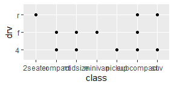
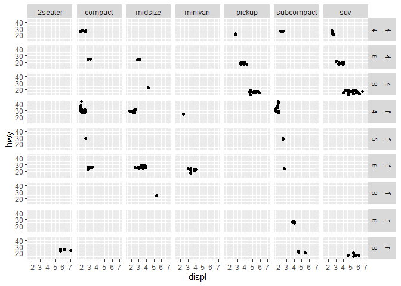
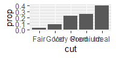
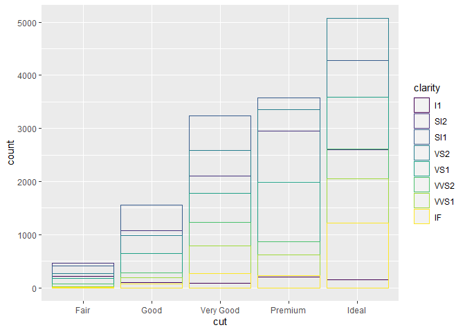
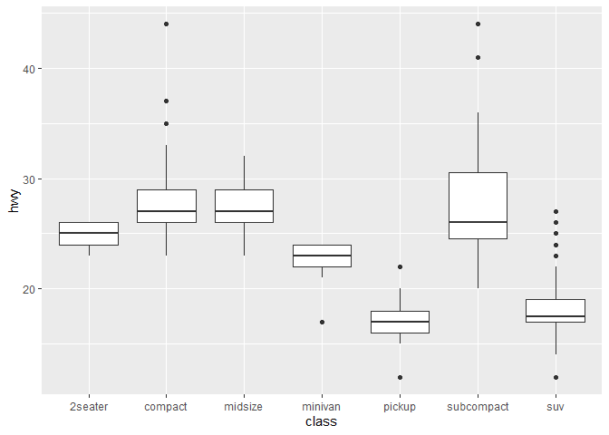
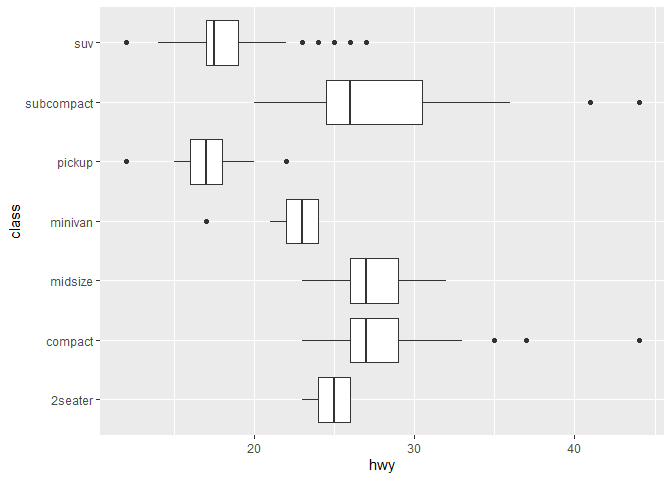
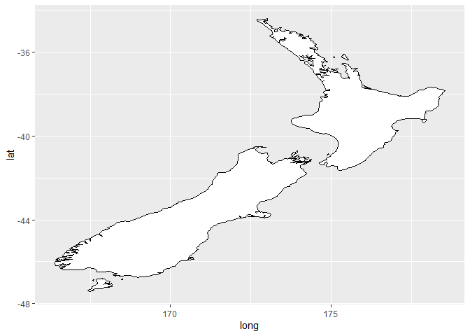

chapter_3\_book
================

``` r
#dataframe
mpg <- ggplot2::mpg
nrow(mpg)
```

    ## [1] 234

``` r
ncol(mpg)
```

    ## [1] 11

``` r
dim(mpg)
```

    ## [1] 234  11

``` r
#drv means the the type of drive train
#cyl is the number of cylinders
#hwy is the highway miles per gallos #cty is the city miles per gallon
```

``` r
ggplot(mpg)
```

<!-- -->

``` r
ggplot(mpg) +
  geom_point(mapping = aes(displ, hwy))
```

<!-- -->

``` r
ggplot(mpg) +
  geom_point(mapping = aes(hwy, cyl))
```

<!-- -->

``` r
ggplot(mpg) +
  geom_point(mapping = aes(class, drv))
```

<!-- -->

``` r
#uses colors to distinguish discrete variable -> class 
ggplot(mpg) +
  geom_point(mapping = aes(displ, hwy, color = class))
```

<!-- -->

``` r
  geom_point(aes(displ, hwy, color = class))
```

    ## mapping: x = ~displ, y = ~hwy, colour = ~class 
    ## geom_point: na.rm = FALSE
    ## stat_identity: na.rm = FALSE
    ## position_identity

``` r
#uses size to distinguish discrete variable -> class 
ggplot(mpg) +
  geom_point(mapping = aes(displ, hwy, size = class))
```

    ## Warning: Using size for a discrete variable is not advised.

<!-- -->

``` r
  geom_point(aes(displ, hwy, size = class))
```

    ## mapping: x = ~displ, y = ~hwy, size = ~class 
    ## geom_point: na.rm = FALSE
    ## stat_identity: na.rm = FALSE
    ## position_identity

``` r
#uses alpha (aesthetic) to distinguish discrete variable -> class 
ggplot(mpg) +
  geom_point(mapping = aes(displ, hwy, alpha = class))
```

    ## Warning: Using alpha for a discrete variable is not advised.

<!-- -->

``` r
  geom_point(aes(displ, hwy, alpha = class))
```

    ## mapping: x = ~displ, y = ~hwy, alpha = ~class 
    ## geom_point: na.rm = FALSE
    ## stat_identity: na.rm = FALSE
    ## position_identity

``` r
#uses shape (aesthetic) to distinguish discrete variable -> class  #ggplot can only use 6 shapes at a time
ggplot(mpg) +
  geom_point(mapping = aes(displ, hwy, shape = class))
```

    ## Warning: The shape palette can deal with a maximum of 6 discrete values because
    ## more than 6 becomes difficult to discriminate; you have 7. Consider
    ## specifying shapes manually if you must have them.

    ## Warning: Removed 62 rows containing missing values (geom_point).

<!-- -->

``` r
  geom_point(aes(displ, hwy, shape = class))
```

    ## mapping: x = ~displ, y = ~hwy, shape = ~class 
    ## geom_point: na.rm = FALSE
    ## stat_identity: na.rm = FALSE
    ## position_identity

``` r
#example how not to define a specific colour for the discrete variable color
ggplot(mpg) +
  geom_point(mapping = aes(displ, hwy, color = "blue"))
```

<!-- -->

``` r
  geom_point(aes(displ, hwy, color = "blue"))
```

    ## mapping: x = ~displ, y = ~hwy, colour = blue 
    ## geom_point: na.rm = FALSE
    ## stat_identity: na.rm = FALSE
    ## position_identity

``` r
#how to use a specific colors to distinguish discrete variable -> class 
ggplot(mpg) +
  geom_point(mapping = aes(displ, hwy), color = "blue")
```

<!-- -->

``` r
  geom_point(aes(displ, hwy), color = "blue")
```

    ## mapping: x = ~displ, y = ~hwy 
    ## geom_point: na.rm = FALSE
    ## stat_identity: na.rm = FALSE
    ## position_identity

``` r
#3.3.1.1 see answer in chunk above
#3.3.1.2 
# categorical: model,manufacturer,Trans, drv,fl,class
# continuous: displ, year, cyl, cty, hwy
#3.3.1.3
#continous
#cyl
ggplot(mpg) +
  geom_point(mapping = aes(displ, hwy, color = cyl))
```

<!-- -->

``` r
ggplot(mpg) +
  geom_point(mapping = aes(displ, hwy, size = cyl))
```

<!-- -->

``` r
#a continous variable cannot be mapped to a schape
#ggplot(mpg) +
  #geom_point(mapping = aes(displ, hwy, shape = cyl))
#cty
ggplot(mpg) +
  geom_point(mapping = aes(displ, hwy, color = cty))
```

<!-- -->

``` r
ggplot(mpg) +
  geom_point(mapping = aes(displ, hwy, size = cty))
```

<!-- -->

``` r
#year
ggplot(mpg) +
  geom_point(mapping = aes(displ, hwy, color = year))
```

<!-- -->

``` r
ggplot(mpg) +
  geom_point(mapping = aes(displ, hwy, size = year))
```

<!-- -->

``` r
#combining aes 
ggplot(mpg) +
  geom_point(mapping = aes(displ, hwy, color = year, size = year))
```

<!-- -->

``` r
#Discrete/categorical
#model
ggplot(mpg) +
  geom_point(mapping = aes(displ, hwy, color = model))
```

<!-- -->

``` r
ggplot(mpg) +
  geom_point(mapping = aes(displ, hwy, size = model))
```

    ## Warning: Using size for a discrete variable is not advised.

<!-- -->

``` r
ggplot(mpg) +
  geom_point(mapping = aes(displ, hwy, shape = model))
```

    ## Warning: The shape palette can deal with a maximum of 6 discrete values because
    ## more than 6 becomes difficult to discriminate; you have 38. Consider
    ## specifying shapes manually if you must have them.

    ## Warning: Removed 199 rows containing missing values (geom_point).

<!-- -->

``` r
#trans
ggplot(mpg) +
  geom_point(mapping = aes(displ, hwy, color = trans))
```

<!-- -->

``` r
ggplot(mpg) +
  geom_point(mapping = aes(displ, hwy, size = trans))
```

    ## Warning: Using size for a discrete variable is not advised.

<!-- -->

``` r
ggplot(mpg) +
  geom_point(mapping = aes(displ, hwy, shape = trans))
```

    ## Warning: The shape palette can deal with a maximum of 6 discrete values because
    ## more than 6 becomes difficult to discriminate; you have 10. Consider
    ## specifying shapes manually if you must have them.

    ## Warning: Removed 96 rows containing missing values (geom_point).

<!-- -->

``` r
#drv
ggplot(mpg) +
  geom_point(mapping = aes(displ, hwy, color = drv))
```

<!-- -->

``` r
ggplot(mpg) +
  geom_point(mapping = aes(displ, hwy, size = drv))
```

    ## Warning: Using size for a discrete variable is not advised.

<!-- -->

``` r
ggplot(mpg) +
  geom_point(mapping = aes(displ, hwy, shape = drv))
```

<!-- -->

``` r
# combining aes
ggplot(mpg) +
  geom_point(mapping = aes(displ, hwy, color = drv, shape = drv))
```

<!-- -->

``` r
ggplot(mpg) +
  geom_point(mapping = aes(displ, hwy, color = cyl, alpha = cyl))
```

<!-- -->

``` r
ggplot(mpg) + 
  geom_point(mapping = aes(displ, hwy, stroke = displ))
```

<!-- -->

``` r
?geom_point
```

    ## starting httpd help server ... done

``` r
#stroke uses different sizes of dots for the categories of the data point

#Sizes defines the size and stroke and allows them to be used by referring to sizes
sizes <- expand.grid(size = (0:3) * 2, stroke = (0:3) * 2)

ggplot(sizes, aes(size, stroke, size = size, stroke = stroke)) + 
  geom_abline(slope = -1, intercept = 6, colour = "white", size = 6) + 
  geom_point(shape = 21, fill = "red") +
  scale_size_identity()
```

<!-- -->

``` r
ggplot(mpg) +
  geom_point(aes(displ, hwy, colour = displ < 5))
```

<!-- -->

``` r
#ggplot(mpg) +
  #geom_point(aes(displ, hwy), colour = displ < 5)
#colour needs to be inside the aes

ggplot(mpg) +
  geom_point(aes(displ, hwy, colour = displ < 5), stroke = 5)
```

<!-- -->

``` r
#stroke can be placed outside aes
```

``` r
#3.5 facets examples
ggplot(mpg) + 
  geom_point(aes(x = displ, y = hwy)) + 
  facet_wrap(~ class, nrow = 2)
```

<!-- -->

``` r
#facetwrap variable should be a discrete variable
#below code for facetwrap of 2 variables
ggplot(mpg) + 
  geom_point(aes(x = displ, y = hwy)) + 
  facet_grid(drv ~ cyl)
```

<!-- -->

``` r
#facet wrap for 3 variables
ggplot(mpg) + 
  geom_point(aes(x = displ, y = hwy)) + 
  facet_grid(drv ~ cyl ~ class)
```

<!-- -->

``` r
#facets in one dimension
ggplot(mpg) + 
  geom_point(aes(x = displ, y = hwy)) + 
  facet_grid(. ~ class)
```

<!-- -->

``` r
#exercises 3.5.1.1
#facet wrap on a continous variable
#ggplot(mpg) + 
  #geom_point(aes(x = displ, y = hwy)) + 
  #facet_wrap(~ yeaar, nrow = 2)
#answer 3.5.1: leads to an error

#ex 3.5.1.
ggplot(mpg) + 
  geom_point(aes(x = displ, y = hwy)) + 
  facet_grid(drv ~ cyl)
```

<!-- -->

``` r
#versus
ggplot(mpg) + 
  geom_point(aes(x = drv, y = cyl))
```

<!-- -->

``` r
#the facetted plot shows also the amount of data points, the non-facetted one shows only presence in a category. the empty cells mean that there is no data fore/the combination of variables does not exist

#3.5.1.3
ggplot( mpg) + 
  geom_point(mapping = aes(x = displ, y = hwy)) +
  facet_grid(drv ~ .)
```

<!-- -->

``` r
ggplot( mpg) + 
  geom_point(mapping = aes(x = displ, y = hwy)) +
  facet_grid(. ~ cyl)
```

<!-- -->

``` r
#these plots show how to whether to plot the rows or the columns in you facet


#3.5.1.4
ggplot( mpg) + 
  geom_point(mapping = aes(x = displ, y = hwy)) + 
  facet_wrap(~ class, nrow = 2)
```

<!-- -->

``` r
#Orientation: row ~ col
#facets can be used to isolates groups of interest, easy visualize 

#3.5.1.5
ggplot( mpg) + 
  geom_point(mapping = aes(x = displ, y = hwy)) + 
  facet_wrap(~ class, nrow = 1)
```

<!-- -->

``` r
ggplot( mpg) + 
  geom_point(mapping = aes(x = displ, y = hwy)) + 
  facet_wrap(~ class, ncol = 1)
```

<!-- -->

``` r
#using ncol and nrow you can determine the dimensions of the facet 
#facet_wrap wraps a 1d panel in to a 2d panel and used ncol and nrow, so you can customize
#facet_grid forms a matrix of panels 
```

``` r
#3.6 examples
#scatter using geom_point
ggplot(mpg) + 
  geom_point(aes(x = displ, y = hwy))
```

<!-- -->

``` r
#line plot using geom_smooth
ggplot(mpg) + 
  geom_smooth(aes(x = displ, y = hwy))
```

    ## `geom_smooth()` using method = 'loess' and formula 'y ~ x'

<!-- -->

``` r
#line plot with different linetypes
ggplot(mpg) + 
  geom_smooth(aes(x = displ, y = hwy, linetype = drv))
```

    ## `geom_smooth()` using method = 'loess' and formula 'y ~ x'

<!-- -->

``` r
ggplot(mpg) +
  geom_smooth(aes(x = displ, y = hwy))
```

    ## `geom_smooth()` using method = 'loess' and formula 'y ~ x'

<!-- -->

``` r
#plots the groups of drv within x and y             
ggplot(mpg) +
  geom_smooth(aes(x = displ, y = hwy, group = drv))
```

    ## `geom_smooth()` using method = 'loess' and formula 'y ~ x'

<!-- -->

``` r
#colors different lines    
ggplot(mpg) +
  geom_smooth(
    aes(x = displ, y = hwy, color = drv),
    show.legend = FALSE
  )
```

    ## `geom_smooth()` using method = 'loess' and formula 'y ~ x'

<!-- -->

``` r
#plotting both scatter and lines in one figure
ggplot(data = mpg) + 
  geom_point(mapping = aes(x = displ, y = hwy)) +
  geom_smooth(mapping = aes(x = displ, y = hwy))
```

    ## `geom_smooth()` using method = 'loess' and formula 'y ~ x'

<!-- -->

``` r
#simpifies the code above
ggplot(mpg, aes(x = displ, y = hwy)) + 
  geom_point() + 
  geom_smooth()
```

    ## `geom_smooth()` using method = 'loess' and formula 'y ~ x'

<!-- -->

``` r
#different settings can be used for the type of plotting with plotting the data only once
ggplot(data = mpg, mapping = aes(x = displ, y = hwy)) + 
  geom_point(mapping = aes(color = class)) + 
  geom_smooth()
```

    ## `geom_smooth()` using method = 'loess' and formula 'y ~ x'

<!-- -->

``` r
ggplot(data = mpg, mapping = aes(x = displ, y = hwy)) + 
  geom_point(mapping = aes(color = class)) + 
  geom_smooth(data = filter(mpg, class == "subcompact"), se = FALSE)
```

    ## `geom_smooth()` using method = 'loess' and formula 'y ~ x'

<!-- -->

``` r
#writing the plot this way allows for customizable settings for each layer
```

``` r
#exercises 3.6
#3.6.1.1
#lineplot
ggplot(mpg) + 
  geom_smooth(aes(displ, hwy))
```

    ## `geom_smooth()` using method = 'loess' and formula 'y ~ x'

<!-- -->

``` r
#or
ggplot(mpg) + 
  geom_line(aes(displ, hwy))
```

<!-- -->

``` r
#boxplot
ggplot(mpg) + 
  geom_boxplot(aes(displ, hwy))
```

    ## Warning: Continuous x aesthetic -- did you forget aes(group=...)?

<!-- -->

``` r
#histogram
ggplot(mpg,aes(displ)) + 
  geom_histogram()
```

    ## `stat_bin()` using `bins = 30`. Pick better value with `binwidth`.

<!-- -->

``` r
#playing around
ggplot(mpg) + 
  geom_histogram(aes(displ)) +
  geom_histogram(aes(hwy)) +
  facet_grid(~ hwy)
```

    ## `stat_bin()` using `bins = 30`. Pick better value with `binwidth`.

    ## `stat_bin()` using `bins = 30`. Pick better value with `binwidth`.

<!-- -->

``` r
ggplot(mpg) + 
  geom_histogram(aes(displ)) +
  geom_histogram(aes(hwy)) +
  facet_grid(~ class)
```

    ## `stat_bin()` using `bins = 30`. Pick better value with `binwidth`.
    ## `stat_bin()` using `bins = 30`. Pick better value with `binwidth`.

<!-- -->

``` r
ggplot(mpg) + 
  geom_histogram(aes(displ)) +
  geom_histogram(aes(hwy)) +
  facet_wrap(~ class, ncol = 4)
```

    ## `stat_bin()` using `bins = 30`. Pick better value with `binwidth`.
    ## `stat_bin()` using `bins = 30`. Pick better value with `binwidth`.

<!-- -->

``` r
#areachart
ggplot(mpg, aes(displ, hwy)) + 
  geom_area()
```

<!-- -->

``` r
#or geom ribbon
ggplot(mpg, aes(displ, hwy, ymin=0 , ymax=50)) + 
  geom_ribbon()
```

<!-- -->

``` r
#for ribbon to look good I probably need to write dat/level to plot

#3.6.1.2
ggplot(mpg, aes(x = displ, y = hwy, color = drv)) + 
  geom_point() + 
  geom_smooth(se = FALSE)
```

    ## `geom_smooth()` using method = 'loess' and formula 'y ~ x'

<!-- -->

``` r
#predicted the outcome
ggplot(mpg, aes(x = displ, y = hwy, color = drv)) + 
  geom_point(show.legend = FALSE) + 
  geom_smooth(show.legend = FALSE)
```

    ## `geom_smooth()` using method = 'loess' and formula 'y ~ x'

<!-- -->

``` r
#3.6.1.3. show legend is false removes the legend/does not show the legend
#3.6.1.4.the se argument shows the standard error

#3.6.1.5
#they won't look different, below is jsut 2 diff. ways of plotting the same
ggplot(data = mpg, mapping = aes(x = displ, y = hwy)) + 
  geom_point() + 
  geom_smooth()
```

    ## `geom_smooth()` using method = 'loess' and formula 'y ~ x'

<!-- -->

``` r
ggplot() + 
  geom_point(data = mpg, mapping = aes(x = displ, y = hwy)) + 
  geom_smooth(data = mpg, mapping = aes(x = displ, y = hwy))
```

    ## `geom_smooth()` using method = 'loess' and formula 'y ~ x'

<!-- -->

``` r
#3.6.1.6
#plot 1
ggplot(mpg, aes(displ,hwy)) + 
  geom_point(stroke = 3.5, show.legend = FALSE) + 
  geom_smooth(se = FALSE, show.legend = FALSE)
```

    ## `geom_smooth()` using method = 'loess' and formula 'y ~ x'

<!-- -->

``` r
#plot 2
ggplot(mpg, aes(displ,hwy, line = drv)) + 
  geom_point(stroke = 3.5, show.legend = FALSE) + 
  geom_smooth(se = FALSE, show.legend = FALSE)
```

    ## `geom_smooth()` using method = 'loess' and formula 'y ~ x'

<!-- -->

``` r
#plot 3
ggplot(mpg, aes(displ,hwy, color = drv)) + 
  geom_point(stroke = 3.5) + 
  geom_smooth(se = FALSE)
```

    ## `geom_smooth()` using method = 'loess' and formula 'y ~ x'

<!-- -->

``` r
#plot 4
ggplot(mpg, aes(displ,hwy)) + 
  geom_point(aes(color = drv), stroke = 3.5) + 
  geom_smooth(se = FALSE)
```

    ## `geom_smooth()` using method = 'loess' and formula 'y ~ x'

<!-- -->

``` r
#plot 5
ggplot(mpg, aes(displ,hwy, linetype= drv)) + 
  geom_point(aes(color = drv), stroke = 3.5) + 
  geom_smooth(se = FALSE)
```

    ## `geom_smooth()` using method = 'loess' and formula 'y ~ x'

<!-- -->

``` r
#plot 6
ggplot(mpg, aes(displ,hwy, fill = drv)) + 
  geom_point(color = "white", size = 3.5, stroke = 3.5)
```

<!-- -->

``` r
ggplot(mpg, aes(displ,hwy, fill = drv)) + 
  geom_point(shape  = 21, color = "white", size = 3.5, stroke = 3.5)
```

<!-- -->

``` r
#without defining shapes drv does not get coloured.
```

``` r
#3.7 examples
diamonds <- ggplot2::diamonds

ggplot(diamonds) +
  geom_bar(mapping = aes(x = cut))
```

<!-- -->

``` r
ggplot(data = diamonds) + 
  stat_count(mapping = aes(x = cut))
```

<!-- -->

``` r
demo <- tribble(
  ~cut,         ~freq,
  "Fair",       1610,
  "Good",       4906,
  "Very Good",  12082,
  "Premium",    13791,
  "Ideal",      21551
)

ggplot(demo) +
  geom_bar(mapping = aes(cut, freq), stat = "identity")
```

<!-- -->

``` r
ggplot(diamonds) + 
  geom_bar(mapping = aes(cut, stat(prop), group = 1))
```

<!-- -->

``` r
ggplot(diamonds) + 
  stat_summary(
    mapping = aes(cut, depth),
    fun.min = min,
    fun.max = max,
    fun = median
  )
```

<!-- -->

``` r
#exercises 3.7

#3.7.1.1
?stat_summary
#pointrange is the default geom
#rewrite
ggplot(diamonds, aes(cut, depth)) + 
  geom_pointrange(aes(ymin = depth, ymax = depth))
```

<!-- -->

``` r
#3.7.1.2
#geom_col
ggplot(diamonds, aes(cut, depth)) + 
  geom_col()
```

<!-- -->

``` r
#there are no differences

ggplot(diamonds, aes(cut, depth)) + 
  stat_smooth(aes(depth, ymin = depth, ymax = depth))
```

    ## `geom_smooth()` using method = 'gam' and formula 'y ~ s(x, bs = "cs")'

<!-- -->

``` r
#stat_smooth is controlled bij x or y, and x/y min and max

#3.7.1.5
ggplot(data = diamonds) + 
  geom_bar(mapping = aes(x = cut, y = after_stat(prop)))
```

<!-- -->

``` r
ggplot(data = diamonds) + 
  geom_bar(mapping = aes(x = cut, fill = color, y = after_stat(prop)))
```

<!-- -->

``` r
#Examples 3.8
ggplot(diamonds) + 
  geom_bar(aes(x = cut, colour = cut))
```

<!-- -->

``` r
ggplot(diamonds) + 
  geom_bar(aes(x = cut, fill = cut))
```

<!-- -->

``` r
ggplot(data = diamonds) + 
  geom_bar(mapping = aes(x = cut, fill = clarity))
```

<!-- -->

``` r
#identity allows for overlapping in the case of bar graphs
ggplot(data = diamonds, mapping = aes(x = cut, fill = clarity)) + 
  geom_bar(alpha = 1/5, position = "identity")
```

<!-- -->

``` r
ggplot(data = diamonds, mapping = aes(x = cut, colour = clarity)) + 
  geom_bar(fill = NA, position = "identity")
```

<!-- -->

``` r
#sets bar to the same height, comparisons for proportions
ggplot(data = diamonds) + 
  geom_bar(mapping = aes(x = cut, fill = clarity), position = "fill")
```

<!-- -->

``` r
#dodge places overlapping objects beside one another
ggplot(data = diamonds) + 
  geom_bar(mapping = aes(x = cut, fill = clarity), position = "dodge")
```

<!-- -->

``` r
#Jitter prevents overplotting of scatterpoints
ggplot(mpg) + 
  geom_point(aes(displ, hwy), position = "jitter")
```

<!-- -->

``` r
#Exercises 3.8
#3.8.1.1
ggplot(mpg, aes(cty, hwy)) + 
  geom_point(position = "jitter")
```

<!-- -->

``` r
ggplot(mpg, aes(cty, hwy)) + 
  geom_point(aes(colour = class), position = "jitter")
```

<!-- -->

``` r
#3.8.1.2.
#alpha/colour/fill/group/shape/size/stroke are the parameters of jitter and x (or) y
#3.8.1.3
ggplot(mpg, aes(cty, hwy)) + 
  geom_count(position = "jitter")
```

<!-- -->

``` r
ggplot(mpg, aes(cty, hwy)) + 
  geom_count(aes(colour = class), position = "jitter")
```

<!-- -->

``` r
#3.8.1.4
ggplot(mpg, aes(cty, hwy))+
  geom_boxplot()
```

    ## Warning: Continuous x aesthetic -- did you forget aes(group=...)?

<!-- -->

``` r
ggplot(mpg, aes(cty, hwy))+
  geom_boxplot(position = "dodge")
```

    ## Warning: Continuous x aesthetic -- did you forget aes(group=...)?

<!-- -->

``` r
ggplot(mpg, aes(cty, hwy))+
  geom_boxplot(position = "identity")
```

    ## Warning: Continuous x aesthetic -- did you forget aes(group=...)?

<!-- -->

``` r
ggplot(mpg, aes(displ, hwy))+
  geom_boxplot()
```

    ## Warning: Continuous x aesthetic -- did you forget aes(group=...)?

<!-- -->

``` r
ggplot(mpg, aes(displ, hwy))+
  geom_boxplot(position = "dodge")
```

    ## Warning: Continuous x aesthetic -- did you forget aes(group=...)?

<!-- -->

``` r
ggplot(mpg, aes(displ, hwy))+
  geom_boxplot(position = "identity")
```

    ## Warning: Continuous x aesthetic -- did you forget aes(group=...)?

<!-- -->

``` r
#no position adjusment or is it dodge
```

``` r
ggplot(mpg, aes(cty, hwy))+
  geom_boxplot(aes(group = class))
```

<!-- -->

``` r
ggplot(mpg, aes(cty, hwy))+
  geom_boxplot(aes(group = class), position = "dodge")
```

    ## Warning: position_dodge requires non-overlapping x intervals

<!-- -->

``` r
ggplot(mpg, aes(cty, hwy))+
  geom_boxplot(aes(group = class), position = "identity")
```

<!-- -->

``` r
ggplot(mpg, aes(displ, hwy))+
  geom_boxplot(aes(group = class))
```

<!-- -->

``` r
ggplot(mpg, aes(displ, hwy))+
  geom_boxplot(aes(group = class), position = "dodge")
```

    ## Warning: position_dodge requires non-overlapping x intervals

<!-- -->

``` r
ggplot(mpg, aes(displ, hwy))+
  geom_boxplot(aes(group = class), position = "identity")
```

<!-- -->

``` r
#Examples 3.9
ggplot(data = mpg, mapping = aes(x = class, y = hwy)) + 
  geom_boxplot()
```

<!-- -->

``` r
ggplot(data = mpg, mapping = aes(x = class, y = hwy)) + 
  geom_boxplot() +
  coord_flip()
```

<!-- -->

``` r
nz <- map_data("nz")

ggplot(nz, aes(long, lat, group = group)) +
  geom_polygon(fill = "white", colour = "black")
```

<!-- -->

``` r
ggplot(nz, aes(long, lat, group = group)) +
  geom_polygon(fill = "white", colour = "black") +
  coord_quickmap()
```

<!-- -->

``` r
bar <- ggplot(data = diamonds) + 
  geom_bar(
    mapping = aes(x = cut, fill = cut), 
    show.legend = FALSE,
    width = 1
  ) + 
  theme(aspect.ratio = 1) +
  labs(x = NULL, y = NULL)

bar + coord_flip()
```

<!-- -->

``` r
bar + coord_polar()
```

<!-- -->

``` r
#3.9.1.1
bar2 <- ggplot(data = diamonds) + 
  geom_bar(mapping = aes(x = cut, fill = color, y = after_stat(prop)))

bar2 + coord_flip()
```

<!-- -->

``` r
bar2 + coord_polar()
```

<!-- -->

``` r
#3.9.1.2
#labs() makes labels for graphs/figures

#3.9.1.3
ggplot(nz, aes(long, lat, group = group)) +
  geom_polygon(fill = "white", colour = "black") +
  coord_quickmap()
```

<!-- -->

``` r
ggplot(nz, aes(long, lat, group = group)) +
  geom_polygon(fill = "white", colour = "black") +
  coord_map()
```

<!-- -->

``` r
# the difference is the size of the image/the grid in the background

#3.9.1.4
ggplot(data = mpg, mapping = aes(x = cty, y = hwy)) +
  geom_point() + 
  geom_abline() +
  coord_fixed()
```

<!-- -->

``` r
#without coord_fixed it does not run, coord_fixed is responsible for a fixed scale.
#that it is linear correlated
#geom_abline adds definitions (rules) to the plot
```
