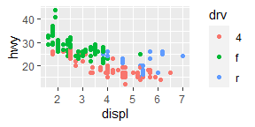

chapter_3\_book
================

``` r
#dataframe
mpg <- ggplot2::mpg
nrow(mpg)
```

    ## [1] 234

``` r
ncol(mpg)
```

    ## [1] 11

``` r
dim(mpg)
```

    ## [1] 234  11

``` r
#drv means the the type of drive train
#cyl is the number of cylinders
#hwy is the highway miles per gallos #cty is the city miles per gallon
```

``` r
ggplot(mpg)
```

<!-- -->

``` r
ggplot(mpg) +
  geom_point(mapping = aes(displ, hwy))
```

<!-- -->

``` r
ggplot(mpg) +
  geom_point(mapping = aes(hwy, cyl))
```

<!-- -->

``` r
ggplot(mpg) +
  geom_point(mapping = aes(class, drv))
```

<!-- -->

``` r
#uses colors to distinguish discrete variable -> class 
ggplot(mpg) +
  geom_point(mapping = aes(displ, hwy, color = class))
```

<!-- -->

``` r
#uses size to distinguish discrete variable -> class 
ggplot(mpg) +
  geom_point(mapping = aes(displ, hwy, size = class))
```

    ## Warning: Using size for a discrete variable is not advised.

<!-- -->

``` r
#uses alpha (aesthetic) to distinguish discrete variable -> class 
ggplot(mpg) +
  geom_point(mapping = aes(displ, hwy, alpha = class))
```

    ## Warning: Using alpha for a discrete variable is not advised.

<!-- -->

``` r
#uses shape (aesthetic) to distinguish discrete variable -> class  #ggplot can only use 6 shapes at a time
ggplot(mpg) +
  geom_point(mapping = aes(displ, hwy, shape = class))
```

    ## Warning: The shape palette can deal with a maximum of 6 discrete values because
    ## more than 6 becomes difficult to discriminate; you have 7. Consider
    ## specifying shapes manually if you must have them.

    ## Warning: Removed 62 rows containing missing values (geom_point).

<!-- -->

``` r
#example how not to define a specific colour for the discrete variable color
ggplot(mpg) +
  geom_point(mapping = aes(displ, hwy, color = "blue"))
```

<!-- -->

``` r
#how to use a specific colors to distinguish discrete variable -> class 
ggplot(mpg) +
  geom_point(mapping = aes(displ, hwy), color = "blue")
```

<!-- -->

``` r
#3.3.1.1 see answer in chunk above
#3.3.1.2 
# categorical: model,manufacturer,Trans, drv,fl,class
# continuous: displ, year, cyl, cty, hwy
#3.3.1.3
#continous
#cyl
ggplot(mpg) +
  geom_point(mapping = aes(displ, hwy, color = cyl))
```

<!-- -->

``` r
ggplot(mpg) +
  geom_point(mapping = aes(displ, hwy, size = cyl))
```

<!-- -->

``` r
#a continous variable cannot be mapped to a schape
#ggplot(mpg) +
  #geom_point(mapping = aes(displ, hwy, shape = cyl))
#cty
ggplot(mpg) +
  geom_point(mapping = aes(displ, hwy, color = cty))
```

<!-- -->

``` r
ggplot(mpg) +
  geom_point(mapping = aes(displ, hwy, size = cty))
```

<!-- -->

``` r
#year
ggplot(mpg) +
  geom_point(mapping = aes(displ, hwy, color = year))
```

<!-- -->

``` r
ggplot(mpg) +
  geom_point(mapping = aes(displ, hwy, size = year))
```

<!-- -->

``` r
#Discrete/categorical
#model
ggplot(mpg) +
  geom_point(mapping = aes(displ, hwy, color = model))
```

<!-- -->

``` r
ggplot(mpg) +
  geom_point(mapping = aes(displ, hwy, size = model))
```

    ## Warning: Using size for a discrete variable is not advised.

<!-- -->

``` r
ggplot(mpg) +
  geom_point(mapping = aes(displ, hwy, shape = model))
```

    ## Warning: The shape palette can deal with a maximum of 6 discrete values because
    ## more than 6 becomes difficult to discriminate; you have 38. Consider
    ## specifying shapes manually if you must have them.

    ## Warning: Removed 199 rows containing missing values (geom_point).

<!-- -->

``` r
#trans
ggplot(mpg) +
  geom_point(mapping = aes(displ, hwy, color = trans))
```

<!-- -->

``` r
ggplot(mpg) +
  geom_point(mapping = aes(displ, hwy, size = trans))
```

    ## Warning: Using size for a discrete variable is not advised.

<!-- -->

``` r
ggplot(mpg) +
  geom_point(mapping = aes(displ, hwy, shape = trans))
```

    ## Warning: The shape palette can deal with a maximum of 6 discrete values because
    ## more than 6 becomes difficult to discriminate; you have 10. Consider
    ## specifying shapes manually if you must have them.

    ## Warning: Removed 96 rows containing missing values (geom_point).

<!-- -->

``` r
#drv
ggplot(mpg) +
  geom_point(mapping = aes(displ, hwy, color = drv))
```

<!-- -->

``` r
ggplot(mpg) +
  geom_point(mapping = aes(displ, hwy, size = drv))
```

    ## Warning: Using size for a discrete variable is not advised.

<!-- -->

``` r
ggplot(mpg) +
  geom_point(mapping = aes(displ, hwy, shape = drv))
```

<!-- -->
